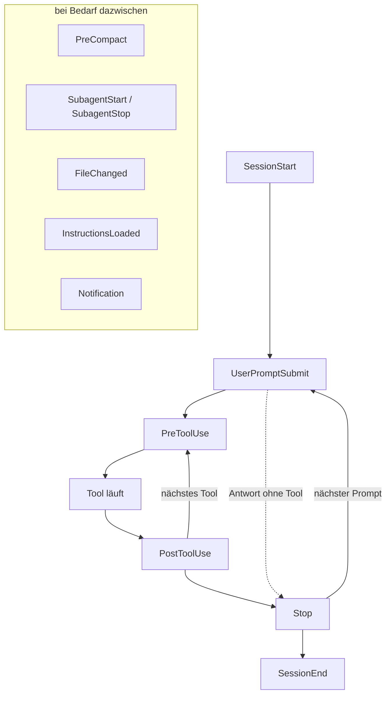

# S2.7 · Die wichtigsten Hook-Ereignisse

<!-- meta:start -->
> **Regal:** [Hooks](README.md#hooks) · **Stufe:** Kern · **~20 Min** · **Voraussetzungen:** [S2.6 Hooks als Sensoren: die drei Eckpfeiler](s2-06-hooks-als-sensoren.md)
>
> ← [S2.6 Hooks als Sensoren: die drei Eckpfeiler](s2-06-hooks-als-sensoren.md) · [Bibliothek](README.md) · [S2.8 Einen Hook einrichten, der wirklich blockt](s2-08-hook-einrichten.md) →
<!-- meta:end -->

## Schnellcheck

- Kannst du ohne Nachschlagen sagen, welches Ereignis feuert, bevor Claude deinen Prompt sieht?
- Kannst du sagen, welches Ereignis vor dem Komprimieren des Kontexts feuert und wofür du es nutzt?

## Auf einen Blick

Hook-Ereignisse decken den ganzen Lebenslauf einer Sitzung ab: SessionStart und SessionEnd klammern die Sitzung, UserPromptSubmit feuert, bevor Claude deinen Prompt sieht, PreCompact kommt vor dem Komprimieren des Kontexts, SubagentStart und SubagentStop begleiten Subagenten, FileChanged reagiert auf Änderungen von außen. Das richtige Ereignis zu wählen entscheidet: Eine Prüfung auf Secrets im Prompt gehört an UserPromptSubmit, nicht an PreToolUse, denn das Secret steht schon im Prompt, bevor überhaupt ein Tool-Aufruf entsteht. Für den Anfang reichen vier neue Ereignisse: SessionStart, UserPromptSubmit, PreCompact und SessionEnd. Der Rest ist eine Tabelle zum Nachschlagen.

## Bild im Kopf

PreToolUse ist der Kartenleser, der die Berechtigung prüft, *bevor* die Tür aufschließt, PostToolUse der Türkontakt, der das Ereignis *danach* protokolliert. Dazu kommen die Ereignisse rund um die Schicht: SessionStart ist das Briefing zu Schichtbeginn, UserPromptSubmit der Pförtner, der jeden Besucher am Eingang anspricht, bevor er im Gebäude ist, PreCompact der Moment, bevor ein Wachmann seine Notizen übergibt (was wichtig ist, muss aufgeschrieben sein, bevor es verblasst), und SessionEnd das Schließen des Übergabeprotokolls.



## Im Detail

### Zwölf Ereignisse im Überblick

Die offizielle Doku führt deutlich mehr Ereignisse, als du im Alltag brauchst; die vollständige Liste steht in der [Hooks-Referenz](https://code.claude.com/docs/en/hooks). Diese Tabelle nennt die zwölf, zu denen du am häufigsten greifst. Lies sie als Nachschlagewerk: Auswendig lernen musst du nur, wie du zu einer Aufgabe das Ereignis findest.

| Ereignis | Wann es feuert | Typischer Einsatz |
|-------|---------------|------------------|
| **PreToolUse** | Bevor Claude ein Tool nutzt (Bash, Edit, MCP-Aufruf). **Kann blocken**: über den Exit-Code allein nur mit **2**, daneben per JSON-Entscheidung ([S2.10](s2-10-hook-ausgaben.md)) | Gefährliche Befehle verhindern, ein Review vor dem Deploy erzwingen, unumkehrbare Aktionen bestätigen lassen |
| **PostToolUse** | Nachdem ein Tool-Aufruf erfolgreich war. Bei einem Fehlschlag feuert stattdessen PostToolUseFailure | Audit-Log erfolgreicher Änderungen, Slack-Nachricht bei grünen Tests, Dashboard aktualisieren |
| **Stop** | Claude hat eine Antwort beendet und wartet auf deinen nächsten Prompt; nicht nach einem Abbruch durch dich | Zusammenfassungen, Aufräumarbeiten, Statusmeldungen |
| **SessionStart** | Bei jedem Start einer Sitzung, auch beim Fortsetzen, nach `/clear` und nach dem Komprimieren | Briefing-Hook: Projektstatus ausgeben, `git status` prüfen, kontrollieren, ob die Abhängigkeiten installiert sind |
| **SessionEnd** | Die Sitzung endet (du beendest sie, `/clear`, Wechsel per `/resume`) | Abschluss-Hook: Sitzungszusammenfassung sichern, Logs archivieren |
| **UserPromptSubmit** | Du schickst einen Prompt ab (bevor Claude ihn sieht) | Prompt prüfen, Kontext ergänzen (aktueller Branch, Ticket-ID), Prompts mit Secrets abweisen |
| **PreCompact** | Kurz bevor der Kontext komprimiert wird, um Platz zu schaffen | Wichtigen Zustand auf die Platte schreiben, bevor er weggefasst wird |
| **SubagentStart** | Ein Subagent wird gestartet | Zusätzliche Anweisungen mitgeben, Delegation loggen, Beobachter anhängen |
| **SubagentStop** | Ein Subagent ist fertig | Abschlussbericht des Subagenten sichern, ins Audit-Log schreiben |
| **FileChanged** | Eine beobachtete Datei ändert sich (externer Editor, `git pull`, Watcher) | Auf Änderungen von außen reagieren, Tests neu starten, Caches verwerfen |
| **InstructionsLoaded** | Nachdem CLAUDE.md und `.claude/rules/` geladen sind | Nachsehen, was wirklich im Kontext gelandet ist, wirksame Anweisungen loggen |
| **Notification** | Claude meldet etwas (lange Aufgabe fertig, Freigabe nötig) | Per Pushover aufs Handy schicken, an Slack weiterleiten, das Licht blinken lassen |

Subagenten behandelt [S3.3](s3-03-eigener-subagent.md); hier genügt: Ein Subagent ist ein von Claude gestarteter Helfer mit eigener Aufgabe.

**UserPromptSubmit schreibt nicht um.** Ein Hook an diesem Ereignis kann einen Prompt abweisen oder Kontext daneben legen, aber er kann den Prompt nicht verändern, also auch kein Secret darin schwärzen. Tool-Ausgaben schwärzen kannst du mit PostToolUse ([S2.10](s2-10-hook-ausgaben.md)).

**Text aus SessionStart und UserPromptSubmit landet im Kontext.** Gibt ein Hook an diesen Ereignissen schlichten Text aus, legt Claude Code ihn als Kontext neben die Anfrage, und Claude kann darauf eingehen. Für festen Text ist die CLAUDE.md der einfachere Weg ([S1.10](s1-10-claude-md.md)); ein Hook lohnt, wenn ein Skript jedes Mal etwas Frisches holt, etwa `git status`.

### PreCompact bei langen Sitzungen

Beim Komprimieren fasst Claude Code den bisherigen Kontext zusammen, um Platz zu schaffen. Was nur im Kontext stand, ist danach bestenfalls zusammengefasst. Ein PreCompact-Hook schreibt vorher auf die Platte, was nicht verloren gehen darf. Endet er mit `exit 2`, blockt er das Komprimieren. Wie du den Kontext selbst steuerst, zeigt [S1.9](s1-09-kontext-steuern.md).

### SessionEnd hat wenig Zeit

SessionEnd-Hooks können die Beendigung nicht verhindern, und sie haben standardmäßig 1,5 Sekunden. Für Archivarbeit, die länger dauert, setzt du am Hook ein größeres `timeout`; sonst bricht Claude Code ihn ab.

## Selbst machen

### Übung: Briefing und Ticket-Notiz (etwa 10 Minuten)

**Ziel:** Du trägst einen SessionStart- und einen UserPromptSubmit-Hook ein, siehst, dass Claude ihren Text ohne Werkzeug kennt, und liest an einer Logdatei, wie oft jeder feuert.

**Startzustand:** ein neuer Ordner `~/cc-workshop/ereignisse` (`mkdir -p ~/cc-workshop/ereignisse/.claude && cd ~/cc-workshop/ereignisse`, in PowerShell `New-Item -ItemType Directory -Force "$HOME\cc-workshop\ereignisse\.claude"; Set-Location "$HOME\cc-workshop\ereignisse"`). Die Hooks sind `echo`-Befehle und laufen in Git Bash und in PowerShell gleich; du brauchst kein `jq`.

1. Leg von Hand die Datei `.claude/settings.json` an (`.claude` ist ein geschützter Pfad). Jeder Hook gibt einen Satz aus, den Claude nicht erraten kann, und hängt ein Stichwort an `hook-log.txt`:

   <!-- cockpit:example -->
   ```json
   {
     "hooks": {
       "SessionStart": [
         {
           "hooks": [{"type": "command", "command": "echo \"Briefing: the deploy freeze starts on Friday.\"; echo start >> \"${CLAUDE_PROJECT_DIR}/hook-log.txt\""}]
         }
       ],
       "UserPromptSubmit": [
         {
           "hooks": [{"type": "command", "command": "echo \"Ticket note: the current ticket is T-77.\"; echo prompt >> \"${CLAUDE_PROJECT_DIR}/hook-log.txt\""}]
         }
       ]
     }
   }
   ```

2. Starte `claude --permission-mode default` und bestätige den Vertrauensdialog mit „Yes, I trust this folder". Gib ein: `Without using any tools: when does the deploy freeze start?` Erwartet: Claude antwortet „Friday". Den Satz hat das Briefing bei SessionStart in den Kontext gelegt.
3. Gib ein: `Without using any tools: which ticket is current?` Erwartet: Claude nennt `T-77`. Diesen Satz legt UserPromptSubmit bei jedem abgeschickten Prompt neben die Anfrage.
4. Lies in einem zweiten Terminal die Logdatei (`cat hook-log.txt`, in PowerShell `Get-Content hook-log.txt`). Erwartet: eine Zeile `start`, danach zwei Zeilen `prompt`, eine je Prompt, den du abgeschickt hast. SessionStart hat hier einmal gefeuert, beim Start; UserPromptSubmit feuert je Prompt.

**Aufräumen:** Beende die Sitzung mit `/exit` und lösch den Ordner `~/cc-workshop/ereignisse` selbst. Willst du das Extra unten machen, lösch ihn erst danach.

**Geschafft, wenn:**

- [ ] Claude „Friday" ohne Werkzeug nannte
- [ ] Claude `T-77` ohne Werkzeug nannte
- [ ] die Logdatei eine Zeile `start` und zwei Zeilen `prompt` enthielt

### Extra: PreCompact mitschreiben (etwa 5 Minuten)

**Ziel:** Du siehst, dass PreCompact vor dem Komprimieren feuert.

**Startzustand:** der Ordner `~/cc-workshop/ereignisse` aus der Übung.

1. Ergänze in `.claude/settings.json` unter `hooks` einen weiteren Eintrag:

   ```json
   "PreCompact": [
     {
       "hooks": [{"type": "command", "command": "echo precompact >> \"${CLAUDE_PROJECT_DIR}/hook-log.txt\""}]
     }
   ]
   ```

2. Starte `claude --permission-mode default` neu, stell Claude zwei, drei Fragen und gib dann `/compact` ein. Lies danach die Logdatei. Erwartet: eine Zeile `precompact`. Fehlt sie, hatte `/compact` womöglich nichts zu komprimieren; führ die Unterhaltung dann länger.

**Geschafft, wenn:**

- [ ] die Logdatei nach `/compact` eine Zeile `precompact` enthält

## Typische Fallen

- **Ereignis und Hook-Typ verwechseln.** Das Ereignis sagt, *wann* ein Hook feuert (PreToolUse, Stop …). Der Typ sagt, *wie* er arbeitet, zum Beispiel als Shell-Befehl (`command`); weitere Typen zeigt [S2.9](s2-09-hook-typen.md).
- **Stop für das Sitzungsende halten.** Stop feuert nach jeder abgeschlossenen Antwort. Das saubere Ende ist SessionEnd.
- **Secrets im Prompt an PreToolUse prüfen.** Dann hat Claude den Prompt schon gelesen. Die Prüfung gehört an UserPromptSubmit, und sie kann den Prompt nur abweisen, nicht umschreiben.
- **Lange Arbeit in SessionEnd.** Der Hook hat standardmäßig 1,5 Sekunden; was länger dauert, wird abgebrochen.

## Check

Du kannst zu einer Aufgabe das passende Hook-Ereignis nennen und erklären, warum PreCompact bei langen Sitzungen wichtig ist.

1. Welches Ereignis nimmst du für ein Briefing beim Start, welches für eine Sicherung beim Beenden der Sitzung?
2. Warum ist PreToolUse zu spät, wenn du Secrets im Prompt abfangen willst, und was kann UserPromptSubmit mit einem Prompt tun?
3. Worin unterscheidet sich Stop von SessionEnd?

<details><summary>Auflösung</summary>

1. SessionStart für das Briefing, SessionEnd für die Sicherung beim Beenden.
2. Dann hat Claude den Prompt schon gelesen, und PreToolUse feuert erst bei einem Tool-Aufruf. UserPromptSubmit feuert, bevor Claude den Prompt sieht; er kann ihn abweisen oder Kontext ergänzen, aber nicht umschreiben.
3. Stop feuert nach jeder abgeschlossenen Antwort, SessionEnd erst, wenn die Sitzung endet.

</details>

<details><summary>Quizfrage</summary>

**Frage:** Ein Team will verhindern, dass API-Keys aus dem Prompt beim Modell ankommen. Welches Hook-Ereignis passt, und warum ist ein naheliegendes anderes falsch?

- **Richtig:** `UserPromptSubmit`: Es feuert, bevor Claude den Prompt sieht, und kann ihn abweisen. `PreToolUse` käme zu spät, Claude hätte ihn schon gelesen.
- Falsch: `PreToolUse` mit Bash-Matcher, weil Keys fast immer in Shell-Befehlen stehen; `UserPromptSubmit` wäre zu früh und zu ungenau.
- Falsch: `SessionStart`, weil es einmal pro Sitzung feuert und dort alle späteren Prompts nach Keys durchsuchen kann.
- Falsch: `Stop`, weil es nach der Antwort feuert und den Prompt nachträglich aus der Unterhaltung löschen kann.

</details>

## Weiterlesen

- [Hooks-Referenz](https://code.claude.com/docs/en/hooks)
- [S2.6 · Hooks als Sensoren: die drei Eckpfeiler](s2-06-hooks-als-sensoren.md)
- [S2.8 · Einen Hook einrichten, der wirklich blockt](s2-08-hook-einrichten.md)
- [S2.10 · Hook-Ausgaben und das Secure Diff Gate](s2-10-hook-ausgaben.md)
- [S1.9 · Kontext steuern mit /compact und /rewind](s1-09-kontext-steuern.md)
- [S3.3 · Einen eigenen Subagenten definieren](s3-03-eigener-subagent.md)
