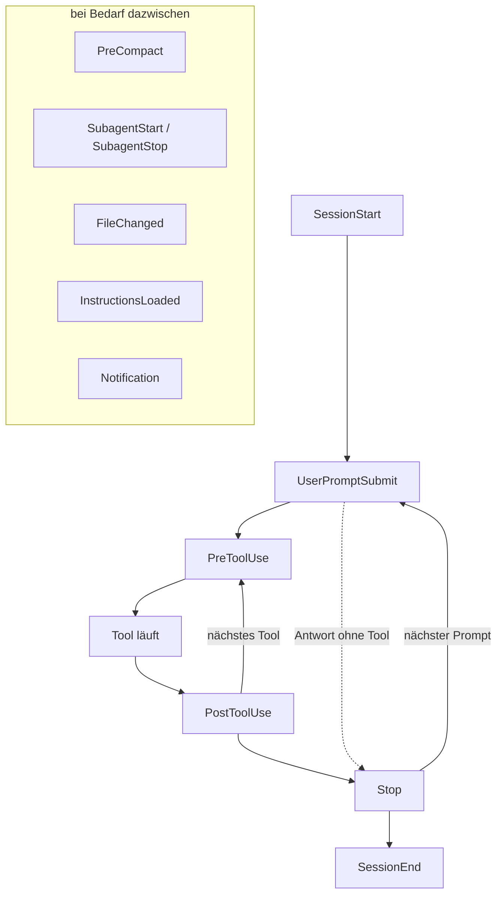

# S2.7 · Die wichtigsten Hook-Ereignisse

<!-- meta:start -->
> **Regal:** [Hooks](README.md#hooks) · **Stufe:** Kern · **~12 Min** · **Voraussetzungen:** [S2.6 Hooks als Sensoren: die drei Eckpfeiler](s2-06-hooks-als-sensoren.md)
>
> ← [S2.6 Hooks als Sensoren: die drei Eckpfeiler](s2-06-hooks-als-sensoren.md) · [Bibliothek](README.md) · [S2.8 Einen Hook einrichten, der wirklich blockt](s2-08-hook-einrichten.md) →
<!-- meta:end -->

## Schnellcheck

- Kannst du ohne Nachschlagen sagen, welches Ereignis vor dem Komprimieren des Kontexts feuert und wofür du es nutzt?
- Hast du schon einmal einen SessionStart- oder Notification-Hook eingesetzt?

## Auf einen Blick

Hook-Ereignisse decken den ganzen Lebenslauf einer Sitzung ab: SessionStart und SessionEnd klammern die Sitzung, UserPromptSubmit feuert, bevor Claude deinen Prompt sieht, PreCompact kommt vor dem Komprimieren des Kontexts, SubagentStart und SubagentStop begleiten Subagenten, FileChanged reagiert auf Änderungen von außen. Das richtige Ereignis zu wählen entscheidet: Eine Prüfung auf Secrets im Prompt gehört an UserPromptSubmit, nicht an PreToolUse, denn das Secret steht schon im Prompt, bevor überhaupt ein Tool-Aufruf entsteht.

## Bild im Kopf

PreToolUse ist der Kartenleser, der die Berechtigung prüft, *bevor* die Tür aufschließt. PostToolUse ist der Türkontakt, der das Ereignis *danach* protokolliert. SessionStart ist das Briefing zu Schichtbeginn. PreCompact ist der Moment, bevor ein Wachmann seine Notizen übergibt: Was wichtig ist, muss aufgeschrieben sein, bevor es verblasst.

Zusammen ergeben die Ereignisse das Protokoll einer Gebäudeleittechnik: „Schicht beginnt" (SessionStart), „Kartenleser prüft" (PreToolUse), „Türkontakt meldet offen" (PostToolUse), „Streife startet" (SubagentStart), „Kabelplan von außen geändert" (FileChanged), „Übergabeprotokoll schließen" (PreCompact), „Schicht endet" (SessionEnd).



## Im Detail

### Die zwölf wichtigsten Ereignisse

Die offizielle Doku führt deutlich mehr Ereignisse, als du im Alltag brauchst; die vollständige Liste steht in der [Hooks-Referenz](https://code.claude.com/docs/en/hooks). Hier geht es um die zwölf, zu denen du am häufigsten greifst:

| Ereignis | Wann es feuert | Typischer Einsatz |
|-------|---------------|------------------|
| **PreToolUse** | Bevor Claude ein Tool nutzt (Bash, Edit, MCP-Aufruf). **Kann blocken**, und zwar nur mit Exit-Code **2** (jeder andere Code ungleich null blockt nicht) | Gefährliche Befehle verhindern, ein Review vor dem Deploy erzwingen, unumkehrbare Aktionen bestätigen lassen |
| **PostToolUse** | Nachdem ein Tool gelaufen ist und das Ergebnis vorliegt. Kann reagieren, loggen, Folgeschritte anstoßen | Audit-Log jeder Änderung, Slack-Nachricht bei grünen Tests, Dashboard aktualisieren |
| **Stop** | Claude hat eine Antwort beendet und wartet auf deinen nächsten Prompt | Zusammenfassungen, Aufräumarbeiten, Statusmeldungen |
| **SessionStart** | Bei jedem Start einer Claude-Code-Sitzung | Briefing-Hook: Projektstatus ausgeben, `git status` prüfen, kontrollieren, ob die Abhängigkeiten installiert sind |
| **SessionEnd** | Sauberes Ende (du tippst `/exit` oder schließt die Sitzung) | Abschluss-Hook: Sitzungszusammenfassung sichern, Logs archivieren, ins Wiki übertragen |
| **UserPromptSubmit** | Du schickst einen Prompt ab (bevor Claude ihn sieht) | Prompt prüfen, Kontext ergänzen (aktueller Branch, Ticket-ID), Prompts mit Secrets abweisen |
| **PreCompact** | Kurz bevor der Kontext komprimiert wird, um Platz zu schaffen | Wichtigen Zustand auf die Platte schreiben, bevor er weggefasst wird |
| **SubagentStart** | Ein Subagent wird gestartet | Zusätzliche Anweisungen mitgeben, Delegation loggen, Beobachter anhängen |
| **SubagentStop** | Ein Subagent ist fertig | Abschlussbericht des Subagenten sichern, ins Audit-Log schreiben, den nächsten Agenten anstoßen |
| **FileChanged** | Eine beobachtete Datei ändert sich (externer Editor, `git pull`, Watcher) | Auf Änderungen von außen reagieren, Tests neu starten, Caches verwerfen |
| **InstructionsLoaded** | Nachdem CLAUDE.md und `.claude/rules/` geladen sind | Nachsehen, was wirklich im Kontext gelandet ist, wirksame Anweisungen loggen |
| **Notification** | Claude meldet etwas (lange Aufgabe fertig, Freigabe nötig) | Per Pushover aufs Handy schicken, an Slack weiterleiten, das Licht blinken lassen |

**UserPromptSubmit schreibt nicht um.** Ein Hook an diesem Ereignis kann einen Prompt abweisen oder Kontext daneben legen, aber er kann den Prompt nicht verändern, also auch kein Secret darin schwärzen. Tool-Ausgaben schwärzen kannst du mit PostToolUse ([S2.10](s2-10-hook-ausgaben.md)).

### PreCompact bei langen Sitzungen

Beim Komprimieren fasst Claude Code den bisherigen Kontext zusammen, um Platz zu schaffen. Was nur im Kontext stand, ist danach bestenfalls zusammengefasst. Ein PreCompact-Hook schreibt vorher auf die Platte, was nicht verloren gehen darf. Wie du den Kontext selbst steuerst, zeigt [S1.9](s1-09-kontext-steuern.md).

### Drei Ereignisse in einer settings.json

So hängen drei Ereignisse nebeneinander in einer Konfiguration. Die beiden Skripte sind Platzhalter, die du selbst schreibst; wie ein Eintrag im Einzelnen aufgebaut ist, zeigt [S2.8](s2-08-hook-einrichten.md).

<!-- cockpit:example -->
```json
{
  "hooks": {
    "SessionStart": [{"hooks": [{"type": "command", "command": "echo 'Session started' >> ~/.claude/session.log"}]}],
    "UserPromptSubmit": [{"hooks": [{"type": "command", "command": "bash ~/.claude/hooks/check-prompt-secrets.sh"}]}],
    "PreCompact": [{"hooks": [{"type": "command", "command": "bash ~/.claude/hooks/save-state.sh"}]}]
  }
}
```

## Typische Fallen

- **Ereignis und Hook-Typ verwechseln.** Das Ereignis sagt, *wann* ein Hook feuert (PreToolUse, Stop …). Der Typ sagt, *wie* er arbeitet (`command`, `http`, `prompt` …, siehe [S2.9](s2-09-hook-typen.md)).
- **Stop für das Sitzungsende halten.** Stop feuert nach jeder Antwort. Das saubere Ende ist SessionEnd.
- **Secrets im Prompt an PreToolUse prüfen.** Dann hat Claude den Prompt schon gelesen. Die Prüfung gehört an UserPromptSubmit, und sie kann den Prompt nur abweisen, nicht umschreiben.

## Check

Du kannst für jedes der zwölf Hook-Ereignisse einen konkreten Einsatz nennen und erklären, warum PreCompact bei langen Sitzungen besonders wichtig ist.

1. Welches Ereignis nimmst du für ein Briefing beim Start, welches für eine Zusammenfassung beim sauberen Beenden?
2. Warum ist PreToolUse zu spät, wenn du Secrets im Prompt abfangen willst?
3. Worin unterscheidet sich Stop von SessionEnd?

<details><summary>Quizfrage</summary>

**Frage:** Ein Team will verhindern, dass API-Keys aus dem Prompt beim Modell ankommen. Welches Hook-Ereignis passt, und warum ist ein naheliegendes anderes falsch?

- **Richtig:** `UserPromptSubmit`: Es feuert, bevor Claude den Prompt sieht, und kann ihn abweisen. `PreToolUse` käme zu spät, Claude hätte ihn schon gelesen.
- Falsch: `PreToolUse` mit Bash-Matcher, weil Keys fast immer in Shell-Befehlen stehen; `UserPromptSubmit` wäre zu früh und zu ungenau.
- Falsch: `SessionStart`, weil es einmal Kontext-Variablen setzt, mit denen Claude dann die ganze Sitzung bereinigt, statt jeden Prompt einzeln zu prüfen.
- Falsch: `InstructionsLoaded`, weil es nach dem Laden der CLAUDE.md feuert und Secret-Muster in eine Deny-Liste einträgt.

</details>

## Weiterlesen

- [Hooks-Referenz](https://code.claude.com/docs/en/hooks)
- [S2.6 · Hooks als Sensoren: die drei Eckpfeiler](s2-06-hooks-als-sensoren.md)
- [S2.8 · Einen Hook einrichten, der wirklich blockt](s2-08-hook-einrichten.md)
- [S2.10 · Hook-Ausgaben und das Secure Diff Gate](s2-10-hook-ausgaben.md)
- [S1.9 · Kontext steuern mit /compact und /rewind](s1-09-kontext-steuern.md)
- [S3.3 · Einen eigenen Subagenten definieren](s3-03-eigener-subagent.md)
