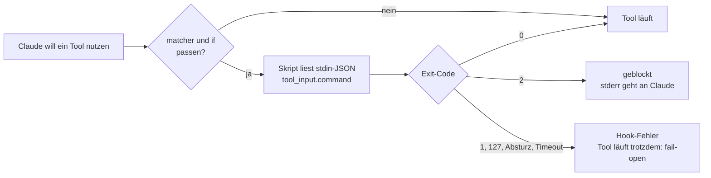

# S2.8 · Einen Hook einrichten, der wirklich blockt

<!-- meta:start -->
> **Regal:** [Hooks](README.md#hooks) · **Stufe:** Kern · **~15 Min** · **Voraussetzungen:** [S2.7 Die wichtigsten Hook-Ereignisse](s2-07-hook-ereignisse.md) · 🛡 **Sicherheitsboden**
>
> ← [S2.7 Die wichtigsten Hook-Ereignisse](s2-07-hook-ereignisse.md) · [Bibliothek](README.md) · [S2.9 Hook-Typen und Hooks in Komponenten](s2-09-hook-typen.md) →
<!-- meta:end -->

## Schnellcheck

- Kannst du ohne Nachschlagen einen Hook skizzieren, der nur `git push` in Bash blockt, und sagen, welcher Exit-Code blockt?
- Hast du schon einmal einen Schutz-Hook absichtlich kaputtgemacht, um zu sehen, ob er offen oder geschlossen fällt?

## Auf einen Blick

Von den Exit-Codes blockt bei einem Schutz-Hook nur `exit 2`; jeder andere Exit-Code (1, 127, ein Absturz) und ein Timeout blocken nicht, die Aktion läuft weiter. Daneben kann ein PreToolUse-Hook per JSON blocken (`permissionDecision: "deny"`, [S2.10](s2-10-hook-ausgaben.md)). Ein kaputter Schutz-Hook ist deshalb ein offener Schutz-Hook: Ein guter Wächter liest den Befehl aus `tool_input.command` und blockt lieber, wenn er seine Eingabe nicht lesen kann.

Eingetragen wird der Hook in `settings.json`, global oder pro Projekt; `matcher` wählt die Tools, `if` filtert feiner mit der Syntax der Rechte-Regeln. Hooks sind Best-Effort-Wächter, keine harte Grenze: Kombiniere sie mit Rechte-Regeln und Sandbox.

## Bild im Kopf

Stell dir eine Alarmmatrix mit zwei Filterebenen vor. Die erste Ebene ist der Sensortyp: Wiegand-Leser (Bash) oder Kamera-Bewegung (Edit). Das ist der `matcher`. Die zweite Ebene ist der Bereichsfilter: „nur wenn Berechtigungsstufe unter 3 und Zone = Serverraum". Das ist das `if`-Feld mit Rechte-Regel-Syntax. Ohne zweite Ebene löst jeder Kartenscan Alarm aus, mit ihr nur die Ereignisse, die zählen.

Dazu kommt die Fehlerrichtung. Ein Wächter, der seine Eingabe nicht lesen kann, soll die Tür schließen, nicht öffnen — bei Türschlössern kennst du das als fail-secure. Claude Code selbst macht es umgekehrt: Stürzt der Hook ab, läuft die Aktion. Also muss dein Skript die sichere Richtung selbst wählen.



## Im Detail

### Wo Hooks stehen

Hooks trägst du in `settings.json` ein. Es gibt zwei Orte:

- `~/.claude/settings.json`: global, gilt für alle Projekte
- `.claude/settings.json`: auf Projektebene, nur für dieses Repo

Der Aufbau hat drei Ebenen: welches Ereignis (`PreToolUse`), welches Tool (`matcher`), was läuft (der Handler mit `type` und `command`):

```json
{
  "hooks": {
    "PreToolUse": [
      {
        "matcher": "Bash|PowerShell",
        "hooks": [
          {
            "type": "command",
            "command": "bash ~/.claude/hooks/safety-check.sh"
          }
        ]
      }
    ],
    "PostToolUse": [
      {
        "matcher": ".*",
        "hooks": [
          {
            "type": "command",
            "command": "bash ~/.claude/hooks/audit-log.sh"
          }
        ]
      }
    ],
    "Stop": [
      {
        "hooks": [
          {
            "type": "command",
            "command": "echo 'Session ended' >> ~/.claude/session.log"
          }
        ]
      }
    ]
  }
}
```

### matcher: exakter Name oder Regex

Der `matcher` bestimmt, auf welche Tool-Aufrufe der Hook reagiert. Wie er ausgewertet wird, hängt von seinem Inhalt ab:

- Enthält er **nur Buchstaben, Ziffern, `_`, `-`, Leerzeichen, `,` und `|`**, gilt er als exakter Name oder als Liste exakter Namen (getrennt mit `|` oder `,`). `"Bash"` trifft nur das Bash-Tool, `"Bash|Edit|Write"` jedes der drei.
- `"*"`, `""` oder gar kein `matcher` treffen alle Tools.
- Enthält er **irgendein anderes Sonderzeichen**, gilt er als JavaScript-Regex. `".*"` trifft alle Tools; auch `"Bash|^Edit$"` ist ein Regex, sobald `.` oder `^`/`$` vorkommen.

> **Windows: `Bash|PowerShell`.** Unter Windows laufen Shell-Befehle meist über das PowerShell-Tool: Mit Git Bash ist es für claude.ai- und Console-Konten standardmäßig an, ohne Git Bash gibt es gar kein Bash-Tool. Ein Hook mit `"matcher": "Bash"` feuert dann nie, obwohl dein Skript im Test einwandfrei blockt. Für Hooks, die Shell-Befehle prüfen, schreibst du deshalb `"Bash|PowerShell"`; beide Tools liefern den Befehl in `tool_input.command`. Das Skript muss dann auch PowerShell-Befehle erkennen, etwa `Remove-Item -Recurse`.

### if: feiner filtern mit Rechte-Regel-Syntax

Zusätzlich kannst du ein `if`-Feld setzen. Es filtert mit der **Syntax der Rechte-Regeln** und ist damit viel genauer als ein Regex auf den Tool-Namen. `if` gehört an den einzelnen Hook-Handler, neben `type` und `command`, nicht an die Matcher-Gruppe:

```json
{
  "matcher": "Bash",
  "hooks": [
    {
      "type": "command",
      "if": "Bash(git *)",
      "command": "bash ~/.claude/hooks/git-audit.sh"
    }
  ]
}
```

Dieser Hook feuert nur bei Bash-Aufrufen, die zur Rechte-Regel `Bash(git *)` passen, also nur bei git-Befehlen. Eine `if`-Regel trifft immer nur die Aufrufe eines Tools: Sollen unter Windows auch git-Befehle über PowerShell zählen, setzt du den matcher auf `"Bash|PowerShell"` und gibst PowerShell einen zweiten Handler mit `"if": "PowerShell(git *)"`. Die `if`-Syntax folgt denselben Mustern wie `permissions.allow` und `permissions.deny` ([S1.5](s1-05-rechte-im-alltag.md)). Ausgewertet wird sie nur bei Tool-Ereignissen (`PreToolUse`, `PostToolUse`, `PostToolUseFailure`, `PermissionRequest`, `PermissionDenied`).

### Was der Hook bekommt

Claude Code übergibt das ganze Ereignis als JSON auf stdin. Beim Bash-Tool sieht es so aus (gekürzt):

```json
{
  "hook_event_name": "PreToolUse",
  "tool_name": "Bash",
  "tool_input": { "command": "rm -rf /tmp/test", "description": "Remove test dir" },
  "tool_use_id": "toolu_01ABC..."
}
```

Bei Edit stehen in `tool_input` die Felder `file_path`, `old_string` und `new_string`, bei Write `file_path` und `content`. Dateipfade sind absolut und kommen unter Windows mit Backslash. Zum Nachsehen kannst du die rohe Eingabe loggen: `echo "$INPUT" >> ~/.claude/debug.log`

### Ein echter Wächter: safety-check.sh

Dieser Hook blockt jeden Shell-Befehl, der zu einem zerstörerischen Muster wie `rm -rf`, `git push --force` oder `Remove-Item -Recurse` passt. Es ist dasselbe getestete Skript, das du unten in „Selbst machen" einrichtest.

> **Windows:** Das Beispiel ist Bash + `jq`. Unter Windows führst du es über Git Bash aus oder nimmst die PowerShell-Variante aus „Selbst machen" (`resources/demos/assets/hooks/safety-check.ps1`). Kopiere keine Bash-Heredocs in PowerShell. Eingetragen wird es in beiden Fällen mit `"matcher": "Bash|PowerShell"`.

**`~/.claude/hooks/safety-check.sh`:**

```bash
#!/bin/bash
# safety-check.sh - PreToolUse hook (matcher "Bash|PowerShell"): block destructive shell commands.
# tested asset: resources/demos/assets/hooks/safety-check.sh
#
# Contract (official hooks reference):
#   - Claude Code sends the event as JSON on stdin; the shell command is in tool_input.command
#     (the Bash and the PowerShell tool use the same field).
#   - exit 2 = BLOCK: the command does not run, and stderr is shown to Claude as the reason.
#   - exit 0 = no objection: the normal permission flow decides.
#   - Any OTHER exit code (1, 127, ...) does NOT block: the command runs anyway.
#   - On Windows, shell commands usually run through the PowerShell tool. A hook with
#     matcher "Bash" alone never fires there, so register it as "Bash|PowerShell".
#   - The patterns are examples, not complete protection: combine hooks with permission
#     rules and a sandbox.

INPUT=$(cat)

# Fail closed: if the input cannot be read, block instead of silently allowing everything.
if ! COMMAND=$(printf '%s' "$INPUT" | jq -er '.tool_input.command // ""' 2>/dev/null); then
  echo "SAFETY HOOK: could not read the hook input (is jq installed?) - blocking to stay safe." >&2
  exit 2
fi

# Dangerous patterns (extended regex, case-insensitive); the last four are PowerShell and cmd
DANGEROUS_PATTERNS=(
  'rm[[:space:]]+-rf'
  'git push.*--force'
  'git push.*[[:space:]]-f([[:space:]]|$)'
  'DROP TABLE'
  'truncate.*--yes'
  'mkfs\.'
  'dd[[:space:]]+if=.*of=/dev/'
  '> /dev/sd'
  '(^|[^[:alnum:]-])(Remove-Item|rm|ri|del|erase|rmdir|rd)[[:space:]].*-Recurse'
  '(^|[^[:alnum:]-])(rd|rmdir)[[:space:]]+/s'
  'Format-Volume'
  'Clear-Disk'
)

for PATTERN in "${DANGEROUS_PATTERNS[@]}"; do
  if printf '%s' "$COMMAND" | grep -qiE -- "$PATTERN"; then
    echo "SAFETY HOOK: potentially destructive command blocked." >&2
    echo "Command: $COMMAND" >&2
    echo "Pattern matched: $PATTERN" >&2
    echo "If this was intended, run it yourself outside Claude Code." >&2
    exit 2
  fi
done

# All checks passed - no objection
exit 0
```

Will Claude `rm -rf /tmp/build` ausführen, feuert der Hook, schreibt den Grund nach stderr und endet mit Code 2. Claude Code blockt den Aufruf und zeigt Claude den Grund, damit Claude einen sichereren Weg wählen kann.

### Zwei Details entscheiden, ob ein Wächter überhaupt wirkt

- **Der Befehl steht in `tool_input.command`.** Ein Skript, das ein Feld `command` auf oberster Ebene liest, sieht immer einen leeren String und erkennt nie etwas.
- **Die Fehlerrichtung.** Stürzt das Skript ab (fehlendes `jq`, Syntaxfehler, exit 127) oder läuft es in einen Timeout, blockt Claude Code **nicht**, und der Befehl läuft. Deshalb prüft das Skript seine eigene Eingabe und endet mit 2, wenn es sie nicht lesen kann: Ein kaputter Wächter soll die Tür schließen, nicht öffnen.

### Mehrere Hooks laufen parallel

Alle Hooks, die zu einem Ereignis passen, laufen **parallel**, nicht nacheinander in der Reihenfolge der Liste. Endet irgendein PreToolUse-Hook mit exit 2, ist der Aufruf geblockt.

### Was Hooks leisten können, und was nicht

1. **Gefährliche Operationen blocken:** `rm -rf`, Force-Pushes, Produktions-Deploys ohne Freigabe verhindern
2. **Standards durchsetzen:** verlangen, dass die Tests grün sind, bevor eine Änderung committet wird
3. **Aktivität protokollieren:** jeden Tool-Aufruf für die Compliance in eine Audit-Datei schreiben
4. **Leitplanken setzen:** warnen, wenn Claude Dateien außerhalb des Projektordners anfasst
5. **Abläufe automatisieren:** nach einem erfolgreichen Testlauf automatisch einen PR-Entwurf öffnen
6. **Auf Sicherheit prüfen:** vor dem Commit nach Secrets, API-Keys oder `innerHTML`-Zuweisungen suchen

Hooks setzen **automatische Wächter** an feste Ereignisse. Sie arbeiten nach bestem Bemühen: Ein fehlerhafter Matcher, ein fehlendes Ausführungsrecht, ein Absturz mit einem anderen Exit-Code als 2 oder ein Timeout lassen die Aktion durch. Hooks sind also keine harte Sicherheitsgrenze. Für echte Isolation kombinierst du sie mit Rechte-Regeln und Sandbox ([S1.6](s1-06-rechte-modi.md), [S3.9](s3-09-geschuetzte-pfade-und-sandbox.md)).

## Selbst machen

### Übung: einen Safety-Hook bauen

**Ziel:** Einen PreToolUse-Hook anlegen, der warnt oder blockt, bevor Claude potenziell gefährliche Shell-Befehle ausführt. Danach hast du ein automatisches Sicherheitsnetz, das in jeder Sitzung mitläuft, ohne dass du daran erinnern musst.

**Hintergrund:** In der Sprache der Zutrittskontrolle installierst du einen Sensor am Bash-Tool. Jedes Mal, wenn Claude einen Bash-Befehl ausführt, feuert dein Sensor. Passt der Befehl zu einem gefährlichen Muster, löst der Sensor Alarm aus (Warnung) oder verriegelt die Tür (Block).

**Schritt 1: settings.json finden oder anlegen**

> **Schütze deine echte Konfiguration.** Du hast zwei sichere Wege:
> - **Projekt-lokal (für diese Übung empfohlen):** Leg den Hook in eine `.claude/settings.json` in einem Wegwerf-Projektordner. Er gilt nur dort, deine globale Konfiguration bleibt unberührt.
> - **Global (`~/.claude/settings.json`):** Der Safety-Hook feuert dann in *jeder* Sitzung. Das ist nützlich, aber **sichere die Datei vorher** und **führe** nur zusammen, überschreibe nie die ganze Datei.

```bash
# Back up your global settings before touching them:
cp ~/.claude/settings.json ~/.claude/settings.json.bak 2>/dev/null || true

# View current settings (global shown here; use ./.claude/settings.json if you go project-local):
cat ~/.claude/settings.json 2>/dev/null || echo '(none yet)'

# Create ONLY if it does not exist — never blind-overwrite an existing file with '{}':
[ -f ~/.claude/settings.json ] || echo '{}' > ~/.claude/settings.json
```

Prüf, ob es schon einen `hooks`-Abschnitt gibt. Wenn ja, führst du deinen Eintrag darin ein, statt ihn zu ersetzen. Wenn nein, legst du ihn an.

**Schritt 2: das Hook-Skript anlegen**

```bash
mkdir -p ~/.claude/hooks
```

Schreib `~/.claude/hooks/safety-check.sh` mit dem Inhalt aus „Im Detail" (Abschnitt „Ein echter Wächter"). Das Skript braucht `jq` ([S0.1](s0-01-werkstatt-einrichten.md)); unter Windows ohne Git Bash nimmst du die PowerShell-Variante unten. Dieselbe Datei liegt getestet im Repo als [`resources/demos/assets/hooks/safety-check.sh`](../demos/assets/hooks/safety-check.sh), du kannst sie also auch kopieren, statt zu tippen.

```bash
# Make it executable
chmod +x ~/.claude/hooks/safety-check.sh
```

**Windows- und PowerShell-Variante**

Auf einem reinen Windows-Rechner gibt es kein `chmod`, `bash` braucht Git Bash im `PATH`, und `jq` fehlt meist. Nimm stattdessen dieses PowerShell-Gegenstück (getestet im Repo als [`resources/demos/assets/hooks/safety-check.ps1`](../demos/assets/hooks/safety-check.ps1)). Leg `~/.claude/hooks/safety-check.ps1` an:

```powershell
# safety-check.ps1 - PreToolUse hook (matcher "Bash|PowerShell"): block destructive shell commands.
# tested asset: resources/demos/assets/hooks/safety-check.ps1
#
# Contract (official hooks reference):
#   - Claude Code sends the event as JSON on stdin; the shell command is in tool_input.command
#     (the Bash and the PowerShell tool use the same field).
#   - exit 2 = BLOCK: the command does not run, and stderr is shown to Claude as the reason.
#   - exit 0 = no objection: the normal permission flow decides.
#   - Any OTHER exit code (1, ...) does NOT block: the command runs anyway.
#   - On Windows, shell commands usually run through the PowerShell tool. A hook with
#     matcher "Bash" alone never fires there, so register it as "Bash|PowerShell".
#   - The patterns are examples, not complete protection: combine hooks with permission
#     rules and a sandbox.

$raw = [Console]::In.ReadToEnd()

# Fail closed: if the input cannot be read, block instead of silently allowing everything.
try { $data = $raw | ConvertFrom-Json -ErrorAction Stop }
catch {
  [Console]::Error.WriteLine("SAFETY HOOK: could not read the hook input - blocking to stay safe.")
  exit 2
}
$command = [string]$data.tool_input.command

# Dangerous patterns (same set as the bash version); the last four are PowerShell and cmd
$dangerous = @(
  'rm\s+-rf',
  'git push.*--force',
  'git push.*\s-f(\s|$)',
  'DROP TABLE',
  'truncate.*--yes',
  'mkfs\.',
  'dd\s+if=.*of=/dev/',
  '> /dev/sd',
  '(^|[^\w-])(Remove-Item|rm|ri|del|erase|rmdir|rd)\s.*-Recurse',
  '(^|[^\w-])(rd|rmdir)\s+/s',
  'Format-Volume',
  'Clear-Disk'
)

foreach ($pattern in $dangerous) {
  # -match is case-insensitive by default (like grep -i)
  if ($command -match $pattern) {
    [Console]::Error.WriteLine("SAFETY HOOK: potentially destructive command blocked.")
    [Console]::Error.WriteLine("Command: $command")
    [Console]::Error.WriteLine("Pattern matched: $pattern")
    [Console]::Error.WriteLine("If this was intended, run it yourself outside Claude Code.")
    exit 2
  }
}

# All checks passed - no objection
exit 0
```

Unter Windows brauchst du keinen `chmod`-Schritt, PowerShell kennt kein Ausführungsrecht. Ist `pwsh` nicht installiert, geht auch `powershell` (Windows PowerShell 5.1); das Skript läuft mit beiden.

**Schritt 3: den Hook in settings.json eintragen**

Trag den Hook in `~/.claude/settings.json` ein:

```json
{
  "hooks": {
    "PreToolUse": [
      {
        "matcher": "Bash|PowerShell",
        "hooks": [
          {
            "type": "command",
            "command": "bash ~/.claude/hooks/safety-check.sh"
          }
        ]
      }
    ]
  }
}
```

Unter **Windows** trägst du stattdessen das PowerShell-Skript ein (der `command` zeigt auf die `.ps1`):

```json
{
  "hooks": {
    "PreToolUse": [
      {
        "matcher": "Bash|PowerShell",
        "hooks": [
          {
            "type": "command",
            "command": "pwsh -NoProfile -ExecutionPolicy Bypass -File $HOME/.claude/hooks/safety-check.ps1"
          }
        ]
      }
    ]
  }
}
```

Hast du nur Windows PowerShell 5.1, nimm `powershell -NoProfile -ExecutionPolicy Bypass -File ...` statt `pwsh ...`. `-NoProfile` überspringt dein PowerShell-Profil, `-ExecutionPolicy Bypass` lässt PowerShell das lokale Skript ausführen; ohne das bricht Windows PowerShell mit Standard-Richtlinie ab, und der Hook fällt still offen.

Hat die settings.json schon Inhalt, **führe** den neuen Eintrag in das bestehende Array `hooks.PreToolUse` ein. Kopiere keinen ganzen neuen `hooks`-Block über den alten, das würde andere Hooks und Rechte löschen. Prüf danach mit `python -m json.tool ~/.claude/settings.json` (`python3` unter macOS/Linux).

**Schritt 4: testen**

Teste den Hook zuerst von Hand, mit einer Eingabe im echten Format:

<!-- cockpit:example -->
```bash
echo '{"tool_name":"Bash","tool_input":{"command":"rm -rf /tmp/test"}}' | bash ~/.claude/hooks/safety-check.sh; echo "exit=$?"
# expected: SAFETY HOOK ... blocked, exit=2
```

Starte dann Claude Code neu, damit du sicher mit dem neuen Stand testest (laut Hooks-Referenz übernimmt Claude Code direkte Änderungen an Hooks in den Settings-Dateien normalerweise automatisch), und bitte Claude:

```
Run: rm -rf /tmp/test-directory
```

Erwartet: Claude versucht den Befehl, dein Hook feuert und endet mit 2, der Befehl läuft **nicht**, und Claude sieht deinen stderr-Text als Grund.

Prüf mit einem harmlosen Befehl, dass der normale Betrieb weiterläuft:

```
Run: echo "hello world"
```

Erwartet: keine Hook-Meldung, der Befehl läuft normal.

**Schritt 5 (Bonus): PostToolUse-Logging ergänzen**

Ein zweiter Hook schreibt alle Bash-Befehle in eine Datei. Leg `~/.claude/hooks/audit-log.sh` an:

```bash
#!/bin/bash

INPUT=$(cat)
COMMAND=$(printf '%s' "$INPUT" | jq -r '.tool_input.command // "unknown"' 2>/dev/null || echo "unknown")
TIMESTAMP=$(date '+%Y-%m-%d %H:%M:%S')

echo "[$TIMESTAMP] BASH: $COMMAND" >> ~/.claude/audit.log
exit 0
```

```bash
chmod +x ~/.claude/hooks/audit-log.sh
```

**Windows- und PowerShell-Variante:** Leg `~/.claude/hooks/audit-log.ps1` an (kein `chmod` nötig):

```powershell
$raw = [Console]::In.ReadToEnd()
try { $data = $raw | ConvertFrom-Json -ErrorAction Stop } catch { $data = $null }
$command = if ($data) { [string]$data.tool_input.command } else { "unknown" }
$timestamp = Get-Date -Format 'yyyy-MM-dd HH:mm:ss'

Add-Content -Path "$HOME/.claude/audit.log" -Value "[$timestamp] BASH: $command"
exit 0
```

Trag es mit `"command": "pwsh -NoProfile -ExecutionPolicy Bypass -File $HOME/.claude/hooks/audit-log.ps1"` ein (oder `powershell -NoProfile -ExecutionPolicy Bypass -File ...`).

In der settings.json sieht das so aus:

```json
{
  "hooks": {
    "PreToolUse": [
      {
        "matcher": "Bash|PowerShell",
        "hooks": [
          {
            "type": "command",
            "command": "bash ~/.claude/hooks/safety-check.sh"
          }
        ]
      }
    ],
    "PostToolUse": [
      {
        "matcher": "Bash|PowerShell",
        "hooks": [
          {
            "type": "command",
            "command": "bash ~/.claude/hooks/audit-log.sh"
          }
        ]
      }
    ]
  }
}
```

> Der Block oben ist das **zusammengeführte Ergebnis**, beide Hooks in einer Struktur. **Führe** den `PostToolUse`-Eintrag in deine bestehende Datei ein (kopiere nicht diesen ganzen Block darüber) und prüf danach wieder mit `python -m json.tool ~/.claude/settings.json`.

Nach ein paar Befehlen von Claude schaust du ins Log:

```bash
cat ~/.claude/audit.log
```

**Geschafft, wenn:**

- [ ] `~/.claude/hooks/safety-check.sh` existiert und ausführbar ist (`chmod +x`), **oder** unter Windows `~/.claude/hooks/safety-check.ps1` existiert (kein `chmod` nötig)
- [ ] `~/.claude/settings.json` einen gültigen Abschnitt `hooks.PreToolUse` hat, der auf dein Skript zeigt (`bash …safety-check.sh` oder `pwsh -NoProfile -ExecutionPolicy Bypass -File …safety-check.ps1`)
- [ ] Claudes Versuch, `rm -rf` auszuführen, von deinem Hook geblockt wird
- [ ] `echo "hello"` ohne Hook-Warnung durchläuft
- [ ] (Bonus) `~/.claude/audit.log` mit jedem Befehl von Claude wächst

### Extra: Hook-Honeypot (etwa 25 Minuten, schwer)

**Ziel:** Hooks als *Detektoren* bauen und dann austricksen. Das zeigt die Schwäche naiver Muster-Hooks. Nutze nur eine **projekt-lokale** `.claude/settings.json`, nie deine globale Konfiguration.

**Analogie:** ein Honeypot-Sensor an der Tresortür; ein Eindringling schlüpft an Sensoren vorbei, die nur Muster erkennen (die Protected Paths sind die Tresorräume).

1. Schreib einen **PostToolUse**-Honeypot, der jeden Versuch loggt, `osdp_frame_decoder.c` zu bearbeiten (liegt im `workshop-playground/`), und einen **PreToolUse**-Hook, der `rm` blockt. Nimm eine **projekt-lokale** `.claude/settings.json`.
2. Versuch jetzt, die `rm`-Sperre zu umgehen: doppeltes Leerzeichen (`rm  -rf`), getrennte Flags (`rm -r -f`), über eine Variable, über eine Subshell. Was kommt durch?
3. Erkenntnis: Ein Regex-Hook ist eine *Temposchwelle*, keine Mauer. Zieh den Matcher enger und besprich, was ein echter Schutz (Protected Paths, Rechte-Modus) zusätzlich bringt ([S3.9](s3-09-geschuetzte-pfade-und-sandbox.md)).

## Typische Fallen

- **Der Hook feuert, blockt aber nicht.** Prüf zwei Dinge. (1) Das Skript muss bei gefährlichen Mustern mit **`exit 2`** enden. `exit 1` und jeder andere Code ungleich null zeigen nur einen Hook-Fehler, der Befehl läuft trotzdem. (2) Der Befehl muss aus `tool_input.command` kommen. Ein Feld `command` auf oberster Ebene ist leer, also passt nie ein Muster.
- **Plötzlich wird jeder Bash-Befehl geblockt.** Das Skript konnte seine Eingabe nicht lesen und ist absichtlich geschlossen gefallen. Meist fehlt `jq`: Installier es oder nimm die PowerShell-Variante. Das ist die sichere Fehlerrichtung; ein Hook, der bei einem Lesefehler still alles durchlässt, wäre die gefährliche.
- **Der Hook läuft gar nicht.** Fehlt `chmod +x` (nur bash/Git Bash), der Shebang oder stimmt der Pfad in `settings.json` nicht, ist der Wächter still aus, und die Aktion läuft. Unter Windows ohne Git Bash trägst du die `.ps1` mit `pwsh -NoProfile -ExecutionPolicy Bypass -File` ein, nicht `bash ...`. Steht unter Windows im matcher nur `"Bash"`, feuert der Hook nie, weil Claude dort das PowerShell-Tool nutzt: trag `"Bash|PowerShell"` ein. `/hooks` zeigt, welche Hooks registriert sind.
- **Der Matcher ist zu breit.** `".*"` oder gar kein Matcher trifft jedes Tool. Wähl einen engeren, etwa `"Bash|PowerShell"` für Shell-Befehle oder `"Write|Edit"` für Dateiänderungen.
- **Die settings.json ist nach dem Bearbeiten kein gültiges JSON.** Prüf sie:

```bash
python3 -m json.tool ~/.claude/settings.json
```

Systematische Fehlersuche bei Hooks: [S4.10](s4-10-diagnose-schritt-fuer-schritt.md).

## Check

Du kannst einen PreToolUse-Hook mit passendem `matcher` und `if`-Filter eintragen, der mit `exit 2` wirklich blockt, und erklären, warum ein kaputter Schutz-Hook ein offener Schutz-Hook ist.

1. Welcher Exit-Code lässt einen PreToolUse-Hook blocken, und was passiert, wenn der Hook mit einem anderen Code abstürzt?
2. Wo im Eingabe-JSON steht der Bash-Befehl?
3. Warum ist `"Bash|^Edit$"` ein Regex, `"Bash|Edit"` aber nicht?

<details><summary>Quizfrage</summary>

**Frage:** Ein Hook soll auf Bash, Edit und Write reagieren. Jemand setzt `"matcher": "Bash|Edit|Write"`. Wird das als Regex oder als Liste exakter Namen ausgewertet, und warum?

- **Richtig:** Als Liste exakter Namen: Er enthält nur Buchstaben und `|`. Erst ein Zeichen wie `.`, `^` oder `$` macht daraus einen Regex.
- Falsch: Als Regex: `|` ist in Claude Code immer ein Regex-Operator, also wird jeder Matcher mit `|` als Regex gelesen.
- Falsch: Das ist egal: Beide Lesarten liefern hier dasselbe, deshalb unterscheidet Claude Code gar nicht zwischen den beiden.
- Falsch: Als Rechte-Regel: Mehrere Namen mit `|` liest Claude Code wie `permissions.allow`-Einträge, und `if` filtert dann die Namen.

</details>

## Weiterlesen

- [Hooks-Referenz](https://code.claude.com/docs/en/hooks)
- [Hooks-Leitfaden](https://code.claude.com/docs/en/hooks-guide)
- [S2.7 · Die wichtigsten Hook-Ereignisse](s2-07-hook-ereignisse.md)
- [S2.10 · Hook-Ausgaben und das Secure Diff Gate](s2-10-hook-ausgaben.md)
- [S1.6 · Alle Rechte-Modi im Überblick](s1-06-rechte-modi.md)
- [S3.9 · Geschützte Pfade und Sandbox-Stufen](s3-09-geschuetzte-pfade-und-sandbox.md)
- [S4.10 · Diagnose Schritt für Schritt](s4-10-diagnose-schritt-fuer-schritt.md)
- Getestete Hook-Dateien: [`safety-check.sh`](../demos/assets/hooks/safety-check.sh), [`safety-check.ps1`](../demos/assets/hooks/safety-check.ps1)
