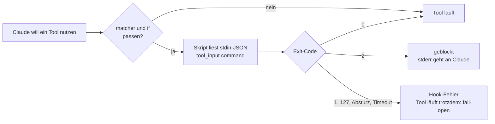

# S2.8 · Einen Hook einrichten, der wirklich blockt

<!-- meta:start -->
> **Regal:** [Hooks](README.md#hooks) · **Stufe:** Kern · **~35 Min** · **Voraussetzungen:** [S2.7 Die wichtigsten Hook-Ereignisse](s2-07-hook-ereignisse.md) · 🛡 **Sicherheitsboden**
>
> ← [S2.7 Die wichtigsten Hook-Ereignisse](s2-07-hook-ereignisse.md) · [Bibliothek](README.md) · [S2.9 Hook-Typen und Hooks in Komponenten](s2-09-hook-typen.md) →
<!-- meta:end -->

## Schnellcheck

- Kannst du ohne Nachschlagen sagen, welchen Exit-Code ein Schutz-Hook braucht, um einen Aufruf zu blocken, und was ein Absturz mit einem anderen Code bewirkt?
- Kannst du sagen, welchen `matcher` ein Hook unter Windows braucht, damit er Shell-Befehle überhaupt sieht?

## Auf einen Blick

Über den Exit-Code allein blockt bei einem Schutz-Hook nur `exit 2`; jeder andere Exit-Code (1, 127, ein Absturz) und ein Timeout blocken nicht, die Aktion läuft weiter. Daneben kann ein PreToolUse-Hook per JSON blocken (`permissionDecision: "deny"`, [S2.10](s2-10-hook-ausgaben.md)). Ein kaputter Schutz-Hook ist deshalb ein offener Schutz-Hook: Ein guter Wächter liest den Befehl aus `tool_input.command` und blockt lieber, wenn er seine Eingabe nicht lesen kann.

Eingetragen wird der Hook in `settings.json`, global oder pro Projekt; `matcher` wählt die Tools, `if` filtert feiner mit der Syntax der Rechte-Regeln. Unter Windows brauchst du für Shell-Befehle `"Bash|PowerShell"`. Hooks sind Best-Effort-Wächter, keine harte Grenze: Kombiniere sie mit Rechte-Regeln und Sandbox.

## Bild im Kopf

Stell dir eine Alarmmatrix mit zwei Filterebenen vor. Die erste Ebene ist der Sensortyp: Wiegand-Leser (Bash) oder Kamera-Bewegung (Edit). Das ist der `matcher`. Die zweite Ebene ist der Bereichsfilter: „nur wenn Berechtigungsstufe unter 3 und Zone = Serverraum". Das ist das `if`-Feld mit Rechte-Regel-Syntax. Ohne zweite Ebene löst jeder Kartenscan Alarm aus, mit ihr nur die Ereignisse, die zählen.

Dazu kommt die Fehlerrichtung. Ein Wächter, der seine Eingabe nicht lesen kann, soll die Tür schließen, nicht öffnen: Bei Türschlössern kennst du das als fail-secure. Claude Code selbst macht es umgekehrt: Stürzt der Hook ab, läuft die Aktion. Also muss dein Skript die sichere Richtung selbst wählen.



## Im Detail

### Wo Hooks stehen

Hooks trägst du in `settings.json` ein. Laut Doku entscheidet der Ort über den Geltungsbereich:

| Ort | Gilt für |
|---|---|
| `~/.claude/settings.json` | alle deine Projekte, nur auf deinem Rechner |
| `.claude/settings.json` | dieses Projekt, kann ins Repo eingecheckt werden |
| `.claude/settings.local.json` | dieses Projekt, nur bei dir (wird nicht eingecheckt) |

Für Übungen nimmst du immer die Projektdatei eines Wegwerf-Ordners: Sie berührt deine globale Konfiguration nicht, und mit dem Ordner ist der Hook weg. Claude Code führt Hooks aus Settings-Dateien erst aus, wenn du den Vertrauensdialog für den Ordner bestätigt hast.

Der Aufbau hat drei Ebenen: welches Ereignis (`PreToolUse`), welches Tool (`matcher`), was läuft (der Handler mit `type` und `command`). So sieht der Eintrag für das Skript weiter unten aus, in dem Bash-Fall:

```json
{
  "hooks": {
    "PreToolUse": [
      {
        "matcher": "Bash|PowerShell",
        "hooks": [
          {
            "type": "command",
            "command": "bash \"${CLAUDE_PROJECT_DIR}\"/.claude/hooks/safety-check.sh"
          }
        ]
      }
    ]
  }
}
```

`${CLAUDE_PROJECT_DIR}` ist die Projektwurzel, in der die Sitzung gestartet wurde, und der Befehl funktioniert so unabhängig vom Arbeitsverzeichnis. In dieser Shell-Form setzt du die Variable in Anführungszeichen, damit ein Pfad mit Leerzeichen ein Wort bleibt. Laut Doku läuft der `command` in einer Shell: `sh -c` unter macOS und Linux, Git Bash unter Windows oder PowerShell, wenn Git Bash fehlt. Für Windows ohne Git Bash zeigt die Doku die Exec-Form mit `args`; die Übung unten nutzt sie.

### matcher: exakter Name oder Regex

Der `matcher` bestimmt, auf welche Tool-Aufrufe der Hook reagiert. Wie er ausgewertet wird, hängt von seinem Inhalt ab:

- Enthält er **nur Buchstaben, Ziffern, `_`, `-`, Leerzeichen, `,` und `|`**, gilt er als exakter Name oder als Liste exakter Namen (getrennt mit `|` oder `,`). `"Bash"` trifft nur das Bash-Tool, `"Bash|Edit|Write"` jedes der drei.
- `"*"`, `""` oder gar kein `matcher` treffen alle Tools.
- Enthält er **irgendein anderes Sonderzeichen**, gilt er als JavaScript-Regex. `".*"` trifft alle Tools; auch `"Bash|^Edit$"` ist ein Regex, sobald `.` oder `^`/`$` vorkommen.

> **Windows: `Bash|PowerShell`.** Unter Windows laufen Shell-Befehle meist über das PowerShell-Tool: Ohne Git Bash ist es von Haus aus an, mit Git Bash für claude.ai- und Console-Konten ebenfalls. Ein Hook mit `"matcher": "Bash"` feuert dann nie, obwohl dein Skript im Test einwandfrei blockt. Die Doku nennt dafür `Bash|PowerShell`; beide Tools liefern den Befehl in `tool_input.command`. Das Skript muss dann auch PowerShell-Befehle erkennen, etwa `Remove-Item -Recurse`.

### if: feiner filtern mit Rechte-Regel-Syntax

Zusätzlich kannst du ein `if`-Feld setzen. Es filtert mit der **Syntax der Rechte-Regeln** und ist damit viel genauer als ein Regex auf den Tool-Namen. `if` gehört an den einzelnen Hook-Handler, neben `type` und `command`, nicht an die Matcher-Gruppe:

```json
{
  "matcher": "Bash",
  "hooks": [
    {
      "type": "command",
      "if": "Bash(git *)",
      "command": "bash ~/.claude/hooks/git-audit.sh"
    }
  ]
}
```

Dieser Hook feuert nur bei Bash-Aufrufen, die zur Rechte-Regel `Bash(git *)` passen, also nur bei git-Befehlen. Eine `if`-Regel trifft immer nur die Aufrufe eines Tools: Sollen unter Windows auch git-Befehle über PowerShell zählen, setzt du den matcher auf `"Bash|PowerShell"` und gibst PowerShell einen zweiten Handler mit `"if": "PowerShell(git *)"`. Die `if`-Syntax folgt denselben Mustern wie `permissions.allow` und `permissions.deny` ([S1.5](s1-05-rechte-im-alltag.md)). Ausgewertet wird sie nur bei Tool-Ereignissen (`PreToolUse`, `PostToolUse`, `PostToolUseFailure`, `PermissionRequest`, `PermissionDenied`). Auch der `if`-Filter ist Best-Effort: Für eine harte Erlaubnis oder Sperre nimmst du das Rechte-System.

### Was der Hook bekommt

Claude Code übergibt das ganze Ereignis als JSON auf stdin. Beim Bash-Tool sieht es so aus (gekürzt):

```json
{
  "hook_event_name": "PreToolUse",
  "tool_name": "Bash",
  "tool_input": { "command": "rm -rf /tmp/test", "description": "Remove test dir" },
  "tool_use_id": "toolu_01ABC..."
}
```

Bei Edit stehen in `tool_input` die Felder `file_path`, `old_string` und `new_string`, bei Write `file_path` und `content`. Dateipfade sind absolut und kommen unter Windows mit Backslash. Zum Nachsehen kannst du die rohe Eingabe loggen: `echo "$INPUT" >> ~/.claude/debug.log`

### Ein echter Wächter: safety-check

Dieser Hook blockt jeden Shell-Befehl, der zu einem zerstörerischen Muster wie `rm -rf`, `git push --force` oder `Remove-Item -Recurse` passt. Es ist dasselbe getestete Skript, das du unten in „Selbst machen" einrichtest. Die Bash-Fassung braucht `jq` ([Werkstatt erweitern](../reference/werkstatt-erweitern.md#jq)); die PowerShell-Fassung darunter braucht es nicht und ist für Windows ohne Git Bash gedacht. Kopiere keine Bash-Heredocs in PowerShell.

**Bash (`safety-check.sh`):**

```bash
#!/bin/bash
# safety-check.sh - PreToolUse hook (matcher "Bash|PowerShell"): block destructive shell commands.
# tested asset: resources/demos/assets/hooks/safety-check.sh
#
# Contract (official hooks reference):
#   - Claude Code sends the event as JSON on stdin; the shell command is in tool_input.command
#     (the Bash and the PowerShell tool use the same field).
#   - exit 2 = BLOCK: the command does not run, and stderr is shown to Claude as the reason.
#   - exit 0 = no objection: the normal permission flow decides.
#   - Any OTHER exit code (1, 127, ...) does NOT block: the command runs anyway.
#   - On Windows, shell commands usually run through the PowerShell tool. A hook with
#     matcher "Bash" alone never fires there, so register it as "Bash|PowerShell".
#   - The patterns are examples, not complete protection: combine hooks with permission
#     rules and a sandbox.

INPUT=$(cat)

# Fail closed: if the input cannot be read, block instead of silently allowing everything.
# Readable means: a JSON object whose command, if present, is a string. jq would turn "null" into an
# empty command without complaint, so the type is checked explicitly.
READ_COMMAND='if type != "object" then error("hook input is not a JSON object") else
  (.tool_input.command // "") | if type == "string" then . else error("command is not a string") end
end'
if ! COMMAND=$(printf '%s' "$INPUT" | jq -er "$READ_COMMAND" 2>/dev/null); then
  echo "SAFETY HOOK: could not read the hook input (is jq installed?) - blocking to stay safe." >&2
  exit 2
fi

# Dangerous patterns (extended regex, case-insensitive); the last four are PowerShell and cmd
DANGEROUS_PATTERNS=(
  'rm[[:space:]]+-rf'
  'git push.*--force'
  'git push.*[[:space:]]-f([[:space:]]|$)'
  'DROP TABLE'
  'truncate.*--yes'
  'mkfs\.'
  'dd[[:space:]]+if=.*of=/dev/'
  '> /dev/sd'
  '(^|[^[:alnum:]-])(Remove-Item|rm|ri|del|erase|rmdir|rd)[[:space:]].*-Recurse'
  '(^|[^[:alnum:]-])(rd|rmdir)[[:space:]]+/s'
  'Format-Volume'
  'Clear-Disk'
)

for PATTERN in "${DANGEROUS_PATTERNS[@]}"; do
  if printf '%s' "$COMMAND" | grep -qiE -- "$PATTERN"; then
    echo "SAFETY HOOK: potentially destructive command blocked." >&2
    echo "Command: $COMMAND" >&2
    echo "Pattern matched: $PATTERN" >&2
    echo "If this was intended, run it yourself outside Claude Code." >&2
    exit 2
  fi
done

# All checks passed - no objection
exit 0
```

**PowerShell (`safety-check.ps1`):**

```powershell
# safety-check.ps1 - PreToolUse hook (matcher "Bash|PowerShell"): block destructive shell commands.
# tested asset: resources/demos/assets/hooks/safety-check.ps1
#
# Contract (official hooks reference):
#   - Claude Code sends the event as JSON on stdin; the shell command is in tool_input.command
#     (the Bash and the PowerShell tool use the same field).
#   - exit 2 = BLOCK: the command does not run, and stderr is shown to Claude as the reason.
#   - exit 0 = no objection: the normal permission flow decides.
#   - Any OTHER exit code (1, ...) does NOT block: the command runs anyway.
#   - On Windows, shell commands usually run through the PowerShell tool. A hook with
#     matcher "Bash" alone never fires there, so register it as "Bash|PowerShell".
#   - The patterns are examples, not complete protection: combine hooks with permission
#     rules and a sandbox.

$raw = [Console]::In.ReadToEnd()

# Fail closed: if the input cannot be read, block instead of silently allowing everything.
# Readable means: a JSON object. Empty input, "null", a list or a bare value carry no command to check.
try {
  if ([string]::IsNullOrWhiteSpace($raw)) { throw "empty hook input" }
  $data = $raw | ConvertFrom-Json -ErrorAction Stop
  if ($data -isnot [System.Management.Automation.PSCustomObject]) { throw "hook input is not a JSON object" }
}
catch {
  [Console]::Error.WriteLine("SAFETY HOOK: could not read the hook input - blocking to stay safe.")
  exit 2
}
$command = [string]$data.tool_input.command

# Dangerous patterns (same set as the bash version); the last four are PowerShell and cmd
$dangerous = @(
  'rm\s+-rf',
  'git push.*--force',
  'git push.*\s-f(\s|$)',
  'DROP TABLE',
  'truncate.*--yes',
  'mkfs\.',
  'dd\s+if=.*of=/dev/',
  '> /dev/sd',
  '(^|[^\w-])(Remove-Item|rm|ri|del|erase|rmdir|rd)\s.*-Recurse',
  '(^|[^\w-])(rd|rmdir)\s+/s',
  'Format-Volume',
  'Clear-Disk'
)

foreach ($pattern in $dangerous) {
  # -match is case-insensitive by default (like grep -i)
  if ($command -match $pattern) {
    [Console]::Error.WriteLine("SAFETY HOOK: potentially destructive command blocked.")
    [Console]::Error.WriteLine("Command: $command")
    [Console]::Error.WriteLine("Pattern matched: $pattern")
    [Console]::Error.WriteLine("If this was intended, run it yourself outside Claude Code.")
    exit 2
  }
}

# All checks passed - no objection
exit 0
```

Will Claude `rm -rf /tmp/build` ausführen, feuert der Hook, schreibt den Grund nach stderr und endet mit Code 2. Claude Code blockt den Aufruf und zeigt Claude den Grund, damit Claude einen sichereren Weg wählen kann.

### Zwei Details entscheiden, ob ein Wächter überhaupt wirkt

- **Der Befehl steht in `tool_input.command`.** Ein Skript, das ein Feld `command` auf oberster Ebene liest, sieht immer einen leeren String und erkennt nie etwas.
- **Die Fehlerrichtung.** Stürzt das Skript ab (fehlendes `jq`, Syntaxfehler, exit 127) oder läuft es in einen Timeout, blockt Claude Code **nicht**, und der Befehl läuft. Deshalb prüft das Skript seine eigene Eingabe und endet mit 2, wenn es sie nicht lesen kann: Ein kaputter Wächter soll die Tür schließen, nicht öffnen.

### Mehrere Hooks laufen parallel

Alle Hooks, die zu einem Ereignis passen, laufen **parallel**, nicht nacheinander in der Reihenfolge der Liste. Endet irgendein PreToolUse-Hook mit exit 2, ist der Aufruf geblockt.

### Was ein Hook nicht leistet

Hooks setzen **automatische Wächter** an feste Ereignisse. Sie arbeiten nach bestem Bemühen: Ein fehlerhafter Matcher, ein falscher Pfad in der `settings.json`, ein Absturz mit einem anderen Exit-Code als 2 oder ein Timeout lassen die Aktion durch. Die Doku warnt entsprechend: Ein falsch geschriebener Pfad lässt den Wächter still ausgeschaltet. Ein Muster-Wächter erkennt außerdem nur die Schreibweisen, die er kennt (siehe das Extra unten). Hooks sind also keine harte Sicherheitsgrenze. Für echte Isolation kombinierst du sie mit Rechte-Regeln und Sandbox ([S1.6](s1-06-rechte-modi.md), [S3.9](s3-09-geschuetzte-pfade-und-sandbox.md)).

## Selbst machen

### Übung: einen Wächter einrichten und blocken sehen (etwa 15 Minuten)

**Ziel:** Du richtest den Wächter `safety-check` in einem Wegwerf-Projekt ein, siehst, wie er `rm -rf` blockt und `echo` durchlässt, und prüfst von Hand, dass er bei unlesbarer Eingabe geschlossen fällt.

**Startzustand:** Wähl deine Variante. **Bash:** macOS, Linux oder Windows mit Git Bash, dazu `jq` ([Werkstatt erweitern](../reference/werkstatt-erweitern.md#jq)). **PowerShell:** Windows ohne Git Bash; `jq` brauchst du nicht. Du arbeitest im Ordner `~/cc-workshop/waechter`; deine globale `~/.claude/settings.json` bleibt unberührt, und mit dem Ordner löschst du alles.

1. Leg den Ordner an und wechsle hinein.

   ```bash
   mkdir -p ~/cc-workshop/waechter/.claude/hooks
   cd ~/cc-workshop/waechter
   ```

   In PowerShell:

   ```powershell
   New-Item -ItemType Directory -Force "$HOME\cc-workshop\waechter\.claude\hooks"
   Set-Location "$HOME\cc-workshop\waechter"
   ```

2. Leg das Skript an: den Bash-Block aus „Im Detail" als `.claude/hooks/safety-check.sh`, in der PowerShell-Variante den PowerShell-Block als `.claude/hooks/safety-check.ps1`. Schreib die Datei mit einem Editor; `.claude` ist ein geschützter Pfad, Claude würde dort nachfragen. Dieselben getesteten Dateien liegen auch im Workshop-Repo ([Werkstatt erweitern](../reference/werkstatt-erweitern.md#workshop-repo-und-playground)) unter `resources/demos/assets/hooks/`.
3. Teste das Skript von Hand, bevor Claude es benutzt. Mit Bash:

   ```bash
   echo '{"tool_name":"Bash","tool_input":{"command":"rm -rf build"}}' | bash .claude/hooks/safety-check.sh; echo "exit=$?"
   echo '{"tool_name":"Bash","tool_input":{"command":"echo hello"}}' | bash .claude/hooks/safety-check.sh; echo "exit=$?"
   echo 'not json' | bash .claude/hooks/safety-check.sh; echo "exit=$?"
   ```

   In PowerShell:

   ```powershell
   '{"tool_name":"Bash","tool_input":{"command":"rm -rf build"}}' | powershell -NoProfile -ExecutionPolicy Bypass -File .claude/hooks/safety-check.ps1; "exit=$LASTEXITCODE"
   '{"tool_name":"Bash","tool_input":{"command":"echo hello"}}' | powershell -NoProfile -ExecutionPolicy Bypass -File .claude/hooks/safety-check.ps1; "exit=$LASTEXITCODE"
   'not json' | powershell -NoProfile -ExecutionPolicy Bypass -File .claude/hooks/safety-check.ps1; "exit=$LASTEXITCODE"
   ```

   Erwartet: Beim ersten Aufruf erscheint `SAFETY HOOK: potentially destructive command blocked.` und `exit=2`. Beim zweiten kommt keine Ausgabe und `exit=0`. Beim dritten, einer Eingabe ohne JSON, erscheint `SAFETY HOOK: could not read the hook input` und `exit=2`: Der Wächter fällt geschlossen.
4. Trag den Hook in `.claude/settings.json` ein. Bash-Variante:

   <!-- cockpit:example -->
   ```json
   {
     "hooks": {
       "PreToolUse": [
         {
           "matcher": "Bash|PowerShell",
           "hooks": [
             {
               "type": "command",
               "command": "bash \"${CLAUDE_PROJECT_DIR}\"/.claude/hooks/safety-check.sh"
             }
           ]
         }
       ]
     }
   }
   ```

   PowerShell-Variante (Windows ohne Git Bash; Exec-Form nach der Hooks-Doku, ohne Quoting-Fallen):

   ```json
   {
     "hooks": {
       "PreToolUse": [
         {
           "matcher": "Bash|PowerShell",
           "hooks": [
             {
               "type": "command",
               "command": "powershell.exe",
               "args": ["-NoProfile", "-ExecutionPolicy", "Bypass", "-File", "${CLAUDE_PROJECT_DIR}/.claude/hooks/safety-check.ps1"]
             }
           ]
         }
       ]
     }
   }
   ```

   `-NoProfile` überspringt dein PowerShell-Profil, und `-ExecutionPolicy Bypass` lässt PowerShell das lokale Skript ausführen; ohne das bricht Windows PowerShell mit der Standard-Richtlinie ab, und der Hook fällt still offen.
5. Leg ein Opfer an, das du nicht verlieren willst: `mkdir build` und `echo x > build/old.txt` (in beiden Shells gleich). Starte dann `claude --permission-mode default`, bestätige den Vertrauensdialog mit „Yes, I trust this folder" und gib `/hooks` ein. Erwartet: ein Eintrag unter PreToolUse. Schließ die Ansicht mit `Esc`.
6. Gib ein: `Delete the build folder with this exact shell command: rm -rf build`. Erwartet: Es erscheint keine Rückfrage zum Löschen, denn der Hook läuft vor der Rechte-Prüfung und blockt. Claude meldet, dass der Befehl geblockt wurde, und nennt den Grund aus deinem Skript. Prüf in einem zweiten Terminal, dass `build/old.txt` noch da ist (`ls build`, in PowerShell `dir build`). So erkennst du einen Hook-Block: Der Text `SAFETY HOOK: potentially destructive command blocked` stammt aus deinem Skript und steht in Claudes Antwort oder im Transkript (`Ctrl+O`). Weigert sich Claude von selbst, fehlt er.
7. Gib ein: `Run the shell command echo hello.` Erwartet: Der Befehl läuft normal, ohne Hook-Meldung.

**Aufräumen:** Beende die Sitzung mit `/exit` und lösch den Ordner `~/cc-workshop/waechter` selbst.

**Geschafft, wenn:**

- [ ] der Handtest `exit=2` für `rm -rf`, `exit=0` für `echo` und `exit=2` für die Eingabe ohne JSON zeigte
- [ ] `/hooks` den Eintrag unter PreToolUse zeigte
- [ ] das `rm -rf build` geblockt wurde, ohne dass eine Löschen-Rückfrage kam, und `build/old.txt` noch existierte
- [ ] `echo hello` ohne Hook-Meldung durchlief

### Übung: nur git-Befehle mit `if` (etwa 5 Minuten)

**Ziel:** Du siehst, dass ein `if`-Filter einen Handler nur bei passenden Befehlen laufen lässt.

**Startzustand:** ein neuer Ordner `~/cc-workshop/if-filter` (`mkdir -p ~/cc-workshop/if-filter/.claude && cd ~/cc-workshop/if-filter`, in PowerShell `New-Item -ItemType Directory -Force "$HOME\cc-workshop\if-filter\.claude"; Set-Location "$HOME\cc-workshop\if-filter"`). Die Hooks sind `echo`-Befehle ohne `jq`.

1. Leg `.claude/settings.json` an. Der Matcher trifft beide Shell-Tools, der `if`-Filter je Tool nur git-Befehle, deshalb zwei Handler:

   ```json
   {
     "hooks": {
       "PreToolUse": [
         {
           "matcher": "Bash|PowerShell",
           "hooks": [
             {"type": "command", "if": "Bash(git *)", "command": "echo bash-git >> \"${CLAUDE_PROJECT_DIR}/git-log.txt\""},
             {"type": "command", "if": "PowerShell(git *)", "command": "echo powershell-git >> \"${CLAUDE_PROJECT_DIR}/git-log.txt\""}
           ]
         }
       ]
     }
   }
   ```

2. Starte `claude --permission-mode default` (Vertrauensdialog bestätigen) und gib nacheinander ein: `Run the shell command git status.` und `Run the shell command echo hello.` Lies dann `git-log.txt` (`cat git-log.txt`, in PowerShell `Get-Content git-log.txt`). Erwartet: genau eine Zeile, `bash-git` oder `powershell-git`, je nachdem, welches Tool Claude benutzt hat. Für `echo hello` ist keine Zeile entstanden.

**Aufräumen:** Beende die Sitzung mit `/exit` und lösch den Ordner `~/cc-workshop/if-filter` selbst.

**Geschafft, wenn:**

- [ ] `git-log.txt` genau eine Zeile für den git-Befehl enthielt
- [ ] der `echo`-Befehl keine Zeile erzeugte

### Extra: der offene Wächter (etwa 5 Minuten)

**Ziel:** Du erlebst, was fail-open heißt: Ein Hook, der mit `exit 1` endet, blockt nichts.

**Startzustand:** der Ordner `~/cc-workshop/waechter` aus der ersten Übung, falls du ihn noch nicht gelöscht hast.

1. Leg `.claude/hooks/sloppy.sh` an (PowerShell: `.claude/hooks/sloppy.ps1` mit `[Console]::Error.WriteLine("sloppy check failed"); exit 1`):

   ```bash
   #!/bin/bash
   echo "sloppy check failed" >&2
   exit 1
   ```

2. Ändere in `.claude/settings.json` den Pfad von `safety-check` auf `sloppy` und starte die Sitzung neu. Lass Claude noch einmal `rm -rf build` ausführen (Aufforderung wie in Schritt 6).
3. Erwartet: Der Hook meldet laut Doku einen nicht blockierenden Fehler, im Transkript als `hook error` mit der ersten Zeile deiner Fehlerausgabe, und der Befehl läuft weiter: Jetzt erscheint die normale Rechte-Rückfrage. Lehn sie mit „No" ab.

**Geschafft, wenn:**

- [ ] eine Hook-Fehlermeldung erschien und trotzdem die normale Rückfrage zum Löschen kam

### Extra: Hook-Honeypot, Umgehungen von Hand testen (etwa 10 Minuten)

**Ziel:** Du siehst, dass ein Regex-Wächter nur Schreibweisen erkennt, die er kennt.

**Startzustand:** der Ordner `~/cc-workshop/waechter` mit funktionierendem `safety-check`.

1. Schätz zuerst, welche dieser fünf Befehle der Wächter durchlässt: `rm  -rf build` (zwei Leerzeichen), `rm -r -f build`, `rm -fr build`, `find build -delete`, `bash -c "rm -rf build"`.
2. Prüf es mit dieser Schleife. Bash:

   ```bash
   for c in 'rm  -rf build' 'rm -r -f build' 'rm -fr build' 'find build -delete' 'bash -c "rm -rf build"'; do
     jq -nc --arg c "$c" '{tool_name:"Bash",tool_input:{command:$c}}' | bash .claude/hooks/safety-check.sh >/dev/null 2>&1
     echo "exit=$? : $c"
   done
   ```

   PowerShell:

   ```powershell
   foreach ($c in 'rm  -rf build','rm -r -f build','rm -fr build','find build -delete','bash -c "rm -rf build"') {
     @{tool_name='Bash'; tool_input=@{command=$c}} | ConvertTo-Json -Compress | powershell -NoProfile -ExecutionPolicy Bypass -File .claude/hooks/safety-check.ps1 2>$null
     "exit=$LASTEXITCODE : $c"
   }
   ```

<details><summary>Vergleich</summary>

`exit=2` (geblockt) bekommen `rm  -rf build` und `bash -c "rm -rf build"`, denn das Muster findet `rm` und `-rf` im Befehlstext. `exit=0` (durchgelassen) bekommen `rm -r -f build`, `rm -fr build` und `find build -delete`: Dieselbe Wirkung, andere Schreibweise. Ein Muster-Wächter ist eine Temposchwelle, keine Mauer. Was darüber hinaus schützt, steht in [S3.9](s3-09-geschuetzte-pfade-und-sandbox.md).

</details>

**Geschafft, wenn:**

- [ ] du vor dem Lauf geschätzt hast, welche Befehle durchkommen, und mit dem Ergebnis verglichen hast

## Typische Fallen

- **Der Hook feuert, blockt aber nicht.** Prüf zwei Dinge. (1) Das Skript muss bei gefährlichen Mustern mit **`exit 2`** enden. `exit 1` und jeder andere Code ungleich null zeigen nur einen Hook-Fehler, der Befehl läuft trotzdem. (2) Der Befehl muss aus `tool_input.command` kommen. Ein Feld `command` auf oberster Ebene ist leer, also passt nie ein Muster.
- **Plötzlich wird jeder Bash-Befehl geblockt.** Das Skript konnte seine Eingabe nicht lesen und ist absichtlich geschlossen gefallen. Meist fehlt `jq`: Installier es oder nimm die PowerShell-Variante. Das ist die sichere Fehlerrichtung; ein Hook, der bei einem Lesefehler still alles durchlässt, wäre die gefährliche.
- **Der Hook läuft gar nicht.** Hast du den Vertrauensdialog bestätigt? Stimmt der Pfad in `settings.json`? Ein falsch geschriebener Pfad lässt den Wächter still ausgeschaltet; achte beim ersten Lauf auf eine Fehlermeldung wie `No such file or directory`. Unter Windows ohne Git Bash trägst du die `.ps1` in der Exec-Form ein, nicht `bash ...`. Steht unter Windows im matcher nur `"Bash"`, feuert der Hook nie, weil Claude dort das PowerShell-Tool nutzt: Trag `"Bash|PowerShell"` ein. `/hooks` zeigt, welche Hooks registriert sind; schließ die Ansicht mit `Esc`.
- **Der Matcher ist zu breit.** `".*"` oder gar kein Matcher trifft jedes Tool. Wähl einen engeren, etwa `"Bash|PowerShell"` für Shell-Befehle oder `"Write|Edit"` für Dateiänderungen.
- **Die settings.json ist nach dem Bearbeiten kein gültiges JSON.** Prüf sie mit `python -m json.tool .claude/settings.json` (`python3` unter macOS und Linux).

- **Suchen, bevor klar ist, ob der Hook geladen ist.** `/hooks` zeigt alle Hooks der Sitzung. Fehlt deiner dort, liest Claude Code die Datei nicht oder hält den Eintrag für ungültig; `claude doctor` im Terminal nennt ungültige Einstellungsdateien, ohne etwas zu ändern.

Welches Werkzeug was zeigt: [S4.9](s4-09-fehlersuche-werkzeuge.md). Systematische Fehlersuche bei Hooks: [S4.10](s4-10-diagnose-schritt-fuer-schritt.md).

## Check

Du kannst einen PreToolUse-Hook mit passendem `matcher` eintragen, der mit `exit 2` wirklich blockt, und erklären, warum ein kaputter Schutz-Hook ein offener Schutz-Hook ist und wie du ihn geschlossen machst.

1. Welcher Exit-Code lässt einen PreToolUse-Hook über den Code allein blocken, und was passiert bei jedem anderen Code oder einem Timeout?
2. Wo im Eingabe-JSON steht der Bash-Befehl, und welchen `matcher` brauchst du unter Windows?
3. Was tut der Wächter in diesem Kapitel, wenn er seine Eingabe nicht lesen kann, und warum ist das die sichere Richtung?

<details><summary>Auflösung</summary>

1. `exit 2`. Jeder andere Code (1, 127, ein Absturz) und ein Timeout melden nur einen Hook-Fehler; die Aktion läuft weiter.
2. In `tool_input.command`. Unter Windows brauchst du `"Bash|PowerShell"`, weil Shell-Befehle dort meist über das PowerShell-Tool laufen; beide Tools liefern den Befehl in diesem Feld.
3. Er endet mit `exit 2` und blockt. Das ist die sichere Richtung: Ein kaputter Wächter soll die Tür schließen, denn bei jedem anderen Code, den Claude Code ohnehin als Hook-Fehler wertet, liefe der Befehl.

</details>

<details><summary>Quizfrage</summary>

**Frage:** Dein Wächter-Skript stürzt ab, weil `jq` fehlt, und endet mit Exit-Code 127. Was passiert mit dem gefährlichen Befehl, und wie änderst du das?

- **Richtig:** Er läuft, denn 127 blockt nicht. Das Skript muss seine Eingabe selbst prüfen und bei einem Lesefehler mit `exit 2` enden.
- Falsch: Er wird geblockt, denn ein Hook, der nicht sauber läuft, gilt für Claude Code als Ablehnung und stoppt den Aufruf.
- Falsch: Er läuft nur beim ersten Mal; danach blockt Claude Code ihn von selbst, bis der Hook wieder funktioniert.
- Falsch: Er wird geblockt, sobald das Skript einen Fehlertext auf stderr schreibt, auch ohne den Exit-Code 2.

</details>

## Weiterlesen

- [Hooks-Referenz](https://code.claude.com/docs/en/hooks)
- [Hooks-Leitfaden](https://code.claude.com/docs/en/hooks-guide)
- [S2.7 · Die wichtigsten Hook-Ereignisse](s2-07-hook-ereignisse.md)
- [S2.10 · Hook-Ausgaben und das Secure Diff Gate](s2-10-hook-ausgaben.md)
- [S1.6 · Alle Rechte-Modi im Überblick](s1-06-rechte-modi.md)
- [S3.9 · Geschützte Pfade und Sandbox-Stufen](s3-09-geschuetzte-pfade-und-sandbox.md)
- [S4.10 · Diagnose Schritt für Schritt](s4-10-diagnose-schritt-fuer-schritt.md)
- Getestete Hook-Dateien: [`safety-check.sh`](../demos/assets/hooks/safety-check.sh), [`safety-check.ps1`](../demos/assets/hooks/safety-check.ps1)
