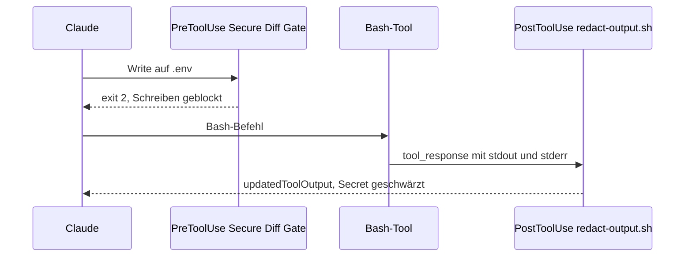

# S2.10 · Hook-Ausgaben und das Secure Diff Gate

<!-- meta:start -->
> **Regal:** [Hooks](README.md#hooks) · **Stufe:** Vertiefung · **~15 Min** · **Voraussetzungen:** [S2.8 Einen Hook einrichten, der wirklich blockt](s2-08-hook-einrichten.md)
>
> ← [S2.9 Hook-Typen und Hooks in Komponenten](s2-09-hook-typen.md) · [Bibliothek](README.md) · [S2.11 Plugins: ein Bündel schnüren](s2-11-plugins-buendeln.md) →
<!-- meta:end -->

## Schnellcheck

- Kannst du ohne Nachschlagen erklären, wie ein PostToolUse-Hook verhindert, dass ein API-Key aus einer Befehlsausgabe in Claudes Kontext landet?
- Hast du schon einmal einen Hook eingesetzt, der Schreibzugriffe auf `.env` oder `secrets/` blockt, und weißt du, welche Zugriffe an ihm vorbeigehen?

## Auf einen Blick

Über `exit 0` (erlauben) und `exit 2` (blocken) hinaus kann ein Hook strukturiertes JSON zurückgeben: `hookSpecificOutput.updatedToolOutput` ersetzt in einem PostToolUse-Hook die Tool-Ausgabe, bevor Claude sie liest, aber nur in der Form der Tool-Ausgabe (Bash: `stdout`, `stderr`, `interrupted`, `isImage`), sonst wird sie ignoriert. Weiche Signale wie `systemMessage` (für dich) und `additionalContext` (für Claude) melden etwas, ohne zu sperren, und `terminalSequence` holt dich per Desktop-Benachrichtigung. Schreibzugriffe der Tools Write und Edit auf `.env`, `*.pem` oder `secrets/` blockt ein PreToolUse-Hook mit `exit 2`: das Secure Diff Gate. Eine harte Grenze ist es nicht: Shell-Befehle laufen an seinem Matcher vorbei, dafür brauchst du zusätzlich eine Deny-Regel.

## Bild im Kopf

Ein Leitstand hat mehrere Ausgabewege. Der Schwärzungsbeauftragte (`updatedToolOutput`) sitzt zwischen Außendienst und Lagebesprechung: Der Bericht kommt beim Analysten an, aber die sensiblen Kennungen sind vorher geschwärzt. Die gelbe Warnlampe (`systemMessage`, `additionalContext`) leuchtet, ohne die Tür zu sperren; der Betrieb läuft, der Leitstand weiß Bescheid. Der Pager (`terminalSequence`) erreicht den Menschen direkt, ohne Umweg über das Modell.

In deiner Zutrittskontrolle hast du Zonen: Manche Türen sind immer offen (Lobby), manche brauchen eine Karte (Büros), manche bleiben ohne ausdrückliche Freigabe zu (Tresor). Das Secure Diff Gate ist die Tresor-Regel für die Türen, an denen es hängt: Write und Edit. Die Shell ist eine andere Tür. Und der Circuit Breaker ist der Totmann-Schalter: Meldet sich die Streife nicht mehr, eskaliert das System von selbst.



## Im Detail

### Mehr als erlauben oder blocken

Über `exit 0` (erlauben) und `exit 2` (blocken) hinaus kann ein Hook ein **strukturiertes JSON-Objekt** auf stdout ausgeben (mit exit 0) und damit genauer steuern, was passiert. Drei Einsätze zählen in der Praxis.

### updatedToolOutput: umschreiben, was Claude sieht

Ein `PostToolUse`-Hook kann **die Ausgabe eines Tools ersetzen, bevor Claude sie liest**. Er bekommt das fertige Ergebnis in `tool_response` und gibt den Ersatz unter `hookSpecificOutput.updatedToolOutput` zurück. Der Ersatz muss **dieselbe Form haben wie die Ausgabe des Tools**: bei Bash ein Objekt mit `stdout`, `stderr`, `interrupted` und `isImage`. Einen einfachen String ignoriert Claude Code bei eingebauten Tools, und Claude sieht dann das Original.

```bash
#!/bin/bash
# redact-output.sh - PostToolUse hook (matcher "Bash"): hide secrets from Claude in command output.
# tested asset: resources/demos/assets/hooks/redact-output.sh
#
# PostToolUse receives the finished result in tool_response (Bash: stdout, stderr, interrupted, isImage).
# To change what Claude sees, print hookSpecificOutput.updatedToolOutput in the SAME shape;
# a plain string is ignored for built-in tools. The command itself has already run.

INPUT=$(cat)
SECRETS='(sk-[A-Za-z0-9]{20,}|AKIA[A-Z0-9]{16})'

TEXT=$(printf '%s' "$INPUT" | jq -r '.tool_response | (.stdout // "") + "\n" + (.stderr // "")')
if ! printf '%s' "$TEXT" | grep -qE -- "$SECRETS"; then
  exit 0   # nothing to hide: print nothing, Claude sees the original output
fi

printf '%s' "$INPUT" | jq --arg re "$SECRETS" '{
  hookSpecificOutput: {
    hookEventName: "PostToolUse",
    updatedToolOutput: (.tool_response | (.stdout, .stderr) |= gsub($re; "[REDACTED]"))
  }
}'
exit 0
```

**Einsatz:** API-Keys, Tokens oder personenbezogene Daten aus Tool-Ausgaben entfernen, bevor Claude sie in sein Reasoning übernimmt (und womöglich in spätere Nachrichten). **Grenze:** Der Befehl ist schon gelaufen, und die Telemetrie zeichnet die Originalausgabe auf. Willst du verhindern, dass etwas überhaupt passiert, nimm einen PreToolUse-Hook.

> **Windows:** Die Hook-Beispiele in diesem Kapitel sind in bash geschrieben (`jq`, `case`). Unter Windows führst du sie über Git Bash aus oder portierst sie nach `.ps1` (stdin lesen mit `[Console]::In.ReadToEnd() | ConvertFrom-Json`, JSON ausgeben mit `ConvertTo-Json -Depth 5`) und trägst sie mit `pwsh -NoProfile -ExecutionPolicy Bypass -File ...` ein (warum die Flags nötig sind, steht in S2.8). Das Bash- und PowerShell-Paar findest du in [S2.8](s2-08-hook-einrichten.md).

### Weiche Warnungen statt harter Sperre

Nicht jedes Signal soll die Aktion stoppen. Bei einem **command-Hook** sind die weichen Wege JSON-Felder, die du mit exit 0 ausgibst:

- `systemMessage`: eine Warnzeile, die **du** im Transcript siehst (Claude sieht sie nicht).
- `hookSpecificOutput.additionalContext`: eine Notiz, die neben dem Tool-Ergebnis in **Claudes** Kontext landet.
- Bei PreToolUse blockt `hookSpecificOutput.permissionDecision: "deny"` mit einem `permissionDecisionReason` den Aufruf, gibt Claude aber den Grund mit, damit es sich anpassen kann (derselbe Weg wie bei exit 2).

```bash
#!/bin/bash
# PreToolUse, matcher "Bash", handler "if": "Bash(git push *)": let the push run, but leave a trace.
echo "$(date -Iseconds) git push" >> ~/.claude/push-audit.log
jq -n '{hookSpecificOutput: {hookEventName: "PreToolUse",
        additionalContext: "Push recorded in the audit trail."},
        systemMessage: "git push noticed - audit entry written"}'
exit 0
```

`continueOnBlock: true` gibt es auch, aber als Feld **prompt-basierter Hooks** (`"type": "prompt"`): Es gibt Claude den `ok: false`-Grund des Modells zurück und setzt die Runde fort, statt sie zu beenden.

### terminalSequence: den Menschen direkt erreichen

Ein Hook kann ein Feld `terminalSequence` zurückgeben, das Claude Code an dein Terminal schickt: eine Desktop-Benachrichtigung, einen Fenstertitel oder die Glocke. Erlaubt sind nur OSC `0`/`1`/`2` (Titel), OSC `9`/`99`/`777` (Benachrichtigung) und BEL. Alles andere, etwa Farbcodes, führt dazu, dass Claude Code das Feld ignoriert.

```bash
#!/bin/bash
# After a block decision: pop a desktop notification (OSC 9), then block with exit 2.
jq -n '{terminalSequence: "\u001b]9;Destructive command blocked\u0007"}'
echo "Blocked: destructive command" >&2
exit 2
```

Auch bei exit 2 liest Claude Code gültiges JSON auf stdout. Die Benachrichtigung erscheint also, und der Aufruf ist geblockt.

**Einsatz:** Den Menschen erreichen, wenn eine lange Aufgabe fertig ist oder ein Wächter anschlägt, ohne Claudes Token-Budget zu belasten.

### $CLAUDE_EFFORT: Hooks, die sich nach dem Effort richten

Jeder Hook-Prozess bekommt das aktuelle Effort-Level als Umgebungsvariable (`$CLAUDE_EFFORT` in bash, `$env:CLAUDE_EFFORT` in PowerShell). So verhält sich ein Hook-Skript **unterschiedlich, je nachdem, ob gerade low, medium, high, xhigh oder max eingestellt ist** ([S1.7](s1-07-modellwahl-und-effort.md)).

```bash
#!/bin/bash
# Stricter scanning when the user requested xhigh / max effort
case "$CLAUDE_EFFORT" in
  xhigh|max)
    ./full-security-scan.sh
    ;;
  *)
    ./quick-pattern-check.sh
    ;;
esac
```

**Einsatz:** Ein Pre-Commit-Hook, der bei schneller Iteration nur einen leichten Regex-Scanner laufen lässt, aber einen vollen SAST-Durchlauf, wenn der Effort ausdrücklich hochgedreht ist, ohne zwei getrennte Hooks einzutragen. Hooks in Skills können über dieselbe Variable auch auf den im *Skill* eingestellten Effort reagieren.

### Circuit Breaker: ein Muster, kein Feature

> **Hinweis:** Der Circuit Breaker ist ein *Muster*, kein eingebautes Feature von Claude Code. Du setzt ihn um, indem du einen Hook schreibst, der wiederholte identische Tool-Aufrufe zählt. Das Skript schreibst du selbst: ein kleines Shell- oder Python-Skript, das die Zählerstände in `~/.claude/state/` ablegt, auf gleiches Tool + gleiche Argumente + gleichen Exit-Code prüft und blockt, sobald die Schwelle überschritten ist.

Ein wichtiges Hook-Muster gegen ausufernde Token-Kosten: Führt ein Agent denselben Befehl dreimal mit demselben Fehler aus, erkennt der Hook die Schleife, stoppt den Ablauf und bittet dich um einen Strategiewechsel.

Er verhindert, dass Claude in einer „Erkundungsfalle" hängen bleibt und denselben scheiternden Ansatz immer wieder probiert. Besonders wichtig ist das bei autonomen Loops und Multi-Agent-Abläufen, in denen die Token-Kosten ohne menschliche Aufsicht schnell steigen können ([S3.13](s3-13-autonome-loops-absichern.md)).

## Selbst machen

### Bonus-Übung: Token Firewall, Ausgaben per Hook filtern

**Art:** Einzelarbeit, etwa 20 Minuten.

**Ziel:** Einen PostToolUse-Hook bauen, der lange Testausgaben durch eine gefilterte Zusammenfassung ersetzt, bevor Claude sie liest. Das spart Kontext und Geld.

**Hintergrund:** Führt Claude in einem großen Projekt `npm test` oder `pytest` aus, kann die volle Ausgabe Tausende Zeilen lang sein. Das meiste sind bestandene Tests, wichtig sind nur die Fehlschläge. Eine „Token Firewall" bekommt das fertige Bash-Ergebnis und tauscht die Ausgabe, die Claude lesen wird, gegen eine kompakte Fehlerübersicht (`updatedToolOutput`). Der Testlauf selbst bleibt gleich, nur was in Claudes Kontext kommt, schrumpft. Das ist wie eine Videoüberwachung, die nur bei Bewegung aufzeichnet, statt rund um die Uhr leere Flure.

**Schritt 1: das Filterskript anlegen.** Leg `~/.claude/hooks/token-firewall.sh` an (getestet im Repo als [`resources/demos/assets/hooks/token-firewall.sh`](../demos/assets/hooks/token-firewall.sh)):

<!-- cockpit:example -->
```bash
#!/bin/bash
# token-firewall.sh - PostToolUse hook (matcher "Bash"): shrink noisy test output before Claude reads it.
# tested asset: resources/demos/assets/hooks/token-firewall.sh
#
# Replaces tool_response.stdout via hookSpecificOutput.updatedToolOutput (same Bash shape).
# stderr passes through unchanged: stripping error details can mislead Claude.
# Note: suppressOutput has no effect, and systemMessage only reaches the user, not Claude.

INPUT=$(cat)
COMMAND=$(printf '%s' "$INPUT" | jq -r '.tool_input.command // ""')

# Only touch test runs; everything else passes through untouched.
if ! printf '%s' "$COMMAND" | grep -qE '(npm test|pytest|jest|mocha)'; then
  exit 0
fi

printf '%s' "$INPUT" | jq '{
  hookSpecificOutput: {
    hookEventName: "PostToolUse",
    updatedToolOutput: (.tool_response | .stdout |= (
      [split("\n")[] | select(test("FAIL|ERROR|Error|passed|failed|Summary"))]
      | .[-50:] | join("\n")
      | . + "\n--- [Token Firewall: passing-test lines removed; failures and summary kept] ---"
    ))
  }
}'
exit 0
```

> **Wichtig:** Das ist ein **PostToolUse**-Hook, kein PreToolUse-Hook. Ein PreToolUse-Hook läuft vor dem Befehl, da gibt es noch keine Ausgabe zum Filtern. PostToolUse bekommt das fertige Ergebnis in `tool_response`, bei Bash ein Objekt mit `stdout`, `stderr`, `interrupted` und `isImage`. Claude Code nimmt einen Ersatz nur in **genau dieser Form** an; einen einfachen String ignoriert es, und Claude sieht die volle Originalausgabe. Zwei Felder sehen verlockend aus, helfen aber nicht: `suppressOutput` hat keine Wirkung, und `systemMessage` siehst *du*, nicht Claude.

**Schritt 2: den Hook eintragen.** Ergänze in `.claude/settings.json`:

```json
{
  "hooks": {
    "PostToolUse": [
      {
        "matcher": "Bash",
        "hooks": [
          {
            "type": "command",
            "command": "bash ~/.claude/hooks/token-firewall.sh"
          }
        ]
      }
    ]
  }
}
```

> **Windows:** Läuft Claude über das PowerShell-Tool, sieht dieser Filter die Ausgabe nicht, denn sein matcher ist `Bash`. Er ersetzt die Ausgabe in der Form des Bash-Tools; wie die Ausgabe des PowerShell-Tools aussieht, beschreibt die Hook-Doku nicht. Prüf das mit einem Log-Hook, bevor du den matcher erweiterst.

**Schritt 3: testen.** Bitte Claude, die Testsuite laufen zu lassen. Vergleiche den verbrauchten Kontext mit und ohne Filter.

**Geschafft, wenn:**

- [ ] der Hook feuert, wenn Claude Testbefehle ausführt
- [ ] die Ausgabe von Testbefehlen nur noch als Fehlschläge + Zusammenfassung bei Claude ankommt (`updatedToolOutput` in Bash-Form)
- [ ] andere Befehle unberührt bleiben (der Hook gibt nichts aus)
- [ ] du den Hook von Hand getestet hast: `echo '{"tool_input":{"command":"pytest"},"tool_response":{"stdout":"a PASSED\nb FAILED\n1 failed, 1 passed","stderr":"","interrupted":false,"isImage":false}}' | bash ~/.claude/hooks/token-firewall.sh`
- [ ] du die Token-Ersparnis gemessen oder geschätzt hast

**Tipps:**

- Bau eine Umgehung ein (zum Beispiel eine Umgebungsvariable, die dein Hook prüft) für Läufe, in denen Claude das volle Log braucht.
- `.[-50:]` behält die letzten 50 passenden Zeilen, damit die Zusammenfassung am Ende auch bei vielen Fehlschlägen erhalten bleibt.
- Gibt ein Testlauf nichts Passendes aus, sieht Claude nur die Markierungszeile: Erweitere den Filter für deinen Test-Runner.
- Das Muster passt für jeden lauten Befehl: Build-Logs, Lint-Ausgaben, Installation von Abhängigkeiten.

## Typische Fallen

- **`updatedToolOutput` als String.** Bei eingebauten Tools wird er ignoriert, Claude sieht das Original. Gib ein Objekt in der Form des Tools zurück (Bash: `stdout`, `stderr`, `interrupted`, `isImage`).
- **Auf `suppressOutput` setzen.** Das Feld hat keine Wirkung. `systemMessage` erreicht nur dich, nicht Claude.
- **Von PostToolUse Schutz erwarten.** Der Befehl ist schon gelaufen, die Telemetrie hat die Originalausgabe. Was nicht passieren darf, blockst du vorher mit PreToolUse und `exit 2`.
- **Pfade mit Schrägstrich vergleichen.** Unter Windows kommen Dateipfade mit Backslash, etwa `C:\proj\secrets\db.txt`. Ein Vergleich auf `secrets/` greift dann nicht, und der Aufruf läuft. Das getestete Secure Diff Gate vereinheitlicht die Pfade vorher.

## Check

Du kannst erklären, wie `updatedToolOutput` in der Form der Tool-Ausgabe verhindert, dass ein API-Key in Claudes Kontext landet, warum `exit 2` oder `permissionDecision: "deny"` blocken und wann ein weiches Signal (`systemMessage`, `additionalContext`) besser passt als eine Sperre.

1. Wie verkleinert ein PostToolUse-Hook eine laute Ausgabe, bevor Claude sie liest?
2. Warum schützt `updatedToolOutput` nicht davor, dass ein Befehl etwas anrichtet?
3. Woran scheitert ein Pfadvergleich auf `secrets/` unter Windows?

<details><summary>Quizfrage</summary>

**Frage:** Ein Team will, dass Claude rohe API-Keys aus einer Bash-Ausgabe nie zu sehen bekommt, den Bash-Befehl selbst aber nicht blocken. Welche Hook-Mechanik passt?

- **Richtig:** Ein PostToolUse-Hook mit `updatedToolOutput`: Der Befehl läuft normal, der Hook ersetzt die Ausgabe durch eine geschwärzte Fassung in Bash-Form.
- Falsch: Ein PreToolUse-Hook mit `continueOnBlock: true`: Er prüft den Befehl vorher, lässt ihn trotzdem laufen und markiert den Fund dabei im Transcript.
- Falsch: Ein UserPromptSubmit-Hook, der alle Bash-Argumente scannt, weil Keys schon auf Prompt-Ebene abgefangen werden müssen.
- Falsch: Nur `permissions.deny` für Credential-Dateien, denn `updatedToolOutput` wirkt ausschließlich bei MCP-Tools, nicht bei Bash.

</details>

## Weiterlesen

- [Hooks-Referenz](https://code.claude.com/docs/en/hooks)
- [S2.8 · Einen Hook einrichten, der wirklich blockt](s2-08-hook-einrichten.md)
- [S2.7 · Die wichtigsten Hook-Ereignisse](s2-07-hook-ereignisse.md)
- [S1.7 · Modellwahl und Effort](s1-07-modellwahl-und-effort.md)
- [S3.13 · Autonome Loops absichern: Budget und Worktree](s3-13-autonome-loops-absichern.md)
- [S3.9 · Geschützte Pfade und Sandbox-Stufen](s3-09-geschuetzte-pfade-und-sandbox.md)
- Getestete Hook-Dateien: [`redact-output.sh`](../demos/assets/hooks/redact-output.sh), [`token-firewall.sh`](../demos/assets/hooks/token-firewall.sh), [`secure-diff-gate.sh`](../demos/assets/hooks/secure-diff-gate.sh), [`secure-diff-gate.py`](../demos/assets/hooks/secure-diff-gate.py)
