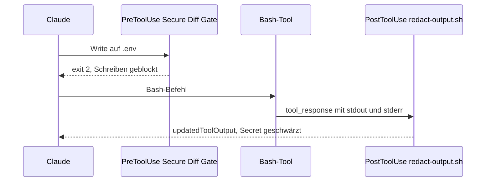

# S2.10 · Hook-Ausgaben und das Secure Diff Gate

<!-- meta:start -->
> **Regal:** [Hooks](README.md#hooks) · **Stufe:** Vertiefung · **~15 Min** · **Voraussetzungen:** [S2.8 Einen Hook einrichten, der wirklich blockt](s2-08-hook-einrichten.md)
>
> ← [S2.9 Hook-Typen und Hooks in Komponenten](s2-09-hook-typen.md) · [Bibliothek](README.md) · [S2.11 Plugins: ein Bündel schnüren](s2-11-plugins-buendeln.md) →
<!-- meta:end -->

## Schnellcheck

- Kannst du ohne Nachschlagen sagen, welche Zugriffe an einem Hook auf `Write|Edit` vorbeigehen?
- Kannst du sagen, ob ein PostToolUse-Hook mit `updatedToolOutput` verhindert, dass ein Befehl etwas anrichtet?

## Auf einen Blick

Über `exit 0` (erlauben) und `exit 2` (blocken) hinaus kann ein Hook strukturiertes JSON zurückgeben. Zwei Einsätze zählen hier. Erstens das Secure Diff Gate: Ein PreToolUse-Hook auf Write und Edit blockt mit `exit 2` Schreibzugriffe auf `.env`, `*.pem` und `secrets/`. Eine harte Grenze ist er nicht: Shell-Befehle laufen an seinem Matcher vorbei, dafür brauchst du zusätzlich eine Deny-Regel. Zweitens `hookSpecificOutput.updatedToolOutput`: Es ersetzt in einem PostToolUse-Hook die Tool-Ausgabe, bevor Claude sie liest, aber nur in der Form der Tool-Ausgabe (Bash: `stdout`, `stderr`, `interrupted`, `isImage`), und der Befehl ist dann schon gelaufen.

## Bild im Kopf

In deiner Zutrittskontrolle gibt es Zonen: Manche Türen sind immer offen (Lobby), manche brauchen eine Karte (Büros), manche bleiben ohne ausdrückliche Freigabe zu (Tresor). Das Secure Diff Gate ist die Tresor-Regel für die Türen, an denen es hängt: Write und Edit. Die Shell ist eine andere Tür. Weiter hinten im Leitstand sitzt der Schwärzungsbeauftragte (`updatedToolOutput`): Der Bericht kommt beim Analysten an, aber die sensiblen Kennungen sind vorher geschwärzt. Was der Außendienst getan hat, macht er nicht ungeschehen.



## Im Detail

### Das Gate: PreToolUse auf Write und Edit

Das Gate liest das Ziel aus `tool_input.file_path` (absolut; unter Windows mit Backslashes, die es vereinheitlicht) und endet mit `exit 2`, wenn der Pfad zu `.env`, `.pem`, `secrets/` oder `credentials` passt, in jeder Schreibweise: `.ENV` ist unter Windows und macOS dieselbe Datei wie `.env`. Alles andere lässt es mit `exit 0` durch. Kann es seine Eingabe nicht lesen, blockt es ebenfalls, wie der Wächter aus [S2.8](s2-08-hook-einrichten.md). Es gibt zwei getestete Fassungen: `secure-diff-gate.py` braucht nur Python und läuft überall, `secure-diff-gate.sh` braucht Bash und `jq`. Beide liegen im Workshop-Repo unter `resources/demos/assets/hooks/`.

Der Matcher ist `Write|Edit`. Das Gate ist so eng wie dieser Matcher, und genau darin liegt seine Grenze.

**Die Grenze des Gates:** Der Matcher `Write|Edit` sieht keine Shell-Befehle. `echo X > .env` über das Bash- oder PowerShell-Tool geht am Gate vorbei. Für eine harte Grenze trägst du zusätzlich eine Deny-Regel ein, etwa `Edit(./.env)`. Laut Doku gelten Edit-Deny-Regeln für Claudes eingebaute Datei-Tools, für Datei-Befehle, die Claude Code in Bash erkennt, und für die Ziele von Umleitungen wie `> file`; nicht aber für beliebige Unterprozesse, die Dateien selbst schreiben, etwa ein Python-Skript. Dagegen hilft erst die Sandbox ([S3.9](s3-09-geschuetzte-pfade-und-sandbox.md)). Das Gate ist deshalb eine zusätzliche Schicht, keine Mauer.

### Mehr als erlauben oder blocken

Über `exit 0` und `exit 2` hinaus kann ein Hook ein **strukturiertes JSON-Objekt** auf stdout ausgeben (mit exit 0) und damit genauer steuern, was passiert. Bei einem **command-Hook** gibt es dafür diese Wege:

- Bei PreToolUse blockt `hookSpecificOutput.permissionDecision: "deny"` mit einem `permissionDecisionReason` den Aufruf, gibt Claude aber den Grund mit, damit es sich anpassen kann. Das ist ein zweiter Weg neben `exit 2`; die Doku zeigt ihn in ihren eigenen Beispielen.
- `systemMessage`: eine Warnzeile, die **du** im Transcript siehst (Claude sieht sie nicht).
- `hookSpecificOutput.additionalContext`: eine Notiz, die neben dem Tool-Ergebnis in **Claudes** Kontext landet. Das Feld `hookEventName` muss dabei im Objekt stehen.

Die beiden letzten sind weiche Signale: Sie melden etwas, ohne zu sperren.

```bash
#!/bin/bash
# PreToolUse, matcher "Bash", handler "if": "Bash(git push *)": let the push run, but leave a trace.
echo "$(date -Iseconds) git push" >> ~/.claude/push-audit.log
jq -n '{hookSpecificOutput: {hookEventName: "PreToolUse",
        additionalContext: "Push recorded in the audit trail."},
        systemMessage: "git push noticed - audit entry written"}'
exit 0
```

`continueOnBlock: true` gibt es auch, aber als Feld **prompt-basierter Hooks** (`"type": "prompt"`, [S2.9](s2-09-hook-typen.md)): Es gibt Claude den `ok: false`-Grund des Modells zurück und setzt die Runde fort, statt sie zu beenden.

### updatedToolOutput: umschreiben, was Claude sieht

Ein `PostToolUse`-Hook kann **die Ausgabe eines Tools ersetzen, bevor Claude sie liest**. Er bekommt das fertige Ergebnis in `tool_response` und gibt den Ersatz unter `hookSpecificOutput.updatedToolOutput` zurück. Der Ersatz muss **dieselbe Form haben wie die Ausgabe des Tools**: bei Bash ein Objekt mit `stdout`, `stderr`, `interrupted` und `isImage`. Einen einfachen String ignoriert Claude Code bei eingebauten Tools, und Claude sieht dann das Original.

```bash
#!/bin/bash
# redact-output.sh - PostToolUse hook (matcher "Bash"): hide secrets from Claude in command output.
# tested asset: resources/demos/assets/hooks/redact-output.sh
#
# PostToolUse receives the finished result in tool_response (Bash: stdout, stderr, interrupted, isImage).
# To change what Claude sees, print hookSpecificOutput.updatedToolOutput in the SAME shape;
# a plain string is ignored for built-in tools. The command itself has already run.

INPUT=$(cat)
SECRETS='(sk-[A-Za-z0-9]{20,}|AKIA[A-Z0-9]{16})'

TEXT=$(printf '%s' "$INPUT" | jq -r '.tool_response | (.stdout // "") + "\n" + (.stderr // "")')
if ! printf '%s' "$TEXT" | grep -qE -- "$SECRETS"; then
  exit 0   # nothing to hide: print nothing, Claude sees the original output
fi

printf '%s' "$INPUT" | jq --arg re "$SECRETS" '{
  hookSpecificOutput: {
    hookEventName: "PostToolUse",
    updatedToolOutput: (.tool_response | (.stdout, .stderr) |= gsub($re; "[REDACTED]"))
  }
}'
exit 0
```

**Einsatz:** API-Keys, Tokens oder personenbezogene Daten aus Tool-Ausgaben entfernen, bevor Claude sie in sein Reasoning übernimmt (und womöglich in spätere Nachrichten). **Grenzen:** Der Befehl ist schon gelaufen, und die Telemetrie zeichnet die Originalausgabe auf. Willst du verhindern, dass etwas überhaupt passiert, nimm einen PreToolUse-Hook. Außerdem feuert PostToolUse nur nach einem erfolgreichen Aufruf: Ein Befehl, der mit einem Fehlercode endet, geht an diesem Hook vorbei, seine Ausgabe sieht Claude ungeschwärzt. Und der Matcher `Bash` sieht nur das Bash-Tool; wie die Ausgabe des PowerShell-Tools aussieht, beschreibt die Hook-Doku nicht.

### terminalSequence: den Menschen direkt erreichen

Ein Hook kann ein Feld `terminalSequence` zurückgeben, das Claude Code an dein Terminal schickt: eine Desktop-Benachrichtigung, einen Fenstertitel oder die Glocke. Erlaubt sind nur OSC `0`/`1`/`2` (Titel), OSC `9`/`99`/`777` (Benachrichtigung) und BEL. Alles andere, etwa Farbcodes, führt dazu, dass Claude Code das Feld ignoriert. Es wirkt nur in interaktiven Sitzungen.

```bash
#!/bin/bash
# After a block decision: pop a desktop notification (OSC 9), then block with exit 2.
jq -n '{terminalSequence: "\u001b]9;Destructive command blocked\u0007"}'
echo "Blocked: destructive command" >&2
exit 2
```

Auch bei exit 2 liest Claude Code gültiges JSON auf stdout; die Doku nennt das ausdrücklich. Die Benachrichtigung erscheint also, und der Aufruf ist geblockt.

**Einsatz:** Den Menschen erreichen, wenn eine lange Aufgabe fertig ist oder ein Wächter anschlägt, ohne Claudes Token-Budget zu belasten.

### Kleinigkeiten zum Nachschlagen

- **`$CLAUDE_EFFORT`:** Claude Code setzt die Umgebungsvariable in Hook-Befehlen auf das aktuelle Effort-Level (`$CLAUDE_EFFORT` in bash, `$env:CLAUDE_EFFORT` in PowerShell), aber nur, wenn das aktuelle Modell den Effort-Parameter kennt ([S1.7](s1-07-modellwahl-und-effort.md)). So kann ein Skript bei `xhigh` oder `max` gründlicher prüfen als bei `low`.
- **Circuit Breaker:** Der Name steht nicht in der Hooks-Referenz. Gemeint ist ein Muster dieser Bibliothek, das du selbst baust: ein Hook, der wiederholte, gleiche Tool-Aufrufe mit gleichem Fehler zählt und ab einer Schwelle blockt, damit ein Agent nicht endlos denselben Fehlversuch wiederholt. Wo das hingehört, zeigt [S3.13](s3-13-autonome-loops-absichern.md).

## Selbst machen

### Übung: das Secure Diff Gate (etwa 20 Minuten)

**Ziel:** Du richtest das Gate in einem Wegwerf-Projekt ein, siehst einen Schreibzugriff auf `.env` blockiert und einen auf `utils.py` durchlaufen, erlebst, wie ein Shell-Befehl am Gate vorbeigeht, und schließt die Lücke mit einer Deny-Regel.

**Startzustand:** Claude Code und Python ([S0.1](s0-01-werkstatt-einrichten.md)). Die getesteten Hook-Dateien kommen aus dem Workshop-Repo, geklont unter `~/cc-workshop/dynamic-workshop` ([Werkstatt erweitern](../reference/werkstatt-erweitern.md#workshop-repo-und-playground)). Du arbeitest im Ordner `~/cc-workshop/gate`; deine globale Konfiguration bleibt unberührt, und mit dem Ordner löschst du alles. Unter macOS und Linux heißt Python `python3`: Ersetz `python` unten durch `python3`.

1. Leg den Ordner an und kopier das Gate hinein:

   ```bash
   mkdir -p ~/cc-workshop/gate/.claude/hooks
   cd ~/cc-workshop/gate
   cp ~/cc-workshop/dynamic-workshop/resources/demos/assets/hooks/secure-diff-gate.py .claude/hooks/
   ```

   In PowerShell:

   ```powershell
   New-Item -ItemType Directory -Force "$HOME\cc-workshop\gate\.claude\hooks"
   Set-Location "$HOME\cc-workshop\gate"
   Copy-Item "$HOME\cc-workshop\dynamic-workshop\resources\demos\assets\hooks\secure-diff-gate.py" .claude\hooks\
   ```

2. Teste das Gate von Hand. Mit Bash:

   ```bash
   echo '{"tool_input":{"file_path":".env"}}' | python .claude/hooks/secure-diff-gate.py; echo "exit=$?"
   echo '{"tool_input":{"file_path":"utils.py"}}' | python .claude/hooks/secure-diff-gate.py; echo "exit=$?"
   ```

   In PowerShell:

   ```powershell
   '{"tool_input":{"file_path":".env"}}' | python .claude/hooks/secure-diff-gate.py; "exit=$LASTEXITCODE"
   '{"tool_input":{"file_path":"utils.py"}}' | python .claude/hooks/secure-diff-gate.py; "exit=$LASTEXITCODE"
   ```

   Erwartet: Beim ersten Aufruf erscheint `BLOCKED: write to protected path: .env` und `exit=2`, beim zweiten nur `exit=0`.
3. Trag das Gate in `.claude/settings.json` ein (von Hand; `.claude` ist ein geschützter Pfad). Die Exec-Form mit `args` nimmt die Projektwurzel ohne Quoting-Fallen, und sie läuft in jeder Shell:

   <!-- cockpit:example -->
   ```json
   {
     "hooks": {
       "PreToolUse": [
         {
           "matcher": "Write|Edit",
           "hooks": [
             {
               "type": "command",
               "command": "python",
               "args": ["${CLAUDE_PROJECT_DIR}/.claude/hooks/secure-diff-gate.py"]
             }
           ]
         }
       ]
     }
   }
   ```

4. Starte `claude --permission-mode acceptEdits` und bestätige den Vertrauensdialog mit „Yes, I trust this folder". In diesem Modus laufen Dateiänderungen ohne Rückfrage ([S1.5](s1-05-rechte-im-alltag.md)): Wird ein Schreibzugriff abgelehnt, war es also der Hook und kein Dialog.
5. Gib ein: `Create a file .env containing DATABASE_URL=postgres://localhost/mydb`. Erwartet: Der Schreibzugriff wird geblockt, Claude meldet es und nennt den Grund (`BLOCKED: write to protected path`). Prüf in einem zweiten Terminal, dass es keine `.env` gibt (`ls -a`, in PowerShell `dir -Force`). Versucht Claude es danach über die Shell, lehn die Rückfrage ab; darauf kommen wir in Schritt 7.
6. Gib ein: `Create a file utils.py with a function hello() that returns "hello"`. Erwartet: Die Datei entsteht ohne Rückfrage. Das Gate hat den Pfad geprüft, nichts Geschütztes gefunden und mit `exit 0` durchgelassen.
7. Gib ein: `Now create .env with the shell instead: echo DATABASE_URL=x > .env`. Erwartet: Das Gate meldet nichts, denn sein Matcher sieht nur Write und Edit. Je nach Rechte-Modus kommt eine Rückfrage, oder die Datei entsteht: Bestätige sie und prüf, dass `.env` jetzt da ist. Das ist die Grenze des Gates. Lösch `.env` danach von Hand und beende die Sitzung mit `/exit`.
8. Schließ die Lücke: Ergänz in `.claude/settings.json` neben `hooks` eine Deny-Regel für das Projekt, `"permissions": {"deny": ["Edit(./.env)"]}`, starte die Sitzung neu (wieder `--permission-mode acceptEdits`) und gib die Aufforderung aus Schritt 7 noch einmal ein. Erwartet: Jetzt wird auch der Shell-Weg abgelehnt, denn die Deny-Regel gilt laut Doku auch für das Ziel einer Umleitung. `.env` entsteht nicht.

**Aufräumen:** Beende die Sitzung mit `/exit` und lösch den Ordner `~/cc-workshop/gate` selbst.

**Geschafft, wenn:**

- [ ] der Handtest `exit=2` für `.env` und `exit=0` für `utils.py` zeigte
- [ ] der Write auf `.env` geblockt wurde und es keine Datei gab
- [ ] `utils.py` ohne Rückfrage angelegt wurde
- [ ] `echo DATABASE_URL=x > .env` ohne die Deny-Regel am Gate vorbeiging und mit der Deny-Regel abgelehnt wurde

### Extra: Schwärzen von Hand testen (etwa 5 Minuten)

**Ziel:** Du siehst, wie `redact-output.sh` eine Tool-Ausgabe ersetzt und eine harmlose unberührt lässt.

**Startzustand:** Bash und `jq` ([Werkstatt erweitern](../reference/werkstatt-erweitern.md#jq)); das Skript liegt im geklonten Repo. Unter Windows ohne Git Bash gibt es dafür keine PowerShell-Fassung: Lies die Übung dann nur mit.

1. Wechsel in den Ordner `~/cc-workshop/dynamic-workshop/resources/demos/assets/hooks`. Bau eine Eingabe mit einem erfundenen Schlüssel und schick sie durch das Skript:

   ```bash
   KEY="sk-$(printf 'a%.0s' $(seq 1 24))"
   jq -nc --arg k "key=$KEY" '{tool_input:{command:"cat config"},tool_response:{stdout:$k,stderr:"",interrupted:false,isImage:false}}' | bash redact-output.sh
   ```

   Erwartet: ein JSON-Objekt, in dem `"stdout": "key=[REDACTED]"` steht.
2. Ersetz den Schlüssel durch `nothing secret`. Erwartet: keine Ausgabe, denn es gibt nichts zu schwärzen; Claude sähe dann das Original.

**Geschafft, wenn:**

- [ ] bei Schritt 1 `[REDACTED]` im `stdout` stand
- [ ] bei Schritt 2 nichts ausgegeben wurde

### Extra: Token Firewall, Ausgaben filtern (etwa 10 Minuten)

**Ziel:** Du siehst, wie ein PostToolUse-Hook eine laute Testausgabe verkleinert, und erkennst, was dabei verloren geht.

**Hintergrund:** Führt Claude in einem großen Projekt `npm test` oder `pytest` aus, kann die volle Ausgabe Tausende Zeilen lang sein. Eine „Token Firewall" bekommt das fertige Bash-Ergebnis und tauscht die Ausgabe, die Claude lesen wird, gegen eine kompakte Übersicht (`updatedToolOutput`). Der Testlauf selbst bleibt gleich, nur was in Claudes Kontext kommt, schrumpft.

**Startzustand:** wie im vorigen Extra (Bash und `jq`, Skript im geklonten Repo). Das Skript:

```bash
#!/bin/bash
# token-firewall.sh - PostToolUse hook (matcher "Bash"): shrink noisy test output before Claude reads it.
# tested asset: resources/demos/assets/hooks/token-firewall.sh
#
# Replaces tool_response.stdout via hookSpecificOutput.updatedToolOutput (same Bash shape).
# stderr passes through unchanged: stripping error details can mislead Claude.
# Note: suppressOutput has no effect, and systemMessage only reaches the user, not Claude.

INPUT=$(cat)
COMMAND=$(printf '%s' "$INPUT" | jq -r '.tool_input.command // ""')

# Only touch test runs; everything else passes through untouched.
if ! printf '%s' "$COMMAND" | grep -qE '(npm test|pytest|jest|mocha)'; then
  exit 0
fi

printf '%s' "$INPUT" | jq '{
  hookSpecificOutput: {
    hookEventName: "PostToolUse",
    updatedToolOutput: (.tool_response | .stdout |= (
      [split("\n")[] | select(test("FAIL|ERROR|Error|passed|failed|Summary"))]
      | .[-50:] | join("\n")
      | . + "\n--- [Token Firewall: passing-test lines removed; failures and summary kept] ---"
    ))
  }
}'
exit 0
```

1. Schick im Hook-Ordner des Repos eine Beispielausgabe hindurch:

   ```bash
   echo '{"tool_input":{"command":"pytest"},"tool_response":{"stdout":"a PASSED\nb FAILED\n1 failed, 1 passed","stderr":"","interrupted":false,"isImage":false}}' | bash token-firewall.sh
   ```

   Erwartet: Im `stdout` des Ergebnisses steht nur noch `b FAILED\n1 failed, 1 passed` mit der Markierungszeile am Ende; `a PASSED` ist weg. Ersetz danach im Feld `command` des JSON `pytest` durch `ls`: Dann kommt keine Ausgabe, denn der Hook rührt andere Befehle nicht an.
2. Überleg, was der Filter wegwirft: Er behält nur Zeilen mit `FAIL`, `ERROR`, `Error`, `passed`, `failed` oder `Summary`. Die Tracebacks und Assert-Details eines Fehlschlags stehen in Zeilen ohne diese Wörter und fielen weg. Claude sähe dann, *dass* ein Test scheiterte, aber nicht, warum.

<details><summary>Vergleich</summary>

Der Hook spart Kontext, kostet aber Ursachen. Das Skript lässt `stderr` deshalb unverändert, doch Pytest schreibt Fehlerdetails auf `stdout`. Und es gibt eine zweite Lücke: PostToolUse feuert nur nach Erfolg. Ein Testlauf mit Fehlschlägen endet mit einem Fehlercode, fällt unter PostToolUseFailure und läuft an diesem Hook vorbei; dort kennt die Doku nur `additionalContext`, kein Ersetzen. Der Filter verkleinert in der Praxis vor allem Läufe, die durchgingen. Wer ihn einsetzt, muss das wissen. Als Vorgehen taugt das Muster für jeden lauten Befehl: Build-Logs, Lint-Ausgaben, Installation von Abhängigkeiten.

</details>

**Geschafft, wenn:**

- [ ] die Beispielausgabe auf `b FAILED` und die Zusammenfassung zusammenschrumpfte
- [ ] du erklären kannst, welche zwei Informationen der Filter verliert

## Typische Fallen

- **`updatedToolOutput` als String.** Bei eingebauten Tools wird er ignoriert, Claude sieht das Original. Gib ein Objekt in der Form des Tools zurück (Bash: `stdout`, `stderr`, `interrupted`, `isImage`).
- **Auf `suppressOutput` setzen.** Das Feld hat keine Wirkung. `systemMessage` erreicht nur dich, nicht Claude.
- **Von PostToolUse Schutz erwarten.** Der Befehl ist schon gelaufen, die Telemetrie hat die Originalausgabe. Was nicht passieren darf, blockst du vorher mit PreToolUse und `exit 2`.
- **Das Gate für eine Mauer halten.** Es sieht nur Write und Edit. Shell-Befehle brauchen eine Deny-Regel oder die Sandbox.
- **Pfade mit Schrägstrich vergleichen.** Unter Windows kommen Dateipfade mit Backslash, etwa `C:\proj\secrets\db.txt`. Ein Vergleich auf `secrets/` greift dann nicht, und der Aufruf läuft. Das getestete Secure Diff Gate vereinheitlicht die Pfade vorher.
- **`%USERPROFILE%` im Hook-Befehl.** Das ist cmd-Syntax; die Doku kennt für Hook-Befehle Bash und PowerShell. Nimm `${CLAUDE_PROJECT_DIR}` wie in der Übung, sonst findet der Hook sein Skript nicht und das Gate ist still aus.

## Check

Du kannst das Secure Diff Gate mit seiner Grenze beschreiben, erklären, wie `updatedToolOutput` einen API-Key in einer Tool-Ausgabe schwärzt und warum das den Befehl nicht verhindert, und sagen, wie ein PreToolUse-Hook außer mit `exit 2` blockt.

1. Welche Zugriffe gehen am Secure Diff Gate vorbei, und womit schließt du die Lücke?
2. Warum schützt `updatedToolOutput` nicht davor, dass ein Befehl etwas anrichtet, und welche Form muss der Ersatz bei Bash haben?
3. Wie blockt ein PreToolUse-Hook neben `exit 2`, und woran scheitert ein Pfadvergleich auf `secrets/` unter Windows?

<details><summary>Auflösung</summary>

1. Shell-Befehle über das Bash- oder PowerShell-Tool, denn der Matcher des Gates ist `Write|Edit`. Eine Deny-Regel wie `Edit(./.env)` deckt auch Datei-Befehle und Umleitungsziele ab; gegen Unterprozesse, die Dateien selbst schreiben, hilft die Sandbox.
2. PostToolUse feuert erst, nachdem der Befehl gelaufen ist; der Hook ändert nur, was Claude sieht. Der Ersatz muss die Form der Tool-Ausgabe haben, bei Bash ein Objekt mit `stdout`, `stderr`, `interrupted` und `isImage`; einen String ignoriert Claude Code.
3. Mit `exit 0` und JSON `permissionDecision: "deny"` plus Begründung. Unter Windows kommen Pfade mit Backslash, ein Vergleich auf `secrets/` greift dann nicht; das Gate vereinheitlicht die Pfade vorher.

</details>

<details><summary>Quizfrage</summary>

**Frage:** Du hast das Secure Diff Gate eingerichtet. Claude legt `.env` trotzdem an, mit `echo X > .env`. Was ist die richtige Erklärung?

- **Richtig:** Das Gate hängt nur an Write und Edit; der Shell-Befehl läuft an seinem Matcher vorbei. Eine Deny-Regel `Edit(./.env)` schließt die Lücke.
- Falsch: Das Gate ist defekt, denn `exit 2` blockt nach der Doku nur Aufrufe des Bash-Tools, nicht die von Write.
- Falsch: Das Gate kennt `.env` nicht, es ist für `.pem` und `secrets/` gebaut und braucht eine eigene Zeile für jede weitere Datei.
- Falsch: Ein PreToolUse-Hook feuert erst, wenn der Aufruf erfolgreich war, deshalb kommt er bei einem Schreibzugriff zu spät.

</details>

## Weiterlesen

- [Hooks-Referenz](https://code.claude.com/docs/en/hooks)
- [S2.8 · Einen Hook einrichten, der wirklich blockt](s2-08-hook-einrichten.md)
- [S2.7 · Die wichtigsten Hook-Ereignisse](s2-07-hook-ereignisse.md)
- [S1.7 · Modellwahl und Effort](s1-07-modellwahl-und-effort.md)
- [S3.13 · Autonome Loops absichern: Budget und Worktree](s3-13-autonome-loops-absichern.md)
- [S3.9 · Geschützte Pfade und Sandbox-Stufen](s3-09-geschuetzte-pfade-und-sandbox.md)
- Getestete Hook-Dateien: [`redact-output.sh`](../demos/assets/hooks/redact-output.sh), [`token-firewall.sh`](../demos/assets/hooks/token-firewall.sh), [`secure-diff-gate.sh`](../demos/assets/hooks/secure-diff-gate.sh), [`secure-diff-gate.py`](../demos/assets/hooks/secure-diff-gate.py)
