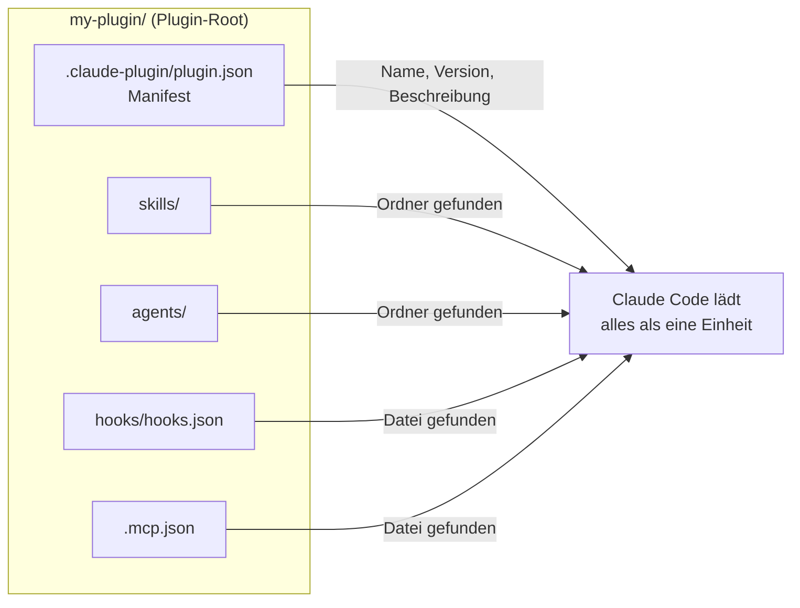

# S2.11 · Plugins: ein Bündel schnüren

<!-- meta:start -->
> **Regal:** [Plugins](README.md#plugins) · **Stufe:** Kern · **~15 Min** · **Voraussetzungen:** [S2.2 Eine SKILL.md schreiben](s2-02-skill-schreiben.md) · [S2.6 Hooks als Sensoren: die drei Eckpfeiler](s2-06-hooks-als-sensoren.md)
>
> ← [S2.10 Hook-Ausgaben und das Secure Diff Gate](s2-10-hook-ausgaben.md) · [Bibliothek](README.md) · [S2.12 Plugin-Lebenszyklus, Scopes und Marketplaces](s2-12-plugin-lebenszyklus.md) →
<!-- meta:end -->

## Schnellcheck

- Kannst du ohne Nachschlagen sagen, wo `plugin.json` in einem Plugin liegen muss und welche Teile Claude Code von selbst findet?
- Hast du schon einmal ein Plugin mit `--plugin-dir` lokal geladen und seine Struktur angesehen?

## Auf einen Blick

Ein Plugin ist ein Verzeichnis, das Skills, Agents, Hooks, MCP-Server und weitere Komponenten bündelt; Claude Code installiert und lädt es als eine Einheit. Das Manifest liegt unter `.claude-plugin/plugin.json`, alles andere direkt im Plugin-Root, und die Komponenten findet Claude Code über die Ordner von selbst. Bevor du ein Plugin weitergibst, prüfst du es mit `claude plugin validate <path>`; zum Testen lädst du es mit `--plugin-dir`, ohne es zu installieren.

## Bild im Kopf

Denk an ein Sicherheitsmodul für deine Anlage, etwa ein biometrisches Zutrittsmodul. Darin steckt, was zusammengehört: der Fingerabdruckscanner (Sensoren = Hooks), der Abgleich-Algorithmus (Logik = Agents), die Standardabläufe für „Zutritt erlaubt" und „Zutritt verweigert" (Verfahren = Skills), die Tasten am Bedienteil (Bedienung = Commands) und das Typenschild mit der Konfiguration (Metadaten = `plugin.json`). Du kaufst das Modul, baust es ein, und es arbeitet mit deiner bestehenden Anlage zusammen. Du musst nicht jedes Teil selbst bauen und verdrahten.

Ein Claude-Code-Plugin ist dieselbe Idee: einmal installieren, und du bekommst einen zusammenhängenden Satz neuer Fähigkeiten.



## Im Detail

### Was ein Plugin ist

Sammelst du Skills, Hooks, Agents und Commands, willst du sie irgendwann zusammen packen. Ein **Plugin** ist dieses Paket: ein in sich geschlossenes Bündel, das du weitergeben kannst und das Claude Code einen zusammenhängenden Satz von Fähigkeiten hinzufügt.

Ein Plugin kann enthalten:

- zusammengehörige Skills (etwa alle Skills für einen Code-Review-Ablauf)
- eigene Commands (etwa `/review`, `/security-scan`)
- Agents: Subagenten-Definitionen, an die Claude Aufgaben abgeben kann
- Hooks (automatische Abläufe)
- MCP-Server

Installiert und geladen wird das alles zusammen, als eine Einheit.

### Aufbau eines Plugins

So sieht ein Plugin-Verzeichnis aus. Nicht jedes Plugin braucht alle Teile:

```
my-plugin/
  .claude-plugin/
    plugin.json            # MUST be here, not in the plugin root
  skills/
    my-skill/
      SKILL.md             # skill instructions
    another-skill/
      SKILL.md
  commands/
    my-command.md          # flat command files (older form of skills; prefer skills/)
    another-command.md
  agents/
    my-agent.md            # subagent definitions
  hooks/
    hooks.json             # plugin-bundled hook config (JSON schema = settings.json hooks)
  monitors/
    monitors.json          # background-monitor definitions (poll logs, PRs, files)
  scripts/
    format.sh              # helper scripts your hooks call by path (a convention, nothing runs them on install)
  bin/                     # PATH-injected executables (HANDLE WITH CARE)
    my-cli
  .mcp.json                # bundled MCP servers (loaded with the plugin)
  .lsp.json                # bundled LSP server configurations
  settings.json            # plugin defaults: only agent and subagentStatusLine take effect
```

Drei Regeln zum Aufbau:

- **Das Manifest liegt unter `.claude-plugin/plugin.json`**, nicht im Plugin-Root. Nur das Manifest gehört in `.claude-plugin/`. `skills/`, `commands/`, `hooks/` und alles andere liegen direkt im Plugin-Root; Komponenten, die du in `.claude-plugin/` ablegst, lädt Claude Code nicht.
- **Das Manifest ist optional.** Fehlt es, oder liegt `plugin.json` versehentlich im Root, lädt das Plugin trotzdem, aber ohne deine Angaben: Lädst du es mit `--plugin-dir`, heißt es wie sein Ordner, und die Version ist unbekannt. Sieht Claude Code dein Plugin unter einem falschen Namen oder ohne Version, prüf das zuerst.
- **`commands/` ist die ältere Form.** Flache Markdown-Dateien in `commands/` funktionieren weiter. Für neue Plugins empfiehlt die Doku `skills/`.

Installierte Plugins legt Claude Code als Kopie unter `~/.claude/plugins/cache/<marketplace>/<plugin>/<version>/` ab. Dort kannst du jede Datei lesen, wie in der Demo und der Übung unten.

### Hooks im Plugin

Ältere Plugins und frühere Fassungen dieses Kurses legten rohe Shell-Dateien unter `hooks/` ab, etwa `hooks/pre-tool-use.sh`. Das ist überholt. Plugin-Hooks stehen heute in `hooks/hooks.json`, mit demselben JSON-Aufbau wie der `hooks`-Block in `settings.json` ([S2.8](s2-08-hook-einrichten.md)). Brauchst du ein Skript, verweist du aus dem JSON darauf: `"command": "${CLAUDE_PLUGIN_ROOT}/hooks/pre-tool-use.sh"`. `${CLAUDE_PLUGIN_ROOT}` ist der absolute Pfad der installierten Plugin-Version.

### Das Manifest

**`.claude-plugin/plugin.json`**, das Manifest:

```json
{
  "name": "my-plugin",
  "version": "2.1.0",
  "description": "A plugin for automated code review and security scanning",
  "author": {
    "name": "your-name"
  },
  "dependencies": []
}
```

Pflicht ist nur `name`. Er wird zum Präfix jedes Skills und Agents des Plugins, etwa `/my-plugin:review`. `author` ist ein Objekt mit `name` (Pflicht) und optional `email` und `url`; ein einfacher Text lässt `claude plugin validate` scheitern. `dependencies` nennt Plugins, die aktiv sein müssen, damit dieses funktioniert ([S2.12](s2-12-plugin-lebenszyklus.md)).

Die Komponenten zählst du im Manifest nicht auf. Skills, Commands, Agents, Hooks und MCP-Server findet Claude Code über die Ordnerstruktur (Auto-Discovery): Leg sie in den richtigen Ordner, benenne sie sinnvoll, und der Plugin-Loader findet sie. Setzt du im Manifest doch `commands` oder `agents`, ersetzt das den Standardordner, `commands/` wird dann nicht mehr durchsucht. Pfade im Manifest beginnen immer mit `./`.

Ein Feld `enabled` gibt es im Manifest nicht; `claude plugin validate` meldet es als unbekannt, und Claude Code ignoriert es. Um ein Plugin abzuschalten, ohne es zu löschen, nimmst du `claude plugin disable <name>`, statt Dateien umzubenennen.

### Prüfen und lokal laden

- `claude plugin validate <path>` prüft das Manifest und das Frontmatter der Skills, Agents und Commands. Der Befehl braucht einen **Pfad**, keinen Plugin-Namen. `--strict` behandelt Warnungen als Fehler, das passt für CI.
- `claude --plugin-dir ./my-plugin` lädt das Plugin für eine Sitzung, ohne es zu installieren; ein `.zip` des Plugins geht auch. Änderst du Dateien, lädst du sie in der laufenden Sitzung mit `/reload-plugins` neu.
- Skills und Commands eines Plugins rufst du mit Präfix auf: `/<plugin>:<skill>`.

Wie du Plugins installierst, verwaltest und verteilst, steht in [S2.12](s2-12-plugin-lebenszyklus.md). Was ein fremdes Plugin auf deinem Rechner darf, steht in [S2.13](s2-13-plugin-lieferkette.md).

## Vorführen

### Demo: Anatomie eines Plugins (etwa 5 Minuten)

**Ziel:** Zeigen, dass ein Plugin nur ein Verzeichnis mit gut strukturierten Dateien ist. Keine Magie, nichts kompiliert, alles lesbar und änderbar.

**Vorbereitung**

- Den Pfad `~/.claude/plugins/cache/` kennen
- Mindestens ein Plugin installiert haben (ideal ist 🔧 agentic-os, eine eigene Erweiterung, siehe [S2.13](s2-13-plugin-lieferkette.md))

**Schritt 1: installierte Plugins auflisten**

```bash
ls ~/.claude/plugins/cache/
```

Zeig die Liste. Die Ordner auf der obersten Ebene sind die Marketplaces. Darunter liegt je Plugin ein Ordner und darin je installierter Version einer: `~/.claude/plugins/cache/<marketplace>/<plugin>/<version>/`. Sag: „Jeder Plugin-Ordner hier ist ein Plugin. Machen wir eins auf."

**Schritt 2: die Struktur erkunden**

```bash
ls ~/.claude/plugins/cache/agentic-os-marketplace/agentic-os/
# Expected: one folder per installed version

cd ~/.claude/plugins/cache/agentic-os-marketplace/agentic-os/<version>/
ls -a
# Expected: .claude-plugin/  skills/  commands/  agents/  hooks/ (varies)

cat .claude-plugin/plugin.json
```

Geh das Manifest durch:

- `name`, `version`, `description`
- Welche Skills, Commands und Agents das Plugin mitbringt, steht meist **nicht** im Manifest. Claude Code findet sie über die Ordner `skills/`, `commands/` und `agents/`.
- Ein Feld zum Abschalten gibt es nicht. Abgeschaltet wird mit `claude plugin disable <name>`.

Sag: „Das ist das Typenschild des Moduls: Name, Version, Beschreibung. Was eingebaut ist, siehst du an den Ordnern daneben."

**Schritt 3: einen Skill und einen Agent lesen**

```bash
ls skills/
cat skills/wrap-up/SKILL.md | head -30
```

Zeig das YAML-Frontmatter und den Markdown-Teil darunter.

```bash
ls agents/
cat agents/<agent>.md | head -20
```

Sag: „Agents sind wie spezialisierte Teammitglieder: Jeder hat eine Rolle, Zuständigkeiten und eine Anleitung, wie er arbeitet."

<details><summary>Für Moderierende</summary>

**Dauer:** etwa 5 Minuten (Schritt 1: 1 Min., Schritt 2: 2 Min., Schritt 3: 2 Min.).

**Sagen:**

- „Ein Plugin ist ein in sich geschlossenes Sicherheitsmodul: Sensoren (Hooks), Verfahren (Skills), Teamrollen (Agents) und Bedientasten (Commands) in einem Paket."
- „Es sind nur Dateien. Du kannst jede Zeile lesen, jede Anweisung ändern und es für die Abläufe deines Teams forken."
- „Einmal installieren, und es ist in jedem deiner Projekte da. Updates kommen über den Marketplace, mit `claude plugin update` oder automatisch."
- „Abschalten, ohne zu löschen: `claude plugin disable <name>`."
- „Euer Team kann Plugins für eure eigenen Abläufe bauen und intern verteilen."

**Wenn agentic-os nicht installiert ist:** Jedes installierte Plugin geht. `claude plugin list` zeigt, welche da sind; dann `cat ~/.claude/plugins/cache/<marketplace>/<plugin>/<version>/.claude-plugin/plugin.json`.

**Wenn du den Pfad nicht findest:** `claude plugin list --json` nennt für jedes Plugin `installPath`, das Verzeichnis, aus dem es lädt. `claude plugin details <name>` listet die Komponenten eines Plugins, ohne dass du Ordner durchsuchen musst.

**Wenn gar kein Plugin installiert ist:** Zeig das Kurs-Repo selbst, es ist ein Plugin: `.claude-plugin/plugin.json`, `skills/`, `agents/`.

**Wenn ein Plugin kein `.claude-plugin/plugin.json` hat:** Das ist erlaubt, das Manifest ist optional. Die Komponenten liegen trotzdem in den üblichen Ordnern.

</details>

## Selbst machen

### Übung: ein Plugin erkunden und selbst aufsetzen

**Ziel:** Die Anatomie eines echten Plugins durch Lesen verstehen und dann die Struktur eines eigenen Mini-Plugins aufsetzen. Danach sind Plugins kein Rätsel mehr, sondern Verzeichnisse mit Dateien, die du lesen und ändern kannst.

**Hintergrund:** Du arbeitest schon mit Systemen aus modularen Komponenten: Alarmmodule, Zutrittszentralen, Lesermodule. Jedes hat eine klare Struktur. Um es einzubauen und zu konfigurieren, musst du die Elektronik nicht verstehen, aber die Schnittstelle. Mit Claude-Code-Plugins ist es genauso: Lies die Struktur, versteh die Schnittstelle, dann kannst du erweitern, ändern oder selbst bauen.

**Schritt 1: ein Plugin erkunden**

> **Hinweis:** Nimm ein Plugin, das du installiert hast (`~/.claude/plugins/cache/`), oder frag die Moderation. Alternativ erkundest du das Kurs-Repo selbst, es hat dieselbe Struktur.
>
> **`<plugin-name>` steht in dieser Übung für den ganzen Pfad `<marketplace>/<plugin>/<version>`**, also zum Beispiel `claude-plugins-official/code-review/` und darunter der Versionsordner. So legt Claude Code installierte Plugins ab.

```bash
# See what plugins are installed
ls ~/.claude/plugins/cache/

# Pick one and go inside it
ls ~/.claude/plugins/cache/<plugin-name>/
```

Lies das Manifest:

```bash
cat ~/.claude/plugins/cache/<plugin-name>/.claude-plugin/plugin.json
```

> Das Manifest liegt immer unter `.claude-plugin/plugin.json`, in einem Unterordner `.claude-plugin/`, nie im Plugin-Root. Findet `cat` keine Datei, hat das Plugin kein Manifest. Das ist erlaubt; der Name kommt dann aus dem Marketplace-Eintrag.

Beantworte schriftlich:

- Welche Version hat das Plugin?
- Wie viele Skills bringt es mit? (Schau in `skills/`, das Manifest listet sie meist nicht.)
- Hat es Commands? Wenn ja, welche?
- Gibt es ein Feld `dependencies`? Was steht darin?

**Schritt 2: einen Skill genau lesen**

```bash
# List available skills
ls ~/.claude/plugins/cache/<plugin-name>/skills/

# Pick one and read it fully — look for the SKILL.md file
cat ~/.claude/plugins/cache/<plugin-name>/skills/<skill-name>/SKILL.md
```

Beantworte:

- Welche Auslöser nennt der Skill?
- Welche Schritte soll Claude laut Skill gehen?
- Überrascht dich etwas, eine Anweisung an Claude, auf die du selbst nicht gekommen wärst?

**Schritt 3: eine Agent-Definition lesen**

```bash
ls ~/.claude/plugins/cache/<plugin-name>/agents/
cat ~/.claude/plugins/cache/<plugin-name>/agents/*.md | head -60
```

Beantworte:

- Wie unterscheidet sich ein Agent von einem Skill? (Tipp: Schau auf die beschriebene Rolle.)
- Reagiert der Agent (wartet, bis er gerufen wird) oder handelt er von sich aus?

**Schritt 4: ein eigenes Mini-Plugin aufsetzen**

Leg eine minimale Plugin-Struktur für ein erdachtes Plugin aus deiner Arbeit an, zum Beispiel `door-audit-plugin` (prüft Zutrittsprotokolle und erzeugt Berichte), `firmware-tracker` (verfolgt Firmware-Stände über alle Geräte) oder `incident-checklist` (geht dein Incident-Response-SOP durch).

```bash
# macOS / Linux / Git Bash
mkdir -p ./my-mini-plugin/.claude-plugin
mkdir -p ./my-mini-plugin/skills/my-skill
mkdir -p ./my-mini-plugin/commands

# Create the manifest at .claude-plugin/plugin.json (NOT in the plugin root)
cat > ./my-mini-plugin/.claude-plugin/plugin.json << 'EOF'
{
  "name": "my-mini-plugin",
  "version": "0.1.0",
  "description": "My first plugin — [describe what it does]",
  "author": {
    "name": "[your name]"
  }
}
EOF
```

```powershell
# Windows PowerShell
New-Item -ItemType Directory -Force -Path ".\my-mini-plugin\.claude-plugin", ".\my-mini-plugin\skills\my-skill", ".\my-mini-plugin\commands" | Out-Null
@'
{
  "name": "my-mini-plugin",
  "version": "0.1.0",
  "description": "My first plugin - [describe what it does]",
  "author": {
    "name": "[your name]"
  }
}
'@ | Set-Content -Encoding utf8 .\my-mini-plugin\.claude-plugin\plugin.json
```

Die Struktur danach:

```
my-mini-plugin/
  .claude-plugin/
    plugin.json
  skills/
    my-skill/
      SKILL.md
  commands/
    my-command.md
```

> **Wichtig:** Das Manifest muss unter `.claude-plugin/plugin.json` liegen, nicht im Plugin-Root; warum, steht oben in „Im Detail". Es nennt nur Name, Version, Beschreibung und Autor. `skills/` und `commands/` findet Claude Code von selbst.

Einen Skill anlegen:

```bash
cat > ./my-mini-plugin/skills/my-skill/SKILL.md << 'EOF'
---
name: my-skill
description: >
  [What this skill does].
when_to_use: >
  [Your trigger phrases and situations]
---

# My Skill

[Your skill instructions here]
EOF
```

```powershell
@'
---
name: my-skill
description: >
  [What this skill does].
when_to_use: >
  [Your trigger phrases and situations]
---

# My Skill

[Your skill instructions here]
'@ | Set-Content -Encoding utf8 .\my-mini-plugin\skills\my-skill\SKILL.md
```

Einen Command anlegen:

```bash
cat > ./my-mini-plugin/commands/my-command.md << 'EOF'
---
description: "[What this command does]"
---

# My Command

When invoked, execute the my-skill skill.
EOF
```

```powershell
@'
---
description: "[What this command does]"
---

# My Command

When invoked, execute the my-skill skill.
'@ | Set-Content -Encoding utf8 .\my-mini-plugin\commands\my-command.md
```

Die Beschreibung steht in Anführungszeichen, sonst liest YAML `[…]` als Liste, und `claude plugin validate` meldet einen Fehler. Ein Feld `name` gibt es in Command-Dateien nicht; der Name des Commands kommt aus dem Dateinamen.

**Schritt 5: prüfen und laden**

Prüf zuerst die Struktur:

<!-- cockpit:example -->
```bash
claude plugin validate ./my-mini-plugin
# expected: ✔ Validation passed
```

Starte Claude Code dann mit dem lokalen Plugin-Verzeichnis:

```bash
claude --plugin-dir ./my-mini-plugin
```

Gib dann ein:

```
/help
```

Such deinen neuen Command in der Liste. Er trägt das Plugin-Präfix, heißt also `/my-mini-plugin:my-command`; auch wenn du `/` tippst, findest du ihn dort. Ruf ihn auf.

**Geschafft, wenn:**

- [ ] du die Struktur eines installierten Plugins auf der Kommandozeile durchgehen kannst
- [ ] du die Fragen zum Aufbau von Skill und Agent beantwortet hast
- [ ] `./my-mini-plugin/.claude-plugin/plugin.json` existiert und gültiges JSON ist
- [ ] `claude plugin validate ./my-mini-plugin` „Validation passed" meldet
- [ ] dein Mini-Plugin mindestens einen Skill und einen Command hat
- [ ] (Extra) dein Command als `/my-mini-plugin:my-command` erscheint und sich aufrufen lässt

**Was macht ein gutes Plugin aus?** Zusammenhalt. Ein Plugin soll eine Sache gut machen. Pack deinen Commit-Ablauf und deinen Doku-Generator nicht ins selbe Plugin, mach zwei daraus. Dann kannst du sie einzeln an- und abschalten.

**Im Team verteilen:** Läuft dein Plugin, legst du es in ein Git-Repo oder einen Marketplace, und dein Team installiert es mit der CLI (`claude plugin install <name>@<marketplace> --scope local|project|user`). Lass niemanden Verzeichnisse von Hand nach `~/.claude/plugins/cache/` kopieren. Mehr dazu in [S2.12](s2-12-plugin-lebenszyklus.md).

**Abschalten, ohne zu löschen:** Ein Plugin, das du mit `--plugin-dir` lädst, startest du einfach ohne das Flag. Ein installiertes Plugin schaltest du mit `claude plugin disable <name>` ab und mit `claude plugin enable <name>` wieder an. `plugin.json` umzubenennen hilft nicht: Das Manifest ist optional, das Plugin lädt dann trotzdem, nur ohne Namen und Version aus dem Manifest.

## Typische Fallen

- **Das Plugin erscheint nicht oder heißt anders als erwartet.** Meist liegt das Manifest im Plugin-Root statt unter `.claude-plugin/`. Claude Code liest es dann nicht und nimmt den Ordnernamen. Prüf außerdem, ob `.claude-plugin/plugin.json` gültiges JSON ist (`python -m json.tool .claude-plugin/plugin.json` unter Windows, `python3 -m json.tool .claude-plugin/plugin.json` unter macOS/Linux), und lass `claude plugin validate <path>` laufen.
- **Das Plugin lädt, aber die Skills fehlen.** `skills/` liegt in `.claude-plugin/` statt im Plugin-Root. Dort hinein gehört nur `plugin.json`.
- **`claude plugin validate` meldet Pfadfehler.** Pfade im Manifest beginnen mit `./` (`"./extra-skills/"`, nicht `"extra-skills"`) und müssen existieren. Setzt du `commands` oder `agents` im Manifest, ersetzt das den Standardordner.
- **`claude plugin validate <name>` scheitert.** Der Befehl erwartet einen Pfad zum Plugin-Verzeichnis oder zum Manifest (`claude plugin validate ./my-plugin`), keinen Plugin-Namen aus `claude plugin list`.
- **Der Skill reagiert nicht auf `/<skill>`.** Plugin-Skills rufst du mit Präfix auf: `/<plugin>:<skill>`.
- **Änderungen kommen nicht an.** Nach dem Bearbeiten der Dateien lädst du sie in der laufenden Sitzung mit `/reload-plugins` neu.

Systematische Fehlersuche bei Plugins: [S4.10](s4-10-diagnose-schritt-fuer-schritt.md).

## Check

Du kannst die Verzeichnisstruktur eines Plugins aufzeichnen und erklären, warum das Manifest unter `.claude-plugin/plugin.json` liegt und nicht im Plugin-Root.

1. Welche Teile eines Plugins findet Claude Code von selbst, und was steht im Manifest?
2. Was passiert, wenn `skills/` versehentlich in `.claude-plugin/` liegt?
3. Wie prüfst und lädst du ein Plugin, ohne es zu installieren?

<details><summary>Quizfrage</summary>

**Frage:** Du legst `plugin.json` direkt in den Plugin-Root statt nach `.claude-plugin/` und startest `claude --plugin-dir ./mein-ordner`. Was passiert?

- **Richtig:** Das Plugin lädt ohne Manifest: Es heißt wie der Ordner, Name und Version aus deiner Datei fehlen.
- Falsch: Das Plugin lädt gar nicht, und Claude Code bricht den Start mit einem Manifest-Fehler ab.
- Falsch: Claude Code liest die Datei trotzdem, weil der Loader beide Orte durchsucht und den Root bevorzugt.
- Falsch: Das Plugin lädt nur das Manifest; die Ordner `skills/` und `commands/` bleiben dabei unbeachtet.

</details>

## Weiterlesen

- [Plugins im Überblick](https://code.claude.com/docs/en/plugins)
- [Ein Plugin erstellen](https://code.claude.com/docs/en/plugins/create)
- [Plugin-Manifest-Referenz](https://code.claude.com/docs/en/plugins/manifest-reference)
- [Plugin-Komponenten](https://code.claude.com/docs/en/plugins/components)
- [Plugins mit Evals testen](https://code.claude.com/docs/en/plugin-evals)
- [S2.2 · Eine SKILL.md schreiben](s2-02-skill-schreiben.md)
- [S2.6 · Hooks als Sensoren: die drei Eckpfeiler](s2-06-hooks-als-sensoren.md)
- [S2.12 · Plugin-Lebenszyklus, Scopes und Marketplaces](s2-12-plugin-lebenszyklus.md)
- [S2.13 · Lieferkettenrisiken bei Plugins](s2-13-plugin-lieferkette.md)
- [S4.10 · Diagnose Schritt für Schritt](s4-10-diagnose-schritt-fuer-schritt.md)
