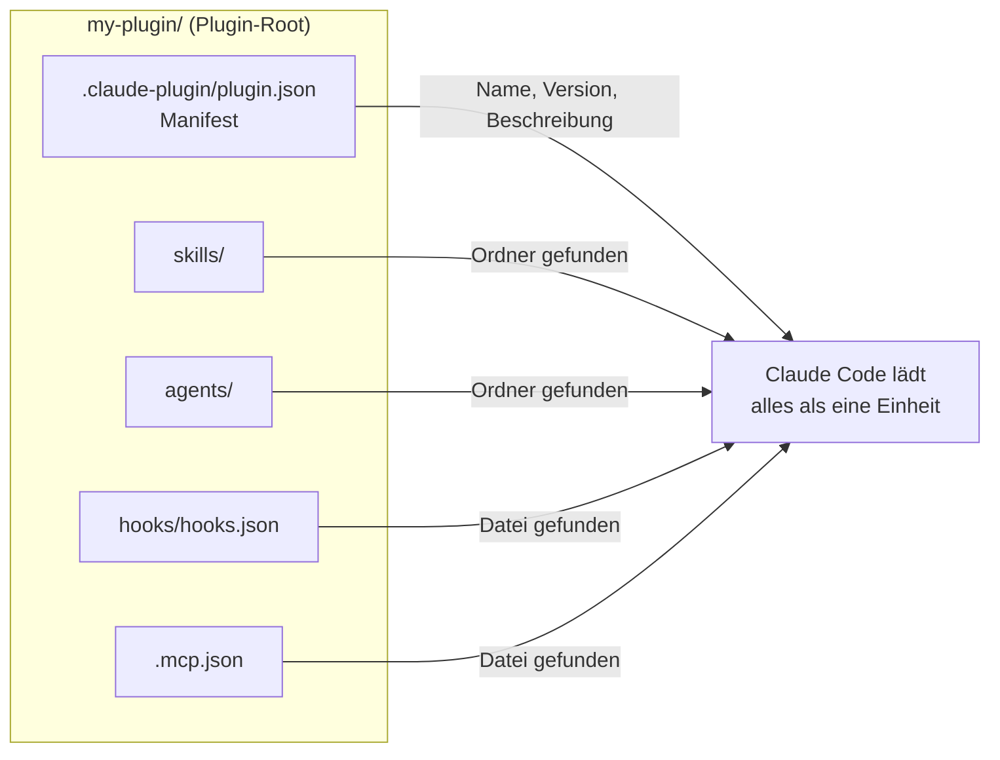

# S2.11 · Plugins: ein Bündel schnüren

<!-- meta:start -->
> **Regal:** [Plugins](README.md#plugins) · **Stufe:** Kern · **~15 Min** · **Voraussetzungen:** [S2.2 Eine SKILL.md schreiben](s2-02-skill-schreiben.md) · [S2.6 Hooks als Sensoren: die drei Eckpfeiler](s2-06-hooks-als-sensoren.md)
>
> ← [S2.10 Hook-Ausgaben und das Secure Diff Gate](s2-10-hook-ausgaben.md) · [Bibliothek](README.md) · [S2.12 Plugin-Lebenszyklus, Scopes und Marketplaces](s2-12-plugin-lebenszyklus.md) →
<!-- meta:end -->

## Schnellcheck

- Kannst du ohne Nachschlagen sagen, wo `plugin.json` in einem Plugin liegen muss und welche Teile Claude Code von selbst findet?
- Hast du schon einmal ein Plugin mit `--plugin-dir` geladen, ohne es zu installieren?

## Auf einen Blick

Ein Plugin ist ein Verzeichnis, das Skills, Agents, Hooks, MCP-Server und weitere Komponenten bündelt; Claude Code lädt es als eine Einheit. Das Manifest liegt unter `.claude-plugin/plugin.json`, alles andere direkt im Plugin-Root, und die Komponenten findet Claude Code über die Ordner von selbst. Mit `claude plugin validate <path>` prüfst du das Plugin, mit `--plugin-dir` lädst du es nur für eine Sitzung, ohne es zu installieren.

## Bild im Kopf

Denk an ein Sicherheitsmodul für deine Anlage, etwa ein biometrisches Zutrittsmodul. Darin steckt, was zusammengehört: der Fingerabdruckscanner (die Sensoren, in Claude Code die Hooks), der Abgleich-Spezialist, an den die Zentrale die schwierigen Fälle übergibt (die Agents), die Standardabläufe für „Zutritt erlaubt“ und „Zutritt verweigert“ (die Skills) und das Typenschild mit Name und Version (das Manifest `plugin.json`). Du baust das Modul als Ganzes ein und musst nicht jedes Teil einzeln verdrahten.

Ein Claude-Code-Plugin ist dieselbe Idee: ein Bündel, das du als Einheit lädst.



## Im Detail

### Was ein Plugin ist

Sammelst du Skills, Hooks und Agents, willst du sie irgendwann zusammen weitergeben. Ein **Plugin** ist dieses Paket: ein in sich geschlossenes Bündel, das Claude Code einen zusammenhängenden Satz von Fähigkeiten hinzufügt. Es kann enthalten:

- Skills, etwa alle Skills für einen Code-Review-Ablauf
- Agents: Subagenten-Definitionen, an die Claude Aufgaben abgeben kann
- Hooks (automatische Abläufe, [S2.6](s2-06-hooks-als-sensoren.md))
- MCP-Server ([S2.14](s2-14-mcp-stecker.md))
- weitere Komponenten wie Monitore, ausführbare Dateien in `bin/` und LSP-Konfigurationen; die Doku listet sie unter [Plugin-Komponenten](https://code.claude.com/docs/en/plugins/components)

Alles zusammen wird als eine Einheit geladen. Skills und Agents eines Plugins tragen den Plugin-Namen als Präfix. Die Doku nennt den Grund: Zwei Plugins können so jeweils einen Skill `hello` mitbringen, ohne zu kollidieren.

### Aufbau eines Plugins

So sieht ein Plugin-Verzeichnis aus. Nicht jedes Plugin braucht alle Teile:

```
my-plugin/
  .claude-plugin/
    plugin.json            # MUST be here, not in the plugin root
  skills/
    my-skill/
      SKILL.md             # skill instructions
  agents/
    my-agent.md            # subagent definition
  hooks/
    hooks.json             # plugin-bundled hook config
  .mcp.json                # bundled MCP servers
```

Drei Regeln zum Aufbau:

- **Das Manifest liegt unter `.claude-plugin/plugin.json`**, nicht im Plugin-Root. Nur das Manifest gehört in `.claude-plugin/`. `skills/`, `agents/`, `hooks/` und alles andere liegen direkt im Plugin-Root. Die Doku sagt es so: „Only `plugin.json` goes inside `.claude-plugin/`.“
- **Das Manifest ist optional.** Fehlt es, oder liegt `plugin.json` versehentlich im Root, lädt Claude Code die Komponenten trotzdem. Den Plugin-Namen nimmt es dann vom Ordner, wenn du mit `--plugin-dir` lädst. Sieht Claude Code dein Plugin unter einem falschen Namen, prüf das zuerst.
- **`commands/` ist die ältere Form.** Flache Markdown-Dateien in `commands/` funktionieren weiter; für neue Plugins empfiehlt die Doku `skills/`.

Installierte Plugins legt Claude Code als Kopie unter `~/.claude/plugins/cache/<marketplace>/<plugin>/<version>/` ab; dort kannst du jede Datei lesen. Zum Selbstbauen brauchst du das nicht: Dein Plugin liegt in einem beliebigen Ordner, und du gibst Claude Code beim Start seinen Pfad.

### Das Manifest

```json
{
  "name": "my-plugin",
  "version": "2.1.0",
  "description": "A plugin for automated code review and security scanning",
  "author": {
    "name": "your-name"
  }
}
```

Pflicht ist nur `name`. Er wird zum Präfix jedes Skills und Agents des Plugins, etwa `/my-plugin:review`; Leerzeichen sind nicht erlaubt. `author` ist ein Objekt mit `name` (Pflicht) und optional `email` und `url`; ein einfacher Text lässt `claude plugin validate` scheitern. Das Manifest kann außerdem `dependencies` nennen, also Plugins, die aktiv sein müssen, damit dieses funktioniert ([S2.12](s2-12-plugin-lebenszyklus.md)).

Die Komponenten zählst du im Manifest nicht auf. Skills, Agents, Hooks und MCP-Server findet Claude Code über die Ordnerstruktur (Auto-Discovery). Pfade im Manifest beginnen immer mit `./`. Ein Feld `enabled` gibt es nicht; `claude plugin validate` meldet es als unbekannt. Ein installiertes Plugin schaltest du mit `claude plugin disable <name>` ab, statt Dateien umzubenennen.

### Hooks im Plugin

Plugin-Hooks stehen in `hooks/hooks.json`, mit demselben Aufbau wie der `hooks`-Block in `settings.json` ([S2.8](s2-08-hook-einrichten.md)), nur zusätzlich in einen Schlüssel `"hooks"` gepackt. Die Doku: Eine Datei, die nur die Ereignisliste ohne diesen Wrapper enthält, lädt nicht. Brauchst du ein Skript, verweist du aus dem JSON darauf:

```json
{
  "hooks": {
    "PreToolUse": [
      {
        "matcher": "Bash",
        "hooks": [
          { "type": "command", "command": "\"${CLAUDE_PLUGIN_ROOT}\"/hooks/check.sh" }
        ]
      }
    ]
  }
}
```

`${CLAUDE_PLUGIN_ROOT}` ist der absolute Pfad der installierten Plugin-Version. Die Anführungszeichen um die Variable sind Absicht: Die Doku verlangt sie, damit ein Pfad mit Leerzeichen ein Wort bleibt (unter Windows etwa bei einem Benutzernamen mit Leerzeichen), und `claude plugin validate` warnt davor.

### Prüfen und laden

- `claude plugin validate <path>` prüft das Manifest und das Frontmatter der Skills, Agents und Commands. Der Befehl braucht einen **Pfad**, keinen Plugin-Namen. `--strict` behandelt Warnungen als Fehler, das passt für CI.
- `claude --plugin-dir ./my-plugin` lädt das Plugin nur für diese Sitzung („for this session only“, schreibt die Doku); ein `.zip` des Plugins geht auch. Änderst du Dateien, lädst du sie in der laufenden Sitzung mit `/reload-plugins` neu.
- Skills eines Plugins rufst du mit Präfix auf: `/<plugin>:<skill>`.
- `claude --plugin-dir ./my-plugin plugin details <name>` zeigt, was das Plugin mitbringt, ohne eine Sitzung zu öffnen: die Komponenten und die Token, die es jeder Sitzung hinzufügt.

Wie du Plugins installierst, verwaltest und verteilst, steht in [S2.12](s2-12-plugin-lebenszyklus.md). Was ein fremdes Plugin auf deinem Rechner darf, steht in [S2.13](s2-13-plugin-lieferkette.md).

## Selbst machen

### Übung: ein Mini-Plugin bauen und laden (etwa 15 Minuten)

**Ziel:** Du baust ein Plugin aus einem Skill und einem Agent, prüfst es, lädst es nur für eine Sitzung und rufst seinen Skill mit Präfix auf.

**Startzustand:** ein leerer Ordner `~/cc-workshop/plugin`. Leg ihn an und wechsle hinein (`mkdir -p ~/cc-workshop/plugin && cd ~/cc-workshop/plugin`, in PowerShell `New-Item -ItemType Directory -Force "$HOME\cc-workshop\plugin"; Set-Location "$HOME\cc-workshop\plugin"`). Das Plugin bekommt absichtlich einen anderen Ordnernamen (`greeter-src`) als Plugin-Namen (`greeter`); das brauchst du in Schritt 5. Nichts davon wird installiert, und deine Konfiguration bleibt unberührt.

1. Leg die Ordner an.

   ```bash
   mkdir -p greeter-src/.claude-plugin greeter-src/skills/hello greeter-src/agents
   ```

   ```powershell
   New-Item -ItemType Directory -Force greeter-src\.claude-plugin, greeter-src\skills\hello, greeter-src\agents | Out-Null
   ```

2. Speichere die drei Dateien mit deinem Editor. Der Pfad steht jeweils über dem Block.

   `greeter-src/.claude-plugin/plugin.json`

   ```json
   {
     "name": "greeter",
     "description": "A tiny plugin to learn the layout",
     "version": "0.1.0",
     "author": {
       "name": "Your Name"
     }
   }
   ```

   `greeter-src/skills/hello/SKILL.md`

   ```markdown
   ---
   name: hello
   description: Greet the user and mark the reply
   disable-model-invocation: true
   ---

   Greet the user in one sentence and end your reply with the exact word GREETER-V1.
   ```

   `greeter-src/agents/haiku-writer.md`

   ```markdown
   ---
   name: haiku-writer
   description: Writes one haiku about a topic the user names
   ---

   You write exactly one haiku about the topic you are given. Reply with the haiku only.
   ```

3. Prüf das Plugin und lass dir seine Komponenten zeigen.

   <!-- cockpit:example -->
   ```bash
   claude plugin validate ./greeter-src
   claude --plugin-dir ./greeter-src plugin details greeter
   ```

   Erwartet: `validate` schließt mit `✔ Validation passed` ab (so steht es in der Doku). `plugin details` nennt Name, Version und Beschreibung und danach einen Abschnitt `Component inventory` mit deinem Skill `hello` und dem Agent `haiku-writer`. Fehlt etwas, liegt eine Datei am falschen Ort.

4. Starte eine Sitzung mit dem Plugin und ruf den Skill auf.

   ```bash
   claude --permission-mode default --plugin-dir ./greeter-src
   ```

   Tipp in der Sitzung `/greeter:hello`. Erwartet: Claude grüßt und beendet die Antwort mit `GREETER-V1`.

5. Ändere den Skill, ohne die Sitzung zu beenden. Öffne `greeter-src/skills/hello/SKILL.md` im Editor, ersetze `GREETER-V1` durch `GREETER-V2` und speichere. Tipp in der Sitzung `/reload-plugins`. Erwartet: eine Zeile, die mit `Reloaded:` beginnt (so nennt es die Doku). Ruf `/greeter:hello` noch einmal auf. Erwartet: Die Antwort endet jetzt mit `GREETER-V2`. Beende die Sitzung mit `/exit`.

6. Prüf, dass nichts installiert wurde. Starte `claude` ohne `--plugin-dir` und tipp `/greeter:hello`. Erwartet: Es kommt kein Gruß mit `GREETER-V2`; ohne das Flag ist der Skill nicht geladen. Das Plugin gilt nur für die Sitzungen, in denen du `--plugin-dir` angibst. Beende die Sitzung.

**Aufräumen:** Lösch den Ordner `~/cc-workshop/plugin`. Mehr gibt es nicht aufzuräumen.

**Geschafft, wenn:**

- [ ] `claude plugin validate ./greeter-src` `✔ Validation passed` meldet
- [ ] `plugin details` den Skill `hello` und den Agent `haiku-writer` zeigt
- [ ] `/greeter:hello` in der Sitzung mit `--plugin-dir` geantwortet hat, erst mit `GREETER-V1`, nach `/reload-plugins` mit `GREETER-V2`
- [ ] derselbe Befehl in einer Sitzung ohne das Flag unbekannt war

### Extra: Manifest am falschen Ort (etwa 5 Minuten)

Verschieb `greeter-src/.claude-plugin/plugin.json` in den Ordner `greeter-src` (Bash: `mv greeter-src/.claude-plugin/plugin.json greeter-src/`, PowerShell: `Move-Item greeter-src\.claude-plugin\plugin.json greeter-src\`). Lass dir mit `claude --plugin-dir ./greeter-src plugin list` die Session-Plugins zeigen. Erwartet nach der Doku: Das Plugin erscheint unter dem Ordnernamen, `greeter-src@inline`, nicht als `greeter@inline`. Skills und Agents sind aber da, nur das Präfix ändert sich. Leg die Datei zurück und lass den Befehl noch einmal laufen: Jetzt steht `greeter@inline` dort.

### Extra: ein Hook im Plugin (etwa 10 Minuten)

Leg `greeter-src/hooks/hooks.json` an. Der Hook schreibt bei jeder Eingabe eine Zeile in eine Datei im Arbeitsordner:

```json
{
  "hooks": {
    "UserPromptSubmit": [
      {
        "hooks": [
          { "type": "command", "command": "echo ran >> hook-ran.txt" }
        ]
      }
    ]
  }
}
```

`claude --plugin-dir ./greeter-src plugin details greeter` nennt den Hook jetzt im `Component inventory`. Starte eine Sitzung im Ordner `~/cc-workshop/plugin` mit dem Flag, schick irgendeinen Auftrag ab und beende die Sitzung. Erwartet: In `~/cc-workshop/plugin` liegt eine Datei `hook-ran.txt` mit mindestens einer Zeile `ran`. Lässt du die äußere Klammer `"hooks"` weg, lädt die Datei nach der Doku nicht.

## Typische Fallen

- **Das Plugin erscheint nicht oder heißt anders als erwartet.** Meist liegt das Manifest im Plugin-Root statt unter `.claude-plugin/`. Claude Code nimmt dann den Ordnernamen. Prüf außerdem, ob `plugin.json` gültiges JSON ist (`python -m json.tool .claude-plugin/plugin.json`, unter macOS und Linux `python3`), und lass `claude plugin validate <path>` laufen.
- **Das Plugin lädt, aber die Skills fehlen.** `skills/` liegt in `.claude-plugin/` statt im Plugin-Root. Dort gehört nur `plugin.json` hinein.
- **`claude plugin validate` meldet Pfadfehler.** Pfade im Manifest beginnen mit `./` (`"./extra-skills/"`, nicht `"extra-skills"`) und müssen existieren.
- **`claude plugin validate <name>` scheitert.** Der Befehl erwartet einen Pfad zum Plugin-Verzeichnis oder zum Manifest, keinen Plugin-Namen aus `claude plugin list`.
- **`--plugin-dir` zeigt auf den falschen Ordner.** Die Doku: Das Flag nimmt das Wurzelverzeichnis eines Plugins, also den Ordner mit `.claude-plugin/plugin.json`. Zeigst du auf einen Marketplace-Ordner, lädt ein Plugin darunter nicht, und du siehst keinen Fehler.
- **Der Skill reagiert nicht auf `/<skill>`.** Plugin-Skills rufst du mit Präfix auf: `/<plugin>:<skill>`.
- **Änderungen kommen nicht an.** Nach dem Bearbeiten der Dateien lädst du sie in der laufenden Sitzung mit `/reload-plugins` neu.

Systematische Fehlersuche bei Plugins: [S4.10](s4-10-diagnose-schritt-fuer-schritt.md).

## Check

Du kannst die Verzeichnisstruktur eines Plugins aufzeichnen, es prüfen, ohne es zu installieren, und seinen Skill aufrufen.

1. Welche Teile eines Plugins findet Claude Code von selbst, und was steht im Manifest?
2. Wie rufst du den Skill `hello` eines Plugins `greeter` auf, und warum trägt er ein Präfix?
3. Wie prüfst du ein Plugin, wie lädst du es ohne Installation, und wie übernimmst du eine Änderung in einer laufenden Sitzung?

<details><summary>Auflösung</summary>

1. Skills, Agents, Hooks und MCP-Server findet Claude Code über die Ordner und Dateien im Plugin-Root. Im Manifest stehen Name (Pflicht), Version, Beschreibung und Autor; die Komponenten zählst du dort nicht auf.
2. Mit `/greeter:hello`. Das Präfix ist der Plugin-Name, damit zwei Plugins jeweils einen Skill `hello` mitbringen können, ohne zu kollidieren.
3. Mit `claude plugin validate <path>`, und das mit einem Pfad, nicht mit einem Namen. Geladen wird mit `claude --plugin-dir <path>`, nur für diese Sitzung. Änderungen übernimmt `/reload-plugins`.

</details>

<details><summary>Quizfrage</summary>

**Frage:** Du legst `plugin.json` direkt in den Plugin-Root statt nach `.claude-plugin/` und startest `claude --plugin-dir ./mein-ordner`. Was passiert?

- **Richtig:** Das Plugin lädt ohne Manifest: Es heißt wie der Ordner, Name und Version aus deiner Datei fehlen.
- Falsch: Das Plugin lädt gar nicht, und Claude Code bricht den Start mit einem Manifest-Fehler ab.
- Falsch: Claude Code liest die Datei trotzdem, weil der Loader beide Orte durchsucht und den Root bevorzugt.
- Falsch: Das Plugin lädt nur das Manifest; die Ordner `skills/` und `agents/` bleiben dabei unbeachtet.

</details>

## Weiterlesen

- [Plugins im Überblick](https://code.claude.com/docs/en/plugins)
- [Ein Plugin erstellen](https://code.claude.com/docs/en/plugins/create)
- [Plugin-Manifest-Referenz](https://code.claude.com/docs/en/plugins/manifest-reference)
- [Plugin-Komponenten](https://code.claude.com/docs/en/plugins/components)
- [Plugins mit Evals testen](https://code.claude.com/docs/en/plugin-evals)
- [S2.2 · Eine SKILL.md schreiben](s2-02-skill-schreiben.md)
- [S2.6 · Hooks als Sensoren: die drei Eckpfeiler](s2-06-hooks-als-sensoren.md)
- [S2.12 · Plugin-Lebenszyklus, Scopes und Marketplaces](s2-12-plugin-lebenszyklus.md)
- [S2.13 · Lieferkettenrisiken bei Plugins](s2-13-plugin-lieferkette.md)
- [S4.10 · Diagnose Schritt für Schritt](s4-10-diagnose-schritt-fuer-schritt.md)
