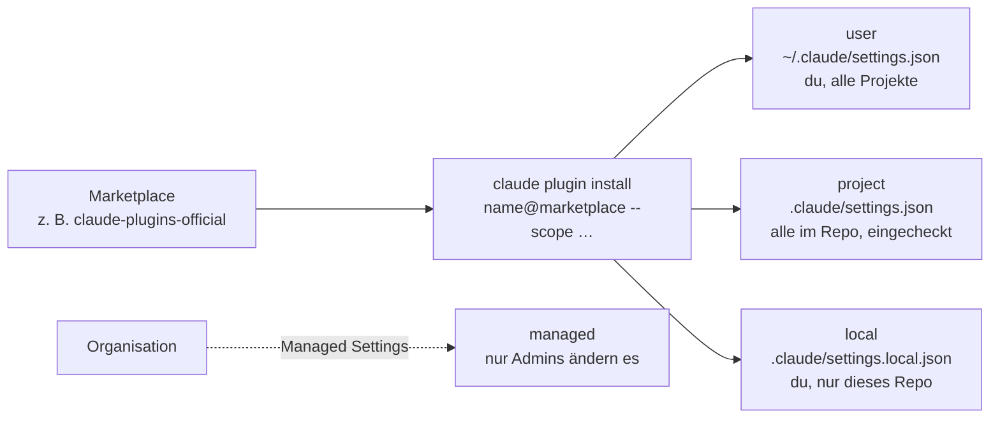

# S2.12 · Plugin-Lebenszyklus, Scopes und Marketplaces

<!-- meta:start -->
> **Regal:** [Plugins](README.md#plugins) · **Stufe:** Vertiefung · **~20 Min** · **Voraussetzungen:** [S2.11 Plugins: ein Bündel schnüren](s2-11-plugins-buendeln.md)
>
> ← [S2.11 Plugins: ein Bündel schnüren](s2-11-plugins-buendeln.md) · [Bibliothek](README.md) · [S2.13 Lieferkettenrisiken bei Plugins](s2-13-plugin-lieferkette.md) →
<!-- meta:end -->

## Schnellcheck

- Kannst du ohne Nachschlagen sagen, welcher Plugin-Scope ins Repo eingecheckt wird und welcher nur für dich gilt?
- Weißt du, mit welchem Befehl du ein Plugin abschaltest, ohne es zu entfernen?

## Auf einen Blick

Plugins installierst du aus einem Marketplace, einem Katalog, den du einmal hinzufügst; danach heißt ein Plugin `<name>@<marketplace>`. Der Scope entscheidet, für wen es aktiv ist: `user` für dich in allen Projekten, `project` für alle im Repo über die eingecheckte `.claude/settings.json`, `local` nur für dich in diesem Repo; `managed` legt die Organisation fest. Die CLI begleitet den ganzen Lebenszyklus: install, enable, disable, update, uninstall und prune.

## Bild im Kopf

Ein Scope entscheidet, wer ein Werkzeug in die Hand bekommt, nicht, was das Werkzeug darf. Stell dir eine Werkstatt vor. Der user-Scope ist dein eigener Werkzeugkoffer: Er geht mit dir in jede Halle. Der project-Scope ist die Werkzeugliste an der Hallenwand: Sie sagt, womit hier alle arbeiten, aber jede holt sich das Werkzeug selbst aus dem Lager. Der local-Scope ist dein persönlicher Zettel an dieser Halle: nur für dich, nur hier. Der managed-Scope ist die Ausrüstung, die die Betriebsleitung vorschreibt und die du nicht änderst.

Ein Plugin läuft in jedem Scope mit denselben Rechten ([S2.13](s2-13-plugin-lieferkette.md)).



## Im Detail

### Marketplaces von Anthropic

Ein Marketplace ist ein Katalog von Plugins, meist ein Git-Repo mit einer Datei `.claude-plugin/marketplace.json`. Anthropic veröffentlicht drei allgemeine Marketplaces:

- **`claude-plugins-official`**: Plugins, die Anthropic pflegt, dazu Plugins von Partnern und anderen Autoren. Claude Code fügt diesen Marketplace beim ersten Start einer interaktiven Terminal-Sitzung selbst hinzu, außer eine Managed Policy verhindert das.
- **Community** (Repo `anthropics/claude-plugins-community`, Marketplace-Name `claude-community`): Plugins Dritter, die ihre Autoren bei Anthropic eingereicht haben. Diesen Marketplace fügst du selbst hinzu. Hinter `@` steht beim Installieren der Marketplace-Name, nicht der Repo-Name.
- **Demo** (Repo `anthropics/claude-code`, Marketplace-Name `claude-code-plugins`): ein paar Beispiel-Plugins. Die meisten gibt es gleichnamig auch im offiziellen Marketplace; installier sie von dort, damit du keine zwei Kopien hast.

Der Name eines Marketplace sagt dir, wer den Katalog herausgibt, nicht, was ein einzelnes Plugin darin tut. Was daraus für die Sicherheit folgt, steht in [S2.13](s2-13-plugin-lieferkette.md).

Du fügst einen Marketplace einmal hinzu und installierst dann Plugins mit `<name>@<marketplace>`. Aus der Shell, ohne Sitzung:

```bash
claude plugin marketplace add anthropics/claude-plugins-community
claude plugin install some-niche-plugin@claude-community
```

In einer Sitzung geht dasselbe mit `/plugin marketplace add …` und `/plugin install <name>@<marketplace>`. Dort installiert `/plugin install` nicht sofort: Es öffnet die Details des Plugins, damit du erst prüfst, was es mitbringt, und dann den Scope wählst.

**Ein eigenes Plugin veröffentlichen:** Du betreibst einen eigenen Marketplace, also ein Repo mit `.claude-plugin/marketplace.json`, oder du reichst dein Plugin über das Entwicklerportal `claude.ai/directory/manage` in Anthropics Verzeichnis ein. Von dort erreicht es Claude Code über die Synchronisation mit dem claude.ai-Konto. Der offizielle Marketplace `claude-plugins-official` nimmt über dieses Portal keine Einreichungen an.

### Scopes: für wen ein Plugin aktiv ist

Plugins lassen sich in verschiedenen Scopes installieren. Der Scope bestimmt, wer das Plugin bekommt und wer darüber entscheidet:

| Scope | Eintrag in | Wer entscheidet | Wofür |
|-------|------------|-----------------|-------|
| **user** | `~/.claude/settings.json` | du selbst | persönliche Werkzeuge, in allen Projekten |
| **project** | `.claude/settings.json` | das Team (im Repo eingecheckt) | gemeinsame Team-Werkzeuge |
| **local** | `.claude/settings.local.json` | du selbst (nicht geteilt) | persönliche Abweichungen in diesem Repo |
| **managed** | Managed Settings der Organisation | Admins | organisationsweite Vorgaben |

Drei Dinge werden oft falsch verstanden:

- **project heißt nicht „automatisch installiert“.** Der eingecheckte Eintrag schaltet das Plugin für alle im Repo ein, lädt es aber nicht auf ihre Rechner. Jede Person installiert es einmal selbst: `claude plugin install <name>@<marketplace> --scope project`.
- **Rangfolge:** Steht dasselbe Plugin in mehreren Scopes, überschreibt local das project, und project überschreibt user. Daraus folgt ein nützlicher Trick: `claude plugin disable <name> --scope local` schaltet ein vom Projekt eingeschaltetes Plugin nur für dich ab. Die Doku nennt genau dieses Beispiel (Plugin `formatter`).
- **managed änderst du nicht selbst.** Solche Plugins siehst du im Tab **Installed** von `/plugin`, kannst sie dort aber weder an- noch abschalten noch entfernen. Installieren kannst du in diesen Scope nicht.

### Plugins mit der CLI verwalten

```bash
# Install from a marketplace you have added
claude plugin install <name>@<marketplace>   # --scope user|project|local (default: user)

# Manage installed plugins
claude plugin list                    # Show all plugins
claude plugin enable <name>           # Enable a disabled plugin (also enables its installed deps)
claude plugin disable <name>          # Disable without removing (blocks if others depend on it)
claude plugin uninstall <name>        # Remove from one scope (default: user)
claude plugin update <name>           # Update to latest version
claude plugin prune                   # Remove orphaned dependencies left over from uninstalls

# Manage the catalog itself
claude plugin marketplace list
claude plugin marketplace remove <name>

# In a session
/plugin                               # Interactive plugin manager
/reload-plugins                       # Hot-reload after changes
```

Ohne `--scope` wirken `install` und `uninstall` auf user. `enable` und `disable` nehmen den spezifischsten Scope, in dem das Plugin schon eingetragen ist. Eine neue Version lädt erst in der nächsten Sitzung, oder nach `/reload-plugins` in einer laufenden.

Vorsicht beim Entfernen eines Marketplace: Wenn du ihn aus dem letzten Scope entfernst, der ihn deklariert, löscht Claude Code auch seinen Cache und deinstalliert **alle** Plugins, die du daraus installiert hast. Willst du ihn nur auffrischen, nimmst du `claude plugin marketplace update`.

`/plugin` ist das Panel in der Sitzung. In `claude -p`-Läufen gibt es das Panel nicht; installierte Plugins laden trotzdem, und verwalten kannst du sie dort mit `claude plugin …` aus der Shell.

### Abhängigkeiten

Plugins können im Feld `dependencies` ihrer `.claude-plugin/plugin.json` andere Plugins verlangen. Die CLI kümmert sich darum:

- `claude plugin install <name>` installiert und aktiviert die erklärten Abhängigkeiten im selben Scope mit.
- `claude plugin enable <name>` schaltet Abhängigkeiten mit ein, die installiert, aber abgeschaltet sind. Ist eine Abhängigkeit gar nicht installiert, scheitert `enable` und nennt dir den `claude plugin install`-Befehl dafür.
- `claude plugin disable <name>` weigert sich, solange ein anderes aktives Plugin davon abhängt, und nennt die Plugins, die du zuerst abschalten musst.
- `claude plugin prune` räumt Abhängigkeiten ab, die automatisch mitinstalliert wurden und die kein installiertes Plugin mehr braucht.

### Die CLI-Version festhalten

Plugins und Hooks verhalten sich je nach Claude-Code-Version etwas anders. Wer im Team gleich arbeiten will, hält die Version fest. Die Doku für `claude install [version]` nennt drei Formen: eine Versionsnummer (Beispiel der Doku: `2.1.118`), `stable` oder `latest`. Der Kanal `latest` ist der Standard und liefert neue Versionen sofort; `stable` liefert eine Version, die in der Regel etwa eine Woche alt ist und Releases mit größeren Regressionen überspringt.

Hintergrund-Updates laufen bei einer nativen Installation von selbst. Ob sie aktiv sind, zeigt `claude doctor` in der Zeile `Auto-updates`. `DISABLE_AUTOUPDATER=1` stoppt nur die Hintergrundprüfung; `claude update` und `claude install` gehen dann weiter. `DISABLE_UPDATES=1` sperrt alle Update-Wege. Weiter vertieft das [Setup-Kapitel der Doku](https://code.claude.com/docs/en/setup).

## Selbst machen

### Übung: Bestand lesen und Scopes zuordnen (etwa 10 Minuten)

**Ziel:** Du liest, was bei dir installiert ist und woher es kommt, und ordnest sechs Situationen dem richtigen Scope zu. Die Übung ändert nichts an deiner Konfiguration.

**Startzustand:** ein Terminal in einem beliebigen Ordner. Du startest keine Sitzung. Ein Notizzettel für deine Antworten hilft.

1. Lass dir die installierten Plugins zeigen.

   <!-- cockpit:example -->
   ```bash
   claude plugin list
   claude plugin marketplace list
   ```

   Erwartet: Die erste Ausgabe nennt je Plugin Version, Scope und Status; ist nichts installiert, steht dort ``No plugins installed. Use `claude plugin install` to install a plugin.`` (der Wortlaut der Doku). Plugins, die über dein claude.ai-Konto kommen, stehen in einem eigenen Abschnitt `Synced from claude.ai`, ohne Scope. Die zweite beginnt mit `Configured marketplaces:` und nennt je Marketplace eine Zeile `Source:`, oder sie sagt `No marketplaces configured`. Hast du schon einmal eine interaktive Sitzung gestartet, steht dort `claude-plugins-official`.

2. Notier dir zu jedem installierten Plugin, falls es welche gibt: Name, Marketplace (der Teil hinter `@`) und Scope. Für ein Plugin im Scope `project` oder `local` kannst du die Datei lesen, in der es steht (`.claude/settings.json` bzw. `.claude/settings.local.json` im jeweiligen Projekt; das Plugin steht unter `enabledPlugins`).

3. Ordne jede Situation einem Scope zu und schreib den Befehl dazu auf:

   a. Ein Formatter-Plugin soll in all deinen Projekten laufen.
   b. Das ganze Team soll in diesem Repo dasselbe Code-Review-Plugin benutzen.
   c. Du willst ein experimentelles Plugin nur in diesem einen Repo ausprobieren, ohne dass es im Repo auftaucht.
   d. Ein Kollege klont das Repo aus b. Was muss er tun, damit das Plugin bei ihm wirklich da ist?
   e. Das Team hat das Plugin aus b. eingeschaltet, dir stört es in diesem Repo. Du willst es nur für dich abschalten.
   f. Die Organisation schreibt ein Sicherheits-Plugin vor. Kannst du es abschalten?

<details><summary>Vergleich</summary>

a. user: `claude plugin install <name>@<marketplace>` (user ist der Standard). b. project: `claude plugin install <name>@<marketplace> --scope project`; die Datei `.claude/settings.json` wird eingecheckt. c. local: `--scope local`; der Eintrag landet in `.claude/settings.local.json`. d. Der Eintrag im Repo schaltet es ein, lädt es aber nicht: Er installiert es einmal selbst mit `claude plugin install <name>@<marketplace> --scope project`. e. `claude plugin disable <name> --scope local`; local überschreibt project, und die Datei des Teams bleibt unverändert. f. Nein: managed ist von Admins festgelegt, und du kannst es weder abschalten noch entfernen.

</details>

**Geschafft, wenn:**

- [ ] du in `claude plugin list` den Scope eines Plugins gefunden oder bei einer leeren Liste die Meldung der Doku gesehen hast
- [ ] du `claude plugin marketplace list` gelesen hast und weißt, welche Marketplaces bei dir eingetragen sind
- [ ] du alle sechs Situationen zugeordnet und mit dem Vergleich abgeglichen hast

### Extra: einen kompletten Lebenszyklus durchlaufen (etwa 15 Minuten)

Hier installierst du wirklich, aber nur aus einem Marketplace in deinem Übungsordner und nur im Scope `local`. Deine Benutzer-Einstellungen bleiben unberührt. Claude Code legt für den Marketplace und das Plugin Dateien unter `~/.claude/plugins/` ab; die Schritte 8 bis 10 räumen sie weg. Bricht die Übung ab, führ diese drei Schritte trotzdem aus.

Leg `~/cc-workshop/plugin-lifecycle` an, wechsle hinein und speichere diese Dateien (Ordner vorher anlegen, Bash: `mkdir -p market/.claude-plugin market/plugins/greeter/.claude-plugin market/plugins/greeter/skills/hello`, PowerShell: `New-Item -ItemType Directory -Force market\.claude-plugin, market\plugins\greeter\.claude-plugin, market\plugins\greeter\skills\hello | Out-Null`).

`market/.claude-plugin/marketplace.json`

```json
{
  "name": "practice-market",
  "owner": { "name": "You" },
  "plugins": [
    { "name": "greeter", "source": "./plugins/greeter" }
  ]
}
```

`market/plugins/greeter/.claude-plugin/plugin.json`

```json
{
  "name": "greeter",
  "description": "A tiny plugin for the lifecycle practice",
  "version": "0.1.0",
  "author": { "name": "You" }
}
```

`market/plugins/greeter/skills/hello/SKILL.md`

```markdown
---
name: hello
description: Greet the user
disable-model-invocation: true
---

Greet the user in one sentence.
```

1. `claude plugin marketplace add ./market --scope local`. Erwartet: `Successfully added marketplace: practice-market`, dazu eine Angabe zum Scope.
2. `claude plugin install greeter@practice-market --scope local`. Erwartet: `Successfully installed plugin: greeter@practice-market (scope: local)` (so formt es die Doku für ein anderes Plugin).
3. `claude plugin list`. Erwartet: `greeter` mit Scope `local`. Die Datei `.claude/settings.local.json` im Übungsordner enthält den Eintrag unter `enabledPlugins`.
4. `claude plugin disable greeter`. Erwartet: `Successfully disabled plugin: greeter (scope: local)`. Danach `claude plugin enable greeter`.
5. `claude plugin update greeter@practice-market`. Erwartet: ein Hinweis, dass das Plugin schon auf dem neuesten Stand ist.
6. `claude plugin uninstall greeter@practice-market --scope local`. Erwartet: `Successfully uninstalled plugin: greeter (scope: local)`.
7. `claude plugin list` zeigt `greeter` nicht mehr.
8. `claude plugin marketplace remove practice-market`. Erwartet: `Successfully removed marketplace: practice-market`.
9. `claude plugin marketplace list` nennt `practice-market` nicht mehr. Lösch den Ordner `~/cc-workshop/plugin-lifecycle`.
10. Sieh nach, ob der Ordner `~/.claude/plugins/cache/practice-market` noch da ist, und lösch ihn. Im Probelauf lag die Kopie des Plugins dort auch nach Schritt 8 noch. Die Doku erklärt es: Beim Deinstallieren markiert Claude Code die Kopie nur und räumt sie erst 14 Tage später weg, und nach dem Deinstallieren deines letzten Plugins bleibt sie liegen, bis du wieder eines installierst.

## Typische Fallen

- **Das Plugin wird nicht gefunden.** Der Marketplace ist noch nicht hinzugefügt, oder hinter `@` steht der Repo-Name statt des Marketplace-Namens. Beim Community-Marketplace heißt es `@claude-community`, nicht `@claude-plugins-community`.
- **Im Team fehlt das project-Plugin.** Eingecheckt heißt aktiviert, nicht installiert. Jede Person installiert es einmal selbst mit `--scope project`.
- **Nach einem Update ändert sich nichts.** Die laufende Sitzung behält die Versionen, die sie geladen hat. `/reload-plugins` lädt neu. Hilft das nicht: `claude plugin update <name>` ausführen und danach eine neue Sitzung starten.
- **`disable` wird verweigert.** Ein anderes aktives Plugin hängt davon ab. Schalte zuerst dieses ab.
- **Der Marketplace war weg, und die Plugins auch.** `claude plugin marketplace remove` deinstalliert alles, was du daraus installiert hast. Zum Auffrischen nimmst du `marketplace update`.

Systematische Fehlersuche bei Plugins: [S4.10](s4-10-diagnose-schritt-fuer-schritt.md).

## Check

Du kannst einem Plugin den passenden Scope zuordnen und die Befehle für den Rest des Lebenszyklus nennen.

1. In welche Datei schreibt `--scope local`, und wer sieht den Eintrag?
2. Wie schaltest du ein Plugin, das dein Team im Projekt eingeschaltet hat, nur für dich ab?
3. Was passiert mit den Plugins, wenn du einen Marketplace mit `claude plugin marketplace remove` entfernst?

<details><summary>Auflösung</summary>

1. In `.claude/settings.local.json` im Projekt. Der Eintrag gilt nur für dich und nur in diesem Repo, und er wird nicht geteilt.
2. Mit `claude plugin disable <name> --scope local`. Local überschreibt project; die eingecheckte Datei des Teams bleibt unverändert.
3. Entfernst du den Marketplace aus dem letzten Scope, der ihn deklariert, löscht Claude Code seinen Cache und deinstalliert alle Plugins, die du daraus installiert hast. Zum Auffrischen gibt es `marketplace update`.

</details>

<details><summary>Quizfrage</summary>

**Frage:** Du installierst ein Plugin im project-Scope und committest `.claude/settings.json`. Eine Kollegin klont das Repo. Was gilt für sie?

- **Richtig:** Es ist für sie aktiviert, doch sie installiert es einmal selbst mit `--scope project`.
- Falsch: Das Plugin läuft bei ihr sofort, weil Git den Plugin-Code beim Klonen gleich mit herunterlädt.
- Falsch: Für sie ist es nicht aktiviert, doch sie kann es sich mit `--scope user` selbst einschalten.
- Falsch: Sie muss die Datei erst in `settings.local.json` umbenennen, sonst greift das Plugin nicht.

</details>

## Weiterlesen

- [Plugins installieren und verwalten](https://code.claude.com/docs/en/plugins/install)
- [Anthropics Marketplaces](https://code.claude.com/docs/en/plugins/anthropic-marketplaces)
- [Plugin-Befehle](https://code.claude.com/docs/en/plugins/cli-reference)
- [Setup: eine bestimmte Version installieren, Auto-Updates](https://code.claude.com/docs/en/setup)
- [S2.11 · Plugins: ein Bündel schnüren](s2-11-plugins-buendeln.md)
- [S2.13 · Lieferkettenrisiken bei Plugins](s2-13-plugin-lieferkette.md)
- [S4.10 · Diagnose Schritt für Schritt](s4-10-diagnose-schritt-fuer-schritt.md)
