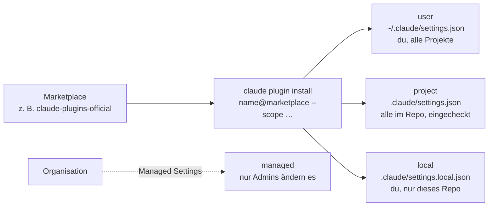

# S2.12 · Plugin-Lebenszyklus, Scopes und Marketplaces

<!-- meta:start -->
> **Regal:** [Plugins](README.md#plugins) · **Stufe:** Vertiefung · **~15 Min** · **Voraussetzungen:** [S2.11 Plugins: ein Bündel schnüren](s2-11-plugins-buendeln.md)
>
> ← [S2.11 Plugins: ein Bündel schnüren](s2-11-plugins-buendeln.md) · [Bibliothek](README.md) · [S2.13 Lieferkettenrisiken bei Plugins](s2-13-plugin-lieferkette.md) →
<!-- meta:end -->

## Schnellcheck

- Kannst du ohne Nachschlagen sagen, welcher Plugin-Scope ins Repo eingecheckt wird und welcher nur für dich gilt?
- Hast du schon einmal `claude plugin install <name>@<marketplace>` mit `--scope` benutzt und danach mit `claude plugin list` geprüft?

## Auf einen Blick

Plugins installierst du aus einem Marketplace, einem Katalog, den du einmal hinzufügst; danach heißt ein Plugin `<name>@<marketplace>`. Der Scope entscheidet, für wen es aktiv ist: `user` für dich in allen Projekten, `project` für alle im Repo über die eingecheckte `.claude/settings.json`, `local` nur für dich in diesem Repo; `managed` legt die Organisation fest. Die CLI begleitet den ganzen Lebenszyklus: install, enable, disable, update, uninstall und prune.

## Bild im Kopf

Scopes sind wie Zutrittszonen in einem Gebäude. Der user-Scope ist dein persönlicher Spind. Der project-Scope ist der Geräteraum des Teams. Der managed-Scope ist die gebäudeweite Sicherheitsrichtlinie, die außer dem Sicherheitsverantwortlichen niemand ändern kann. Der local-Scope ist dein eigenes Fach im Geräteraum: nur für dich, nur an diesem Ort.



## Im Detail

### Marketplaces von Anthropic

Ein Marketplace ist ein Katalog von Plugins, meist ein Git-Repo mit einer Datei `.claude-plugin/marketplace.json`. Anthropic veröffentlicht drei allgemeine Marketplaces:

- **`claude-plugins-official`**: Plugins, die Anthropic pflegt, dazu Plugins von Partnern und anderen Autoren. Claude Code fügt diesen Marketplace beim ersten Start einer interaktiven Terminal-Sitzung selbst hinzu, außer eine Managed Policy verhindert das.
- **Community** (Repo `anthropics/claude-plugins-community`, Marketplace-Name `claude-community`): Plugins Dritter, die ihre Autoren bei Anthropic eingereicht haben. Diesen Marketplace fügst du selbst hinzu. Hinter `@` steht beim Installieren der Marketplace-Name, nicht der Repo-Name.
- **Demo** (Repo `anthropics/claude-code`, Marketplace-Name `claude-code-plugins`): ein paar Beispiel-Plugins. Die meisten gibt es gleichnamig auch im offiziellen Marketplace; installier sie von dort, damit du keine zwei Kopien hast.

Der Name eines Marketplace sagt dir, wer den Katalog herausgibt, nicht, was ein einzelnes Plugin darin tut. Was daraus für die Sicherheit folgt, steht in [S2.13](s2-13-plugin-lieferkette.md).

Du fügst einen Marketplace einmal hinzu und installierst dann Plugins mit `<name>@<marketplace>`:

<!-- cockpit:example -->
```bash
# Add the community marketplace
/plugin marketplace add anthropics/claude-plugins-community

# Install a specific plugin from a specific marketplace
/plugin install code-review@claude-plugins-official
/plugin install some-niche-plugin@claude-community
```

In einer Sitzung installiert `/plugin install` nicht sofort. Es öffnet die Details des Plugins, damit du erst prüfst, was es mitbringt, und dann den Scope wählst. Aus der Shell geht dasselbe ohne Sitzung mit `claude plugin install` (unten).

**Ein eigenes Plugin veröffentlichen:** Du betreibst einen eigenen Marketplace, also ein Repo mit `.claude-plugin/marketplace.json`, oder du reichst dein Plugin über das Entwicklerportal `claude.ai/directory/manage` in Anthropics Verzeichnis ein. Von dort erreicht es Claude Code über die Synchronisation mit dem claude.ai-Konto. Der offizielle Marketplace `claude-plugins-official` nimmt über dieses Portal keine Einreichungen an.

### Scopes: für wen ein Plugin aktiv ist

Plugins lassen sich in verschiedenen Scopes installieren. Der Scope bestimmt, wer das Plugin bekommt und wer darüber entscheidet:

| Scope | Eintrag in | Wer entscheidet | Wofür |
|-------|------------|-----------------|-------|
| **user** | `~/.claude/settings.json` | du selbst | persönliche Werkzeuge, in allen Projekten |
| **project** | `.claude/settings.json` | das Team (im Repo eingecheckt) | gemeinsame Team-Werkzeuge |
| **local** | `.claude/settings.local.json` | du selbst (nicht geteilt) | persönliche Abweichungen in diesem Repo |
| **managed** | Managed Settings der Organisation | Admins | organisationsweite Vorgaben |

Drei Dinge werden oft falsch verstanden:

- **project heißt nicht „automatisch installiert".** Der eingecheckte Eintrag schaltet das Plugin für alle im Repo ein, lädt es aber nicht auf ihre Rechner. Jede Person installiert es einmal selbst: `claude plugin install <name>@<marketplace> --scope project`.
- **Rangfolge:** Steht dasselbe Plugin in mehreren Scopes, gilt local vor project und project vor user.
- **managed änderst du nicht selbst.** Solche Plugins siehst du im Tab **Installed** von `/plugin`, kannst sie dort aber weder an- noch abschalten noch entfernen. Installieren kannst du in diesen Scope nicht.

### Plugins mit der CLI verwalten

```bash
# Install from a marketplace you have added
claude plugin install <name>@<marketplace>   # --scope user|project|local (default: user)

# Manage installed plugins
claude plugin list                    # Show all plugins
claude plugin enable <name>           # Enable a disabled plugin (also enables its installed deps)
claude plugin disable <name>          # Disable without removing (blocks if others depend on it)
claude plugin uninstall <name>        # Remove from one scope (default: user)
claude plugin update <name>           # Update to latest version
claude plugin validate <path>         # Local pre-submission schema/structure check
claude plugin prune                   # Remove orphaned dependencies left over from uninstalls

# Test local plugin during development
claude --plugin-dir ./my-plugin       # Load from local directory
claude --plugin-dir ./my-plugin.zip   # Load directly from a zipped plugin (v2.1.128+)
claude --plugin-url <url>             # Load a zipped plugin from a URL (v2.1.129+)

# In-session management
/plugin                               # Interactive plugin manager
/reload-plugins                       # Hot-reload after changes
```

Ohne `--scope` wirken `install` und `uninstall` auf user. `enable` und `disable` nehmen den spezifischsten Scope, in dem das Plugin schon eingetragen ist.

Seit v2.1.128 nimmt `--plugin-dir` auch ein `.zip`-Archiv direkt. Das hilft Plugin-Autorinnen und -Autoren: Du testest genau das gepackte Artefakt, das du später in einen Marketplace gibst, ohne es erst in ein Arbeitsverzeichnis zu entpacken.

### Abhängigkeiten

Plugins können im Feld `dependencies` ihrer `.claude-plugin/plugin.json` andere Plugins verlangen. Die CLI kümmert sich darum:

- `claude plugin install <name>` installiert und aktiviert die erklärten Abhängigkeiten im selben Scope mit.
- `claude plugin enable <name>` schaltet Abhängigkeiten mit ein, die installiert, aber abgeschaltet sind. Hängt ein Plugin von `agentic-os` ab, wird `agentic-os` beim Aktivieren also mit eingeschaltet. Ist eine Abhängigkeit gar nicht installiert, scheitert `enable` und nennt dir den `claude plugin install`-Befehl dafür.
- `claude plugin disable <name>` weigert sich, solange ein anderes aktives Plugin davon abhängt, und nennt die Plugins, die du zuerst abschalten musst.
- `claude plugin prune` räumt Abhängigkeiten ab, die automatisch mitinstalliert wurden und die kein installiertes Plugin mehr braucht. Nach einem `uninstall` bleiben sie sonst liegen.

### Die CLI-Version festhalten

`claude install` installiert die CLI neu. Ohne Argument holt es die neueste Version, das Verhalten, auf das sich die meisten verlassen. Mit einer Versionsnummer **pinnt** es genau diesen Build:

```bash
claude install              # latest stable
claude install 2.1.140      # pin to 2.1.140 exactly
```

**Wofür:** Einheitlichkeit im Team. Alle im Projekt arbeiten mit demselben CLI-Build, also verhalten sich Plugins und Hooks gleich. Auch in CI ist das wertvoll: Ein automatisches Upgrade zwischen zwei Läufen kann still die Schema-Prüfung oder die Hook-Semantik ändern. Pinne die Version, gegen die deine CI getestet hat, und aktualisiere bewusst.

**Vorsicht:** `claude install` ohne Argument aktualisiert dich. Willst du den gepinnten Stand behalten, ruf es nicht ohne Argument auf. Denk außerdem an die Hintergrund-Updates: Claude Code sucht beim Start und während des Betriebs nach Updates und installiert sie im Hintergrund. Ob sie aktiv sind, zeigt `claude doctor` in der Zeile `Auto-updates`. `DISABLE_AUTOUPDATER` stoppt nur diese Hintergrundprüfung, `claude update` und `claude install` gehen dann weiter; `DISABLE_UPDATES` sperrt alle Update-Wege.

## Typische Fallen

- **Das Plugin wird nicht gefunden.** Der Marketplace ist noch nicht hinzugefügt, oder hinter `@` steht der Repo-Name statt des Marketplace-Namens. Beim Community-Marketplace heißt es `@claude-community`, nicht `@claude-plugins-community`.
- **Im Team fehlt das project-Plugin.** Eingecheckt heißt aktiviert, nicht installiert. Jede Person installiert es einmal selbst mit `--scope project`.
- **Nach einem Update ändert sich nichts.** Die laufende Sitzung behält die Versionen, die sie geladen hat. `/reload-plugins` lädt neu. Hilft das nicht: `claude plugin update <name>` ausführen und danach eine neue Sitzung starten.
- **`disable` wird verweigert.** Ein anderes aktives Plugin hängt davon ab. Schalte zuerst dieses ab.
- **`/plugin` geht in `claude -p` nicht.** In nicht-interaktiven Läufen gibt es das Panel nicht. Installierte Plugins laden trotzdem; verwalten kannst du sie dort mit `claude plugin …` aus der Shell.

Systematische Fehlersuche bei Plugins: [S4.10](s4-10-diagnose-schritt-fuer-schritt.md).

## Check

Du kannst erklären, welchen Scope ein Team-Plugin braucht, damit es über Git verteilt wird, was jede Person danach noch selbst tun muss und warum `managed` nicht dasselbe ist wie `project`.

1. In welche Datei schreibt `--scope local`, und wer bekommt den Eintrag zu sehen?
2. Was tut `claude plugin enable`, wenn eine erklärte Abhängigkeit nicht installiert ist?
3. Was passiert bei `claude install` ohne Argument, und warum ist das für einen gepinnten Stand gefährlich?

<details><summary>Quizfrage</summary>

**Frage:** Du installierst ein Plugin im project-Scope und committest `.claude/settings.json`. Eine Kollegin klont das Repo. Was gilt für sie?

- **Richtig:** Es ist für sie aktiviert, doch sie installiert es einmal selbst mit `--scope project`.
- Falsch: Das Plugin läuft bei ihr sofort, weil Git den Plugin-Code beim Klonen gleich mit herunterlädt.
- Falsch: Für sie ist es nicht aktiviert, doch sie kann es sich mit `--scope user` selbst einschalten.
- Falsch: Sie muss die Datei erst in `settings.local.json` umbenennen, sonst greift das Plugin nicht.

</details>

## Weiterlesen

- [Plugins installieren und verwalten](https://code.claude.com/docs/en/plugins/install)
- [Anthropics Marketplaces](https://code.claude.com/docs/en/plugins/anthropic-marketplaces)
- [Plugin-Befehle](https://code.claude.com/docs/en/plugins/cli-reference)
- [Setup: eine bestimmte Version installieren, Auto-Updates](https://code.claude.com/docs/en/setup)
- [S2.11 · Plugins: ein Bündel schnüren](s2-11-plugins-buendeln.md)
- [S2.13 · Lieferkettenrisiken bei Plugins](s2-13-plugin-lieferkette.md)
- [S4.10 · Diagnose Schritt für Schritt](s4-10-diagnose-schritt-fuer-schritt.md)
