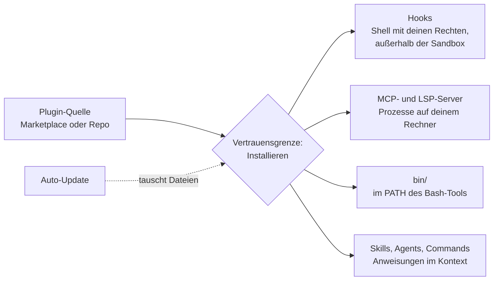

# S2.13 · Lieferkettenrisiken bei Plugins

<!-- meta:start -->
> **Regal:** [Plugins](README.md#plugins) · **Stufe:** Vertiefung · **~10 Min** · **Voraussetzungen:** [S2.12 Plugin-Lebenszyklus, Scopes und Marketplaces](s2-12-plugin-lebenszyklus.md) · 🛡 **Sicherheitsboden**
>
> ← [S2.12 Plugin-Lebenszyklus, Scopes und Marketplaces](s2-12-plugin-lebenszyklus.md) · [Bibliothek](README.md) · [X.1 Community-Skills: wer baut was, das wirklich hilft](x-01-community-skills.md) →
<!-- meta:end -->

## Schnellcheck

- Kannst du ohne Nachschlagen vier Wege nennen, über die ein fremdes Plugin Schaden anrichten kann (übernommenes Repo, `bin/`, Hooks, MCP-Server)?
- Hast du schon einmal `hooks/hooks.json`, `.mcp.json` und `bin/` eines Plugins gelesen, bevor du es installiert hast?

## Auf einen Blick

Ein fremdes Plugin ist fremder Code mit deinen Rechten: Seine Hooks laufen als Shell-Befehle mit deinen vollen Benutzerrechten und außerhalb der Sandbox, seine MCP-Server laufen als Prozesse auf deinem Rechner, und die Programme in seinem `bin/` stehen Claude im `PATH`. Lies deshalb vor der Installation `hooks/hooks.json`, `.mcp.json` und `bin/`, egal aus welchem Marketplace das Plugin kommt.

Auch ein geprüftes Plugin kann sich ändern: Ist Auto-Update an, tauscht Claude Code seine Dateien im Hintergrund aus. Versionen festhalten und der project-Scope helfen, ersetzen aber nicht den Blick in den Code.

## Bild im Kopf

Stell dir einen RS-485-Bus vor, an dem alle OSDP-Leser und Schlossrelais eines Gebäudes hängen. Wer ein Gerät an diesen Bus anschließt, gibt ihm Zugang zum ganzen Segment: Ein kompromittiertes Gerät kann gültig aussehende OSDP-Kommandos senden, die das System als legitim behandelt, ohne dass ein Bediener es merkt. Ein installiertes Plugin ist so ein Gerät am Bus. Was es ausführt, läuft als du.

Dazu kommt die Firmware. Ein Gerät, dessen Hersteller die Firmware aus der Ferne tauschen kann, ist morgen vielleicht nicht mehr das Gerät, das du heute abgenommen hast. Genau das kann Auto-Update mit einem Plugin tun.



## Im Detail

### Die Warnung, die Claude Code selbst zeigt

Öffnest du ein Plugin in `/plugin`, zeigt der Detailbereich vor der Installation eine Vertrauenswarnung. Sie lautet für jeden Marketplace gleich:

> Make sure you trust a plugin before installing, updating, or using it. Anthropic does not control what MCP servers, files, or other software are included in plugins and cannot verify that they will work as intended or that they won't change. See each plugin's homepage for more information.

Sinngemäß: Anthropic kontrolliert nicht, welche MCP-Server, Dateien oder Programme in Plugins stecken, und kann nicht prüfen, ob sie wie gedacht funktionieren oder sich nicht ändern. Installier nur Plugins, denen du traust.

### Was ein Plugin auf deinem Rechner tun kann

Echte Lieferkettenrisiken:

- **Übernommene Repos:** Ein aufgegebenes Repo kann gekapert werden, und ein neuer Maintainer schiebt Schadcode nach.
- **`bin/`-Programme laufen mit deinen Benutzerrechten.** Claude Code hängt das `bin/` jedes aktiven Plugins an den `PATH` der Shell des Bash-Tools. Claudes Bash-Befehle können dort jedes Programm starten.
- **Hooks führen Shell-Befehle in deiner Umgebung aus**, an festen Punkten wie vor oder nach einem Tool-Aufruf ([S2.6](s2-06-hooks-als-sensoren.md)).
- **MCP-Server können auf externe Systeme zugreifen.** Ein stdio-Server läuft als Prozess, den Claude Code auf deinem Rechner startet.
- **Skills, Commands und Agents** kommen als Anweisungen in Claudes Kontext und beeinflussen, was Claude mit seinen Werkzeugen tut.
- **Updates:** Ist Auto-Update für den Marketplace an, aktualisiert Claude Code das Plugin im Hintergrund, und die Dateien, die du geprüft hast, können sich auf der Platte ändern. Beim offiziellen Marketplace ist Auto-Update standardmäßig an, beim Community-Marketplace und bei Marketplaces Dritter aus.

Ein aktiviertes Plugin gehört zu jeder Sitzung, nicht nur zu denen, in denen du es benutzt: Claude Code verbindet sich mit den MCP-Servern, die es deklariert, und seine Hooks laufen bei ihren Ereignissen.

### Wo Rechte-Regeln und Sandbox greifen und wo nicht

Rechte-Regeln ([S1.5](s1-05-rechte-im-alltag.md)) und Sandbox ([S3.9](s3-09-geschuetzte-pfade-und-sandbox.md)) decken die Tool-Aufrufe ab, die Claude macht, nicht den Code, den ein Plugin von sich aus ausführt:

- **Hooks und Server-Prozesse:** Command-Hooks führen Shell-Befehle mit deinen vollen Benutzerrechten aus. Hooks und MCP-Server laufen außerhalb der Sandbox.
- **Claudes Tool-Aufrufe:** Ruft Claude ein MCP-Tool des Plugins auf oder startet per Bash ein Programm aus dessen `bin/`, ist das ein Tool-Aufruf. Dafür gelten deine Rechte-Regeln.

### Wer baut was? Die Herkunft prüfen

Die Plugins, die in diesem Kurs vorkommen, zeigen, wie verschieden die Herkunft sein kann.

> 🔧 **Eigene Erweiterungen:** `agentic-os`, `devil-advocate-swarms` und `multi-model-orchestrator` sind eigene Bausteine, nicht Teil der offiziellen Claude-Code-Installation. Sie zeigen, was mit dem Plugin-System möglich ist. Die Muster dahinter (adversariales Testen, Multi-Modell-Pipelines, Arbeitsweisen für Metakognition) sind echt, die Umsetzungen sind eigene.

- 🔧 **agentic-os**: das zentrale Orchestrierungs-Plugin mit Session-Start, Selbstverbesserungs-Schleifen, Quality Gates, Recherche-Pipeline, Iterations-Log und Wrap-up. Die meisten anderen eigenen Plugins hängen davon ab.
- 🔧 **devil-advocate-swarms**: adversariale Analyse. Startet mehrere Claude-Agenten, die gegen deine Umsetzung argumentieren, und findet Schwächen durch strukturierten Widerspruch ([S3.6](s3-06-devils-advocate.md)).
- 🔧 **multi-model-orchestrator**: verteilt Aufgaben zwischen Claude, Codex und anderen Modellen und koordiniert parallel arbeitende Agenten. Enthält den Command `codex-swarm`, der mehrere Coding-Agenten gleichzeitig startet ([S4.2](s4-02-codex-schwarm.md)).
- **superpowers**: Skills für Metakognition. Sie bringen Claude Code bei, über den eigenen Ablauf nachzudenken: wann brainstormen, wann planen, wann ausführen, wie TDD geht, wie man Code systematisch reviewt. Stammt von Jesse Vincent (Repo `obra/superpowers`) und ist über `claude-plugins-official` installierbar.
- **hookify**: macht es leicht, Hooks über eine geführte Oberfläche anzulegen und zu verwalten, statt JSON von Hand zu bearbeiten. Stammt von Anthropic und liegt im Marketplace `claude-plugins-official`.

Drei Herkünfte: eigene Bausteine, ein Open-Source-Projekt über den offiziellen Katalog und ein Plugin von Anthropic. Für jede gilt dieselbe Prüfung. Wie du fremde Skills und Plugins aus der Community bewertest, steht in [X.1](x-01-community-skills.md).

### So prüfst du ein Plugin vor der Installation

Die Gegenmaßnahmen: Code lesen, bevor du installierst; Versionen festhalten; für Team-Plugins den project-Scope statt user nehmen; mit `/plugin` ansehen, was installiert ist. Die Prüfung vor der Installation geht in vier Schritten:

1. **Quelle des Marketplace prüfen:** `claude plugin marketplace list` zeigt für jeden Marketplace, woher er kommt, etwa ein GitHub-Repo oder ein Verzeichnis.
2. **Detailbereich lesen:** In `/plugin` das Plugin wählen. Der Abschnitt **Will install** listet Commands, Agents, Skills, Hooks sowie MCP- und LSP-Server. Er zeigt, dass es einen Hook gibt, aber nicht, was der Hook ausführt.
3. **Quellcode lesen:** vor allem `hooks/hooks.json` (welcher Befehl je Hook läuft), `.mcp.json` (Befehl oder URL je Server) und jede Datei in `bin/`.
4. **Inhalt auflisten:** das Repo mit dem Plugin klonen und `claude --plugin-dir <plugin directory> plugin details <plugin name>` ausführen. Das liest die Dateien, ohne eine Sitzung zu starten, und gibt ein `Component inventory` aus.

<!-- cockpit:example -->
```bash
# Before installing: where does each marketplace come from?
claude plugin marketplace list

# Clone the plugin's repository, then list what it would add (no session starts)
claude --plugin-dir ./suspicious-plugin plugin details suspicious-plugin

# Read what actually runs
cat ./suspicious-plugin/hooks/hooks.json
cat ./suspicious-plugin/.mcp.json
ls -la ./suspicious-plugin/bin/
```

Nach der Installation zeigt `claude plugin details <name>` dasselbe Inventar für die installierte Kopie unter `~/.claude/plugins/cache/<marketplace>/<plugin>/<version>/`.

### Versionen festhalten, Scope wählen

- **Versionen festhalten:** Einen Marketplace kannst du beim Hinzufügen auf einen Branch oder Tag festlegen, etwa `/plugin marketplace add your-org/plugins#v1.2.0`. Im Community-Katalog ist fast jeder Eintrag auf einen Commit festgelegt; einen anderen Commit installiert Claude Code dann nicht. Auto-Update schaltest du je Marketplace im Tab **Marketplaces** von `/plugin` an oder ab.
- **project statt user für Team-Plugins:** Der Eintrag steht dann in der eingecheckten `.claude/settings.json`. Welches Plugin fürs Team aktiv wird, läuft so durch den Code-Review. Den Plugin-Code selbst prüft dieser Review nicht: Updates kommen aus dem Marketplace, nicht aus deinem Repo.
- **Für die Organisation:** Über Managed Settings können Admins Marketplace-Quellen erlauben oder sperren, Plugins erzwingen, `--plugin-dir` und `--plugin-url` abschalten und Hooks auf die aus Managed Settings und erzwungenen Plugins begrenzen.

## Typische Fallen

- **„Kommt doch aus dem offiziellen Marketplace."** Der Name eines Marketplace sagt, wer den Katalog herausgibt, nicht, was ein Plugin darin tut. Die Vertrauenswarnung gilt für jeden Marketplace.
- **`claude plugin validate` als Sicherheitsprüfung.** Der Befehl prüft Manifest, Schema und Pfade, keine Schadlogik.
- **„Meine Rechte-Regeln schützen mich schon."** Sie greifen bei Claudes Tool-Aufrufen, nicht bei den Hooks und Server-Prozessen eines Plugins.
- **Einmal geprüft, für immer sicher.** Mit Auto-Update ändern sich die Dateien. Prüf nach einem Update erneut oder halte die Version fest.

## Check

Du kannst die drei Plugin-Teile nennen, die du vor der Installation lesen musst (`bin/`, `hooks/hooks.json`, `.mcp.json`), und erklären, warum Versions-Pinning allein Lieferkettenangriffe nicht verhindert.

1. Welche Teile eines Plugins laufen außerhalb der Sandbox?
2. Was zeigt der Abschnitt **Will install** in `/plugin`, und was zeigt er nicht?
3. Warum bringt der project-Scope die Entscheidung fürs Team in den Code-Review, schützt aber nicht vor einem schlechten Update?

<details><summary>Quizfrage</summary>

**Frage:** Welche Aussage über ein aktives Plugin aus einem fremden Marketplace stimmt?

- **Richtig:** Seine Hooks laufen als Shell-Befehle mit deinen Rechten und außerhalb der Sandbox.
- Falsch: `claude plugin validate` prüft den Code auf Schadlogik und blockt verdächtige Plugins.
- Falsch: Seine Hooks laufen nur, wenn deine Rechte-Regeln den Befehl ausdrücklich erlauben.
- Falsch: Solange du es nicht aufrufst, verbindet Claude Code keinen seiner MCP-Server.

</details>

## Weiterlesen

- [Plugin-Sicherheit und Vertrauen](https://code.claude.com/docs/en/plugins/security)
- [Plugins installieren und verwalten: Updates](https://code.claude.com/docs/en/plugins/install)
- [Anthropics Marketplaces](https://code.claude.com/docs/en/plugins/anthropic-marketplaces)
- [Plugins für eine Organisation verwalten](https://code.claude.com/docs/en/plugins/org)
- [S2.12 · Plugin-Lebenszyklus, Scopes und Marketplaces](s2-12-plugin-lebenszyklus.md)
- [S2.17 · MCP-Sicherheit und ein eigener Server](s2-17-mcp-sicherheit.md)
- [S3.9 · Geschützte Pfade und Sandbox-Stufen](s3-09-geschuetzte-pfade-und-sandbox.md)
- [S3.11 · Datenschutz, Aufbewahrung und regulierte Branchen](s3-11-datenschutz-und-compliance.md)
- [X.1 · Community-Skills: wer baut was, das wirklich hilft](x-01-community-skills.md)
