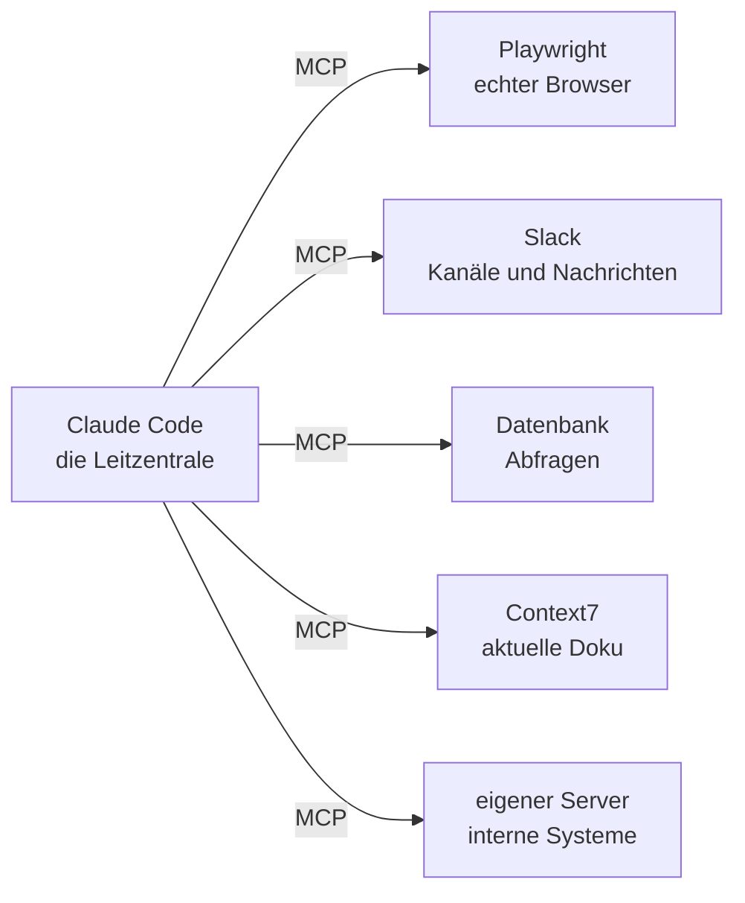

# S2.14 · MCP: der Integrationsstecker

<!-- meta:start -->
> **Regal:** [MCP & Wissensquellen](README.md#mcp-knowledge) · **Stufe:** Kern · **~15 Min** · **Voraussetzungen:** [S1.5 Rechte im Alltag: default und acceptEdits](s1-05-rechte-im-alltag.md)
>
> ← [X.1 Community-Skills: wer baut was, das wirklich hilft](x-01-community-skills.md) · [Bibliothek](README.md) · [S2.15 MCP einrichten: Transporte, Scopes, CLI](s2-15-mcp-einrichten.md) →
<!-- meta:end -->

## Schnellcheck

- Kannst du ohne Nachschlagen erklären, was Claude Code mit MCP erreicht, das es ohne MCP nicht kann?
- Hast du schon einmal einen MCP-Server wie Playwright oder Context7 angebunden und nachgesehen, mit welchen Rechten er läuft?

## Auf einen Blick

Von Haus aus liest Claude Code Dateien, führt Befehle im Terminal aus und sucht im Web. MCP (Model Context Protocol) ist ein offener Standard, über den Claude Code sich zusätzlich mit externen Diensten verbindet: mit einem echten Browser, mit Datenbanken, Chat-Plattformen und eigenen APIs. Ein Dienst bietet dafür einen MCP-Server an, der Tools, Ressourcen und Prompts bereitstellt, und Claude ruft diese Tools auf wie eingebaute Werkzeuge.

MCP-Server arbeiten mit deinen Zugangsdaten. Wie du sie einrichtest, steht in [S2.15](s2-15-mcp-einrichten.md), wo die Risiken liegen, in [S2.17](s2-17-mcp-sicherheit.md).

## Bild im Kopf

Eine moderne Gebäudeleittechnik steuert nicht nur Türen, sie bindet die anderen Anlagen ein. Die Brandmeldeanlage löst bei Rauch automatisch die Verriegelung aus. Die Kamerabilder erscheinen an der Zutrittskonsole. Vorangemeldete Besucher stehen schon im Türsystem. Kündigt die Personalabteilung jemandem, ist seine Karte automatisch gesperrt, und die Türprotokolle fließen in die Zeiterfassung. Jede Anlage bietet eine Schnittstelle, und die Leitzentrale verbindet sich mit allen. Claude Code mit MCP funktioniert genauso: Claude ist die Leitzentrale, die externen Dienste bieten MCP-Schnittstellen, und du legst fest, welche Verbindungen es gibt.



## Im Detail

### Die Kernidee

Ohne MCP arbeitet Claude Code mit deinem Dateisystem, dem Terminal und der Websuche. MCP ergänzt **Verbindungen zu externen Diensten**: Claude Code bekommt Zugriff auf echte Browser, Datenbanken, Kommunikationsplattformen und eigene APIs.

MCP ist ein offener Standard. Entwickelt hat ihn Anthropic, inzwischen ist er weit verbreitet. Jeder Dienst kann einen MCP-Server anbieten, und Claude Code kann sich mit ihm verbinden. Das Protokoll legt fest, wie ein externes System Tools, Ressourcen und Prompts für die KI bereitstellt.

Ein Server lohnt sich, sobald du Daten aus einem anderen Werkzeug von Hand in den Chat kopierst, etwa aus einem Ticketsystem oder einem Monitoring-Dashboard. Ist der Server verbunden, liest und bedient Claude das System direkt, statt mit dem zu arbeiten, was du einfügst.

### Welche Server es gibt

Eine Auswahl, keine vollständige Liste.

**Playwright (Browser-Steuerung).** Für Entwickler besonders nützlich. Er gibt Claude einen echten Browser, den es steuern kann:

- URLs aufrufen
- Buttons und Links klicken
- Formulare ausfüllen
- Screenshots machen
- Seiteninhalte lesen
- JavaScript ausführen

Einsatz: Admin-Oberflächen automatisieren, dynamische Inhalte auslesen, UI-Abläufe testen, Dashboards überwachen.

**Slack.** Kanäle lesen, Nachrichten senden, Unterhaltungen durchsuchen. Einsatz: Claude benachrichtigt dein Team, wenn Tests scheitern, postet eine Zusammenfassung nach einem Deployment oder beantwortet Fragen aus dem Slack-Verlauf.

**Gmail und Google Calendar.** Mails lesen, Entwürfe anlegen, Termine verwalten. Einsatz: Antworten entwerfen, Meetings planen, Besprechungsnotizen in Aufgaben verwandeln. Beide sind von Anthropic gehostete Connectors ohne lokales OAuth aus Claude Code: Du verbindest sie in claude.ai unter den Connectors, und Claude Code übernimmt sie, wenn du mit einem claude.ai-Abo angemeldet bist.

**Datenbanken (PostgreSQL, SQLite und andere).** Datenbanken direkt abfragen. Claude kann Daten analysieren, Berichte erzeugen und Auffälligkeiten finden, ohne dass du SQL von Hand schreibst.

**Context7 (Doku nachschlagen).** Holt die aktuelle Dokumentation zu einer Bibliothek oder einem Framework. Das beugt erfundener API-Syntax vor, weil Claude mit echter, aktueller Doku arbeitet.

**Eigene MCP-Server.** Jedes Team kann einen MCP-Server bauen, der seine internen Werkzeuge bereitstellt: Deploy-Pipeline, Monitoring, Bug-Tracker. Wie das geht, steht in [S2.17](s2-17-mcp-sicherheit.md#einen-eigenen-server-bauen).

### MCP-Tool oder Hook?

Beide erweitern Claude Code, aber sie lösen verschieden aus. Ein MCP-Tool ruft Claude selbst auf, wenn es für die Aufgabe ein externes System braucht. Ein Hook ([S2.6](s2-06-hooks-als-sensoren.md)) feuert automatisch bei einem festen Ereignis in Claude Code, ohne dass Claude darüber entscheidet. Server, die von sich aus Nachrichten in die Sitzung schicken, heißen Channels ([S2.17](s2-17-mcp-sicherheit.md#channels-server-die-von-sich-aus-melden)).

## Vorführen

### Demo: MCP steuert einen echten Browser

**Ziel:** Zeigen, dass Claude einen echten Browser bedient. Nichts wird simuliert, kein statisches HTML ausgelesen: Claude ruft Seiten auf, klickt und arbeitet mit Live-Webseiten.

**Vorbereitung**

- Der Playwright-MCP-Server ist eingerichtet, in der `.mcp.json` des Projekts wie in „Selbst machen" oder per `claude mcp add` im Scope `user` ([S2.15](s2-15-mcp-einrichten.md)).
- Internetzugang
- Konfiguration:

```json
{
  "mcpServers": {
    "playwright": {
      "command": "npx",
      "args": ["@playwright/mcp@latest"]
    }
  }
}
```

**Schritt 1: die Bühne bereiten**

Kündige an, dass Claude gleich einen echten Browser steuert.

**Schritt 2: GitHub aufrufen**

In Claude Code:

```
Navigate to github.com/anthropics/claude-code using the browser
```

Claude ruft das Playwright-Tool auf. Ein Browserfenster öffnet sich (oder der Browser läuft headless, je nach Konfiguration) und lädt die URL.

Mach einen Screenshot:

```
Take a screenshot of the current page
```

Zeig den Screenshot in der Ausgabe im Terminal.

**Schritt 3: mit der Seite arbeiten**

```
Click on the Issues tab
```

Claude klickt auf den Tab „Issues". Zeig das Ergebnis.

```
List the titles of the first 5 open issues
```

Claude liest die Seite und zieht die Titel der Issues heraus. Zeig die Liste.

**Schritt 4: den Bezug zur eigenen Arbeit herstellen**

Nenn Beispiele aus der Arbeit der Teilnehmenden (Software für Physical Security) und frag, welche Weboberflächen sie heute von Hand bedienen.

<details><summary>Für Moderierende</summary>

**Dauer:** etwa 8 Minuten (Schritt 1: 1 Min., Schritt 2: 1 Min., Schritt 3: 3 Min., Schritt 4: 3 Min.).

**Sagen:**

- Schritt 1: „MCP verbindet Claude Code mit externen Systemen. Das anschaulichste Beispiel ist die Browser-Steuerung über Playwright. Passt auf: Claude steuert gleich einen echten Browser."
- Schritt 3: „Das ist ein echter Browser. JavaScript lief, dynamische Inhalte wurden geladen, echte DOM-Elemente geklickt. Keine HTTP-Anfragen, kein Scraping, echte Browser-Automatisierung."
- Schritt 4: „Überlegt, was das für eure Arbeit heißt." Beispiele:
  - „Euer Admin-Panel der Zutrittskontrolle: Claude könnte sich anmelden, Berichte über Türereignisse ziehen, exportieren und an euer Monitoring schicken."
  - „Das Firmware-Portal eures Herstellers: Claude könnte nach neuen Versionen sehen, sie herunterladen und die Update-Historie protokollieren."
  - „Die Weboberfläche eurer Alarmzentrale: Claude könnte Alarme quittieren, Tagesberichte erzeugen und den Zustand der Meldebereiche prüfen."
- Abschluss: „Jede Weboberfläche, die euer Team von Hand bedient, lässt sich mit Playwright-MCP automatisieren. Und das ist nur ein Server: Es gibt Server für Slack, Mail und Datenbanken, und ihr könnt eigene für eure Systeme bauen."

**Kernsätze:**

- „MCP ist die Zutrittskontrolle, die sich mit den anderen Gebäudeanlagen verbindet: Brandmeldeanlage, Videoüberwachung, Besuchermanagement. Claude ist die zentrale Leitstelle."
- „Ein Protokoll, viele Integrationen. Einmal lernen, alles anschließen."
- „Playwright-MCP macht aus jeder Weboberfläche eine API, die Claude bedienen kann."
- „Sicherheitshinweis: MCP-Server laufen mit euren Zugangsdaten. Deshalb sind Hooks und Leitplanken hier noch wichtiger." Vertiefung in [S2.17](s2-17-mcp-sicherheit.md).

**Wenn Playwright-MCP nicht eingerichtet ist:** Zeig die Konfigurationsdatei und erklär, was sie bewirken würde. Sag: „Das richten wir gleich in der Übung ein. Für jetzt: Glaubt mir, es funktioniert, und ihr probiert es selbst." Oder zeig einen Screenshot, den du bei der Vorbereitung gemacht hast, und beschreib, was passiert ist.

</details>

## Selbst machen

### Übung: einen MCP-Server anbinden

**Ziel:** Den Playwright-MCP-Server einrichten und damit Browser-Abläufe automatisieren. Danach hast du Claude einen echten Browser steuern lassen und weißt, was das für Automatisierung in deinem Bereich bedeutet.

**Hintergrund:** In der Physical Security bindest du externe Anlagen wie Brandmelderzentralen, Videoüberwachung und Sprechanlagen an deine zentrale Zutrittskontrolle an. Jede Anlage bietet eine Schnittstelle, und die Plattform verbindet sich damit. MCP ist dieses Integrationsprotokoll für Claude Code. Playwright gehört zu den stärksten MCP-Servern: Er gibt Claude einen echten Browser, und jede Weboberfläche, die dein Team von Hand bedient, lässt sich automatisieren.

**Schritt 1: Playwright-MCP prüfen**

```bash
# Verify npx is available
npx --version

# Test that Playwright MCP can start
npx @playwright/mcp@latest --help
```

Fehlt `npx`, installier zuerst Node.js ([S0.1](s0-01-werkstatt-einrichten.md)).

**Schritt 2: den MCP-Server eintragen**

Leg in deinem Projektordner eine `.mcp.json` an oder ergänze die vorhandene. Das ist der Scope `project`: Der Server gilt in diesem Projekt und lässt sich mit dem Repo teilen.

<!-- cockpit:example -->
```json
{
  "mcpServers": {
    "playwright": {
      "command": "npx",
      "args": ["@playwright/mcp@latest"],
      "env": {}
    }
  }
}
```

Prüf, ob das JSON gültig ist (unter Windows `python` statt `python3`):

```bash
# Verify the JSON is valid
python3 -m json.tool .mcp.json
```

Willst du Playwright in allen deinen Projekten haben, legst du keine Datei unter `~/.claude/` an, sondern trägst den Server mit `claude mcp add` im Scope `user` ein ([S2.15](s2-15-mcp-einrichten.md)). Claude Code speichert ihn dann in `~/.claude.json`.

**Schritt 3: Claude Code neu starten und prüfen**

Starte Claude Code im Projektordner neu. Server aus einer `.mcp.json` nutzt Claude Code erst, wenn du sie bestätigt hast; stimm der Rückfrage beim Start zu. Frag dann, ob die Playwright-Tools da sind:

```
What browser tools do you have available?
```

Claude sollte Tools wie `browser_navigate`, `browser_click`, `browser_take_screenshot` und `browser_snapshot` nennen.

**Schritt 4: eine Seite aufrufen und fotografieren**

```
Navigate to example.com using the browser and take a screenshot
```

Claude sollte:

1. das Navigations-Tool mit `https://example.com` aufrufen
2. das Screenshot-Tool aufrufen
3. den Screenshot anzeigen oder beschreiben

Erscheint ein Screenshot im Terminal, hat es geklappt.

**Schritt 5: mit einer Seite arbeiten**

```
Navigate to github.com/anthropics and list the first 5 repositories shown on the page
```

Claude ruft die Seite auf, liest sie und liefert eine Liste. Das ist echter Inhalt aus dem DOM, keine zwischengespeicherten Daten.

**Schritt 6: Automatisierung für deinen Alltag überlegen**

Denk an deinen Arbeitsalltag. Such dir eine Weboberfläche, die dein Team nutzt, und beschreib, was Claude dort automatisieren könnte. Beispiele:

- „Unser Portal zur Controller-Verwaltung: Claude könnte sich anmelden, alle Türereignisse der letzten 24 Stunden ziehen und Zutritte außerhalb der Arbeitszeit markieren."
- „Unsere Firmware-Seite: Claude könnte prüfen, ob es für jedes Gerätemodell, das wir betreuen, neue Firmware gibt."
- „Unser Ticketsystem: Claude könnte alle offenen Tickets mit dem Tag ‚access request' finden und zusammenfassen."

Im Workshop besprichst du mit deinem Nachbarn: Welche Web-Automatisierung bringt eurem Team am meisten?

**Schritt 7 (Bonus): einen mehrstufigen Ablauf automatisieren**

```
Navigate to [a site you use], [describe a multi-step task], and report back what you found
```

Probier eine echte Abfolge mehrerer Schritte. Notier dir, was scheitert (Ladezeiten, Anmeldung, JavaScript-Prüfungen). Das ist normal und lässt sich mit den Warte-Befehlen von Playwright lösen.

**Geschafft, wenn:**

- [ ] die `.mcp.json` existiert und eine gültige Playwright-Konfiguration enthält
- [ ] Claude nach dem Neustart auf Nachfrage Browser-Tools nennt
- [ ] Claude mindestens eine URL aufgerufen hat
- [ ] ein Screenshot gemacht und angezeigt oder beschrieben wurde
- [ ] Claude Inhalte einer Live-Webseite aufgelistet hat
- [ ] (Bonus) ein mehrstufiger Ablauf geklappt hat

## Typische Fallen

- **Claude sagt, es gibt keine Playwright-Tools.** Prüf, ob die `.mcp.json` gültiges JSON ist, ob `npx @playwright/mcp@latest` im Terminal ohne Fehler startet und ob du Claude Code nach dem Anlegen neu gestartet hast. Hast du die Rückfrage zum Projekt-Server abgelehnt, setzt `claude mcp reset-project-choices` die Entscheidung zurück.
- **Die Konfiguration liegt in `~/.claude/.mcp.json`.** Ältere Fassungen dieses Kurses nannten diesen Pfad für globale Server. Claude Code liest ihn nicht: Server in den Scopes `local` und `user` stehen in `~/.claude.json`, Team-Server in der `.mcp.json` im Projektordner ([S2.15](s2-15-mcp-einrichten.md)).
- **Die Navigation läuft in einen Timeout.** Playwright braucht beim ersten Mal einen Moment zum Starten. Versuch es noch einmal; weitere Aufrufe in derselben Sitzung gehen schneller.
- **Die Seite verlangt eine Anmeldung.** Playwright läuft in einem Browser-Kontext. Musst du dich anmelden, sag Claude:

```
Navigate to [site], fill in username [X] and password [ask me for it], then [task]
```

Claude fragt dann nach dem Passwort. Gespeichert wird es trotzdem: Was du eintippst, steht im Gespräch, und Claude Code legt Sitzungen im Klartext unter `~/.claude/projects/` ab. Nimm für solche Versuche keine Zugangsdaten, die du schützen musst.

- **Headless oder mit Fenster.** Standardmäßig läuft Playwright-MCP mit sichtbarem Browserfenster. Willst du es ausblenden, startest du den Server mit dem Flag `--headless`; Details stehen in der Doku von `@playwright/mcp`.
- **Der Browser hat dein Netz.** Der Playwright-Browser läuft mit deinem Netzwerkzugang. Überleg dir, welche Seiten du automatisierst, gerade in Firmennetzen mit Proxy oder SSO.

## Check

Du kannst an einem Beispiel aus deinem Arbeitsumfeld erklären, was ein MCP-Server gegenüber Copy-Paste bringt, und hast den Playwright-Server so angebunden, dass Claude eine echte Webseite bedient.

1. Was stellt ein MCP-Server für Claude bereit?
2. Wo legst du den Server für die Übung ab, und warum fragt Claude Code beim Start nach?
3. Welche Daten überqueren eine Grenze, wenn Claude über Playwright dein Admin-Portal bedient, und wem gehören sie?

<details><summary>Quizfrage</summary>

**Frage:** Was unterscheidet ein MCP-Tool grundsätzlich von einem Claude-Code-Hook?

- **Richtig:** Wer auslöst: Ein MCP-Tool ruft Claude auf, wenn es das Tool braucht; ein Hook feuert von selbst bei einem festen Ereignis.
- Falsch: Nur der Transport: MCP-Tools laufen immer über HTTP, Hooks dagegen immer als lokales Shell-Skript auf deinem Rechner.
- Falsch: Nichts Wesentliches: MCP-Server ist bloß der neue Name für Hooks vom Typ `http`, die Aufgabe ist dieselbe geblieben.
- Falsch: Nur die Anmeldung: MCP-Tools können sich per OAuth anmelden, Hooks dagegen nicht; ansonsten verhalten sich beide genau gleich.

</details>

## Weiterlesen

- [MCP in Claude Code](https://code.claude.com/docs/en/mcp)
- [MCP-Schnellstart](https://code.claude.com/docs/en/mcp-quickstart)
- [S2.15 · MCP einrichten: Transporte, Scopes, CLI](s2-15-mcp-einrichten.md)
- [S2.16 · MCP im Detail: OAuth, Ausgabegrenzen, Protokoll](s2-16-mcp-im-detail.md)
- [S2.17 · MCP-Sicherheit und ein eigener Server](s2-17-mcp-sicherheit.md)
- [S2.18 · RAG und NotebookLM: dem Agenten Baupläne geben](s2-18-rag-und-notebooklm.md)
- [S2.6 · Hooks als Sensoren: die drei Eckpfeiler](s2-06-hooks-als-sensoren.md)
- [S2.20 · Praxis-Station Session 2: eine Übung wählen](s2-20-praxis-station-2.md)
