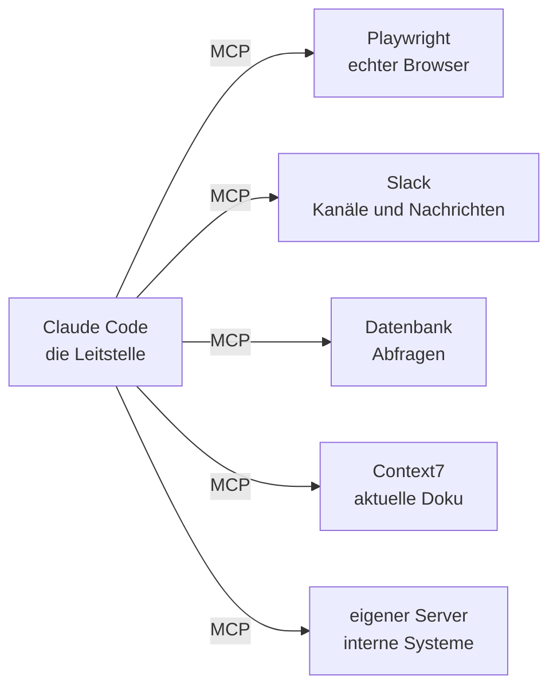

# S2.14 · MCP: der Integrationsstecker

<!-- meta:start -->
> **Regal:** [MCP & Wissensquellen](README.md#mcp-knowledge) · **Stufe:** Kern · **~25 Min** · **Voraussetzungen:** [S1.5 Rechte im Alltag: default und acceptEdits](s1-05-rechte-im-alltag.md)
>
> ← [S2.13 Lieferkettenrisiken bei Plugins](s2-13-plugin-lieferkette.md) · [Bibliothek](README.md) · [S2.15 MCP einrichten: Transporte, Scopes, CLI](s2-15-mcp-einrichten.md) →
<!-- meta:end -->

## Schnellcheck

- Kannst du ohne Nachschlagen erklären, was Claude Code mit MCP erreicht, das es ohne MCP nicht kann?
- Weißt du, warum Claude Code beim ersten Start nachfragt, bevor es einen Server aus einer `.mcp.json` nutzt?

## Auf einen Blick

Von Haus aus liest Claude Code Dateien, führt Befehle im Terminal aus und sucht im Web. MCP (Model Context Protocol) ist ein offener Standard, über den Claude Code sich zusätzlich mit externen Diensten verbindet: mit einem echten Browser, mit Datenbanken, Chat-Plattformen und eigenen APIs. Ein Dienst bietet dafür einen MCP-Server an, der Tools, Ressourcen und Prompts bereitstellt, und Claude ruft diese Tools auf wie eingebaute Werkzeuge.

MCP-Server arbeiten mit deinen Zugangsdaten. Wie du sie einrichtest, steht in [S2.15](s2-15-mcp-einrichten.md), wo die Risiken liegen, in [S2.17](s2-17-mcp-sicherheit.md).

## Bild im Kopf

Eine Leitstelle im Gebäude kennt nicht jede Anlage selbst. Sie ruft bei Bedarf die Schnittstelle der Brandmeldeanlage, der Kameras oder des Besuchermanagements ab und bekommt eine Antwort in einem festen Format. Jede Anlage bietet ihre Schnittstelle, und die Leitstelle entscheidet, wen sie fragt. Claude Code mit MCP funktioniert genauso: Claude ist die Leitstelle, die externen Dienste bieten MCP-Schnittstellen, und du legst fest, welche Verbindungen es gibt. Die Leitstelle ruft nur dann an, wenn die Aufgabe es verlangt.



## Im Detail

### Die Kernidee

Ohne MCP arbeitet Claude Code mit deinem Dateisystem, dem Terminal und der Websuche. MCP ergänzt **Verbindungen zu externen Diensten**: Claude Code bekommt Zugriff auf echte Browser, Datenbanken, Kommunikationsplattformen und eigene APIs. Die Doku nennt MCP „an open source standard for AI-tool integrations“. Jeder Dienst kann einen MCP-Server anbieten, und Claude Code kann sich mit ihm verbinden. Das Protokoll legt fest, wie ein externes System Tools, Ressourcen und Prompts für die KI bereitstellt.

Ein Server lohnt sich, sobald du Daten aus einem anderen Werkzeug von Hand in den Chat kopierst, etwa aus einem Ticketsystem oder einem Monitoring-Dashboard. Ist der Server verbunden, liest und bedient Claude das System direkt, statt mit dem zu arbeiten, was du einfügst.

Die Tools eines Servers heißen in Claude Code `mcp__<server>__<tool>`. Der Server `rooms` mit dem Tool `door_code` ergibt `mcp__rooms__door_code`. Mit diesem Namen schreibst du später Rechte-Regeln ([S2.17](s2-17-mcp-sicherheit.md)).

### Wie ein Server läuft

Es gibt Server, die auf deinem Rechner als Prozess laufen (**stdio**), und Server im Netz (**HTTP**). Der Server aus der Übung unten ist ein kleines Python-Programm, das Claude Code selbst startet: Es liest Nachrichten von der Standardeingabe und antwortet auf der Standardausgabe. Die Doku nennt solche Server „local processes on your machine“. Die Transporte und das Anlegen per Befehl erklärt [S2.15](s2-15-mcp-einrichten.md).

### Welche Server es gibt

Eine Auswahl, keine vollständige Liste.

- **Playwright** gibt Claude einen echten Browser: URLs aufrufen, klicken, Formulare ausfüllen, Screenshots machen, Seiteninhalte lesen. Einsatz: Admin-Oberflächen automatisieren, UI-Abläufe testen.
- **Slack:** Kanäle lesen, Nachrichten senden, den Verlauf durchsuchen.
- **Gmail und Google Calendar** sind von Anthropic gehostete Connectors ohne lokales OAuth aus Claude Code: Du verbindest sie in claude.ai unter den Connectors, und Claude Code übernimmt sie, wenn du mit einem claude.ai-Abo angemeldet bist.
- **Datenbanken (PostgreSQL, SQLite und andere):** direkt abfragen, ohne dass du SQL von Hand schreibst.
- **Context7** holt die aktuelle Dokumentation zu einer Bibliothek und beugt so erfundener API-Syntax vor.
- **Eigene MCP-Server:** Jedes Team kann einen Server bauen, der seine internen Werkzeuge bereitstellt, etwa Deploy-Pipeline, Monitoring oder Bug-Tracker. Wie das geht, steht in [S2.17](s2-17-mcp-sicherheit.md#einen-eigenen-server-bauen).

### MCP-Tool oder Hook?

Beide erweitern Claude Code, aber sie lösen verschieden aus. Ein MCP-Tool ruft Claude selbst auf, wenn es für die Aufgabe ein externes System braucht. Ein Hook ([S2.6](s2-06-hooks-als-sensoren.md)) feuert automatisch bei einem festen Ereignis in Claude Code, ohne dass Claude darüber entscheidet. Server, die von sich aus Nachrichten in die Sitzung schicken, heißen Channels ([S2.17](s2-17-mcp-sicherheit.md#channels-server-die-von-sich-aus-melden)).

## Selbst machen

### Übung: einen Server anbinden und ein Tool aufrufen lassen (etwa 15 Minuten)

**Ziel:** Du bindest einen kleinen Server über eine `.mcp.json` an, prüfst in `/mcp`, dass er verbunden ist, und lässt Claude ein Tool aufrufen, dessen Antwort Claude nur dort bekommen kann.

**Startzustand:** ein leerer Ordner `~/cc-workshop/mcp` (`mkdir -p ~/cc-workshop/mcp && cd ~/cc-workshop/mcp`, in PowerShell `New-Item -ItemType Directory -Force "$HOME\cc-workshop\mcp"; Set-Location "$HOME\cc-workshop\mcp"`). Du brauchst Python, sonst nichts: Der Server benutzt nur die Standardbibliothek. Er steht nur in diesem Ordner, deine eigene Konfiguration bleibt unberührt. Dieselbe Datei nutzen [S2.15](s2-15-mcp-einrichten.md) und [S2.17](s2-17-mcp-sicherheit.md) weiter; lösch den Ordner also erst nach dem letzten dieser Kapitel.

1. Speichere den Server als `server.py` im Übungsordner. Er spricht das Protokoll von Hand, damit du siehst, wie wenig dazu gehört. Echte Server nutzen dafür eine Bibliothek ([S2.17](s2-17-mcp-sicherheit.md)). Er kennt zwei Tools: `list_rooms` und `door_code`, das zu einem Raum einen Türcode liefert.

   ```python
   import json
   import os
   import sys

   SITE = os.environ.get("ROOMS_SITE", "unset")
   CODES = {"lobby": "7421", "lab": "3088", "archive": "5517"}

   TOOLS = [
       {
           "name": "list_rooms",
           "description": "List the rooms that have a door code, and the site name.",
           "inputSchema": {"type": "object", "properties": {}},
       },
       {
           "name": "door_code",
           "description": "Return the door code of one room.",
           "inputSchema": {
               "type": "object",
               "properties": {"room": {"type": "string"}},
               "required": ["room"],
           },
       },
   ]


   def send(message):
       data = (json.dumps(message) + "\n").encode("utf-8")
       sys.stdout.buffer.write(data)
       sys.stdout.buffer.flush()


   def reply(msg_id, result):
       send({"jsonrpc": "2.0", "id": msg_id, "result": result})


   def fail(msg_id, code, text):
       send({"jsonrpc": "2.0", "id": msg_id, "error": {"code": code, "message": text}})


   def text(content, is_error=False):
       return {"content": [{"type": "text", "text": content}], "isError": is_error}


   for line in sys.stdin:
       line = line.strip()
       if not line:
           continue
       msg = json.loads(line)
       method = msg.get("method")
       msg_id = msg.get("id")
       if method == "initialize":
           reply(msg_id, {
               "protocolVersion": msg["params"]["protocolVersion"],
               "capabilities": {"tools": {}},
               "serverInfo": {"name": "rooms", "version": "0.1.0"},
           })
       elif method == "ping":
           reply(msg_id, {})
       elif method == "tools/list":
           reply(msg_id, {"tools": TOOLS})
       elif method == "tools/call":
           name = msg["params"]["name"]
           args = msg["params"].get("arguments") or {}
           if name == "list_rooms":
               reply(msg_id, text("site: " + SITE + "; rooms: " + ", ".join(CODES)))
           elif name == "door_code":
               room = args.get("room", "")
               if room in CODES:
                   reply(msg_id, text(CODES[room]))
               else:
                   reply(msg_id, text("unknown room: " + room, True))
           else:
               fail(msg_id, -32602, "unknown tool: " + name)
       elif msg_id is not None:
           fail(msg_id, -32601, "method not found: " + str(method))
   ```

2. Teste den Server allein, ohne Claude Code. Du schickst ihm eine Zeile und liest die Antwort. Unter Windows heißt der Python-Aufruf `python`, sonst `python3`.

   ```bash
   echo '{"jsonrpc":"2.0","id":1,"method":"tools/list"}' | python3 server.py
   ```

   ```powershell
   '{"jsonrpc":"2.0","id":1,"method":"tools/list"}' | python server.py
   ```

   Erwartet: eine Zeile JSON, die `list_rooms` und `door_code` enthält.

3. Trag den Server in die `.mcp.json` des Übungsordners ein. Das ist der Scope `project`: Der Server gilt in diesem Projekt und ließe sich mit dem Repo teilen. Unter Windows schreibst du `"command": "python"`.

   <!-- cockpit:example -->
   ```json
   {
     "mcpServers": {
       "rooms": {
         "command": "python3",
         "args": ["server.py"]
       }
     }
   }
   ```

4. Frag, was Claude Code von dem Server hält, bevor eine Sitzung läuft: `claude mcp list`. Erwartet: Der Server `rooms` steht in der Liste mit dem Status ``⏸ Pending approval (run `claude` to approve)`` (so heißt der Status in der Doku). Claude Code nutzt Server aus einer `.mcp.json` erst, wenn du sie freigibst, damit ein geklontes Repo sich keine Server unterschieben kann.

5. Starte eine Sitzung im Übungsordner mit `claude --permission-mode default`. Bestätige den Dialog zum Vertrauen in den Ordner. Danach fragt Claude Code nach dem neuen Server `rooms`: Wähl „Use this MCP server“; vorausgewählt ist „Continue without using this MCP server“. Tipp dann `/mcp`. Erwartet: `rooms` steht dort als verbunden, mit der Zahl seiner Tools (zwei). Schließ die Ansicht mit `Esc`.

6. Gib diesen Auftrag ein:

   ```text
   Without reading any files, use the rooms tool to list the rooms, then get the door code of the lab.
   ```

   Fragt Claude Code vor dem Aufruf um Freigabe, antworte mit „Yes“. Erwartet: Claude ruft die beiden Tools auf und nennt den Code `3088`. Ohne den Zusatz „Without reading any files“ könnte Claude den Code auch aus `server.py` lesen; so bekommt es ihn nur vom Server.

7. Prüf es: Frag `Which tool did you just call, and what was its full name?` Erwartet: Claude nennt das Tool `door_code` des Servers `rooms`, in Claude Code als `mcp__rooms__door_code` geführt. Beende die Sitzung mit `/exit`.

**Aufräumen:** Lösch den Ordner `~/cc-workshop/mcp` nach [S2.17](s2-17-mcp-sicherheit.md). Mit dem Ordner ist alles weg; deine Konfiguration unter `~/.claude/` hast du nie angefasst.

**Geschafft, wenn:**

- [ ] `claude mcp list` den Server `rooms` mit `Pending approval` gezeigt hat
- [ ] `/mcp` ihn als verbunden mit zwei Tools zeigte
- [ ] Claude `3088` genannt hat, nachdem es das Tool aufgerufen hat
- [ ] du erklären kannst, warum Claude Code vor der Nutzung gefragt hat

### Extra: Playwright, ein echter Browser (etwa 15 Minuten)

Der bekannteste Server gibt Claude einen echten Browser. Er braucht Node.js mit `npx` ([Werkstatt erweitern](../reference/werkstatt-erweitern.md#nodejs)). Leg dafür einen zweiten Ordner `~/cc-workshop/mcp-browser` an und wechsle hinein. Prüf zuerst, dass `npx` da ist und der Server startet:

```bash
# Verify npx is available
npx --version

# Test that Playwright MCP can start
npx @playwright/mcp@latest --help
```

Trag den Server in die `.mcp.json` dieses Ordners ein:

```json
{
  "mcpServers": {
    "playwright": {
      "command": "npx",
      "args": ["@playwright/mcp@latest"],
      "env": {}
    }
  }
}
```

Starte `claude --permission-mode default` in diesem Ordner, gib den Server frei und frag:

```text
What browser tools do you have available?
```

Erwartet: Tools wie `browser_navigate`, `browser_click` und `browser_take_screenshot` (die Namen stammen aus der Doku von `@playwright/mcp`, nicht von Claude Code). Dann:

```text
Navigate to example.com using the browser and take a screenshot
```

Erwartet: Claude ruft das Navigations-Tool mit `https://example.com` auf und danach das Screenshot-Tool. Beim ersten Aufruf kann Playwright einen Browser nachladen oder melden, dass er fehlt; die [Doku von `@playwright/mcp`](https://github.com/microsoft/playwright-mcp) sagt, wie du ihn installierst. Zum Schluss lässt du Claude mit einer echten Seite arbeiten:

```text
Navigate to github.com/anthropics and list the first 5 repositories shown on the page
```

Nimm für Versuche keine Seite, die eine Anmeldung verlangt: Was du tippst, steht im Gespräch, und Claude Code legt Sitzungen im Klartext unter `~/.claude/projects/` ab. Der Browser läuft mit dem Netzwerkzugang deines Rechners, auch in einem Firmennetz mit Proxy oder SSO. Ob das Fenster sichtbar ist oder nicht, regelt ein Flag des Servers (`--headless`), nicht Claude Code. Lösch den Ordner `~/cc-workshop/mcp-browser` danach.

## Typische Fallen

- **`/mcp` zeigt den Server nicht oder nicht verbunden.** Prüf, ob die `.mcp.json` gültiges JSON ist (`python3 -m json.tool .mcp.json`, unter Windows `python`), ob du die Sitzung im Übungsordner gestartet hast (`server.py` ist relativ) und ob du den Server freigegeben hast. Hast du die Rückfrage abgelehnt, setzt `claude mcp reset-project-choices` die Entscheidung zurück.
- **Der Befehl `python3` existiert nicht.** Unter Windows heißt er meist `python`. Der Eintrag `command` in der `.mcp.json` muss zu deinem System passen.
- **Die Konfiguration steht an der falschen Stelle.** Eine Datei `~/.claude/.mcp.json` liest Claude Code nicht. Server in den Scopes `local` und `user` stehen in `~/.claude.json`, Team-Server in der `.mcp.json` im Projektordner ([S2.15](s2-15-mcp-einrichten.md)).
- **Der Server ist verbunden, aber Claude nutzt ihn nicht.** Sag es ausdrücklich: `Use the rooms tool …`. Die Tool-Beschreibung in `server.py` ist das, was Claude liest, um zu entscheiden.

## Check

Du kannst erklären, was ein MCP-Server gegenüber Copy-Paste bringt, und hast einen Server so angebunden, dass Claude eines seiner Tools aufgerufen hat.

1. Was stellt ein MCP-Server für Claude bereit, und woran siehst du in der Sitzung, dass er verbunden ist?
2. Wo hast du den Server in der Übung eingetragen, und warum fragt Claude Code vor der Nutzung nach?
3. Wodurch unterscheidet sich ein MCP-Tool von einem Hook?

<details><summary>Auflösung</summary>

1. Tools, Ressourcen und Prompts. In der Sitzung zeigt `/mcp` den Server mit seinem Status und der Zahl seiner Tools.
2. In der `.mcp.json` im Projektordner, das ist der Scope `project`. Claude Code fragt aus Sicherheitsgründen vor der Nutzung von Projekt-Servern nach; ein geklontes Repo soll sich nicht selbst Server freischalten.
3. Dadurch, wer auslöst: Ein MCP-Tool ruft Claude auf, wenn die Aufgabe es braucht. Ein Hook feuert von selbst bei einem festen Ereignis, ohne dass Claude darüber entscheidet.

</details>

<details><summary>Quizfrage</summary>

**Frage:** Du hast den Server in die `.mcp.json` des Projekts eingetragen. `claude mcp list` zeigt ihn mit dem Status `Pending approval`, und in der Sitzung fehlen seine Tools. Was fehlt?

- **Richtig:** Die Freigabe: Server aus einer `.mcp.json` nutzt Claude Code erst, nachdem du sie in einer interaktiven Sitzung bestätigt hast.
- Falsch: Der Server muss mit `claude mcp add --scope user` neu eingetragen werden, weil Claude Code eine `.mcp.json` im Projekt grundsätzlich nicht liest.
- Falsch: Ein `/reload-plugins` lädt den Server nach, weil es alle Erweiterungen der laufenden Sitzung neu einliest.
- Falsch: Ein `claude mcp reset-project-choices` schaltet den Server frei, weil es alle Projekt-Server auf „zugelassen“ setzt.

</details>

## Weiterlesen

- [MCP in Claude Code](https://code.claude.com/docs/en/mcp)
- [MCP-Schnellstart](https://code.claude.com/docs/en/mcp-quickstart)
- [S2.15 · MCP einrichten: Transporte, Scopes, CLI](s2-15-mcp-einrichten.md)
- [S2.16 · MCP im Detail: OAuth, Ausgabegrenzen, Protokoll](s2-16-mcp-im-detail.md)
- [S2.17 · MCP-Sicherheit und ein eigener Server](s2-17-mcp-sicherheit.md)
- [S2.18 · RAG und NotebookLM: dem Agenten Baupläne geben](s2-18-rag-und-notebooklm.md)
- [S2.6 · Hooks als Sensoren: die drei Eckpfeiler](s2-06-hooks-als-sensoren.md)
- [S2.20 · Praxis-Station Session 2: alles in einem Ablauf](s2-20-praxis-station-2.md)
