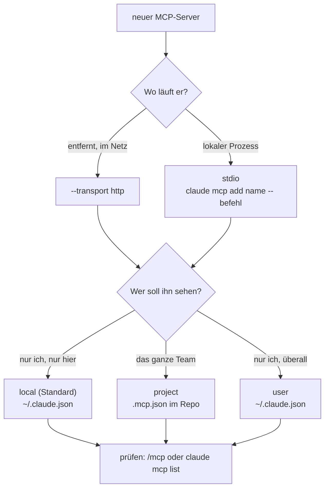

# S2.15 · MCP einrichten: Transporte, Scopes, CLI

<!-- meta:start -->
> **Regal:** [MCP & Wissensquellen](README.md#mcp-knowledge) · **Stufe:** Kern · **~25 Min** · **Voraussetzungen:** [S2.14 MCP: der Integrationsstecker](s2-14-mcp-stecker.md)
>
> ← [S2.14 MCP: der Integrationsstecker](s2-14-mcp-stecker.md) · [Bibliothek](README.md) · [S2.16 MCP im Detail: OAuth, Ausgabegrenzen, Protokoll](s2-16-mcp-im-detail.md) →
<!-- meta:end -->

## Schnellcheck

- Kannst du ohne Nachschlagen sagen, welcher Scope in der eingecheckten `.mcp.json` landet und wo Claude Code die beiden anderen speichert?
- Weißt du, was in einer `.mcp.json` passiert, wenn dort `${VAR}` steht und `VAR` nicht gesetzt ist?

## Auf einen Blick

Für einen neuen MCP-Server wählst du zwei Dinge. Den Transport: `http` für entfernte Dienste (empfohlen) oder `stdio` für einen lokalen Prozess; SSE ist veraltet. Und den Scope: `local` (Standard, nur du, nur dieses Projekt), `project` (das Team, über die eingecheckte `.mcp.json`) oder `user` (nur du, in allen Projekten). `local` und `user` speichert Claude Code in `~/.claude.json`, nicht in einer `.mcp.json`.

Anlegen kannst du Server mit `claude mcp add` oder direkt in der `.mcp.json`. Zugangsdaten gehören nicht in eine eingecheckte Datei: `${VAR}` holt sie aus der Umgebung. Mit `${VAR:-default}` geht das auch, wenn die Variable fehlt; der Default steht aber selbst in der Datei und ist für alle lesbar, also nie ein Geheimnis.

## Bild im Kopf

Ein Scope entscheidet, wo die Liste deiner Verbindungen hängt. `user` ist dein eigener Werkzeugkoffer: Er geht mit dir in jede Halle. `project` ist die Liste an der Hallenwand: Sie sagt, welche Verbindungen hier üblich sind, und jede bestätigt sie beim ersten Start für sich. `local` ist dein persönlicher Zettel an dieser einen Halle, aufbewahrt in deinem Koffer. Der Scope sagt nur, wer die Verbindung sieht, nicht, was der Server darf ([S2.12](s2-12-plugin-lebenszyklus.md) nutzt dasselbe Bild für Plugins).



## Im Detail

### Transporte

MCP-Server sprechen über verschiedene Transporte mit Claude Code:

| Transport | So arbeitet er | Gut für | Status |
|-----------|-------------|----------|--------|
| **HTTP** | Entfernter Server über HTTPS | Cloud-Dienste, gemeinsame Team-Server | **empfohlen** |
| **stdio** | Lokaler Prozess, spricht über stdin/stdout | Lokale Werkzeuge, eigene Skripte, Zugriff aufs System | gut für die Entwicklung |
| **SSE** | Server-Sent Events | alte Server | **veraltet**, nimm HTTP |

Die Doku nennt den SSE-Transport „deprecated“: Neue Server nutzen `http`. In JSON-Konfigurationen heißt derselbe Transport auch `streamable-http` ([S2.16](s2-16-mcp-im-detail.md)). Fragst du mit `--transport http` einen Dienst an, der nur SSE spricht, versucht Claude Code erst HTTP und wechselt dann zu SSE.

### Scopes

| Scope | Gilt in | Mit dem Team geteilt | Gespeichert in |
|-------|---------|----------------------|----------------|
| **local** (Standard) | nur im aktuellen Projekt | nein | `~/.claude.json`, unter dem Eintrag dieses Projekts |
| **project** | nur im aktuellen Projekt | ja, über die Versionskontrolle | `.mcp.json` im Projektordner |
| **user** | in allen deinen Projekten | nein | `~/.claude.json` |

„local“ bei MCP ist nicht dasselbe wie die lokalen Einstellungen in `.claude/settings.local.json`: Lokale MCP-Server stehen in `~/.claude.json` in deinem Home-Verzeichnis, nicht im Projektordner. Steht derselbe Servername in mehreren Scopes, gilt der Eintrag mit der höchsten Rangfolge: local vor project vor user.

### Server über die Kommandozeile verwalten

```bash
# Add a remote HTTP server (recommended for cloud services)
claude mcp add --transport http notion https://mcp.notion.com/mcp

# Add one with an auth header (--header goes after the URL)
claude mcp add --transport http secure-api https://api.example.com/mcp --header "Authorization: Bearer your-token"

# Add a local stdio server (everything after -- runs the server)
claude mcp add --env AIRTABLE_API_KEY=YOUR_KEY --transport stdio airtable -- npx -y airtable-mcp-server

# Share a server with the team: scope project writes .mcp.json
claude mcp add --transport stdio --scope project rooms -- python3 server.py

# Add a complex config inline as JSON
claude mcp add-json my-server '{"command":"npx","args":["-y","my-package"],"env":{"FOO":"bar"}}'

# Manage servers
claude mcp list                  # List all configured servers
claude mcp get <name>            # Show server details
claude mcp remove <name>         # Remove a server
claude mcp reset-project-choices # Reset the Approve/Decline choices for .mcp.json servers

# Load servers from a config file
claude --mcp-config servers.json                       # Load additional MCP config
claude --mcp-config servers.json --strict-mcp-config   # ONLY use servers from that file

# In a session
/mcp                             # Check status, manage OAuth, troubleshoot
```

Bei stdio trennt `--` die Optionen von Claude Code (`--transport`, `--env`, `--scope`) vom Befehl des Servers. Ohne `--` würde Claude Code die Flags des Servers als seine eigenen lesen. Die Beispiele sind die der Doku; die Pakete und Adressen darin stehen für den Aufbau, nicht als Empfehlung. Bevor du einen Server wirklich anlegst, lies [S2.17](s2-17-mcp-sicherheit.md).

Ein Token direkt im Befehl (`Bearer your-token`, `AIRTABLE_API_KEY=YOUR_KEY`) landet in deiner Shell-History und in `~/.claude.json`. Für Dateien, die du mit dem Team teilst, nimmst du Umgebungsvariablen (nächster Abschnitt).

### Server als Datei: die .mcp.json

Statt per Befehl trägst du Team-Server direkt in die `.mcp.json` im Projektordner ein (Scope `project`). Persönliche Server in den Scopes `local` und `user` legt Claude Code in `~/.claude.json` ab; die verwaltest du mit `claude mcp add` und `claude mcp remove`.

```json
{
  "mcpServers": {
    "api-server": {
      "type": "http",
      "url": "${API_BASE_URL:-https://api.example.com}/mcp",
      "headers": {
        "Authorization": "Bearer ${API_KEY}"
      }
    }
  }
}
```

Das Beispiel stammt aus der Doku. **Umgebungsvariablen** setzt Claude Code in zwei Formen ein, in `command`, `args`, `env`, `url` und `headers`:

- `${VAR}` setzt den Wert von `VAR` ein. Ist `VAR` nicht gesetzt, lädt die Konfiguration trotzdem: Claude Code warnt in `claude mcp list` und in `/mcp`, nennt die Variable und übernimmt den Text `${VAR}` unverändert.
- `${VAR:-default}` setzt den Wert von `VAR` ein, oder `default`, wenn `VAR` nicht gesetzt ist.

Ein Default ist bequem, aber nicht geheim. Er steht in der eingecheckten Datei, also im Repo, in der Historie und für alle lesbar. Er taugt für eine Adresse oder einen Namen, wie `https://api.example.com` oben. Ein Token oder ein Passwort gehört nie als Default in die Datei: Dafür schreibst du `${API_KEY}` ohne Default und setzt die Variable bei dir.

Bei Credentials kommt eine Besonderheit dazu: In `url` und `headers` eines entfernten Servers liest Claude Code die eigenen Zugangsdaten und die Zugangsdaten deines Cloud-Anbieters aus der Umgebung als leer (Beispiele der Doku: `ANTHROPIC_API_KEY`, `NPM_TOKEN`), auch mit Default. Ein Name wie `API_KEY` wird eingesetzt, wie er geschrieben steht.

Beim Start liest Claude Code die Konfiguration und verbindet sich mit jedem Server; die Tools stehen Claude dann zur Verfügung. Server aus einer `.mcp.json` nutzt Claude Code in einer interaktiven Sitzung erst, nachdem du sie bestätigt hast. Warum die Bestätigung eine Sicherheitsfrage ist, steht in [S2.17](s2-17-mcp-sicherheit.md).

## Selbst machen

### Übung: einen Server im Scope project anlegen und per Umgebung steuern (etwa 15 Minuten)

**Ziel:** Du legst einen Server mit `claude mcp add` im Scope `project` an, steuerst einen Wert über `${VAR:-default}` und siehst, was Claude Code meldet, wenn die Variable fehlt.

**Startzustand:** ein leerer Ordner `~/cc-workshop/mcp-setup` (`mkdir -p ~/cc-workshop/mcp-setup && cd ~/cc-workshop/mcp-setup`, in PowerShell `New-Item -ItemType Directory -Force "$HOME\cc-workshop\mcp-setup"; Set-Location "$HOME\cc-workshop\mcp-setup"`) und darin die Datei `server.py` aus der Übung von [S2.14](s2-14-mcp-stecker.md). Hast du den Ordner `~/cc-workshop/mcp` noch, kopierst du sie (`cp ../mcp/server.py .`, PowerShell `Copy-Item ..\mcp\server.py .`); sonst legst du sie nach S2.14, Schritt 1 neu an. Nichts davon berührt deine eigene Konfiguration: Alles geht in den Scope `project`, also in eine Datei in diesem Ordner. Unter Windows heißt Python meist `python`, sonst `python3`.

1. Lege den Server per Befehl an.

   <!-- cockpit:example -->
   ```bash
   claude mcp add --transport stdio --scope project rooms -- python3 server.py
   ```

   ```powershell
   claude mcp add --transport stdio --scope project rooms -- python server.py
   ```

   Erwartet: Claude Code druckt eine Zeile, die mit `Added` beginnt, und legt die Datei `.mcp.json` im Ordner an. Öffne sie: Sie enthält den Eintrag `rooms` mit dem Befehl und `server.py`.

2. Lass dir die Server zeigen: `claude mcp list` und `claude mcp get rooms`. Erwartet: `rooms` steht dort, und der Status ist ``⏸ Pending approval (run `claude` to approve)`` (so heißt er in der Doku), weil du den Projekt-Server noch nicht bestätigt hast.

3. Hol einen Wert aus der Umgebung. Öffne `.mcp.json`. Der Eintrag `rooms` enthält schon ein leeres `"env": {}`; ersetz es durch diesen Block (`command` und `args` bleiben, wie sie sind):

   ```json
   "env": {
     "ROOMS_SITE": "${ROOMS_SITE:-main-building}"
   }
   ```

   Der Server liest `ROOMS_SITE` und meldet den Wert bei `list_rooms`.

4. Starte `claude --permission-mode default` im Ordner, wähl bei der Frage nach dem Server „Use this MCP server“ und frag:

   ```text
   Without reading any files, call the rooms tool list_rooms and tell me the site name it reports.
   ```

   Erwartet: `main-building`, der Default aus der Datei. Beende die Sitzung mit `/exit`.

5. Setz die Variable und starte neu. In Bash: `ROOMS_SITE=annex claude --permission-mode default`. In PowerShell: `$env:ROOMS_SITE = "annex"; claude --permission-mode default`. Frag dasselbe. Erwartet: `annex`. Fragt Claude Code wegen der geänderten Konfiguration erneut nach, stimm zu. Beende die Sitzung und entferne in PowerShell die Variable wieder (`Remove-Item Env:ROOMS_SITE`).

6. Lass den Default weg: Ändere in `.mcp.json` den Wert auf `"${ROOMS_SITE}"`. Prüf in einem Terminal, in dem `ROOMS_SITE` nicht gesetzt ist, mit `claude mcp list`. Erwartet: Eine Warnung nennt die Variable `ROOMS_SITE`, und der Server lädt trotzdem. Das ist der Fall `${VAR}` ohne Wert.

7. Beantworte für dich: Was wäre falsch, wenn dort `"${ROOMS_SITE:-sk-live-abc123}"` stünde, und was würdest du stattdessen schreiben?

<details><summary>Vergleich</summary>

Ein Default steht selbst in der eingecheckten Datei. Ein geheimer Wert wäre damit für alle im Repo lesbar und stünde in der Historie, auch wenn jeder ihn lokal überschreiben kann. Stattdessen schreibst du `"${ROOMS_SITE}"` ohne Default und setzt die Variable in deiner Umgebung.

</details>

**Aufräumen:** Lösch den Ordner `~/cc-workshop/mcp-setup`. Willst du den Ordner behalten, entfernt `claude mcp remove rooms -s project` nur den Eintrag; nötig ist das nicht, denn er steht nur in der Datei in diesem Ordner.

**Geschafft, wenn:**

- [ ] `claude mcp add` die `.mcp.json` angelegt und `claude mcp list` den Server `rooms` gezeigt hat
- [ ] Claude mit dem Default `main-building` geantwortet hat und mit gesetzter Variable `annex`
- [ ] `claude mcp list` bei `${ROOMS_SITE}` ohne Wert eine Warnung mit dem Variablennamen zeigte
- [ ] du sagen kannst, warum ein Geheimnis nicht als Default in die Datei gehört

## Typische Fallen

- **`claude mcp add` meldet `error: missing required argument 'name'`.** `--header` nimmt mehrere Werte an und schluckt Name und URL, wenn sie dahinter stehen. Schreib `--header` hinter die URL, wie im Beispiel oben.
- **`Invalid environment variable format: github`.** Auch `--env` nimmt mehrere Paare an. Folgt der Servername direkt auf das Paar, liest die CLI ihn als weiteres Paar und lehnt ihn ab. Setz eine andere Option wie `--transport stdio` zwischen `--env` und den Namen.
- **Der Server steht auf `⏸ Pending approval`.** Das ist ein Server aus der `.mcp.json`, den du noch nicht bestätigt hast. Start `claude` interaktiv im Projekt und bestätige ihn.
- **Der Server verbindet nicht oder läuft in einen Timeout.** `/mcp` zeigt den Status und führt bei Bedarf durch eine neue Anmeldung. `claude mcp get <name>` zeigt die Konfiguration und bei `✘ Failed to connect` in der Zeile `Issue:` den Grund. Reicht das nicht, schreibt `claude --debug=mcp` den Startversuch ins Debug-Log ([S4.9](s4-09-fehlersuche-werkzeuge.md)).
- **Der Rückfallwert ist ein Geheimnis.** `${TOKEN:-mein-echtes-token}` in einer eingecheckten Datei verrät das Token. Ein Default steht im Klartext in der Datei.
- **Die Server stehen nicht dort, wo du sie suchst.** `local` und `user` liegen in `~/.claude.json`, `project` in der `.mcp.json` im Projektordner. Eine Datei `~/.claude/.mcp.json` liest Claude Code nicht.

## Check

Du kannst für eine Integration Transport und Scope begründen, einen Server im Scope `project` anlegen und prüfen, ob Claude Code ihn sieht.

1. Warum nimmst du für einen neuen entfernten Server `http` statt SSE?
2. Wo speichert Claude Code einen Server im Scope `local`, wo im Scope `user` und wo im Scope `project`?
3. Was passiert, wenn in der `.mcp.json` `${VAR}` steht, `VAR` aber nicht gesetzt ist, und was darf als Default nie in einer geteilten Datei stehen?

<details><summary>Auflösung</summary>

1. SSE ist laut Doku veraltet; `http` ist die empfohlene Form für entfernte Server. Meldet sich ein Dienst nur per SSE, versucht Claude Code erst HTTP und wechselt dann.
2. `local` und `user` in `~/.claude.json` (`local` unter dem Eintrag des Projekts), `project` in der `.mcp.json` im Projektordner.
3. Die Konfiguration lädt trotzdem: Claude Code warnt in `claude mcp list` und `/mcp`, nennt die Variable und übernimmt `${VAR}` als Text. Ein Geheimnis darf nie als Default stehen, denn der Default steht im Klartext in der eingecheckten Datei.

</details>

<details><summary>Quizfrage</summary>

**Frage:** Ein MCP-Server soll für alle bereitstehen, die das Repo klonen, ohne dass jemand `claude mcp add` aufruft. Welcher Scope passt?

- **Richtig:** `project`: Der Eintrag steht in der `.mcp.json` im Projektordner und wird mit dem Repo eingecheckt.
- Falsch: `user`: Der Eintrag gilt in allen Projekten und reist deshalb beim Klonen automatisch mit.
- Falsch: `local`: Der Standard-Scope schreibt in die `.claude/settings.local.json` des Projekts, die das Team automatisch mit auscheckt.
- Falsch: Keiner: Claude Code übernimmt nie Server aus einem Repo, jeder muss sie selbst anlegen.

</details>

## Weiterlesen

- [MCP in Claude Code](https://code.claude.com/docs/en/mcp)
- [S2.14 · MCP: der Integrationsstecker](s2-14-mcp-stecker.md) (der Server `rooms`)
- [S2.16 · MCP im Detail: OAuth, Ausgabegrenzen, Protokoll](s2-16-mcp-im-detail.md)
- [S2.17 · MCP-Sicherheit und ein eigener Server](s2-17-mcp-sicherheit.md)
- [S2.12 · Plugin-Lebenszyklus, Scopes und Marketplaces](s2-12-plugin-lebenszyklus.md)
