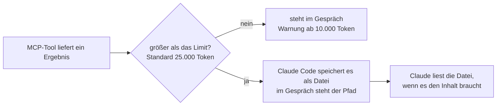

# S2.16 · MCP im Detail: OAuth, Ausgabegrenzen, Protokoll

<!-- meta:start -->
> **Regal:** [MCP & Wissensquellen](README.md#mcp-knowledge) · **Stufe:** Vertiefung · **~15 Min** · **Voraussetzungen:** [S2.15 MCP einrichten: Transporte, Scopes, CLI](s2-15-mcp-einrichten.md)
>
> ← [S2.15 MCP einrichten: Transporte, Scopes, CLI](s2-15-mcp-einrichten.md) · [Bibliothek](README.md) · [S2.17 MCP-Sicherheit und ein eigener Server](s2-17-mcp-sicherheit.md) →
<!-- meta:end -->

## Schnellcheck

- Kannst du ohne Nachschlagen sagen, was Claude Code mit einer MCP-Ausgabe macht, die das Limit überschreitet, und wie du das Limit anhebst?
- Hast du schon einmal einen OAuth-MCP-Server mit `--callback-port` oder `--client-id` eingerichtet?

## Auf einen Blick

Entfernte MCP-Server melden dich per OAuth an: Claude Code öffnet den Browser und wartet auf einem Callback-Port auf die Antwort. Kann ein Server Claude Code nicht automatisch als Client registrieren, trägst du eine vorab registrierte OAuth-App mit `--client-id`, `--client-secret` und `--callback-port` ein. Große Tool-Ausgaben hält Claude Code aus dem Kontextfenster heraus: Ab 10.000 Token warnt es, über dem Limit (Standard 25.000 Token) speichert es das Ergebnis in einer Datei und gibt Claude nur den Pfad.

Dazu kommen drei Protokolldetails für den Betrieb: Server dürfen ihre Tool-Liste während der Sitzung ändern (`list_changed`), abgerissene Remote-Server verbindet Claude Code selbst neu, und stdio-Server finden ihr Projekt über `CLAUDE_PROJECT_DIR`.

## Bild im Kopf

Eine Leitstelle verliert die Verbindung zu einer Unterstation. Sie löst nicht sofort Störungsalarm aus, sondern wählt neu: nach einer Sekunde, dann nach zwei, dann nach vier, jedes Mal doppelt so lange, höchstens fünfmal. Erst danach meldet sie die Unterstation als gestört. So verbindet Claude Code einen abgerissenen Remote-Server neu.

Große Datenmengen behandelt die Leitstelle wie eine lange Videoaufzeichnung: Sie passt nicht auf den Monitor im Kontrollraum, also wandert sie ins Archiv, und auf dem Monitor steht, wo sie liegt. Genau das macht Claude Code mit einer MCP-Ausgabe über dem Limit.



## Im Detail

### OAuth für entfernte Server

Claude Code unterstützt OAuth für entfernte MCP-Server, die es anbieten. Verbindest du dich mit so einem Server, öffnet Claude Code einen Browser zur Anmeldung und wartet auf einem Callback-Port auf die Antwort; ohne Vorgabe wählt es dafür einen freien Port zufällig. Die Anmeldung startest du in der Sitzung mit `/mcp`.

Manche Server können Claude Code nicht automatisch als Client registrieren (Dynamic Client Registration). Dann meldet Claude Code etwa „Incompatible auth server: does not support dynamic client registration", und du registrierst vorher eine OAuth-App im Entwicklerportal des Dienstes. In Teams und Unternehmen willst du das oft ohnehin: Alle verbinden sich mit derselben registrierten App, statt dass jeder eine eigene anstößt. So trägst du sie ein (Beispiel aus der offiziellen Doku):

<!-- cockpit:example -->
```bash
claude mcp add --transport http \
  --client-id your-client-id --client-secret --callback-port 8080 \
  my-server https://mcp.example.com/mcp
```

| Flag | Zweck |
|------|---------|
| `--callback-port <port>` | Legt den Callback-Port fest, passend zu einer vorab registrierten Redirect-URI der Form `http://localhost:PORT/callback`. Geht auch allein, mit automatischer Registrierung. |
| `--client-id <id>` | Nutzt eine vorab registrierte OAuth-App, deren Client-ID der Server kennt. |
| `--client-secret` | Fragt das zugehörige Secret mit verdeckter Eingabe ab; steht es in `MCP_CLIENT_SECRET`, etwa im CI, entfällt die Abfrage. **Hinter dem Flag steht kein Wert.** Das Secret landet im Schlüsselbund (macOS) oder in einer Credentials-Datei, nicht in der Konfiguration. |

Die drei Flags gelten nur für HTTP- und SSE-Server; bei stdio-Servern wirken sie nicht. Nutzt der Server einen öffentlichen OAuth-Client ohne Secret, reicht `--client-id`.

Einsatzbeispiel: Ein Unternehmen hat für einen Dienst genau eine OAuth-App registriert. Die Claude-Code-Installationen aller Entwickler nutzen dieselbe Client-ID und melden sich über diese App an, statt dass jeder in der Admin-Oberfläche des Dienstes einen neuen Freigabe-Dialog für eine eigene App auslöst.

### Ausgabegrenzen

Große Ausgaben von MCP-Tools können dein Kontextfenster fluten ([S1.8](s1-08-kontextfenster.md)). Claude Code begrenzt sie:

| Schwelle | Wert | Was passiert |
|-----------|-------|-------------|
| Warnung | 10.000 Token | Claude Code zeigt eine Warnung. Die Schwelle ist fest. |
| Standard-Maximum | 25.000 Token | Ein größeres Ergebnis ohne Bilder speichert Claude Code als Datei und ersetzt es im Gespräch durch einen Hinweis mit dem Pfad. Anheben mit der Umgebungsvariable `MAX_MCP_OUTPUT_TOKENS`, etwa `MAX_MCP_OUTPUT_TOKENS=50000`. |
| Pro Tool | bis 500.000 Zeichen | Der Autor des Servers setzt `_meta["anthropic/maxResultSizeChars"]` im `tools/list`-Eintrag des Tools. Das gilt für Text, nicht für Tools, die Bilder liefern. |

Das zählt vor allem bei Datenbankabfragen (MCP für Postgres) und langen Dateilisten. Brauchst du mehr Daten direkt im Gespräch, hebst du das Limit an: bei deinem eigenen Server mit `_meta` am einzelnen Tool, sonst mit `MAX_MCP_OUTPUT_TOKENS`. Denk dabei an die Kosten im Kontextfenster.

### Protokolldetails, die du kennen solltest

Ein paar kleine Eigenschaften des Protokolls stehen selten in den Überschriften, zählen aber, sobald du einen MCP-Server baust oder betreibst.

**`streamable-http` als anderer Name für `http`.** In einer `.mcp.json` siehst du `"type": "http"` oder `"type": "streamable-http"`. Beides funktioniert gleich; `streamable-http` ist der Name aus der MCP-Spezifikation und steht oft in der Doku der Server. Nimm innerhalb einer Datei eine Schreibweise.

**Tool-Listen ändern sich zur Laufzeit (`list_changed`).** Ein Server darf während einer laufenden Sitzung Tools, Prompts und Ressourcen hinzufügen oder entfernen. Nach einer Zustandsänderung, etwa wenn du dich gerade angemeldet hast und damit weitere Tools freigeschaltet sind, schickt der Server eine `list_changed`-Benachrichtigung, und Claude Code lädt die Liste ohne Neustart neu. Das hilft bei Servern hinter OAuth, die nach der Anmeldung zu Recht mehr anbieten.

**Automatische Wiederverbindung.** Reißt die Verbindung zu einem entfernten Server mitten in der Sitzung ab (wackeliges Netz, Neustart des Servers, neuer Tunnel), verbindet Claude Code ihn mit wachsendem Abstand neu: bis zu fünf Versuche, der erste nach einer Sekunde, danach jeweils doppelt so lange. In der Zwischenzeit zeigt `/mcp` den Server als ausstehend. Nach fünf Fehlversuchen markiert Claude Code ihn als fehlgeschlagen, und du versuchst es in `/mcp` von Hand erneut. So erkennst du, ob ein Server wirklich ausgefallen ist oder nur langsam antwortet. stdio-Server sind lokale Prozesse; die verbindet Claude Code nicht automatisch neu.

**`CLAUDE_PROJECT_DIR` für stdio-Server.** Startet Claude Code einen stdio-Server, setzt es in dessen Umgebung `CLAUDE_PROJECT_DIR` auf das Projektverzeichnis, dieselbe Variable, die auch Hooks bekommen. Lies sie im Server, um Projektdateien über stabile Pfade zu finden, statt dich auf das Arbeitsverzeichnis zu verlassen, aus dem jemand Claude Code gestartet hat:

```python
# In a Python stdio MCP server
project_dir = os.environ.get("CLAUDE_PROJECT_DIR")
config_path = pathlib.Path(project_dir) / ".myteam" / "rules.yaml"
```

Die Variable bleibt gleich, auch wenn in der Sitzung Arbeitsverzeichnisse dazukommen oder wegfallen. Damit ist sie für einen Server der verlässliche Weg zu seinem Projekt.

## Typische Fallen

- **Hinter `--client-secret` steht ein Wert.** Das Flag nimmt keinen Wert; es fragt das Secret mit verdeckter Eingabe ab. Soll die Abfrage entfallen, etwa im CI, legst du das Secret in die Umgebungsvariable `MCP_CLIENT_SECRET` und lässt `--client-secret` trotzdem ohne Wert im Befehl stehen.
- **`MAX_MCP_OUTPUT_TOKENS` soll die Warnung verschieben.** Die Variable hebt das Maximum an; die Warnschwelle von 10.000 Token bleibt fest.
- **`_meta` bei einem fremden Server.** Die Annotation setzt der Autor des Servers. Hast du den Server nicht selbst gebaut, hebst du `MAX_MCP_OUTPUT_TOKENS` an oder bittest den Autor um die Annotation oder um Antworten in Teilen.
- **Ein stdio-Server ist weg und kommt nicht wieder.** Selbst neu verbunden werden nur entfernte Server. Einen abgestürzten stdio-Server verbindest du über `/mcp` neu.

## Check

Du kannst erklären, wann du eine OAuth-App vorab einträgst, was mit einer zu großen MCP-Ausgabe passiert und wie ein stdio-Server sein Projekt findet.

1. Warum steht hinter `--client-secret` kein Wert, und wie kommt das Secret in einem CI-Lauf an?
2. Was hebt `MAX_MCP_OUTPUT_TOKENS` an, und was bleibt fest?
3. Welche Server verbindet Claude Code nach einem Abbruch selbst neu, welche nicht?

<details><summary>Quizfrage</summary>

**Frage:** Ein Postgres-MCP-Server liefert auf eine Abfrage ein Ergebnis von etwa 40.000 Token. Was passiert ohne weitere Einstellung?

- **Richtig:** Claude Code legt das Ergebnis als Datei ab und ersetzt es im Gespräch durch einen Hinweis mit dem Pfad.
- Falsch: Claude Code schneidet bei 25.000 Token ab, und Claude sieht nur den Anfang der Antwort aus der Datenbank.
- Falsch: Claude Code bricht den Tool-Aufruf mit einem Fehler ab, und der Server muss seine Antwort erst aufteilen.
- Falsch: Nichts: Das Limit gilt nur für stdio-Server, entfernte HTTP-Server dürfen beliebig viel zurückgeben.

</details>

## Weiterlesen

- [MCP in Claude Code: Anmeldung, Ausgabegrenzen, Wiederverbindung](https://code.claude.com/docs/en/mcp)
- [S2.15 · MCP einrichten: Transporte, Scopes, CLI](s2-15-mcp-einrichten.md)
- [S2.17 · MCP-Sicherheit und ein eigener Server](s2-17-mcp-sicherheit.md)
- [S1.8 · Das Kontextfenster verstehen](s1-08-kontextfenster.md)
