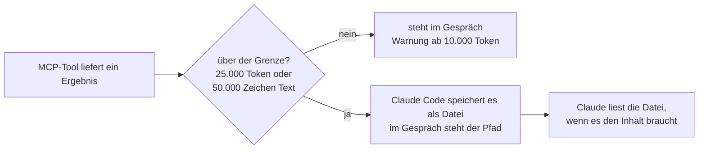

# S2.16 · MCP im Detail: OAuth, Ausgabegrenzen, Protokoll

<!-- meta:start -->
> **Regal:** [MCP & Wissensquellen](README.md#mcp-knowledge) · **Stufe:** Vertiefung · **~20 Min** · **Voraussetzungen:** [S2.15 MCP einrichten: Transporte, Scopes, CLI](s2-15-mcp-einrichten.md)
>
> ← [S2.15 MCP einrichten: Transporte, Scopes, CLI](s2-15-mcp-einrichten.md) · [Bibliothek](README.md) · [S2.17 MCP-Sicherheit und ein eigener Server](s2-17-mcp-sicherheit.md) →
<!-- meta:end -->

## Schnellcheck

- Kannst du ohne Nachschlagen sagen, was Claude Code mit einer MCP-Ausgabe macht, die zu groß ist?
- Weißt du, wann ein OAuth-Server eine vorab registrierte Client-ID verlangt?

## Auf einen Blick

Große Tool-Ausgaben hält Claude Code aus dem Kontextfenster heraus: Ab 10.000 Token warnt es, und über dem Limit (Standard 25.000 Token) oder über 50.000 Zeichen Text speichert es das Ergebnis in einer Datei und gibt Claude nur den Pfad. Entfernte MCP-Server melden dich per OAuth an: Claude Code öffnet den Browser und wartet auf einem Callback-Port auf die Antwort. Kann ein Server Claude Code nicht automatisch als Client registrieren, trägst du eine vorab registrierte OAuth-App mit `--client-id`, `--client-secret` und `--callback-port` ein.

Dazu kommen drei Protokolldetails für den Betrieb: Server dürfen ihre Tool-Liste während der Sitzung ändern (`list_changed`), abgerissene Remote-Server verbindet Claude Code selbst neu, und stdio-Server finden ihr Projekt über `CLAUDE_PROJECT_DIR`.

## Bild im Kopf

Eine Leitstelle bekommt eine lange Videoaufzeichnung. Sie passt nicht auf den Monitor im Kontrollraum, also wandert sie ins Archiv, und auf dem Monitor steht nur, wo sie liegt. Wer den Inhalt braucht, holt die Aufzeichnung aus dem Archiv. Genau das macht Claude Code mit einer MCP-Ausgabe über der Grenze: Das Bild selbst liegt in einer Datei, im Gespräch steht der Pfad.



## Im Detail

### Ausgabegrenzen

Große Ausgaben von MCP-Tools können dein Kontextfenster fluten ([S1.8](s1-08-kontextfenster.md)). Claude Code begrenzt sie:

| Schwelle | Wert | Was passiert |
|-----------|-------|-------------|
| Warnung | 10.000 Token | Claude Code zeigt eine Warnung. Die Schwelle ist fest. |
| Standard-Maximum | 25.000 Token | Ein größeres Ergebnis ohne Bilder speichert Claude Code als Datei und ersetzt es im Gespräch durch einen Hinweis mit dem Pfad. Anheben mit der Umgebungsvariable `MAX_MCP_OUTPUT_TOKENS`, etwa `MAX_MCP_OUTPUT_TOKENS=50000`. |
| Zeichengrenze für Text | 50.000 Zeichen | Ein erfolgreiches Textergebnis, das länger ist, speichert Claude Code immer als Datei, egal wie viele Token es hat. `MAX_MCP_OUTPUT_TOKENS` ändert diese Schwelle nicht. |
| Pro Tool | bis 500.000 Zeichen | Der Autor des Servers setzt `_meta["anthropic/maxResultSizeChars"]` im `tools/list`-Eintrag des Tools. Das gilt für Text, nicht für Tools, die Bilder liefern. |

Die Datei liegt im Ordner `tool-results` der Sitzung unter `~/.claude/projects/`. Das zählt vor allem bei Datenbankabfragen und langen Dateilisten. Brauchst du mehr Daten direkt im Gespräch, hebst du das Limit an: bei deinem eigenen Server mit `_meta` am einzelnen Tool, bei einem fremden mit `MAX_MCP_OUTPUT_TOKENS` (das aber die 50.000-Zeichen-Grenze nicht berührt). Denk dabei an die Kosten im Kontextfenster.

### OAuth für entfernte Server

Claude Code unterstützt OAuth für entfernte MCP-Server, die es anbieten. Verbindest du dich mit so einem Server, öffnet Claude Code einen Browser zur Anmeldung und wartet auf einem Callback-Port auf die Antwort; ohne Vorgabe wählt es dafür einen freien Port zufällig. Die Anmeldung startest du in der Sitzung mit `/mcp`, aus der Shell mit `claude mcp login <name>`.

Manche Server können Claude Code nicht automatisch als Client registrieren (Dynamic Client Registration). Dann meldet Claude Code etwa „Incompatible auth server: does not support dynamic client registration“, und du registrierst vorher eine OAuth-App im Entwicklerportal des Dienstes. In Teams und Unternehmen willst du das oft ohnehin: Alle verbinden sich mit derselben registrierten App, statt dass jeder eine eigene anstößt. So trägst du sie ein (Beispiel aus der offiziellen Doku):

```bash
claude mcp add --transport http \
  --client-id your-client-id --client-secret --callback-port 8080 \
  my-server https://mcp.example.com/mcp
```

| Flag | Zweck |
|------|---------|
| `--callback-port <port>` | Legt den Callback-Port fest, passend zu einer vorab registrierten Redirect-URI der Form `http://localhost:PORT/callback`. Geht auch allein, mit automatischer Registrierung. |
| `--client-id <id>` | Nutzt eine vorab registrierte OAuth-App, deren Client-ID der Server kennt. |
| `--client-secret` | Fragt das zugehörige Secret mit verdeckter Eingabe ab; steht es in `MCP_CLIENT_SECRET`, etwa im CI, entfällt die Abfrage. **Hinter dem Flag steht kein Wert.** Das Secret landet im Schlüsselbund (macOS) oder in einer Credentials-Datei, nicht in der Konfiguration. |

Die drei Flags gelten nur für HTTP- und SSE-Server; bei stdio-Servern wirken sie nicht. Nutzt der Server einen öffentlichen OAuth-Client ohne Secret, reicht `--client-id`. Üben kannst du das nur mit einem Dienst, der OAuth anbietet und einen Entwicklerzugang hat; die Übung unten lässt es deshalb aus.

### Protokolldetails, die du kennen solltest

**`streamable-http` als anderer Name für `http`.** In einer `.mcp.json` siehst du `"type": "http"` oder `"type": "streamable-http"`. Beides funktioniert gleich; `streamable-http` ist der Name aus der MCP-Spezifikation. Nimm innerhalb einer Datei eine Schreibweise.

**Tool-Listen ändern sich zur Laufzeit (`list_changed`).** Ein Server darf während einer laufenden Sitzung Tools, Prompts und Ressourcen hinzufügen oder entfernen. Nach einer Zustandsänderung, etwa wenn du dich gerade angemeldet hast und damit weitere Tools freigeschaltet sind, schickt der Server eine `list_changed`-Benachrichtigung, und Claude Code lädt die Liste ohne Neustart neu.

**Automatische Wiederverbindung.** Reißt die Verbindung zu einem entfernten Server mitten in der Sitzung ab (wackeliges Netz, Neustart des Servers, neuer Tunnel), verbindet Claude Code ihn mit wachsendem Abstand neu: bis zu fünf Versuche, der erste nach einer Sekunde, danach jeweils doppelt so lange. In der Zwischenzeit zeigt `/mcp` den Server als ausstehend. Nach fünf Fehlversuchen markiert Claude Code ihn als fehlgeschlagen, und du versuchst es in `/mcp` von Hand erneut. stdio-Server sind lokale Prozesse; die verbindet Claude Code nicht automatisch neu.

**`CLAUDE_PROJECT_DIR` für stdio-Server.** Startet Claude Code einen stdio-Server, setzt es in dessen Umgebung `CLAUDE_PROJECT_DIR` auf das Projektverzeichnis, dieselbe Variable, die auch Hooks bekommen. Lies sie im Server, um Projektdateien über stabile Pfade zu finden, statt dich auf das Arbeitsverzeichnis zu verlassen:

```python
# In a Python stdio MCP server
project_dir = os.environ.get("CLAUDE_PROJECT_DIR")
config_path = pathlib.Path(project_dir) / ".myteam" / "rules.yaml"
```

Die Variable bleibt gleich, auch wenn in der Sitzung Arbeitsverzeichnisse dazukommen oder wegfallen.

## Selbst machen

### Übung: eine zu große Ausgabe erleben (etwa 10 Minuten)

**Ziel:** Du siehst, dass Claude Code ein zu großes Ergebnis in eine Datei auslagert, dass `MAX_MCP_OUTPUT_TOKENS` die 50.000-Zeichen-Grenze nicht ändert und dass ein Server die Grenze für sein Tool anhebt.

**Startzustand:** ein leerer Ordner `~/cc-workshop/mcp-grenzen` (`mkdir -p ~/cc-workshop/mcp-grenzen && cd ~/cc-workshop/mcp-grenzen`, in PowerShell `New-Item -ItemType Directory -Force "$HOME\cc-workshop\mcp-grenzen"; Set-Location "$HOME\cc-workshop\mcp-grenzen"`). Du brauchst nur Python. Unter Windows heißt der Befehl `python`, sonst `python3`. Alles liegt im Scope `project` in diesem Ordner.

1. Speichere den Server als `big_server.py`. Er hat ein Tool, das 3.000 Zeilen zu je 20 Zeichen liefert, also 60.000 Zeichen.

   ```python
   import json
   import sys

   TOOL = {
       "name": "big_report",
       "description": "Return a long report of 3000 numbered lines.",
       "inputSchema": {"type": "object", "properties": {}},
   }
   # Step 5: remove the leading '#' from the next line
   # TOOL["_meta"] = {"anthropic/maxResultSizeChars": 200000}

   REPORT = "".join("row %05d status=ok\n" % i for i in range(1, 3001))


   def send(message):
       sys.stdout.buffer.write((json.dumps(message) + "\n").encode("utf-8"))
       sys.stdout.buffer.flush()


   for line in sys.stdin:
       line = line.strip()
       if not line:
           continue
       msg = json.loads(line)
       method = msg.get("method")
       msg_id = msg.get("id")
       if method == "initialize":
           result = {
               "protocolVersion": msg["params"]["protocolVersion"],
               "capabilities": {"tools": {}},
               "serverInfo": {"name": "big", "version": "0.1.0"},
           }
       elif method == "ping":
           result = {}
       elif method == "tools/list":
           result = {"tools": [TOOL]}
       elif method == "tools/call":
           result = {"content": [{"type": "text", "text": REPORT}], "isError": False}
       elif msg_id is not None:
           send({"jsonrpc": "2.0", "id": msg_id,
                 "error": {"code": -32601, "message": "method not found"}})
           continue
       else:
           continue
       send({"jsonrpc": "2.0", "id": msg_id, "result": result})
   ```

2. Trag ihn in die `.mcp.json` des Übungsordners ein (unter Windows `"command": "python"`):

   <!-- cockpit:example -->
   ```json
   {
     "mcpServers": {
       "big": {
         "command": "python3",
         "args": ["big_server.py"]
       }
     }
   }
   ```

3. Starte `claude --permission-mode default` im Übungsordner, gib den Server frei („Use this MCP server“) und frag:

   ```text
   Without reading any files, call the big_report tool and tell me the number on the last line of the report. If you only got a file path, say so and quote that message.
   ```

   Fragt Claude Code vor dem Aufruf um Freigabe, antworte mit „Yes“. Erwartet: Claude kann die Zahl nicht nennen und meldet, dass es nur einen Hinweis mit einem Dateipfad bekommen hat. Der Pfad liegt im Ordner `tool-results` unter `~/.claude/projects/`. Beende die Sitzung mit `/exit`.

4. Heb das Token-Limit an und stell dieselbe Frage. In Bash: `MAX_MCP_OUTPUT_TOKENS=50000 claude --permission-mode default`. In PowerShell: `$env:MAX_MCP_OUTPUT_TOKENS = "50000"; claude --permission-mode default` (danach `Remove-Item Env:MAX_MCP_OUTPUT_TOKENS`). Erwartet: wieder nur ein Hinweis mit einem Dateipfad, diesmal anders formuliert. In Schritt 3 hat das Token-Limit gegriffen; jetzt greift die Zeichengrenze, denn 60.000 Zeichen liegen über 50.000, und die ändert die Variable nicht. Beende die Sitzung.

5. Heb die Grenze für das Tool selbst an. Entferne in `big_server.py` das `#` vor der Zeile `TOOL["_meta"] = …` und speichere. Starte eine neue Sitzung (ohne die Variable aus Schritt 4) und frag noch einmal. Erwartet: Claude nennt die Zahl `3000` (im Bericht steht sie als `03000`). Das Ergebnis kam diesmal vollständig im Gespräch an, weil der Server `_meta["anthropic/maxResultSizeChars"]` gesetzt hat. Beende die Sitzung.

**Aufräumen:** Lösch den Ordner `~/cc-workshop/mcp-grenzen`. Die Ergebnisdateien unter `~/.claude/projects/` räumt Claude Code mit den Sitzungen selbst auf.

**Geschafft, wenn:**

- [ ] Claude in Schritt 3 nur einen Dateipfad erhalten hat und die Zahl nicht kannte
- [ ] Schritt 4 am Ergebnis nichts änderte
- [ ] Claude in Schritt 5 die Zahl `3000` nannte
- [ ] du erklären kannst, warum Schritt 4 nichts geändert hat

## Typische Fallen

- **Hinter `--client-secret` steht ein Wert.** Das Flag nimmt keinen Wert; es fragt das Secret mit verdeckter Eingabe ab. Soll die Abfrage entfallen, etwa im CI, legst du das Secret in die Umgebungsvariable `MCP_CLIENT_SECRET` und lässt `--client-secret` trotzdem ohne Wert im Befehl stehen.
- **`MAX_MCP_OUTPUT_TOKENS` soll jede Ausgabe im Gespräch halten.** Die Variable hebt das Token-Maximum an. Die Warnschwelle von 10.000 Token und die Grenze von 50.000 Zeichen für Text bleiben fest.
- **`_meta` bei einem fremden Server.** Die Annotation setzt der Autor des Servers. Hast du den Server nicht selbst gebaut, hebst du `MAX_MCP_OUTPUT_TOKENS` an oder bittest den Autor um die Annotation oder um Antworten in Teilen.
- **Ein stdio-Server ist weg und kommt nicht wieder.** Selbst neu verbunden werden nur entfernte Server. Einen abgestürzten stdio-Server verbindest du über `/mcp` neu.

## Check

Du kannst erklären, was mit einer zu großen MCP-Ausgabe passiert, wann eine OAuth-App vorab eingetragen wird und wie ein stdio-Server sein Projekt findet.

1. Welche Grenzen gelten für eine MCP-Ausgabe, und welche davon ändert `MAX_MCP_OUTPUT_TOKENS`?
2. Warum steht hinter `--client-secret` kein Wert, und wann brauchst du die vorab registrierte App überhaupt?
3. Welche Server verbindet Claude Code nach einem Abbruch selbst neu, welche nicht?

<details><summary>Auflösung</summary>

1. Warnung ab 10.000 Token (fest), Maximum 25.000 Token (anhebbar mit `MAX_MCP_OUTPUT_TOKENS`) und eine Zeichengrenze von 50.000 Zeichen für Text, die die Variable nicht ändert. Ein Server hebt sie für ein Tool mit `_meta["anthropic/maxResultSizeChars"]` an, bis 500.000 Zeichen.
2. Das Flag fragt das Secret mit verdeckter Eingabe ab; im CI liegt es in `MCP_CLIENT_SECRET`. Die vorab registrierte App brauchst du, wenn ein Server Claude Code nicht automatisch als Client registrieren kann, oder wenn ein Team dieselbe App nutzen soll.
3. Entfernte Server (HTTP, SSE) mit bis zu fünf Versuchen im wachsenden Abstand. stdio-Server sind lokale Prozesse und werden nicht automatisch neu verbunden.

</details>

<details><summary>Quizfrage</summary>

**Frage:** Ein Postgres-MCP-Server liefert auf eine Abfrage ein Ergebnis von etwa 40.000 Token. Was passiert ohne weitere Einstellung?

- **Richtig:** Claude Code legt das Ergebnis als Datei ab und ersetzt es im Gespräch durch einen Hinweis mit dem Pfad.
- Falsch: Claude Code schneidet bei 25.000 Token ab, und Claude sieht nur den Anfang der Antwort aus der Datenbank.
- Falsch: Claude Code bricht den Tool-Aufruf mit einem Fehler ab, und der Server muss seine Antwort erst aufteilen.
- Falsch: Nichts: Das Limit gilt nur für stdio-Server, entfernte HTTP-Server dürfen beliebig viel zurückgeben.

</details>

## Weiterlesen

- [MCP in Claude Code: Anmeldung, Ausgabegrenzen, Wiederverbindung](https://code.claude.com/docs/en/mcp)
- [S2.15 · MCP einrichten: Transporte, Scopes, CLI](s2-15-mcp-einrichten.md)
- [S2.17 · MCP-Sicherheit und ein eigener Server](s2-17-mcp-sicherheit.md)
- [S1.8 · Das Kontextfenster verstehen](s1-08-kontextfenster.md)
