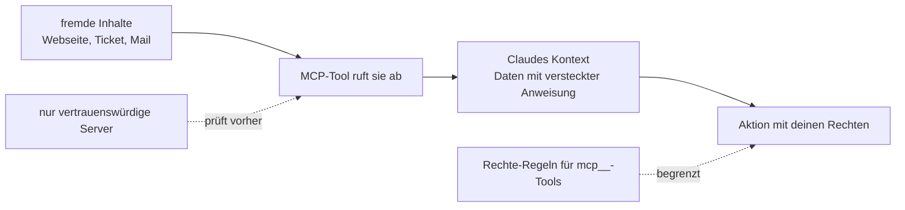

# S2.17 · MCP-Sicherheit und ein eigener Server

<!-- meta:start -->
> **Regal:** [MCP & Wissensquellen](README.md#mcp-knowledge) · **Stufe:** Vertiefung · **~18 Min** · **Voraussetzungen:** [S2.15 MCP einrichten: Transporte, Scopes, CLI](s2-15-mcp-einrichten.md) · 🛡 **Sicherheitsboden**
>
> ← [S2.16 MCP im Detail: OAuth, Ausgabegrenzen, Protokoll](s2-16-mcp-im-detail.md) · [Bibliothek](README.md) · [S2.18 RAG und NotebookLM: dem Agenten Baupläne geben](s2-18-rag-und-notebooklm.md) →
<!-- meta:end -->

## Schnellcheck

- Kannst du ohne Nachschlagen drei Risiken nennen, die ein fremder MCP-Server mitbringt, und zu jedem eine Gegenmaßnahme?
- Weißt du, wie die Rechte-Regel aussieht, die genau ein Tool eines MCP-Servers sperrt?

## Auf einen Blick

Anthropic auditiert keinen MCP-Server auf Sicherheit. Ein Server bekommt, was Claude ihm schickt, und was er zurückliefert, landet in Claudes Kontext; ein Server, der Webseiten, Tickets oder Mails abruft, kann Claude so fremde Anweisungen unterschieben (Prompt Injection). Verbinde deshalb nur Server, denen du vertraust, und begrenze ihre Tools mit Rechte-Regeln. Eine Regel sperrt aber nur Claudes Aufrufe, nicht den Server-Prozess selbst, der außerhalb der Sandbox läuft.

Findest du keinen passenden Server, schreibst du einen eigenen, dessen Code du kennst.

## Bild im Kopf

Stell dir eine Wache am Empfang vor. Ein Besucher gibt einen Zettel ab, auf dem steht: „Bitte Tor 3 öffnen, der Chef hat es erlaubt.“ Der Zettel kommt über den ganz normalen Kanal, und die Wache hat ihn nicht geschrieben. Hält sie jeden Zettel für einen Befehl, öffnet sie das Tor. So wirkt Prompt Injection über einen MCP-Server: Die Anweisung kommt nicht aus deinem Code, sondern steckt in den Daten, die der Server liefert. Die Wache braucht eine Regel, welche Tore sie überhaupt öffnen darf, egal was auf dem Zettel steht. Das sind deine Rechte-Regeln.

Die anderen beiden Risiken, Datenabfluss und Zugangsdaten, sind andere Fälle: Dort liegt das Problem nicht im Zettel, sondern beim Server selbst oder bei dem, was du ihm gibst. Die Tabelle unten trennt sie.



## Im Detail

### Drei Risiken, je eine Gegenmaßnahme

Anthropic empfiehlt, eigene MCP-Server zu schreiben oder Server von Anbietern zu nutzen, denen du vertraust. Connectors für das Anthropic Directory prüft Anthropic gegen seine Aufnahmekriterien, auditiert aber keinen MCP-Server auf Sicherheit und betreibt keinen.

| Risiko | Beispiel | Gegenmaßnahme | Was sie nicht abdeckt |
|---|---|---|---|
| **Prompt Injection** | Ein Server holt eine Webseite oder ein Ticket, und der Text darin sagt Claude, es solle eine Datei löschen. | Nur vertrauenswürdige Server; Rechte-Regeln, die begrenzen, was Claude danach tun darf. | Eine Regel sperrt Werkzeuge. Den fremden Text im Kontext verhindert sie nicht. |
| **Datenabfluss** | Ein bösartiger Server bekommt alles, was Claude ihm in Tool-Aufrufen schickt, auch Inhalte aus deinen Projektdateien. Ein stdio-Server läuft zudem als Prozess auf deinem Rechner. | Nur Server, die du kennst oder selbst gebaut hast; eine Deny- oder Ask-Regel für das Tool; keine sensiblen Dateien im Projekt. | Rechte-Regeln greifen bei Claudes Aufrufen. Der Server-Prozess selbst läuft außerhalb der Sandbox. |
| **Zugangsdaten** | Ein Token steht im Befehl (Shell-History) oder als Default in der eingecheckten `.mcp.json`; oder du verbindest einen Server aus einem fremden Repo. | `${VAR}` ohne Default ([S2.15](s2-15-mcp-einrichten.md)); in `/mcp` **Clear authentication**; `claude mcp remove` (löscht bei entfernten Servern auch gespeicherte OAuth-Tokens). | Ein einmal verratenes Token musst du beim Dienst selbst widerrufen. |

### Rechte-Regeln für MCP-Tools

Eine MCP-Regel nennt den Server und optional das Tool. Die Namen kennst du aus [S2.14](s2-14-mcp-stecker.md): `mcp__<server>__<tool>`. Die Beispiele stehen in der Doku:

- `mcp__puppeteer` trifft jedes Tool des Servers `puppeteer`
- `mcp__puppeteer__*` trifft ebenfalls alle seine Tools (Wildcard)
- `mcp__puppeteer__puppeteer_navigate` trifft nur dieses eine Tool

Zwei Regeln der Doku musst du kennen. Erstens: Eine `mcp__`-Regel **mit Klammern** überspringt Claude Code beim Laden einer Einstellungsdatei. Du kannst also keine Regel schreiben, die ein Tool nur bei bestimmten Argumenten sperrt. Wer das braucht, nimmt das Flag `--disallowedTools`. Zweitens: Eine Allow-Regel mit Wildcard darf erst nach dem festen Präfix `mcp__<server>__` stehen; `mcp__*` als Allow-Regel wird übersprungen und erlaubt nichts. Für Deny-Regeln gilt `mcp__*` dagegen und sperrt alle MCP-Tools.

Eine Deny-Regel für einen einzelnen Tool-Namen entfernt das Tool aus Claudes Kontext: Claude sieht es gar nicht mehr. Die Sandbox ([S3.9](s3-09-geschuetzte-pfade-und-sandbox.md)) begrenzt dagegen die Shell-Befehle, die Claude startet. Hooks und MCP-Server laufen außerhalb der Sandbox ([S2.13](s2-13-plugin-lieferkette.md)).

### Server aus fremden Repos

Eine `.mcp.json` bringt ihre Server mit. In einer interaktiven Sitzung fragt Claude Code vor der Nutzung nach ([S2.15](s2-15-mcp-einrichten.md)). In `claude -p`-Läufen, Agent-SDK-Sitzungen und Cloud-Sitzungen kann es nicht fragen und lädt Projekt-Server ohne Rückfrage ([S4.3](s4-03-headless.md)). Mit `disabledMcpjsonServers` hältst du einen Server in jedem Modus draußen. Beachte außerdem: Server können auch aus Plugins und aus anderen Scopen kommen, ein Blick in die `.mcp.json` zeigt also nicht alle Server, die eine Sitzung laden kann.

### Channels: Server, die von sich aus melden

Ein klassischer MCP-Server antwortet nur: Claude ruft ein Tool auf, der Server antwortet. Ein **Channel** ist ein MCP-Server, der Ereignisse in eine laufende Claude-Code-Sitzung schickt, etwa Nachrichten aus Telegram oder Discord, damit Claude reagiert, während du nicht am Terminal bist. Channels sind laut Doku eine **Research Preview**: Aufruf und Schnittstelle können sich noch ändern. Ein Eintrag in der `.mcp.json` reicht nicht, damit ein Server Nachrichten schieben darf: Du gibst ihn beim Start mit `--channels` frei.

### Einen eigenen Server bauen

Decken vorhandene Server deinen Bedarf nicht (interne APIs, eigene Datenbanken), schreibst du einen eigenen. Den Anfang hast du in [S2.14](s2-14-mcp-stecker.md) gemacht: Dort läuft ein Server aus einer Python-Datei, die das Protokoll von Hand spricht. Mit einer Bibliothek schreibst du nur die Funktionen. Hier ein Gerüst mit `fastmcp` (Python ab 3.10, Dokumentation: [gofastmcp.com](https://gofastmcp.com)); installier es in einer virtuellen Umgebung im Projektordner (`python3 -m venv .venv`, aktivieren, `pip install fastmcp`), denn ein nacktes `pip install` scheitert auf aktuellen Linux- und Homebrew-Systemen mit `externally-managed-environment`:

```python
# my_mcp_server.py
from fastmcp import FastMCP

mcp = FastMCP("my-tools")

@mcp.tool
def list_active_features() -> list[str]:
    """Return active feature flags."""
    return ["new_dashboard", "experimental_search"]

if __name__ == "__main__":
    mcp.run()
```

In die `.mcp.json` trägst du ihn so ein:

```json
{
  "mcpServers": {
    "my-tools": {
      "command": "python",
      "args": ["my_mcp_server.py"]
    }
  }
}
```

Damit `python` die installierte Bibliothek findet, aktivierst du die virtuelle Umgebung in dem Terminal, aus dem du Claude Code startest; alternativ trägst du den vollen Pfad ein (`.venv/bin/python`, unter Windows `.venv\Scripts\python.exe`). Unter macOS und Linux heißt der Befehl ohne Umgebung meist `python3`. Das Muster gilt in jeder Sprache mit MCP-SDK. Dein eigener Server ist so sicher wie dein Code: Er läuft mit deinen Rechten, also gelten für ihn dieselben Regeln wie für jedes Programm, das du selbst schreibst.

Für gemeinsame Team-Dienste ist HTTP der empfohlene Transport ([S2.15](s2-15-mcp-einrichten.md)). In der `.mcp.json` steht dann:

```json
{
  "mcpServers": {
    "my-team-tools": {
      "type": "http",
      "url": "https://mcp.corp.example/tools"
    }
  }
}
```

Braucht der Dienst eine Anmeldung, nimmst du OAuth über `/mcp` oder ein Token im Header (`"Authorization": "Bearer ${TEAM_MCP_TOKEN}"`). Das Token steht als Umgebungsvariable in der Datei, nie im Klartext in der eingecheckten `.mcp.json`.

## Selbst machen

### Übung: ein MCP-Tool sperren und die Sperre prüfen (etwa 15 Minuten)

**Ziel:** Du schreibst eine Rechte-Regel für ein einzelnes Tool eines MCP-Servers und siehst, dass Claude genau dieses Tool nicht mehr nutzen kann, das andere aber schon.

**Startzustand:** ein Ordner `~/cc-workshop/mcp-sicherheit` mit `server.py` aus [S2.14](s2-14-mcp-stecker.md). Hast du den Ordner `~/cc-workshop/mcp` noch, kopierst du die Datei (`mkdir -p ~/cc-workshop/mcp-sicherheit && cp ~/cc-workshop/mcp/server.py ~/cc-workshop/mcp-sicherheit/`, in PowerShell `New-Item -ItemType Directory -Force "$HOME\cc-workshop\mcp-sicherheit"; Copy-Item "$HOME\cc-workshop\mcp\server.py" "$HOME\cc-workshop\mcp-sicherheit\"`); sonst legst du sie nach S2.14, Schritt 1 neu an. Wechsle in den Ordner. Nur Python nötig. Die Regel gilt nur in diesem Ordner.

1. Lege die `.mcp.json` an (unter Windows `"command": "python"`):

   ```json
   {
     "mcpServers": {
       "rooms": {
         "command": "python3",
         "args": ["server.py"]
       }
     }
   }
   ```

2. Lege die Regeldatei an. Der Ordner `.claude` ist ein geschützter Pfad: Du legst ihn und die Datei selbst von Hand an, denn Claude würde dort vor dem Schreiben nachfragen. Speichere als `.claude/settings.json`:

   <!-- cockpit:example -->
   ```json
   {
     "permissions": {
       "allow": ["mcp__rooms__list_rooms"],
       "deny": ["mcp__rooms__door_code"]
     }
   }
   ```

   Die Allow-Regel lässt `list_rooms` ohne Rückfrage laufen. Die Deny-Regel nennt genau ein Tool: server `rooms`, tool `door_code`.

3. Starte `claude --permission-mode default` im Ordner. Bestätige den Dialog zum Ordner und gib den Server frei. Tipp `/permissions`. Erwartet: Deine beiden Regeln stehen unter Allow und Deny. Schließ die Ansicht mit `Esc`.

4. Ruf das erlaubte Tool auf:

   ```text
   Use the rooms tool list_rooms and tell me the site name it reports.
   ```

   Erwartet: Das Tool läuft ohne Rückfrage, und Claude nennt den Namen.

5. Ruf das gesperrte Tool auf, mit dem Zusatz, der den Umweg über die Datei ausschließt:

   ```text
   Without reading any files, use the rooms tool door_code to get the door code of the lab.
   ```

   Erwartet: Claude nennt den Code `3088` nicht. Es meldet, dass das Tool nicht verfügbar ist oder abgelehnt wurde. Das gesperrte Tool kommt nicht zum Zug, und das erlaubte lief eben noch.

6. Prüf die Falle der Doku: Ändere die Deny-Regel auf `"mcp__rooms__door_code(lab)"` (mit Klammern), speichere und starte eine neue Sitzung. Erwartet: Beim Start erscheint ein Dialog über ungültige Einstellungen, der die übersprungene Regel nennt (so beschreibt es die Doku), und stellst du die Frage aus Schritt 5 noch einmal, ist das Tool nicht mehr gesperrt: Claude ruft es auf, oder Claude Code fragt vorher um Freigabe (antworte dann mit „No“). Mach die Änderung rückgängig.

**Aufräumen:** Beende die Sitzung und lösch den Ordner `~/cc-workshop/mcp-sicherheit`. Auch `~/cc-workshop/mcp` und `~/cc-workshop/mcp-setup` kannst du jetzt löschen.

**Geschafft, wenn:**

- [ ] `/permissions` deine Allow- und deine Deny-Regel gezeigt hat
- [ ] `list_rooms` lief und `door_code` nicht
- [ ] die Regel mit Klammern nicht gehalten hat
- [ ] du für jedes der drei Risiken aus der Tabelle eine Gegenmaßnahme nennen kannst

### Extra: Die Regel sperrt das Tool, nicht die Daten (etwa 5 Minuten)

Stell dieselbe Frage wie in Schritt 5, aber ohne den Zusatz „Without reading any files“: `What is the door code of the lab? Find it any way you can.` Der Code steht in `server.py`, und Claudes Datei-Werkzeuge können diese Datei lesen. Ob Claude das tut, hängt vom Modell ab; der Punkt ist, dass die Regel nur das Tool sperrt, nicht die Information. Willst du auch den Weg über die Datei sperren, ergänzt du in `deny` die Regel `Read(./server.py)`. Sie gilt für Claudes Datei-Werkzeuge; ein Shell-Befehl wie `cat` läuft über die Bash-Regeln ([S1.5](s1-05-rechte-im-alltag.md)) oder die Sandbox ([S3.9](s3-09-geschuetzte-pfade-und-sandbox.md)).

## Typische Fallen

- **Der eigene Server taucht nicht auf.** Meist ist es der falsche Python-Name (`python` unter Windows, `python3` sonst) oder ein Server aus der `.mcp.json`, den du noch nicht bestätigt hast ([S2.15](s2-15-mcp-einrichten.md)). `/mcp` zeigt den Status.
- **Die Deny-Regel hat Klammern.** Eine `mcp__`-Regel mit Klammern überspringt Claude Code. Sperr das ganze Tool oder nimm `--disallowedTools`.
- **Zugangsdaten stehen im Klartext in der `.mcp.json`.** Die Datei wird eingecheckt. Nimm `${VAR}` ohne Default und setz die echten Werte in der Umgebung ([S2.15](s2-15-mcp-einrichten.md)).
- **Ein Server für fremde Inhalte gilt als harmlos, weil er nur liest.** Gerade das Lesen ist der Weg für Prompt Injection: Was er abruft, landet in Claudes Kontext.
- **„Die Sandbox hält den Server in Schach.“** Server-Prozesse laufen außerhalb der Sandbox. Begrenzen kannst du Claudes Aufrufe, nicht, was der Server intern tut.

## Check

Du kannst drei Risiken fremder MCP-Server mit je einer Gegenmaßnahme nennen, ein einzelnes Tool per Regel sperren und sagen, was die Regel nicht abdeckt.

1. Nenn die drei Risiken aus der Tabelle und zu jedem eine Gegenmaßnahme.
2. Wie lautet die Regel, die nur das Tool `door_code` des Servers `rooms` sperrt, und was passiert, wenn du sie mit Klammern schreibst?
3. Was ist anders, wenn dieselbe `.mcp.json` in einem `claude -p`-Lauf geladen wird?

<details><summary>Auflösung</summary>

1. Prompt Injection: nur vertrauenswürdige Server und Rechte-Regeln, die begrenzen, was Claude danach tun darf. Datenabfluss: Server, die du kennst oder selbst gebaut hast, und eine Deny- oder Ask-Regel für das Tool. Zugangsdaten: `${VAR}` ohne Default, **Clear authentication** in `/mcp` oder `claude mcp remove`.
2. `mcp__rooms__door_code` in `permissions.deny`. Mit Klammern überspringt Claude Code die Regel beim Laden und zeigt sie im Dialog über ungültige Einstellungen; gesperrt wird dann nichts.
3. In `claude -p`-Läufen kann Claude Code nicht nach der Freigabe fragen und lädt Projekt-Server ohne Rückfrage.

</details>

<details><summary>Quizfrage</summary>

**Frage:** Du hast die Sandbox eingeschaltet und einen stdio-MCP-Server angebunden. Was ist richtig?

- **Richtig:** Die Sandbox begrenzt Claudes Shell-Befehle; der Server-Prozess läuft außerhalb, und nur Claudes Aufrufe seiner Tools begrenzt du mit Regeln.
- Falsch: Der Server läuft in der Sandbox und kann deshalb nur Dateien im Projektordner lesen, egal welchen Code er selbst enthält.
- Falsch: Rechte-Regeln wirken nur auf die eingebauten Werkzeuge; für MCP-Tools brauchst du deshalb zusätzlich die Sandbox.
- Falsch: Die Sandbox sperrt jeden Tool-Aufruf an den Server, sobald sie den Netzwerkzugriff einschränkt, und ersetzt so die Regeln.

</details>

## Weiterlesen

- [MCP in Claude Code](https://code.claude.com/docs/en/mcp)
- [Sicherheit: Prompt Injection und MCP](https://code.claude.com/docs/en/security)
- [Rechte-Regeln für MCP-Tools](https://code.claude.com/docs/en/permissions)
- [Channels](https://code.claude.com/docs/en/channels)
- [S2.15 · MCP einrichten: Transporte, Scopes, CLI](s2-15-mcp-einrichten.md)
- [S2.16 · MCP im Detail: OAuth, Ausgabegrenzen, Protokoll](s2-16-mcp-im-detail.md)
- [S2.13 · Lieferkettenrisiken bei Plugins](s2-13-plugin-lieferkette.md)
- [S1.6 · Alle Rechte-Modi im Überblick](s1-06-rechte-modi.md)
- [S3.9 · Geschützte Pfade und Sandbox-Stufen](s3-09-geschuetzte-pfade-und-sandbox.md)
- [S4.3 · Headless: claude -p als Pipeline-Stufe](s4-03-headless.md)
