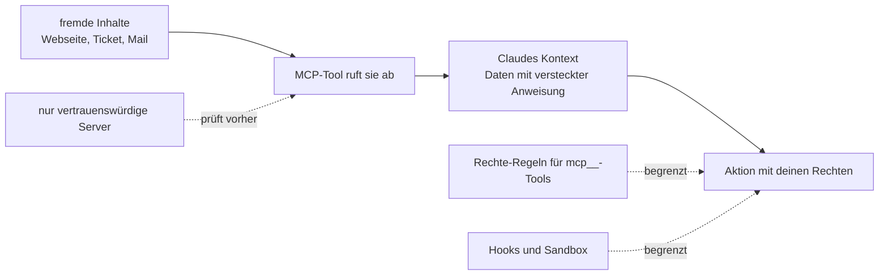

# S2.17 · MCP-Sicherheit und ein eigener Server

<!-- meta:start -->
> **Regal:** [MCP & Wissensquellen](README.md#mcp-knowledge) · **Stufe:** Vertiefung · **~18 Min** · **Voraussetzungen:** [S2.15 MCP einrichten: Transporte, Scopes, CLI](s2-15-mcp-einrichten.md) · 🛡 **Sicherheitsboden**
>
> ← [S2.16 MCP im Detail: OAuth, Ausgabegrenzen, Protokoll](s2-16-mcp-im-detail.md) · [Bibliothek](README.md) · [S2.18 RAG und NotebookLM: dem Agenten Baupläne geben](s2-18-rag-und-notebooklm.md) →
<!-- meta:end -->

## Schnellcheck

- Kannst du ohne Nachschlagen drei Risiken nennen, die ein fremder MCP-Server mitbringt, und zu jedem eine Gegenmaßnahme?
- Hast du schon einmal einen eigenen MCP-Server gebaut, etwa mit fastmcp oder einem SDK, und in eine `.mcp.json` eingetragen?

## Auf einen Blick

Anthropic auditiert keinen MCP-Server auf Sicherheit. Ein Server bekommt, was Claude ihm schickt, und was er zurückliefert, landet in Claudes Kontext; ein Server, der Webseiten, Tickets oder Mails abruft, kann Claude so fremde Anweisungen unterschieben (Prompt Injection). Verbinde deshalb nur Server, denen du vertraust, und begrenze ihre Tools mit Rechte-Regeln.

Mit MCP wird Claude vom Assistenten zum Orchestrator, der Browser, Chat und Datenbanken bedient, und deshalb zählen Hooks und Leitplanken hier noch mehr. Findest du keinen passenden Server, baust du mit `fastmcp` in wenigen Zeilen einen eigenen, dessen Code du kennst.

## Bild im Kopf

Stell dir einen Wiegand-OSDP-Konverter unbekannter Herkunft zwischen Leser und Controller vor. Er kann Telegramme einschleusen, die gültig aussehen, aber manipuliert sind, und der Controller kann sie nicht von echten unterscheiden. So wirkt Prompt Injection über einen MCP-Server: Die Anweisung kommt nicht aus deinem Code, sondern aus den Daten, die der Server liefert. Einen eigenen MCP-Server zu bauen ist, als setztest du selbst entwickelte Firmware ein: volle Kontrolle über den Inhalt, volle Verantwortung für das Ergebnis.



## Im Detail

### Drei Risiken

Anthropic empfiehlt, eigene MCP-Server zu schreiben oder Server von Anbietern zu nutzen, denen du vertraust. Connectors für das Anthropic Directory prüft Anthropic gegen seine Aufnahmekriterien, auditiert aber keinen MCP-Server auf Sicherheit und betreibt keinen.

Die wichtigsten Risiken:

- **Prompt Injection:** MCP-Server, die fremde Inhalte abrufen (Webseiten, Tickets, Mails), können Anweisungen in Claudes Kontext schleusen.
- **Datenabfluss:** Ein bösartiger Server bekommt alles, was Claude ihm in Tool-Aufrufen schickt, auch Inhalte aus deinen Projektdateien. Ein lokaler stdio-Server läuft zudem als Prozess auf deinem Rechner, mit deinen Rechten.
- **Token-Diebstahl:** OAuth-Tokens, die Claude Code für MCP-Server speichert, können kompromittiert werden.

### Gegenmaßnahmen

- **Nur vertrauenswürdige Server** installieren.
- **Mit `/mcp` prüfen**, was verbunden ist. Dort entziehst du einem Server mit **Clear authentication** auch den Zugang; `claude mcp remove` löscht bei entfernten Servern die gespeicherten OAuth-Tokens mit.
- **Rechte-Regeln** begrenzen, was Claude mit MCP-Tools darf ([S1.5](s1-05-rechte-im-alltag.md), [S1.6](s1-06-rechte-modi.md)). Eine MCP-Regel nennt den Server und optional das Tool: `mcp__puppeteer` trifft jedes Tool des Servers `puppeteer`, `mcp__puppeteer__puppeteer_navigate` nur dieses eine.
- **Sandbox** für Integrationen mit hohem Risiko erwägen ([S3.9](s3-09-geschuetzte-pfade-und-sandbox.md)).
- **Server aus fremden Repos** kritisch sehen: Eine `.mcp.json` bringt ihre Server mit. In einer interaktiven Sitzung fragt Claude Code, bevor es sie nutzt ([S2.15](s2-15-mcp-einrichten.md)). In `claude -p`-Läufen kann es nicht fragen und lädt sie ohne Rückfrage ([S4.3](s4-03-headless.md)).

### Was MCP verändert

Ohne MCP ist Claude ein starker Assistent, der mit deinem lokalen Dateisystem und Terminal arbeitet.

Mit MCP wird Claude zum **Orchestrator**, der:

- Browser steuert und Web-Abläufe automatisiert
- Slack liest und in deinem Namen Antworten entwirft
- deine Datenbanken abfragt und Berichte erzeugt
- deine CI/CD-Pipeline beobachtet und auf Fehler reagiert
- mit jedem System arbeitet, das deine Organisation nutzt

Die Grenze zwischen „KI-Assistent" und „automatisiertem Agenten" verschwimmt mit MCP deutlich. Deshalb zählen Hooks und Leitplanken ([S2.6](s2-06-hooks-als-sensoren.md), [S2.8](s2-08-hook-einrichten.md)) mit MCP noch mehr.

### Channels: Server, die von sich aus melden

Ein klassischer MCP-Server antwortet nur: Claude ruft ein Tool auf, der Server antwortet. **Channels** drehen das um: Ein MCP-Server schickt von sich aus Nachrichten in eine laufende Claude-Code-Sitzung. Im Bild der Leitstelle ist das der Funkspruch an die Streife.

Einsatz:

- Der CI-Server meldet „Build fertig" in deine aktive Sitzung.
- Eine Erwähnung in Slack erscheint als Benachrichtigung in Claude Code.
- Ein externes Monitoring meldet Claude, dass gerade ein Alarm ausgelöst hat.

Stand: **Research Preview**. Behandle Channels als experimentell; Aufruf und Schnittstelle können sich noch ändern. Ein Eintrag in der `.mcp.json` reicht nicht, damit ein Server Nachrichten schieben darf: Du musst ihn beim Start mit `--channels` freigeben. Vom Konzept her ersetzen Channels das selbst gebaute Muster „Telegram-Bridge", das viele Teams von Hand bauen ([S3.13](s3-13-autonome-loops-absichern.md)).

### Einen eigenen Server bauen

Decken vorhandene MCP-Server deinen Bedarf nicht (interne APIs, eigene Datenbanken, proprietäre Werkzeuge), schreibst du einen eigenen. Hier ein minimales Python-Gerüst mit `fastmcp`:

<!-- cockpit:example -->
```python
# my_mcp_server.py
from fastmcp import FastMCP

mcp = FastMCP("my-tools")

@mcp.tool()
def get_user_count(date: str) -> int:
    """Return the number of registered users on a given date."""
    # Your custom logic here — query DB, call API, etc.
    import sqlite3
    conn = sqlite3.connect("users.db")
    cur = conn.execute("SELECT COUNT(*) FROM users WHERE date(created_at) = ?", (date,))
    return cur.fetchone()[0]

@mcp.tool()
def list_active_features() -> list[str]:
    """Return active feature flags."""
    # Read from your config / feature-flag service
    return ["new_dashboard", "experimental_search"]

if __name__ == "__main__":
    mcp.run(transport="stdio")
```

In die `.mcp.json` eintragen:

```json
{
  "mcpServers": {
    "my-tools": {
      "command": "python",
      "args": ["my_mcp_server.py"]
    }
  }
}
```

> Unter Windows nimmst du `"python"` (meist gibt es keine `python3.exe`), unter macOS und Linux `"python3"`. Mit dem falschen Namen startet der MCP-Server nicht, und Claude bekommt keine Tools von ihm. `/mcp` und `claude mcp list` zeigen dir, ob er verbunden ist.

Jetzt kann Claude Code `get_user_count` und `list_active_features` als Tools aufrufen. Dasselbe Muster funktioniert in Node.js (`@modelcontextprotocol/sdk`) und in jeder Sprache mit MCP-SDK.

**Für HTTP-Server** (empfohlen für gemeinsame Team-Dienste): Tausch `transport="stdio"` gegen `transport="http"` und betreib den Server als normalen HTTPS-Dienst. In der `.mcp.json` steht dann:

```json
{
  "mcpServers": {
    "my-team-tools": {
      "type": "http",
      "url": "https://mcp.corp.example/tools"
    }
  }
}
```

**Typische Kandidaten für einen eigenen Server:**

- interne API-Gateways (Jira, ServiceNow, internes Wiki)
- Datenbankabfragen (PostgreSQL, Snowflake, ClickHouse)
- Build- und CI-Status (Jenkins, ArgoCD)
- Monitoring (Prometheus, Grafana, Datadog)
- eigene Protokoll-Parser (OSDP, BACnet, Modbus, naheliegend für Physical Security)

Der MCP-Server wird so zur **gemeinsamen Wissensschicht** für die Claude-Code-Abläufe deines Teams.

## Typische Fallen

- **Der eigene Server taucht nicht auf.** Meist ist es der falsche Python-Name (siehe oben) oder ein Server aus der `.mcp.json`, den du noch nicht bestätigt hast ([S2.15](s2-15-mcp-einrichten.md)). `/mcp` zeigt den Status.
- **Zugangsdaten stehen im Klartext in der `.mcp.json`.** Die Datei wird eingecheckt. Nimm `${VAR}` oder `${VAR:-default}` und setz die echten Werte in der Umgebung ([S2.15](s2-15-mcp-einrichten.md)).
- **Ein Server für fremde Inhalte gilt als harmlos, weil er nur liest.** Gerade das Lesen ist der Weg für Prompt Injection: Was er abruft, landet in Claudes Kontext.

## Check

Du kannst drei Risiken fremder MCP-Server mit je einer Gegenmaßnahme nennen und einen eigenen Minimal-Server mit fastmcp so eintragen, dass Claude seine Tools aufruft.

1. Warum kommt Prompt Injection über MCP von der Datenseite und nicht aus dem Code des Servers?
2. Welche Rechte-Regel trifft jedes Tool eines Servers namens `github`?
3. Was ist anders, wenn dieselbe `.mcp.json` in einem `claude -p`-Lauf geladen wird?

<details><summary>Quizfrage</summary>

**Frage:** Warum ist Prompt Injection über einen MCP-Server ein anderes Risiko als ein bösartiges Plugin?

- **Richtig:** Der Angriff kommt über die Daten: Abgerufene Inhalte schieben Claude Anweisungen unter. Ein Plugin bringt eigenen Code mit, der bei dir läuft.
- Falsch: Es ist harmloser: Claude behandelt MCP-Ausgaben immer als reine Daten und liest darin nie Anweisungen, anders als bei Plugins.
- Falsch: Es ist dasselbe Risiko: Beide führen Shell-Befehle in deiner Umgebung aus und haben deshalb genau dieselbe Angriffsfläche.
- Falsch: Es geht nur um Tokens: MCP-Server laufen in einer OS-Sandbox ohne Zugriff auf Projektdateien, gefährdet sind allein die gespeicherten OAuth-Tokens.

</details>

## Weiterlesen

- [MCP in Claude Code](https://code.claude.com/docs/en/mcp)
- [Sicherheit: Prompt Injection und MCP](https://code.claude.com/docs/en/security)
- [Channels](https://code.claude.com/docs/en/channels)
- [S2.15 · MCP einrichten: Transporte, Scopes, CLI](s2-15-mcp-einrichten.md)
- [S2.16 · MCP im Detail: OAuth, Ausgabegrenzen, Protokoll](s2-16-mcp-im-detail.md)
- [S2.13 · Lieferkettenrisiken bei Plugins](s2-13-plugin-lieferkette.md)
- [S1.6 · Alle Rechte-Modi im Überblick](s1-06-rechte-modi.md)
- [S3.9 · Geschützte Pfade und Sandbox-Stufen](s3-09-geschuetzte-pfade-und-sandbox.md)
- [S3.13 · Autonome Loops absichern: Budget und Worktree](s3-13-autonome-loops-absichern.md)
- [S4.3 · Headless: claude -p als Pipeline-Stufe](s4-03-headless.md)
