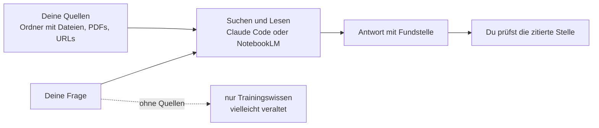

# S2.18 · RAG und NotebookLM: dem Agenten Baupläne geben

<!-- meta:start -->
> **Regal:** [MCP & Wissensquellen](README.md#mcp-knowledge) · **Stufe:** Kern · **~18 Min** · **Voraussetzungen:** [S2.14 MCP: der Integrationsstecker](s2-14-mcp-stecker.md)
>
> ← [S2.17 MCP-Sicherheit und ein eigener Server](s2-17-mcp-sicherheit.md) · [Bibliothek](README.md) · [S2.19 Grenzen von RAG und Datenschutz](s2-19-rag-grenzen.md) →
<!-- meta:end -->

## Schnellcheck

- Kannst du ohne Nachschlagen sagen, bei welchen Fragen aus deinem Alltag Claudes Trainingswissen nicht reicht und du eine eigene Wissensquelle brauchst?
- Weißt du, was `@ordner` in Claude Code lädt: die Dateiliste oder die Inhalte?

## Auf einen Blick

Claude kennt nur, was bis zu einem Stichtag in den Trainingsdaten stand, und deine internen Dokumente kennt Claude gar nicht. RAG (Retrieval-Augmented Generation) schließt diese Lücke: Vor der Antwort werden passende Stellen aus einer kuratierten Quellensammlung geholt, und die Antwort stützt sich auf dieses Material. Claude Code kann das mit eigenen Mitteln: Es durchsucht und liest die Dateien eines Ordners und zitiert die Fundstelle. NotebookLM von Google ist die gehostete Variante: ein Index, den du mit Quellen füllst.

Alles, was du in NotebookLM lädst, liegt danach auf Google-Servern. Welche Quellen dorthin dürfen und wo RAG an Grenzen stößt, steht in [S2.19](s2-19-rag-grenzen.md).

## Bild im Kopf

Stell dir vor, du holst eine Fachberaterin ins Haus. Sagst du ihr nichts, arbeitet sie mit allgemeinem Wissen: vernünftiger Rat, der aber nicht zu deinem System passt. Gibst du ihr die Handbücher, deine Betriebsregeln und die Fehlerhistorie, arbeitet sie mit deinen echten Unterlagen und kann jede Aussage mit einer Seitenzahl belegen. Genau das ist RAG: geprüftes, konkretes und aktuelles Wissen statt Verallgemeinerungen. Und wie bei der Beraterin gilt: Fehlt die Seite, sagt eine gute Beraterin das, statt etwas zu erfinden.



## Im Detail

### Das Problem: Stichtag und Nischenwissen

Claudes Trainingsdaten haben einen Stichtag. Fragst du nach einer Bibliothek, die letzten Monat erschienen ist, rät Claude vielleicht, erfindet plausibel aussehende, aber falsche API-Aufrufe oder räumt ein, es nicht sicher zu wissen.

Neben der Aktualität geht es um Spezialwissen: deine internen APIs, die Coding-Standards deiner Organisation, eure Architekturentscheidungen, das gesammelte Wissen deines Teams. Nichts davon steht in Claudes Trainingsdaten, und im offenen Internet steht es auch nicht.

RAG löst das: Statt sich nur auf Trainingswissen zu verlassen, bekommt Claude Zugriff auf eine gezielt zusammengestellte Wissensbasis. Steht eine Frage an, wird zuerst passender Inhalt aus deinen Quellen geholt; die Antwort stützt sich dann auf dieses Material.

### Vier Wege, Claude Wissen zu geben

| Weg | So funktioniert er | Gut für | Grenze |
|---|---|---|---|
| **Ordner mit Dateien** | Claude durchsucht und liest die Dateien mit seinen Such- und Lese-Werkzeugen selbst und zitiert Datei und Zeile. | kleine bis mittlere Sammlungen, Markdown und Text, alles lokal | Claude muss die richtige Datei finden; bei sehr großen Sammlungen wird die Suche ungenau |
| **`@datei`** | Lädt die **ganze Datei** in das Gespräch. Die Doku: „This includes the full content of the file in the conversation.“ | eine Datei, die du ohnehin komplett brauchst | `@ordner` zeigt nur die **Dateiliste**, nicht die Inhalte („Directory references show file listings, not contents“). |
| **CLAUDE.md oder Skill** | Eine Anweisung wie „Bei Fragen zu X zuerst `kb/` lesen“ steht in der `CLAUDE.md` ([S1.10](s1-10-claude-md.md)) oder in einem Skill mit Referenzdateien ([S2.2](s2-02-skill-schreiben.md)). | Claude soll das Wissen von selbst nutzen | Anweisungen steuern, sie laden das Wissen nicht |
| **Gehosteter Index (NotebookLM)** | Du lädst Quellen hoch, der Dienst indexiert sie und sucht pro Frage die passenden Stellen. | große, gemischte Sammlungen (PDFs, URLs, Videos) mit Zitaten | Alles liegt bei Google; die Antworten brauchen weiter deine Prüfung |

Ein MCP-Server ([S2.14](s2-14-mcp-stecker.md)) kann einen fünften Weg bauen: ein Suchwerkzeug über deine Dateien oder deine Datenbank, das Claude wie ein eingebautes Tool aufruft. [S2.17](s2-17-mcp-sicherheit.md) zeigt, wie du einen Server schreibst.

### NotebookLM: RAG ohne eigene Infrastruktur

Ein RAG-System von Grund auf zu bauen heißt: Embedding-Modell, Vektordatenbank, eine Pipeline, die Texte in Abschnitte zerlegt, Suchlogik und Prompt-Engineering. Das ist ein echtes Engineering-Projekt. Google NotebookLM nimmt dir das ab: Du legst ein Notebook an, fügst Quellen hinzu (URLs, PDFs, YouTube-Videos, eingefügten Text, Google Docs), und NotebookLM indexiert sie. Du fragst über die Web-Oberfläche und bekommst eine Antwort mit Zitaten, die auf konkrete Stellen in deinen Quellen zeigen.

Google führt NotebookLM inzwischen als **Gemini Notebook**; `notebooklm.google.com` leitet auf `notebook.google.com` weiter (Stand 2026-09-30). Das Kapitel bleibt beim alten Namen, weil die Kommandozeile ihn trägt.

Aus Claude Code heraus fragst du NotebookLM über `notebooklm-py` ab, laut PyPI eine **inoffizielle** Bibliothek zur Automatisierung von Google NotebookLM (MIT-Lizenz). Sie gehört weder zu Claude Code noch zu Google, und sie braucht ein Google-Konto. Ein fremdes Werkzeug mit Zugriff auf dein Google-Konto prüfst du vorher wie ein Plugin ([S2.13](s2-13-plugin-lieferkette.md)). Deshalb steht der Weg unten nur als Extra; die Hauptübung kommt ohne Konto und ohne Fremdwerkzeug aus.

### Wofür sich eine Wissensbasis lohnt

- **Interne Dokumentation:** Runbooks, Architecture Decision Records, Teamregeln. Claude beantwortet „Wie machen wir Datenbank-Migrationen in diesem Projekt?“ mit eurem tatsächlichen Ablauf.
- **Aktuelle API-Dokumentation:** die neueste Doku einer Bibliothek statt möglicherweise veralteten Trainingswissens.
- **Recherche-Sammlungen:** Papers, Artikel und Blogposts zu einem Thema, zum Zusammenfassen und Vergleichen.
- **Kuratierte Best Practices:** ein Ordner „So machen wir das hier“ mit Coding-Standards und Checklisten.
- **Vorschriften und Compliance:** die Regelwerke deiner Branche; Claudes Hinweise zitieren dann den tatsächlichen Text.

## Selbst machen

### Übung: eine Wissensbasis aus Dateien, mit Quellenangabe (etwa 15 Minuten)

**Ziel:** Du gibst Claude Code einen Ordner mit Quellen, lässt es daraus mit Quellenangabe antworten, vergleichst das mit einer Antwort ohne Quellen und prüfst, was bei einer Frage passiert, die die Quellen nicht abdecken.

**Startzustand:** ein leerer Ordner `~/cc-workshop/wissen` (`mkdir -p ~/cc-workshop/wissen/kb && cd ~/cc-workshop/wissen`, in PowerShell `New-Item -ItemType Directory -Force "$HOME\cc-workshop\wissen\kb"; Set-Location "$HOME\cc-workshop\wissen"`). Du brauchst kein Konto und kein Zusatzprogramm. Das Produkt in den Quellen, der Leser „OL-9“, ist erfunden: Claude kann nichts davon aus dem Training wissen. Die Quellen sind drei kleine Dateien. Nimm sie, wie sie sind, oder ersetz sie durch drei eigene Textdateien aus deiner Arbeit.

1. Speichere die drei Dateien im Ordner `kb` mit deinem Editor.

   `kb/ol9-install.md`

   ```markdown
   # OL-9 installation

   - The reader sits 1.15 m above the finished floor.
   - Cable: shielded 4-pair, maximum run 80 m.
   - Power: 12 V DC, 400 mA at idle.
   ```

   `kb/ol9-errors.md`

   ```markdown
   # OL-9 error handling

   - After 3 failed card reads the reader locks for 45 seconds.
   - Error code E17 means the tamper switch is open.
   - Error code E42 means the card format is not enabled.
   ```

   `kb/ol9-firmware.md`

   ```markdown
   # OL-9 firmware

   - Version 2.4 added the lock time setting; the default is 45 seconds.
   - Firmware files are signed; an unsigned file is rejected with error E90.
   - Updates are applied from the controller, never from a USB stick.
   ```

2. Starte `claude --permission-mode default` im Ordner `~/cc-workshop/wissen`. Frag zuerst **ohne** Quellen:

   ```text
   Without using any tools, answer from memory: what does error code E42 mean on the OL-9 reader, and after how many failed card reads does it lock? If you do not know, say so.
   ```

   Erwartet: Claude kennt das Gerät nicht. Es räumt das ein oder rät allgemein. Die Zahl `3` und die Bedeutung „card format is not enabled“ liefert es nicht verlässlich. Schreib die Antwort auf.

3. Frag jetzt **mit** den Quellen:

   <!-- cockpit:example -->
   ```text
   Using only the files in the kb folder, what does error code E42 mean on the OL-9 reader, and after how many failed card reads does it lock? Name the file and quote the line you used.
   ```

   Erwartet: Claude sucht oder liest in `kb` (du siehst die Werkzeug-Aufrufe), antwortet „card format is not enabled“ und `3` und nennt `kb/ol9-errors.md` samt Zeile.

4. Frag am Rand der Quellen:

   ```text
   Using only the files in the kb folder: which firmware version added the lock time setting, and can I set it to 0?
   ```

   Erwartet: Version `2.4`. Zur `0` steht nichts in den Quellen. Eine gute Antwort sagt das, statt eine Antwort zu erfinden.

5. Frag, was die Quellen sicher nicht enthalten:

   ```text
   Using only the files in the kb folder: how many cards can the OL-9 store?
   ```

   Erwartet: Claude sagt, dass die Dateien das nicht enthalten. Nennt es trotzdem eine Zahl, hast du einen Fall gefunden, in dem eine Antwort ohne Beleg kommt, und zwar mit Zuversicht.

6. Prüf selbst eine Fundstelle: Öffne `kb/ol9-errors.md` im Editor und vergleich die zitierte Zeile mit Claudes Antwort aus Schritt 3. Beende die Sitzung mit `/exit`.

<details><summary>Vergleich</summary>

Schritt 2: unbelegt, allgemein oder geraten. Schritt 3: konkret und belegt, mit Dateiname. Schritt 4: halb belegt, halb „steht nicht drin“. Schritt 5: „steht nicht in den Quellen“. Der Unterschied zwischen Schritt 2 und 3 ist die Wissensbasis. Der Unterschied zwischen 3 und 5 ist, dass auch eine Wissensbasis nicht alles weiß: Die Antwort ist nur so gut wie die Quellen und deine Prüfung ([S2.19](s2-19-rag-grenzen.md)).

</details>

**Aufräumen:** Lösch den Ordner `~/cc-workshop/wissen`. Es gibt nichts außerhalb zu bereinigen.

**Geschafft, wenn:**

- [ ] Claude ohne Quellen die Frage nicht belegt beantworten konnte
- [ ] Claude mit Quellen `3` und die Bedeutung von E42 nannte und die Datei angab
- [ ] du eine Fundstelle selbst in der Datei nachgesehen hast
- [ ] Claude bei der Frage ohne Beleg gesagt hat, dass es in den Quellen nicht steht (oder du den Fall notiert hast, in dem es das nicht tat)

### Extra: Claude von selbst auf die Quellen lenken (etwa 5 Minuten)

Leg im Ordner `~/cc-workshop/wissen` eine `CLAUDE.md` an:

```markdown
For questions about the OL-9 reader, read the files in kb/ first. Answer only from them, name the file, and say so when the answer is not there.
```

Starte eine neue Sitzung und frag ohne jeden Hinweis auf `kb`: `What does error code E17 mean on the OL-9 reader?` Erwartet: `tamper switch is open`, mit Dateiname. Die Datei steuert nur das Verhalten; das Wissen liegt weiter in `kb` ([S1.10](s1-10-claude-md.md)).

### Extra: dasselbe mit NotebookLM (etwa 20 Minuten, Google-Konto nötig)

Voraussetzung: ein Google-Konto und Material, das auf Google-Server darf ([S2.19](s2-19-rag-grenzen.md)). Du installierst die inoffizielle Kommandozeile in einer virtuellen Umgebung im Übungsordner. Die PyPI-Seite nennt dafür das Extra `[browser]`; es lädt für die interaktive Anmeldung Playwright und Chromium nach (laut PyPI etwa 170 MB):

```bash
python3 -m venv .venv
source .venv/bin/activate
pip install "notebooklm-py[browser]"
notebooklm login
```

```powershell
python -m venv .venv
.venv\Scripts\Activate.ps1
pip install "notebooklm-py[browser]"
notebooklm login
```

Dann legst du ein Notebook an und fügst Quellen hinzu. Unter Windows hängst du an Befehle mit Ausgabe `--json`, weil die normale Ausgabe dort zerschossen sein kann.

```bash
notebooklm create "Claude Code Docs"
```

```bash
notebooklm use <notebook-id>
notebooklm source add https://code.claude.com/docs/en/hooks
notebooklm ask "What is the correct format for hook configuration in settings.json?"
```

Die ID des Notebooks zeigt `notebooklm list`. Erwartet: eine Antwort mit Zitaten auf Stellen der Hooks-Seite. Stell dieselbe Frage in einer Claude-Code-Sitzung ohne Notebook und vergleich beide. Frag danach etwas, das die Hooks-Seite nicht abdeckt: Eine gute Antwort sagt, dass die Quelle es nicht hergibt. Lösch das Notebook danach in der Web-Oberfläche, wenn du es nicht mehr brauchst.

## Typische Fallen

- **Claude antwortet sicher, aber ohne Beleg.** Du hast es nicht auf die Quellen festgelegt. Schreib „Using only the files in …“ und „name the file and quote the line“ in die Frage oder in die `CLAUDE.md`.
- **`@kb` soll den Ordner einlesen.** `@ordner` zeigt nur die Dateiliste. Den Inhalt holt Claude erst mit seinen Lese- und Suchwerkzeugen; eine einzelne Datei lädst du mit `@datei` ganz.
- **Eine Antwort mit Fundstelle für bewiesen halten.** Die Fundstelle zeigt, woher eine Aussage stammen soll, nicht, dass sie richtig wiedergegeben ist. Wie du prüfst, steht in [S2.19](s2-19-rag-grenzen.md).
- **`notebooklm …` wird nicht erkannt.** Die Kommandozeile ist nicht installiert oder die virtuelle Umgebung nicht aktiv (`source .venv/bin/activate`). Ohne Kommandozeile nutzt du die Web-Oberfläche und kopierst die Antwort in eine Datei, die du mit `@datei` in Claude Code holst.

## Check

Du kannst Claude Code Quellen geben, mit Quellenangabe antworten lassen und die Antwort mit einer ohne Quellen vergleichen.

1. Welche zwei Lücken in Claudes Wissen schließt RAG?
2. Welche Wege gibt es, Claude Wissen zu geben, und wann nimmst du den gehosteten Index statt eines Ordners mit Dateien?
3. Woran erkennst du bei einer Antwort aus einer Wissensbasis, dass sie belegt ist, und was soll Claude tun, wenn die Quellen die Frage nicht abdecken?

<details><summary>Auflösung</summary>

1. Die Aktualität (Trainingsdaten haben einen Stichtag) und das Spezialwissen (interne Dokumente, Standards und Teamwissen stehen nicht im Training).
2. Ein Ordner mit Dateien, `@datei`, Anweisungen in `CLAUDE.md` oder einem Skill und ein gehosteter Index wie NotebookLM (dazu kommt ein MCP-Suchwerkzeug). Den Index nimmst du für große, gemischte Sammlungen mit PDFs und URLs, wenn die Quellen auf Google-Server dürfen.
3. Die Antwort nennt Datei und Zeile oder Zitat, und du kannst die Stelle nachlesen. Deckt keine Quelle die Frage ab, soll Claude sagen, dass es dort nicht steht, statt etwas zu erfinden.

</details>

<details><summary>Quizfrage</summary>

**Frage:** Du tippst `@kb` und stellst eine Frage zu einem Fehlercode, der nur in einer der Dateien in `kb/` steht. Was passiert mit dem Ordner?

- **Richtig:** Claude bekommt nur die Dateiliste von `kb`; die Inhalte muss es erst mit seinen Lese- und Suchwerkzeugen holen.
- Falsch: Alle Dateien aus `kb` werden vollständig in das Gespräch geladen, sodass Claude den Fehlercode sofort im Kontext hat.
- Falsch: Claude Code baut daraus einen Suchindex und lädt nur die Absätze, die zur Frage passen, genau wie NotebookLM.
- Falsch: Claude Code verweigert den Verweis, weil `@` nur für einzelne Dateien erlaubt ist und nicht für ganze Ordner.

</details>

## Weiterlesen

- [Claude Code: Dateien und Ordner mit @ einbinden](https://code.claude.com/docs/en/common-workflows#reference-files-and-directories)
- [Claude Code: CLAUDE.md und Gedächtnis](https://code.claude.com/docs/en/memory)
- [Claude Code: Skills](https://code.claude.com/docs/en/skills)
- [Gemini-Notebook-Hilfe (früher NotebookLM): Überblick](https://support.google.com/notebooklm/answer/16164461)
- [Gemini-Notebook-Hilfe: Quellen hinzufügen](https://support.google.com/notebooklm/answer/16215270)
- [notebooklm-py auf PyPI](https://pypi.org/project/notebooklm-py/)
- [S2.19 · Grenzen von RAG und Datenschutz](s2-19-rag-grenzen.md)
- [S2.14 · MCP: der Integrationsstecker](s2-14-mcp-stecker.md)
- [S2.17 · MCP-Sicherheit und ein eigener Server](s2-17-mcp-sicherheit.md)
- [S1.10 · CLAUDE.md: die Hausordnung des Projekts](s1-10-claude-md.md)
- [S2.2 · Eine SKILL.md schreiben](s2-02-skill-schreiben.md)
- [S2.20 · Praxis-Station Session 2: eine Übung wählen](s2-20-praxis-station-2.md)
