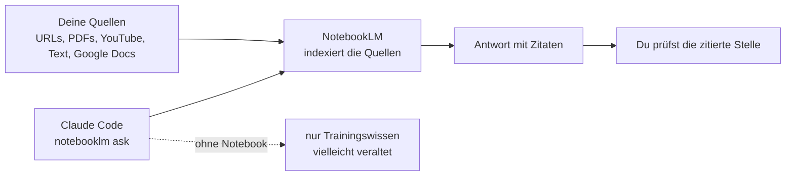

# S2.18 · RAG und NotebookLM: dem Agenten Baupläne geben

<!-- meta:start -->
> **Regal:** [MCP & Wissensquellen](README.md#mcp-knowledge) · **Stufe:** Kern · **~18 Min** · **Voraussetzungen:** [S2.14 MCP: der Integrationsstecker](s2-14-mcp-stecker.md)
>
> ← [S2.17 MCP-Sicherheit und ein eigener Server](s2-17-mcp-sicherheit.md) · [Bibliothek](README.md) · [S2.19 Grenzen von RAG und Datenschutz](s2-19-rag-grenzen.md) →
<!-- meta:end -->

## Schnellcheck

- Hast du schon einmal einer KI eine eigene Dokumentensammlung als Wissensquelle gegeben und danach die Zitate nachgeprüft?
- Kannst du ohne Nachschlagen sagen, bei welchen Fragen aus deinem Alltag Claudes Trainingswissen nicht reicht und du eine eigene Wissensquelle brauchst?

## Auf einen Blick

Claude kennt nur, was bis zu einem Stichtag in den Trainingsdaten stand, und deine internen Dokumente kennt Claude gar nicht. RAG (Retrieval-Augmented Generation) schließt diese Lücke: Vor der Antwort werden passende Stellen aus einer kuratierten Quellensammlung geholt, und die Antwort stützt sich auf dieses Material. NotebookLM von Google ist ein gehostetes RAG-System ohne eigene Infrastruktur: Du fügst Quellen hinzu, stellst eine Frage und bekommst eine Antwort mit Zitaten, die du nachprüfen kannst.

Alles, was du in NotebookLM lädst, liegt danach auf Google-Servern. Welche Quellen dorthin dürfen und wo RAG an Grenzen stößt, steht in [S2.19](s2-19-rag-grenzen.md).

## Bild im Kopf

Stell dir vor, du holst einen Sicherheitsberater ins Haus. Sagst du ihm nichts, arbeitet er mit allgemeinem Sicherheitswissen: vernünftiger Rat, der aber nicht zu deiner Türnummerierung, deinen Alarmzonen und deinen tatsächlichen Kabelwegen passt. Gibst du ihm die Grundrisse, euer aktuelles Format für Zutrittsprotokolle und die Vorfallhistorie, arbeitet er mit deinen echten Bauplänen. Genau das ist RAG: geprüftes, konkretes und aktuelles Wissen statt Verallgemeinerungen.



## Im Detail

### Das Problem: Stichtag und Nischenwissen

Claudes Trainingsdaten haben einen Stichtag. Fragst du nach einer Bibliothek, die letzten Monat erschienen ist, rät Claude vielleicht, erfindet plausibel aussehende, aber falsche API-Aufrufe oder räumt ein, es nicht sicher zu wissen.

Neben der Aktualität geht es um Spezialwissen: deine internen APIs, die Coding-Standards deiner Organisation, eure eigenen Architekturentscheidungen, das gesammelte Wissen deines Teams. Nichts davon steht in Claudes Trainingsdaten, und im offenen Internet steht es auch nicht.

RAG löst das: Statt sich nur auf Trainingswissen zu verlassen, bekommt Claude Zugriff auf eine gezielt zusammengestellte Wissensbasis. Steht eine Frage an, wird zuerst passender Inhalt aus deinen Quellen geholt; die Antwort stützt sich dann auf dieses Material.

### NotebookLM: RAG ohne eigene Infrastruktur

Ein RAG-System von Grund auf zu bauen heißt: Embedding-Modell, Vektordatenbank, eine Pipeline, die Texte in Abschnitte (Chunks) zerlegt, Suchlogik und Prompt-Engineering. Das ist ein echtes Engineering-Projekt.

Google NotebookLM ist ein gehostetes RAG-System, das du sofort nutzen kannst:

1. Du legst in NotebookLM ein Notebook an.
2. Du fügst Quellen hinzu: URLs, PDFs, YouTube-Videos, eingefügten Text, Google Docs.
3. NotebookLM indexiert alles und berechnet die Embeddings.
4. Du fragst es über die Web-Oberfläche oder eine Schnittstelle ab.

Der Unterschied zu einem Dokument, das du mit `@datei` in den Chat holst: `@datei` lädt die ganze Datei ungefiltert in den Kontext. NotebookLM sucht dagegen pro Frage die passenden Stellen aus allen Quellen heraus und zitiert sie. Nimm NotebookLM also, wenn du aus einer ganzen Quellensammlung gezielt die passenden Stellen samt Zitat brauchst.

> **Neuer Name:** Google führt NotebookLM inzwischen als **Gemini Notebook**; `notebooklm.google.com` leitet auf `notebook.google.com` weiter (Stand 2026-09-30). Dieses Kapitel bleibt beim alten Namen, weil die Kommandozeile und ihre Befehle ihn tragen.

**Kommandozeile und Workshop-Skill.** Die `notebooklm`-Befehle unten stammen aus `notebooklm-py`, laut PyPI einer inoffiziellen Bibliothek zur Automatisierung von Google NotebookLM (MIT-Lizenz, [github.com/teng-lin/notebooklm-py](https://github.com/teng-lin/notebooklm-py)); sie gehört weder zu Claude Code noch zu Google. Installiert wird sie mit `pip install notebooklm-py`, danach meldest du dich einmal mit `notebooklm login` an. Im Workshop kommt ein Skill `notebooklm` der Moderation dazu, der diese Kommandozeile aus Claude Code heraus aufruft; er zeigt, wie du RAG über einen eigenen Skill anbindest ([S2.2](s2-02-skill-schreiben.md)). Ein fremdes Werkzeug mit Zugriff auf dein Google-Konto prüfst du vorher wie ein Plugin ([S2.13](s2-13-plugin-lieferkette.md)). Fehlt die Kommandozeile, nutzt du die Web-Oberfläche von NotebookLM und holst die Ergebnisse per `@`-Datei in Claude Code (so wie in Schritt 5 der Übung unten).

**Zwei Schreibweisen.** `notebooklm <befehl>` ruft die Kommandozeile direkt auf: So tippst du es im Terminal, und so ruft ein Skill es über `Bash` auf. `/notebooklm <befehl>` startet den Skill aus einer Claude-Code-Sitzung; der Skill ruft intern dieselbe Kommandozeile auf. Dieses Kapitel nutzt die Kommandozeilen-Form.

### Der ganze Ablauf

Durch den ganzen Ablauf zieht sich ein Beispiel-Notebook, „Claude Code Docs", damit die Befehle zusammenpassen.

**Schritt 1: ein Notebook anlegen**

```bash
notebooklm create "Claude Code Docs"
```

Die ID des neuen Notebooks zeigt dir `notebooklm list` in der Spalte `ID`.

**Schritt 2: Quellen hinzufügen**

```bash
notebooklm use <notebook-id>
notebooklm source add https://code.claude.com/docs/en/overview
notebooklm source add https://code.claude.com/docs/en/hooks
notebooklm source add https://code.claude.com/docs/en/skills
# Also accepts PDFs, internal docs, YouTube tutorial transcripts
```

`notebooklm use` macht das Notebook zum aktuellen; die folgenden Befehle beziehen sich dann darauf.

**Schritt 3: aus Claude Code abfragen**

```bash
notebooklm ask "What is the correct format for hook configuration in settings.json?"
```

NotebookLM antwortet mit Zitaten, die auf konkrete Stellen in deinen Quellen zeigen. So kannst du jede Aussage nachprüfen. Fehlerfrei wird die Antwort dadurch nicht: Auch mit Zitat kann eine Stelle falsch wiedergegeben sein ([S2.19](s2-19-rag-grenzen.md)).

### Wofür sich ein Notebook lohnt

- **Interne Dokumentation:** die Confluence-Seiten deines Teams, Architecture Decision Records, Runbooks. Claude kann dann „Wie machen wir Datenbank-Migrationen in diesem Projekt?" mit eurem tatsächlich dokumentierten Ablauf beantworten.
- **Aktuelle API-Dokumentation:** die neueste API-Doku einer Bibliothek. Claude antwortet mit aktueller Syntax statt mit möglicherweise veraltetem Trainingswissen.
- **Recherche-Sammlungen:** Papers, Artikel und Blogposts zu einem Thema. Claude fasst zusammen, vergleicht Ansätze und findet Lücken.
- **Kuratierte Best Practices:** ein Notebook „So machen wir das hier" mit Coding-Standards, Review-Checkliste und Deployment-Checkliste. Claude folgt euren echten Standards statt allgemeinen Ratschlägen.
- **Vorschriften und Compliance:** die Regelwerke, unter denen deine Branche arbeitet. Claudes Compliance-Hinweise zitieren dann euren tatsächlichen Vorschriftentext.

## Vorführen

### Demo: NotebookLM als Wissensbasis

**Ziel:** Zeigen, dass Claude Fragen aus einer bestimmten, nachprüfbaren Wissensquelle beantworten kann statt aus Trainingswissen, und dass das bei Fachfragen das Risiko von Halluzinationen senkt.

**Vorbereitung**

- Die Kommandozeile `notebooklm` ist installiert und angemeldet; für `/notebooklm …` zusätzlich der Skill der Moderation (`~/.claude/skills/notebooklm/`).
- Ein Notebook mit ein paar Quellen ist schon angelegt. Mach das vor der Session: Anlegen und Indexieren dauern ein paar Minuten.
- Vorschlag: ein Notebook mit der Claude-Code-Doku oder mit eurer eigenen Projektdoku.

**Schritt 1: das Problem erklären**

Erklär, dass Claudes Trainingsdaten einen Stichtag haben und Claude bei neuen APIs, internen Werkzeugen oder Nischenthemen falsch raten kann.

**Schritt 2: den Notebook-Ablauf zeigen**

Zeig das vorbereitete Notebook:

```
notebooklm list --json
```

Oder mit dem Skill:

```
/notebooklm navigate
```

Zeig den Namen des Notebooks und wie viele Quellen es hat.

**Schritt 3: das Notebook abfragen**

In Claude Code:

```
notebooklm use <notebook-id>
notebooklm ask "What is the correct JSON structure for a PreToolUse hook in settings.json?"
```

Sieh dir die Antwort an und zeig darauf:

- Die Antwort enthält **Zitate**: Du siehst, aus welcher Quellseite sie stammt.
- Die Antwort ist konkret, nicht allgemein.
- Du kannst jede Aussage an der zitierten Stelle nachprüfen. Das senkt das Risiko von Halluzinationen, schließt sie aber nicht aus ([S2.19](s2-19-rag-grenzen.md)).

Frag dann etwas, womit Claude sich sonst schwertut:

```
notebooklm ask "What are the valid matcher patterns for hooks, and what tool names can I match against?"
```

**Schritt 4: der Gegenversuch**

Stell dieselbe Frage OHNE Notebook, in einem frischen Kontext:

```
(new context) What are the valid matcher patterns for hooks in Claude Code settings.json?
```

Claude gibt eine plausibel klingende Antwort, die aber veraltet, unvollständig oder leicht falsch sein kann. Die geprüfte Regel, wann ein Matcher als exakter Name und wann als Regex gilt, steht in [S2.8](s2-08-hook-einrichten.md); daran kannst du beide Antworten live messen.

<details><summary>Für Moderierende</summary>

**Dauer:** etwa 7 Minuten (Schritt 1: 1 Min., Schritt 2: 2 Min., Schritt 3: 3 Min., Schritt 4: 1 Min.).

**Einstieg:** „RAG heißt: Claude liest deine Doku, bevor es antwortet. Wichtig: Die Daten gehen zu Google. Für sensibles Material gibt es lokale RAG-Alternativen."

**Sagen:**

- Schritt 1: „Claudes Trainingsdaten haben einen Stichtag. Bei neuen APIs, internen Werkzeugen oder Nischenthemen rät Claude vielleicht falsch. Ich zeige euch, wie ihr Claude eine geprüfte Wissensquelle gebt."
- Schritt 2: „Ich habe schon ein Notebook angelegt und Quellen hinzugefügt. So sieht das aus."
- Schritt 3: „Das ist eine genaue, spezifische Frage. Ohne Notebook würde Claude aus allgemeinem Trainingswissen antworten, das falsch sein kann, oder Unsicherheit einräumen. Mit Notebook wird die echte Dokumentation durchsucht, und du bekommst die Antwort mit Zitat."
- Schritt 4: „Gleiche Frage, andere Qualität. Das ist der Unterschied zwischen allgemeinem Sicherheitswissen und euren echten Bauplänen."

**Sprechpunkte:**

- „RAG heißt: Claude bekommt eure echten Baupläne statt allgemeinen Wissens."
- „NotebookLM ist ein gehostetes RAG-System: keine ML-Infrastruktur nötig, es läuft sofort."
- „Die Antworten kommen mit Zitaten: nachprüfbar statt geraten."
- „Einsatzfälle: interne Doku, aktuelle API-Doku, Compliance-Texte, das gesammelte Wissen eures Teams."
- „Das Muster, das trägt: herausfinden, was Claude wissen muss und nicht aus dem Training kennt, ein Notebook dafür bauen und Claude anweisen, dort zuerst nachzusehen."

**Wenn der Skill nicht eingerichtet ist:** Zeig das Prinzip in der Web-Oberfläche.

- Öffne `notebooklm.google.com` (leitet inzwischen auf `notebook.google.com` weiter).
- Zeig ein vorhandenes Notebook mit Quellen.
- Stell eine Frage im Chat der Web-Oberfläche.
- Sag: „Der Skill verpackt dieselbe Schnittstelle, damit ihr aus dem Terminal fragen könnt. In der Übung baut ihr eure eigene Wissensbasis."

**Wenn die Ausgabe unter Windows kaputtgeht:** siehe „Typische Fallen".

</details>

## Selbst machen

### Übung: deine eigene Wissensbasis

**Ziel:** Ein NotebookLM-Notebook für ein Fachgebiet aus deiner Arbeit anlegen, echte Quellen hinzufügen, es aus Claude Code heraus nutzen und den Unterschied zwischen „allgemeinem Wissen" und „deinen geprüften Quellen" selbst erleben.

**Hintergrund:** Jede erfahrene Fachkraft hat Wissen gesammelt, das nicht im offenen Internet steht: die Abläufe der eigenen Organisation, die Eigenheiten der eigenen Produktlinie, die eigene Erfahrung aus der Fehlersuche. Fragst du Claude nach deiner Zutrittskontroll-Produktlinie, deinem proprietären Protokoll oder den Installationsstandards deines Kunden, rät Claude. Claude weiß es nicht. Diese Übung zeigt, wie du das änderst.

> **Vor dem Hochladen:** Alles, was du in NotebookLM lädst, liegt danach auf Google-Servern. Nimm für diese Übung nur Material, das dorthin darf ([S2.19](s2-19-rag-grenzen.md)).

**Schritt 1: dein Wissensgebiet wählen**

Wähl ein Gebiet, in dem du dir oft wünschst, Claude wüsste mehr. Zum Beispiel:

- eine bestimmte Zutrittskontroll-Produktlinie (OSDP-Protokoll, bestimmte Zentralen-Modelle)
- die Sicherheitsstandards oder Installationsrichtlinien deiner Organisation
- ein Regelwerk, das deine Projekte einhalten müssen
- eine Technik aus deinem Alltag, die sich zuletzt geändert hat (Firmware, APIs)
- dein gesammeltes Wissen zur Fehlersuche bei einem bestimmten Systemtyp

**Schritt 2: ein NotebookLM-Notebook anlegen**

1. Öffne `notebooklm.google.com` (leitet inzwischen auf `notebook.google.com` weiter).
2. Leg ein neues Notebook an.
3. Gib ihm einen genauen Namen, etwa „OSDP Protocol Reference" oder „EN 50132 Standard Notes".

**Schritt 3: mindestens 3 Quellen hinzufügen**

Wähl Quellen, die echtes, konkretes Wissen für dein Gebiet enthalten. Gute Quellenarten:

- Produktdokumentation als PDF
- Seiten offizieller Normen oder Vorschriften
- URLs technischer Spezifikationen
- deine eigene Dokumentation (als Text eingefügt)
- YouTube-Tutorials zu deiner Technik

In der Web-Oberfläche wählst du „Add sources" und lädst hoch, fügst ein oder verlinkst.

Warte, bis NotebookLM die Quellen verarbeitet hat. Bei URLs dauert das meist ein paar Minuten, bei PDFs länger.

**Schritt 4: zuerst OHNE Notebook fragen**

Öffne Claude Code in einem frischen Kontext und stell eine konkrete Frage aus deinem Gebiet, für die man das Wissen aus deinen Quellen braucht:

```
[Ask a specific technical question about your domain]
```

Achte auf die Qualität der Antwort:

- Ist sie wirklich spezifisch für dein Gebiet?
- Nutzt sie die richtigen Fachbegriffe?
- Nennt sie die richtigen Normen oder Spezifikationen?
- Klingt sie sicher, wo sie unsicher sein müsste?

Schreib die Antwort auf, oder wenigstens deine Einschätzung ihrer Qualität.

**Schritt 5: MIT Notebook fragen**

Jetzt holst du dir mit NotebookLM eine Antwort, die auf deinen Quellen beruht:

1. Stell dieselbe Frage im Chat der NotebookLM-Web-Oberfläche.
2. Kopier die Antwort samt Quellenangaben in eine Datei: `research-notes.md`.
3. Hol diesen Kontext in Claude Code und frag noch einmal:

<!-- cockpit:example -->
```
@research-notes.md [same question you asked above]
```

Vergleich die Antworten:

- Ist die zweite Antwort spezifischer?
- Zitiert sie deine echten Quellen?
- Stimmen die Details besser?
- Räumt sie Unsicherheit ein, wo die erste falsch sicher war?

**Schritt 6: 2–3 weitere Fragen stellen**

Taste dich an die Grenzen dessen heran, was dein Notebook weiß:

- Frag etwas, das deine Quellen klar abdecken.
- Frag etwas am Rand dessen, was deine Quellen abdecken.
- Frag etwas, das deine Quellen sicher nicht abdecken.

Achte darauf, wie NotebookLM mit dem dritten Fall umgeht: Es sollte sagen, dass es nicht genug Informationen hat, statt etwas zu erfinden.

**Schritt 7: nachdenken und planen**

Beantworte diese Fragen, wenn Zeit ist auch in der Gruppe:

1. Welche Wissensbasis wäre für deinen Arbeitsalltag am wertvollsten?
2. Welche Quellen kämen hinein?
3. Wie würde es deine Arbeit mit Claude Code verändern, dieses Notebook abzufragen?
4. Was hält dich davon ab, sie heute zu bauen?

**Geschafft, wenn:**

- [ ] ein NotebookLM-Notebook mit dem Namen deines Gebiets existiert
- [ ] mindestens 3 Quellen hinzugefügt und verarbeitet sind
- [ ] du dieselbe Frage mit und ohne Notebook gestellt hast
- [ ] dir ein Unterschied in Qualität oder Genauigkeit der Antworten aufgefallen ist
- [ ] du mindestens eine wertvolle Wissensbasis benannt hast, die du bauen willst

**Tipps**

- **Mit dem Workshop-Skill:** Du kannst auch `/notebooklm create`, `notebooklm source add` und `notebooklm ask` direkt aus Claude Code nutzen.
- **Wenn die Quellen zu lange brauchen:** Nimm weniger Quellen (2 reichen) und mach weiter. Quellen werden im Hintergrund indexiert; du kannst später weitere hinzufügen.
- **Qualität schlägt Menge:** Eine gut gegliederte PDF-Spezifikation ist mehr wert als zehn allgemeine Blogposts. Nimm maßgebliche Quellen statt vieler.
- **Claude Code zum Notebook lenken:** Soll Claude Code das Notebook von selbst befragen, schreibst du das als Anweisung in deine CLAUDE.md ([S1.10](s1-10-claude-md.md)) oder in einen Skill ([S2.2](s2-02-skill-schreiben.md)). Damit legst du fest, welche Fragen zu NotebookLM gehen. Sei genau: „Bei jeder Frage zum OSDP-Protokoll zuerst im Notebook nachsehen."
- **Weiter ausbauen:** Nach dem Workshop kannst du den Notebook-Check in die Auslöser-Phrasen eines Skills aufnehmen, ein wöchentlich aktualisiertes Notebook für eine Technik bauen, die sich schnell ändert, oder ein gemeinsames Team-Notebook für euer gesammeltes Wissen anlegen.

### Extra: OSDP Cop, Frame-Forensik gegen die echte Spezifikation (etwa 25 Minuten, mittel)

**Ziel:** Den Unterschied zwischen einer erfundenen und einer *belegten* Antwort spüren, an echten Frame-Bytes.

**Analogie:** Entscheiden nach den Bauplänen, nicht aus dem Bauch (NotebookLM = Baupläne).

1. Leg ein Notebook „OSDP Frame Reference" an (`/notebooklm create` oder Web-Oberfläche), mit 2–3 Quellen zum OSDP-Frame-Format (SOM `0x53`, ADDR, LEN, CRC, passend zu `osdp_frame_decoder.c` im `workshop-playground/`).
2. **Ohne** Notebook fragen: `What does the first byte 0x53 mean in an OSDP frame, and where is the CRC?` Notier die Antwort.
3. **Mit** Notebook dieselbe Frage stellen. Vergleich die zitierte Antwort mit der Bauchantwort: Lag der Bauch richtig?
4. Forensik: Füg einen Hex-Frame ein (etwa aus der `main()` des Decoders) und frag: `Is this frame valid per the spec? Where's the length check the C code forgets?`
5. Brücke: Diese fehlende Längenprüfung **ist** der Buffer Overflow V1 in `osdp_frame_decoder.c`. RAG hat die Sicherheitslücke direkt aus der Spezifikation erklärt.

## Typische Fallen

- **`notebooklm …` wird nicht erkannt.** Die Kommandozeile ist nicht installiert (`pip install notebooklm-py`, dann `notebooklm login`). Oder nimm die Web-Oberfläche und hol die Antwort per `@research-notes.md` in Claude Code (Schritt 5 der Übung).
- **Die Ausgabe der Kommandozeile ist unter Windows zerschossen.** Führ die Befehle, wo es geht, mit `--json` erneut aus (`notebooklm list --json`, `notebooklm create "Claude Code Documentation" --json`). Die JSON-Ausgabe umgeht Darstellungsfehler von cp1252 und der Rich-Konsole unter Windows.
- **Eine Antwort mit Zitat für bewiesen halten.** Das Zitat zeigt, woher eine Aussage stammen soll, nicht, dass sie richtig wiedergegeben ist. Wie du prüfst, steht in [S2.19](s2-19-rag-grenzen.md).

## Check

Du kannst ein Notebook mit eigenen Quellen anlegen, es aus Claude Code heraus abfragen und am Vergleich mit einer Antwort ohne Notebook zeigen, was die Zitate bringen.

1. Welche zwei Lücken in Claudes Wissen schließt RAG?
2. Wann nimmst du NotebookLM, statt ein großes Dokument einfach in den Chat zu holen?
3. Wie bringst du eine NotebookLM-Antwort in Claude Code, wenn die Kommandozeile fehlt?

<details><summary>Quizfrage</summary>

**Frage:** Was unterscheidet eine Abfrage über NotebookLM davon, ein Dokument mit `@datei` direkt in Claudes Kontext zu holen?

- **Richtig:** NotebookLM sucht pro Frage die passenden Stellen aus allen Quellen und zitiert sie; `@datei` lädt die ganze Datei ungefiltert in den Kontext.
- Falsch: Fachlich gar nichts: Beide liefern denselben Inhalt mit denselben Zitaten, nur einmal im Terminal und einmal im Browser.
- Falsch: NotebookLM nimmt nur Google Docs und PDFs an; für Textdateien und Code bleibt dir deshalb nur der Weg über `@datei`.
- Falsch: Nur das Tempo: NotebookLM hält die Datei vorab zwischengespeichert, deshalb muss Claude sie nicht bei jeder neuen Frage wieder komplett einlesen.

</details>

## Weiterlesen

- [Gemini-Notebook-Hilfe (früher NotebookLM): Überblick](https://support.google.com/notebooklm/answer/16164461)
- [Gemini-Notebook-Hilfe: Quellen hinzufügen](https://support.google.com/notebooklm/answer/16215270)
- [Claude Code: Dateien und Ordner mit @ einbinden](https://code.claude.com/docs/en/common-workflows#reference-files-and-directories)
- [Claude Code: CLAUDE.md und Gedächtnis](https://code.claude.com/docs/en/memory)
- [Claude Code: Skills](https://code.claude.com/docs/en/skills)
- [S2.19 · Grenzen von RAG und Datenschutz](s2-19-rag-grenzen.md)
- [S2.14 · MCP: der Integrationsstecker](s2-14-mcp-stecker.md)
- [S2.17 · MCP-Sicherheit und ein eigener Server](s2-17-mcp-sicherheit.md)
- [S1.10 · CLAUDE.md: die Hausordnung des Projekts](s1-10-claude-md.md)
- [S2.2 · Eine SKILL.md schreiben](s2-02-skill-schreiben.md)
- [S2.20 · Praxis-Station Session 2: eine Übung wählen](s2-20-praxis-station-2.md)
