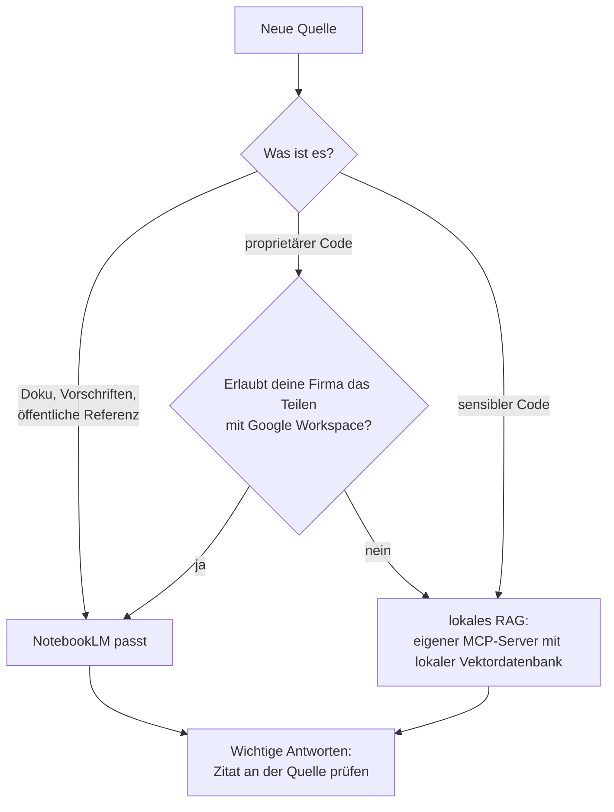

# S2.19 · Grenzen von RAG und Datenschutz

<!-- meta:start -->
> **Regal:** [MCP & Wissensquellen](README.md#mcp-knowledge) · **Stufe:** Vertiefung · **~10 Min** · **Voraussetzungen:** [S2.18 RAG und NotebookLM: dem Agenten Baupläne geben](s2-18-rag-und-notebooklm.md)
>
> ← [S2.18 RAG und NotebookLM: dem Agenten Baupläne geben](s2-18-rag-und-notebooklm.md) · [Bibliothek](README.md) · [S2.20 Praxis-Station Session 2: eine Übung wählen](s2-20-praxis-station-2.md) →
<!-- meta:end -->

## Schnellcheck

- Kannst du ohne Nachschlagen sagen, welches Material du nicht in NotebookLM hochladen würdest und was du stattdessen nimmst?
- Hast du bei einer RAG-Antwort schon einmal die zitierte Stelle geöffnet und mit der Wiedergabe verglichen?

## Auf einen Blick

Alles, was du in NotebookLM lädst, ob URL, PDF, eingefügter Text oder Code, liegt danach auf Google-Servern und wird dort indexiert. Proprietären Quellcode gibst du nur hinein, wenn deine Firma das Teilen mit Google Workspace erlaubt; für sensiblen Code nimmst du ein lokales RAG. Und auch mit den richtigen Quellen kann RAG danebenliegen: Ein Zitat ist ein Prüfpunkt, kein Beweis.

## Bild im Kopf

Wer einem externen Berater die Baupläne gibt, gibt sie aus der Hand. Den Fluchtwegplan aus dem Treppenhaus darf jeder sehen; den Plan der Alarmzonen und Kabelwege im Tresorbereich gibst du nur mit Freigabe heraus. Dieselbe Abwägung triffst du bei jeder Quelle für NotebookLM: Sie verlässt deinen Perimeter.

Und selbst mit den richtigen Plänen kann der Berater die falsche Seite aufschlagen oder eine richtige Seite falsch wiedergeben. Deshalb schlägst du bei wichtigen Aussagen die zitierte Seite selbst nach.



## Im Detail

### Wohin deine Quellen gehen

NotebookLM wird von Google betrieben. Jede Quelle, die du einem Notebook hinzufügst (URLs, PDFs, eingefügter Text, Code-Schnipsel), wird auf Google-Server hochgeladen und von Googles Embedding-Pipeline indexiert. Welche Regeln gelten, hängt von deinem Konto ab. Google beschreibt das in seiner Hilfe (Stand 2026-09-30, dort unter dem neuen Namen Gemini Notebook):

- **Privates Konto:** Es gelten die allgemeinen Google-Nutzungsbedingungen und die Google-Datenschutzerklärung. Deine Inhalte trainieren Googles Basismodelle laut Google nicht direkt, außer du gibst Feedback. Klickst du Daumen hoch oder runter, sammelt Google die zugehörigen Inhalte samt Quellen und Uploads; geschulte Teams sehen sie sich an, und sie bleiben bis zu drei Jahre gespeichert, getrennt von deinem Konto.
- **Arbeits- oder Schulkonto (Workspace):** Wie deine Daten behandelt werden, hängt laut Google von eurer Lizenz ab. Für Arbeitskonten gelten die Google-Cloud-Bedingungen, wenn Gemini Notebook in eurer Edition ein Kerndienst oder ein Add-on ist, sonst die allgemeinen Google-Bedingungen; für Schulkonten gelten die Bedingungen von Workspace for Education. Mit dem Unternehmensschutz sehen sich keine Menschen deine Uploads, Fragen und Antworten an, auch nicht bei Feedback, und nichts davon trainiert KI-Modelle. Welche Edition ihr habt, weiß eure Workspace-Verwaltung.

### Welche Quelle wohin

Für Projekte mit Quellcode heißt das:

- Gib **proprietären Quellcode** nicht in ein NotebookLM-Notebook, außer deine Firma erlaubt das Teilen mit Google Workspace.
- Für **sensiblen Code** nimmst du ein lokales RAG, zum Beispiel einen eigenen MCP-Server mit lokaler Vektordatenbank. Wie du einen eigenen MCP-Server baust, steht in [S2.17](s2-17-mcp-sicherheit.md).
- Für **Dokumentation, Vorschriften und öffentliche Referenzen** passt NotebookLM.

Dieselbe Frage, welche Daten wohin fließen, stellt sich auch bei Claude Code selbst und bei anderen Modellanbietern: [S3.11](s3-11-datenschutz-und-compliance.md) und [S4.2](s4-02-codex-schwarm.md).

### Das Muster, das trägt, und was es nicht ist

Baust du mit Claude Code etwas Nichttriviales, stößt du irgendwann an die Grenzen des allgemeinen Wissens. Das Muster, das trägt:

1. Finde heraus, was Claude wissen muss und nicht aus dem Training kennt.
2. Bau ein Notebook mit diesen Quellen.
3. Richte Claude Code so ein, dass bei Fragen aus diesem Gebiet zuerst das Notebook befragt wird ([S2.18](s2-18-rag-und-notebooklm.md)).

So stützen sich Claudes Antworten auf **deine tatsächliche Dokumentation**: Claude zitiert konkrete Quellen, du kannst sie prüfen, und bei Fragen zu deinem Stack gibt es weniger Halluzinationen. Ein „Expertise-Upgrade" im Sinne von Deep Learning ist das nicht. Es ist **Dokumentensuche plus Zitat**, mit allen Grenzen, die dazugehören.

### Fünf bekannte Fehlerarten

NotebookLM hat, wie jedes RAG-System, bekannte Schwachstellen:

- **Chunk-Grenzen:** Eine relevante Antwort ist auf zwei Abschnitte (Chunks) verteilt, und die Suche findet nur einen davon.
- **Embedding-Drift:** Wächst die Quellensammlung, verschieben sich die relevantesten Chunks auf überraschende Weise.
- **Zitat-Halluzination:** Das Modell zitiert eine echte Quelle, gibt sie aber falsch wieder. Klick dich deshalb immer bis zur Stelle durch.
- **Veralteter Index:** Eine neue Quelle ist erst abfragbar, wenn die Indexierung fertig ist; das kann Minuten dauern.
- **Rang-Fehler bei der Suche:** Eine wichtige Quelle landet weit unten und ist nicht unter den Top-K-Chunks, die in die Antwort eingehen.

### Zitate prüfen

Bei Antworten, bei denen viel auf dem Spiel steht, lässt du dir **immer** die konkrete Quellstelle nennen und prüfst sie selbst. In NotebookLM wählst du dazu ein Zitat aus: Es springt direkt zur zitierten Stelle, und du liest sie im Zusammenhang.

Arbeitest du in Claude Code mit einer Datei wie `research-notes.md` aus [S2.18](s2-18-rag-und-notebooklm.md), schreibst du die Pflicht zum Zitat gleich in den Auftrag:

<!-- cockpit:example -->
```text
@research-notes.md Beantworte meine Frage nur aus dieser Datei. Nenne zu jeder Aussage die Quellseite, die dort zitiert ist. Steht die Antwort nicht drin, sag das.
```

Dann öffnest du stichprobenartig die genannten Stellen und vergleichst sie mit der Wiedergabe.

## Typische Fallen

- **Eine Antwort mit Zitat für richtig halten.** Das Zitat zeigt, woher eine Aussage stammen soll. Die Wiedergabe kann trotzdem falsch sein. Öffne die Stelle.
- **Feedback zu vertraulichen Quellen geben.** Mit einem privaten Konto sammelt Google beim Feedback die zugehörigen Inhalte samt Quellen, und Menschen sehen sie sich an. Google bittet selbst darum, keine vertraulichen oder sensiblen Informationen ins Feedback zu packen.
- **Dokumente ohne Rechte hochladen.** Google bittet, keine Dokumente hochzuladen, an denen du keine Rechte hast. Prüf das bei gekauften Normtexten, bevor du sie als Quelle nimmst.

## Check

Du kannst für eine Quelle begründen, ob sie in ein gehostetes RAG wie NotebookLM darf oder in ein lokales RAG gehört, und du prüfst wichtige Zitate an der Quelle nach.

1. Wo liegen deine Quellen, nachdem du sie in NotebookLM geladen hast, und was folgt daraus für proprietären Code?
2. Nenne drei Fehlerarten von RAG.
3. Warum ist eine Antwort mit Zitat nicht automatisch richtig, und was tust du dagegen?

<details><summary>Quizfrage</summary>

**Frage:** Ein Team will NotebookLM nutzen, damit Claude die interne Firmware eurer Alarmzentralen besser versteht. Was entscheidet, ob der Firmware-Code als Quelle hinein darf?

- **Richtig:** Ob eure Firma das Teilen dieses Codes mit Google Workspace erlaubt, denn jede Quelle wird auf Google-Servern gespeichert und indexiert.
- Falsch: Ob die Dateien unter der Größengrenze für Quellen bleiben, denn kleine Dateien verarbeitet NotebookLM lokal auf deinem Rechner.
- Falsch: Nichts weiter, denn NotebookLM speichert nur die Embeddings und nicht den Originaltext, also verlässt kein lesbarer Code euer Firmennetz.
- Falsch: Ob ihr die Web-Oberfläche statt der Kommandozeile nutzt, denn nur Uploads über die Kommandozeile landen auf Google-Servern.

</details>

## Weiterlesen

- [Gemini-Notebook-Hilfe (früher NotebookLM): Datenschutz und Nutzungsbedingungen](https://support.google.com/notebooklm/answer/17004255)
- [Gemini-Notebook-Hilfe: mit einem Arbeits- oder Schulkonto](https://support.google.com/notebooklm/answer/16337734)
- [Gemini-Notebook-Hilfe: Chat und Zitate](https://support.google.com/notebooklm/answer/16179559)
- [Claude Code: MCP](https://code.claude.com/docs/en/mcp)
- [S2.18 · RAG und NotebookLM: dem Agenten Baupläne geben](s2-18-rag-und-notebooklm.md)
- [S2.17 · MCP-Sicherheit und ein eigener Server](s2-17-mcp-sicherheit.md)
- [S3.11 · Datenschutz, Aufbewahrung und regulierte Branchen](s3-11-datenschutz-und-compliance.md)
- [S4.2 · Codex-Schwarm und die Datenfluss-Grenze](s4-02-codex-schwarm.md)
