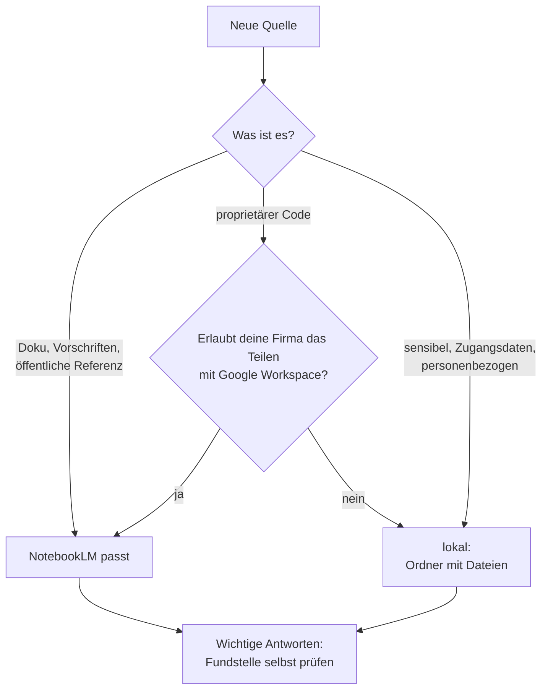

# S2.19 · Grenzen von RAG und Datenschutz

<!-- meta:start -->
> **Regal:** [MCP & Wissensquellen](README.md#mcp-knowledge) · **Stufe:** Vertiefung · **~20 Min** · **Voraussetzungen:** [S2.18 RAG und NotebookLM: dem Agenten Baupläne geben](s2-18-rag-und-notebooklm.md)
>
> ← [S2.18 RAG und NotebookLM: dem Agenten Baupläne geben](s2-18-rag-und-notebooklm.md) · [Bibliothek](README.md) · [S2.20 Praxis-Station Session 2: alles in einem Ablauf](s2-20-praxis-station-2.md) →
<!-- meta:end -->

## Schnellcheck

- Kannst du ohne Nachschlagen sagen, welches Material du nicht in NotebookLM hochladen würdest und was du stattdessen nimmst?
- Hast du bei einer Antwort mit Quellenangabe schon einmal die zitierte Stelle geöffnet und mit der Wiedergabe verglichen?

## Auf einen Blick

Alles, was du in NotebookLM lädst, ob URL, PDF, eingefügter Text oder Code, liegt danach auf Google-Servern und wird dort indexiert. Proprietären Quellcode gibst du nur hinein, wenn deine Firma das Teilen mit Google Workspace erlaubt; für sensiblen Code nimmst du eine lokale Wissensbasis, zum Beispiel einen Ordner mit Dateien wie in [S2.18](s2-18-rag-und-notebooklm.md). Und auch mit den richtigen Quellen kann eine Antwort danebenliegen: Eine Quellenangabe ist ein Prüfpunkt, kein Beweis.

## Bild im Kopf

Wer einer externen Beraterin Unterlagen gibt, gibt sie aus der Hand. Den Fluchtwegplan aus dem Treppenhaus darf jeder sehen; die Zugangsdaten zum Serverraum gibst du nicht heraus. Dieselbe Abwägung triffst du bei jeder Quelle für NotebookLM: Sie verlässt deinen Rechner.

Und selbst mit den richtigen Unterlagen kann die Beraterin die falsche Seite aufschlagen oder eine richtige Seite falsch wiedergeben. Liegen zwei Fassungen desselben Handbuchs im Ordner, zitiert sie womöglich die veraltete. Deshalb schlägst du bei wichtigen Aussagen die zitierte Seite selbst nach.



## Im Detail

### Wohin deine Quellen gehen

NotebookLM wird von Google betrieben. Jede Quelle, die du einem Notebook hinzufügst, wird auf Google-Server hochgeladen und dort indexiert. Welche Regeln gelten, hängt von deinem Konto ab. Google beschreibt das in seiner Hilfe (Stand 2026-09-30, dort unter dem neuen Namen Gemini Notebook):

- **Privates Konto:** Es gelten die allgemeinen Google-Nutzungsbedingungen und die Google-Datenschutzerklärung. Deine Inhalte trainieren Googles Basismodelle laut Google nicht direkt, außer du gibst Feedback: Dann sammelt Google die zugehörigen Inhalte samt Quellen, und Menschen sehen sie sich an.
- **Arbeits- oder Schulkonto (Workspace):** Wie deine Daten behandelt werden, hängt laut Google von eurer Lizenz ab. Welche Edition ihr habt, weiß eure Workspace-Verwaltung.

Als Faustregel reicht: Alles liegt bei Google, und die Vorgaben deiner Firma gelten. Lies bei Bedarf die verlinkten Google-Seiten; die Einzelheiten ändern sich.

### Welche Quelle wohin

- Gib **proprietären Quellcode** nicht in ein NotebookLM-Notebook, außer deine Firma erlaubt das Teilen mit Google Workspace.
- **Zugangsdaten, Kundenlisten und andere sensible Daten** gehören in keine Wissensbasis, die du extern betreibst.
- **Gekaufte Normtexte** prüfst du vorher auf die Rechte: Google bittet, keine Dokumente hochzuladen, an denen du keine Rechte hast.
- Für **sensiblen Code und alles, was lokal bleiben muss,** nimmst du die einfachste lokale Wissensbasis: einen Ordner mit Dateien, den Claude Code selbst durchsucht und liest ([S2.18](s2-18-rag-und-notebooklm.md)). Wächst der Bedarf, baust du ein Suchwerkzeug als eigenen MCP-Server ([S2.17](s2-17-mcp-sicherheit.md)).
- Für **Dokumentation, Vorschriften und öffentliche Referenzen** passt NotebookLM.

Dieselbe Frage, welche Daten wohin fließen, stellt sich auch bei Claude Code selbst und bei anderen Modellanbietern: [S3.11](s3-11-datenschutz-und-compliance.md) und [S4.2](s4-02-codex-schwarm.md).

### Das Muster, das trägt, und was es nicht ist

Baust du mit Claude Code etwas Nichttriviales, stößt du irgendwann an die Grenzen des allgemeinen Wissens. Das Muster, das trägt: Finde heraus, was Claude wissen muss und nicht aus dem Training kennt, bau eine Wissensbasis aus diesen Quellen und richte Claude Code so ein, dass bei Fragen aus diesem Gebiet zuerst dort nachgesehen wird ([S2.18](s2-18-rag-und-notebooklm.md)).

So stützen sich Claudes Antworten auf **deine tatsächliche Dokumentation**: Claude nennt konkrete Quellen, du kannst sie prüfen, und bei Fragen zu deinem Stack gibt es weniger Halluzinationen. Ein „Expertise-Upgrade“ im Sinne von Deep Learning ist das nicht. Es ist **Dokumentensuche plus Quellenangabe**, mit allen Grenzen, die dazugehören.

### Drei Fehlerbilder

Die folgenden Fehlerbilder sind allgemeine Erfahrungen mit RAG-Systemen, keine Aussagen aus Googles Hilfe:

- **Die falsche Stelle wird gefunden.** Die Antwort steckt auf zwei Seiten, und die Suche findet nur eine, oder eine wichtige Quelle landet gar nicht unter den Treffern. *Erkennen:* Die Antwort wirkt unvollständig oder passt nicht zu deiner Frage. *Dagegen:* anders fragen, die Quelle nennen, die du meinst.
- **Die richtige Stelle wird falsch wiedergegeben.** Die Quellenangabe stimmt, die Zusammenfassung nicht. *Erkennen:* Du öffnest die Stelle und liest etwas anderes. *Dagegen:* Fundstelle selbst lesen, bei wichtigen Aussagen immer.
- **Die Quelle selbst ist falsch oder veraltet.** Zwei Fassungen widersprechen sich, oder die Quelle ist überholt. Claude kann das nicht entscheiden, weil beide Quellen dort stehen. *Erkennen:* Eine Frage liefert zwei verschiedene Werte aus zwei Dateien. *Dagegen:* veraltete Quellen aus der Wissensbasis nehmen, Datum und Version in die Dateien schreiben.

Bei einem gehosteten Index kommt hinzu: Eine neue Quelle ist erst abfragbar, wenn die Indexierung fertig ist.

### Zitate prüfen

Bei Antworten, bei denen viel auf dem Spiel steht, lässt du dir die konkrete Quellstelle nennen und prüfst sie selbst. Bei allem anderen reichen Stichproben: Öffne ab und zu eine Fundstelle und vergleiche sie mit der Wiedergabe. In NotebookLM springt ein Klick auf das Zitat direkt zur Stelle. In Claude Code schreibst du die Pflicht zur Quellenangabe in den Auftrag:

```text
Answer only from the files in kb/. Name the file and quote the line for every claim. If the answer is not there, say so.
```

## Selbst machen

### Übung: Quellen sortieren und eine Fundstelle prüfen (etwa 10 Minuten)

**Ziel:** Du sortierst acht Quellen nach ihrem Weg und prüfst an einem Beispiel, dass eine Quellenangabe nicht beweist, dass die Quelle stimmt.

**Startzustand:** Teil A braucht nur Papier. Teil B braucht den Ordner `~/cc-workshop/wissen` mit den drei Dateien in `kb/` aus [S2.18](s2-18-rag-und-notebooklm.md); hast du ihn gelöscht, legst du ihn nach S2.18, Schritt 1 neu an. Teil B braucht kein Konto.

**Teil A: sortieren.** Ordne jede Quelle einem von drei Wegen zu: **gehostet** (NotebookLM passt), **nur mit Freigabe** (Firma oder Rechteinhaber muss zustimmen) oder **lokal** (bleibt auf deinem Rechner).

1. Die Doku einer öffentlichen Open-Source-Bibliothek als URL.
2. Eine Liste eurer internen Architekturentscheidungen.
3. Proprietärer Quellcode eures Produkts.
4. Eine Tabelle mit Kundennamen und Adressen.
5. Ein gekaufter Normtext als PDF.
6. Eure eigenen Notizen zu einer öffentlichen Spezifikation.
7. Eine Konfigurationsdatei mit Zugangsdaten.
8. Ein Gesetzestext von der Website der Behörde.

<details><summary>Vergleich</summary>

1 gehostet. 2 nur mit Freigabe (euer Datenschutz und eure Firmenvorgaben entscheiden). 3 nur mit Freigabe, sonst lokal (proprietärer Code darf nur hinein, wenn die Firma das Teilen mit Google Workspace erlaubt). 4 lokal, besser gar nicht in eine Wissensbasis. 5 nur mit Freigabe (Rechte beim Rechteinhaber prüfen). 6 gehostet. 7 lokal, besser in keine Wissensbasis (Zugangsdaten gehören nicht in Quellen). 8 gehostet. Über 2 und 5 kann man streiten; wichtig ist, dass du eine Begründung hast.

</details>

**Teil B: eine Fundstelle prüfen.**

1. Leg im Ordner `~/cc-workshop/wissen/kb` eine vierte Datei an, `ol9-error-handling.md`. Sie ist eine ältere Fassung desselben Handbuchs, die noch im Ordner liegt. Ein Datum trägt sie nicht:

   ```markdown
   # OL-9 error handling

   - After 3 failed card reads the reader locks for 30 seconds.
   - Error code E17 means the tamper switch is open.
   ```

2. Starte `claude --permission-mode default` im Ordner `~/cc-workshop/wissen` und frag:

   <!-- cockpit:example -->
   ```text
   Using only the files in the kb folder: after how many failed card reads does the OL-9 lock, and for how long? Name every file you used and quote each line.
   ```

   Erwartet: Claude findet die Zahl `3` und nennt zwei Zeiten, `45 seconds` aus `ol9-errors.md` und `30 seconds` aus `ol9-error-handling.md`. Welche gilt, kann es nicht sicher sagen; vielleicht hält es 45 für besser gestützt, weil `ol9-firmware.md` denselben Wert nennt. Beide Quellenangaben stimmen, und die Frage ist trotzdem offen: Die Angabe verrät dir die Stelle, aber nicht, welche Datei gilt.

3. Öffne beide Dateien. Woran würdest du erkennen, welche aktuell ist? Keine trägt Datum, Version oder Herkunft. Du weißt es nur, weil Schritt 1 es dir gesagt hat, und Claude hatte nicht einmal das.

4. Schreib es in die Quelle: Füg in `kb/ol9-error-handling.md` unter der Überschrift die Zeile `Edition 2021. Superseded by ol9-errors.md.` ein und speichere. Stell dieselbe Frage noch einmal. Erwartet: Claude nennt `45 seconds` als gültigen Wert und die ältere Datei als abgelöst. Noch sauberer ist es, die veraltete Datei aus dem Ordner zu nehmen. Beende die Sitzung mit `/exit`.

**Aufräumen:** Lösch den Ordner `~/cc-workshop/wissen`.

**Geschafft, wenn:**

- [ ] du alle acht Quellen zugeordnet und mit dem Vergleich abgeglichen hast
- [ ] du in Teil B zwei Werte aus zwei Dateien für dieselbe Frage gesehen hast
- [ ] du erklären kannst, warum die Quellenangabe den Widerspruch nicht auflöst
- [ ] nach dem Vermerk in der älteren Datei nur noch ein Wert als gültig zurückkam

## Typische Fallen

- **Eine Antwort mit Quellenangabe für richtig halten.** Die Angabe zeigt, woher eine Aussage stammen soll. Die Wiedergabe kann falsch sein, und die Quelle auch. Öffne die Stelle.
- **Veraltete Fassungen im Ordner liegen lassen.** Claude behandelt jede Datei im Ordner als Quelle. Aufräumen ist Teil der Arbeit.
- **Feedback zu vertraulichen Quellen geben.** Mit einem privaten Konto sammelt Google beim Feedback die zugehörigen Inhalte samt Quellen, und Menschen sehen sie sich an. Google bittet selbst darum, keine vertraulichen Informationen ins Feedback zu packen.
- **Dokumente ohne Rechte hochladen.** Google bittet, keine Dokumente hochzuladen, an denen du keine Rechte hast.

## Check

Du kannst für eine Quelle begründen, ob sie in ein gehostetes RAG wie NotebookLM darf oder lokal bleibt, und du prüfst Quellenangaben an der Fundstelle.

1. Wo liegen deine Quellen, nachdem du sie in NotebookLM geladen hast, und was folgt daraus für proprietären Code?
2. Nenne drei Fehlerbilder von RAG und zu jedem ein Gegenmittel.
3. Warum ist eine Antwort mit Quellenangabe nicht automatisch richtig, und wie oft prüfst du die Fundstelle?

<details><summary>Auflösung</summary>

1. Auf Google-Servern, wo sie indexiert werden. Proprietären Code lädst du nur hoch, wenn deine Firma das Teilen mit Google Workspace erlaubt; sonst bleibt er lokal.
2. Die falsche Stelle wird gefunden (anders fragen, Quelle nennen). Die richtige Stelle wird falsch wiedergegeben (Fundstelle selbst lesen). Die Quelle ist falsch oder veraltet (veraltete Fassungen aus der Wissensbasis nehmen).
3. Die Angabe zeigt nur, woher eine Aussage stammen soll; die Wiedergabe und die Quelle können falsch sein. Bei wichtigen Aussagen prüfst du die Fundstelle immer, sonst in Stichproben.

</details>

<details><summary>Quizfrage</summary>

**Frage:** Ein Team will NotebookLM nutzen, damit Claude die interne Firmware eurer Produkte besser versteht. Was entscheidet, ob der Firmware-Code als Quelle hinein darf?

- **Richtig:** Ob eure Firma das Teilen dieses Codes mit Google Workspace erlaubt, denn jede Quelle liegt danach auf Google-Servern.
- Falsch: Ob der Index Embeddings oder Originaltext speichert, denn Embeddings lassen sich nicht zurücklesen, also ist der Code nicht lesbar.
- Falsch: Ob du das Notebook privat lässt, denn ein nicht geteiltes Notebook bleibt auf deinem Rechner und verlässt das Firmennetz nicht.
- Falsch: Ob du die Quellen über die Kommandozeile statt über die Web-Oberfläche hochlädst, denn dann bleibt der Upload im Terminal.

</details>

## Weiterlesen

- [Gemini-Notebook-Hilfe (früher NotebookLM): Datenschutz und Nutzungsbedingungen](https://support.google.com/notebooklm/answer/17004255)
- [Gemini-Notebook-Hilfe: mit einem Arbeits- oder Schulkonto](https://support.google.com/notebooklm/answer/16337734)
- [Gemini-Notebook-Hilfe: Chat und Zitate](https://support.google.com/notebooklm/answer/16179559)
- [Claude Code: MCP](https://code.claude.com/docs/en/mcp)
- [S2.18 · RAG und NotebookLM: dem Agenten Baupläne geben](s2-18-rag-und-notebooklm.md)
- [S2.17 · MCP-Sicherheit und ein eigener Server](s2-17-mcp-sicherheit.md)
- [S3.11 · Datenschutz, Aufbewahrung und regulierte Branchen](s3-11-datenschutz-und-compliance.md)
- [S4.2 · Codex-Schwarm und die Datenfluss-Grenze](s4-02-codex-schwarm.md)
