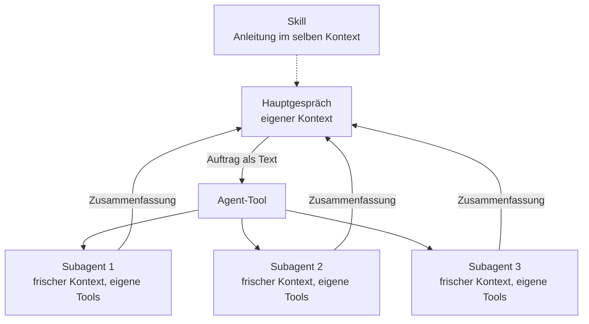

# S3.1 · Was ist ein Agent? Spezialisierung statt Allrounder

<!-- meta:start -->
> **Regal:** [Agenten & Orchestrierung](README.md#agents) · **Stufe:** Kern · **~12 Min** · **Voraussetzungen:** [S1.2 Coding-Agent statt Chat: das Denkmodell](s1-02-agent-statt-chat.md)
>
> ← [X.1 Community-Skills: wer baut was, das wirklich hilft](x-01-community-skills.md) · [Bibliothek](README.md) · [S3.2 Eingebaute Subagenten nutzen](s3-02-eingebaute-subagenten.md) →
<!-- meta:end -->

## Schnellcheck

- Kannst du ohne Nachschlagen erklären, worin sich ein Subagent von einem Skill unterscheidet (Kontext, Tools, Rolle)?
- Hast du schon einmal bewusst eine Aufgabe auf mehrere Agenten mit frischem Kontext verteilt, statt eine lange Sitzung zu überladen?

## Auf einen Blick

Ein Subagent ist eine spezialisierte Claude-Instanz mit eigener Rolle, eigenen Tools und eigenem Kontextfenster. Er ist kein Skill: Ein Skill leitet die laufende Sitzung an, ein Subagent bekommt einen eigenen Auftrag, arbeitet getrennt und gibt nur eine Zusammenfassung zurück. Weil ihn nichts anderes ablenkt, macht er seinen Teil gut, und dein Hauptgespräch bleibt frei von Suchergebnissen und Logs.

Umsonst ist das nicht: Jeder Subagent schickt eigene Anfragen, und die zählen auf dieselben Nutzungsgrenzen wie dein Hauptgespräch.

## Bild im Kopf

In einer Sicherheitszentrale macht nicht ein Wachmann alles: Kameras beobachten, auf Alarme reagieren, Karten verwalten und Vorfallberichte schreiben. Die Leitstelle schickt Spezialisten los. Jedes Streifenmitglied bekommt einen klaren Auftrag und die passende Ausrüstung und kümmert sich nur darum. Wer Kameras auswertet, rückt nicht zu Einbrüchen aus, und das Einsatzteam konfiguriert keine Kartenleser. Die Leitstelle koordiniert und führt die Berichte zusammen, sie macht nicht alles selbst.

Die Streife weiß allerdings nur, was im Einsatzbefehl steht. Was in der Leitstelle vorher besprochen wurde, kennt sie nicht. Ein Funkspruch, der über drei Stationen weitergegeben wird, kommt verzerrt an. Deshalb braucht jedes Team seine eigene, vollständige Einweisung.



## Im Detail

### Was ein Agent ist

Ein Agent ist eine **eigenständig arbeitende Claude-Instanz** mit einer bestimmten Rolle, bestimmten Tools und einem eigenen Kontextfenster. Er ist kein Skill: Ein Skill leitet eine einzige Claude-Instanz an ([S2.1](s2-01-skills-und-commands.md)). Ein Subagent läuft innerhalb deiner Sitzung, aber mit eigenem System-Prompt, eigenen Tools und eigenen Rechten.

Denk an deine Zutrittskontrolle: Dort macht nicht ein Wachmann alles, es gibt **spezialisierte Rollen**. Agenten funktionieren genauso. Typische Rollen in einem Softwareprojekt:

- **Code Explorer:** liest und analysiert die Struktur, findet Muster, versteht die Codebasis
- **Code Reviewer:** liest Änderungen, findet Bugs, Sicherheitsprobleme und Stilverstöße
- **Implementer:** schreibt Code, wendet Patches an, legt Dateien an
- **Test Writer:** erzeugt und startet Tests, prüft das Verhalten
- **Security Auditor:** sucht nach Schwachstellen, Injection-Lücken und geleakten Secrets

Jeder Agent ist gut in seinem Job, weil ihn nichts anderes **ablenkt**.

### Warum Spezialisierung hilft

Eine einzige Claude-Instanz, die alles macht:

- hat ein begrenztes Kontextfenster; lange Gespräche verschlechtern die Qualität ([S1.8](s1-08-kontextfenster.md))
- kann durch widersprüchliche Anweisungen aus verschiedenen Aufgaben durcheinanderkommen
- muss ständig umschalten, wie ein Mensch beim Multitasking

Mehrere spezialisierte Agenten:

- starten jeweils frisch, mit einem Kontext, der auf ihre Rolle zugeschnitten ist
- können **parallel** arbeiten, bei unabhängigen Teilaufgaben ist das deutlich schneller
- liefern Ergebnisse, die sauber in den nächsten Schritt einfließen

Das hat einen Preis. Jeder Subagent schickt eigene Anfragen, die auf dieselben Nutzungsgrenzen zählen wie dein Hauptgespräch. Und jedes Ergebnis landet wieder in deinem Gespräch: Viele Subagenten mit ausführlichen Berichten füllen auch dein Kontextfenster.

### Das Agent-Tool

Subagenten startet Claude über das eingebaute Agent-Tool. Dabei passiert Folgendes:

1. Claude Code legt eine neue Claude-Instanz an.
2. Sie bekommt eine Rollenbeschreibung, den Auftrag und ihre Tool-Rechte.
3. Das Hauptgespräch wartet auf das Ergebnis, oder der Subagent läuft im Hintergrund, während du weiterarbeitest; sein Ergebnis kommt dann als Meldung zurück.
4. Claude nimmt das Ergebnis auf und arbeitet damit weiter.

Jeder Subagent bekommt:

- ein eigenes Kontextfenster, frisch und für seinen Zweck
- festgelegte Tools, zum Beispiel Read, Write oder Bash
- eine fokussierte Aufgabenbeschreibung

Die orchestrierende Claude-Instanz bleibt oben und führt die Ergebnisse zusammen.

Wichtig für jeden Auftrag: Ein Subagent sieht deinen bisherigen Gesprächsverlauf nicht. Er arbeitet mit dem Auftrag, den Claude für ihn formuliert. Die Ausnahme ist ein Fork: ein Subagent, der das ganze bisherige Gespräch erbt, statt frisch zu starten.

Wie es weitergeht: Die eingebauten Subagenten zeigt [S3.2](s3-02-eingebaute-subagenten.md), eigene definierst du in [S3.3](s3-03-eigener-subagent.md), und wie mehrere Agenten zusammenarbeiten, steht in [S3.4](s3-04-orchestrierungsmuster.md).

## Selbst machen

### Extra: Stille Post mit Agenten (etwa 15 Minuten, verspielt)

**Ziel:** Die Kontext-Isolation von Subagenten und den Informationsverlust unvergesslich machen: Stille Post, mit Agenten als Kette.

**Analogie:** Ein Funkspruch, der über drei Streifen weitergegeben und dabei verzerrt wird. Deshalb braucht jedes Team seine eigene, vollständige Einweisung.

1. Nimm eine absichtlich detaillierte „Originalnachricht", zum Beispiel eine OSDP-Frame-Spezifikation in vier Sätzen mit konkreten Byte-Werten.
2. Bitte Claude um eine Kette aus drei Subagenten, in der jeder nur die Ausgabe des vorigen sieht:

<!-- cockpit:example -->
```text
Start a chain of 3 subagents. Agent 1 gets this message and summarizes it in ONE sentence. Agent 2 gets ONLY Agent 1's sentence and summarizes again. Agent 3 likewise.
```

3. Vergleich den letzten Satz von Agent 3 mit dem Original: Was ist verloren gegangen, was ist verzerrt?
4. Wiederhole den Versuch, aber gib jedem Agenten das **vollständige** Original. Vergleiche: Diesmal driftet nichts ab.
5. Merksatz (und der Lacher): Subagenten erben nicht deinen Kopf. Ein schlampiger Auftrag wird zur Stillen Post. Daraus folgt der Grundsatz, jeden Subagenten vollständig einzuweisen.

## Typische Fallen

- **Der Subagent weiß nicht, was du vorher gesagt hast.** Er startet mit frischem Kontext und sieht deinen Gesprächsverlauf nicht. Deine CLAUDE.md lädt ein eigener Subagent zwar mit (Explore und Plan nicht, siehe [S3.2](s3-02-eingebaute-subagenten.md)), aber was du nur im Gespräch gesagt hast, kommt nicht an. Muss so eine Regel bei ihm ankommen, etwa „ignoriere den Ordner `vendor/`", dann nenn sie in dem Auftrag, den du Claude zum Delegieren gibst.
- **Viele Subagenten, volles Hauptgespräch.** Jedes Ergebnis kommt in dein Gespräch zurück. Bitte um knappe Zusammenfassungen, etwa nur die fehlschlagenden Tests, statt um vollständige Berichte.
- **Alte Anleitungen sprechen vom Task-Tool.** Seit Version 2.1.63 heißt es Agent. `Task(...)`-Einträge in Settings und Agent-Definitionen funktionieren weiter als Alias.

## Check

Du kannst an einem konkreten Beispiel erklären, warum ein Subagent eine eigene Claude-Instanz mit eigenem Kontextfenster ist, ein Skill dagegen eine Anleitung für die laufende Sitzung, und wann sich das Aufteilen lohnt.

1. Was bekommt ein Subagent beim Start mit, und was sieht er nicht?
2. Nenne zwei Gründe, warum eine einzige lange Sitzung schlechter arbeitet als mehrere spezialisierte Agenten.
3. Was kostet dich jeder zusätzliche Subagent?

<details><summary>Quizfrage</summary>

**Frage:** Du willst drei Module parallel untersuchen lassen. Welcher Unterschied zwischen Skill und Subagent entscheidet, was du dafür nimmst?

- **Richtig:** Ein Subagent arbeitet in eigenem, frischem Kontext mit eigenen Tools; ein Skill leitet nur die laufende Sitzung an.
- Falsch: Ein Skill kann keine Shell-Befehle ausführen, ein Subagent schon; der Unterschied liegt allein in den Tools.
- Falsch: Ein Subagent teilt sich dein Kontextfenster und bekommt nur eine andere Rolle; ein Skill startet einen eigenen Prozess.
- Falsch: Subagenten sind für sicherheitskritische Prüfungen reserviert, Skills für alle anderen Aufgaben im Projekt.

</details>

## Weiterlesen

- [Subagents (offizielle Doku)](https://code.claude.com/docs/en/sub-agents)
- [Agenten parallel laufen lassen (offizielle Doku)](https://code.claude.com/docs/en/agents)
- [S1.2 · Coding-Agent statt Chat: das Denkmodell](s1-02-agent-statt-chat.md)
- [S1.8 · Das Kontextfenster verstehen](s1-08-kontextfenster.md)
- [S2.1 · Skills sind Dienstanweisungen, Commands sind Knöpfe](s2-01-skills-und-commands.md)
- [S3.2 · Eingebaute Subagenten nutzen](s3-02-eingebaute-subagenten.md)
- [S3.4 · Orchestrierungsmuster: Fan-out, Pipeline, Hierarchie](s3-04-orchestrierungsmuster.md)
- [S4.3 · Headless: claude -p als Pipeline-Stufe](s4-03-headless.md)
