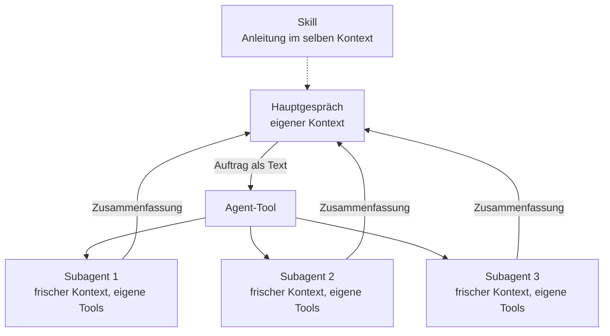

# S3.1 · Was ist ein Agent? Spezialisierung statt Allrounder

<!-- meta:start -->
> **Regal:** [Agenten & Orchestrierung](README.md#agents) · **Stufe:** Kern · **~12 Min** · **Voraussetzungen:** [S1.2 Coding-Agent statt Chat: das Denkmodell](s1-02-agent-statt-chat.md)
>
> ← [X.1 Community-Skills: wer baut was, das wirklich hilft](x-01-community-skills.md) · [Bibliothek](README.md) · [S3.2 Eingebaute Subagenten nutzen](s3-02-eingebaute-subagenten.md) →
<!-- meta:end -->

## Schnellcheck

- Kannst du ohne Nachschlagen erklären, worin sich ein Subagent von einem Skill unterscheidet (Kontext, Tools, Rolle)?
- Kannst du sagen, was ein Subagent beim Start über dein Gespräch weiß, und woran du merkst, dass sich das Aufteilen einer Aufgabe nicht lohnt?

## Auf einen Blick

Ein Subagent ist eine spezialisierte Claude-Instanz mit eigener Rolle, eigenen Tools und eigenem Kontextfenster. Er ist kein Skill: Ein Skill leitet die laufende Sitzung an, ein Subagent bekommt einen eigenen Auftrag, arbeitet getrennt und gibt nur eine Zusammenfassung zurück. Weil ihn nichts anderes ablenkt, macht er seinen Teil gut, und dein Hauptgespräch bleibt frei von Suchergebnissen und Logs.

Zwei Dinge gehören gleich dazu. Ein Subagent kennt nur den Auftrag, den Claude für ihn schreibt, nicht dein Gespräch. Und Aufteilen ist nicht umsonst: Jeder Subagent schickt eigene Anfragen, die auf dieselben Nutzungsgrenzen zählen wie dein Hauptgespräch. Bei Arbeit mit viel gemeinsamem Kontext bleibst du besser im Hauptgespräch.

## Bild im Kopf

In einer Sicherheitszentrale macht nicht ein Wachmann alles: Kameras beobachten, auf Alarme reagieren, Karten verwalten und Vorfallberichte schreiben. Die Leitstelle schickt Spezialisten los. Jedes Streifenmitglied bekommt einen klaren Auftrag und die passende Ausrüstung und kümmert sich nur darum. Die Leitstelle koordiniert und führt die Berichte zusammen, sie macht nicht alles selbst.

Die Streife weiß allerdings nur, was im Einsatzbefehl steht. Was in der Leitstelle vorher besprochen wurde, kennt sie nicht. Deshalb muss jeder Einsatzbefehl vollständig sein.



## Im Detail

### Was ein Agent ist

Ein Subagent ist eine **eigenständig arbeitende Claude-Instanz** mit bestimmter Rolle, bestimmten Tools und eigenem Kontextfenster. Er läuft innerhalb deiner Sitzung, aber mit eigenem System-Prompt und eigenen Tools. Ein Skill dagegen leitet die eine Claude-Instanz an, die ohnehin mit dir arbeitet ([S2.1](s2-01-skills-und-commands.md)).

Ein Beispiel aus der Zutrittstechnik: Auch dort gibt es spezialisierte Rollen statt eines Allrounders. In einem Softwareprojekt sind typische Rollen:

- **Code Explorer:** liest und analysiert die Struktur, findet Muster
- **Code Reviewer:** liest Änderungen, findet Bugs und Stilverstöße
- **Implementer:** schreibt Code, wendet Patches an
- **Test Writer:** erzeugt und startet Tests
- **Security Auditor:** sucht nach Schwachstellen und geleakten Secrets

### Was ein Subagent mitbekommt

Jeder Subagent startet mit einem frischen, isolierten Kontextfenster. Laut Doku sieht er weder deinen Gesprächsverlauf noch die Dateien, die Claude schon gelesen hat. Claude schreibt eine Auftragsnachricht, und der Subagent arbeitet damit. Dazu kommen sein eigener System-Prompt und deine CLAUDE.md-Dateien; nur Explore und Plan überspringen sie ([S3.2](s3-02-eingebaute-subagenten.md)).

Was du nur im Gespräch gesagt hast, kommt also nicht an. Muss eine Regel bei ihm ankommen, etwa „ignoriere den Ordner `vendor/`“, nenn sie in dem Auftrag, den du Claude zum Delegieren gibst. Die Übung unten zeigt genau das.

Die Ausnahme ist ein **Fork**: ein Subagent, der das ganze bisherige Gespräch erbt, statt frisch zu starten. Claude startet ihn über den Typ `fork`; du selbst startest ihn mit `/subtask`. Ein Fork spart das Erklären, hebt aber die Isolation auf.

### Wann sich das Aufteilen lohnt und wann nicht

Die Doku nennt Kriterien. **Ein Subagent lohnt sich**, wenn

- die Aufgabe viel Ausgabe erzeugt, die du im Hauptgespräch nicht brauchst (Testläufe, Suchergebnisse, Logs),
- du bestimmte Tool-Grenzen erzwingen willst,
- die Arbeit in sich abgeschlossen ist und eine Zusammenfassung genügt.

**Bleib im Hauptgespräch**, wenn

- die Aufgabe ständiges Hin und Her oder schrittweises Verfeinern braucht,
- mehrere Phasen viel Kontext teilen, etwa Planen, Umsetzen und Testen,
- es eine kleine, gezielte Änderung ist,
- es auf Tempo ankommt: Ein Subagent startet frisch und braucht Zeit, um sich einzulesen.

Dazu kommen die Kosten. Jedes Ergebnis landet wieder in deinem Gespräch: Viele Subagenten mit ausführlichen Berichten füllen auch dein Kontextfenster.

### Das Agent-Tool

Subagenten startet Claude über das eingebaute Agent-Tool. Claude Code legt eine neue Instanz an, die eine Rollenbeschreibung, den Auftrag und ihre Tool-Rechte bekommt. Das Hauptgespräch wartet auf das Ergebnis, oder der Subagent läuft im Hintergrund, und sein Ergebnis kommt dann als Meldung zurück. Die orchestrierende Instanz bleibt oben und führt die Ergebnisse zusammen.

Die eingebauten Subagenten zeigt [S3.2](s3-02-eingebaute-subagenten.md), eigene definierst du in [S3.3](s3-03-eigener-subagent.md), und wie mehrere zusammenarbeiten, steht in [S3.4](s3-04-orchestrierungsmuster.md).

## Selbst machen

### Übung: was ein Subagent weiß und was nicht (etwa 10 Minuten)

**Ziel:** Du zeigst, dass ein Subagent ein Codewort aus deinem Gespräch nur kennt, wenn der Auftrag es enthält.

**Startzustand:** ein leerer Ordner `~/cc-workshop/agent-kontext` (`mkdir -p ~/cc-workshop/agent-kontext && cd ~/cc-workshop/agent-kontext`, in PowerShell `New-Item -ItemType Directory -Force "$HOME\cc-workshop\agent-kontext"; Set-Location "$HOME\cc-workshop\agent-kontext"`). Starte darin `claude --permission-mode default` und bestätige den Vertrauensdialog. Im Ordner liegt keine `CLAUDE.md`, nichts verrät das Codewort außer deinem Gespräch.

1. Nenn Claude das Codewort. Es steht jetzt nur in diesem Gespräch:

   ```text
   For this session the project codeword is BLUE-HERON-47. Just reply "noted".
   ```

   Erwartet: Claude bestätigt kurz.
2. **Lauf 1: der Auftrag ohne Codewort.** Du diktierst den Auftragstext, damit Claude nichts stillschweigend ergänzt. Der Typ `general-purpose` verhindert, dass Claude einen Fork nimmt, der dein Gespräch erbt:

   <!-- cockpit:example -->
   ```text
   Use the Agent tool to start one subagent of type general-purpose. Give it exactly this task and nothing else: "What is the project codeword? Answer from your own context only, use no tools, and answer UNKNOWN if you do not know it." Do not add any other information to the task.
   ```

   Erwartet: Der Subagent kennt das Codewort nicht, Claude meldet „UNKNOWN“ oder sinngemäß, dass er es nicht wusste. Mit `Ctrl+O` siehst du den Aufruf des Subagenten im Transkript; schließ die Ansicht wieder mit `Ctrl+O`.
3. Prüf, was wirklich übergeben wurde:

   ```text
   Show me, word for word, the task text you gave the subagent.
   ```

   Erwartet: der diktierte Text aus Schritt 2, ohne das Codewort. Steht es doch darin, hat Claude den Auftrag ergänzt. Dann zählt der Lauf nicht; wiederhole Schritt 2 mit demselben Wortlaut.
4. **Lauf 2: derselbe Auftrag, diesmal mit Codewort im Text.**

   ```text
   Use the Agent tool to start one subagent of type general-purpose. Give it exactly this task and nothing else: "The project codeword is BLUE-HERON-47. What is the project codeword? Answer from your own context only and use no tools."
   ```

   Erwartet: Der Subagent nennt `BLUE-HERON-47`. Der Typ, die Anweisung und das Gespräch waren gleich; geändert hat sich allein der Auftragstext.

**Aufräumen:** Beende die Sitzung mit `/exit` (nach dem Extra, falls du es machst) und lösch den Ordner `~/cc-workshop/agent-kontext` selbst. Es wurde nichts außerhalb des Ordners verändert.

<details><summary>Vergleich</summary>

Die beiden Läufe unterscheiden sich nur im Auftragstext, und nur im zweiten kannte der Subagent das Codewort. Das Gespräch war in beiden Läufen dasselbe: Es gelangt nicht von allein zum Subagenten. Alles, was er wissen soll, muss im Auftrag stehen.

</details>

**Geschafft, wenn:**

- [ ] der Subagent in Lauf 1 das Codewort nicht nannte
- [ ] der übergebene Auftragstext aus Schritt 3 das Codewort nicht enthielt
- [ ] der Subagent in Lauf 2 `BLUE-HERON-47` nannte
- [ ] du in einem Satz sagen kannst, was sich zwischen den Läufen geändert hat

### Extra: das Gegenstück, ein Fork (etwa 3 Minuten)

Laut Doku erbt ein Fork das ganze Gespräch. Probier es in derselben Sitzung, bevor du sie beendest. `/subtask` braucht laut Doku Claude Code ab Version 2.1.212; fehlt der Befehl bei dir, überspring das Extra.

```text
/subtask What is the project codeword? Answer from your own context only and use no tools.
```

Erwartet: Der Fork nennt `BLUE-HERON-47`, obwohl dieser Auftrag das Codewort nicht enthält, weil er dein Gespräch kennt. Der Preis: Die Isolation fällt weg, er sieht denselben Verlauf wie du.

## Typische Fallen

- **Der Subagent weiß nicht, was du vorher gesagt hast.** Er sieht deinen Verlauf nicht, nur den Auftrag. Gilt eine Regel nur im Gespräch, schreib sie in den Auftrag, den du Claude zum Delegieren gibst.
- **Viele Subagenten, volles Hauptgespräch.** Jedes Ergebnis kommt in dein Gespräch zurück. Bitte um knappe Zusammenfassungen, etwa nur die fehlschlagenden Tests, statt um vollständige Berichte.
- **Aufteilen aus Gewohnheit.** Eine kleine Änderung oder eine Aufgabe mit viel Hin und Her wird durch einen Subagenten langsamer und teurer, nicht besser.
- **Alte Anleitungen sprechen vom Task-Tool.** Seit Version 2.1.63 heißt es Agent. `Task(...)`-Einträge in Settings und Agent-Definitionen funktionieren weiter als Alias.

## Check

Du kannst an einem Versuch zeigen, dass ein Subagent nur den Auftrag kennt, erklären, warum er kein Skill ist, und begründen, wann das Aufteilen sich lohnt.

1. Was bekommt ein Subagent beim Start mit, und was sieht er nicht?
2. Worin unterscheidet sich ein Subagent von einem Skill?
3. Was kostet dich jeder zusätzliche Subagent?

<details><summary>Auflösung</summary>

1. Er bekommt den Auftrag, den Claude für ihn schreibt, seinen eigenen System-Prompt und deine CLAUDE.md-Dateien (Explore und Plan überspringen sie). Deinen Gesprächsverlauf sieht er nicht; nur ein Fork erbt ihn.
2. Ein Subagent ist eine eigene Claude-Instanz mit frischem Kontextfenster, eigener Rolle und eigenen Tools und gibt nur eine Zusammenfassung zurück. Ein Skill leitet die laufende Sitzung im selben Kontext an.
3. Er schickt eigene Anfragen, die auf dieselben Nutzungsgrenzen zählen wie dein Hauptgespräch, und sein Ergebnis landet wieder in deinem Kontextfenster.

</details>

<details><summary>Quizfrage</summary>

**Frage:** Du änderst in einer Datei zwei zusammengehörige Funktionen: erst Plan, dann Umsetzung, dann Test, mit Rückfragen zwischendurch. Wie gehst du vor?

- **Richtig:** Im Hauptgespräch bleiben: Die Phasen teilen viel Kontext, du willst eingreifen, und ein Subagent müsste jedes Mal neu einsteigen.
- Falsch: Je Phase einen Subagenten starten, damit jede Phase mit frischem, unbelastetem Kontext beginnt und sauber arbeitet.
- Falsch: Die Funktionen parallel von zwei Subagenten bearbeiten lassen, weil parallele Arbeit die Zeit auf die Dauer des langsamsten verkürzt.
- Falsch: Einen Subagenten mit allen Tools starten, der alles in Ruhe selbst erledigt und dir nur das fertige Ergebnis zurückmeldet.

</details>

## Weiterlesen

- [Subagents (offizielle Doku)](https://code.claude.com/docs/en/sub-agents)
- [Agenten parallel laufen lassen (offizielle Doku)](https://code.claude.com/docs/en/agents)
- [S1.2 · Coding-Agent statt Chat: das Denkmodell](s1-02-agent-statt-chat.md)
- [S1.8 · Das Kontextfenster verstehen](s1-08-kontextfenster.md)
- [S2.1 · Skills sind Dienstanweisungen, Commands sind Knöpfe](s2-01-skills-und-commands.md)
- [S3.2 · Eingebaute Subagenten nutzen](s3-02-eingebaute-subagenten.md)
- [S3.4 · Orchestrierungsmuster: Fan-out, Pipeline, Hierarchie](s3-04-orchestrierungsmuster.md)
