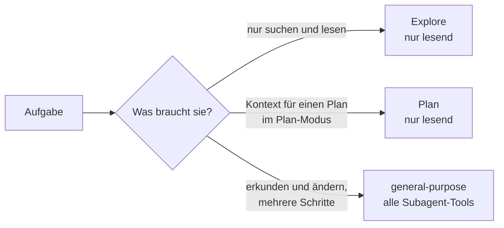

# S3.2 · Eingebaute Subagenten nutzen

<!-- meta:start -->
> **Regal:** [Agenten & Orchestrierung](README.md#agents) · **Stufe:** Kern · **~15 Min** · **Voraussetzungen:** [S3.1 Was ist ein Agent? Spezialisierung statt Allrounder](s3-01-was-ist-ein-agent.md)
>
> ← [S3.1 Was ist ein Agent? Spezialisierung statt Allrounder](s3-01-was-ist-ein-agent.md) · [Bibliothek](README.md) · [S3.3 Einen eigenen Subagenten definieren](s3-03-eigener-subagent.md) →
<!-- meta:end -->

## Schnellcheck

- Kannst du ohne Nachschlagen sagen, welche eingebauten Subagenten nur lesen und welcher auch Dateien ändern darf?
- Hast du schon einmal einen Subagenten-Typ ausdrücklich angefordert (etwa Explore), statt Claude entscheiden zu lassen?

## Auf einen Blick

Claude Code bringt Subagenten mit, die du nicht erst definieren musst. Explore durchsucht und analysiert eine Codebasis nur lesend, Plan sammelt im Plan-Modus lesend Kontext, bevor Claude dir einen Plan vorlegt, und general-purpose übernimmt Aufgaben, die Erkunden und Ändern oder mehrere abhängige Schritte brauchen. Claude delegiert von selbst an sie, du kannst sie aber auch im Auftrag beim Namen nennen.

## Bild im Kopf

Stell dir das Stammpersonal einer Wache vor. Der **Späher** geht die Außenanlage ab und meldet, was er sieht; er fasst nichts an. Das ist Explore, und du schickst ihn los, wenn du wissen willst, wo etwas liegt. Der **Zuarbeiter der Einsatzleitung** sitzt im Lageraum und trägt Fakten zusammen, bevor die Leitung ihren Einsatzplan vorlegt. Den Plan schreibt er nicht, und die Leitung setzt ihn von sich aus ein: Das ist Plan im Plan-Modus. Der **Diensthabende** darf erkunden und handeln und übernimmt Aufträge mit mehreren Schritten: Das ist general-purpose. Für einen Standardauftrag stellst du keine Sonderkraft ein, du gibst ihn der passenden Stammrolle.



## Im Detail

### Die drei eingebauten Subagenten

Bevor du eigene Subagenten definierst: Claude Code liefert schon drei mit, die du direkt nutzen kannst.

| Eingebaut | Was er tut | Typischer Einsatz |
|---|---|---|
| **Explore** | Schneller, nur lesender Späher: findet Dateien, durchsucht Code, erkundet die Codebasis. Write und Edit sind gesperrt. | „Kartiere dieses Repo, bevor ich umbaue“ |
| **Plan** | Recherche-Agent für den Plan-Modus: sammelt nur lesend Kontext, bevor Claude dir den Plan vorlegt. Er schreibt keinen Code. | Du lässt im Plan-Modus eine Migration in fünf Stufen planen ([S1.14](s1-14-plan-modus.md)) |
| **general-purpose** | Vielseitiger Agent für komplexe Aufgaben mit mehreren Schritten, die Erkunden und Handeln brauchen. Er hat alle Tools, die Subagenten zur Verfügung stehen. | Recherche und Codeänderung in einem Auftrag, wenn kein Spezialist passt |

Daneben gibt es Helfer wie `claude-code-guide` für Fragen zu Claude Code selbst. Die ruft Claude in der Regel von allein auf.

### Wie Claude sie auswählt

Claude delegiert automatisch, wenn dein Auftrag zur Aufgabenbeschreibung eines Subagenten passt, etwa „erkunde die Projektstruktur“ zu Explore. Im Plan-Modus gibt Claude die Recherche von sich aus an Plan ab, damit die Suchergebnisse in einem eigenen Kontextfenster bleiben. Du musst Plan nicht anfordern.

Willst du einen bestimmten Typ, nenn ihn im Auftrag, etwa „Use the Explore subagent to …“. Beim bloßen Nennen entscheidet Claude weiterhin selbst, ob es delegiert; ein Zusatz wie „Do not search yourself“ macht es verbindlicher. Wie du einen Subagenten wirklich erzwingst, zeigt [S3.3](s3-03-eigener-subagent.md). Im Verlauf erscheint die Delegation als Zeile mit dem Namen des Subagenten und einer kurzen Aufgabenbeschreibung; die Doku nennt als Beispiel `code-improver(Suggest code improvements)`. Die Übung unten lässt dich diese Zeile finden.

### Was sie mitbekommen

Explore und Plan überspringen deine CLAUDE.md-Dateien und den Schnappschuss des Git-Status, damit die Recherche schnell und günstig bleibt. Alle anderen eingebauten und alle eigenen Subagenten laden beides, es sei denn, die Definition eines eigenen setzt das Feld `omitClaudeMd`.

Explore und Plan sind Einmal-Aufträge: Sie geben keine Agent-ID zurück, Claude kann sie also nicht fortsetzen. Brauchst du Arbeit in mehreren Etappen, nimm general-purpose oder einen eigenen Subagenten. Auch ein Skill kann in einem dieser Subagenten laufen ([S2.2](s2-02-skill-schreiben.md), Feld `context: fork`).

## Selbst machen

### Übung: Explore anfordern und die Delegation finden (etwa 8 Minuten)

**Ziel:** Du forderst Explore im Auftrag an, findest die Delegation im Transkript und siehst, dass dein Hauptgespräch nur die Zusammenfassung bekommt.

**Startzustand:** ein neuer Ordner `~/cc-workshop/explore` mit drei kleinen Konfigurationsdateien. Leg ihn an und wechsle hinein (`mkdir -p ~/cc-workshop/explore && cd ~/cc-workshop/explore`, in PowerShell `New-Item -ItemType Directory -Force "$HOME\cc-workshop\explore"; Set-Location "$HOME\cc-workshop\explore"`). Die Dateien erzeugt dieser Befehl, in beiden Shells gleich; er braucht Python (unter macOS und Linux heißt er meist `python3`):

```bash
python -c "import pathlib; d={'lobby':('R-100','card','30','2021-03-04'),'lab':('R-200','card','45','2022-07-19'),'server':('R-300','pin','20','2023-11-02')}; [pathlib.Path(n+'.cfg').write_text('door: '+n+'\nreader: '+v[0]+'\nmode: '+v[1]+'\ntimeout: '+v[2]+'\ninstalled: '+v[3]+'\n') for n,v in d.items()]"
```

Danach liegen `lobby.cfg`, `lab.cfg` und `server.cfg` im Ordner, jede mit den Zeilen `door`, `reader`, `mode`, `timeout` und `installed`. Starte `claude --permission-mode default` und bestätige den Vertrauensdialog.

1. Fordere Explore an. Du fragst nach `mode` und `timeout`, nicht nach `installed`:

   <!-- cockpit:example -->
   ```text
   Use the Explore subagent to find out which of the .cfg files in this folder has mode pin, and report its file name and its timeout value. Do not search yourself.
   ```

   Erwartet: Claude startet Explore und antwortet nach einer Weile mit `server.cfg` und dem Timeout `20`.
2. Drück `Ctrl+O` und such im Transkript die Zeile der Delegation. Erwartet: eine Zeile mit dem Namen `Explore` und einer kurzen Aufgabenbeschreibung. Fehlt sie, hat Claude selbst gesucht; wiederhole dann Schritt 1. Schließ das Transkript mit `Ctrl+O`.
3. Prüf, was im Hauptgespräch angekommen ist:

   ```text
   Without using any tools: quote the installed line of lab.cfg word for word.
   ```

   Erwartet: Claude sagt, dass es `lab.cfg` nicht selbst gelesen hat und nur die Zusammenfassung von Explore kennt, oder es rät einen Wert, der von der Datei abweicht. Hat Explore den Wert zufällig in seine Zusammenfassung geschrieben, nennt Claude ihn richtig: Dann landete er im Hauptgespräch, weil der Subagent ihn zurückmeldete, nicht weil Claude die Datei gelesen hätte.
4. Vergleiche mit der Datei: Lies sie selbst (`cat lab.cfg`, in PowerShell `Get-Content lab.cfg`). Erwartet: `installed: 2022-07-19`.

**Aufräumen:** Beende die Sitzung mit `/exit` und lösch den Ordner `~/cc-workshop/explore` selbst.

**Geschafft, wenn:**

- [ ] du im Transkript eine Zeile mit `Explore` gefunden hast
- [ ] Claude `server.cfg` und den Timeout `20` genannt hat
- [ ] Claude die `installed`-Zeile von `lab.cfg` ohne Werkzeug nicht richtig wiedergeben konnte (oder der Wert nur über Explores Bericht ankam)
- [ ] du sagen kannst, was von Explores Arbeit im Hauptgespräch landet: seine Zusammenfassung

## Typische Fallen

- **Claude delegiert nicht, obwohl du Explore genannt hast.** Beim bloßen Nennen entscheidet Claude selbst. Bitte ausdrücklich darum, nicht selbst zu suchen, oder lies die Zeile im Transkript nach.
- **Explore kennt deine Hausordnung nicht.** Explore und Plan laden keine CLAUDE.md. Gilt eine Regel auch für die Suche, etwa „ignoriere `vendor/`“, schreib sie in den Auftrag.
- **Plan ist kein Planschreiber.** Er sammelt nur lesend Kontext; den Plan legt dir das Hauptgespräch vor. Zum Umsetzen braucht es einen Agenten mit Schreibrechten, etwa general-purpose.
- **Explore lässt sich nicht fortsetzen.** Bittest du Claude, „die Suche von eben weiterzuführen“, startet ein neuer Explore-Lauf; in deinem Gespräch steht nur die Zusammenfassung des alten. Für Arbeit in Etappen nimm general-purpose oder einen eigenen Subagenten.

## Check

Du kannst die drei eingebauten Subagenten nennen, sagen, welche nur lesen, Explore im Auftrag gezielt anfordern und im Transkript die Delegation finden.

1. Welcher eingebaute Subagent darf Dateien ändern, welche nicht?
2. Wann gibt Claude Arbeit an Plan ab, und musst du ihn dafür anfordern?
3. Was lädt Explore im Unterschied zu einem eigenen Subagenten nicht?

<details><summary>Auflösung</summary>

1. general-purpose hat alle Tools, die Subagenten zur Verfügung stehen, und darf damit ändern. Explore und Plan sind nur lesend; Write und Edit sind gesperrt.
2. Im Plan-Modus, wenn Claude deine Codebasis verstehen muss, bevor es den Plan vorlegt. Du musst ihn nicht anfordern.
3. Deine CLAUDE.md-Dateien und den Schnappschuss des Git-Status.

</details>

<details><summary>Quizfrage</summary>

**Frage:** Vor einem Umbau willst du wissen, wo in `firmware/` alle OSDP-Dateien liegen. Nichts soll geändert werden, und die Suchergebnisse sollen nicht dein Hauptgespräch füllen. Welcher eingebaute Subagent passt?

- **Richtig:** Explore: Er liest nur, Write und Edit sind gesperrt, und seine Suche bleibt in seinem eigenen Kontext.
- Falsch: Plan: Er schreibt dir den fertigen Umbauplan und legt die dafür nötigen Dateien gleich im Repo an.
- Falsch: general-purpose: Er findet dieselben Dateien, und dass er auch ändern darf, schadet nicht, solange du nichts verlangst.
- Falsch: Keiner: Eingebaute Subagenten laufen erst, wenn du sie vorher in `.claude/agents/` angelegt hast.

</details>

## Weiterlesen

- [Subagents: eingebaute Subagenten (offizielle Doku)](https://code.claude.com/docs/en/sub-agents#built-in-subagents)
- [S3.1 · Was ist ein Agent? Spezialisierung statt Allrounder](s3-01-was-ist-ein-agent.md)
- [S3.3 · Einen eigenen Subagenten definieren](s3-03-eigener-subagent.md)
- [S1.14 · Plan-Modus und schrittweises Vorgehen](s1-14-plan-modus.md)
- [S2.2 · Eine SKILL.md schreiben](s2-02-skill-schreiben.md)
