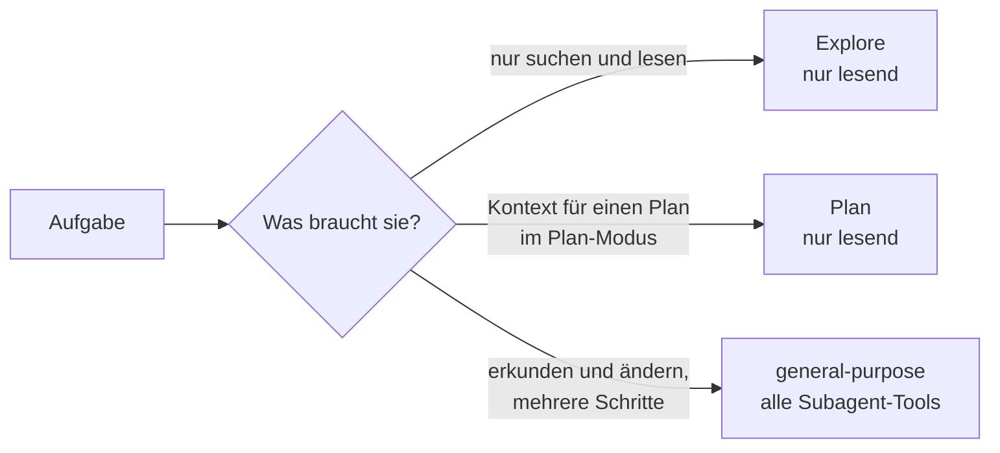

# S3.2 · Eingebaute Subagenten nutzen

<!-- meta:start -->
> **Regal:** [Agenten & Orchestrierung](README.md#agents) · **Stufe:** Kern · **~10 Min** · **Voraussetzungen:** [S3.1 Was ist ein Agent? Spezialisierung statt Allrounder](s3-01-was-ist-ein-agent.md)
>
> ← [S3.1 Was ist ein Agent? Spezialisierung statt Allrounder](s3-01-was-ist-ein-agent.md) · [Bibliothek](README.md) · [S3.3 Einen eigenen Subagenten definieren](s3-03-eigener-subagent.md) →
<!-- meta:end -->

## Schnellcheck

- Kannst du ohne Nachschlagen sagen, welche eingebauten Subagenten nur lesen und welcher auch Dateien ändern darf?
- Hast du schon einmal einen Subagenten-Typ ausdrücklich angefordert (etwa Explore), statt Claude entscheiden zu lassen?

## Auf einen Blick

Claude Code bringt Subagenten mit, die du nicht erst definieren musst. Explore durchsucht und analysiert eine Codebasis nur lesend, Plan sammelt im Plan-Modus lesend Kontext, bevor Claude dir einen Plan vorlegt, und general-purpose übernimmt Aufgaben, die Erkunden und Ändern oder mehrere abhängige Schritte brauchen. Claude delegiert von selbst an sie, du kannst sie aber auch im Auftrag beim Namen nennen.

## Bild im Kopf

Stell dir das Stammpersonal einer Wache vor. Der Aufklärer geht die Außenanlage ab und meldet, was er sieht, aber er fasst nichts an: Das ist Explore. Der Erkunder nimmt für die Einsatzleitung die Lage auf, bevor sie den Einsatzplan vorlegt: Das ist Plan im Plan-Modus. Der Diensthabende darf erkunden und handeln und übernimmt Aufträge mit mehreren Schritten: Das ist general-purpose. Für einen Standardauftrag stellst du keine Sonderkraft ein, du gibst ihn der passenden Stammrolle.



## Im Detail

### Die drei eingebauten Subagenten

Bevor du eigene Subagenten definierst: Claude Code liefert schon drei mit, die du direkt nutzen kannst.

| Eingebaut | Was er tut | Typischer Einsatz |
|---|---|---|
| **Explore** | Schneller, nur lesender Späher: findet Dateien, durchsucht Code, erkundet die Codebasis. Write und Edit sind gesperrt. | „Kartiere dieses Repo, bevor ich umbaue" |
| **Plan** | Recherche-Agent für den Plan-Modus: sammelt nur lesend Kontext, bevor Claude dir den Plan vorlegt. Er schreibt keinen Code. | Du lässt im Plan-Modus eine Migration in fünf Stufen planen ([S1.14](s1-14-plan-modus.md)) |
| **general-purpose** | Vielseitiger Agent für komplexe Aufgaben mit mehreren Schritten, die Erkunden und Handeln brauchen. Er hat alle Tools, die Subagenten zur Verfügung stehen. | Recherche und Codeänderung in einem Auftrag, wenn kein Spezialist passt |

Daneben gibt es Helfer wie `claude-code-guide` für Fragen zu Claude Code selbst. Die ruft Claude in der Regel von allein auf.

### Wie Claude sie auswählt

Claude delegiert automatisch, wenn dein Auftrag zur Aufgabenbeschreibung eines Subagenten passt, etwa „erkunde die Projektstruktur" zu Explore. Im Plan-Modus gibt Claude die Recherche an Plan ab, damit die Suchergebnisse in einem eigenen Kontextfenster bleiben.

Willst du einen bestimmten Typ, nenn ihn im Auftrag. Claude ruft dann das Agent-Tool mit dem passenden `subagent_type` auf, und im Verlauf erscheint die Delegation als Zeile mit dem Namen des Subagenten und einer kurzen Aufgabenbeschreibung:

<!-- cockpit:example -->
```text
Use the Explore subagent to map all OSDP-related files in firmware/ and report module boundaries.
```

Beim bloßen Nennen entscheidet Claude weiterhin selbst, ob es delegiert. Wie du einen Subagenten verbindlich anforderst, zeigt [S3.3](s3-03-eigener-subagent.md).

Der Rest dieses Regals dreht sich vor allem um eigene Subagenten ([S3.3](s3-03-eigener-subagent.md)). Wer die eingebauten kennt, baut aber keine eigenen Späher und Planer nach.

### Was sie mitbekommen

Explore und Plan überspringen deine CLAUDE.md-Dateien und den Schnappschuss des Git-Status, damit die Recherche schnell und günstig bleibt. Alle anderen eingebauten und alle eigenen Subagenten laden beides. Beide übernehmen standardmäßig das Modell deines Hauptgesprächs; Explore läuft auf der Claude API dabei höchstens auf Opus.

Explore und Plan sind Einmal-Aufträge: Sie geben keine Agent-ID zurück, Claude kann sie also nicht fortsetzen. Brauchst du Arbeit in mehreren Etappen, nimm general-purpose oder einen eigenen Subagenten.

Auch ein Skill kann in einem dieser Subagenten laufen: Mit `context: fork` wählt das Feld `agent` im Skill den Typ ([S2.2](s2-02-skill-schreiben.md)).

## Typische Fallen

- **Explore kennt deine Hausordnung nicht.** Explore und Plan laden keine CLAUDE.md. Gilt eine Regel auch für die Suche, etwa „ignoriere `vendor/`", schreib sie in den Auftrag.
- **Plan ist kein Planschreiber.** Er sammelt nur lesend Kontext; den Plan legt dir das Hauptgespräch vor. Zum Umsetzen braucht es einen Agenten mit Schreibrechten, etwa general-purpose.
- **Explore lässt sich nicht fortsetzen.** Bittest du Claude, „die Suche von eben weiterzuführen", startet ein neuer Explore-Lauf. Claude kann den alten Lauf nicht fortsetzen; in deinem Gespräch steht nur seine Zusammenfassung. Für Arbeit in Etappen nimm general-purpose oder einen eigenen Subagenten.

## Check

Du kannst die drei eingebauten Subagenten nennen, sagen, welche nur lesen, und einen davon im Auftrag gezielt anfordern.

1. Welcher eingebaute Subagent darf Dateien ändern, welche nicht?
2. Wann gibt Claude Arbeit an Plan ab?
3. Was lädt Explore im Unterschied zu einem eigenen Subagenten nicht?

<details><summary>Quizfrage</summary>

**Frage:** Vor einem Umbau willst du wissen, wo in `firmware/` alle OSDP-Dateien liegen. Nichts soll geändert werden, und die Suchergebnisse sollen nicht dein Hauptgespräch füllen. Welcher eingebaute Subagent passt?

- **Richtig:** Explore: Er liest nur, Write und Edit sind gesperrt, und seine Suche bleibt in seinem eigenen Kontext.
- Falsch: Plan: Er schreibt dir einen fertigen Umbauplan und legt die dafür nötigen Dateien gleich im Repo an.
- Falsch: general-purpose: Nur er darf überhaupt Dateien lesen, Explore und Plan sehen ausschließlich die Dateinamen.
- Falsch: Keiner: Eingebaute Subagenten laufen erst, wenn du sie vorher in `.claude/agents/` angelegt hast.

</details>

## Weiterlesen

- [Subagents: eingebaute Subagenten (offizielle Doku)](https://code.claude.com/docs/en/sub-agents#built-in-subagents)
- [S3.1 · Was ist ein Agent? Spezialisierung statt Allrounder](s3-01-was-ist-ein-agent.md)
- [S3.3 · Einen eigenen Subagenten definieren](s3-03-eigener-subagent.md)
- [S1.14 · Plan-Modus und schrittweises Vorgehen](s1-14-plan-modus.md)
- [S2.2 · Eine SKILL.md schreiben](s2-02-skill-schreiben.md)
