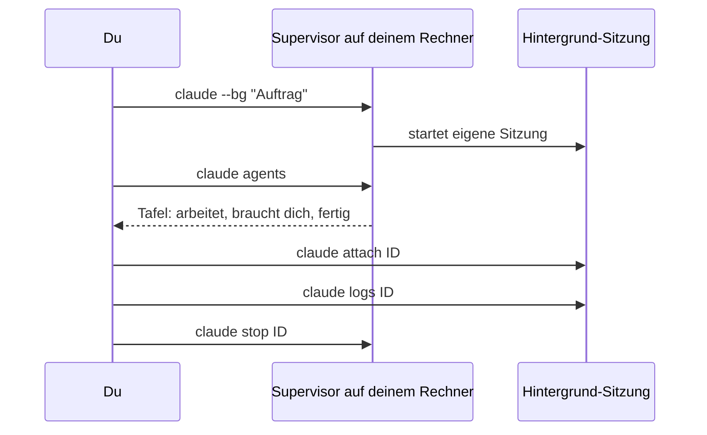

# S3.5 · Hintergrund-Sitzungen und Agent Teams

<!-- meta:start -->
> **Regal:** [Agenten & Orchestrierung](README.md#agents) · **Stufe:** Vertiefung · **~15 Min** · **Voraussetzungen:** [S3.4 Orchestrierungsmuster: Fan-out, Pipeline, Hierarchie](s3-04-orchestrierungsmuster.md)
>
> ← [S3.4 Orchestrierungsmuster: Fan-out, Pipeline, Hierarchie](s3-04-orchestrierungsmuster.md) · [Bibliothek](README.md) · [S3.6 Devil's Advocate: eine adversariale Prüf-Pipeline](s3-06-devils-advocate.md) →
<!-- meta:end -->

## Schnellcheck

- Hast du schon einmal eine Sitzung mit `claude --bg` oder `/background` in den Hintergrund geschickt und später mit `claude attach` wieder aufgenommen?
- Kannst du ohne Nachschlagen erklären, worin sich eine Hintergrund-Sitzung von einem Subagenten unterscheidet und warum ein großes Agent Team teuer wird?

## Auf einen Blick

Eine Hintergrund-Sitzung ist eine vollständige Claude-Code-Sitzung, die ohne angehängtes Terminal weiterläuft: Du startest sie mit `claude --bg` oder schickst die laufende mit `/background` weg und behältst alle mit `claude agents` im Blick. Sie läuft auf deinem Rechner, nicht in der Cloud. Agent Teams gehen weiter: Mehrere Sitzungen mit eigenem Kontext stimmen sich über Nachrichten und eine gemeinsame Aufgabenliste ab, geführt von einer Lead-Sitzung. Beides ist noch nicht fertig: Agent view ist eine Research Preview, Agent Teams sind experimentell und standardmäßig aus.

## Bild im Kopf

`claude agents` ist die Schichttafel der Wachleitung. Jede Streife, die gerade draußen ist, steht als Zeile auf der Tafel. Du kannst dich bei jeder einklinken (`attach`), den letzten Funkverkehr abrufen (`logs`), eine zurückrufen (`stop`), dieselbe Streife erneut losschicken (`respawn`) oder einen erledigten Eintrag streichen (`rm`). Die Tafel hängt in deinem eigenen Gebäude: Fährt der Rechner herunter, endet die Schicht.

Ein Agent Team ist dagegen die vollständige Mannschaft einer Leitstelle: Einsatzleiter, Kamerabeobachter, Disponent, Berichtsschreiber. Jeder hat seinen eigenen Arbeitsplatz (Kontext), seinen eigenen Funkkanal (`SendMessage`) und seine eigene Ausrüstung (Tools), und der Einsatzleiter koordiniert. Jede besetzte Stelle kostet, solange sie besetzt ist.



## Im Detail

### Reife-Stand vorab

- **Hintergrund-Sitzungen und Agent view** (`claude --bg`, `claude agents`): Research Preview. Oberfläche und Tastenkürzel können sich noch ändern.
- **Agent Teams:** experimentell und standardmäßig ausgeschaltet.

### `/tasks`: Hintergrundarbeit in deiner Sitzung

`/tasks` (auch `/bashes`) zeigt die Hintergrundarbeit der aktuellen Sitzung, auch Subagenten, die gerade fertig geworden sind. Startest du parallele Agenten oder lange Befehle, ist das dein Überblick.

### Hintergrund-Sitzungen (`claude agents`)

Manche Aufträge schickst du los und schaust nicht zu: Doku erzeugen, einem wackligen Test nachgehen, lange Generierungsläufe. Dafür gibt es Hintergrund-Sitzungen. Jede ist eine vollständige Claude-Code-Sitzung, die ohne angehängtes Terminal weiterläuft; du kannst sie öffnen, antworten und wieder gehen.

**Starten:**

<!-- cockpit:example -->
```bash
claude --bg "Generate API documentation for every public function in src/api/"
```

`--bg` (lang `--background`) schickt die Sitzung sofort in den Hintergrund und gibt ihre Kurz-ID und die Befehle zum Verwalten aus. Den Auftrag gibst du als normales Argument mit, nicht mit `-p`: `--bg` und `-p` lassen sich nicht kombinieren. Eine laufende Sitzung schickst du mit `/background` (kurz `/bg`) in den Hintergrund. Ein bestehendes Gespräch setzt du mit `claude --resume <session-id> --bg "…"` im Hintergrund fort.

**Die Übersicht:**

```bash
claude agents      # Opens the background-sessions monitor — every active patrol on one screen
```

`claude agents` öffnet Agent view, eine Tafel mit allen Hintergrund-Sitzungen, gruppiert danach, ob sie arbeiten, auf dich warten oder fertig sind. Von der Shell aus erreichst du jede Sitzung über ihre ID:

| Befehl | Was er tut |
|---|---|
| `claude attach <id>` | holt die Sitzung in dieses Terminal, als wäre es deine |
| `claude logs <id>` | zeigt die letzte Ausgabe der Sitzung |
| `claude stop <id>` | stoppt die Sitzung |
| `claude respawn <id>` | startet die Sitzung neu und setzt ihr gespeichertes Gespräch fort; gibt es keins, läuft der ursprüngliche Auftrag neu |
| `claude rm <id>` | entfernt die Sitzung aus der Liste, samt dem Worktree, den Claude für sie angelegt hat, wenn er sich sicher löschen lässt |

Dazu kommt `claude daemon status` für einen schnellen Blick auf den Supervisor, den Hintergrunddienst, der die Sitzungen trägt. Das hilft, wenn Sitzungen zu hängen scheinen.

**Wo die Sitzungen laufen:** auf deinem Rechner. Du kannst Terminal und Agent view schließen, die Sitzung arbeitet weiter. Den Ruhezustand übersteht sie, beim Herunterfahren stoppt sie. Bevor eine Hintergrund-Sitzung Dateien ändert, wechselt Claude in einen eigenen Git-Worktree unter `.claude/worktrees/`, damit sich parallele Sitzungen nicht in die Quere kommen ([S1.18](s1-18-worktrees.md)).

**Typische Einsätze:**

- **Doku erzeugen:** `claude --bg "Generate JSDoc for every function in src/, commit per file"` läuft lange; du schaust per `attach` hinein, wenn es dir passt.
- **Einem Fehler nachgehen:** `claude --bg "investigate the flaky SettingsChangeDetector test"`, während du selbst an etwas anderem arbeitest.

### Subagent oder Hintergrund-Sitzung?

Ein Subagent arbeitet innerhalb deiner Sitzung und liefert sein Ergebnis an sie zurück. Auch er kann im Hintergrund laufen, während du weiterarbeitest, aber er gehört zu dieser Sitzung. Eine Hintergrund-Sitzung ist eine eigenständige Sitzung, die dein Terminal überdauert und ihr Ergebnis nur dir meldet. Nimm Subagenten für das Auffächern innerhalb einer Aufgabe ([S3.4](s3-04-orchestrierungsmuster.md)) und Hintergrund-Sitzungen für unabhängige Aufträge, die du abgibst und später prüfst.

### Agent Teams (experimentell)

Über einzelne Subagenten hinaus unterstützt Claude Code **Agent Teams**: mehrere Sitzungen, die sich untereinander abstimmen. Eine Sitzung ist der Lead; sie verteilt die Arbeit und führt die Ergebnisse zusammen. Jedes Teammitglied arbeitet in einer eigenen Sitzung mit eigenem Kontextfenster. Die Mitglieder können:

- parallel an verschiedenen Teilen einer Aufgabe arbeiten
- sich gegenseitig Befunde schicken, über das Tool `SendMessage`
- Arbeit aus einer gemeinsamen Aufgabenliste übernehmen

Agent Teams sind standardmäßig aus. Du schaltest sie mit einer Umgebungsvariablen ein, zum Beispiel in der `settings.json`:

```json
{
  "env": {
    "CLAUDE_CODE_EXPERIMENTAL_AGENT_TEAMS": "1"
  }
}
```

Danach bittest du Claude in normaler Sprache um Teammitglieder und beschreibst ihre Rollen. Ein eigenes Tool zum Anlegen des Teams gibt es nicht mehr: `TeamCreate` wurde entfernt, Claude startet Teammitglieder direkt über das Agent-Tool.

**Kosten:** Der Token-Verbrauch wächst mit der Zahl der aktiven Teammitglieder, ungefähr im Verhältnis zur Teamgröße. Jedes aktive Mitglied verbraucht weiter Tokens, bis es sich beendet oder die Sitzung endet. Nimm Sonnet für Teammitglieder, halte Teams klein und beende Mitglieder, sobald ihre Arbeit erledigt ist.

## Typische Fallen

- **`/agents` ist nicht `claude agents`.** Trotz des ähnlichen Namens sind das zwei Dinge: `/agents` in einer Sitzung betrifft Subagenten-Dateien ([S3.3](s3-03-eigener-subagent.md)), `claude agents` in der Shell öffnet Agent view mit deinen Hintergrund-Sitzungen.
- **`claude rm` nimmt den Worktree mit.** Hat Claude für die Sitzung einen Worktree angelegt, löscht `rm` ihn mit, sofern das sicher geht. Committe Änderungen, bevor du eine Sitzung löschst, die in ihrem eigenen Worktree gearbeitet hat.
- **Ein Team entsteht, ohne dass du fragst.** Sind Agent Teams eingeschaltet, startet ein Subagent, dem Claude einen Namen gibt, als Teammitglied. So kann ein Team entstehen, obwohl du keins wolltest. Schalte die Variable nur ein, wenn du Teams wirklich nutzt.
- **Zehn Sitzungen, zehnfacher Verbrauch.** Hintergrund-Sitzungen verbrauchen dein Kontingent wie interaktive: Zehn parallele Sitzungen verbrauchen es ungefähr zehnmal so schnell wie eine.

## Check

Du kannst eine Hintergrund-Sitzung mit `claude --bg` starten, sie mit `claude agents` finden und mit `claude attach <id>` übernehmen, den Unterschied zu einem Subagenten erklären und begründen, warum Agent Teams nur mit Absicht und in kleiner Besetzung laufen sollten.

1. Mit welchem Befehl holst du eine Hintergrund-Sitzung in dein Terminal, und womit siehst du nur ihre letzte Ausgabe?
2. Wo läuft eine Hintergrund-Sitzung, und was passiert, wenn du den Rechner herunterfährst?
3. Wie schaltest du Agent Teams ein, und wovon hängt ihr Token-Verbrauch ab?

<details><summary>Quizfrage</summary>

**Frage:** Worin unterscheidet sich ein Subagent grundlegend von einer Hintergrund-Sitzung, die du mit `claude --bg` startest?

- **Richtig:** Ein Subagent gehört zu deiner Sitzung und meldet ihr sein Ergebnis; eine Hintergrund-Sitzung läuft eigenständig ohne Terminal.
- Falsch: Die Hintergrund-Sitzung läuft in der Cloud weiter, auch wenn du den Rechner ausschaltest; ein Subagent läuft dagegen nur lokal bei dir.
- Falsch: Nur Subagenten können parallel laufen; von `claude --bg` ist immer nur eine Sitzung zur selben Zeit aktiv, weitere warten.
- Falsch: Es ist nur die Anzeige: Beides ist technisch dasselbe, die Hintergrund-Sitzung erscheint bloß zusätzlich in `claude agents`.

</details>

## Weiterlesen

- [Agent view: Hintergrund-Sitzungen verwalten (offizielle Doku)](https://code.claude.com/docs/en/agent-view)
- [Agent Teams (offizielle Doku)](https://code.claude.com/docs/en/agent-teams)
- [Agenten parallel laufen lassen (offizielle Doku)](https://code.claude.com/docs/en/agents)
- [S3.4 · Orchestrierungsmuster: Fan-out, Pipeline, Hierarchie](s3-04-orchestrierungsmuster.md)
- [S1.18 · Worktrees als Testlabor](s1-18-worktrees.md)
- [S3.12 · Zeitgesteuert arbeiten: /loop, /goal, /schedule, Routinen](s3-12-zeitgesteuert-arbeiten.md)
- [S3.13 · Autonome Loops absichern: Budget und Worktree](s3-13-autonome-loops-absichern.md)
- [S1.19 · Kosten im Blick: /cost, /usage und Budgetgrenzen](s1-19-kosten-im-blick.md)
