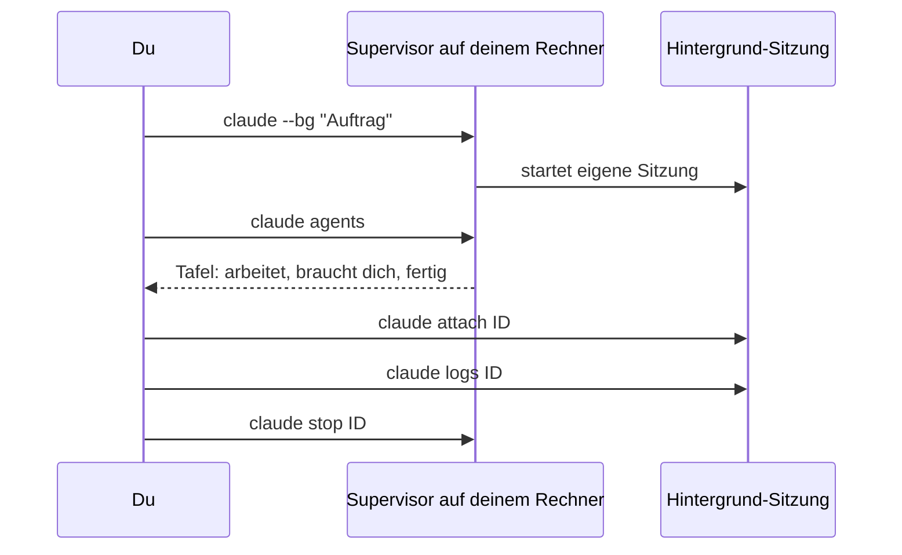

# S3.5 · Hintergrund-Sitzungen und Agent Teams

<!-- meta:start -->
> **Regal:** [Agenten & Orchestrierung](README.md#agents) · **Stufe:** Vertiefung · **~20 Min** · **Voraussetzungen:** [S3.4 Orchestrierungsmuster: Fan-out, Pipeline, Hierarchie](s3-04-orchestrierungsmuster.md)
>
> ← [S3.4 Orchestrierungsmuster: Fan-out, Pipeline, Hierarchie](s3-04-orchestrierungsmuster.md) · [Bibliothek](README.md) · [S3.6 Devil's Advocate: eine adversariale Prüf-Pipeline](s3-06-devils-advocate.md) →
<!-- meta:end -->

## Schnellcheck

- Hast du schon einmal eine Sitzung mit `claude --bg` oder `/background` in den Hintergrund geschickt und später mit `claude attach` wieder aufgenommen?
- Kannst du ohne Nachschlagen erklären, worin sich eine Hintergrund-Sitzung von einem Subagenten unterscheidet und warum ein großes Agent Team teuer wird?

## Auf einen Blick

Eine Hintergrund-Sitzung ist eine vollständige Claude-Code-Sitzung, die ohne angehängtes Terminal weiterläuft: Du startest sie mit `claude --bg` oder schickst die laufende mit `/background` weg und behältst alle mit `claude agents` im Blick. Sie läuft auf deinem Rechner, nicht in der Cloud. Agent Teams gehen weiter: Mehrere Sitzungen mit eigenem Kontext stimmen sich ab, geführt von einer Lead-Sitzung. Beides ist noch nicht fertig: Agent view ist eine Research Preview, Agent Teams sind experimentell und standardmäßig aus. Diese Lektion übt die Hintergrund-Sitzungen; Agent Teams bekommen einen kurzen Ausblick.

## Bild im Kopf

`claude agents` ist die Schichttafel der Wachleitung. Jede Streife, die gerade draußen ist, steht als Zeile auf der Tafel. Du kannst dich bei jeder einklinken (`attach`), den letzten Funkverkehr abrufen (`logs`), eine zurückrufen (`stop`), dieselbe Streife erneut losschicken (`respawn`) oder einen erledigten Eintrag streichen (`rm`). Die Tafel hängt in deinem eigenen Gebäude: Fährt der Rechner herunter, endet die Schicht.



## Im Detail

### Reife-Stand vorab

- **Hintergrund-Sitzungen und Agent view** (`claude --bg`, `claude agents`): Research Preview. Oberfläche und Tastenkürzel können sich noch ändern. Die Bezeichnungen der Oberfläche stehen hier, wie die Doku sie nennt.
- **Agent Teams:** experimentell und standardmäßig ausgeschaltet.

### `/tasks`: Hintergrundarbeit in deiner Sitzung

`/tasks` (auch `/bashes`) zeigt die Hintergrundarbeit der aktuellen Sitzung, auch Subagenten, die gerade fertig geworden sind. Startest du parallele Agenten oder lange Befehle, ist das dein Überblick.

### Hintergrund-Sitzungen (`claude agents`)

Manche Aufträge schickst du los und schaust nicht zu: Doku erzeugen, einem wackligen Test nachgehen, lange Läufe. Dafür gibt es Hintergrund-Sitzungen. Jede ist eine vollständige Claude-Code-Sitzung, die ohne angehängtes Terminal weiterläuft; du kannst sie öffnen, antworten und wieder gehen.

**Starten:** `claude --bg "Auftrag"` (lang `--background`) schickt die Sitzung sofort in den Hintergrund und gibt ihre Kurz-ID und die Befehle zum Verwalten aus. Den Auftrag gibst du als normales Argument mit, nicht mit `-p`: `--bg` und `-p` lassen sich nicht kombinieren. Mit `--name` gibst du der Sitzung einen Anzeigenamen. Eine laufende Sitzung schickst du mit `/background` (kurz `/bg`) in den Hintergrund. Ein bestehendes Gespräch setzt du mit `claude --resume <session-id> --bg "…"` im Hintergrund fort.

**Die Übersicht:** `claude agents` öffnet Agent view, eine Tafel mit allen Hintergrund-Sitzungen, gruppiert danach, ob sie arbeiten, auf dich warten oder fertig sind. `claude agents --json` gibt die Sitzungen stattdessen als JSON aus und kehrt zurück; mit `--all` stehen auch fertige darin. Das Feld `state` hat laut Doku einen der Werte `working`, `blocked`, `done`, `failed` oder `stopped`. Von der Shell aus erreichst du jede Sitzung über ihre ID:

| Befehl | Was er tut |
|---|---|
| `claude attach <id>` | holt die Sitzung in dieses Terminal, als wäre es deine |
| `claude logs <id>` | zeigt die letzte Ausgabe der Sitzung |
| `claude stop <id>` | stoppt die Sitzung |
| `claude respawn <id>` | startet die Sitzung neu und setzt ihr gespeichertes Gespräch fort; gibt es keins, läuft der ursprüngliche Auftrag neu |
| `claude rm <id>` | entfernt die Sitzung aus der Liste, samt dem Worktree, den Claude für sie angelegt hat, wenn er sich sicher löschen lässt |

Dazu kommt `claude daemon status` für einen schnellen Blick auf den Supervisor, den Hintergrunddienst, der die Sitzungen trägt. Das hilft, wenn Sitzungen zu hängen scheinen.

**Wo die Sitzungen laufen:** auf deinem Rechner. Du kannst Terminal und Agent view schließen, die Sitzung arbeitet weiter. Den Ruhezustand übersteht sie, beim Herunterfahren stoppt sie. Bevor eine Hintergrund-Sitzung in einem Git-Repository Dateien ändert, wechselt Claude in einen eigenen Git-Worktree unter `.claude/worktrees/`, damit sich parallele Sitzungen nicht in die Quere kommen ([S1.18](s1-18-worktrees.md)). Wer schreibende Aufträge abgibt, committet vorher, was er behalten will: `claude rm` nimmt den Worktree mit.

**Kosten:** Hintergrund-Sitzungen verbrauchen dein Kontingent wie interaktive. Die Übung unten nutzt deshalb einen kleinen, lesenden Auftrag.

### Subagent oder Hintergrund-Sitzung?

Ein Subagent arbeitet innerhalb deiner Sitzung und liefert sein Ergebnis an sie zurück. Auch er kann im Hintergrund laufen, während du weiterarbeitest, aber er gehört zu dieser Sitzung. Eine Hintergrund-Sitzung ist eine eigenständige Sitzung, die dein Terminal überdauert und ihr Ergebnis nur dir meldet. Nimm Subagenten für das Auffächern innerhalb einer Aufgabe ([S3.4](s3-04-orchestrierungsmuster.md)) und Hintergrund-Sitzungen für unabhängige Aufträge, die du abgibst und später prüfst.

### Ausblick: Agent Teams (experimentell)

Über einzelne Subagenten hinaus gibt es **Agent Teams**: mehrere Sitzungen mit eigenem Kontextfenster, die sich über Nachrichten und eine gemeinsame Aufgabenliste abstimmen, geführt von einer Lead-Sitzung. Die Doku nennt sie experimentell und standardmäßig ausgeschaltet und warnt vor bekannten Einschränkungen bei Wiederaufnahme, Aufgabenkoordination und Beenden. Die Übung unten schaltet sie nicht ein, und für die meisten Aufgaben reichen Subagenten oder Hintergrund-Sitzungen.

Wer sie doch ausprobieren will, setzt eine Umgebungsvariable, zum Beispiel in der `settings.json`:

```json
{
  "env": {
    "CLAUDE_CODE_EXPERIMENTAL_AGENT_TEAMS": "1"
  }
}
```

Danach bittest du Claude in normaler Sprache um Teammitglieder. Ein eigenes Tool zum Anlegen des Teams gibt es nicht mehr: `TeamCreate` wurde entfernt, Claude startet Teammitglieder direkt über das Agent-Tool.

**Kosten:** Der Token-Verbrauch wächst mit der Zahl der aktiven Teammitglieder, ungefähr im Verhältnis zur Teamgröße, denn jedes ist eine eigene Instanz. Jedes aktive Mitglied verbraucht weiter Tokens, bis es sich beendet oder die Sitzung endet. Halte Teams klein und beende Mitglieder, sobald ihre Arbeit erledigt ist.

## Selbst machen

### Übung: eine Hintergrund-Sitzung starten, lesen, stoppen und entfernen (etwa 10 Minuten)

**Ziel:** Du startest eine lesende Hintergrund-Sitzung, findest sie in der Liste, liest ihr Protokoll, nimmst sie in dein Terminal und wieder heraus, stoppst und entfernst sie.

**Startzustand:** ein neuer Ordner `~/cc-workshop/hintergrund` mit zwei kleinen Dateien (`mkdir -p ~/cc-workshop/hintergrund && cd ~/cc-workshop/hintergrund`, in PowerShell `New-Item -ItemType Directory -Force "$HOME\cc-workshop\hintergrund"; Set-Location "$HOME\cc-workshop\hintergrund"`). Die Dateien erzeugt dieser Befehl in beiden Shells; er braucht Python (unter macOS und Linux heißt er meist `python3`):

```bash
python -c "open('a.txt','w').write('first note\n'); open('b.txt','w').write('second note\n')"
```

Alle Befehle tippst du in der Shell, du brauchst keine offene Claude-Sitzung. Der Auftrag ist klein und ändert nichts, verbraucht aber Kontingent wie eine normale Sitzung. Bei dieser Übung entsteht etwas außerhalb des Ordners: eine Hintergrund-Sitzung samt Hintergrunddienst. Die Schritte enden damit, sie zu entfernen.

1. Starte die Sitzung:

   <!-- cockpit:example -->
   ```bash
   claude --bg --name "bg-uebung" "List the files in this folder and describe each one in one sentence. Do not change anything."
   ```

   Erwartet: Beim ersten Mal in diesem Ordner erscheint der Vertrauensdialog; bestätige ihn. Dann gibt Claude die Kurz-ID und die Befehle zum Verwalten aus; laut Doku sieht das etwa so aus: `backgrounded · 7c5dcf5d · flaky-test-fix`, darunter `claude agents`, `claude attach`, `claude logs` und `claude stop`. Vorher kann `Starting background service…` stehen. Merk dir die Kurz-ID; im Folgenden steht sie als `<id>`.
2. Such die Sitzung in der Liste:

   ```bash
   claude agents --json --all
   ```

   Erwartet: ein JSON-Array mit einem Eintrag, der `"name": "bg-uebung"` und `"kind": "background"` enthält. `state` ist `working` oder schon `done`; wiederhole den Befehl nach einigen Sekunden, bis `done` dasteht. Steht dort `blocked`, wartet die Sitzung auf dich: `waitingFor` nennt, worauf, und `claude attach <id>` bringt dich hinein.
3. Öffne die Tafel mit `claude agents`. Erwartet: eine Zeile `bg-uebung` unter den Arbeitenden oder den Fertigen. Mit den Pfeiltasten auswählen und `Space` zeigt eine Vorschau der letzten Ausgabe. `Esc` bringt dich zurück in die Shell.
4. Lies das Protokoll:

   ```bash
   claude logs <id>
   ```

   Erwartet: die letzte Ausgabe der Sitzung, also eine Beschreibung von `a.txt` und `b.txt`.
5. Hol die Sitzung in dein Terminal: `claude attach <id>`. Erwartet: eine Vollbild-Sitzung, in der Claude kurz zusammenfasst, was geschehen ist. Verlass sie mit `/exit`. Laut Doku beendet das eine Hintergrund-Sitzung nicht. Du landest danach auf der Tafel, nicht in der Shell: Drück `Esc`, bevor du den nächsten Befehl tippst, sonst steht er im Eingabefeld für einen neuen Auftrag. Prüf dann mit `claude agents --json --all`, dass der Eintrag weiter dasteht.
6. Stopp sie:

   ```bash
   claude stop <id>
   ```

   Erwartet: Der Befehl kehrt zurück. Arbeitete die Sitzung noch, zeigt `claude agents --json --all` danach `"state": "stopped"`; war sie schon fertig, bleibt `done` stehen.
7. Entfern sie:

   ```bash
   claude rm <id>
   ```

   Erwartet: `claude agents --json --all` listet `bg-uebung` nicht mehr. Das Gespräch bleibt laut Doku auf deinem Rechner und lässt sich mit `claude --resume` öffnen; der Ordner ist kein Git-Repository, also gab es keinen Worktree, der mit entfernt wurde.
8. Räum den Hintergrunddienst auf. `claude daemon status` zeigt, dass er läuft und wie viele Sitzungen er trägt. Hast du sonst keine Hintergrund-Sitzungen, die du behalten willst, beendet `claude daemon stop --any` den Dienst. Der Befehl stoppt auch alle anderen Hintergrund-Sitzungen; der nächste `--bg` startet den Dienst neu.

**Aufräumen:** Lösch den Ordner `~/cc-workshop/hintergrund` selbst.

**Geschafft, wenn:**

- [ ] `claude --bg` eine Kurz-ID ausgab und `claude agents --json --all` `bg-uebung` listete
- [ ] `claude logs <id>` die Beschreibung der beiden Dateien zeigte
- [ ] der Eintrag nach `claude attach` und `/exit` weiter in der Liste stand
- [ ] `bg-uebung` nach `claude rm <id>` nicht mehr in der Liste stand

## Typische Fallen

- **`/agents` ist nicht `claude agents`.** Trotz des ähnlichen Namens sind das zwei Dinge: `/agents` in einer Sitzung betrifft Subagenten-Dateien ([S3.3](s3-03-eigener-subagent.md)), `claude agents` in der Shell öffnet Agent view mit deinen Hintergrund-Sitzungen.
- **`claude rm` nimmt den Worktree mit.** Hat Claude für die Sitzung einen Worktree angelegt, löscht `rm` ihn mit, sofern das sicher geht. Committe Änderungen, bevor du eine Sitzung löschst, die in ihrem eigenen Worktree gearbeitet hat.
- **Ein Team entsteht, ohne dass du fragst.** Sind Agent Teams eingeschaltet, startet ein Subagent, dem Claude einen Namen gibt, als Teammitglied. So kann ein Team entstehen, obwohl du keins wolltest. Schalte die Variable nur ein, wenn du Teams wirklich nutzt.
- **Zehn Sitzungen, zehnfacher Verbrauch.** Hintergrund-Sitzungen verbrauchen dein Kontingent wie interaktive: Zehn parallele Sitzungen verbrauchen es ungefähr zehnmal so schnell wie eine.

## Check

Du kannst eine Hintergrund-Sitzung mit `claude --bg` starten, sie mit `claude agents`, `claude logs` und `claude attach` verwalten, den Unterschied zu einem Subagenten erklären und begründen, warum Agent Teams nur mit Absicht und in kleiner Besetzung laufen sollten.

1. Mit welchem Befehl holst du eine Hintergrund-Sitzung in dein Terminal, und womit siehst du nur ihre letzte Ausgabe?
2. Worin unterscheidet sich eine Hintergrund-Sitzung von einem Subagenten?
3. Warum kann ein Agent Team entstehen, ohne dass du es verlangst, und wovon hängt sein Token-Verbrauch ab?

<details><summary>Auflösung</summary>

1. `claude attach <id>` holt sie in dein Terminal, `claude logs <id>` zeigt nur ihre letzte Ausgabe.
2. Ein Subagent gehört zu deiner Sitzung und meldet ihr sein Ergebnis. Eine Hintergrund-Sitzung ist eine eigenständige Sitzung, die dein Terminal überdauert und ihr Ergebnis nur dir meldet.
3. Sind Agent Teams eingeschaltet, startet ein Subagent, dem Claude einen Namen gibt, als Teammitglied. Der Verbrauch wächst mit der Zahl der aktiven Teammitglieder, denn jedes ist eine eigene Instanz.

</details>

<details><summary>Quizfrage</summary>

**Frage:** Du startest `claude --bg` mit einem langen Auftrag, schließt das Terminal und fährst abends den Rechner herunter. Am nächsten Morgen willst du das Ergebnis lesen. Was ist passiert?

- **Richtig:** Das Herunterfahren hat die Sitzung gestoppt; sie steht noch in der Liste, und `claude attach <id>` setzt sie dort fort, wo sie war.
  - Warum: Hintergrund-Sitzungen laufen auf deinem Rechner, nicht in der Cloud. Das Terminal zu schließen stört sie nicht, den Ruhezustand übersteht sie, aber beim Herunterfahren stoppt sie.
- Falsch: Die Sitzung lief über Nacht weiter und hat den Auftrag erledigt, denn Hintergrund-Sitzungen laufen unabhängig von deinem Rechner.
  - Warum: Unabhängig sind sie nur vom Terminal, nicht vom Rechner: Die Sitzung läuft auf deinem Rechner, nicht in der Cloud. Fährt er herunter, stoppt sie.
- Falsch: Das Schließen des Terminals hat die Sitzung beendet; vom Auftrag bleibt nichts außer dem Protokoll, und du musst von vorn beginnen.
  - Warum: Das Terminal zu schließen beendet sie nicht: Eine Hintergrund-Sitzung läuft ohne angehängtes Terminal weiter, du kannst Terminal und Agent view schließen. Gestoppt hat sie erst das Herunterfahren.
- Falsch: Die Sitzung ist gelöscht worden, weil eine gestoppte Hintergrund-Sitzung sich nicht fortsetzen lässt; nur `claude rm` zeigt noch den Rest.
  - Warum: Gestoppt heißt nicht gelöscht: Nach `claude stop` bleibt die Sitzung als `stopped` in der Liste, bis `claude rm <id>` sie entfernt. `claude respawn <id>` setzt das gespeicherte Gespräch fort.

</details>

## Weiterlesen

- [Agent view: Hintergrund-Sitzungen verwalten (offizielle Doku)](https://code.claude.com/docs/en/agent-view)
- [Agent Teams (offizielle Doku)](https://code.claude.com/docs/en/agent-teams)
- [Agenten parallel laufen lassen (offizielle Doku)](https://code.claude.com/docs/en/agents)
- [S3.4 · Orchestrierungsmuster: Fan-out, Pipeline, Hierarchie](s3-04-orchestrierungsmuster.md)
- [S1.18 · Worktrees als Testlabor](s1-18-worktrees.md)
- [S3.12 · Zeitgesteuert arbeiten: /loop, /goal, /schedule, Routinen](s3-12-zeitgesteuert-arbeiten.md)
- [S3.13 · Autonome Loops absichern: Budget und Worktree](s3-13-autonome-loops-absichern.md)
- [S1.19 · Kosten im Blick: /cost, /usage und Budgetgrenzen](s1-19-kosten-im-blick.md)
