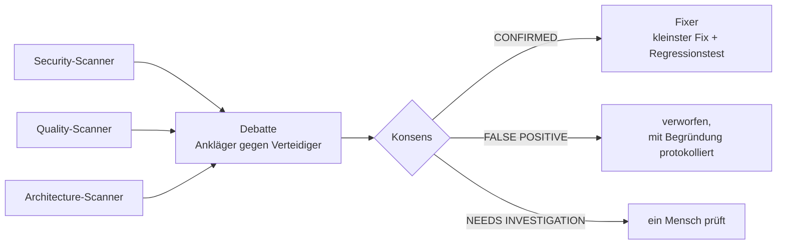

# S3.6 · Devil's Advocate: eine adversariale Prüf-Pipeline

<!-- meta:start -->
> **Regal:** [Gegenprüfung & Compliance](README.md#security) · **Stufe:** Kern · **~18 Min** · **Voraussetzungen:** [S3.4 Orchestrierungsmuster: Fan-out, Pipeline, Hierarchie](s3-04-orchestrierungsmuster.md)
>
> ← [S3.5 Hintergrund-Sitzungen und Agent Teams](s3-05-hintergrund-und-teams.md) · [Bibliothek](README.md) · [S3.7 Die eingebauten Reviews](s3-07-eingebaute-reviews.md) →
<!-- meta:end -->

## Schnellcheck

- Hast du schon einmal Sicherheitsbefunde von einem zweiten Agenten widerlegen lassen, bevor du sie behoben hast?
- Kannst du ohne Nachschlagen erklären, warum eine reine Mustersuche einen fail-open-Zugriffscheck kaum findet?

## Auf einen Blick

Eine Devil's-Advocate-Pipeline lässt Agenten gegeneinander arbeiten. Mehrere Scanner suchen parallel nach Problemen, in der Debatte greift ein Ankläger jeden Befund an und ein Verteidiger hält dagegen. Ein Konsens-Agent entscheidet, und nur bestätigte Befunde gehen an Fixer, die minimal patchen und einen Regressionstest schreiben. Die Debatte senkt Fehlalarme, schließt sie aber nicht aus.

🔧 Die Pipeline ist kein eingebauter Befehl, sondern ein Workshop-Plugin; die eingebauten Reviews stehen in [S3.7](s3-07-eingebaute-reviews.md). Die wichtigste Lektion hängt aber nicht am Plugin: Eine Mustersuche findet Muster. Ob eine Tür bei einem Datenbankfehler aufgeht, erkennt erst, wer die Fachlogik kennt.

## Bild im Kopf

Stell dir einen Penetrationstest deiner Zutrittsanlage mit eingebautem Tribunal vor. Der Pentester schreibt den Exploit-Bericht (Ankläger). Der Entwickler erklärt, was davon wirklich ausnutzbar ist und was nicht (Verteidiger). Der Sicherheitsverantwortliche entscheidet, was nachgebessert wird (Konsens). Das Patch-Team schließt die bestätigten Lücken (Fixer). Der ganze Ablauf läuft von allein und ist vollständig dokumentiert.

Die Scanner davor arbeiten wie ein physisches Sicherheitsaudit mit zwei unabhängigen Teams: Beide prüfen getrennt, danach vergleicht ihr die Befunde. Was beide gefunden haben, ist mit hoher Wahrscheinlichkeit echt.



## Im Detail

### Ein Workshop-Muster, kein eingebauter Befehl

> 🔧 **Workshop-Baustein:** Die Pipeline ist kein eingebauter Claude-Code-Befehl. Sie ist ein Muster aus dem Workshop-Plugin `devil-advocate-swarms`, das in keinem offiziellen Marketplace liegt, und zeigt, wie ein Multi-Agent-Review aussehen kann. Die eingebauten Alternativen stehen in [S3.7](s3-07-eingebaute-reviews.md).

Die Pipeline ist ein Multi-Agent-System, das Sicherheits- und Qualitätsprobleme findet und behebt. Sie bildet ein professionelles Security-Review nach, mit einem Unterschied: Sie läuft automatisch. Sie hat vier Stufen.

### Stufe 1: Scanner

Mehrere Scanner-Agenten analysieren den Code gleichzeitig aus verschiedenen Blickwinkeln:

- **Security-Scanner:** Injection-Lücken, fest eingetragene Zugangsdaten, unsichere Muster, fehlende Authentifizierung
- **Quality-Scanner:** Lücken in der Fehlerbehandlung, fehlende Eingabeprüfung, unsichere Typannahmen
- **Architecture-Scanner:** verletzte Vertrauensgrenzen, Wege zur Rechteausweitung, riskante Datenflüsse

Warum mehrere Scanner mit Überlappung? Finden zwei Scanner dasselbe Problem, ist es mit hoher Wahrscheinlichkeit echt. Findet einer etwas, das der andere übersieht, schau genau hin. Die Überlappung ist eine Bestätigung durch Übereinstimmung.

### Stufe 2: Debatte

Zu jedem Befund argumentieren zwei Agenten. Der **Ankläger** (Prosecutor) legt das Angriffsszenario vor:

> „Ein Angreifer kann über den Suchparameter beliebige Befehle einschleusen. Die Eingabe erreicht ohne Bereinigung einen Shell-Aufruf. Hier ist eine Proof-of-Concept-Payload."

Der **Verteidiger** (Defender) stellt den Befund infrage:

> „Die Eingabe wird gegen eine Whitelist erlaubter Zeichen geprüft, bevor sie diesen Codepfad erreicht. Die Prüfung weist alle Shell-Metazeichen ab. So, wie der Code geschrieben ist, lässt sich das nicht ausnutzen."

Der Ankläger argumentiert jeden Befund, als schriebe er einen Exploit-Bericht für einen zahlenden Kunden. Der Verteidiger sucht jeden Grund, warum der Befund in Wahrheit nicht ausnutzbar ist. Ein Befund übersteht die Debatte nur, wenn der Ankläger überzeugend gewinnt.

Die Debatte **senkt** Fehlalarme (False Positives), sie beseitigt sie nicht. Sie soll viele davon aussortieren, bevor ein Mensch sie ansieht. Wie viele, hängt von der Qualität der Prompts, der Wahl der Scanner und der Codebasis ab; gegen einen gelabelten Datensatz gemessen wurde das nicht. Behandle die Debatte als nützlichen adversarialen Filter, nicht als Garantie gegen Fehlalarme.

### Stufe 3: Konsens

Ein Konsens-Agent liest die ganze Debatte und entscheidet:

- **CONFIRMED:** echte Schwachstelle, kommt in die Warteschlange für Fixes
- **FALSE POSITIVE:** im Kontext nicht ausnutzbar, wird mit Begründung verworfen
- **NEEDS INVESTIGATION:** unklar, ein Mensch muss prüfen

Nur CONFIRMED-Befunde gehen weiter. Alles andere wird protokolliert; das ist dein Audit-Trail.

### Stufe 4: Fixer

Für jeden bestätigten Befund arbeitet ein Fixer-Agent so:

- Er liest den genauen Befund und den ganzen Verlauf der Debatte.
- Er setzt den **kleinsten gezielten Fix** um: kein Refactoring, keine Ausweitung des Auftrags.
- Er schreibt einen Regressionstest, der die Schwachstelle gefunden hätte.
- Er dokumentiert, warum der Fix korrekt ist.

### Das Übungsziel: fünf eingebaute Schwachstellen

Die Übung prüft `workshop-playground/access_control.py`. Die Datei enthält absichtlich fünf Schwachstellen:

| Schwachstelle | Ort | Was passiert |
|---|---|---|
| Command Injection | `backup_database()` | `subprocess.run(f"cp {DB_FILE} {filename}", shell=True)` mit ungeprüfter Eingabe aus dem CLI-Befehl `backup` |
| Fest eingetragenes Passwort | `ADMIN_PASSWORD = "admin123"` auf Modulebene | ein Geheimnis im Klartext, aber **toter Code**: Kein erreichbarer Anmeldeweg nutzt es |
| Path Traversal | `read_log()` | `open(f"logs/{log_name}")` ohne Bereinigung, erreichbar über den CLI-Befehl `read-log` |
| Fail-open-Zugriffslogik | `check_access_resilient()` | fehlt `users.json` oder ist die Datei kaputt, gibt die Funktion den Zutritt frei, statt sicher zu schließen |
| Log-Injection | `log_event()` | `username` und `action` landen ungefiltert im Log; ein Zeilenumbruch fälscht Einträge im Audit-Log |

Die Orte stehen als Funktionsnamen da, nicht als Zeilennummern, damit sie auch nach Änderungen an der Datei stimmen. Die Schwachstellen sind Lehrziel: Behebe sie nicht dauerhaft und committe keinen Fix, die nächste Runde braucht sie wieder.

Drei Befunde lehren mehr als Mustersuche:

- **Log-Injection ist kein Bonus.** In einer Anlage der physischen Sicherheit ist sie ein Fehler in der Integrität des Audit-Trails, und ein manipulierter Audit-Trail fällt klar unter **EN 50131** (Norm für Einbruchmeldeanlagen). Die Compliance-Tabelle dazu steht in [S3.11](s3-11-datenschutz-und-compliance.md).
- **Fail-open ist die Lektion über Fachurteil.** Hier gibt es keine Injection, kein Geheimnis und keinen Pfad, an dem sich ein Regex festhalten könnte. Nur wer Zutrittskontrolle kennt, sieht, dass „die Tür soll bei einem Ausfall weiter funktionieren" genau falsch herum ist: Eine Zutrittsanlage muss sicher schließen (fail-secure), wenn die Datenbank des Controllers fehlt. `check_access()` und `load_db()` im selben Programm verweigern bei einem Fehler, so ist es richtig.
- **Das Passwort zeigt, dass Erreichbarkeit die Schwere ändert.** Ein fest eingetragenes Geheimnis in totem Code ist ein echter Mangel. Eine kaputte Tür-Datenbank, die Zutritt gewährt, ist ein akuter Sicherheitsausfall.

Der zweite Playground `osdp_frame_decoder.c` ist ein vereinfachter Decoder für OSDP-Frames, wie er auf einem Zutritts-Controller laufen könnte. Er enthält vier absichtliche Speicherfehler, typisch für Firmware:

- Buffer Overflow in `decode_data_payload()`
- Integer Overflow in `compute_crc()` (die `uint8_t`-Arithmetik läuft über)
- Format String in `log_frame()`
- Off-by-one in `read_frame_crc()` (liest die CRC ein Byte hinter dem Frame-Ende)

## Selbst machen

### Übung: Security-Audit am Playground (etwa 25–30 Minuten)

**Form:** allein oder zu zweit.

**Ziel:** Adversariales Sicherheitstesten an echtem Code ausführen und sehen, was es findet.

**Vorbereitung:** Du nimmst `workshop-playground/access_control.py` mit seinen fünf eingebauten Schwachstellen (Tabelle in „Im Detail"). Du musst nichts einbauen.

> **🔧 Plugin nötig, sonst der Weg ohne Plugin.** Schritt 2 nutzt das Workshop-Plugin `devil-advocate-swarms`. Es liegt in keinem offiziellen Marketplace; im Live-Workshop stellt es die Moderation bereit. Prüf mit `claude plugin list`, ob es installiert ist. Fehlt es, **bleib nicht hängen**: Bitte Claude im Playground direkt um das Audit und spring zu Schritt 3:
>
> *„Audit access_control.py for security vulnerabilities — injection, hardcoded secrets, path traversal, log forging, and fail-open access-control logic — and explain each with severity."*
>
> So sind alle fünf Schwachstellen ebenfalls auffindbar; du siehst nur die Stufen Debatte und Konsens nicht. Der Rest der Übung (Bericht, Fix, `pytest`) ist gleich. `/security-review` hilft hier nicht: Es prüft nur die Änderungen deines Branches gegenüber dem Standard-Branch von `origin`, und auf einem frischen Klon gibt es keine ([S3.7](s3-07-eingebaute-reviews.md)).

**Schritt 1: den Playground öffnen**

```bash
cd workshop-playground/
ls access_control.py     # confirm you have the file
```

**Schritt 2: den Schwarm auf `access_control.py` ansetzen**

<!-- cockpit:example -->
```
/devil-advocate-swarms:swarm scan access_control.py
```

**Schritt 3: warten und zusehen**

Spring nicht vor. Beobachte jede Stufe:

- Scanner: Was hat jeder gefunden? Alle fünf eingebauten Probleme? Mehr?
- Debatte: Welche Befunde werden verhandelt? Wer gewinnt?
- Konsens: Wie viele CONFIRMED, wie viele FALSE POSITIVE?
- Fixer: Wie sieht der Fix für jeden bestätigten Befund aus?

Der Schwarm sollte alle fünf finden. Übersieht er den fail-open-Fehler, halte an und überleg, warum gerade dieser Befund Fachwissen aus der physischen Sicherheit braucht.

> ⚠️ **Erwarte kein glattes „5 von 5 CONFIRMED".** `ADMIN_PASSWORD` ist toter Code, kein Anmeldeweg erreicht es. Ein guter Verteidiger bringt genau das in der Debatte vor, deshalb kann das Passwort zu Recht als **CONFIRMED mit niedriger Schwere** oder sogar als **NEEDS INVESTIGATION** enden. Den fail-open-Fehler übersehen Muster-Scanner womöglich, weil er Fachlogik ist. Dieser Streit *ist* die Lektion: **Erreichbarkeit und Fachlogik ändern die Schwere.** Besprecht, warum.

**Schritt 4: einen Befund beheben, vorübergehend**

> 📌 **Das ist eine bewusste, erlaubte Ausnahme, und du nimmst sie zurück.** Die Regel des Playgrounds gilt: Der Stand auf `main` ist das Übungsmaterial, die eingebauten Schwachstellen müssen für die nächste Runde erhalten bleiben. Nur für diesen Schritt machst du eine kontrollierte, vorübergehende Ausnahme: Du siehst einen Fix landen, prüfst, dass er die Tests nicht bricht, und stellst das Original wieder her. **Committe den Fix nie.** Die Regel verbietet, Fixes zu *behalten*; hier spielst du einen ein, prüfst und nimmst ihn zurück.

Wähle **einen** der bestätigten Befunde und lass Claude den Fix in `access_control.py` umsetzen. Danach:

```bash
pytest -v   # run from the playground root — the baseline must stay green
```

Der Fix zählt nur, wenn die vorhandene Testsuite grün bleibt. Stell danach das Lehrziel wieder her:

```bash
git checkout -- access_control.py
```

> Willst du das Original gar nicht anfassen? Kopier es vorher (`cp access_control.py /tmp/fix-try.py`) und lass Claude die Kopie reparieren. Dann kannst du die vorhandenen Tests aber nicht gegen die Kopie laufen lassen, denn sie importieren `access_control`.

**Berichte:**

1. Wie viele der fünf Schwachstellen hat der Schwarm bestätigt, und in welcher Stufe?
2. Hat er beide fachlich wichtigen, nicht offensichtlichen Probleme gefunden: den fail-open-Zutritt in `check_access_resilient()` und die Log-Injection in `log_event()`?
3. Gab es Fehlalarme? Was hat der Verteidiger jeweils vorgebracht?
4. Welchen Befund hast du behoben, und bricht der Fix einen der vorhandenen Tests?

**Tipps:**

- Die Debatte ist der spannendste Teil. Lies die Argumente von Ankläger und Verteidiger.
- Manche Befunde enden als Fehlalarm; dort sollte der Verteidiger gewinnen.
- Übersieht der Schwarm eine der fünf Schwachstellen, ist auch das interessant: Warum?
- Achte auf den Regressionstest des Fixers. Prüft er das Richtige?

**Für die Security-Fachleute:** Dein Berufsinstinkt sagt dir, ob die Argumente des Anklägers realistisch sind. Sind die Angriffsszenarien in der Debatte plausibel? Würdest du eine CVE so schreiben? Wo bleibt die automatische Analyse hinter menschlichem Fachurteil zurück, wo erreicht oder übertrifft sie es?

> 🎯 **Scanner gegen Fachwissen.** Hat der Schwarm den fail-open-Fehler in `check_access_resilient()` (der Pfad `door-check`) gemeldet? Wenn nicht, ist genau das die Lektion: Ein automatischer Scan findet *Muster*, fail-open gegen fail-secure ist *Fachurteil*. Probier es aus: Führ im Playground `python access_control.py door-check eve` aus, solange es dort keine `users.json` gibt (sie entsteht erst, wenn du mit `add` jemanden anlegst), und sieh zu, wie der Zutritt gewährt wird. Erkläre dann, warum ein Datenbankfehler den Zutritt verweigern muss.

### Übung: einen Domänen-Parser richtig bauen (OSDP oder Wiegand, etwa 25–30 Minuten)

**Form:** allein oder zu zweit. **Priorität:** empfohlen (optional, aber für Entwickler von Zutrittskontrolle die wertvollste Übung).

**Ziel:** Mit TDD und dem Multi-Agent-Vorgehen einen *korrekten, grenzgeprüften* Parser für die physische Sicherheit bauen, das Gegenstück zum verwundbaren `workshop-playground/osdp_frame_decoder.c`.

**Hintergrund:** Im CTF unten sucht der Schwarm die eingebauten Speicherfehler in `osdp_frame_decoder.c`: Buffer Overflow, Integer Overflow, Format String, Off-by-one. Diese Übung dreht es um. Statt Fehler im Parser von jemand anderem zu finden, **baust du selbst einen sicheren, testgetrieben**. Hier trifft das abstrakte Material zu TDD und Multi-Agent-Arbeit auf dein Fachgebiet.

Nimm **eine** Variante; beide nutzen dieselbe Schleife Red → Green → Refactor.

**Bild dazu:** Ein Parser zwischen Leser und Controller ist der Schließzylinder des ganzen Systems. Liest er einen Frame falsch, geht die falsche Person durch die falsche Tür. Eine Berechtigung parst man nicht „meistens".

#### Variante A: den OSDP-Frame-Decoder härten

**Ziel:** Einen grenzgeprüften OSDP-Frame-Parser bauen, den der Schwarm nicht mehr knackt.

**1. Red: zuerst die Tests.** Lass Claude eine Testsuite schreiben (oder schreib sie selbst und lass Claude sie erweitern), und zwar gegen die *echte* OSDP-Frame-Form aus dem Kopfkommentar von `workshop-playground/osdp_frame_decoder.c`: SOM `0x53`, ADDR vor einem 16-Bit-LEN in Little Endian, CRC-16/CCITT. Abzudecken sind: ein gültiger Minimal-Frame; ein `LEN`, das größer ist als der Puffer (der Buffer-Overflow-Fall); leere oder ungerade lange Hex-Eingabe (der Fall, gegen den `main()` gehärtet ist); ein Frame, dessen CRC am letzten Byte sitzt (der Off-by-one-Fall). Gegen einen frischen Parser laufen die Tests rot.

```
   /plan  Build a bounds-checked OSDP frame parser in osdp_safe.c that passes these tests,
          rejecting malformed frames instead of reading out of bounds.
```

**2. Green.** Lass Claude `osdp_safe.c` umsetzen, bis die Tests grün sind. Besteh auf einer ausdrücklichen Längenprüfung vor jedem `memcpy` und jedem Indexzugriff.

**3. Refactor und adversariale Gegenprobe.** Setz den Devil's-Advocate-Schwarm auf dein neues `osdp_safe.c` an, oder `/security-review`, sobald der neue Parser als Änderung auf einem eigenen Branch liegt. Ein sauberer Parser sollte denselben Schwarm überstehen, der das Original zerlegt hat.

**4. Property-based Fuzzing (Bonus).** Lass Claude einen Property-Test ergänzen, der `LEN` über `0..65535` variiert und prüft, dass der Parser nie über die Eingabe hinaus liest. Diesen Test hätte das Original nicht bestanden.

#### Variante B: ein Wiegand-26-Parser mit TDD

**Ziel:** Eine 26-Bit-Wiegand-Berechtigung testgetrieben parsen: 1 führendes Bit für gerade Parität, 8 Bit Facility Code, 16 Bit Kartennummer, 1 abschließendes Bit für ungerade Parität.

1. **Red.** Zuerst die Tests: gerade Parität über die ersten 13 Bits, ungerade Parität über die letzten 13 Bits, Facility `0..255`, Karte `0..65535` und ausdrückliche Fehlerfälle (falsche Parität, falsche Bitlänge). Laufen lassen: rot.
2. **Green.** Setz `parse_wiegand26(bits)` um, bis alles grün ist. **Weise** bei falscher Parität **ab**, statt es „nach bestem Bemühen" zu versuchen: Ein falsch gelesenes Paritätsbit heißt falsche Berechtigung, also die falsche Person an der Tür.
3. **Refactor.** Lass Claude vereinfachen und die Suite erneut laufen.
4. **Einen Fehler einbauen (Bonus).** Lass Claude die Paritätsprüfung vertauschen (gerade ↔ ungerade) und prüf, dass dein Test das merkt. Merkt er es nicht, sind deine Tests noch nicht stark genug; das ist die Lektion.

**Geschafft, wenn:**

- [ ] du die Tests **vor** der Umsetzung geschrieben hast (erst rot, dann grün)
- [ ] der Parser fehlerhafte Eingaben (zu großes `LEN`, falsche Parität, falsche Länge) **abweist**, statt über das Ende hinaus zu lesen oder zu raten
- [ ] (Variante A) der adversariale Schwarm oder `/security-review` in deinem gehärteten Parser nichts findet
- [ ] (Bonus) deine vorhandenen Tests einen absichtlich eingebauten Fehler finden

**Tipps:**

- Die verwundbare Vorlage ist `workshop-playground/osdp_frame_decoder.c`. Lies ihren Kopfkommentar für die *echte* OSDP-Frame-Form; die Struktur im Code ist absichtlich vereinfacht.
- Leg Parser und Tests in eigene Wegwerf-Dateien (`osdp_safe.c` oder `wiegand.py`). Du **ergänzt** sauberen Code neben dem Playground, du reparierst nicht die absichtlichen Schwachstellen an Ort und Stelle.
- Es geht nicht um einen perfekten Parser in 25 Minuten. Es geht um den Unterschied zwischen „Claude hat Code geschrieben" und „Claude hat Code geschrieben, der eine fachkundige Testsuite besteht, die *du* vorher festgelegt hast".

### Extra-Übungen (optional)

Wettkampf-, Fach- und Team-Formate, gut für Energie nach einem dichten Block. ⚠️ Es gilt dieselbe Regel wie oben: Die Schwachstellen im Playground sind Lehrziel, **committe keine Fixes**.

#### 🏴 Capture-the-Vulnerability-CTF (etwa 20 Minuten, wild)

**Ziel:** Adversariale Analyse als Spiel auf Zeit: menschliches Urteil gegen Agenten-Scan.
**Bild dazu:** ein interner Pentest an der Zutrittsanlage; der Devil's-Advocate-Schwarm ist das adversariale Pentest-Team.

1. **Runde 1 (ohne Claude):** Die Teams listen jede Schwachstelle, die sie mit bloßem Auge in `access_control.py` und `osdp_frame_decoder.c` finden. Jede zählt eine Flagge.
2. **Runde 2 (mit Claude oder dem Schwarm):** Punkte für die *neuen*, die ihr übersehen habt.
3. **Runde 3 (doppelte Punkte):** Erklärt den Off-by-one in `read_frame_crc()`, also *warum* `raw[frame_len]` ein Byte hinter dem Ende liegt, **und** findet den fail-open-Fehler in `check_access_resilient()`, den ein Scanner meist übersieht. Nichts reparieren (Playground-Regel).

#### ⚖️ Devil's-Advocate-Duell (etwa 15 Minuten, wild)

**Ziel:** Das Urteil über Anklage, Verteidigung und Schwere trainieren, das die Debattenstufe des Schwarms automatisiert.
**Bild dazu:** ein Audit-Befund, den Pentester und Anlagenbetreiber miteinander aushandeln.

1. Der Fall: `ADMIN_PASSWORD = "admin123"`, ein fest eingetragenes Geheimnis in **totem Code** (nie erreicht).
2. **Spieler A (Ankläger):** 90 Sekunden dafür, dass der Befund CONFIRMED mit hoher Schwere ist.
3. **Spieler B (Verteidiger):** 90 Sekunden für Fehlalarm, nicht erreichbar, niedrige Schwere.
4. Claude ist Richter: Bitte Claude um ein Urteil mit Schweregrad und Begründung. Aha: Erreichbarkeit *ändert* die Schwere, genau die Lektion aus der ersten Übung.

#### 📋 Audit-Trail-Integrität (EN 50131, etwa 20 Minuten, mittel)

**Ziel:** Die Log-Fälschung erst ausnutzen, dann beheben, mit der Compliance-Geschichte dazu.
**Bild dazu:** Wer den Audit-Trail fälscht, bricht die Beweiskette.

1. Auf einer **Kopie** von `access_control.py`: Leg mit `add` einen Nutzer an, dessen Name einen Zeilenumbruch und eine gefälschte Logzeile enthält. Prüf, dass `logs/access.log` jetzt einen falschen Admin-Eintrag hat (`log_event` schreibt `username` und `action` ungefiltert).
2. Erkläre den Bezug zu **EN 50131**: Die Integrität des Audit-Trails ist eine regulatorische Anforderung, kein Extra (Compliance-Tabelle in [S3.11](s3-11-datenschutz-und-compliance.md)).
3. Fix: Zeilenumbrüche in `log_event` bereinigen. Beweise es mit einem Test (`pytest` grün auf der Kopie).
4. Bonus: ein PostToolUse-Hook, der Logzeilen meldet, die nicht der erwarteten Form `timestamp | action | user | status` entsprechen ([S2.8](s2-08-hook-einrichten.md)).

## Typische Fallen

- **Der Schwarm meldet Dinge, die keine Schwachstellen sind.** Genau dafür gibt es die Debatte: Ohne sie würdest du auf Rauschen reagieren. Lies nach, was der Verteidiger vorgebracht hat.
- **Der Schwarm übersieht eine eingebaute Schwachstelle.** Automatische Werkzeuge haben blinde Flecken, kombiniere sie mit menschlichem Review. Fehlt der fail-open-Fehler, untersuch `check_access_resilient()` von Hand und verbinde ihn mit fail-secure-Zutrittskontrolle.
- **Die Fixes bleiben liegen.** Die Fixer und Schritt 4 der Übung ändern `access_control.py`. Setz die Datei mit `git checkout -- access_control.py` zurück und committe nie einen Fix, sonst fehlt der nächsten Runde das Lehrziel.
- **`backup` scheitert unter Windows.** Die Command Injection steckt in `backup_database()`, und die ruft den Unix-Befehl `cp` auf, den es unter Windows nicht gibt. Der Schwarm findet die Schwachstelle trotzdem **statisch**, denn es zählt das gefährliche Muster (`subprocess.run` mit `shell=True` und ungeprüfter Eingabe). Für eine Ausnutzung live öffne Git Bash oder WSL; für die Lektion reicht der statische Befund.

## Check

Du kannst die vier Stufen der Devil's-Advocate-Pipeline benennen, erklären, warum die Debatte Fehlalarme senkt, aber keine feste Quote verspricht, und am Playground zeigen, warum Erreichbarkeit und Fachlogik die Schwere eines Befunds ändern.

1. Warum ist ein Befund glaubwürdiger, wenn zwei Scanner ihn unabhängig voneinander finden?
2. Welche drei Urteile kann der Konsens-Agent fällen, und was passiert danach jeweils mit dem Befund?
3. Warum übersieht eine Mustersuche den fail-open-Fehler in `check_access_resilient()` leicht, und warum wiegt er in einer Zutrittsanlage trotzdem schwer?

<details><summary>Quizfrage</summary>

**Frage:** Welche Aussage über die Debatte in der Devil's-Advocate-Pipeline stimmt?

- **Richtig:** Sie senkt Fehlalarme, weil Ankläger und Verteidiger jeden Befund abwägen, beseitigt sie aber nicht; wie stark, hängt von Prompts, Scannern und Codebasis ab.
- Falsch: Sie garantiert, dass am Ende keine Fehlalarme übrig bleiben, weil Ankläger und Verteidiger einander vollständig kontrollieren und jede Lücke gemeinsam abdecken.
- Falsch: Gewinnt der Ankläger, gilt der Befund sofort als CONFIRMED; der Konsens-Agent entscheidet nur die Fälle, in denen die Debatte unentschieden endet.
- Falsch: Sie läuft nur für kritische Befunde mit hoher Schwere; alle anderen Befunde gehen von den Scannern direkt und ohne Debatte an die Fixer-Agenten.

</details>

## Weiterlesen

- [Subagenten](https://code.claude.com/docs/en/sub-agents)
- [Sicherheit in Claude Code](https://code.claude.com/docs/en/security)
- [S3.7 · Die eingebauten Reviews](s3-07-eingebaute-reviews.md)
- [S3.4 · Orchestrierungsmuster: Fan-out, Pipeline, Hierarchie](s3-04-orchestrierungsmuster.md)
- [S3.11 · Datenschutz, Aufbewahrung und regulierte Branchen](s3-11-datenschutz-und-compliance.md)
- [S1.14 · Plan-Modus und schrittweises Vorgehen](s1-14-plan-modus.md)
- [S4.5 · CI-Pipelines bauen mit GitHub Actions und GitLab](s4-05-ci-pipelines.md)
- [S3.15 · Praxis-Station Session 3: eine Übung wählen](s3-15-praxis-station-3.md)
