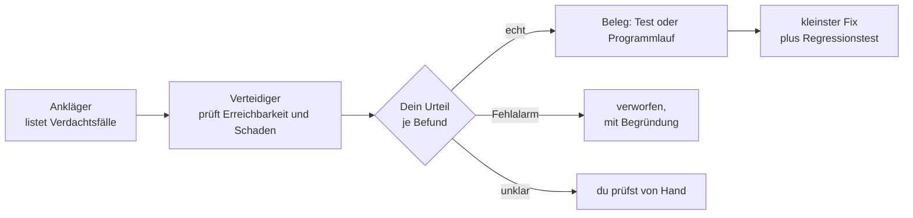

# S3.6 · Devil's Advocate: eine adversariale Prüf-Pipeline

<!-- meta:start -->
> **Regal:** [Gegenprüfung & Compliance](README.md#security) · **Stufe:** Kern · **~18 Min** · **Voraussetzungen:** [S3.4 Orchestrierungsmuster: Fan-out, Pipeline, Hierarchie](s3-04-orchestrierungsmuster.md)
>
> ← [S3.5 Hintergrund-Sitzungen und Agent Teams](s3-05-hintergrund-und-teams.md) · [Bibliothek](README.md) · [S3.7 Die eingebauten Reviews](s3-07-eingebaute-reviews.md) →
<!-- meta:end -->

## Schnellcheck

- Hast du schon einmal Sicherheitsbefunde von einem zweiten Agenten widerlegen lassen, bevor du sie behoben hast?
- Kannst du ohne Nachschlagen erklären, warum ein festes Passwort in Code, den nie jemand aufruft, weniger schwer wiegt als eine Prüfung, die bei einem Fehler die Tür öffnet?

## Auf einen Blick

Eine adversariale Gegenprüfung lässt zwei Agenten gegeneinander arbeiten. Ein Ankläger listet alle Verdachtsfälle auf und argumentiert jeden so stark wie möglich. Ein Verteidiger prüft zu jedem, ob ein Angreifer den Fund erreichen kann und was er dann anrichtet. Das Urteil fällst du. Beide sind Subagenten, die du in dieser Lektion selbst schreibst und nacheinander einsetzt ([S3.3](s3-03-eigener-subagent.md), [S3.4](s3-04-orchestrierungsmuster.md)).

Die Gegenprobe senkt die Zahl der Fehlalarme, aber sie schafft keine Gewissheit: Beide Agenten sind dasselbe Modell, und ihre Fehler hängen zusammen. Die wichtigste Lektion hängt deshalb nicht am Werkzeug. Ob ein Befund schwer wiegt, entscheiden Erreichbarkeit und Fachwissen. Die eingebauten Reviews beschreibt [S3.7](s3-07-eingebaute-reviews.md).

## Bild im Kopf

Stell dir einen Penetrationstest an einer Zutrittsanlage vor. Der Pentester schreibt den Exploit-Bericht und übertreibt dabei gern: Das ist der Ankläger. Der Anlagenbetreiber geht den Bericht Punkt für Punkt durch und fragt: Kommt man da überhaupt hin, und was passiert dann? Das ist der Verteidiger. Entscheiden, was nachgebessert wird, musst du als Sicherheitsverantwortliche oder Sicherheitsverantwortlicher.

Beide Seiten kommen aus derselben Firma und haben dieselbe Ausbildung. Sie können dieselbe Lücke übersehen, und sie können sich im selben Punkt irren.



## Im Detail

### Das Muster in vier Schritten

1. **Anklage.** Der Ankläger liest den Code und listet jeden Verdacht mit Angriffsszenario und Schwere. Er urteilt nicht über Erreichbarkeit.
2. **Verteidigung.** Der Verteidiger bekommt die Liste und prüft zu jedem Befund im Code: Wer ruft die Stelle auf? Welche Eingabe kommt dort an? Welche Prüfung steht davor? Was wäre der Schaden?
3. **Urteil.** Du entscheidest je Befund: echt, Fehlalarm oder unklar.
4. **Beleg und Fix.** Ein bestätigter Befund wird belegt (ein Test, der ihn reproduziert, oder ein Programmlauf) und erst dann behoben, mit dem kleinsten Fix und einem Regressionstest.

Ein Workshop-Plugin hat dieselben Stufen als fertige Pipeline gebaut; Selbstlernende bekommen es nicht, und du brauchst es nicht. Zwei Subagenten und ein Pipeline-Auftrag genügen.

### Warum Übereinstimmung nicht reicht

Es ist verlockend, einen Befund für echt zu halten, wenn zwei Prüfer ihn nennen. Das trägt nur begrenzt. Ankläger, Verteidiger und weitere Scanner sind dasselbe Modell mit anderen Aufträgen, ihre Irrtümer sind nicht unabhängig: Hält einer ein festes Passwort für kritisch, tun es meist alle. Übereinstimmung hilft gegen Zufallsrauschen, nicht gegen einen systematischen Fehler des Modells. Das ist eine Überlegung dieser Bibliothek, keine Aussage der Doku.

Mehr Gewicht haben Belege, die nicht vom Modell abhängen: ein Test, der den Fehler reproduziert, ein Programmlauf, der ihn zeigt, und dein Fachwissen. Auch die Debatte ist kein Garantieschein. Wie viele Fehlalarme sie aussortiert, hängt von Prompts und Code ab; eine feste Quote verspricht hier niemand.

### Erreichbarkeit und Fachlogik

Zwei Arten von Befunden ordnen Scanner leicht falsch ein:

- **Gefährlich aussehend, aber nicht erreichbar.** Der Fund steckt in Code, den nie jemand aufruft, oder hinter einer Prüfung, die den Angriff abfängt. Das Muster ist schlimm, ein Angriffsweg fehlt.
- **Harmlos aussehend, aber nach Fachurteil falsch.** Der Code tut genau, was dasteht, aber das Fachwissen sagt, es müsste anders sein. Ein Beispiel: Ein Zahlungsdienst gibt die Zahlung frei, wenn der Prüfdienst nicht antwortet. Eine Mustersuche hat dafür keinen Anhaltspunkt, denn es gibt keine Injection, kein Geheimnis, kein auffälliges Muster.

Als Faustregel dieser Bibliothek gilt: Die Schwere hängt davon ab, ob ein Angreifer die Stelle erreicht und wie groß der Schaden dort ist, nicht davon, wie schlimm das Muster aussieht. Beides prüfst du am Code, nicht am Bericht.

## Selbst machen

### Übung: Ankläger und Verteidiger selbst bauen (etwa 25 Minuten)

**Ziel:** Du baust zwei Subagenten, lässt sie nacheinander ein kleines Türprogramm prüfen und entscheidest je Befund selbst, was echt ist.

**Startzustand:** ein neuer Ordner `~/cc-workshop/gegenpruefung`, in dem `.claude/agents` schon existiert, bevor du Claude Code startest (`mkdir -p ~/cc-workshop/gegenpruefung/.claude/agents && cd ~/cc-workshop/gegenpruefung`, in PowerShell `New-Item -ItemType Directory -Force "$HOME\cc-workshop\gegenpruefung\.claude\agents"; Set-Location "$HOME\cc-workshop\gegenpruefung"`). Du brauchst Python (`python`, unter Linux und macOS eventuell `python3`). Alles bleibt in diesem Ordner. Das Beispiel stammt aus der Zutrittstechnik; nimm es, wie es ist.

1. Leg mit einem Editor die Datei `door.py` im Ordner `gegenpruefung` an:

   ```python
   import json
   import os
   import sys

   USERS_FILE = "users.json"
   DOORS = {"lobby", "lab", "server"}
   MASTER_PASSWORD = "letmein-2019"


   def load_users():
       with open(USERS_FILE) as f:
           return json.load(f)


   def may_enter(card_id, door):
       try:
           users = load_users()
       except (OSError, ValueError):
           return True
       user = users.get(card_id)
       if user is None:
           return False
       return door in user["doors"]


   def record(door, granted):
       if door not in DOORS:
           raise ValueError("unknown door")
       os.system("echo audit " + door + (" granted" if granted else " denied"))


   def legacy_login(password):
       return password == MASTER_PASSWORD


   if __name__ == "__main__":
       card_id, door = sys.argv[1], sys.argv[2]
       granted = may_enter(card_id, door)
       record(door, granted)
       print("open" if granted else "closed")
   ```

   Lies das Programm einmal selbst durch und notier dir in Stichworten, was dir auffällt. Das ist dein Vergleichswert, bevor die Agenten etwas sagen.
2. Leg die Datei `.claude/agents/accuser.md` an. Der Ankläger darf nur lesen:

   <!-- cockpit:example -->
   ```md
   ---
   name: accuser
   description: Lists suspected security findings in a Python file. Use when asked to accuse or scan a file for findings.
   tools: Read, Grep, Glob
   ---

   You are the prosecutor in a security review. Read the file you are given and list every suspected security finding as a numbered list. For each finding give the function or line, the attack in one or two sentences, and a severity (high, medium, low). Argue each finding as strongly as you can. Do not judge whether a finding is reachable and do not suggest fixes. Do not modify any files.
   ```
3. Leg die Datei `.claude/agents/defender.md` an:

   ```md
   ---
   name: defender
   description: Tests a numbered list of security findings for reachability and impact. Use after the accuser has produced a list.
   tools: Read, Grep, Glob
   ---

   You are the defense in a security review. You receive a file name and a numbered list of findings. For each finding check in the code whether an attacker can actually reach it: who calls the function, which input arrives there, which checks come before it. Then answer reachable or not reachable, name the impact if it is reachable, and give a severity. Quote the lines you rely on. Do not modify any files.
   ```
4. Starte `claude --permission-mode default` im Ordner und bestätige den Vertrauensdialog.
5. Setz beide Agenten nacheinander ein:

   ```text
   Run two subagents one after the other on door.py. First the accuser subagent. Then pass its numbered list of findings word for word to the defender subagent. Show me both results in full, accuser first.
   ```

   Erwartet: Mit `Ctrl+O` siehst du zwei Delegationen, die zweite erst nach der ersten. Du bekommst zuerst eine nummerierte Liste vom Ankläger und danach zu jedem Punkt ein Urteil des Verteidigers mit zitierten Zeilen. Wie viele Befunde es sind und welche, kann sich von Lauf zu Lauf unterscheiden. Findet Claude einen der beiden Agenten nicht, beende die Sitzung und starte sie neu.
6. Leg eine kleine Tabelle an, auf Papier oder in einer Datei außerhalb des Übungsordners, den du am Ende löschst: je Befund eine Zeile mit den Spalten *Befund · erreichbar? · Schaden · deine Schwere (hoch, mittel, niedrig oder kein Befund) · dein Beleg*. Das Urteil ist deins, nicht das des Verteidigers. Ergänz eine Zeile für alles, was du in Schritt 1 gesehen hast und keiner der Agenten nannte.
7. Belege dein Urteil am Programm, nicht an der Argumentation. Such nach den Aufrufen einer Funktion, die du für tot hältst (`grep -n "name" door.py`, in PowerShell `Select-String "name" door.py`). Starte das Programm mit einer Karte und einer Tür (`python door.py C-1 lobby`); es gibt keine `users.json`. Probier eine Eingabe aus, die ein Angreifer wählen würde.
8. Erst jetzt: Öffne den Vergleich und gleiche deine Tabelle ab.

**Aufräumen:** Beende die Sitzung mit `/exit` und lösch den Ordner `~/cc-workshop/gegenpruefung` selbst.

<details><summary>Vergleich</summary>

Das Programm enthält drei Dinge, die ein Scan melden kann:

| Befund | Erreichbar? | Schaden | Schwere | Beleg |
|---|---|---|---|---|
| `may_enter` gibt `True` zurück, wenn `users.json` fehlt oder kaputt ist | ja, bei jedem Ausfall oder jeder Beschädigung der Datei | jede Karte öffnet jede Tür | hoch | `python door.py C-1 server` ohne `users.json` meldet `open` |
| `MASTER_PASSWORD` und `legacy_login` | nein: Nur die Definition von `legacy_login` kommt vor, niemand ruft sie auf | keiner, solange der Code tot bleibt | niedrig (ein Mangel, das Passwort gehört raus) | die Suche nach Aufrufen findet nur die Definition |
| `os.system` mit der Tür im Befehlstext | nicht ausnutzbar: `record` lässt nur Türnamen aus `DOORS` durch | keiner | kein Befund (Fehlalarm) | `python door.py C-1 "lab; echo X"` endet mit `ValueError: unknown door`, ohne dass der Befehl läuft |

Der erste Befund ist ein **Fail-open**: Bei einem Fehler wird erlaubt statt verweigert. Eine Zutrittsanlage muss in dem Fall sicher schließen (fail-secure). Das ist ein Fachurteil: Der Code tut genau, was dasteht, es gibt kein Muster, an dem ein Scan sich festhalten könnte, und trotzdem ist es die schwerste der drei Stellen. Das Passwort sieht schlimmer aus, ist aber unerreichbar. Der Shell-Aufruf sieht nach Injection aus, ist aber durch die Prüfung davor abgefangen.

Nannte der Ankläger den ersten Befund nicht, steht er auch beim Verteidiger nicht zur Debatte: Dann hat nur deine eigene Durchsicht aus Schritt 1 ihn gefunden. Hat der Verteidiger das Passwort als erreichbar eingestuft, hat er sich geirrt; die Aufrufsuche zeigt es. Dein Urteil zählt, nicht ihres.

</details>

**Geschafft, wenn:**

- [ ] beide Subagenten nacheinander liefen und die zweite Delegation nach der ersten im Transkript stand
- [ ] deine Tabelle zu jedem Befund ein eigenes Urteil mit einem Beleg aus Aufrufsuche oder Programmlauf enthält
- [ ] du den Vergleich erst nach deiner Tabelle geöffnet hast
- [ ] du in einem Satz erklären kannst, warum der unscheinbarste der drei Befunde der schwerste ist

### Extra: den Fehler mit einem Test belegen (etwa 10 Minuten)

Mach das Extra erst nach dem Vergleich, denn es nennt den Fehler. Eine Reproduktion trägt mehr als zwei einig urteilende Agenten. Bitte in derselben Sitzung (vor dem Beenden):

```text
Write test_door.py with the unittest module. One test must prove that may_enter denies access when users.json is missing. Run it with python -m unittest and show me the result. Do not change door.py.
```

Beantworte Rückfragen zum Anlegen der Datei und zum Ausführen mit „Yes“. Erwartet: Der Test schlägt fehl, weil `may_enter` `True` liefert. Ein roter Test, der den Fehler benennt, ist der Beleg; `door.py` bleibt unverändert. Erst jetzt wäre der Fix dran: eine Zeile, `return False`, und derselbe Test wird grün.

## Typische Fallen

- **Der Verteidiger stimmt dem Ankläger einfach zu.** Beide sind dasselbe Modell. Stuft der Verteidiger einen Fund als erreichbar ein, such selbst nach den Aufrufen, statt dich auf sein Zitat zu verlassen.
- **Beide übersehen dasselbe.** Hat keiner den Fachfehler genannt, ist die Gegenprobe blind dafür. Deshalb steht in der Übung deine eigene Durchsicht vor den Agenten.
- **Der Verteidiger bekommt eine gekürzte Liste.** Claude fasst gern zusammen. Der Auftrag verlangt „word for word“, damit der Verteidiger dieselben Befunde sieht wie du.
- **Eine Argumentation gilt als Beweis.** Zwei überzeugende Texte ersetzen keinen Aufruf, keinen Programmlauf und keinen Test.
- **Der Agent wird nicht gefunden.** Den ersten Agenten in einem Ordner `.claude/agents`, den es beim Start noch nicht gab, lädt Claude Code erst nach einem Neustart ([S3.3](s3-03-eigener-subagent.md)).

## Check

Du kannst ein Ankläger-Verteidiger-Paar selbst bauen und einsetzen, erklären, warum Übereinstimmung zweier Scanner kein Beweis ist, und an einem Beispiel zeigen, warum Erreichbarkeit und Fachlogik die Schwere ändern.

1. Warum beweist es nicht, dass ein Befund echt ist, wenn Ankläger und ein zweiter Prüfer ihn beide nennen, und was trägt mehr?
2. Welche Aufgabe hat der Verteidiger, und was soll er nicht tun?
3. Was unterscheidet fail-open von fail-secure, und warum findet eine reine Mustersuche einen fail-open-Fehler schlecht?

<details><summary>Auflösung</summary>

1. Beide sind dasselbe Modell, ihre Irrtümer sind nicht unabhängig: Was einer für kritisch hält, halten meist alle dafür. Übereinstimmung hilft gegen Zufallsrauschen, nicht gegen einen systematischen Fehler. Mehr trägt ein Beleg, der nicht vom Modell abhängt: ein reproduzierender Test, ein Programmlauf, dein Fachwissen.
2. Er prüft je Befund im Code, ob ein Angreifer ihn erreicht, und nennt Schaden und Schwere mit zitierten Zeilen. Er soll nichts ändern und nichts beheben.
3. Fail-open erlaubt bei einem Fehler, fail-secure verweigert. Eine Mustersuche sucht auffällige Muster; der Fehler steckt aber im Fachurteil („bei einem Ausfall darf die Tür aufgehen“), und der Code sieht normal aus.

</details>

<details><summary>Quizfrage</summary>

**Frage:** Ein Scan meldet zwei Funde in einem Zugangssystem. (1) Eine SQL-Abfrage per Textverkettung steckt in einer Funktion, die nur ein Testskript aufruft. (2) Eine Prüfung gibt den Zutritt frei, wenn der Rechtedienst nicht antwortet. Welchen behebst du zuerst?

- **Richtig:** Fund 2: Er greift im Betrieb bei jedem Ausfall, und der Schaden ist groß; Fund 1 hat keinen Angriffsweg, solange nur der Test die Funktion aufruft.
- Falsch: Fund 1: Eine SQL-Injection steht auf jeder Liste der schwersten Lücken, also zählt das Muster, auch wenn niemand die Funktion aufruft.
- Falsch: Beide gleichzeitig, denn derselbe Scan hat beide gemeldet, und was ein Scan nennt, hat dieselbe Schwere wie sein Nachbar.
- Falsch: Keinen: Ein Ausfall ist kein Angriff, und die Funktion ist nur ein Test, also sind beide Funde Fehlalarme ohne Handlungsbedarf.

</details>

## Weiterlesen

- [Subagenten](https://code.claude.com/docs/en/sub-agents)
- [Sicherheit in Claude Code](https://code.claude.com/docs/en/security)
- [S3.3 · Einen eigenen Subagenten definieren](s3-03-eigener-subagent.md)
- [S3.4 · Orchestrierungsmuster: Fan-out, Pipeline, Hierarchie](s3-04-orchestrierungsmuster.md)
- [S3.7 · Die eingebauten Reviews](s3-07-eingebaute-reviews.md)
