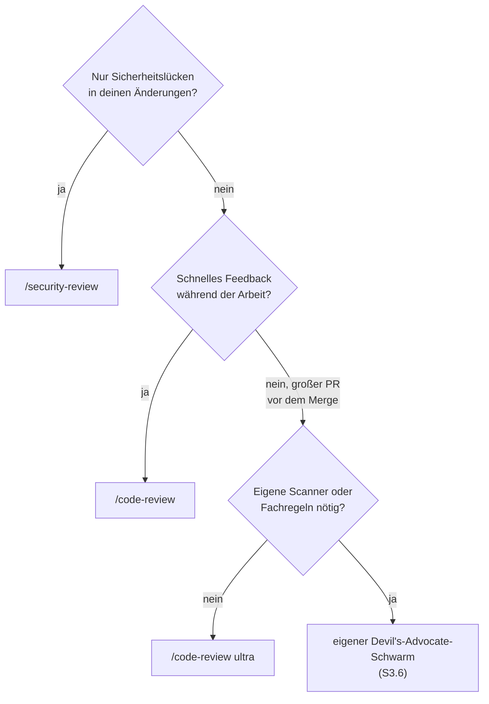

# S3.7 · Die eingebauten Reviews

<!-- meta:start -->
> **Regal:** [Gegenprüfung & Compliance](README.md#security) · **Stufe:** Kern · **~12 Min** · **Voraussetzungen:** [S1.16 Git in einem Fluss: Branch, Commit, PR](s1-16-git-in-einem-fluss.md)
>
> ← [S3.6 Devil's Advocate: eine adversariale Prüf-Pipeline](s3-06-devils-advocate.md) · [Bibliothek](README.md) · [S3.8 Rechte für autonome Läufe](s3-08-rechte-fuer-autonomie.md) →
<!-- meta:end -->

## Schnellcheck

- Hast du `/security-review` schon einmal vor einem Merge auf einem Branch laufen lassen und die Befunde bewertet?
- Kannst du ohne Nachschlagen sagen, was `/code-review ultra` anders macht als ein lokales `/code-review` (Ort, Zahl der Prüfer)?

## Auf einen Blick

Claude Code bringt drei Reviews mit, die ohne Einrichtung laufen. `/security-review` prüft die Änderungen deines Branches auf Sicherheitslücken. `/code-review` (Alias `/review`) sucht lokal nach Fehlern im aktuellen Diff, in einem PR, einem Branch oder einem Pfad. `/code-review ultra` (Alias `/ultrareview`) schickt eine Flotte von Prüf-Agenten in eine Cloud-Sandbox und lässt jeden Befund unabhängig nachprüfen.

Fang mit diesen an. Ein eigenes adversariales Setup wie der Devil's-Advocate-Schwarm aus [S3.6](s3-06-devils-advocate.md) lohnt sich erst, wenn du bestimmte Scanner, eigene Prompts oder Fachregeln brauchst.

## Bild im Kopf

Denk an die Prüfstufen einer Zutrittsanlage. `/security-review` ist die Routine-Sicherheitsprüfung: Nach jedem Umbau schaut jemand gezielt nach, ob eine neue Lücke entstanden ist. `/code-review` ist die Abnahme durch die Projektleitung: Funktioniert, was gebaut wurde? `/code-review ultra` ist der unabhängige Drittprüfer: Ein externes Team kommt mit mehreren Prüfern, stellt jeden Befund nach und meldet nur, was es selbst reproduzieren konnte.

Den eigenen Devil's-Advocate-Schwarm holst du dir wie ein beauftragtes Pentest-Team mit eigenem Prüfkatalog: wenn die Standardprüfungen dein Fachgebiet nicht abdecken.



## Im Detail

### Drei Reviews, ohne Einrichtung

| Befehl | Wo er läuft | Was er prüft |
|---|---|---|
| `/security-review` | lokal | die Änderungen deines Branches gegenüber dem Standard-Branch von `origin`, auf Risiken wie Injection, Auth-Probleme und offengelegte Daten; braucht ein `origin`-Remote |
| `/code-review` (Alias `/review`) | lokal, als Subagent im Hintergrund | Korrektheitsfehler im aktuellen Diff oder in einem PR, Branch oder Pfad, den du übergibst; je nach Modell und Effort auch Möglichkeiten zum Aufräumen |
| `/code-review ultra` (Alias `/ultrareview`) | in einer Cloud-Sandbox bei Anthropic | eine Flotte von Prüf-Agenten untersucht Branch oder PR parallel; jeder gemeldete Befund wird unabhängig reproduziert und geprüft |

Ohne Ziel prüft `/code-review` die Commits deines Branches, die seinem Upstream voraus sind, und alle nicht committeten Änderungen. Mit einer PR-Nummer wie `/code-review 1234` prüft es stattdessen diesen Pull Request. Der Review läuft im Hintergrund; die Befunde kommen in deine Unterhaltung, sobald er fertig ist.

`/code-review ultra` ist eine Research Preview. Es braucht eine Anmeldung mit einem claude.ai-Konto und steht auf Amazon Bedrock, Google Cloud's Agent Platform, Microsoft Foundry und in Organisationen mit Zero Data Retention nicht zur Verfügung; dort läuft stattdessen ein lokaler Review. Vor dem Start zeigt ein Dialog den Umfang, die verbleibenden Freiläufe und die geschätzten Kosten, denn `ultra` rechnet über Usage Credits ab statt über das Kontingent deines Plans. Claude startet `ultra` nie von selbst.

So rufst du die Prüfungen auf:

<!-- cockpit:example -->
```text
/security-review
# oder für einen bestimmten PR, gründlich in der Cloud:
/code-review ultra 1234
```

### Eingebaut oder selbst gebaut?

| Aspekt | Eingebaut (`/security-review`, `/code-review`, `/code-review ultra`) | 🔧 Selbst gebaut (Devil's-Advocate-Schwarm) |
|---|---|---|
| Einrichtung | keine, kommt mit Claude Code (für `ultra`: Anmeldung mit claude.ai-Konto) | eigenes Plugin installieren |
| Feinsteuerung | von Anthropic abgestimmte Voreinstellungen; bei `/code-review` wählst du den Effort | Agenten je Stufe konfigurierbar, Modellwahl, eigene Prompts |
| Kosten sichtbar | `/code-review` zählt zur normalen Nutzung (`/usage`); `ultra` zeigt vor dem Start die geschätzten Kosten | je Agent in den Logs des Plugins |
| Nachweis | Transkript der Sitzung | eigene Logdateien in `.agent-memory/` |
| Am besten für | schnelle zweite Meinung mit wenig Aufwand | maßgeschneiderte Audits mit fachspezifischen Scannern |

**Empfehlung:** Fang mit den eingebauten an: `/security-review` auf jedem Branch vor dem Merge, `/code-review ultra` bei PRs mit hohem Risiko. Zum Devil's-Advocate-Schwarm greifst du, wenn du eine *bestimmte* Kombination von Scannern, ein bestimmtes Modell für die Debatte oder fachlich abgestimmte Prompts brauchst.

### 🔧 Ein eigener Audit-Skill: `/security-audit`

In den Workshop-Unterlagen taucht auch ein `/security-audit`-Skill auf. Er ist **kein** eingebauter Befehl, sondern ein eigener Skill-Baustein. Die Tabelle zeigt, was ein solches Audit bei jedem Projekt prüfen sollte, das Eingaben von außen bekommt:

| Prüfung | Was sie findet |
|---|---|
| Command Injection | Shell-Aufrufe, die aus ungeprüfter externer Eingabe gebaut werden |
| SQL Injection | Abfragen, die per String-Verkettung mit Nutzerdaten gebaut werden |
| Fest eingetragene Zugangsdaten | Passwörter, API-Keys, Tokens in Quelldateien |
| Unsichere Deserialisierung | serialisierte Objekte, die aus nicht vertrauenswürdigen Quellen geladen werden |
| Open Redirects | Weiterleitungsziele, die Nutzereingaben steuern |
| Fehlende Authentifizierung | Endpunkte, die ohne Auth-Prüfung erreichbar sind |
| Lieferkettenrisiken | Abhängigkeiten mit bekannten CVEs, ungepinnte Versionen |
| Fehlende Eingabeprüfung | externe Parameter, die ohne Bereinigung benutzt werden |

Wie du einen eigenen Skill schreibst, zeigt [S2.2](s2-02-skill-schreiben.md); headless in einer Pipeline läuft er wie in [S4.3](s4-03-headless.md). Wie Claude eine CVE in einer Abhängigkeit bis zum PR behebt, zeigt die CVE-Demo in [S3.6](s3-06-devils-advocate.md).

### ultracode ist kein Review

> **Hinweis:** `ultracode` ist kein weiterer Review-Befehl. Es ist eine Einstellung, mit der Claude für jede größere Aufgabe der Sitzung selbst einen Workflow plant (`/effort ultracode`); das gehört zu den Dynamic Workflows in [S3.4](s3-04-orchestrierungsmuster.md). `/ultraplan` gibt es nicht mehr, nimm den Plan-Modus ([S1.14](s1-14-plan-modus.md)).

## Selbst machen

Eine eigene Übung hat dieses Kapitel nicht. Die Übungen in [S3.6](s3-06-devils-advocate.md) zeigen, wo die eingebauten Reviews passen und wo nicht: Im Security-Audit am Playground hilft `/security-review` nicht, weil es auf einem frischen Klon keine Änderung gibt. Im Domänen-Parser (Variante A) prüft `/security-review` deinen neuen Parser, sobald er als Änderung auf einem eigenen Branch liegt.

## Typische Fallen

- **`/security-review` findet nichts, obwohl der Code Lücken hat.** Es prüft nur den Diff zwischen deinem Branch und dem Standard-Branch von `origin`, nicht die ganze Codebasis. Code, der schon auf dem Standard-Branch liegt, etwa die Schwachstellen im Playground eines frischen Klons, ist nicht im Diff. Für ein Audit von bestehendem Code bittest du Claude direkt darum (siehe die Übung in [S3.6](s3-06-devils-advocate.md)).
- **`/security-review` bricht mit `ambiguous argument` ab.** Es vergleicht gegen `origin/HEAD`, und diese Referenz fehlt, etwa bei einem Single-Branch- oder CI-Checkout oder ohne `origin`-Remote. Die [Fehlerreferenz](https://code.claude.com/docs/en/errors#security-review-fails-without-origin-head) nennt die Abhilfe, zum Beispiel `git remote set-head origin <default-branch>`.
- **`/code-review ultra` läuft lokal statt in der Cloud.** Du bist nur mit einem API-Key angemeldet, nutzt Bedrock, Agent Platform oder Foundry, oder deine Organisation hat Zero Data Retention. Dann fällt `ultra` auf einen lokalen Review zurück. Mit `/login` meldest du dich mit claude.ai an.
- **`/review` tut etwas anderes als in einer alten Anleitung.** Vor v2.1.223 war `/review` ein eigener Befehl, der einen GitHub-PR einmal und nur lesend prüfte. Seitdem ist es ein Alias von `/code-review`.

## Check

Du kannst `/security-review`, `/code-review` und `/code-review ultra` voneinander abgrenzen, vor allem lokal gegen Cloud und Branch-Diff gegen PR, und weißt, wann du zum eigenen Devil's-Advocate-Schwarm greifst.

1. Was genau prüft `/security-review`, und warum findet es auf einem frischen Klon nichts?
2. Wo läuft `/code-review ultra`, und was passiert, wenn du nur mit einem API-Key angemeldet bist?
3. Wann lohnt sich ein eigener adversarialer Schwarm statt der eingebauten Reviews?

<details><summary>Quizfrage</summary>

**Frage:** Welcher Unterschied zwischen `/code-review` und `/code-review ultra` entscheidet, welchen der beiden du bei einem großen, riskanten PR vor dem Merge einsetzt?

- **Richtig:** `/code-review` prüft lokal in deiner Sitzung; `ultra` startet in einer Cloud-Sandbox viele Prüf-Agenten und prüft jeden Befund unabhängig nach.
- Falsch: `/code-review` sucht nur Sicherheitslücken, `ultra` ergänzt Stil und Testabdeckung; der Unterschied liegt im Prüfumfang, nicht im Ort, an dem sie laufen.
- Falsch: `ultra` reicht den Diff an einen Review-MCP-Server weiter, der lokal als Subprozess auf deiner eigenen Maschine läuft.
- Falsch: `/code-review` sieht nur den Branch-Diff; `ultra` liest zusätzlich die ganze Git-Historie und alle offenen Issues des Repos.

</details>

## Weiterlesen

- [Befehlsreferenz](https://code.claude.com/docs/en/commands)
- [Code Review und `/code-review`](https://code.claude.com/docs/en/code-review)
- [Ultrareview](https://code.claude.com/docs/en/ultrareview)
- [Sicherheit in Claude Code](https://code.claude.com/docs/en/security)
- [S3.6 · Devil's Advocate: eine adversariale Prüf-Pipeline](s3-06-devils-advocate.md)
- [S1.16 · Git in einem Fluss: Branch, Commit, PR](s1-16-git-in-einem-fluss.md)
- [S1.17 · Git-Befehle in der Sitzung](s1-17-git-befehle.md)
- [S3.4 · Orchestrierungsmuster: Fan-out, Pipeline, Hierarchie](s3-04-orchestrierungsmuster.md)
- [S4.5 · CI-Pipelines bauen mit GitHub Actions und GitLab](s4-05-ci-pipelines.md)
