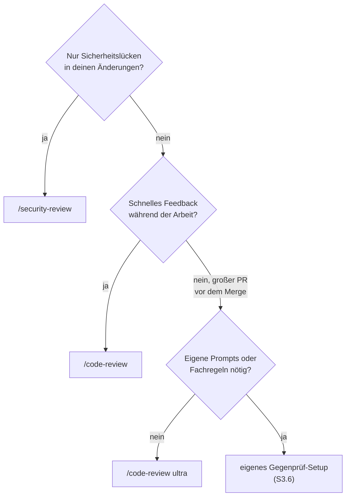

# S3.7 · Die eingebauten Reviews

<!-- meta:start -->
> **Regal:** [Gegenprüfung & Compliance](README.md#security) · **Stufe:** Kern · **~12 Min** · **Voraussetzungen:** [S1.16 Git in einem Fluss: Branch, Commit, PR](s1-16-git-in-einem-fluss.md)
>
> ← [S3.6 Devil's Advocate: eine adversariale Prüf-Pipeline](s3-06-devils-advocate.md) · [Bibliothek](README.md) · [S3.8 Rechte für autonome Läufe](s3-08-rechte-fuer-autonomie.md) →
<!-- meta:end -->

## Schnellcheck

- Hast du `/security-review` schon einmal vor einem Merge auf einem Branch laufen lassen und die Befunde bewertet?
- Kannst du ohne Nachschlagen sagen, was `/code-review ultra` anders macht als ein lokales `/code-review` (Ort, Zahl der Prüfer)?

## Auf einen Blick

Claude Code bringt drei Reviews mit, die ohne Einrichtung laufen. `/security-review` prüft die Änderungen deines Branches auf Sicherheitslücken. `/code-review` (Alias `/review`) sucht lokal nach Fehlern im aktuellen Diff, in einem PR, einem Branch oder einem Pfad. `/code-review ultra` (Alias `/ultrareview`) schickt eine Flotte von Prüf-Agenten in eine Cloud-Sandbox und lässt jeden Befund unabhängig nachprüfen.

Fang mit diesen an. Ein eigenes Gegenprüf-Setup, wie [S3.6](s3-06-devils-advocate.md) es aus zwei Subagenten baut, lohnt sich erst, wenn du bestimmte Prompts oder Fachregeln brauchst.

## Bild im Kopf

Denk an die Prüfstufen einer Zutrittsanlage. `/security-review` ist die Routine-Sicherheitsprüfung: Nach jedem Umbau schaut jemand gezielt nach, ob eine neue Lücke entstanden ist. `/code-review` ist die Abnahme durch die Projektleitung: Funktioniert, was gebaut wurde? `/code-review ultra` ist der unabhängige Drittprüfer: Ein externes Team kommt mit mehreren Prüfern, stellt jeden Befund nach und meldet nur, was es selbst reproduzieren konnte.

Ein eigenes Setup holst du dir wie ein beauftragtes Pentest-Team mit eigenem Prüfkatalog: wenn die Standardprüfungen dein Fachgebiet nicht abdecken.



## Im Detail

### Drei Reviews, ohne Einrichtung

| Befehl | Wo er läuft | Was er prüft |
|---|---|---|
| `/security-review` | lokal | die Änderungen deines Branches gegenüber dem Standard-Branch von `origin`, auf Risiken wie Injection, Auth-Probleme und offengelegte Daten; braucht ein `origin`-Remote |
| `/code-review` (Alias `/review`) | lokal, als Subagent im Hintergrund | Korrektheitsfehler im aktuellen Diff oder in einem PR, Branch oder Pfad, den du übergibst; je nach Modell und Effort auch Möglichkeiten zum Aufräumen |
| `/code-review ultra` (Alias `/ultrareview`) | in einer Cloud-Sandbox bei Anthropic | eine Flotte von Prüf-Agenten untersucht Branch oder PR parallel; jeder gemeldete Befund wird unabhängig reproduziert und geprüft |

Ohne Ziel prüft `/code-review` die Commits deines Branches, die seinem Upstream voraus sind, und alle nicht committeten Änderungen. Mit einer PR-Nummer wie `/code-review 1234` prüft es stattdessen diesen Pull Request, mit einem Bereich wie `main...mein-branch` genau diesen. Der Review läuft im Hintergrund; die Befunde kommen in deine Unterhaltung, sobald er fertig ist. Ohne `--fix` ändert er nichts.

`/code-review ultra` ist eine Research Preview. Es braucht eine Anmeldung mit einem claude.ai-Konto und steht auf Amazon Bedrock, Google Cloud's Agent Platform, Microsoft Foundry und in Organisationen mit Zero Data Retention nicht zur Verfügung; dort läuft stattdessen ein lokaler Review. Claude startet `ultra` nie von selbst.

So rufst du die Prüfungen auf:

<!-- cockpit:example -->
```text
/security-review
# oder für einen bestimmten PR, gründlich in der Cloud:
/code-review ultra 1234
```

**Kosten bei `ultra`:** Vor dem Start zeigt ein Dialog den Umfang, die verbleibenden Freiläufe und die geschätzten Kosten, denn `ultra` rechnet über Usage Credits ab statt über das Kontingent deines Plans. Probier es zum Üben nicht aus; die Übung unten kommt ohne aus. `/code-review` zählt dagegen zur normalen Nutzung (`/usage`).

### Wann ein eigenes Setup

Die eingebauten Reviews sind von Anthropic abgestimmt, du wählst höchstens den Effort. Zu einem eigenen Setup greifst du, wenn du bestimmte Prompts, eine bestimmte Modellwahl oder fachliche Regeln brauchst, die die Standardprüfungen nicht kennen. Wie du ein Paar aus Ankläger und Verteidiger selbst baust, zeigt [S3.6](s3-06-devils-advocate.md).

## Selbst machen

### Übung: zwei Reviews an einem Branch mit eingebautem Fehler (etwa 15 Minuten)

**Ziel:** Du führst `/security-review` und `/code-review` an einem Branch aus, der eine offensichtliche Lücke und einen offensichtlichen Fehler enthält, und siehst, wofür jeder Befehl gedacht ist.

**Startzustand:** Git und ein leerer Ordner `~/cc-workshop/reviews` (`mkdir -p ~/cc-workshop/reviews && cd ~/cc-workshop/reviews`, in PowerShell `New-Item -ItemType Directory -Force "$HOME\cc-workshop\reviews"; Set-Location "$HOME\cc-workshop\reviews"`). `/security-review` vergleicht deinen Branch mit dem Standard-Branch von `origin`. Die Übung baut deshalb ein eigenes `origin` als lokales Bare-Repository im selben Ordner; es gibt kein Netz und kein GitHub. Die Git-Befehle sind in bash und PowerShell gleich.

1. Leg das Bare-Repository und das Arbeitsrepository an, und stell einen lokalen Namen ein, der nur für dieses Repository gilt:

   ```bash
   git init --bare --initial-branch=main remote.git
   git init --initial-branch=main app
   cd app
   git config user.name "Learner"
   git config user.email "learner@example.com"
   ```
2. Leg im Ordner `app` mit einem Editor die Datei `app.py` an:

   ```python
   import sys


   def greet(name):
       return "Hello, " + name


   if __name__ == "__main__":
       print(greet(sys.argv[1]))
   ```
3. Committe, verbinde `origin`, und setz `origin/HEAD`, das Claude Code für `/security-review` braucht:

   ```bash
   git add app.py
   git commit -m "Add greeter"
   git remote add origin ../remote.git
   git push -u origin main
   git remote set-head origin main
   git switch -c add-lookup
   ```

   Erwartet: `git branch -r` zeigt `origin/HEAD -> origin/main` und `origin/main`. Ohne `origin/HEAD` bricht `/security-review` mit `ambiguous argument` ab.
4. Ersetz den Inhalt von `app.py` durch diese Fassung und committe sie auf dem Branch:

   ```python
   import os
   import sys


   def greet(name):
       return "Hello, " + name


   def lookup(host):
       os.system("nslookup " + host)


   def last_item(items):
       return items[len(items)]


   if __name__ == "__main__":
       if sys.argv[1] == "lookup":
           lookup(sys.argv[2])
       else:
           print(greet(sys.argv[1]))
   ```

   ```bash
   git commit -am "Add lookup and last_item"
   ```
5. Starte `claude --permission-mode default` im Ordner `app` und bestätige den Vertrauensdialog. Gib `/security-review` ein. Rechne mit einer oder zwei Rückfragen zu Git-Befehlen; beantworte sie mit „Yes“. Erwartet: ein Bericht, der die Befehlseinschleusung in `lookup` in `app.py` nennt. Der genaue Wortlaut des Berichts steht nicht in der Doku.
6. Gib `/code-review main...add-lookup` ein. Dein Branch hat keinen Upstream, deshalb nennst du den Vergleich selbst; ein Bereich wie `main...mein-branch` ist laut Doku erlaubt. Der Review läuft im Hintergrund, etwa eine Minute, und kann eine Rückfrage stellen. Erwartet: Die Befunde kommen in deine Unterhaltung. Rechne mit dem Fehler in `last_item`, dessen Index hinter dem Ende der Liste liegt.
7. Trag in zwei Zeilen ein, was jeder Befehl gefunden hat und was nicht. Prüf in einem zweiten Terminal im Ordner `app` mit `git status --short`, dass nichts geändert wurde: Du hast `--fix` nicht übergeben.

**Aufräumen:** Beende die Sitzung mit `/exit` und lösch den Ordner `~/cc-workshop/reviews` selbst. Er enthält beide Repositories, außerhalb liegt nichts.

<details><summary>Vergleich</summary>

`/security-review` fragt nach Sicherheitsrisiken im Diff deines Branches, und die Einschleusung in `lookup` ist sein Fall. `/code-review` fragt nach Korrektheitsfehlern, und `last_item` ist sein Fall. Nennt ein Review beides, ist das kein Fehler, aber du siehst, wofür welcher Befehl gedacht ist. Beide prüfen nur den Diff: Hätte `lookup` schon auf `main` gelegen, hätte `/security-review` ihn nicht gesehen. Prüf an dieser Stelle auch, ob der Bericht die Zeile oder Funktion nennt: Ein Befund ohne Ort ist schwer zu überprüfen.

</details>

**Geschafft, wenn:**

- [ ] `git branch -r` `origin/HEAD` zeigte, bevor du `/security-review` startetest
- [ ] `/security-review` durchlief und die Einschleusung in `lookup` meldete
- [ ] `/code-review main...add-lookup` durchlief und Befunde in deine Unterhaltung brachte
- [ ] du für beide Befehle in einem Satz sagen kannst, was er prüft
- [ ] `git status --short` leer war

## Typische Fallen

- **`/security-review` findet nichts, obwohl der Code Lücken hat.** Es prüft nur den Diff zwischen deinem Branch und dem Standard-Branch von `origin`, nicht die ganze Codebasis. Code, der schon auf dem Standard-Branch liegt, ist nicht im Diff. Für bestehenden Code bittest du Claude direkt um ein Audit.
- **`/security-review` bricht mit `ambiguous argument` ab.** Es vergleicht gegen `origin/HEAD`, und diese Referenz fehlt, etwa bei einem Single-Branch- oder CI-Checkout oder ohne `origin`-Remote. Die [Fehlerreferenz](https://code.claude.com/docs/en/errors#security-review-fails-without-origin-head) nennt die Abhilfe, zum Beispiel `git remote set-head origin <default-branch>`, wie in der Übung.
- **`/code-review` ohne Ziel meldet nichts.** Es prüft die Commits vor dem Upstream deines Branches und nicht committete Änderungen. Gibt es beides nicht, nenn ein Ziel: eine PR-Nummer, einen Branch oder einen Bereich.
- **`/code-review ultra` läuft lokal statt in der Cloud.** Du bist nur mit einem API-Key angemeldet, nutzt Bedrock, Agent Platform oder Foundry, oder deine Organisation hat Zero Data Retention. Dann fällt `ultra` auf einen lokalen Review zurück. Mit `/login` meldest du dich mit claude.ai an.
- **`/review` tut etwas anderes als in einer alten Anleitung.** Vor v2.1.223 war `/review` ein eigener Befehl, der einen GitHub-PR einmal und nur lesend prüfte. Seitdem ist es ein Alias von `/code-review`.

## Check

Du kannst `/security-review`, `/code-review` und `/code-review ultra` voneinander abgrenzen, vor allem lokal gegen Cloud und Branch-Diff gegen PR, für einen Fall den passenden wählen und weißt, wann du zu einem eigenen Gegenprüf-Setup greifst.

1. Was genau prüft `/security-review`, und warum findet es auf einem frischen Klon nichts?
2. Wo läuft `/code-review ultra`, und was passiert, wenn du nur mit einem API-Key angemeldet bist?
3. Wann lohnt sich ein eigenes Setup statt der eingebauten Reviews?

<details><summary>Auflösung</summary>

1. Die Änderungen deines Branches gegenüber dem Standard-Branch von `origin`, auf Risiken wie Injection, Auth-Probleme und offengelegte Daten. Auf einem frischen Klon gibt es keine Änderung, also ist der Diff leer.
2. In einer Cloud-Sandbox bei Anthropic, mit einer Flotte von Prüf-Agenten. Nur mit einem API-Key läuft stattdessen ein lokaler Review; für die Cloud brauchst du eine Anmeldung mit claude.ai.
3. Wenn du bestimmte Prompts, ein bestimmtes Modell oder fachliche Regeln brauchst, die die Standardprüfungen nicht abdecken.

</details>

<details><summary>Quizfrage</summary>

**Frage:** Du hast auf einem Branch eine Funktion geändert, die Nutzereingaben in eine Shell-Zeile setzt. Vor dem Commit willst du nur wissen, ob du eine Sicherheitslücke eingebaut hast. Was nimmst du?

- **Richtig:** `/security-review`: Es prüft den Diff deines Branches gegen den Standard-Branch von `origin` auf Lücken wie Injection.
- Falsch: `/code-review ultra`: Die Cloud-Flotte prüft am gründlichsten, also nimmst du sie für jede Änderung, auch für kleine.
- Falsch: `/simplify`: Der Befehl prüft die geänderten Dateien und behebt dabei auch Sicherheitslücken, die er findet.
- Falsch: `/code-review`: Es ist die Standardprüfung für Sicherheitslücken, und `/security-review` ist nur ihr Alias.

</details>

## Weiterlesen

- [Befehlsreferenz](https://code.claude.com/docs/en/commands)
- [Code Review und `/code-review`](https://code.claude.com/docs/en/code-review)
- [Ultrareview](https://code.claude.com/docs/en/ultrareview)
- [Sicherheit in Claude Code](https://code.claude.com/docs/en/security)
- [S3.6 · Devil's Advocate: eine adversariale Prüf-Pipeline](s3-06-devils-advocate.md)
- [S1.16 · Git in einem Fluss: Branch, Commit, PR](s1-16-git-in-einem-fluss.md)
- [S1.17 · Git-Befehle in der Sitzung](s1-17-git-befehle.md)
- [S4.5 · CI-Pipelines bauen mit GitHub Actions und GitLab](s4-05-ci-pipelines.md)
