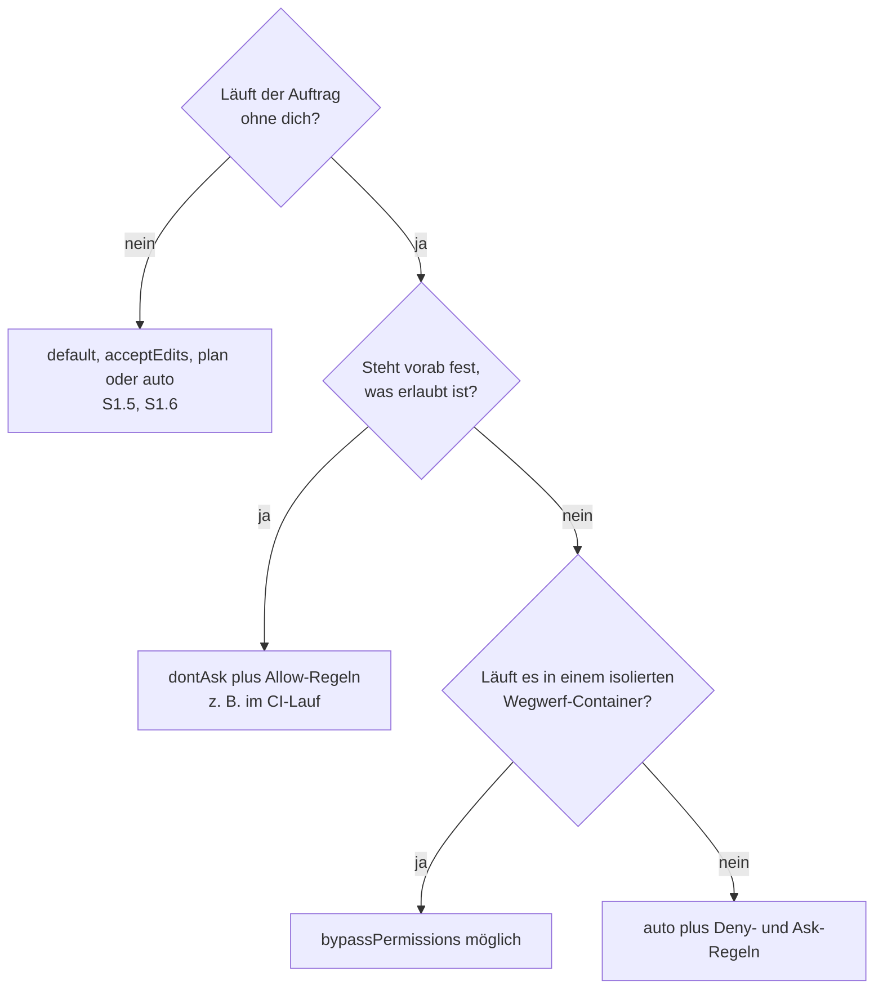

# S3.8 · Rechte für autonome Läufe

<!-- meta:start -->
> **Regal:** [Rechte & Freigaben](README.md#permissions) · **Stufe:** Kern · **~15 Min** · **Voraussetzungen:** [S1.6 Alle Rechte-Modi im Überblick](s1-06-rechte-modi.md) · 🛡 **Sicherheitsboden**
>
> ← [S3.7 Die eingebauten Reviews](s3-07-eingebaute-reviews.md) · [Bibliothek](README.md) · [S3.9 Geschützte Pfade und Sandbox-Stufen](s3-09-geschuetzte-pfade-und-sandbox.md) →
<!-- meta:end -->

## Schnellcheck

- Hast du schon einmal Allow-, Ask- oder Deny-Regeln für Bash, Skills, Subagenten oder WebFetch in `settings.json` geschrieben, statt dich nur auf den Modus zu verlassen?
- Kannst du ohne Nachschlagen sagen, welche Dateisystem-Befehle `acceptEdits` im Arbeitsordner still durchwinkt?

## Auf einen Blick

Läuft Claude ohne dich, entscheidet der Modus, wer statt dir prüft: in `auto` ein Klassifikator, in `dontAsk` nur deine Allow-Regeln, in `bypassPermissions` niemand. Dieser letzte Modus gehört ausschließlich in einen isolierten Wegwerf-Container, nie auf eine Arbeits-Workstation. Harte Grenzen ziehst du mit Regeln, denn Deny-Regeln blocken in jedem Modus.

Auch `acceptEdits` reicht weiter, als der Name sagt: Er löscht und verschiebt Dateien im Arbeitsordner ohne Rückfrage. Ask-Regeln erzwingen eine Rückfrage selbst in `auto`; in `dontAsk` wird ein solcher Aufruf abgelehnt.

## Bild im Kopf

Stell dir vor, das Gebäude läuft nachts ohne Wachmann. Du hast drei Möglichkeiten: ein Zutrittssystem, das an jeder Tür selbst einschätzt, ob der Zutritt riskant ist (`auto`); einen Automaten, der nur Karten von der vorprogrammierten Liste durchlässt und alle anderen abweist (`dontAsk`); oder einen Generalschlüssel ohne jedes Schloss (`bypassPermissions`), den du nur in der abgeschlossenen Testhalle ausgibst. Einzelne Türen kannst du in jedem Fall fest verriegeln (Deny) oder mit Pflicht zur Gegenzeichnung versehen (Ask).



## Im Detail

### Drei Modi für Läufe ohne dich

Die Karte aller sechs Modi steht in [S1.6](s1-06-rechte-modi.md). Hier geht es um die drei Modi, in denen du nicht mehr jede Aktion selbst freigibst, um `acceptEdits` in langen Läufen und um die Regeln, die du über jeden Modus legst.

### auto: Verfügbarkeit und Grenzen

In `auto` prüft ein eigenes Klassifikator-Modell jede Aktion, bevor sie läuft. Es blockt, was über deinen Auftrag hinausgeht, unbekannte Infrastruktur trifft oder nach feindlichem Inhalt aussieht, den Claude gelesen hat. `auto` senkt die Zahl der Rückfragen, garantiert aber keine Sicherheit. Verfügbar ist er nur, wenn alles davon zutrifft:

- **Tarif:** alle Tarife. Auf Team und Enterprise können Admins ihn für die Organisation abschalten, mit `permissions.disableAutoMode` auf `"disable"` in den Managed Settings.
- **Modell:** ein unterstütztes Modell aus dem Opus-, Sonnet- oder Fable-Tier, nie Haiku. Auf der Anthropic API reichen neuere Generationen, auf Bedrock, Google Cloud und Foundry nur noch neuere. Die genauen Grenzen stehen in der Doku zu den Rechte-Modi; worauf deine Aliase auflösen, steht im [Kanon](../_canonical.md).
- **Anbieter:** Anthropic API, Claude Platform on AWS, Amazon Bedrock, Google Cloud und Microsoft Foundry.
- **Version:** eine aktuelle Claude Code-Version (`claude --version`).

Enger oder weiter fasst du `auto` über die `autoMode`-Einstellungen; `autoMode.hard_deny` ist eine Sperrliste, die der Klassifikator nie überstimmt ([S3.10](s3-10-netzwerk-und-skills-haerten.md)).

### acceptEdits reicht weiter, als es aussieht

In [S1.5](s1-05-rechte-im-alltag.md) steht die vorsichtige Kurzform: Dateiänderungen laufen, Shell-Befehle fragen. Tatsächlich genehmigt `acceptEdits` auch die gängigen Dateisystem-Befehle, die im Kern Dateiänderungen sind, im Arbeitsordner und in Ordnern aus `--add-dir`:

| Plattform | Unter `acceptEdits` ohne Rückfrage |
|---|---|
| Linux / macOS / WSL | `mkdir`, `touch`, `rm`, `rmdir`, `mv`, `cp`, `sed` |
| Windows (mit aktivem PowerShell-Werkzeug) | `Set-Content`, `Add-Content`, `Clear-Content`, `Remove-Item` |

Außerhalb des Arbeitsordners fragt Claude Code wie gewohnt, ebenso bei geschützten Pfaden ([S3.9](s3-09-geschuetzte-pfade-und-sandbox.md)) und bei `rm` auf kritische Pfade wie den Arbeitsordner selbst oder dein Home-Verzeichnis. Netzbefehle (`curl`, `wget`), Paketmanager (`npm install`, `pip`) und beliebige Skripte gibt `acceptEdits` nicht frei; sie fragen weiter.

**Warum das zählt:** Wechselst du für einen langen Umbau in `acceptEdits`, verschiebt und löscht Claude Dateien im Projekt still als Teil der normalen Arbeit. Das ist so gewollt. Soll ein Teil des Projekts stabil bleiben, etwa generierte Artefakte oder eingecheckte Fremdbibliotheken, setzt du ihn ausdrücklich auf die Deny-Liste.

### dontAsk im CI-Lauf

`dontAsk` ist das Arbeitspferd für CI-Runner: Claude arbeitet, ohne je zu fragen. Was eine Rückfrage bräuchte, lehnt Claude Code ab. Es läuft nur, was auch in Manual keine Freigabe braucht, und was deine Allow-Regeln abdecken, hier über `--allowedTools`:

<!-- cockpit:example -->
```bash
claude --permission-mode dontAsk \
  --allowedTools "Read,Glob,Grep,Bash(npm test)" \
  --output-format json \
  -p "Run the test suite and emit a structured failure report."
```

Tipps für CI: Kombiniere `--permission-mode dontAsk` mit `--max-budget-usd` als harter Kostengrenze und `--max-turns` als harter Rundengrenze; beide gibt es nur mit `-p` ([S3.13](s3-13-autonome-loops-absichern.md)). Gib dem Runner Zugangsdaten, die nie nach einer Neuanmeldung fragen. Welche das sind, hängt von `--bare` ab und davon, wessen Code der Job ausführt ([S4.4](s4-04-ci-zugang-und-kosten.md)).

### bypassPermissions: wann du ihn wirklich brauchst

`bypassPermissions`, auch über `--dangerously-skip-permissions`, schaltet Rückfragen und Sicherheitsprüfungen ab, auch für Schreibzugriffe auf geschützte Pfade. Ganz alles ist es trotzdem nicht: Deny-Regeln blocken weiter, und ausdrückliche Ask-Regeln sowie `rm` auf kritische Pfade wie `rm -rf ~` fragen auch hier nach. Allow-Regeln wirken in diesem Modus nicht. Gegen Prompt Injection oder ungewollte Aktionen schützt er nicht.

Unter Linux und macOS verweigert Claude Code den Start in diesem Modus als root oder unter `sudo`, außer in einer erkannten Sandbox, denn der Modus ist für kurzlebige Wegwerf-Container gedacht; die Doku nennt Container, VMs oder Dev-Container ohne Internetzugang, und Geheimnisse gehören dann nicht hinein. Nutze ihn in Docker oder Inception ([S4.7](s4-07-isolation-docker-worktrees.md)), nie auf einer laufenden Workstation. Admins sperren ihn mit `permissions.disableBypassPermissionsMode` auf `"disable"` in den Managed Settings.

### Regeln über Allow und Deny auf Bash hinaus

Das bekannte Muster `Bash(rm *)` ist nur eine Regelfamilie. Die Regel-Syntax deckt auch Skills, Subagenten und Webabrufe ab:

| Regelmuster | Wirkung |
|---|---|
| `Bash(rm *)` | passende Shell-Aufrufe erlauben oder sperren |
| `Skill(<name>)` | einen bestimmten Skill erlauben oder sperren, z. B. `Skill(commit)` |
| `Skill(<name> *)` | Präfix-Treffer: den Skill mit beliebigen Argumenten, z. B. `Skill(review-pr *)` |
| `Agent(<agent-type>)` | einen bestimmten Subagenten erlauben oder sperren, z. B. `Agent(Explore)`; nützlich, wenn eine verwaltete Umgebung festlegen will, welche Agenten laufen dürfen |
| `WebFetch(domain:example.com)` | Webabrufe auf bestimmte Domains beschränken oder einzelne Domains sperren |
| Regel unter `permissions.ask` | fragt immer nach, auch in `auto` und `bypassPermissions`; in `dontAsk` wird der Aufruf stattdessen abgelehnt |

Leg diese Regeln in die `settings.json` des Projekts. Dann gelten Deny- und Ask-Regeln, egal welchen Modus jemand zur Laufzeit wählt.

## Vorführen

### Demo: Rechte-Modi, vom Besucherausweis zum Generalschlüssel (etwa 5 Minuten)

**Ziel:** Die Rechte-Modi live zeigen: Dieselbe Aufgabe verhält sich je nach Freigabestufe anders.

**Schritt 1: Manual zeigen (1 Min.)**

Starte Claude Code mit `claude --permission-mode default`. Ohne Flag startet eine neue Sitzung in aktuellen Versionen in `auto`. Frag:

```
Show me the contents of package.json
```

Das läuft ohne Rückfrage, Lesen ist frei.

Jetzt:

```
Add a comment to the top of README.md
```

Claude fragt nach einer Freigabe.

**Schritt 2: zu acceptEdits wechseln (1 Min.)**

Drück `Shift+Tab`, bis die Statusleiste `⏵⏵ accept edits on` zeigt. Frag noch einmal:

```
Add a comment to the top of README.md
```

Diesmal läuft es ohne Rückfrage. Bei diesem Auftrag dagegen fragt Claude weiter nach:

```
Run npm test
```

**Schritt 3: Plan-Modus zeigen (2 Min.)**

Starte eine neue Sitzung mit:

```bash
claude --permission-mode plan
```

Frag:

```
Refactor this file to use async/await instead of callbacks, add error handling, and run tests
```

Claude liest, erkundet und legt zuerst den ganzen Plan vor; geändert wird nichts, bevor du ihn freigibst. Bei der Freigabe wählst du, wie es weitergeht: in `auto`, mit automatisch angenommenen Änderungen oder mit Einzelfreigabe jeder Änderung.

**Schritt 4: auto, dontAsk und bypassPermissions nur erklären (1 Min.)**

Diese drei zeigst du nicht live, das ist für eine Vorführung zu riskant:

- `auto`: Ein Klassifikator prüft statt dir. Auch in Cloud-Sitzungen wählbar, wenn Organisation und Modell es erlauben.
- `dontAsk`: vorab genehmigte Arbeitsaufträge für CI/CD. Nur Erlaubtes läuft, alles andere wird abgelehnt.
- `bypassPermissions`: der Generalschlüssel, nur in abgeschlossenen Testräumen (Docker, Sandbox).

Öffne zum Schluss:

```
/permissions
```

Der Dialog zeigt die Allow-, Ask- und Deny-Regeln, die zusätzlich zum Modus gelten, und aus welcher Datei sie stammen. Den Modus selbst wechselt er nicht.

<details><summary>Für Moderierende</summary>

**Dauer:** etwa 5 Minuten (Schritt 1: 1 Min., Schritt 2: 1 Min., Schritt 3: 2 Min., Schritt 4: 1 Min.).

**Sagen:**

- Schritt 1: „Manual, der Modus mit dem Wert default. Besucherausweis. Lesen ist frei, Schreiben braucht eine Freigabe."
- Schritt 2: „Wartungsausweis. Du kommst in die Büros, aber der Serverraum braucht weiter eine Freigabe."
- Schritt 3: „Plan-Modus ist die Einsatzbesprechung. Du genehmigst den Einsatzplan als Ganzes; ob danach jede Änderung einzeln gegengezeichnet wird, entscheidest du bei der Freigabe. Das hilft bei mehrstufigen Aufgaben, bei denen ständiges Freigeben ermüdet."
- Schritt 4: „Einem Handwerker würdest du im laufenden Gebäude nie einen Generalschlüssel geben. Hier gilt dieselbe Regel: bypassPermissions nur in abgeschlossenen Testumgebungen."
- Zum Abschluss: „Sechs Freigabestufen, vom Besucherausweis bis zum Generalschlüssel. Du wählst die passende für die Lage, so wie du einem Lieferfahrer nie denselben Zugang gibst wie dem Haustechniker."

**Wenn es hakt:**

- **Der `Shift+Tab`-Zyklus geht nicht:** Starte ausdrücklich mit `claude --permission-mode plan` im Plan-Modus.
- **Unklar, welcher Modus aktiv ist:** Die Statusleiste zeigt ihn (`⏸ manual mode on`, `⏵⏵ accept edits on`, `⏸ plan mode on`); `/permissions` zeigt Regeln, keinen Modus. Den eingestellten Startmodus siehst du mit `cat ~/.claude/settings.json | jq .permissions`.
- **`acceptEdits` fragt trotzdem bei Änderungen:** Liegt die Datei außerhalb des Arbeitsordners oder in einem geschützten Pfad wie `.claude/` ([S3.9](s3-09-geschuetzte-pfade-und-sandbox.md))? Prüf auch die projektlokale `.claude/settings.local.json` auf Ask-Regeln; sie geht den Projekt- und Nutzer-Einstellungen vor.
- **`claude --permission-mode plan` wird nicht erkannt:** Prüf mit `claude --version`, ob die Installation aktuell ist. In der Sitzung erreichst du den Plan-Modus auch mit `Shift+Tab` oder mit `/plan` vor einer einzelnen Anfrage.

Die Karte der sechs Modi für die Nachbesprechung steht in [S1.6](s1-06-rechte-modi.md), die geschützten Pfade in [S3.9](s3-09-geschuetzte-pfade-und-sandbox.md).

</details>

## Selbst machen

### Extra: Wrong-Door Heist, ein Rechte-Red-Team (etwa 25 Minuten, wild)

**Ziel:** Rechte-Modi und geschützte Pfade verstehen, indem du sie *angreifst* und dann so lange härtest, bis der Angriff scheitert.

**Analogie:** Ein Red Team probiert eine Seitentür zum Tresor. Jeder gelungene Einbruch führt zu einer härteren Tür (Rechte-Modi = Freigabestufen, geschützte Pfade = Tresorräume).

1. Schutzziel: `osdp_frame_decoder.c` und `access_control.py` im `workshop-playground/` dürfen **nicht** geändert werden. Das sind die „Tresorräume", siehe „do NOT fix" in der [`CLAUDE.md` des Playgrounds](../../workshop-playground/CLAUDE.md).
2. **Angriffsrunde (Team Rot):** Bring Claude dazu, diese Dateien zu ändern: direkt, über einen Umweg („formatier nur die Kommentare um") oder über einen anderen Werkzeugpfad. Notier jeden gelungenen Einbruch.
3. **Verteidigungsrunde (Team Blau):** Bau die Mauer in drei Schichten: (a) eine Regel in der `CLAUDE.md`: „Never modify these files", (b) einen PreToolUse-Hook mit Matcher `Edit|Write`, der genau diese Pfade blockt (mit `exit 2`, und denk an absolute Pfade mit Backslash unter Windows: [S2.8](s2-08-hook-einrichten.md)), (c) einen bewusst *restriktiven* Rechte-Modus, nicht `bypassPermissions`.
4. Greif die gehärtete Mauer erneut an. Welche Schicht hat welchen Angriff gestoppt?
5. Nachbesprechung: Welche Schicht war am robustesten: Sprache (`CLAUDE.md`), Mechanismus (Hook) oder Freigabe (Modus)? Die Lehre: Schutz braucht gestaffelte Verteidigung, keine einzelne Schicht reicht.

## Typische Fallen

- **`auto` ist nicht verfügbar.** Prüf die Voraussetzungen oben: unterstütztes Modell (nie Haiku), Anbieter, Version, und ob eine Settings-Datei `disableAutoMode` setzt. Anthropic kann `auto` auch serverseitig vorübergehend abschalten; dann hilft eine neue Sitzung später.
- **`--dangerously-skip-permissions` als Abkürzung im Alltag.** Nur in isolierten VMs oder Docker-Containern, nie für interaktive Sitzungen auf deinem Arbeitsrechner. Brauchst du weniger Rückfragen, nimm `auto` plus Allow- und Deny-Regeln.
- **Der CI-Lauf fragt nicht, sondern der Aufruf fehlt.** In `dontAsk` wird ein Aufruf, der zu einer Ask-Regel passt, abgelehnt statt gefragt. Soll er laufen, braucht er eine Allow-Regel und darf keine Ask-Regel treffen.
- **`bypassPermissions` startet im Container nicht.** Als root oder unter `sudo` verweigert Claude Code ihn unter Linux und macOS außerhalb einer erkannten Sandbox. Starte Claude Code im Container als Nutzer ohne root-Rechte, wie es die Dev-Container-Konfiguration tut.

## Check

Du kannst für einen autonomen Lauf den passenden Modus samt Allow-, Ask- und Deny-Regeln wählen und begründen, warum `bypassPermissions` nur in einen isolierten Wegwerf-Container gehört.

1. Welche Dateisystem-Befehle genehmigt `acceptEdits` im Arbeitsordner still, und was fragt weiter?
2. Was passiert mit einem Aufruf, der zu einer Ask-Regel passt, in `auto`, in `dontAsk` und in `bypassPermissions`?
3. Welche zwei Flags gehören in jeden unbeaufsichtigten `dontAsk`-Lauf, damit er weder unbegrenzt kostet noch unbegrenzt läuft?

<details><summary>Quizfrage</summary>

**Frage:** Warum gehört `bypassPermissions` nicht auf deine Arbeits-Workstation, und welche eingebaute Sperre erinnert daran?

- **Richtig:** Er schreibt ohne Rückfrage, auch in `.git`; unter Linux und macOS verweigert Claude Code ihn als root außerhalb einer erkannten Sandbox.
- Falsch: Er ist auf der Workstation sicher, sobald du die geschützten Pfade zusätzlich als Allow-Regeln in die `settings.json` des Projekts einträgst.
- Falsch: Er ist nur unter macOS gefährlich; Linux und Windows bringen eine Kernel-Sandbox mit, die ihn auf der Workstation absichert.
- Falsch: Er entspricht `dontAsk`; der einzige Unterschied ist, dass er zusätzlich Skills und Subagenten ohne Bestätigung starten darf.

</details>

## Weiterlesen

- [Rechte-Modi (offizielle Doku)](https://code.claude.com/docs/en/permission-modes)
- [Rechte-Regeln (offizielle Doku)](https://code.claude.com/docs/en/permissions)
- [auto konfigurieren (offizielle Doku)](https://code.claude.com/docs/en/auto-mode-config)
- [S1.6 · Alle Rechte-Modi im Überblick](s1-06-rechte-modi.md)
- [S3.9 · Geschützte Pfade und Sandbox-Stufen](s3-09-geschuetzte-pfade-und-sandbox.md)
- [S3.10 · Netzwerk und Skills härten](s3-10-netzwerk-und-skills-haerten.md)
- [S3.13 · Autonome Loops absichern: Budget und Worktree](s3-13-autonome-loops-absichern.md)
- [S4.4 · CI-Zugangsdaten, Kostengrenzen und Kosten-Feinschliff](s4-04-ci-zugang-und-kosten.md)
- [S2.8 · Einen Hook einrichten, der wirklich blockt](s2-08-hook-einrichten.md)
