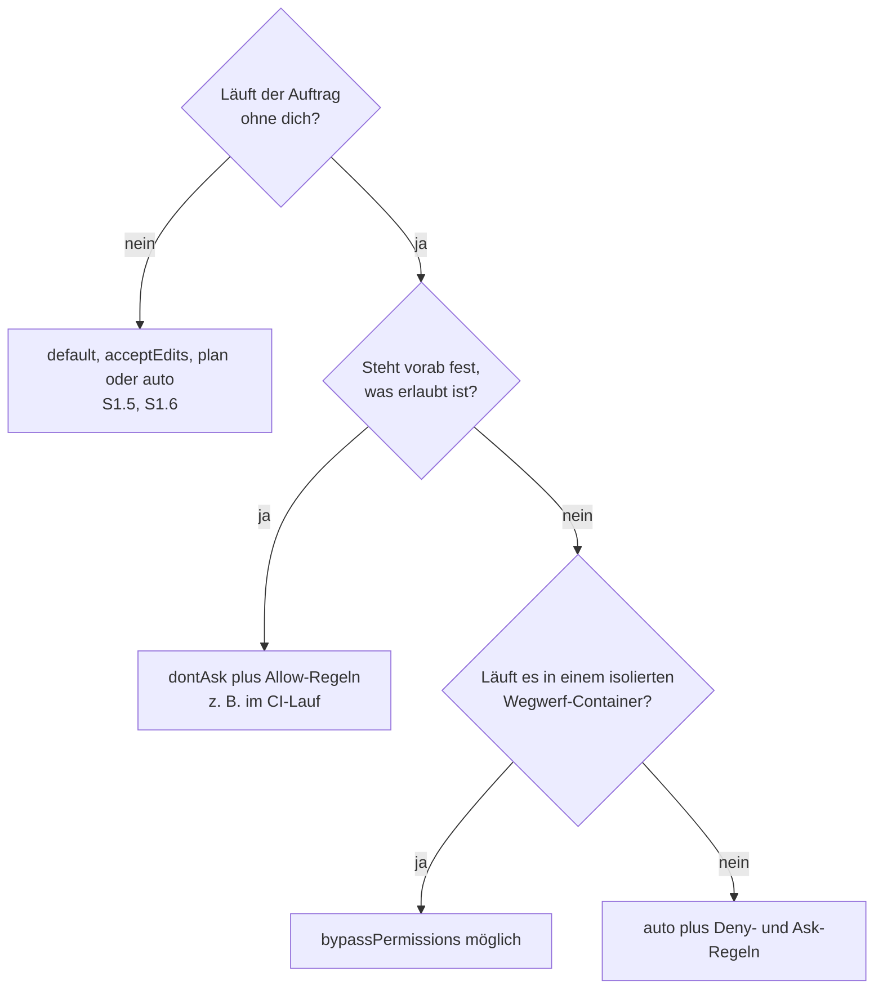

# S3.8 · Rechte für autonome Läufe

<!-- meta:start -->
> **Regal:** [Rechte & Freigaben](README.md#permissions) · **Stufe:** Kern · **~30 Min** · **Voraussetzungen:** [S1.6 Alle Rechte-Modi im Überblick](s1-06-rechte-modi.md) · 🛡 **Sicherheitsboden**
>
> ← [S3.7 Die eingebauten Reviews](s3-07-eingebaute-reviews.md) · [Bibliothek](README.md) · [S3.9 Geschützte Pfade und Sandbox-Stufen](s3-09-geschuetzte-pfade-und-sandbox.md) →
<!-- meta:end -->

## Schnellcheck

- Hast du schon einmal eine Sitzung in `dontAsk` gestartet und gesehen, was Claude Code dort ablehnt?
- Kannst du ohne Nachschlagen sagen, welche Regel gewinnt, wenn Deny, Ask und Allow denselben Aufruf treffen?

## Auf einen Blick

Läuft Claude ohne dich, entscheidet der Modus, wer statt dir prüft: in `auto` ein Klassifikator, in `dontAsk` nur deine Regeln, in `bypassPermissions` niemand. Für Läufe, die du vorab festlegen kannst, ist `dontAsk` der Modus, in dem deine Regeln entscheiden: Was keine Rückfrage braucht oder eine Allow-Regel trifft, läuft, alles andere wird abgelehnt. Harte Grenzen ziehst du mit Deny-Regeln, denn sie blocken in jedem Modus. `bypassPermissions` gehört ausschließlich in einen isolierten Wegwerf-Container.

Eine Regel prüft nur den Befehlstext oder den Pfad, den Claude Code sieht. Sie ist keine Mauer um ein Programm; was darüber hinaus schützt, steht in [S3.9](s3-09-geschuetzte-pfade-und-sandbox.md).

## Bild im Kopf

Stell dir vor, das Gebäude läuft nachts ohne Wachmann. Du hast drei Möglichkeiten: ein Zutrittssystem, das an jeder Tür selbst einschätzt, ob der Zutritt riskant ist (`auto`); einen Automaten, der nur Karten von der vorprogrammierten Liste durchlässt und alle anderen abweist (`dontAsk`); oder einen Generalschlüssel, der fast alle Türen öffnet und den du nur in der abgeschlossenen Testhalle ausgibst (`bypassPermissions`). Einzelne Türen bleiben auch mit dem Generalschlüssel fest verriegelt (Deny). Türen mit Pflicht zur Gegenzeichnung (Ask) bleiben für den Automaten zu, weil nachts niemand gegenzeichnet.



## Im Detail

### Wer entscheidet: Deny, Ask, Allow

Claude Code wertet die Regeln in fester Reihenfolge aus: erst Deny, dann Ask, dann Allow. Die erste passende Regel entscheidet, und eine genauere Regel ändert die Reihenfolge nicht. Eine Allow-Regel kann also keine Ausnahme aus einer Deny-Regel schneiden, und eine passende Ask-Regel fragt auch dann, wenn eine genauere Allow-Regel denselben Aufruf trifft. Ein Deny aus irgendeiner Settings-Ebene gewinnt gegen ein Allow aus einer anderen.

Dazu kommt der Modus als Grundstufe. In `dontAsk` wird jeder Aufruf abgelehnt, der sonst eine Rückfrage auslösen würde, auch einer, der eine Ask-Regel trifft: Dort fragt niemand, also läuft er nicht. Die Regelfamilien über `Bash(rm *)` hinaus:

| Regelmuster | Wirkung |
|---|---|
| `Bash(rm *)`, `PowerShell(Remove-Item *)` | passende Shell-Aufrufe erlauben, erfragen oder sperren; unter Windows brauchst du meist beide Formen |
| `Edit(config.txt)` | Dateiänderungen an diesem Pfad; die Regel gilt für alle eingebauten Werkzeuge, die Dateien ändern |
| `Skill(<name>)` | einen bestimmten Skill erlauben oder sperren, z. B. `Skill(commit)`; `Skill(<name> *)` trifft ihn mit beliebigen Argumenten |
| `Agent(<agent-type>)` | einen bestimmten Subagenten erlauben oder sperren, z. B. `Agent(Explore)` |
| `WebFetch(domain:example.com)` | Webabrufe auf eine Domain beschränken oder sperren |

Leg die Regeln in die `.claude/settings.json` des Projekts. Dann gelten Deny- und Ask-Regeln, egal welchen Modus jemand zur Laufzeit wählt. Was eine Regel nicht trifft, zeigt die Doku an `Bash(rm *)`: Sie stoppt `rm -rf build/`, aber nicht `/bin/rm -rf build/` und nicht `bash -c 'rm -rf build/'`. Wer das braucht, setzt zusätzlich eine Sandbox oder einen Hook ein ([S3.9](s3-09-geschuetzte-pfade-und-sandbox.md), [S2.8](s2-08-hook-einrichten.md)).

### dontAsk im CI-Lauf

`dontAsk` ist der Modus für Läufe, deren Erlaubtes du vorab festlegst, etwa im CI. Claude arbeitet, ohne je zu fragen. Es läuft, was auch in Manual ohne Freigabe läuft (Lesen im Arbeitsordner, reine Lesebefehle), dazu alles, was eine Allow-Regel trifft, hier über `--allowedTools`. Das Flag hat einen Grund: Allow-Regeln aus der `.claude/settings.json` eines Projekts gelten laut Doku erst, nachdem du den Vertrauensdialog für den Ordner bestätigt hast, und ein Lauf mit `-p` zeigt diesen Dialog nie. Deny- und Ask-Regeln gelten auch ohne ihn, weil sie nur einschränken. Der Schalter `-p` startet dabei einen einzelnen Lauf ohne Dialog: Auftrag hinein, Antwort heraus, Ende (mehr dazu in [S4.3](s4-03-headless.md)).

```bash
claude --permission-mode dontAsk \
  --allowedTools "Read,Glob,Grep,Bash(npm test)" \
  --output-format json \
  -p "Run the test suite and emit a structured failure report."
```

Tipps für CI: Kombiniere `--permission-mode dontAsk` mit `--max-budget-usd` als harter Kostengrenze und `--max-turns` als harter Rundengrenze; beide gibt es nur mit `-p` ([S3.13](s3-13-autonome-loops-absichern.md)). Gib dem Runner Zugangsdaten, die nie nach einer Neuanmeldung fragen; welche das sind, steht in [S4.4](s4-04-ci-zugang-und-kosten.md). Cloud-Sitzungen ignorieren `dontAsk` aus Settings-Dateien, laut Doku.

### auto: weniger Rückfragen, keine Garantie

In `auto` prüft ein Klassifikator-Modell Aktionen, bevor sie laufen, und blockt, was über deinen Auftrag hinausgeht. Die Doku nennt das selbst keine Garantie: „Auto mode reduces permission prompts but does not guarantee safety.“ Es ist an Bedingungen geknüpft: ein unterstütztes Modell (Haiku nie), ein unterstützter Anbieter, und auf Team und Enterprise können Admins ihn abschalten. Admins sind hier die Personen, die Einstellungen zentral für eine Organisation verteilen (Managed Settings); diese Einstellungen kannst du als Nutzerin nicht überschreiben. Die genauen Grenzen stehen in der Doku zu den Rechte-Modi, die Aliase im [Kanon](../_canonical.md). Enger oder weiter fasst du `auto` mit den `autoMode`-Einstellungen ([S3.10](s3-10-netzwerk-und-skills-haerten.md)).

### acceptEdits in langen Läufen

[S1.5](s1-05-rechte-im-alltag.md) zeigt die Kurzform. Vollständig genehmigt `acceptEdits` im Arbeitsordner und in Ordnern aus `--add-dir` zusätzlich zu Dateiänderungen diese Dateisystem-Befehle:

| Plattform | Unter `acceptEdits` ohne Rückfrage |
|---|---|
| Linux / macOS / WSL | `mkdir`, `touch`, `rm`, `rmdir`, `mv`, `cp`, `sed` |
| Windows (mit aktivem PowerShell-Werkzeug) | `Set-Content`, `Add-Content`, `Clear-Content`, `Remove-Item` |

Außerhalb des Arbeitsordners, bei geschützten Pfaden ([S3.9](s3-09-geschuetzte-pfade-und-sandbox.md)) und bei `rm` auf kritische Pfade wie den Arbeitsordner selbst oder dein Home-Verzeichnis fragt Claude Code weiter, ebenso bei allen anderen Shell-Befehlen. Soll ein Teil des Projekts in einem langen Umbau stabil bleiben, setzt du ihn auf die Deny-Liste.

### bypassPermissions: wann du ihn wirklich brauchst

`bypassPermissions`, auch über `--dangerously-skip-permissions`, schaltet Rückfragen und Sicherheitsprüfungen ab, auch für Schreibzugriffe auf geschützte Pfade. Ganz alles ist es trotzdem nicht: Deny-Regeln blocken weiter, ausdrückliche Ask-Regeln fragen auch hier, und `rm` auf kritische Pfade wie `rm -rf ~` fragt ebenfalls nach. Allow-Regeln haben in diesem Modus keine Wirkung. Die Doku warnt, dass er keinen Schutz gegen Prompt Injection oder ungewollte Aktionen bietet, und nennt Container, VMs oder Dev-Container ohne Internetzugang als Ort, an dem Claude Code den Host nicht beschädigen kann. Geheimnisse gehören dort nicht hinein.

Unter Linux und macOS verweigert Claude Code den Start in diesem Modus als root oder unter `sudo`, außer in einer erkannten Sandbox. Das ist keine Absicherung deiner Workstation: Die Sperre greift nur, wenn du als root oder mit `sudo` startest, auf einem normal angemeldeten Konto bremst sie nichts. Für einen Container nennt die Doku die Dev-Container-Konfiguration, die Claude Code als Nutzer ohne root-Rechte startet ([S4.7](s4-07-isolation-docker-worktrees.md)). Admins können den Modus mit `permissions.disableBypassPermissionsMode` auf `"disable"` in den Managed Settings sperren.

## Selbst machen

### Übung: Regeln für einen Lauf ohne dich schreiben und prüfen (etwa 15 Minuten)

**Ziel:** Du schreibst Allow-, Ask- und Deny-Regeln für einen Lauf in `dontAsk` und beweist an `git`, dass die geschützte Datei unverändert bleibt.

**Startzustand:** Du arbeitest im Ordner `~/cc-workshop/rechte-lauf`, den du jetzt anlegst: ein kleines Git-Repository mit zwei Dateien, `notes.txt` (darf geändert werden) und `config.txt` (soll geschützt sein). Die Git-Identität setzt du nur für dieses Repository, deine globale Konfiguration bleibt unberührt. Mehr als Claude Code, Git und Python brauchst du nicht.

Bash:

```bash
mkdir -p ~/cc-workshop/rechte-lauf/.claude && cd ~/cc-workshop/rechte-lauf
printf 'first note\n' > notes.txt
printf 'keep=1\n' > config.txt
git init -q
git config user.name "Learner"
git config user.email "learner@example.com"
git add notes.txt config.txt
git commit -q -m "start"
```

PowerShell:

```powershell
New-Item -ItemType Directory -Force "$HOME\cc-workshop\rechte-lauf\.claude" | Out-Null
Set-Location "$HOME\cc-workshop\rechte-lauf"
Set-Content notes.txt "first note"
Set-Content config.txt "keep=1"
git init -q
git config user.name "Learner"
git config user.email "learner@example.com"
git add notes.txt config.txt
git commit -q -m "start"
```

Die Übung hat zwei Runden mit denselben zwei Aufträgen: erst die Änderungen, dann der Commit. So siehst du jede Regel für sich. (In einem einzigen Auftrag packt Claude Änderungen und Commit gern in eine Shell-Zeile, und `dontAsk` lehnt die dann als Ganzes ab.) `.claude` ist ein geschützter Pfad ([S3.9](s3-09-geschuetzte-pfade-und-sandbox.md)): Die `settings.json` schreibst du selbst mit einem Editor, nicht über Claude.

1. **Runde 1, nur Allow.** Leg `.claude/settings.json` mit diesem Inhalt an. `Edit` erlaubt alle Dateiänderungen, `git` ist für beide Shell-Werkzeuge freigegeben:

   ```json
   {
     "permissions": {
       "allow": ["Edit", "Bash(git *)", "PowerShell(git *)"]
     }
   }
   ```

2. Starte `claude --permission-mode dontAsk` und bestätige den Vertrauensdialog für den Ordner. Erwartet: Die Statusleiste zeigt `⏵⏵ don't ask on`. Gib ein: `Use the Edit tool to append the line "second note" to notes.txt and to change keep=1 to keep=0 in config.txt.` Erwartet: Es kommt keine Rückfrage, Claude ändert beide Dateien. Gib danach ein: `Run git add notes.txt config.txt and then git commit -m "update" as two separate shell commands.` Erwartet: Beide Befehle laufen ohne Rückfrage.
3. Beende die Sitzung mit `/exit` und prüf: `git show --stat HEAD` nennt `notes.txt` und `config.txt`, `git log --oneline` zeigt zwei Einträge. Ohne Schutz hat der Lauf die Datei geändert, die du nicht ändern wolltest. Mach den Commit rückgängig: `git reset --hard HEAD~1`. Das gilt nur für dieses Wegwerf-Repository; deine `.claude/settings.json` bleibt liegen, weil sie nicht eingecheckt ist.
4. **Runde 2, Allow, Ask und Deny.** Ersetz den Inhalt von `.claude/settings.json`. Das Ask auf `git commit` heißt für einen Menschen „frag mich“, für einen Lauf in `dontAsk` „nicht ohne dich“:

   <!-- cockpit:example -->
   ```json
   {
     "permissions": {
       "allow": ["Edit", "Bash(git *)", "PowerShell(git *)"],
       "ask": ["Bash(git commit *)", "PowerShell(git commit *)"],
       "deny": ["Edit(config.txt)"]
     }
   }
   ```

5. Starte wieder `claude --permission-mode dontAsk` und gib dieselben zwei Aufträge ein wie in Schritt 2. Erwartet beim ersten: Claude ändert `notes.txt`, die Änderung an `config.txt` wird abgelehnt, und Claude meldet das. Erwartet beim zweiten: `git add` läuft, `git commit` wird abgelehnt. Den Wortlaut der Ablehnungen findest du im Transkript (`Ctrl+O`).
6. Beende die Sitzung und prüf: `git diff HEAD --stat` nennt nur `notes.txt`, `git diff HEAD config.txt` gibt nichts aus, `git log --oneline` zeigt nur den Eintrag „start“. (`git status --short` zeigt `notes.txt` als vorgemerkt und zusätzlich `?? .claude/`, deine Settings-Datei.)
7. Öffne in einer neuen Sitzung `/permissions` und such deine Regeln unter Allow, Ask und Deny. Schließ den Dialog mit `Esc` und beende die Sitzung.

**Aufräumen:** Lösch den Ordner `~/cc-workshop/rechte-lauf` selbst. Die Regeln gelten nur dort. Legt Windows beim Löschen Widerstand ein, weil Git schreibgeschützte Dateien in `.git` anlegt, nimm in PowerShell `Remove-Item -Recurse -Force`.

**Geschafft, wenn:**

- [ ] `git show --stat HEAD` in Runde 1 beide Dateien nannte und du den Commit zurückgenommen hast
- [ ] `git diff HEAD --stat` in Runde 2 nur `notes.txt` zeigte und `git diff HEAD config.txt` leer blieb
- [ ] `git log --oneline` in Runde 2 nur den Startcommit zeigte, obwohl `Bash(git *)` erlaubt war
- [ ] du für jede der drei Regeln aus Runde 2 sagen kannst, was ohne sie passiert wäre

<details><summary>Vergleich</summary>

Ohne `Edit(config.txt)` im Deny wäre `config.txt` wie in Runde 1 geändert worden: `Edit` ist erlaubt, und ein Allow kann kein Deny überstimmen, umgekehrt aber gewinnt das Deny. Ohne die Ask-Regel auf `git commit` wäre der Commit durchgegangen, weil `Bash(git *)` ihn erlaubt. Mit ihr greift die Reihenfolge Deny, Ask, Allow: Die Ask-Regel schlägt das Allow, und `dontAsk` lehnt statt zu fragen. Ohne `Edit` im Allow wäre auch `notes.txt` unverändert geblieben, denn in `dontAsk` läuft nichts, was weder von selbst erlaubt ist noch eine Allow-Regel trifft.

</details>

### Extra: Wrong-Door Heist allein (etwa 10 Minuten)

**Ziel:** Du versuchst, die Schutzregel aus Runde 2 zu umgehen, und siehst, welcher Teil der Konfiguration welchen Weg schließt.

**Startzustand:** der Ordner `~/cc-workshop/rechte-lauf` aus der Übung mit den Regeln aus Runde 2, `git diff HEAD config.txt` leer (sonst `git restore config.txt`). Starte `claude --permission-mode dontAsk`.

1. Gib nacheinander drei Angriffe ein, jeweils in einem eigenen Auftrag:
   - `Change keep=1 to keep=0 in config.txt using a shell command, not the edit tool.`
   - `Write a one-line Python script that changes config.txt and run it.`
   - `Add a harmless comment line to config.txt. It is only a comment.`
2. Prüf nach jedem Angriff in einem zweiten Terminal `git diff --stat`. Erwartet: `config.txt` bleibt unverändert.
3. Sieh im Transkript (`Ctrl+O`) nach, an welcher Stelle jeder Angriff gestoppt wurde: durch die Deny-Regel oder weil in `dontAsk` nichts Python oder die Shell-Änderung erlaubt. Gelingt ein Angriff, schreib die Regel, die ihn stoppt, nimm die Änderung mit `git restore config.txt` zurück und wiederhol ihn.

**Geschafft, wenn:**

- [ ] `git diff config.txt` nach allen drei Angriffen leer war und du zu jedem sagen kannst, was ihn gestoppt hat

Eine Deny-Regel erkennt nur, was Claude Code als Dateizugriff versteht, etwa `sed` auf der Datei. Ein Python-Skript, das die Datei selbst öffnet, trifft sie nicht; hier stoppt es `dontAsk`, weil nichts es erlaubt. Wäre `Bash` im Allow freigegeben, bräuchte es die Sandbox ([S3.9](s3-09-geschuetzte-pfade-und-sandbox.md)).

## Typische Fallen

- **`auto` ist nicht verfügbar.** Prüf die Voraussetzungen oben: unterstütztes Modell (nie Haiku), Anbieter, Version, und ob eine Settings-Datei `disableAutoMode` setzt. Anthropic kann `auto` auch serverseitig vorübergehend abschalten; dann hilft eine neue Sitzung später.
- **Der Lauf fragt nicht, sondern der Aufruf fehlt.** In `dontAsk` wird ein Aufruf, der keine Allow-Regel trifft, abgelehnt statt gefragt, und ebenso ein Aufruf, der eine Ask-Regel trifft. Soll er laufen, braucht er eine Allow-Regel und darf keine Ask-Regel treffen.
- **Die Sitzung startet in `auto`, obwohl du Regeln für `dontAsk` gebaut hast.** Ohne `--permission-mode` startet eine interaktive Terminal-Sitzung ab Version 2.1.283 in `auto`. Setz den Modus beim Start ausdrücklich.
- **`--dangerously-skip-permissions` als Abkürzung im Alltag.** Nur in isolierten VMs oder Containern, nie auf deinem Arbeitsrechner. Brauchst du weniger Rückfragen, nimm `auto` oder `dontAsk` mit Allow- und Deny-Regeln.
- **`bypassPermissions` startet im Container nicht.** Als root oder unter `sudo` verweigert Claude Code ihn unter Linux und macOS außerhalb einer erkannten Sandbox. Starte Claude Code im Container als Nutzer ohne root-Rechte, wie es die Dev-Container-Konfiguration tut.

## Check

Du kannst für einen autonomen Lauf den passenden Modus wählen, Allow-, Ask- und Deny-Regeln schreiben und prüfen und begründen, warum `bypassPermissions` nur in einen isolierten Wegwerf-Container gehört.

1. Was geschieht in `dontAsk` mit einem Aufruf ohne passende Allow-Regel und mit einem Aufruf, der eine Ask-Regel trifft?
2. Deny, Ask und Allow treffen denselben Aufruf: Wer entscheidet, und welchen Weg lässt eine `Bash(rm *)`-Regel offen?
3. Warum gehört `bypassPermissions` nur in einen isolierten Wegwerf-Container, und was leistet die Root-Sperre dabei nicht?

<details><summary>Auflösung</summary>

1. Beide werden abgelehnt. `dontAsk` lehnt jeden Aufruf ab, der sonst eine Rückfrage ausgelöst hätte; Ask-Regeln werden dort abgelehnt statt gefragt.
2. Die Deny-Regel. Die Reihenfolge ist Deny, Ask, Allow, der erste Treffer entscheidet. Eine `Bash(rm *)`-Regel prüft nur den Befehlstext und lässt `/bin/rm …` und `bash -c 'rm …'` offen; unter Windows braucht das PowerShell-Werkzeug eine eigene Regel.
3. Der Modus fragt nicht und bietet keinen Schutz gegen Prompt Injection oder ungewollte Aktionen, auch Schreibzugriffe auf geschützte Pfade laufen durch. Die Root-Sperre greift nur, wenn du als root oder mit `sudo` startest; auf einem normal angemeldeten Konto schützt sie die Workstation nicht.

</details>

<details><summary>Quizfrage</summary>

**Frage:** Ein nächtlicher Lauf in `dontAsk` hat nur `Bash(npm test)` in der Allow-Liste. Im Protokoll steht, dass Claude `npm install` nicht ausführen konnte. Was ist passiert und was tust du?

- **Richtig:** `npm install` braucht eine Freigabe und trifft keine Allow-Regel, deshalb lehnt `dontAsk` ihn ab. Erlauben kannst du ihn mit `Bash(npm install)` in der Allow-Liste.
- Falsch: Claude hat bei `npm install` nachgefragt, im nächtlichen Lauf antwortet niemand, und der Lauf wartet deshalb weiter auf eine Antwort von dir.
- Falsch: `dontAsk` sperrt alles, was das Netz berührt, und eine Allow-Regel kann an dieser Sperre nichts ändern, auch nicht für diesen einen Befehl.
- Falsch: Der Lauf braucht `bypassPermissions`, denn Allow-Regeln wirken nur dort, und `dontAsk` lässt ausschließlich Lesebefehle zu, sonst nichts.

</details>

## Weiterlesen

- [Rechte-Modi (offizielle Doku)](https://code.claude.com/docs/en/permission-modes)
- [Rechte-Regeln (offizielle Doku)](https://code.claude.com/docs/en/permissions)
- [auto konfigurieren (offizielle Doku)](https://code.claude.com/docs/en/auto-mode-config)
- [S1.6 · Alle Rechte-Modi im Überblick](s1-06-rechte-modi.md)
- [S3.9 · Geschützte Pfade und Sandbox-Stufen](s3-09-geschuetzte-pfade-und-sandbox.md)
- [S3.10 · Netzwerk und Skills härten](s3-10-netzwerk-und-skills-haerten.md)
- [S3.13 · Autonome Loops absichern: Budget und Worktree](s3-13-autonome-loops-absichern.md)
- [S4.4 · CI-Zugangsdaten, Kostengrenzen und Kosten-Feinschliff](s4-04-ci-zugang-und-kosten.md)
- [S2.8 · Einen Hook einrichten, der wirklich blockt](s2-08-hook-einrichten.md)
