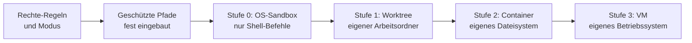

# S3.9 · Geschützte Pfade und Sandbox-Stufen

<!-- meta:start -->
> **Regal:** [Rechte & Freigaben](README.md#permissions) · **Stufe:** Kern · **~15 Min** · **Voraussetzungen:** [S3.8 Rechte für autonome Läufe](s3-08-rechte-fuer-autonomie.md) · 🛡 **Sicherheitsboden**
>
> ← [S3.8 Rechte für autonome Läufe](s3-08-rechte-fuer-autonomie.md) · [Bibliothek](README.md) · [S3.10 Netzwerk und Skills härten](s3-10-netzwerk-und-skills-haerten.md) →
<!-- meta:end -->

## Schnellcheck

- Kannst du ohne Nachschlagen sagen, was `acceptEdits` mit einem Schreibzugriff auf `.git` macht?
- Kannst du sagen, ob die eingebaute Sandbox auch die Edit-Änderungen von Claude begrenzt?

## Auf einen Blick

Geschützte Pfade wie `.git`, `.claude`, Shell-Startdateien und `.mcp.json` beschreibt Claude Code nie ohne Prüfung, und keine Allow-Regel ändert das. In `default` und `acceptEdits` fragt Claude Code, in `dontAsk` lehnt es ab. Die Ausnahme ist `bypassPermissions` (und der Plan-Modus einer Sitzung, in der dieser Modus freigeschaltet ist): Dort schreibt Claude Code auch in geschützte Pfade ohne Rückfrage.

Die eingebaute Sandbox begrenzt Shell-Befehle, nicht Claudes Datei-Werkzeuge, und läuft nicht unter nativem Windows. Echte Isolation stapelst du deshalb in Stufen: OS-Sandbox für Shell-Befehle, Git-Worktree, Container, eigene VM. Jede Stufe sagt, was sie begrenzt, und lässt anderes offen.

## Bild im Kopf

Geschützte Pfade sind die Tresorräume im Gebäude. Mit Besucher- oder Wartungsausweis kommst du nie ohne Gegenzeichnung hinein, und auch ein Dauereintrag auf der Zutrittsliste (eine Allow-Regel) öffnet sie nicht. Nur der Generalschlüssel (`bypassPermissions`) sperrt sie ohne Frage auf.

Die Sandbox ist eine Schleuse an der Shell-Tür: Ein Shell-Befehl kommt nur so weit, wie die Schleuse es erlaubt. An den Aktenschrank, an den Claudes Datei-Werkzeuge direkt greifen, reicht sie nicht. Die Testhalle ist erst der Container, und die VM ist ein eigenes Gebäude.



## Im Detail

### Geschützte Pfade: was Claude Code nie still beschreibt

Für eine kleine Gruppe von Pfaden gibt Claude Code Schreibzugriffe nie automatisch frei. Das schützt den Zustand des Repositorys und Claudes eigene Konfiguration vor versehentlicher Beschädigung.

| Modus | Schreibzugriff auf einen geschützten Pfad |
|---|---|
| `default`, `acceptEdits` | Rückfrage |
| `auto` | der Klassifikator entscheidet |
| `dontAsk` | abgelehnt |
| `bypassPermissions` | erlaubt |

Der Plan-Modus hängt von der Sitzung ab: In einer interaktiven Terminal-Sitzung, in der `bypassPermissions` verfügbar ist, erlaubt, sonst entscheidet der Klassifikator oder es kommt eine Rückfrage. Allow-Regeln aus Settings-Dateien geben geschützte Pfade nicht frei, denn die Prüfung läuft, bevor Claude Code Allow-Regeln auswertet. Ein Eintrag wie `Edit(.claude/**)` ändert an der Tabelle nichts.

Die Liste der Doku, nach Art geordnet:

- **Ordner:** `.git`, `.config/git`, `.vscode`, `.idea`, `.husky`, `.cargo`, `.devcontainer`, `.yarn`, `.mvn` und `.claude`, ausgenommen `.claude/worktrees`, wo Claude seine eigenen Git-Worktrees ablegt.
- **Dateien:** `.gitconfig`, `.gitmodules`; Shell-Startdateien wie `.bashrc`, `.zshrc`, `.profile`; `.npmrc`, `.envrc`; `.mcp.json`, `.claude.json` und weitere.

Die vollständige Liste steht in der Doku zu den Rechte-Modi. Sie ist fest im Programm, nicht in deinen Regeln: Keine breite Allow-Regel kann ein Umschreiben von `git config`, eine vergiftete `.bashrc` oder eine Selbständerung an `.mcp.json` durchwinken. Fragt Claude Code bei einer Änderung im `.claude`-Ordner des Projekts, kann die Rückfrage anbieten, Änderungen dort für die laufende Sitzung zu erlauben; so steht es in der Doku.

### Stufe 0: die OS-Sandbox für Shell-Befehle

Die Sandbox ist laut Doku standardmäßig aus. Du schaltest sie in der Sitzung mit `/sandbox` ein oder mit `sandbox.enabled` in einer Settings-Datei. Sie läuft unter macOS (Seatbelt), Linux und WSL2 (`bubblewrap` und `socat`). Unter nativem Windows läuft Claude Code Befehle ohne Sandbox; wer sie dort will, nimmt eine WSL2-Distribution.

Sie begrenzt Bash-, PowerShell- und Monitor-Befehle samt ihren Kindprozessen. Draußen bleiben Read, Edit, Write, WebFetch, WebSearch, Hooks und lokale MCP-Server. Dort gelten Rechte-Regeln und Modus: Eine Read-Deny-Regel stoppt das Read-Werkzeug und erkannte Dateibefehle, aber kein Skript, das Dateien selbst öffnet; eine Sperre, die jeden Prozess trifft, liefert erst die Sandbox.

`/sandbox` ist kein Rechte-Modus. Der Modus entscheidet, ob ein Aufruf läuft und ob du vorher gefragt wirst; die Sandbox begrenzt, was ein Shell-Befehl danach erreicht.

Zwei Grenzen der Sandbox musst du kennen. Erstens hat sie eine Ausweichklappe: Scheitert ein Befehl an der Sandbox, darf Claude ihn mit `dangerouslyDisableSandbox` außerhalb wiederholen; der Versuch läuft dann durch den normalen Rechte-Ablauf. Mit `"allowUnsandboxedCommands": false` schaltest du die Klappe ab; `/sandbox` zeigt das als **Strict sandbox mode**. Zweitens ist die Sandbox laut Doku keine vollständige Isolationsgrenze: Der Proxy prüft Domains anhand des Hostnamens, ohne TLS aufzubrechen, und breit freigegebene Domains wie `github.com` können Wege für Datenabfluss öffnen.

### Stufen 1 bis 3: Worktree, Container, VM

- **Stufe 1, Git-Worktree** (`claude --worktree <name>`, [S1.18](s1-18-worktrees.md)): ein eigener Arbeitsordner mit eigenem Branch. Laut Doku blockt Claude Code in einer Worktree-Sitzung Dateiänderungen und Git-Umleitungen in den Haupt-Checkout. Die Doku nennt das Isolation von Dateiänderungen; Netz und andere Pfade gehören nicht zu diesen Prüfungen.
- **Stufe 2, Container:** Der ganze Claude-Code-Prozess läuft im Container, also sind auch Datei-Werkzeuge, MCP-Server und Hooks eingeschlossen. Für `--dangerously-skip-permissions` nennt die Doku einen Container, eine VM oder die Sandbox-Runtime ([S4.7](s4-07-isolation-docker-worktrees.md)).
- **Stufe 3, eigene VM:** ein ganzes Betriebssystem. Für ein nicht vertrauenswürdiges Repository nennt die Doku eine eigene VM oder eine Cloud-Sitzung.

Jede dieser Isolationen mindert den Schaden eines Fehlers, beseitigt aber das Risiko nicht. Die Doku warnt: Jeder Ansatz, der Netzzugang zulässt, kann Daten abfließen lassen, die der Agent lesen kann, und jeder Ansatz, der dein Projekt beschreibbar einhängt, kann diesen Code ändern. Isolation ändert auch nicht, was an das Modell gesendet wird. Welche Stufe zu welchem Rechte-Modus passt, steht in [S3.8](s3-08-rechte-fuer-autonomie.md).

## Selbst machen

### Übung: geschützte Pfade in drei Modi (etwa 12 Minuten)

**Ziel:** Du siehst an einem Versuch, dass Claude Code in `.claude` und `.git` in `acceptEdits` fragt, auch wenn eine Allow-Regel existiert, und in `dontAsk` ablehnt. Die Übung läuft auf jedem System.

**Startzustand:** Du legst `~/cc-workshop/pfade` an: ein kleines Git-Repository mit einer Datei `notes.txt`. Mehr als Claude Code, Git und Python brauchst du nicht.

Bash:

```bash
mkdir -p ~/cc-workshop/pfade && cd ~/cc-workshop/pfade
printf 'first\n' > notes.txt
git init -q
```

PowerShell:

```powershell
New-Item -ItemType Directory -Force "$HOME\cc-workshop\pfade" | Out-Null
Set-Location "$HOME\cc-workshop\pfade"
Set-Content notes.txt "first"
git init -q
```

1. **Runde 1, ohne Regeln.** Starte `claude --permission-mode acceptEdits` und bestätige den Vertrauensdialog. Gib nacheinander diese drei Aufträge ein:
   - `Append the line "second" to notes.txt.`
   - `Create the file .claude/test-note.txt containing the word hello.`
   - `Append the line "# probe" to .git/info/exclude.`

   Erwartet: Der erste Auftrag läuft ohne Rückfrage. Bei den beiden anderen fragt Claude Code. Die Doku sagt, dass die Rückfrage für `.claude` eine Antwort anbieten kann, die den Ordner für die laufende Sitzung freigibt: „Yes, and allow Claude to edit files in this project's .claude folder for this session“ (Wortlaut der Doku). Lehn beide Rückfragen ab, mit der Nein-Antwort im Dialog, und beende die Sitzung mit `/exit`.
2. Prüf, dass nichts geschrieben wurde: In Bash `ls .claude/test-note.txt; grep probe .git/info/exclude`, in PowerShell `Test-Path .claude\test-note.txt; Select-String probe .git\info\exclude`. Erwartet: die Datei fehlt (`No such file` bzw. `False`), und `grep` bzw. `Select-String` findet nichts.
3. **Runde 2, mit Allow-Regeln.** Leg `.claude/settings.json` mit einem Editor an (den Ordner `.claude` legst du selbst an; Claude würde dort nachfragen). Die Regeln erlauben genau die Pfade, die du eben abgelehnt hast:

   <!-- cockpit:example -->
   ```json
   {
     "permissions": {
       "allow": ["Edit(.claude/**)", "Edit(.git/**)", "Edit(notes.txt)"]
     }
   }
   ```

   Starte wieder mit `claude --permission-mode acceptEdits` und gib die beiden letzten Aufträge aus Runde 1 noch einmal ein. Erwartet: Claude Code fragt trotzdem, denn laut Doku ändert ein Eintrag wie `Edit(.claude/**)` das Ergebnis nicht. Lehn beide ab und beende die Sitzung.
4. **Runde 3, `dontAsk`.** Starte `claude --permission-mode dontAsk` (Statusleiste: `⏵⏵ don't ask on`) und gib alle drei Aufträge ein, den ersten mit „third“ statt „second“. Erwartet: Die Änderung an `notes.txt` läuft, die beiden anderen werden ohne Rückfrage abgelehnt, und Claude meldet es. Beende die Sitzung.
5. Wiederhol die Prüfung aus Schritt 2 und lies `notes.txt`. Erwartet: `.claude/test-note.txt` fehlt weiter, `grep probe` findet nichts, `notes.txt` enthält `first`, `second` und `third`.

**Aufräumen:** Lösch den Ordner `~/cc-workshop/pfade` selbst (in PowerShell `Remove-Item -Recurse -Force`, falls Windows sich an `.git` stört). Die Regeln gelten nur dort.

**Geschafft, wenn:**

- [ ] in Runde 1 die Änderung an `notes.txt` ohne Rückfrage lief und `.claude` und `.git` je eine Rückfrage auslösten
- [ ] in Runde 2 beide trotz Allow-Regel wieder fragten
- [ ] in Runde 3 beide ohne Rückfrage abgelehnt wurden, `notes.txt` aber geändert war
- [ ] am Ende weder `.claude/test-note.txt` noch die Zeile `# probe` existierte

### Übung: die Stufe wählen (etwa 5 Minuten)

**Ziel:** Du ordnest vier Lagen einer Isolationsstufe zu und nennst zu jeder, was die Stufe offen lässt.

**Startzustand:** Papier oder eine Notiz, kein Ordner.

1. Schreib zu jeder Lage die Stufe (0 OS-Sandbox, 1 Worktree, 2 Container, 3 VM) und einen Satz, was sie nicht abdeckt:
   - **a)** Du lässt Claude auf deinem Mac `npm test` laufen und willst weniger Rückfragen für Shell-Befehle.
   - **b)** Du lässt zwei Sitzungen parallel an verschiedenen Aufgaben im selben Repository arbeiten.
   - **c)** Ein Nachtlauf soll mit `--dangerously-skip-permissions` laufen.
   - **d)** Du sollst ein Repository eines Unbekannten untersuchen, dem du nicht traust.

<details><summary>Vergleich</summary>

**a)** Stufe 0: Die Sandbox begrenzt die Shell-Befehle. Sie deckt Edit, Write, Hooks und MCP-Server nicht ab. Unter nativem Windows gäbe es sie nicht. **b)** Stufe 1: Jede Sitzung hat einen eigenen Arbeitsordner und Branch. Netz und Pfade außerhalb gehören nicht zu seinen Prüfungen. **c)** Stufe 2 oder 3: Ein Container oder eine VM, laut Doku ohne Internetzugang. Offen bleibt, was du hineinmountest und was das Netz erreicht, wenn es erlaubt ist. **d)** Stufe 3: eine eigene VM oder eine Cloud-Sitzung, so nennt es die Doku. Offen bleibt, was an das Modell gesendet wird.

</details>

**Geschafft, wenn:**

- [ ] du alle vier Lagen zugeordnet und zu jeder eine Lücke der Stufe genannt hast

### Extra: die Sandbox ausprobieren (etwa 10 Minuten, macOS, Linux oder WSL2)

**Ziel:** Du siehst, dass die Sandbox einen Shell-Befehl stoppt, der außerhalb des Projekts schreibt oder am Proxy vorbei ins Netz will.

**Startzustand:** macOS, Linux oder WSL2. Unter nativem Windows gibt es die Sandbox laut Doku nicht: Überspring diese Übung. Unter Linux und WSL2 braucht sie `bubblewrap` und `socat`; zeigt `/sandbox` nur einen Reiter für Abhängigkeiten, fehlt etwas, und du brichst hier ab oder installierst die Pakete nach der Doku. Du arbeitest im Ordner `~/cc-workshop/sandbox` (`mkdir -p ~/cc-workshop/sandbox && cd ~/cc-workshop/sandbox`).

1. Starte `claude --permission-mode default` und gib `/sandbox` ein. Wähl auf dem Reiter „Mode“ eine Option; Claude Code speichert die Wahl laut Doku in `.claude/settings.local.json` des Projekts, also in deinem Übungsordner.
2. Bitte Claude: `Run exactly this command: touch ~/sandbox-probe`. Laut Doku scheitert der Befehl in der Sandbox mit `Operation not permitted` (macOS) oder `Read-only file system` (Linux, WSL2). Bietet Claude an, ihn außerhalb der Sandbox zu wiederholen, lehn ab.
3. Bitte Claude: `Run exactly this command: curl --noproxy '*' https://example.com`. Laut Doku scheitert er mit `Could not resolve host`. Lehn auch hier eine Wiederholung außerhalb ab.
4. Prüf in einem zweiten Terminal, ob `~/sandbox-probe` existiert. Existiert sie, war die Sandbox nicht an: Lösch die Datei und prüf `/sandbox`.

**Aufräumen:** Beende die Sitzung und lösch den Ordner `~/cc-workshop/sandbox`, damit auch die Sandbox-Einstellung verschwindet. Deine globale Konfiguration hast du nicht angefasst. Eine eventuell angelegte `~/sandbox-probe` löschst du selbst.

**Geschafft, wenn:**

- [ ] beide Befehle in der Sandbox scheiterten und `~/sandbox-probe` nicht existierte

## Typische Fallen

- **„In `bypassPermissions` bleiben die geschützten Pfade zu."** Das stimmt nicht: `bypassPermissions` schreibt ohne Rückfrage in geschützte Pfade. Die Liste schützt nur in den anderen Modi.
- **Eine Allow-Regel für `.claude/**` hilft nicht.** Allow-Regeln geben geschützte Pfade nie frei; die Übung oben zeigt es.
- **`/sandbox` fehlt oder zeigt nur einen Reiter für Abhängigkeiten.** Unter nativem Windows gibt es die Sandbox nicht; nimm WSL2. Unter Linux und WSL2 braucht sie die Pakete `bubblewrap` und `socat`; das Panel von `/sandbox` zeigt, was fehlt.
- **Die Sandbox ist an, trotzdem schreibt Edit.** Die Sandbox gilt nicht für Read, Edit und Write; für diese Werkzeuge sind Rechte-Regeln und Modus zuständig.
- **Die Sandbox startet nicht, und trotzdem läuft alles.** Kann sie nicht starten, führt Claude Code die Befehle laut Doku standardmäßig ohne Sandbox aus. Mit `sandbox.failIfUnavailable` auf `true` bricht es stattdessen beim Start ab.

## Check

Du kannst an einem Versuch zeigen, was Claude Code in geschützten Pfaden je Modus tut, und für eine riskante Aufgabe die Isolationsstufe wählen.

1. Was passiert mit einem Schreibzugriff auf `.git` in `acceptEdits`, in `dontAsk` und in `bypassPermissions`, und ändert eine Allow-Regel daran etwas?
2. Welche Werkzeuge begrenzt die eingebaute Sandbox, welche nicht, und wo läuft sie nicht?
3. Du willst einen Nachtlauf mit `--dangerously-skip-permissions` starten. Warum reicht die OS-Sandbox allein dafür nicht, und welche Stufen nennt die Doku?

<details><summary>Auflösung</summary>

1. In `acceptEdits` fragt Claude Code, in `dontAsk` lehnt es ab, in `bypassPermissions` schreibt es ohne Rückfrage. Eine Allow-Regel ändert daran nichts, denn die Prüfung der geschützten Pfade läuft vor den Allow-Regeln.
2. Sie begrenzt Bash-, PowerShell- und Monitor-Befehle samt ihren Kindprozessen. Read, Edit, Write, WebFetch, WebSearch, Hooks und lokale MCP-Server laufen außerhalb. Unter nativem Windows läuft sie nicht.
3. Die OS-Sandbox deckt nur Shell-Befehle ab; Datei-Werkzeuge, MCP-Server und Hooks liefen weiter auf deinem Rechner. Die Doku nennt einen Container, eine VM oder die Sandbox-Runtime, also eine Grenze um den ganzen Claude-Code-Prozess.

</details>

<details><summary>Quizfrage</summary>

**Frage:** Du hast `/sandbox` eingeschaltet und arbeitest in `acceptEdits`. Claude soll die Datei `.claude/settings.json` deines Projekts per Edit ändern. Was passiert?

- **Richtig:** Claude Code fragt nach, denn `.claude` ist ein geschützter Pfad und die Sandbox gilt nur für Shell-Befehle, nicht für das Edit-Werkzeug.
- Falsch: Die Änderung läuft ohne Rückfrage, denn mit eingeschalteter Sandbox sind Schreibzugriffe im Projektordner für alle Werkzeuge abgesichert.
- Falsch: Claude Code lehnt ab, weil die Sandbox `.claude` für alle Werkzeuge schreibgeschützt hält, auch wenn du es freigeben würdest.
- Falsch: Claude Code fragt nur, weil keine Allow-Regel vorhanden ist; mit `Edit(.claude/**)` in den Settings liefe die Änderung ohne Rückfrage.

</details>

## Weiterlesen

- [Geschützte Pfade (offizielle Doku)](https://code.claude.com/docs/en/permission-modes#protected-paths)
- [Sandboxing (offizielle Doku)](https://code.claude.com/docs/en/sandboxing)
- [Sandbox-Umgebungen im Vergleich (offizielle Doku)](https://code.claude.com/docs/en/sandbox-environments)
- [S3.8 · Rechte für autonome Läufe](s3-08-rechte-fuer-autonomie.md)
- [S3.10 · Netzwerk und Skills härten](s3-10-netzwerk-und-skills-haerten.md)
- [S1.18 · Worktrees als Testlabor](s1-18-worktrees.md)
- [S4.7 · Isolation mit Docker und Worktrees](s4-07-isolation-docker-worktrees.md)
- [S2.8 · Einen Hook einrichten, der wirklich blockt](s2-08-hook-einrichten.md)
