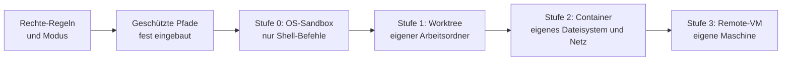

# S3.9 · Geschützte Pfade und Sandbox-Stufen

<!-- meta:start -->
> **Regal:** [Rechte & Freigaben](README.md#permissions) · **Stufe:** Kern · **~15 Min** · **Voraussetzungen:** [S3.8 Rechte für autonome Läufe](s3-08-rechte-fuer-autonomie.md) · 🛡 **Sicherheitsboden**
>
> ← [S3.8 Rechte für autonome Läufe](s3-08-rechte-fuer-autonomie.md) · [Bibliothek](README.md) · [S3.10 Netzwerk und Skills härten](s3-10-netzwerk-und-skills-haerten.md) →
<!-- meta:end -->

## Schnellcheck

- Hast du schon einmal `/sandbox` eingeschaltet und geprüft, was die Sandbox blockt, etwa einen Netzzugriff oder einen Schreibzugriff außerhalb des Projekts?
- Kannst du ohne Nachschlagen sagen, in welchem Rechte-Modus Claude Code ohne Rückfrage in `.git` schreibt?

## Auf einen Blick

Geschützte Pfade wie `.git`, `.claude`, Shell-Startdateien und `.mcp.json` beschreibt Claude Code nie ohne Prüfung, und keine Allow-Regel ändert das. Die Ausnahme ist `bypassPermissions`: Ist der Modus aktiv (oder im Plan-Modus einer Sitzung, die ihn freigeschaltet hat), schreibt Claude Code auch dort ohne Rückfrage. Die eingebaute Sandbox begrenzt nur Shell-Befehle, nicht Read, Edit und Write, und läuft nicht unter nativem Windows.

Echte Isolation stapelst du deshalb in Stufen: OS-Sandbox für Shell-Befehle, Git-Worktree, Container, eigene VM. Welche Grenze was verhindert, zeigt die Tabelle „Vertrauensgrenzen in der Praxis".

## Bild im Kopf

Geschützte Pfade sind die Tresorräume im Gebäude. Mit Besucher- oder Wartungsausweis kommst du nie ohne Gegenzeichnung hinein, und auch ein Dauereintrag auf der Zutrittsliste (eine Allow-Regel) öffnet sie nicht. Nur der Generalschlüssel sperrt sie ohne Frage auf; deshalb gibt es ihn nur in der abgeschlossenen Testhalle.

Die Sandbox ist diese Testhalle ohne Verbindung nach draußen: Was darin schiefgeht, bleibt darin, der Schadensradius ist begrenzt. Je gefährlicher der Versuch, desto dicker die Wand: vom abgetrennten Prüfstand (Worktree) über den eigenen Container bis zum separaten Gebäude (Remote-VM).



## Im Detail

### Geschützte Pfade: was Claude Code nie still beschreibt

Für eine kleine Gruppe von Pfaden gibt Claude Code Schreibzugriffe nie automatisch frei. Ausgenommen sind nur `bypassPermissions` und der Plan-Modus einer interaktiven Terminal-Sitzung, in der `bypassPermissions` verfügbar ist. Das schützt den Zustand des Repositorys und Claudes eigene Konfiguration vor versehentlicher Beschädigung.

| Modus | Schreibzugriff auf einen geschützten Pfad |
|---|---|
| `default`, `acceptEdits` | Rückfrage |
| `plan` | in einer interaktiven Terminal-Sitzung mit verfügbarem `bypassPermissions` erlaubt; sonst entscheidet der Klassifikator, wenn `auto` verfügbar ist, und andernfalls kommt eine Rückfrage |
| `auto` | der Klassifikator entscheidet |
| `dontAsk` | abgelehnt |
| `bypassPermissions` | erlaubt |

Allow-Regeln aus Settings-Dateien geben geschützte Pfade nicht frei: Die Prüfung läuft, bevor Claude Code Allow-Regeln auswertet. Ein Eintrag wie `Edit(.claude/**)` ändert an der Tabelle nichts.

**Geschützte Ordner (Auszug):**

- `.git`, dein Versionsstand
- `.vscode`, `.idea`, `.husky`: Konfiguration von IDE und Git-Hooks
- `.claude`, **außer** `.claude/worktrees`, wo Claude seine eigenen Git-Worktrees ablegt

**Geschützte Dateien (Auszug):**

- `.gitconfig`, `.gitmodules`
- `.bashrc`, `.zshrc`, `.profile`: dein Shell-Start
- `.ripgreprc`
- `.mcp.json`, `.claude.json`: Claude Codes eigene Konfiguration

Die vollständige Liste ist länger, sie nennt unter anderem `.config/git`, `.devcontainer`, `.npmrc` und `.envrc`; sie steht in der Doku zu den Rechte-Modi.

**Warum es das gibt:** Die Liste steht fest im Programm, nicht in deinen Regeln. So kann keine breite Allow-Regel ein Umschreiben von `git config`, eine vergiftete `.bashrc` oder eine Selbständerung an `.mcp.json` durchwinken. In `auto` entscheidet für diese Pfade immer der Klassifikator, nie eine Allow-Regel.

### Sandbox-Stufen

Claude Code bietet mehrere Stufen der Isolation. Wer autonome Agenten laufen lässt, muss sie kennen.

**Stufe 0: OS-Sandbox (eingebaut)**

Claude Code bringt eine Sandbox auf Betriebssystemebene für Shell-Befehle mit:

| Plattform | Technik | Was sie begrenzt |
|---|---|---|
| macOS | Seatbelt | Dateipfade, Netzzugriff |
| Linux, WSL2 | bubblewrap (bwrap) | Dateipfade, Netzzugriff |
| Windows (nativ) | keine eingebaute Sandbox; Claude Code in einer WSL2-Distribution laufen lassen | – |

Du schaltest sie in der Sitzung mit `/sandbox` ein. Sie gilt für Bash-, PowerShell- und Monitor-Befehle samt ihren Kindprozessen, nicht für Read, Edit und Write: Diese Werkzeuge laufen direkt über das Rechte-System. Anthropic nennt aus eigener Nutzung 84 % weniger Rückfragen mit Sandbox. Das ist eine Herstellerangabe, kein unabhängiger Vergleich, und bei dir hängt es vom Arbeitsablauf ab.

`/sandbox` ist kein Rechte-Modus. Der Modus entscheidet, ob ein Aufruf läuft und ob du vorher gefragt wirst; die Sandbox begrenzt, was ein Shell-Befehl danach erreicht. Deshalb ergänzen sich beide: Read- und Edit-Deny-Regeln greifen bei Claudes Datei-Werkzeugen und bei Shell-Befehlen, die Claude Code als Dateibefehle erkennt, aber nicht bei einem Skript, das Dateien selbst öffnet. Eine Sperre, die jeden Prozess trifft, liefert erst die Sandbox.

**Stufe 1: Git-Worktrees (leicht)**

Eigener Arbeitsordner, gleiches Dateisystem. Schützt den Hauptbranch vor Fehlern des Agenten. Fast kein Aufwand: `claude --worktree` oder `/batch`. Mehr dazu in [S1.18](s1-18-worktrees.md) und [S4.7](s4-07-isolation-docker-worktrees.md).

<!-- cockpit:example -->
```bash
git worktree add ../agent-task-1 -b agent/task-1
# Agent arbeitet in ../agent-task-1 (Stufe 1: eigener Arbeitsordner, gleiches Dateisystem)
# Der Hauptordner und sein Branch bleiben unangetastet
```

**Stufe 2: Docker oder Inception (volle Trennung auf Betriebssystemebene)**

Eigenes Dateisystem, eigenes Netz, eigener Prozessraum. Du kannst generierten Code ausführen, ohne den Host zu gefährden. `multi-model-orchestrator:inception` (🔧 eigenes Plugin) automatisiert Aufbau und Abbau ([S4.7](s4-07-isolation-docker-worktrees.md)).

**Stufe 3: Remote-Sandboxes**

Eine ganze VM pro Agent, vollständige Netztrennung. Für die Analyse wirklich gefährlicher Code-Proben.

Welche Stufe zu welchem Rechte-Modus passt, etwa `bypassPermissions` nur mit Container oder VM, steht in [S3.8](s3-08-rechte-fuer-autonomie.md).

### Vertrauensgrenzen in der Praxis

| Grenze | Mechanismus | Was sie verhindert |
|---|---|---|
| Werkzeugrechte | `tools` / `disallowedTools` in der Agent-Definition ([S3.3](s3-03-eigener-subagent.md)) | Ein Explorer-Agent kann keine Dateien ändern |
| Dateisystem | Worktree-Isolation | Der Agent kann den Hauptbranch nicht anfassen |
| Pfadschutz | geschützte Pfade (fest eingebaut) | `.git`, Shell-Konfiguration und `.mcp.json` werden nicht ohne Prüfung umgeschrieben, außer in `bypassPermissions` |
| Betriebssystem | Docker / Inception | Der Agent erreicht das Dateisystem des Hosts nicht |
| Prozess | Hooks, die Aktionen blocken, nach bestem Bemühen ([S2.8](s2-08-hook-einrichten.md)) | Bestimmte Befehle werden ganz geblockt |
| Netz | Docker ohne Netz (`network none`) plus `sandbox.network.deniedDomains` ([S3.10](s3-10-netzwerk-und-skills-haerten.md)) | Der Agent baut keine Verbindungen nach außen auf oder erreicht gesperrte Domains nicht |

Das Prinzip der geringsten Rechte gilt für Agenten genauso wie für Benutzerkonten. Das ist keine optionale Härtung, sondern die Grundausstattung. Üben kannst du die Schichten im Wrong-Door Heist in [S3.8](s3-08-rechte-fuer-autonomie.md).

## Typische Fallen

- **„Auch der Generalschlüssel kommt nicht in den Tresor."** Das stimmt nicht: `bypassPermissions` schreibt ohne Rückfrage in geschützte Pfade. Die Liste schützt nur in den anderen Modi.
- **Eine Allow-Regel für `.claude/**` hilft nicht.** Allow-Regeln geben geschützte Pfade nie frei. Fragt Claude Code bei einer Änderung in `.claude/`, kann die Rückfrage anbieten, Änderungen in diesem Ordner für die laufende Sitzung zu erlauben.
- **`/sandbox` fehlt oder zeigt nur einen Reiter für Abhängigkeiten.** Unter nativem Windows gibt es die Sandbox nicht; nimm WSL2. Unter Linux und WSL2 braucht sie die Pakete `bubblewrap` und `socat`; das Panel von `/sandbox` zeigt, was fehlt.
- **Die Sandbox ist an, trotzdem schreibt Edit.** Die Sandbox gilt nicht für Read, Edit und Write; für diese Werkzeuge sind Rechte-Regeln und Modus zuständig.

## Check

Du kannst die geschützten Pfade nennen, sagen, in welchem Modus Claude Code trotzdem ohne Rückfrage hineinschreibt, und für eine riskante Aufgabe die passende Isolationsstufe wählen.

1. Was passiert mit einem Schreibzugriff auf `.git` in `default`, in `auto`, in `dontAsk` und in `bypassPermissions`?
2. Welche Werkzeuge begrenzt die eingebaute Sandbox, und welche nicht?
3. Du willst generierten, unbekannten Code ausführen, ohne den Host zu gefährden. Welche Stufe brauchst du mindestens?

<details><summary>Quizfrage</summary>

**Frage:** Welche Aussage beschreibt geschützte Pfade und die OS-Sandbox richtig?

- **Richtig:** Geschützte Pfade legen fest, welche Schreibzugriffe geprüft werden; die Sandbox begrenzt, was ein Shell-Befehl erreicht.
- Falsch: Die Sandbox macht geschützte Pfade überflüssig, weil sie Schreibzugriffe auf `.git` für alle Werkzeuge sperrt, auch für Edit.
- Falsch: Geschützte Pfade gelten nur in `auto`; in `default` und `acceptEdits` schreibt Claude Code dort ohne Rückfrage hinein.
- Falsch: Mit `/sandbox` übernimmt Docker die geschützten Pfade und ersetzt die eingebaute Liste durch eigene Mount-Regeln.

</details>

## Weiterlesen

- [Geschützte Pfade (offizielle Doku)](https://code.claude.com/docs/en/permission-modes#protected-paths)
- [Sandboxing (offizielle Doku)](https://code.claude.com/docs/en/sandboxing)
- [Sandbox-Umgebungen im Vergleich (offizielle Doku)](https://code.claude.com/docs/en/sandbox-environments)
- [Anthropic Engineering: Sandboxing in Claude Code](https://www.anthropic.com/engineering/claude-code-sandboxing), Quelle der Herstellerangabe
- [S3.8 · Rechte für autonome Läufe](s3-08-rechte-fuer-autonomie.md), mit dem Wrong-Door Heist
- [S3.10 · Netzwerk und Skills härten](s3-10-netzwerk-und-skills-haerten.md)
- [S1.18 · Worktrees als Testlabor](s1-18-worktrees.md)
- [S4.7 · Isolation mit Docker und Worktrees](s4-07-isolation-docker-worktrees.md)
- [S2.8 · Einen Hook einrichten, der wirklich blockt](s2-08-hook-einrichten.md)
