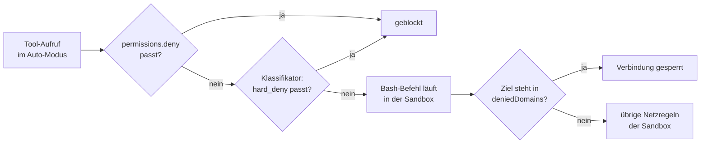

# S3.10 · Netzwerk und Skills härten

<!-- meta:start -->
> **Regal:** [Gegenprüfung & Compliance](README.md#security) · **Stufe:** Vertiefung · **~20 Min** · **Voraussetzungen:** [S3.9 Geschützte Pfade und Sandbox-Stufen](s3-09-geschuetzte-pfade-und-sandbox.md)
>
> ← [S3.9 Geschützte Pfade und Sandbox-Stufen](s3-09-geschuetzte-pfade-und-sandbox.md) · [Bibliothek](README.md) · [S3.11 Datenschutz, Aufbewahrung und regulierte Branchen](s3-11-datenschutz-und-compliance.md) →
<!-- meta:end -->

## Schnellcheck

- Kannst du ohne Nachschlagen sagen, was `disableSkillShellExecution` abschaltet?
- Weißt du, warum ein `autoMode`-Block in der `.claude/settings.json` eines Repos nichts bewirkt?

## Auf einen Blick

Drei Schalter verkleinern die Angriffsfläche, ohne dass du Sandbox, Auto-Modus oder Skills ganz abschaltest. `sandbox.network.deniedDomains` sperrt einzelne Domains für Befehle in der Sandbox, auch wenn eine breitere Freigabe sie erlauben würde. `autoMode.hard_deny` gibt dem Klassifikator des Auto-Modus Regeln, die weder eine Bitte des Nutzers noch eine Ausnahme aufweicht. `disableSkillShellExecution` verhindert, dass Skills beim Laden Shell-Befehle über `` !`…` `` ausführen.

Achte auf den Ort: `deniedDomains` und `disableSkillShellExecution` wirken in jeder Settings-Datei. `autoMode` liest Claude Code nur aus `~/.claude/settings.json`, aus den Managed Settings und über `--settings`, nie aus der `.claude/settings.json` im Repo. Managed Settings sind Einstellungen, die Admins, also die Personen, die Claude Code für eine Organisation verwalten, zentral ausrollen; Nutzer und Projekte können sie laut Doku nicht überschreiben. Allein an deinem Rechner kannst du sie nicht ausprobieren. Die Übung unten braucht sie nicht.

## Bild im Kopf

Stell dir einen Zutrittscontroller mit drei zusätzlichen Sperren vor. Die Domain-Sperrliste ist eine feste Schwarzliste für bestimmte Ausgänge: Durch diese Tür kommt niemand, egal welcher Ausweis sonst gilt. `hard_deny` ist die Sicherheitsverriegelung, die auch der Bereichsleiter nicht übersteuert. `disableSkillShellExecution` ist das Siegel auf der Wartungsklappe: Ein geänderter Skill kann dort keinen Befehl mehr einschleusen, der beim Öffnen läuft.



## Im Detail

### Netzwerk: einzelne Domains hart sperren

In der Sandbox ([S3.9](s3-09-geschuetzte-pfade-und-sandbox.md)) laufen Bash-Befehle und ihre Kindprozesse mit eingeschränktem Netzwerk. `sandbox.network.deniedDomains` sperrt dort bestimmte Domains ausdrücklich. Eine gesperrte Domain bleibt gesperrt, auch wenn ein Eintrag in `allowedDomains` sie ebenfalls trifft, etwa über einen Platzhalter. Die Schreibweise ist dieselbe wie bei `allowedDomains`: Domain, Platzhalter-Muster oder IP-Adresse, optional mit `:port`. Die Liste darf in jeder Settings-Datei stehen. Typischer Fall: „Netzwerk ist erlaubt, aber nie `evil.com` und nie der alte Endpunkt, der abgeschaltet werden soll.“

Die Sperre gilt nur für Befehle in der Sandbox. Read, Edit, WebFetch und WebSearch laufen laut Doku außerhalb: Ein Eintrag bei `allowedDomains` begrenzt WebFetch nicht, und `deniedDomains` stoppt ihn deshalb auch nicht. Für WebFetch schreibst du eine Regel wie `WebFetch(domain:evil.com)` unter `permissions.deny` ([S3.8](s3-08-rechte-fuer-autonomie.md)).

### Auto-Modus: Regeln, die der Klassifikator nie aufweicht

Im Auto-Modus entscheidet ein Klassifikator, welche Aktionen ohne Rückfrage laufen ([S3.8](s3-08-rechte-fuer-autonomie.md)). Mit dem Block `autoMode` gibst du ihm eigene Regeln. `hard_deny` ist die härteste Liste: Diese Regeln blocken ohne Bedingung, weder eine ausdrückliche Bitte des Nutzers noch eine `allow`-Ausnahme hebt sie auf. Drei Dinge musst du dabei wissen:

- **Die Einträge sind Sätze, keine Tool-Muster.** Der Klassifikator liest sie als Regeln in natürlicher Sprache. Harte Sperren nach Tool-Muster wie `Bash(psql *)` schreibst du in `permissions.deny`; die greifen schon vor dem Klassifikator.
- **`"$defaults"` gehört in die Liste.** Setzt du `hard_deny` ohne den Eintrag `"$defaults"`, ersetzt deine Liste die eingebauten Regeln, und die eingebaute Regel gegen Datenabfluss ist weg.
- **Der Ort entscheidet.** Claude Code liest `autoMode` nur aus `~/.claude/settings.json`, aus den Managed Settings und aus `--settings` bzw. dem Agent SDK. Aus `.claude/settings.json` und `.claude/settings.local.json` im Repo liest es den Block nicht, damit ein fremdes Repo sich keine eigenen Ausnahmen mitbringen kann.

Admins können den Auto-Modus über die Managed Settings eingrenzen, ohne ihn ganz abzuschalten; Entwickler können eigene Einträge ergänzen, aber keine aus den Managed Settings entfernen. Für Aktionen, die unter keinen Umständen laufen dürfen, nennt die Doku `permissions.deny`: Der Klassifikator ist ein zweites Tor nach dem Rechtesystem, und die `deny`-Regel greift vorher und lässt sich nicht überschreiben. Was der Klassifikator tatsächlich verwendet, deine Regeln und sonst die eingebauten, zeigt `claude auto-mode config`. Diese Prüfung liest deine Nutzer-Datei; du kannst sie nicht in einem Wegwerf-Ordner nachstellen, ohne `~/.claude/settings.json` anzufassen. Die Übung lässt sie deshalb aus.

### Skills: keine Shell beim Laden

Skills können über `` !`command` `` Shell-Befehle einbetten ([S2.5](s2-05-lebendige-prompts.md)). Claude Code führt sie aus, bevor der Skill-Inhalt an Claude geht, und setzt die Ausgabe ein. Wer einen Skill einschleusen oder verändern kann, bringt damit Befehle mit, die beim Laden des Skills laufen.

`disableSkillShellExecution: true` schaltet das ab. Claude Code ersetzt dann jeden eingebetteten Befehl durch `[shell command execution disabled by policy]` (Wortlaut der Doku). Skills funktionieren weiter als statische Prompts, sie verlieren nur den dynamischen Teil. Das gilt für Skills und Commands aus Nutzer-, Projekt- und Plugin-Quellen und aus zusätzlichen Verzeichnissen; mitgelieferte und über die Managed Settings verteilte Skills sind ausgenommen. Am meisten bringt die Einstellung in den Managed Settings: Ein `true` dort lässt sich an keiner anderen Stelle mit `false` überschreiben. Soll Claude bestimmte, geprüfte Skills weiter ohne Rückfrage aufrufen, gib genau diese mit `Skill(<name>)`-Regeln in `permissions.allow` frei.

### Alle drei in einer Datei

Für deine Nutzer-Datei `~/.claude/settings.json`, oder für alle im Unternehmen in den Managed Settings, sieht das zusammen so aus. Übernimm es erst, wenn du jeden Schlüssel verstehst:

```json
{
  "sandbox": {
    "network": {
      "deniedDomains": ["legacy-scada.corp.internal"]
    }
  },
  "autoMode": {
    "hard_deny": [
      "$defaults",
      "Never touch the production database tooling, no matter how safe the action looks"
    ]
  },
  "disableSkillShellExecution": true
}
```

In die `.claude/settings.json` eines Projekts gehören nur die beiden anderen Schlüssel; den `autoMode`-Block würde Claude Code dort nicht lesen.

## Selbst machen

### Übung: die Skill-Shell abschalten und sehen (etwa 10 Minuten)

**Ziel:** Du siehst an einem Skill mit einer `` !`…` ``-Zeile, dass sein Befehl ohne den Schalter läuft und mit ihm nicht.

**Startzustand:** Du legst `~/cc-workshop/skill-shell` an, einen Ordner mit einem Projekt-Skill. Der Skill ruft `echo` auf; `echo` gehört laut Doku zu den eingebauten Lesebefehlen, deshalb erwartet dich keine Rückfrage. Mehr als Claude Code brauchst du nicht. Den Schalter setzt du in der Settings-Datei des Ordners, nicht in deiner Nutzer-Datei.

Bash:

```bash
mkdir -p ~/cc-workshop/skill-shell/.claude/skills/probe
cd ~/cc-workshop/skill-shell
```

PowerShell:

```powershell
New-Item -ItemType Directory -Force "$HOME\cc-workshop\skill-shell\.claude\skills\probe" | Out-Null
Set-Location "$HOME\cc-workshop\skill-shell"
```

1. Leg mit einem Editor die Datei `.claude/skills/probe/SKILL.md` an (`.claude` ist ein geschützter Pfad, Claude würde dort nachfragen). Der Befehl in der `` !`…` ``-Zeile steht nur hier, nie im Text, den Claude später sieht:

   ```markdown
   ---
   description: Reports what the shell line of this skill printed. Use only when asked to run the probe skill.
   ---

   Shell output: !`echo SKILL-SHELL-RAN`

   Task: Quote the line that starts with "Shell output:" exactly as you received it. Say nothing else.
   ```

2. **Ohne Schalter.** Starte `claude --permission-mode default`, bestätige den Vertrauensdialog und gib `/probe` ein. Erwartet: Claude zitiert `Shell output: SKILL-SHELL-RAN`. Der Befehl ist gelaufen, bevor Claude den Text sah. Beende die Sitzung mit `/exit`.
3. **Mit Schalter.** Leg `.claude/settings.json` an:

   <!-- cockpit:example -->
   ```json
   {
     "disableSkillShellExecution": true
   }
   ```

4. Starte eine neue Sitzung mit `claude --permission-mode default` und gib wieder `/probe` ein. Erwartet: Claude zitiert `Shell output: [shell command execution disabled by policy]`. Die Zeichenfolge `SKILL-SHELL-RAN` erscheint nicht mehr, denn Claude bekommt den Befehl nie zu sehen. Beende die Sitzung.

**Aufräumen:** Lösch den Ordner `~/cc-workshop/skill-shell`. Der Schalter galt nur dort.

**Geschafft, wenn:**

- [ ] Claude ohne Schalter `SKILL-SHELL-RAN` zitierte
- [ ] Claude mit Schalter den Platzhalter `[shell command execution disabled by policy]` zitierte
- [ ] du sagen kannst, warum der Schalter erst in den Managed Settings gegen einen Skill-Autor hilft, der in seinem Projekt selbst `false` setzen könnte

## Typische Fallen

- **Der `autoMode`-Block steht im Repo.** In `.claude/settings.json` oder `.claude/settings.local.json` liest der Klassifikator ihn nicht. Verschieb ihn nach `~/.claude/settings.json` oder in die Managed Settings und prüf mit `claude auto-mode config`, was ankommt.
- **`hard_deny` ohne `"$defaults"`.** Dann ersetzt deine Liste die eingebauten Regeln, und die eingebaute Sperre gegen Datenabfluss fehlt.
- **Tool-Muster im `autoMode`-Block.** Einträge wie `"Bash(psql *)"` sind dort fehl am Platz, denn der Klassifikator liest Sätze, keine Muster. Für Muster nimm `permissions.deny`.
- **Der Schalter wirkt nicht auf mitgelieferte Skills.** `disableSkillShellExecution` betrifft weder mitgelieferte Skills noch Skills aus den Managed Settings.

## Check

Du kannst für jeden der drei Schalter sagen, was er sperrt und in welcher Settings-Datei er wirkt, und am Versuch zeigen, was `disableSkillShellExecution` verändert.

1. Was passiert mit einer Domain, die in `deniedDomains` steht und zugleich von einem Platzhalter in `allowedDomains` getroffen wird, und welche Zugriffe erfasst die Sperre nicht?
2. Warum liest der Klassifikator `autoMode` nicht aus der `.claude/settings.json` eines Repos, und was gehört stattdessen in `permissions.deny`?
3. Was zeigt Claude statt der Ausgabe eines `` !`…` ``-Befehls, wenn `disableSkillShellExecution` gilt, und welche Skills sind davon ausgenommen?

<details><summary>Auflösung</summary>

1. Sie bleibt gesperrt. Die Sperre gilt nur für Befehle in der Sandbox, nicht für Read, Edit, WebFetch und WebSearch; für WebFetch brauchst du eine `WebFetch(domain:…)`-Regel unter `permissions.deny`.
2. Damit ein fremdes Repo sich keine eigenen Ausnahmen mitbringen kann. Harte Sperren nach Tool-Muster wie `Bash(psql *)` gehören in `permissions.deny`, weil `autoMode`-Einträge Sätze sind.
3. Den Platzhalter `[shell command execution disabled by policy]`. Mitgelieferte Skills und Skills aus den Managed Settings sind ausgenommen.

</details>

<details><summary>Quizfrage</summary>

**Frage:** Ein Pentest-Team zeigt: Ein bösartiges Skill-Update mit einer `` !`…` ``-Zeile, die eine Domain des Angreifers aufruft und das Ergebnis in eine Shell leitet, führt beim Laden des Skills Shell-Code aus. Welche Einstellung verhindert genau das?

- **Richtig:** `disableSkillShellExecution: true`, denn dann setzt Claude Code statt des Befehls nur einen Platzhaltertext ein.
- Falsch: `sandbox.network.deniedDomains` mit der Domain des Angreifers, denn schon die Domain im Befehlstext lässt Claude Code das Laden des Skills abbrechen.
- Falsch: `autoMode.hard_deny` mit einem Muster wie `Bash(curl *)`, denn dort stehen Tool-Muster wie in `permissions.deny`, und der Befehl läuft vor dem Klassifikator.
- Falsch: Geschützte Pfade für `.claude/skills`, denn geschützte Pfade sperren auch das Ausführen der Skills darin.

</details>

## Weiterlesen

- [Sandboxing](https://code.claude.com/docs/en/sandboxing)
- [Auto-Modus konfigurieren](https://code.claude.com/docs/en/auto-mode-config)
- [Skills: dynamischen Kontext einbetten](https://code.claude.com/docs/en/skills)
- [Alle Settings](https://code.claude.com/docs/en/settings-reference)
- [S3.9 · Geschützte Pfade und Sandbox-Stufen](s3-09-geschuetzte-pfade-und-sandbox.md)
- [S3.8 · Rechte für autonome Läufe](s3-08-rechte-fuer-autonomie.md)
- [S2.5 · Lebendige Prompts: Argumente und dynamischer Inhalt](s2-05-lebendige-prompts.md)
- [S2.13 · Lieferkettenrisiken bei Plugins](s2-13-plugin-lieferkette.md)
- [S3.11 · Datenschutz, Aufbewahrung und regulierte Branchen](s3-11-datenschutz-und-compliance.md)
