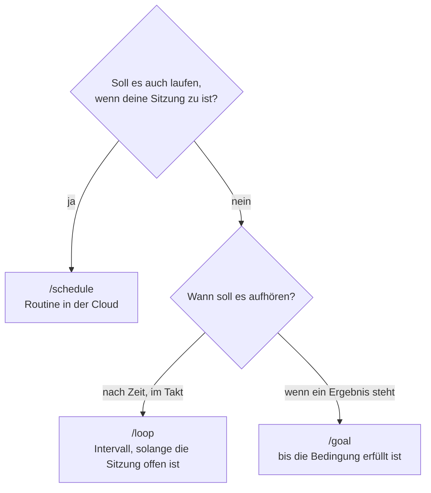

# S3.12 · Zeitgesteuert arbeiten: /loop, /goal, /schedule, Routinen

<!-- meta:start -->
> **Regal:** [Automation & Loops](README.md#automation) · **Stufe:** Kern · **~15 Min** · **Voraussetzungen:** [S2.4 Mitgelieferte Skills](s2-04-mitgelieferte-skills.md)
>
> ← [S3.11 Datenschutz, Aufbewahrung und regulierte Branchen](s3-11-datenschutz-und-compliance.md) · [Bibliothek](README.md) · [S3.13 Autonome Loops absichern: Budget und Worktree](s3-13-autonome-loops-absichern.md) →
<!-- meta:end -->

## Schnellcheck

- Hast du schon einmal einen wiederkehrenden Auftrag mit `/loop` oder `/schedule` eingerichtet und geprüft, dass er wirklich ausgelöst wurde?
- Kannst du ohne Nachschlagen sagen, wann `/goal` besser passt als `/loop` und warum die Kosten von `/goal` offen sind?

## Auf einen Blick

Drei Werkzeuge, drei Arten aufzuhören. `/loop` wiederholt einen Prompt im Takt, solange deine Sitzung offen ist. `/goal` arbeitet Runde um Runde weiter, bis eine Bedingung erfüllt ist. `/schedule` legt eine Routine an, die nach Zeitplan in der Cloud läuft, auch wenn dein Laptop zu ist. Eine feste Kostengrenze bringt keins davon mit; wie du autonome Läufe begrenzt, zeigt [S3.13](s3-13-autonome-loops-absichern.md).

## Bild im Kopf

Denk an die Einsatzplanung einer Wachzentrale. `/loop` ist der Wachmann, der selbst seine Runden dreht und aufhört, wenn seine Schicht endet. `/goal` ist der Einsatz, der weiterläuft, bis die Alarmzone wieder grün ist, egal wie lange das dauert. `/schedule` trägt eine Patrouille in den Schichtplan der Zentrale ein: Die Routine startet nach Kalender, auch wenn der Schichtleiter nicht da ist, und lässt sich pausieren und wieder aktivieren.



## Im Detail

### /loop: im Takt, solange die Sitzung offen ist

`/loop` ist ein mitgelieferter Skill ([S2.4](s2-04-mitgelieferte-skills.md)). Er führt einen Befehl oder Prompt in deiner laufenden Sitzung in festen Abständen aus:

```
/loop 5m /quality-gate
```

Das führt das Quality Gate alle 5 Minuten aus, praktisch, während du aktiv entwickelst. `/quality-gate` steht hier für einen eigenen Prüf-Skill; eingebaut ist er nicht.

Intervall und Prompt sind beide optional. Als Einheiten gehen `s`, `m`, `h` und `d`. Ohne Intervall wählt Claude den Abstand nach jedem Durchgang selbst, zwischen einer Minute und einer Stunde. Ohne Prompt läuft ein eingebauter Wartungs-Prompt oder, falls vorhanden, deine `loop.md`. Jeder Durchgang ist ein eigener Zug und verbraucht Tokens, auch wenn es nichts zu tun gibt.

**Loops und Zeitpläne im Vergleich:**

- **Loops** leben in deinem Terminal und hören auf, wenn du die Sitzung schließt. Wiederkehrende Aufgaben laufen außerdem nach sieben Tagen von selbst ab.
- **Zeitpläne** (Routinen) überdauern Sitzungen und laufen auch, wenn du offline bist.

### /goal: arbeiten, bis eine Bedingung erfüllt ist

`/goal` ist die eingebaute Alternative zu `/loop` für Aufgaben mit einer klaren Stopp-Bedingung statt eines festen Takts. Claude arbeitet so viele Runden wie nötig, bis die Bedingung erfüllt ist:

```
/goal Tests grün
/goal All TypeScript errors resolved
/goal No more TODO comments in src/api/
```

Nach jeder Runde prüft ein kleines, schnelles Modell, ob die Bedingung erfüllt ist. Das Ziel endet, wenn sie erfüllt ist, wenn das Modell sie für unerfüllbar hält oder wenn eine Runde an einem Fehler scheitert, den du selbst beheben musst. Solange es läuft, zeigt die Anzeige `◎ /goal active` die Laufzeit; `/goal` ohne Argument zeigt Bedingung, Laufzeit, Zahl der Runden, Token-Verbrauch und die letzte Begründung des Prüfers. Mit `/goal clear` brichst du ab, ein neues `/goal` ersetzt das alte. So kannst du unterwegs abbrechen oder nachsteuern.

Der Prüfer liest nur, was im Gespräch steht; er führt selbst keine Befehle aus. Schreib die Bedingung deshalb so, dass Claudes eigene Ausgabe sie belegen kann: ein messbarer Endzustand, der Prüfschritt dazu (etwa „`npm test` endet mit 0") und was sich unterwegs nicht ändern darf.

**/loop und /goal im Vergleich:**

| | `/loop` | `/goal` |
|---|---|---|
| Stopp | nach Zeit (Intervall) oder von Hand | wenn die Bedingung erfüllt ist |
| Einsatz | „Prüf alle 5 Minuten, während ich arbeite" | „Bring die Tests auf grün, dann hör auf" |
| Kostenform | planbar pro Durchgang | offen: Die Zahl der Runden steht vorher nicht fest, also begrenzen wie in [S3.13](s3-13-autonome-loops-absichern.md) |

### /schedule und Routinen: läuft ohne dich

`/schedule` legt eine **Routine** an: einen gespeicherten Auftrag aus Prompt, Repositories und Connectors, der auf Anthropics Cloud-Infrastruktur nach Zeitplan läuft, auch wenn dein Laptop zu ist. Routinen sind eine Research Preview und stehen in den Plänen Pro, Max, Team und Enterprise bereit. `/schedule` fragt dich im Gespräch ab:

1. welche Aufgabe laufen soll (Skill, Befehl oder eigener Prompt)
2. wann sie laufen soll (in natürlicher Sprache, etwa „every day at 8am"; einen genauen Cron-Ausdruck setzt du danach mit `/schedule update`)
3. welchen Kontext sie braucht (Repositories, Connectors)

`/schedule list` zeigt alle Routinen, `/schedule update` ändert eine, `/schedule run` startet sie sofort. Pausieren und wieder aktivieren kannst du sie über den Schalter auf ihrer Seite unter claude.ai/code/routines. Befehl und Web-Oberfläche sind zwei Wege zu denselben Routinen; `/schedule` heißt auch `/routines`.

Drei Unterschiede zu `/loop` solltest du kennen:

- **Frischer Klon:** Jeder Lauf startet mit einem frischen Klon vom Standardbranch. Lokale, nicht gepushte Änderungen sieht die Routine nicht. Ihre Arbeit schiebt sie auf Branches mit dem Präfix `claude/`.
- **Keine Rückfragen:** Eine Routine läuft ohne Rechte-Modus und, bis auf einige Aktionen mit Artefakten, ohne Freigaben; sie führt Shell-Befehle aus und nutzt jeden Connector, den du ihr gibst. Gib ihr deshalb nur die Repositories, Connectors und Netzfreigaben, die sie wirklich braucht.
- **Grobes Raster:** Das kürzeste Intervall ist eine Stunde.

**Typische zeitgesteuerte Aufgaben:**

| Aufgabe | Zeitplan | Was sie tut |
|---|---|---|
| Quality Gate | täglich 06:00 | Testsuite und Code-Review auf dem Hauptbranch |
| Security-Scan | täglich 02:00 | Devil's-Advocate-Schwarm auf geänderten Dateien ([S3.6](s3-06-devils-advocate.md)) |
| Abhängigkeiten prüfen | wöchentlich montags | alle Abhängigkeiten auf neue CVEs prüfen |
| Credential-Scan | bei jedem Commit | versehentlich eingecheckte Secrets finden |
| Performance-Regression | nach jedem Deploy | Antwortzeiten mit der Basislinie vergleichen |

Die letzten beiden Zeilen sind keine Zeitpläne, sondern Ereignisse. Dafür hat eine Routine eigene Auslöser: einen GitHub-Auslöser für Pull Requests und Releases und einen API-Auslöser, den etwa deine Deploy-Pipeline aufruft. Jeden einzelnen Commit fängst du dagegen lokal mit einem Git-Hook ab ([S4.5](s4-05-ci-pipelines.md)).

**Typische Routinen:**

- **Täglicher Build-Bericht:** läuft jeden Morgen um 06:00, fasst die CI der Nacht zusammen und postet über einen Connector nach Slack.
- **Nächtliches Code-Audit:** Devil's-Advocate-Schwarm auf den Diff, der an diesem Tag gemergt wurde.
- **Wöchentliche Abhängigkeitsprüfung:** `npm audit` plus Einordnung neuer CVEs durch Claude.

**Wo es sonst noch läuft:** Neben Cloud-Routinen und `/loop` gibt es geplante Aufgaben in der Desktop-App. Sie laufen auf deinem Rechner und sehen deine lokalen Dateien.

| | Cloud-Routine (`/schedule`) | Desktop-Aufgabe | `/loop` |
|---|---|---|---|
| Läuft auf | Anthropics Cloud | deinem Rechner | deinem Rechner |
| Rechner muss an sein | nein | ja | ja |
| Sitzung muss offen sein | nein | nein | ja |
| Lokale Dateien | nein (frischer Klon) | ja | ja |
| Kürzestes Intervall | 1 Stunde | 1 Minute | 1 Minute |

## Selbst machen

### Übung: eine Automation einrichten (etwa 20 Minuten, allein)

**Ziel:** Eine echte Automation einrichten, die ohne dein Zutun läuft.

Such dir etwas aus, das du wirklich automatisieren willst. Zur Wahl:

**Option A: Quality Gate nach Zeitplan**

<!-- cockpit:example -->
```
/schedule
```

Aufgabe: Lass das Quality Gate jeden Tag zu einer Uhrzeit deiner Wahl laufen, eingerichtet für dein aktuelles Projekt. Die Routine klont das Repository von GitHub; was nur lokal liegt, sieht sie nicht.

**Option B: Security-Scan nach Zeitplan**

```
/schedule
```

Aufgabe: Lass jeden Montag ein Security-Audit laufen, für ein Projekt, das externe Eingaben verarbeitet.

**Option C: Überwachungs-Loop**

```
/loop 1m
```

Aufgabe: Prüf, ob eine bestimmte Datei in den letzten 60 Sekunden geändert wurde, und melde es. Das hilft während der Entwicklung, versehentliche Änderungen zu bemerken. Schreib deinen Auftrag direkt hinter das Intervall, also `/loop 1m <dein Auftrag>`; ohne Auftrag läuft der eingebaute Wartungs-Prompt, der an offener Arbeit der Sitzung weitermacht.

**Option D: deine eigene Idee**

Was würdest du bei der Arbeit wirklich automatisieren? Entwirf es, richte es ein und prüf, dass es mindestens einmal auslöst.

**Prüfen:**

- [ ] Bei `/schedule`: Ruf `/schedule list` auf und prüf, dass deine Routine erscheint.
- [ ] Bei `/loop`: Sieh zu, wie er mindestens zweimal in deinem Terminal auslöst.
- [ ] Halte Auslöser und Stopp-Bedingung in einem Satz fest.
- [ ] Benenne das Sicherheitsnetz: Budget-Grenze, Rechte-Modus, Allow-/Deny-Regel oder menschliches Freigabe-Gate ([S3.13](s3-13-autonome-loops-absichern.md)).

**Besprechen (mit der Person neben dir oder für dich allein):**

- Was hast du automatisiert, und warum genau das?
- Was würde kaputtgehen, wenn die Automation auf fehlerhaftem Code liefe? Was ist dein Sicherheitsnetz?
- Was würdest du in deinem Arbeitsumfeld automatisieren, wenn du 30 Minuten zum Einrichten hättest?

## Typische Fallen

- **`/schedule` meldet „Unknown command".** Routinen brauchen einen Login mit claude.ai-Abo. Mit einem Console-API-Schlüssel oder über Bedrock, Google Cloud oder Foundry blendet die CLI den Befehl aus. Ist `ANTHROPIC_API_KEY` in deiner Shell gesetzt, hat er Vorrang vor dem Abo-Login; entferne ihn dafür.
- **Der Loop ist nach dem Neustart weg.** `/loop`-Aufgaben gehören zur Sitzung, und eine neue Unterhaltung löscht sie. `--resume` oder `--continue` stellt Aufgaben mit festem Intervall wieder her; einen selbst getakteten `/loop` startest du neu.
- **Der Skill im Loop läuft nicht.** Ein geplanter Durchgang führt nur Skills aus, die Claude selbst aufrufen darf. Skills mit `disable-model-invocation: true` und eingebaute Befehle wie `/model` kommen als reiner Text an.
- **Grün heißt nicht erledigt.** Ein grüner Status in der Liste der Routine-Läufe heißt nur, dass die Sitzung ohne Infrastrukturfehler lief. Ob die Aufgabe gelungen ist, siehst du erst im Transkript des Laufs.

## Check

Du kannst für die drei Fälle „jetzt live im Terminal alle 5 Minuten", „bis alle TypeScript-Fehler behoben sind" und „jede Nacht um 02:00" das passende Werkzeug wählen und seine Kostenform einschätzen.

1. Was passiert mit einem `/loop`, wenn du die Sitzung schließt?
2. Woran erkennt `/goal`, dass es fertig ist?
3. Warum sieht eine Routine deine lokalen, nicht gepushten Änderungen nicht?

<details><summary>Quizfrage</summary>

**Frage:** Welcher Unterschied zwischen `/goal` und `/loop` ist für die Kostenplanung entscheidend?

- **Richtig:** `/loop` läuft im festen Takt und kostet pro Durchgang planbar; `/goal` läuft bis zur erfüllten Bedingung, die Rundenzahl ist offen.
- Falsch: `/loop` läuft auf Anthropics Servern weiter, wenn der Laptop zu ist, `/goal` nicht; deshalb ist `/loop` der offene Posten.
- Falsch: Der Unterschied ist nur die Syntax: `/goal` nimmt ganze Sätze, `/loop` Cron-Ausdrücke wie `/schedule`; die Kosten verhalten sich gleich.
- Falsch: Routinen sind die dauerhafte Form von `/loop`, und `/schedule` plant ein einmaliges `/goal`; beide haben dieselben offenen Kosten.

</details>

## Weiterlesen

- [Prompts nach Zeitplan ausführen (/loop)](https://code.claude.com/docs/en/scheduled-tasks)
- [An einem Ziel weiterarbeiten (/goal)](https://code.claude.com/docs/en/goal)
- [Routinen](https://code.claude.com/docs/en/routines)
- [Geplante Aufgaben in der Desktop-App](https://code.claude.com/docs/en/desktop-scheduled-tasks)
- [S3.13 · Autonome Loops absichern: Budget und Worktree](s3-13-autonome-loops-absichern.md)
- [S3.14 · Self-Improve-Loop: was geht und wo es endet](s3-14-self-improve-loop.md)
- [S2.4 · Mitgelieferte Skills](s2-04-mitgelieferte-skills.md)
- [S3.6 · Devil's Advocate: eine adversariale Prüf-Pipeline](s3-06-devils-advocate.md)
- [S4.5 · CI-Pipelines bauen mit GitHub Actions und GitLab](s4-05-ci-pipelines.md)
