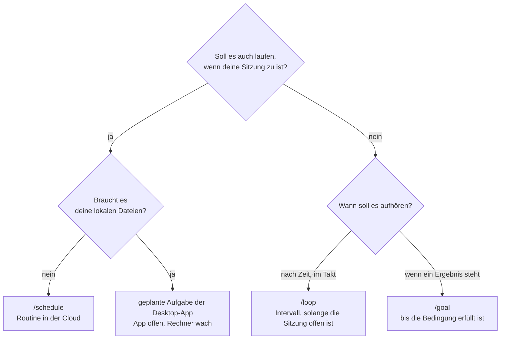

# S3.12 · Zeitgesteuert arbeiten: /loop, /goal, /schedule, Routinen

<!-- meta:start -->
> **Regal:** [Automation & Loops](README.md#automation) · **Stufe:** Kern · **~30 Min** · **Voraussetzungen:** [S2.4 Mitgelieferte Skills](s2-04-mitgelieferte-skills.md)
>
> ← [S3.11 Datenschutz, Aufbewahrung und regulierte Branchen](s3-11-datenschutz-und-compliance.md) · [Bibliothek](README.md) · [S3.13 Autonome Loops absichern: Budget und Worktree](s3-13-autonome-loops-absichern.md) →
<!-- meta:end -->

## Schnellcheck

- Kannst du ohne Nachschlagen sagen, wann `/goal` besser passt als `/loop`?
- Weißt du, was mit einem `/loop` passiert, wenn du die Sitzung schließt?

## Auf einen Blick

Drei Werkzeuge, drei Arten aufzuhören. `/loop` wiederholt einen Prompt im Takt, solange deine Sitzung offen ist. `/goal` arbeitet Runde um Runde weiter, bis eine Bedingung erfüllt ist. `/schedule` legt eine Routine an, die nach Zeitplan in der Cloud läuft, auch wenn dein Laptop zu ist. In den Doku-Seiten dazu steht bei keinem ein Kostenschalter: Grenzen setzt du über die Bedingung von `/goal`, die Sieben-Tage-Frist der Loops und die Stundenlimits der Routinen. Wie du autonome Läufe hart begrenzt, zeigt [S3.13](s3-13-autonome-loops-absichern.md).

## Bild im Kopf

Denk an die Einsatzplanung einer Wachzentrale. `/loop` ist der Wachmann, der selbst seine Runden dreht und aufhört, wenn seine Schicht endet. `/goal` ist der Einsatz, der weiterläuft, bis die Alarmzone wieder grün ist, egal wie lange das dauert. `/schedule` trägt eine Patrouille in den Schichtplan der Zentrale ein: Die Routine startet nach Kalender, auch wenn der Schichtleiter nicht da ist, und lässt sich pausieren und wieder aktivieren.



## Im Detail

### /loop: im Takt, solange die Sitzung offen ist

`/loop` ist ein mitgelieferter Skill ([S2.4](s2-04-mitgelieferte-skills.md)). Er führt einen Prompt in deiner laufenden Sitzung wiederholt aus. Intervall und Prompt sind beide optional, und was du angibst, bestimmt das Verhalten:

| Du gibst an | Beispiel | Ergebnis |
|---|---|---|
| Intervall und Prompt | `/loop 5m check the deploy` | fester Takt |
| nur den Prompt | `/loop check the deploy` | Claude wählt nach jedem Durchgang den Abstand selbst, zwischen einer Minute und einer Stunde |
| nur ein Intervall oder nichts | `/loop` | der eingebaute Wartungs-Prompt oder, falls vorhanden, deine `loop.md` |

Als Einheiten gehen `s`, `m`, `h` und `d`. Beim Anlegen bestätigt Claude Takt und Job-ID. Jeder Durchgang ist ein eigener Zug und verbraucht Tokens, auch wenn es nichts zu tun gibt. Ein Durchgang feuert zwischen deinen Zügen, nicht mitten in einer Antwort. Auch die Uhrzeit ist nicht auf die Sekunde genau: Wiederkehrende Aufgaben feuern laut Doku bis zu 30 Minuten nach der Zeit, bei Takten unter einer Stunde bis zur Hälfte des Intervalls.

- **Loops leben in deinem Terminal** und hören auf, wenn du die Sitzung schließt. Wiederkehrende Aufgaben laufen außerdem nach sieben Tagen von selbst ab.
- **Stoppen:** `Esc` beendet einen selbst getakteten Loop, solange er auf den nächsten Durchgang wartet. Aufgaben mit festem Intervall brichst du ab wie jede geplante Aufgabe: Frag Claude, welche geplanten Aufgaben es gibt, und lass die gewünschte löschen.
- **Zeitpläne** (Routinen) überdauern Sitzungen und laufen auch, wenn du offline bist.

### /goal: arbeiten, bis eine Bedingung erfüllt ist

`/goal` ist die eingebaute Alternative zu `/loop` für Aufgaben mit einer klaren Stopp-Bedingung statt eines festen Takts. Claude arbeitet so viele Runden wie nötig, bis die Bedingung erfüllt ist:

```
/goal all tests in test/auth pass and the lint step is clean
```

Nach jeder Runde prüft ein kleines, schnelles Modell, ob die Bedingung erfüllt ist. Das Ziel endet, wenn sie erfüllt ist, wenn das Modell sie für unerfüllbar hält oder wenn eine Runde an einem Fehler scheitert, den du selbst beheben musst. Solange es läuft, zeigt die Anzeige `◎ /goal active` die Laufzeit; `/goal` ohne Argument zeigt Bedingung, Laufzeit, Zahl der Runden, Token-Verbrauch und die letzte Begründung des Prüfers. Mit `/goal clear` brichst du ab, ein neues `/goal` ersetzt das alte. `/goal` ändert deinen Rechte-Modus nicht: In Manual fragt Claude weiter vor Tool-Aufrufen, die deine Einstellungen nicht schon erlauben.

Der Prüfer liest nur, was im Gespräch steht; er führt selbst keine Befehle aus. Schreib die Bedingung deshalb so, dass Claudes eigene Ausgabe sie belegen kann: ein messbarer Endzustand, der Prüfschritt dazu (etwa „`npm test` exits 0“) und was sich unterwegs nicht ändern darf. Eine Runden- oder Zeitklausel wie „or stop after 20 turns“ begrenzt die Laufzeit; Claude meldet den Stand dazu jede Runde, und der Prüfer beurteilt sie aus dem Gespräch.

| | `/loop` | `/goal` |
|---|---|---|
| Stopp | nach Zeit, von Hand oder wenn Claude die Aufgabe für erledigt hält | wenn die Bedingung erfüllt ist |
| Einsatz | „Prüf alle 5 Minuten, während ich arbeite“ | „Bring die Tests auf grün, dann hör auf“ |
| Laufzeit | je Durchgang klein, aber ohne Ende im Takt | Rundenzahl steht vorher nicht fest, deshalb eine Klausel in die Bedingung |

### /schedule und Routinen: läuft ohne dich

`/schedule` legt eine **Routine** an: einen gespeicherten Auftrag aus Prompt, Repositories und Connectors, der auf Anthropics Cloud-Infrastruktur nach Zeitplan läuft, auch wenn dein Laptop zu ist. Routinen sind eine Research Preview und stehen in den Plänen Pro, Max, Team und Enterprise bereit. `/schedule` fragt dich im Gespräch ab, welche Aufgabe laufen soll, wann (in natürlicher Sprache, etwa „every day at 8am“; einen genauen Cron-Ausdruck setzt du danach mit `/schedule update`) und welchen Kontext sie braucht.

`/schedule list` zeigt alle Routinen, `/schedule update` ändert eine, `/schedule run` startet sie sofort. Pausieren, löschen und Läufe öffnen kannst du auf claude.ai/code/routines. Befehl und Web-Oberfläche sind zwei Wege zu denselben Routinen; `/schedule` heißt auch `/routines`. Drei Unterschiede zu `/loop` solltest du kennen:

- **Frischer Klon:** Jeder Lauf startet mit einem frischen Klon vom Standardbranch. Lokale, nicht gepushte Änderungen sieht die Routine nicht. Ihre Arbeit schiebt sie auf Branches mit dem Präfix `claude/`.
- **Keine Rückfragen:** Eine Routine läuft ohne Rechte-Modus und, bis auf einige Aktionen mit Artefakten, ohne Freigaben; sie führt Shell-Befehle aus und nutzt jeden Connector, den du ihr gibst. Gib ihr deshalb nur die Repositories, Connectors und Netzfreigaben, die sie wirklich braucht.
- **Grobes Raster und Limits:** Das kürzeste Intervall ist eine Stunde. Routinen verbrauchen dein Abo-Kontingent wie interaktive Sitzungen, und je Stunde gelten Obergrenzen für Läufe.

Beispiele für echte Zeitpläne: ein Build-Bericht jeden Morgen, ein Code-Audit des Tages jede Nacht, eine Abhängigkeitsprüfung jeden Montag. Was nicht zu einer Uhrzeit, sondern zu einem Ereignis gehört, etwa ein Pull Request oder ein Release, löst eine Routine über einen GitHub-Auslöser, was dein System meldet, über einen API-Auslöser.

**Wo es sonst noch läuft:** Neben Cloud-Routinen und `/loop` gibt es geplante Aufgaben in der Desktop-App. Sie laufen auf deinem Rechner und sehen deine lokalen Dateien, feuern aber nur, solange die App offen und der Rechner wach ist.

| | Cloud-Routine (`/schedule`) | Desktop-Aufgabe | `/loop` |
|---|---|---|---|
| Läuft auf | Anthropics Cloud | deinem Rechner | deinem Rechner |
| Rechner muss an sein | nein | ja | ja |
| Sitzung muss offen sein | nein | nein | ja |
| Lokale Dateien | nein (frischer Klon) | ja | ja |
| Kürzestes Intervall | 1 Stunde | 1 Minute | 1 Minute |

## Selbst machen

### Übung: wählen, einrichten, prüfen, aufräumen (etwa 15 Minuten)

**Ziel:** Du ordnest zwei Aufgaben dem passenden Werkzeug zu, richtest `/loop` und `/goal` in einer Sitzung ein und liest an der Ausgabe ab, dass sie auslösen und enden. Danach läuft nichts mehr weiter.

**Startzustand:** Du arbeitest im Ordner `~/cc-workshop/zeitplan` mit Claude Code und Python. Beide Werkzeuge der Übung leben nur in der Sitzung; du brauchst weder Cloud noch Routinen. Leg den Ordner an (Bash: `mkdir -p ~/cc-workshop/zeitplan/.claude && cd ~/cc-workshop/zeitplan`; PowerShell: `New-Item -ItemType Directory -Force "$HOME\cc-workshop\zeitplan\.claude" | Out-Null; Set-Location "$HOME\cc-workshop\zeitplan"`) und schreib mit einem Editor diese drei Dateien. `status.txt`:

```text
waiting
```

`calc.py` (mit einem Fehler, den du nicht korrigierst):

```python
def add(a, b):
    return a - b
```

`test_calc.py`:

```python
import unittest
from calc import add


class AddTest(unittest.TestCase):
    def test_add(self):
        self.assertEqual(add(2, 3), 5)


if __name__ == "__main__":
    unittest.main()
```

Leg außerdem `.claude/settings.json` an. Sie erlaubt Claude den Testlauf, damit `/goal` möglichst ohne Rückfrage durchläuft; unter macOS und Linux heißt Python oft `python3`, deshalb stehen beide Namen darin:

```json
{
  "permissions": {
    "allow": [
      "Bash(python -m unittest*)", "Bash(python3 -m unittest*)",
      "PowerShell(python -m unittest*)", "PowerShell(python3 -m unittest*)"
    ]
  }
}
```

1. **Wähl.** Schreib auf, welches Werkzeug zu welcher Aufgabe passt: (1) „Während ich arbeite, soll jede Minute jemand `status.txt` ansehen und berichten.“ (2) „Die Tests in diesem Ordner sollen grün werden, dann soll Schluss sein.“ Erwartet: (1) `/loop`, weil der Takt zählt und die Sitzung offen bleibt, (2) `/goal`, weil eine Bedingung zählt.
2. Starte `claude --permission-mode acceptEdits`, bestätige den Vertrauensdialog und gib ein:

   <!-- cockpit:example -->
   ```
   /loop 1m Read status.txt and report its content in one line, prefixed with "check N:" where N counts how often you have run this prompt in this session.
   ```

   Erwartet: Claude bestätigt Takt und Job-ID und meldet gleich den ersten Durchgang (`check 1: waiting`). Lass die Sitzung offen und ändere in einem zweiten Terminal, das im Übungsordner steht, `status.txt` (Bash `echo ready > status.txt`, PowerShell `Set-Content status.txt ready`). Warte, bis zwei oder drei Durchgänge im Transkript stehen, etwa drei Minuten. Erwartet: Spätere Durchgänge melden `ready` statt `waiting`.
3. **Aufräumen, Teil 1.** Gib ein: `what scheduled tasks do I have?`, lass dir die Aufgabe nennen und sag: `cancel that job`. Frag danach noch einmal nach den geplanten Aufgaben. Erwartet: keine mehr.
4. Gib ein: `/goal python -m unittest exits 0 and test_calc.py is not modified, or stop after 6 turns` (mit `python3`, wenn `python` bei dir nicht läuft). Erwartet: Claude startet sofort, liest `calc.py`, korrigiert `a - b` zu `a + b`, führt den Testlauf aus, und das Ziel endet mit einer Zeile wie `Goal achieved` samt Dauer und Rundenzahl. Fragt Claude Code vor dem Testlauf doch nach, hat Claude den Befehl verlängert (im Probelauf um eine Pipe und ein `echo`), und er passt nicht mehr auf deine Regel: Bestätige mit „Yes“. Öffne mit `Ctrl+O` die Begründung des Prüfers. Gib dann `/goal` ohne Argument ein. Erwartet: Es zeigt das erreichte Ziel mit Dauer, Rundenzahl und Token-Verbrauch.
5. **Aufräumen, Teil 2.** Gib `/goal clear` ein. Erwartet: `No goal set`, denn das Ziel ist schon beendet (Wortlaut der Doku). Beende die Sitzung mit `/exit`.
6. Prüf im zweiten Terminal, weiter im Übungsordner und ohne Claude: `python -m unittest` (oder `python3 -m unittest`) endet ohne Fehler, und `test_calc.py` enthält noch den Text von oben.

**Aufräumen:** Lösch den Ordner `~/cc-workshop/zeitplan`. Beide Werkzeuge leben nur in der Sitzung; nach dem Schließen läuft nichts mehr.

**Geschafft, wenn:**

- [ ] du (1) `/loop` und (2) `/goal` zugeordnet und begründet hast
- [ ] im Transkript mindestens zwei Loop-Durchgänge standen und ein späterer `ready` meldete
- [ ] die Frage nach geplanten Aufgaben nach dem Abbrechen keine mehr nannte
- [ ] `/goal` das erreichte Ziel mit Rundenzahl zeigte und `python -m unittest` von außen ohne Fehler endete

### Extra: eine Routine anlegen, laufen lassen und löschen (etwa 15 Minuten, Abo und GitHub nötig)

**Ziel:** Du siehst, dass eine Routine in der Cloud aus einem frischen Klon läuft, und räumst sie danach wieder weg.

**Startzustand:** ein Abo mit Routinen (Pro, Max, Team oder Enterprise, Anmeldung mit dem Abo, nicht mit einem API-Schlüssel) und ein GitHub-Repository, das du zum Testen nutzen darfst; die Routine klont es. Eine Routine läuft ohne Rückfragen und zählt auf dein Abo-Kontingent. Der Auftrag unten ändert nichts. Du startest die Sitzung in einem lokalen Klon dieses Repositorys.

1. Gib `/schedule` ein und beschreibe: `daily at 9am, list the files in the repository and say how many there are. Do not change anything.` Beantworte Claudes Rückfragen und speichere die Routine.
2. Gib `/schedule list` ein. Erwartet: Die Routine erscheint.
3. Gib `/schedule run` ein, öffne den Lauf auf claude.ai/code/routines und lies das Transkript. Erwartet: Die Dateiliste und die Zahl stehen dort. Ein grüner Status allein sagt nur, dass der Lauf ohne Infrastrukturfehler endete.
4. **Aufräumen:** Öffne auf claude.ai/code/routines das Menü neben dem Namen der Routine und wähle Delete. Gib danach `/schedule list` ein. Erwartet: Die Routine fehlt.

**Geschafft, wenn:**

- [ ] das Transkript des Laufs die Dateiliste zeigte und `/schedule list` nach dem Löschen die Routine nicht mehr nannte

## Typische Fallen

- **`/schedule` meldet „Unknown command“.** Routinen brauchen einen Login mit claude.ai-Abo. Mit einem Console-API-Schlüssel oder über Bedrock, Google Cloud oder Foundry blendet die CLI den Befehl aus; mit einem API-Schlüssel kann statt „Unknown command“ auch ein Hinweis auf Claude for Enterprise erscheinen. Ist `ANTHROPIC_API_KEY` in deiner Shell gesetzt, hat er Vorrang vor dem Abo-Login; entferne ihn dafür. Unter ZDR ([S3.11](s3-11-datenschutz-und-compliance.md)) sind Cloud-Sitzungen abgeschaltet, und damit gibt es dort keine Routinen.
- **Der Loop ist nach dem Neustart weg.** `/loop`-Aufgaben gehören zur Sitzung, und eine neue Unterhaltung löscht sie. `--resume` oder `--continue` stellt Aufgaben mit festem Intervall wieder her; einen selbst getakteten `/loop` startest du neu.
- **Der Skill im Loop läuft nicht.** Ein geplanter Durchgang führt nur Skills aus, die Claude selbst aufrufen darf. Skills mit `disable-model-invocation: true` und eingebaute Befehle wie `/model` kommen als reiner Text an.
- **Grün heißt nicht erledigt.** Ein grüner Status in der Liste der Routine-Läufe heißt nur, dass die Sitzung ohne Infrastrukturfehler lief. Ob die Aufgabe gelungen ist, siehst du erst im Transkript des Laufs.
- **Der Loop feuert nicht auf die Sekunde.** Wiederkehrende Aufgaben bekommen einen Versatz; wer genaue Zeiten braucht, wählt eine Minute, die nicht `:00` oder `:30` ist.

## Check

Du kannst für eine wiederkehrende Aufgabe das passende Werkzeug wählen und sagen, wodurch sein Lauf endet.

1. Was passiert mit einem `/loop`, wenn du die Sitzung schließt, und wann endet er sonst?
2. Woran erkennt `/goal`, dass es fertig ist, und was liest der Prüfer dafür?
3. Welches Werkzeug nimmst du für „jede Nacht um 02:00, auch wenn der Laptop zu ist“, und warum sieht es deine lokalen, nicht gepushten Änderungen nicht?

<details><summary>Auflösung</summary>

1. Er hört auf: Loops gehören zur Sitzung. Sonst endet er, wenn du ihn abbrichst, wenn Claude die Aufgabe bei einem selbst getakteten Loop für erledigt hält, oder nach sieben Tagen.
2. Ein kleines, schnelles Modell prüft nach jeder Runde, ob die Bedingung erfüllt ist. Es liest nur, was im Gespräch steht, und führt selbst keine Befehle aus; deshalb muss Claudes eigene Ausgabe die Bedingung belegen.
3. Eine Routine mit `/schedule`. Sie läuft in der Cloud mit einem frischen Klon vom Standardbranch, also sieht sie nur, was auf dem Remote liegt.

</details>

<details><summary>Quizfrage</summary>

**Frage:** Du gibst `/loop check whether CI passed` ein, ohne Intervall. Was stimmt?

- **Richtig:** Claude wählt nach jedem Durchgang den Abstand selbst, zwischen einer Minute und einer Stunde. Der Loop endet mit der Sitzung oder nach sieben Tagen.
- Falsch: Der Loop läuft nur einmal, denn ohne Intervall gibt es keinen Takt, und danach wartet Claude auf deinen nächsten Prompt, bis du ihn erneut startest.
- Falsch: Der Loop läuft im festen Takt von fünf Minuten, denn das ist der Standard, wenn du kein Intervall angibst, und er bleibt dabei, bis du ihn stoppst.
- Falsch: Der Loop läuft als Routine in der Cloud weiter, auch wenn du die Sitzung schließt, solange du angemeldet bleibst und das Abo aktiv ist.

</details>

## Weiterlesen

- [Prompts nach Zeitplan ausführen (/loop)](https://code.claude.com/docs/en/scheduled-tasks)
- [An einem Ziel weiterarbeiten (/goal)](https://code.claude.com/docs/en/goal)
- [Routinen](https://code.claude.com/docs/en/routines)
- [Geplante Aufgaben in der Desktop-App](https://code.claude.com/docs/en/desktop-scheduled-tasks)
- [S3.13 · Autonome Loops absichern: Budget und Worktree](s3-13-autonome-loops-absichern.md)
- [S3.14 · Self-Improve-Loop: was geht und wo es endet](s3-14-self-improve-loop.md)
- [S2.4 · Mitgelieferte Skills](s2-04-mitgelieferte-skills.md)
- [S3.11 · Datenschutz, Aufbewahrung und regulierte Branchen](s3-11-datenschutz-und-compliance.md)
