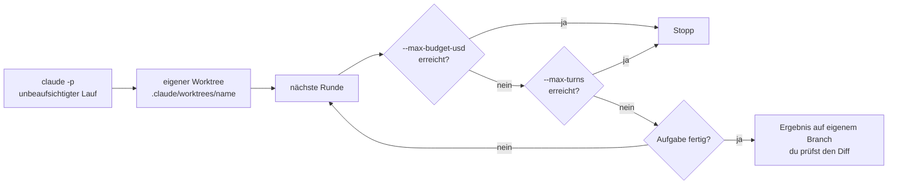

# S3.13 · Autonome Loops absichern: Budget und Worktree

<!-- meta:start -->
> **Regal:** [Automation & Loops](README.md#automation) · **Stufe:** Kern · **~25 Min** · **Voraussetzungen:** [S3.12 Zeitgesteuert arbeiten: /loop, /goal, /schedule, Routinen](s3-12-zeitgesteuert-arbeiten.md) · [S1.19 Kosten im Blick: /cost, /usage und Budgetgrenzen](s1-19-kosten-im-blick.md) · [S3.8 Rechte für autonome Läufe](s3-08-rechte-fuer-autonomie.md) · 🛡 **Sicherheitsboden**
>
> ← [S3.12 Zeitgesteuert arbeiten: /loop, /goal, /schedule, Routinen](s3-12-zeitgesteuert-arbeiten.md) · [Bibliothek](README.md) · [S3.14 Self-Improve-Loop: was geht und wo es endet](s3-14-self-improve-loop.md) →
<!-- meta:end -->

## Schnellcheck

- Weißt du, mit welchem Start ein `--max-budget-usd` überhaupt greift?
- Kannst du sagen, was ein Lauf in einem Worktree nach seinem Ende auf deiner Platte hinterlässt?

## Auf einen Blick

Setz die Grenzen, bevor ein autonomer Lauf startet: `--max-budget-usd` deckelt die Kosten, `--max-turns` die Zahl der Runden, und `--worktree` lässt den Lauf in einem eigenen Arbeitsordner arbeiten, damit dein Hauptordner unberührt bleibt. Beide Limits wirken nur im Print-Modus (`claude -p`), der einen einzelnen Lauf ohne Dialog startet: Auftrag hinein, Antwort heraus, Ende (mehr dazu in [S4.3](s4-03-headless.md)). In einer interaktiven Sitzung greifen sie nicht; dort begrenzt du `/goal` über eine Runden- oder Zeitklausel in der Bedingung und stoppst `/loop` selbst.

## Bild im Kopf

Das Budget ist der Tank des Patrouillenfahrzeugs: Ist er leer, steht das Fahrzeug, statt bis zum Totalausfall weiterzufahren. Das Rundenlimit ist die Zahl der Runden im Fahrtenbefehl. Der Worktree ist der Prüfstand im Labor, ein Nachbau der Anlage, an dem der Nachtjob schrauben darf, ohne die echte Anlage anzufassen.



## Im Detail

### Warum Läufe Grenzen brauchen

Ein autonomer Lauf kann in einer engen Schleife Tokens verbrennen, wenn ein Tool immer wieder scheitert und Claude es immer wieder versucht. Die harte Grenze dagegen sitzt in der CLI. Statt regelmäßig nachzufragen, kannst du dir Ereignisse auch in die Sitzung schieben lassen (Channels, eine Research Preview; [S4.6](s4-06-remote-und-teleport.md)).

### Budget und Rundenlimit

- `--max-budget-usd <betrag>`: höchster Dollarbetrag für API-Aufrufe, danach stoppt der Lauf. Ausgaben von Subagenten zählen mit; ist das Budget erreicht, startet kein weiterer Subagent mehr.
- `--max-turns <n>`: höchste Zahl an Agenten-Runden; ist sie erreicht, endet der Lauf mit einem Fehler.

Beide gelten laut CLI-Referenz nur im Print-Modus („print mode only“). Die Grundlagen zu Kosten stehen in [S1.19](s1-19-kosten-im-blick.md), die Praxis für CI in [S4.4](s4-04-ci-zugang-und-kosten.md). Ein unbeaufsichtigter Lauf braucht außerdem einen Rechte-Modus, der nicht auf eine Antwort wartet: `dontAsk` mit Allow-Regeln ([S3.8](s3-08-rechte-fuer-autonomie.md)). Mit `/goal` im Print-Modus (`claude -p "/goal …"`) läuft die Schleife in einem einzigen Aufruf bis zum Ende; das Budget deckelt sie.

`/loop` gehört dagegen zur offenen Sitzung. Dass ein `-p`-Lauf auf spätere Durchgänge wartet, beschreibt die Doku nirgends; einen Loop, der wirklich wiederkehrt, lässt du in einer offenen Sitzung laufen oder planst ihn als Routine ([S3.12](s3-12-zeitgesteuert-arbeiten.md)).

### Interaktiv: was dann begrenzt

In einer interaktiven Sitzung wirken `--max-budget-usd` und `--max-turns` nicht, auch nicht mit `/loop` oder `/goal`. Dort hast du drei Hebel:

- **`/goal` mit Klausel:** Schreib eine Runden- oder Zeitgrenze in die Bedingung, etwa „… or stop after 20 turns“. Claude meldet in jeder Runde den Stand, und der Prüfer beurteilt die Klausel aus dem Gespräch. Das ist eine weiche Grenze, kein hartes Limit.
- **`/loop` stoppen:** `Esc` beendet einen selbst getakteten Loop, der auf den nächsten Durchgang wartet. Aufgaben mit festem Intervall laufen, bis du sie löschst oder bis sieben Tage um sind.
- **Rechte:** `/goal` ändert deinen Rechte-Modus nicht. Im Standardmodus fragt Claude weiter vor Tool-Aufrufen, die deine Settings nicht schon erlauben.

### Worktree: der Lauf arbeitet auf dem Prüfstand

`--worktree` (kurz `-w`) ist ein Flag von `claude` selbst. `claude --worktree <name>` legt einen Worktree unter `.claude/worktrees/<name>/` auf einem neuen Branch `worktree-<name>` an und startet die Sitzung darin. In einer solchen Sitzung blockt Claude Code laut Doku Dateiänderungen, die in den Haupt-Checkout zielen, und Befehle, die dort arbeiten, auch bei jedem Subagenten. Das ist keine Sandbox: Nicht zu den Prüfungen gehören Netz und Pfade außerhalb des Repositorys ([S3.9](s3-09-geschuetzte-pfade-und-sandbox.md)).

Von wo der Worktree abzweigt, bestimmt `worktree.baseRef`: `fresh` (der Standard) nimmt den Standardbranch auf dem Remote, `head` deinen lokalen `HEAD`. Ist kein Remote eingerichtet, fällt ein frischer Worktree laut Doku auf deinen lokalen `HEAD` zurück; deshalb funktioniert die Übung unten in einem Wegwerf-Repository ohne Remote. Aufgeräumt wird ein Worktree nach einem `-p`-Lauf nicht: Ohne Dialog am Ende bleibt er samt Sperre liegen, und du entfernst ihn selbst mit `git worktree remove` (bei einer Sperre erst `git worktree unlock`). Die Mechanik steht in [S1.18](s1-18-worktrees.md), Isolation mit Docker in [S4.7](s4-07-isolation-docker-worktrees.md).

## Selbst machen

### Übung: einen gedeckelten Lauf im Worktree stoppen sehen (etwa 15 Minuten)

**Ziel:** Du startest einen unbeaufsichtigten Lauf mit Budget und Rundenlimit in einem Worktree, siehst ihn am Rundenlimit enden, siehst ihn mit mehr Runden fertig werden und räumst den Worktree wieder weg.

**Startzustand:** Du arbeitest im Ordner `~/cc-workshop/nachtlauf`, einem Wegwerf-Repository ohne Remote mit fünf kleinen Dateien, die eine Kette bilden. Die Aufgabe ist nur lesen und kostet mit dem Modell `haiku` wenig. Mehr als Claude Code, Git und Python brauchst du nicht.

Bash:

```bash
mkdir -p ~/cc-workshop/nachtlauf && cd ~/cc-workshop/nachtlauf
for i in 1 2 3 4; do printf 'next: notes-%s.txt\n' "$((i+1))" > "notes-$i.txt"; done
printf 'END\n' > notes-5.txt
printf '.claude/worktrees/\n' > .gitignore
git init -q
git config user.name "Learner"
git config user.email "learner@example.com"
git add .gitignore notes-1.txt notes-2.txt notes-3.txt notes-4.txt notes-5.txt
git commit -q -m "start"
```

PowerShell:

```powershell
New-Item -ItemType Directory -Force "$HOME\cc-workshop\nachtlauf" | Out-Null
Set-Location "$HOME\cc-workshop\nachtlauf"
1..4 | ForEach-Object { Set-Content "notes-$_.txt" "next: notes-$($_ + 1).txt" }
Set-Content notes-5.txt "END"
Set-Content .gitignore ".claude/worktrees/" -NoNewline
git init -q
git config user.name "Learner"
git config user.email "learner@example.com"
git add .gitignore notes-1.txt notes-2.txt notes-3.txt notes-4.txt notes-5.txt
git commit -q -m "start"
```

Die Kette ist absichtlich nur nacheinander lesbar: Jede Datei nennt erst die nächste. Wie viele Runden Claude dafür braucht, steht nicht fest; in den Probeläufen reichten zwei nicht. Meldet Lauf 1 bei dir doch die ganze Kette, wiederhol ihn mit `--max-turns 1`.

1. **Lauf 1, mit Rundenlimit 2.** Gib die Zeile in einem Stück ein (sie gilt in beiden Shells):

   <!-- cockpit:example -->
   ```bash
   claude -p --worktree kette-kurz --model haiku --permission-mode dontAsk --max-turns 2 --max-budget-usd 0.50 "Read notes-1.txt. Each file names the next file to read, until one says END. Follow the chain one file at a time and report the file names in order."
   ```

   Die Flags im Einzelnen: `-p` startet den Lauf ohne Dialog, `--worktree kette-kurz` lässt ihn in einem eigenen Worktree arbeiten, `--model haiku` wählt das günstige Modell, `--permission-mode dontAsk` sorgt dafür, dass der Lauf nie auf eine Antwort wartet, `--max-turns 2` ist die Rundengrenze und `--max-budget-usd 0.50` die Kostengrenze. Erwartet: Der Lauf endet, ohne die ganze Kette zu melden, mit einem Fehler zum Rundenlimit; die Doku sagt für `--max-turns`: „Exits with an error when the limit is reached“ (Wortlaut der Doku).
2. Lies den Rückgabewert des letzten Befehls ab, in Bash mit `echo "exit=$?"`, in PowerShell mit `"exit=$LASTEXITCODE"`. Erwartet: ein Wert ungleich 0 (im Probelauf `exit=1` nach der Zeile `Error: Reached max turns (2)`).
3. **Lauf 2, mit Rundenlimit 12.** Starte denselben Befehl mit `--worktree kette-lang` und `--max-turns 12`. Erwartet: Der Lauf endet normal und nennt die Dateien in der Reihenfolge `notes-1.txt` bis `notes-5.txt`. Das Budget von 0,50 Dollar ist bei dieser kleinen Aufgabe ein Sicherheitsnetz, das du nicht erreichst: Das Rundenlimit hat in Lauf 1 gestoppt.
4. **Prüf, wohin der Lauf gearbeitet hat.** Im Hauptordner: `git status --short` zeigt nichts (der Worktree-Ordner steht in `.gitignore`), und `git worktree list` nennt neben dem Hauptordner die beiden Worktrees unter `.claude/worktrees/` mit den Branches `worktree-kette-kurz` und `worktree-kette-lang`, beide mit dem Vermerk `locked`.
5. **Aufräumen.** Ein `-p`-Lauf räumt seinen Worktree nicht auf. Entferne beide selbst:

   ```bash
   git worktree unlock .claude/worktrees/kette-kurz
   git worktree remove .claude/worktrees/kette-kurz
   git worktree unlock .claude/worktrees/kette-lang
   git worktree remove .claude/worktrees/kette-lang
   git branch -D worktree-kette-kurz worktree-kette-lang
   ```

   Das `unlock` ist nötig, weil der Lauf seine Sperre stehen lässt; ohne es verweigert Git das Entfernen. Prüf mit `git worktree list`: Nur der Hauptordner steht noch da.

**Aufräumen am Ende:** Lösch den Ordner `~/cc-workshop/nachtlauf` (in PowerShell mit `Remove-Item -Recurse -Force`). Nichts läuft weiter.

**Geschafft, wenn:**

- [ ] Lauf 1 ohne vollständige Kette endete und der Rückgabewert ungleich 0 war
- [ ] Lauf 2 die Kette bis `notes-5.txt` meldete
- [ ] `git status --short` im Hauptordner leer war und `git worktree list` beide Worktrees nannte
- [ ] `git worktree list` nach dem Aufräumen nur noch den Hauptordner zeigte

### Extra: das Budget als Auslöser (etwa 5 Minuten)

**Ziel:** Du siehst, dass das Budget einen Lauf stoppt, bevor die Runden aufgebraucht sind.

**Startzustand:** der Ordner `~/cc-workshop/nachtlauf` aus der Übung, falls noch nicht gelöscht, ohne Worktrees.

1. Starte den Befehl aus Lauf 1 mit `--worktree kette-budget`, `--max-turns 12` und `--max-budget-usd 0.01`.
2. Lies die Ausgabe (im Probelauf `Error: Exceeded USD budget (0.01)`). Wie viele Runden bis zum Stopp nötig sind, hängt vom Verbrauch ab; die Doku nennt nur, dass der Lauf stoppt, wenn der Betrag erreicht ist. Endet er normal, war der Betrag zu hoch: Wiederhol ihn mit `0.001`.
3. Entferne den Worktree und den Branch wie in Schritt 5, mit `unlock` zuerst.

**Geschafft, wenn:**

- [ ] der Lauf mit 12 erlaubten Runden endete, ohne die Kette zu vollenden, und du den Worktree entfernt hast

## Typische Fallen

- **Die interaktive Sitzung gilt als gedeckelt.** `claude --max-budget-usd 1.00` ohne `-p` begrenzt nichts; das Flag wirkt nur im Print-Modus.
- **Die Rundenklausel gilt als hartes Limit.** Bei `/goal` in einer interaktiven Sitzung beurteilt ein Modell die Klausel aus dem Gespräch. Muss die Grenze hart sein, nimm `claude -p` mit `--max-turns`.
- **Der Lauf wartet auf eine Freigabe.** Ohne passenden Rechte-Modus bleibt ein unbeaufsichtigter Lauf an einer Rückfrage hängen oder scheitert an ihr. Starte ihn mit `--permission-mode dontAsk` und Allow-Regeln.
- **Die Allow-Regel des Projekts greift im Lauf nicht.** Regeln aus der `.claude/settings.json` eines Projekts erlauben erst etwas, nachdem du den Ordner einmal in einer interaktiven Sitzung als vertrauenswürdig bestätigt hast; ein `-p`-Lauf zeigt den Dialog nie ([S3.8](s3-08-rechte-fuer-autonomie.md)). In einem Worktree zählt dafür der Hauptordner des Repositorys.
- **Der Worktree bleibt liegen.** Ein `-p`-Lauf räumt ihn nicht auf und lässt seine Sperre stehen. Entferne ihn mit `git worktree remove`, bei einer Sperre erst `git worktree unlock`. Weigert sich git, weil im Worktree geänderte oder unversionierte Dateien liegen, sieh mit `git -C <pfad> status --short` nach, was der Lauf (oder ein Hook aus deinen eigenen Einstellungen) dort hinterlassen hat, und sichere es oder verwirf es bewusst mit `git worktree remove --force`.
- **Worktree und Routine verwechselt.** `--worktree` isoliert einen lokalen Lauf. Eine Routine mit `/schedule` läuft in der Cloud mit einem frischen Klon vom Standardbranch und schreibt auf `claude/`-Branches; dein lokaler Worktree spielt für sie keine Rolle ([S3.12](s3-12-zeitgesteuert-arbeiten.md)).

## Check

Du kannst einen unbeaufsichtigten Lauf mit Budget und Rundenlimit in einem Worktree starten, den Stopp ablesen und sagen, was interaktiv stattdessen begrenzt.

1. Welche zwei Flags deckeln einen `claude -p`-Lauf, und was passiert, wenn das Rundenlimit erreicht ist?
2. Wie begrenzt du ein `/goal` in einer interaktiven Sitzung, und warum ist das keine harte Grenze?
3. Was hinterlässt ein `claude -p --worktree`-Lauf auf deiner Platte, und wie räumst du es auf?

<details><summary>Auflösung</summary>

1. `--max-budget-usd` und `--max-turns`. Beim Rundenlimit endet der Lauf mit einem Fehler.
2. Mit einer Runden- oder Zeitklausel in der Bedingung. Ein Modell beurteilt sie aus dem Gespräch, deshalb ist sie weich; hart wird die Grenze erst mit `claude -p` und `--max-turns`.
3. Einen Worktree unter `.claude/worktrees/<name>/` mit dem Branch `worktree-<name>`. Ohne Dialog am Ende räumt Claude nicht auf: Du entfernst ihn mit `git worktree remove` (bei Sperre erst `git worktree unlock`) und den Branch mit `git branch -D`.

</details>

<details><summary>Quizfrage</summary>

**Frage:** Du startest eine interaktive Sitzung mit `claude --max-budget-usd 1.00` und setzt darin `/goal alle Tests grün`. Was begrenzt die Kosten dieses Laufs hart?

- **Richtig:** Nichts davon: Das Flag wirkt nur mit `-p`. Hart wird die Grenze erst, wenn der Lauf mit `claude -p` startet.
  - Warum: Das Flag gilt nur im Print-Modus (`claude -p`), der einen einzelnen Lauf ohne Dialog startet. In einer interaktiven Sitzung greift es auch mit `/goal` nicht.
- Falsch: Das Budget-Flag, denn es gilt ab dem Start für jede Sitzung, die du mit ihm aufrufst, auch für eine interaktive Sitzung.
  - Warum: Ohne `-p` begrenzt `claude --max-budget-usd 1.00` nichts: Die CLI-Referenz nennt das Flag „print mode only“. Auch die Kosten dieser Sitzung bleiben ungedeckelt.
- Falsch: Der Prüfer von `/goal`, denn er bricht den Lauf von selbst ab, sobald ein Dollar Budget in der Sitzung verbraucht ist.
  - Warum: Der Prüfer beurteilt aus dem Gespräch, ob deine Bedingung oder Klausel erfüllt ist. Er ist kein Kostenzähler; ein harter Deckel für Kosten und Runden entsteht erst mit `claude -p`.
- Falsch: Der Worktree, denn jeder isolierte Lauf bekommt von Claude Code ein eigenes festes Budget zugeteilt, das er nicht überschreitet.
  - Warum: Ein Worktree gibt dem Lauf einen eigenen Arbeitsordner, damit der Hauptordner unberührt bleibt. Das Budget ist ein eigenes Flag, `--max-budget-usd`, und gilt nur mit `-p`.

</details>

## Weiterlesen

- [CLI-Referenz: --max-budget-usd, --max-turns, --worktree](https://code.claude.com/docs/en/cli-reference)
- [Worktrees](https://code.claude.com/docs/en/worktrees)
- [An einem Ziel weiterarbeiten (/goal)](https://code.claude.com/docs/en/goal)
- [Prompts nach Zeitplan ausführen (/loop)](https://code.claude.com/docs/en/scheduled-tasks)
- [Channels](https://code.claude.com/docs/en/channels)
- [S1.19 · Kosten im Blick: /cost, /usage und Budgetgrenzen](s1-19-kosten-im-blick.md)
- [S3.12 · Zeitgesteuert arbeiten: /loop, /goal, /schedule, Routinen](s3-12-zeitgesteuert-arbeiten.md)
- [S3.14 · Self-Improve-Loop: was geht und wo es endet](s3-14-self-improve-loop.md)
- [S1.18 · Worktrees als Testlabor](s1-18-worktrees.md)
- [S4.7 · Isolation mit Docker und Worktrees](s4-07-isolation-docker-worktrees.md)
- [S3.8 · Rechte für autonome Läufe](s3-08-rechte-fuer-autonomie.md)
- [S4.4 · CI-Zugangsdaten, Kostengrenzen und Kosten-Feinschliff](s4-04-ci-zugang-und-kosten.md)
- [S4.3 · Headless: claude -p als Pipeline-Stufe](s4-03-headless.md)
- [S4.6 · Unterwegs: Remote Control und /teleport](s4-06-remote-und-teleport.md)
