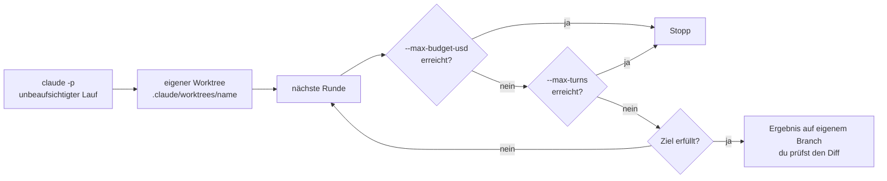

# S3.13 · Autonome Loops absichern: Budget und Worktree

<!-- meta:start -->
> **Regal:** [Automation & Loops](README.md#automation) · **Stufe:** Kern · **~12 Min** · **Voraussetzungen:** [S3.12 Zeitgesteuert arbeiten: /loop, /goal, /schedule, Routinen](s3-12-zeitgesteuert-arbeiten.md) · [S1.19 Kosten im Blick: /cost, /usage und Budgetgrenzen](s1-19-kosten-im-blick.md) · 🛡 **Sicherheitsboden**
>
> ← [S3.12 Zeitgesteuert arbeiten: /loop, /goal, /schedule, Routinen](s3-12-zeitgesteuert-arbeiten.md) · [Bibliothek](README.md) · [S3.14 Self-Improve-Loop: was geht und wo es endet](s3-14-self-improve-loop.md) →
<!-- meta:end -->

## Schnellcheck

- Hast du schon einmal einen autonomen Lauf mit `--max-budget-usd` gestartet und gesehen, wie er beim Limit stoppt?
- Kannst du ohne Nachschlagen erklären, wie ein Lauf mit `--worktree` deinen Hauptbranch vor einem Nachtjob schützt?

## Auf einen Blick

Setz die Grenzen, bevor ein autonomer Lauf startet: `--max-budget-usd` deckelt die Kosten, `--max-turns` die Zahl der Runden, und `--worktree` sperrt den Lauf in einen eigenen Arbeitsbaum, damit dein Hauptbranch unberührt bleibt. Beide Limits wirken nur im Print-Modus (`claude -p`); in einer interaktiven Sitzung greifen sie nicht, dort begrenzt du `/goal` über eine Runden- oder Zeitklausel in der Bedingung und stoppst `/loop` selbst.

Für einen unbeaufsichtigten Lauf auf deinem Rechner ist deshalb `claude -p` mit `/goal` der belegte Weg: `/goal` läuft mit `-p` in einem Aufruf bis zum Ende. `/loop` gehört dagegen zur offenen Sitzung.

## Bild im Kopf

Das Budget ist der Tank des Patrouillenfahrzeugs: Ist er leer, steht das Fahrzeug, statt bis zum Totalausfall weiterzufahren. Das Rundenlimit ist die Zahl der Runden im Fahrtenbefehl. Der Worktree ist der Prüfstand im Labor, ein Nachbau der Anlage, an dem der Nachtjob schrauben darf, ohne die echte Anlage anzufassen. Und `worktree.baseRef` auf `fresh` ist der verplombte Ausgangszustand zu Schichtbeginn: Jede Nachtpatrouille startet von derselben geprüften Basis.



## Im Detail

### Warum Loops Grenzen brauchen

`/loop`, `/goal` und Self-Improve-Loops ([S3.14](s3-14-self-improve-loop.md)) können in einer engen Schleife Tokens verbrennen, wenn ein Tool immer wieder scheitert und Claude es immer wieder versucht. Die harte Grenze dagegen sitzt in der CLI.

### Budget und Rundenlimit

- `--max-budget-usd <betrag>`: höchster Dollarbetrag für API-Aufrufe, danach stoppt der Lauf. Ausgaben von Subagenten zählen mit; ist das Budget erreicht, startet kein weiterer Subagent mehr.
- `--max-turns <n>`: höchste Zahl an Agenten-Runden; ist sie erreicht, endet der Lauf mit einem Fehler. Die CLI-Referenz dokumentiert das Flag, `claude --help` listet es nicht.

Beide gelten laut CLI-Referenz nur im Print-Modus („print mode only"); beim Budget steht das auch in `claude --help` („only works with --print"). Die Grundlagen stehen in [S1.19](s1-19-kosten-im-blick.md), die Praxis für CI in [S4.4](s4-04-ci-zugang-und-kosten.md).

Der alte Kurs zeigte für autonome Loops diese beiden Aufrufe:

```bash
claude --max-budget-usd 5.00 -p "/loop 10m /quality-gate"
claude --max-budget-usd 2.00 -p "/goal Tests grün"
```

Die zweite Zeile trägt: `/goal` läuft mit `-p` in einem Aufruf, bis die Bedingung erfüllt ist, und das Budget deckelt ihn. Ein `--max-turns` dazu begrenzt zusätzlich die Runden. Die erste Zeile trägt nicht als Schleife: `/loop`-Aufgaben feuern laut Doku nur, solange Claude Code läuft und untätig ist, und dass ein `-p`-Lauf auf spätere Durchgänge wartet, beschreibt die Doku nirgends. Einen Loop, der wirklich wiederkehrt, lässt du in einer offenen Sitzung laufen oder planst ihn als Routine ([S3.12](s3-12-zeitgesteuert-arbeiten.md)).

### Interaktiv: was dann begrenzt

In einer interaktiven Sitzung wirken `--max-budget-usd` und `--max-turns` nicht, auch nicht mit `/loop` oder `/goal`. Dort hast du drei Hebel:

- **`/goal` mit Klausel:** Schreib eine Runden- oder Zeitgrenze in die Bedingung, etwa „… or stop after 20 turns". Claude meldet in jeder Runde den Stand, und der Prüfer beurteilt die Klausel aus dem Gespräch. Das ist eine weiche Grenze, kein hartes Limit.
- **`/loop` stoppen:** `Esc` beendet einen selbst getakteten Loop, der auf den nächsten Durchgang wartet. Aufgaben mit festem Intervall laufen, bis du sie löschst (etwa mit „cancel the deploy check job") oder bis sieben Tage um sind.
- **Rechte:** `/goal` ändert deinen Rechte-Modus nicht. Im Standardmodus fragt Claude weiter vor Tool-Aufrufen, die deine Settings nicht schon erlauben. Welche Rechte ein Lauf ohne Aufsicht bekommen darf, steht in [S3.8](s3-08-rechte-fuer-autonomie.md).

### Worktree: der Nachtjob arbeitet auf dem Prüfstand

`--worktree` (kurz `-w`) ist ein Flag von `claude` selbst, nicht von `/loop` oder `/schedule`. `claude --worktree <name>` legt einen Worktree unter `.claude/worktrees/<name>/` auf einem neuen Branch `worktree-<name>` an und startet die Sitzung darin. Dein Haupt-Arbeitsbaum bleibt unberührt: Solange eine Sitzung so isoliert ist, blockt Claude Code Datei-Änderungen und Befehle, die in den Haupt-Checkout zielen, auch bei jedem Subagenten, den sie startet.

Der Worktree gibt dem Lauf einen frischen Ausgangsstand, einen eigenen Dateistand und eine saubere Stelle zum Zusammenführen. Von wo er abzweigt, bestimmt `worktree.baseRef`: `fresh` (laut Doku der Standard) nimmt den Standardbranch auf dem Remote, `head` deinen lokalen `HEAD` samt ungepushter Commits. Für Nachtläufe, deren Ergebnisse vergleichbar sein sollen, passt `fresh`. Die Mechanik steht in [S1.18](s1-18-worktrees.md), Isolation mit Docker in [S4.7](s4-07-isolation-docker-worktrees.md).

**Einsatz:** Audit-Loops im Hintergrund, geplante Refactoring-Experimente und jeder autonome Job, der Dateien schreibt, aber deine interaktive Arbeit auf `main` nicht stören soll.

### Statt pollen: Channels

Ein `/loop` fragt regelmäßig nach, ob sich etwas getan hat. Channels drehen das um: Ein MCP-Server schiebt Nachrichten, Alarme oder Webhooks direkt in deine laufende Claude-Code-Sitzung, etwa ein CI-Ergebnis. Das ist der offizielle Weg für das Muster, das [S4.6](s4-06-remote-und-teleport.md) mit der 🔧 Telegram-Bridge als Eigenbau zeigt: gleiches Muster, kein eigener Brücken-Code. Die Bridge bleibt ein Lehrbeispiel; im Betrieb greifst du zuerst zu Channels.

Channels sind eine Research Preview. Für autonome Läufe zählen drei Punkte:

- Ereignisse kommen nur an, solange die Sitzung offen ist.
- Ein Kanal läuft erst, wenn du ihn für die Sitzung mit `--channels` einschaltest, und nur Absender auf seiner Allowlist können Nachrichten schicken.
- Leitet ein Kanal Rechte-Anfragen weiter, kann jeder, der über den Kanal antworten darf, Tool-Aufrufe in deiner Sitzung freigeben oder ablehnen. Setz nur Absender auf die Allowlist, denen du das zutraust.

### Ausprobieren

So legst du für einen riskanten Versuch einen abgeschotteten Arbeitsbaum an:

<!-- cockpit:example -->
```bash
git worktree add ../experiment-async-processing -b feature/async-experiment
cd ../experiment-async-processing
claude
# Make experimental changes — the main branch stays untouched
```

Ist das Experiment fertig, verwirf es oder führ es zusammen:

```bash
git worktree remove ../experiment-async-processing
```

## Typische Fallen

- **Die interaktive Sitzung gilt als gedeckelt.** `claude --max-budget-usd 1.00` ohne `-p` begrenzt nichts; das Flag wirkt nur im Print-Modus.
- **Die Rundenklausel gilt als hartes Limit.** Bei `/goal` in einer interaktiven Sitzung beurteilt ein Modell die Klausel aus dem Gespräch. Muss die Grenze hart sein, nimm `claude -p` mit `--max-turns`.
- **Jeder Absender darf freigeben.** Ein Kanal, der Rechte-Anfragen weiterleitet, macht jeden Absender auf seiner Allowlist zu jemandem, der Tool-Aufrufe freigeben kann.

**Worktree und Routine verwechselt.** Auch diese Aufrufe standen im alten Kurs:

```bash
# Nightly audit on a dedicated branch; main branch untouched
claude --worktree audit/nightly --max-budget-usd 1.00 -p "/loop 24h /security-audit"

# Routine that lives entirely on its own branch
claude --worktree routines/daily-build-report -p "/schedule daily 06:00 ..."
```

Beide tragen nicht. Die erste Zeile hat dasselbe Problem wie oben: `/loop` gehört zur offenen Sitzung, und dass ein `-p`-Lauf auf die nächsten Durchgänge wartet, ist nicht belegt. Die zweite legt eine Routine an, die in der Cloud mit einem frischen Klon vom Standardbranch läuft und auf `claude/`-Branches schreibt; dein lokaler Worktree spielt für sie keine Rolle. Außerdem ist `/schedule` als Gespräch gedacht: Claude geht dieselben Angaben durch, die das Web-Formular abfragt, und speichert die Routine erst danach. Für einen Nachtjob nimmst du eine Routine ([S3.12](s3-12-zeitgesteuert-arbeiten.md)), eine geplante Aufgabe in der Desktop-App oder einen Zeitplan in der CI ([S4.5](s4-05-ci-pipelines.md)).

## Check

Du kannst erklären, warum jeder unbeaufsichtigte Lauf ein Budget und ein Rundenlimit braucht, was in einer interaktiven Sitzung stattdessen begrenzt und wie ein Worktree deinen Hauptbranch schützt.

1. Welche zwei Flags deckeln einen `claude -p`-Lauf, und was passiert, wenn eines davon erreicht ist?
2. Warum ist eine interaktive Sitzung, die mit `claude --max-budget-usd 1.00` startet, nicht gedeckelt?
3. Von wo zweigt ein Worktree mit `worktree.baseRef: "fresh"` ab, und warum passt das für Nachtläufe?

<details><summary>Quizfrage</summary>

**Frage:** Du startest eine interaktive Sitzung mit `claude --max-budget-usd 1.00` und setzt darin `/goal alle Tests grün`. Was begrenzt die Kosten dieses Laufs hart?

- **Richtig:** Nichts davon: Das Flag wirkt nur mit `-p`. Hart wird die Grenze erst, wenn der Lauf mit `claude -p` startet.
- Falsch: Das Budget-Flag, denn es gilt ab dem Start für jede Sitzung, die du mit ihm aufrufst, auch für eine interaktive.
- Falsch: Der Prüfer von `/goal`, denn er bricht den Lauf von selbst ab, sobald ein Dollar Budget verbraucht ist.
- Falsch: Der Worktree, denn jeder isolierte Lauf bekommt von Claude Code ein eigenes festes Budget zugeteilt.

</details>

## Weiterlesen

- [CLI-Referenz: --max-budget-usd, --max-turns, --worktree](https://code.claude.com/docs/en/cli-reference)
- [Worktrees](https://code.claude.com/docs/en/worktrees)
- [An einem Ziel weiterarbeiten (/goal)](https://code.claude.com/docs/en/goal)
- [Prompts nach Zeitplan ausführen (/loop)](https://code.claude.com/docs/en/scheduled-tasks)
- [Channels](https://code.claude.com/docs/en/channels)
- [S1.19 · Kosten im Blick: /cost, /usage und Budgetgrenzen](s1-19-kosten-im-blick.md)
- [S3.12 · Zeitgesteuert arbeiten: /loop, /goal, /schedule, Routinen](s3-12-zeitgesteuert-arbeiten.md)
- [S3.14 · Self-Improve-Loop: was geht und wo es endet](s3-14-self-improve-loop.md)
- [S1.18 · Worktrees als Testlabor](s1-18-worktrees.md)
- [S4.7 · Isolation mit Docker und Worktrees](s4-07-isolation-docker-worktrees.md)
- [S3.8 · Rechte für autonome Läufe](s3-08-rechte-fuer-autonomie.md)
- [S4.4 · CI-Zugangsdaten, Kostengrenzen und Kosten-Feinschliff](s4-04-ci-zugang-und-kosten.md)
- [S4.6 · Unterwegs: Remote Control und /teleport](s4-06-remote-und-teleport.md)
