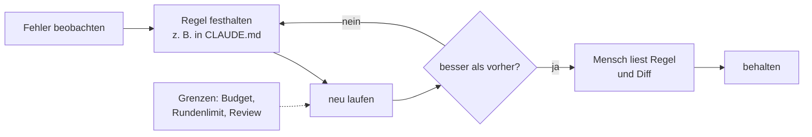

# S3.14 · Self-Improve-Loop: was geht und wo es endet

<!-- meta:start -->
> **Regal:** [Automation & Loops](README.md#automation) · **Stufe:** Kür · **~20 Min** · **Voraussetzungen:** [S3.13 Autonome Loops absichern: Budget und Worktree](s3-13-autonome-loops-absichern.md)
>
> ← [S3.13 Autonome Loops absichern: Budget und Worktree](s3-13-autonome-loops-absichern.md) · [Bibliothek](README.md) · [S3.15 Praxis-Station Session 3: alles in einem Ablauf](s3-15-praxis-station-3.md) →
<!-- meta:end -->

## Schnellcheck

- Hast du schon einmal aus einem Fehler von Claude eine Regel in `CLAUDE.md` gemacht und danach geprüft, ob sie beim nächsten Lauf greift?
- Kannst du ohne Nachschlagen sagen, woran du einen Schein-Fix erkennst, bei dem ein Test nur grün wird, weil die Assertion fehlt?

## Auf einen Blick

Ein Self-Improve-Loop ist ein Muster: eine Schwäche beobachten, eine Gegenmaßnahme festhalten, mit ihr noch einmal laufen und das Ergebnis vergleichen. Mit Bordmitteln heißt das: ein Fehler, eine Zeile in `CLAUDE.md`, ein zweiter Lauf. Claude Code behandelt `CLAUDE.md` laut Doku als Kontext, nicht als erzwungene Konfiguration: Eine Regel macht ein Verhalten wahrscheinlicher, nicht sicher. Je automatischer ein solcher Kreislauf wird (Claude schreibt Regeln, Tests und Commits selbst), desto wichtiger werden Grenzen: ein Budget, ein Rundenlimit, ein Mensch, der den Diff liest. Ein grünes Testergebnis beweist nicht, dass ein Fix echt ist.

## Bild im Kopf

Stell dir ein Intrusion-Detection-System vor, das seine Signaturen selbst aktualisiert. Es erkennt ein neues Angriffsmuster, plant eine Gegenregel, prüft sie zuerst an aufgezeichnetem Verkehr und schreibt sie erst danach in die Live-Datenbank. Gefährlich wird es, wenn das System lernt, Fehlalarme zu unterdrücken, statt seine Signaturen zu verbessern: Das ist der Schein-Fix in Reinform. Und eine Signatur, die ein Mensch nie gelesen hat, kann falsch sein.



## Im Detail

### Das Muster in vier Schritten

1. **Beobachten:** Ein Lauf macht etwas, das du nicht willst, und du kannst es an einer Stelle ablesen: einem Dateinamen, einem Diff, einem Testergebnis.
2. **Festhalten:** Du schreibst die Gegenmaßnahme so auf, dass sie sich prüfen lässt. Die Doku sagt: Je konkreter und kürzer deine Anweisungen sind, desto zuverlässiger folgt Claude ihnen.
3. **Neu laufen:** Derselbe Auftrag, in einer neuen Sitzung, denn `CLAUDE.md` wird beim Start der Sitzung geladen ([S1.10](s1-10-claude-md.md)).
4. **Vergleichen:** Du liest dasselbe Merkmal noch einmal ab. Nur was du messen kannst, kannst du verbessert nennen.

### Wer die Regel schreibt

Du schreibst sie selbst, oder Claude tut es für dich: Die Auto-Memory von Claude Code ist die eingebaute Variante des Kreislaufs. Laut Doku speichert Claude dort Notizen, die es sich auf Basis deiner Korrekturen und Vorlieben selbst schreibt ([S1.11](s1-11-gedaechtnis-ebenen.md)). Das spart dir das Schreiben und nimmt dir das Lesen nicht ab: Auch eine selbst geschriebene Notiz kann falsch sein.

### Was schiefgehen kann

- **Kostenlauf:** Ein hängender Loop kann in kurzer Zeit viele Tokens verbrauchen. Wie du ihn deckelst, steht in [S3.13](s3-13-autonome-loops-absichern.md).
- **Schein-Fixes:** Claude kann einen Test „reparieren“, indem es die Assertion entfernt. Der Testlauf bleibt grün, der Fehler bleibt auch. Dagegen hilft, den Diff auf entfernte Assertions zu lesen (etwa mit `git diff` auf die Testdateien) oder einen Hook, der solche Änderungen blockt ([S2.8](s2-08-hook-einrichten.md)).
- **Falsche oder veraltete Regeln:** Claude befolgt eine Regel auch dann, wenn sie falsch ist. Eine Regel, die nie ein Mensch gelesen hat, ist eine Behauptung.
- **Keine Garantie:** `CLAUDE.md` ist Kontext, keine erzwungene Konfiguration. Was in jedem Fall verhindert werden muss, blockt laut Doku ein PreToolUse-Hook, unabhängig davon, was Claude entscheidet.
- **Zu viel Vertrauen in kleine Stichproben:** Ein paar gelungene Läufe an Spielzeug-Code lassen sich nicht auf ein echtes Projekt übertragen.

### Wo es endet

Ein autonomer Verbesserungskreislauf gehört in ein Repository, in dem sich jede Änderung zurücknehmen lässt (Git, [S3.13](s3-13-autonome-loops-absichern.md)), und nicht an Systeme, bei denen ein Fehler nicht rückgängig zu machen ist. Wo ein Fehler echte Geräte oder echte Daten trifft, setzt du eine menschliche Freigabe davor ([S3.8](s3-08-rechte-fuer-autonomie.md), [S3.11](s3-11-datenschutz-und-compliance.md)).

## Selbst machen

### Übung: aus einem Fehler eine Regel machen und prüfen (etwa 12 Minuten)

**Ziel:** Du siehst einen Lauf gegen eine Konvention verstoßen, die nur du kennst, schreibst sie als eine Zeile in `CLAUDE.md` und beweist mit einem zweiten Lauf, dass Claude sie anwendet.

**Startzustand:** Du arbeitest im Ordner `~/cc-workshop/lernregel`, einem Wegwerf-Repository mit einer fast leeren Datei `shop.py`. Mehr als Claude Code, Git und Python brauchst du nicht; nichts Globales ändert sich.

Bash:

```bash
mkdir -p ~/cc-workshop/lernregel && cd ~/cc-workshop/lernregel
printf '"""Small shop helpers."""\n' > shop.py
git init -q
git config user.name "Learner"
git config user.email "learner@example.com"
git add shop.py
git commit -q -m "start"
```

PowerShell:

```powershell
New-Item -ItemType Directory -Force "$HOME\cc-workshop\lernregel" | Out-Null
Set-Location "$HOME\cc-workshop\lernregel"
Set-Content shop.py '"""Small shop helpers."""'
git init -q
git config user.name "Learner"
git config user.email "learner@example.com"
git add shop.py
git commit -q -m "start"
```

Die Konvention deines Projekts, die Claude nicht erraten kann: Jeder Funktionsname in `shop.py` beginnt mit `shop_`.

1. **Lauf 1, ohne Regel.** Starte `claude --permission-mode acceptEdits`, bestätige den Vertrauensdialog und gib ein: `In shop.py, add a function that sums a list of prices given in cents and a function that formats an amount in cents like 12.50. Keep it short.` Beende die Sitzung mit `/exit`.
2. **Beobachten.** Lies die Funktionsnamen ab: in Bash `grep -n "^def " shop.py`, in PowerShell `Select-String "^def " shop.py`. Erwartet: Die Namen beginnen nicht mit `shop_`, denn davon weiß Claude nichts. Beginnt schon einer damit, nimm als Konvention stattdessen das Präfix `cart_`.
3. **Festhalten.** Leg im Ordner `CLAUDE.md` an, mit genau einer Regel. Hast du in Schritt 2 auf `cart_` gewechselt, schreib überall `cart_` statt `shop_`, hier und in den folgenden Schritten:

   <!-- cockpit:example -->
   ```markdown
   # Conventions

   - Every function name in shop.py starts with the prefix `shop_`, for example `shop_total`.
   ```

4. **Zurücksetzen.** `git restore shop.py` stellt die leere Datei wieder her.
5. **Lauf 2, mit Regel.** Starte eine neue Sitzung mit `claude --permission-mode acceptEdits` und gib denselben Auftrag wie in Schritt 1 ein. Beende die Sitzung.
6. **Vergleichen.** Lies die Funktionsnamen wie in Schritt 2 noch einmal ab. Erwartet: Jeder Name beginnt mit `shop_`. Lies auch den Diff: `git diff` zeigt die neuen Funktionen.
7. **Prüfen, wer prüft.** Lies die Regel noch einmal als Fremde: Ist sie konkret genug, dass man sie an `shop.py` nachprüfen kann? Du hast es eben mit einem `grep` getan. Eine Regel, die du so nicht nachprüfen kannst, taugt nicht als Beleg.

**Aufräumen:** Lösch den Ordner `~/cc-workshop/lernregel`.

**Geschafft, wenn:**

- [ ] die Funktionsnamen aus Lauf 1 nicht mit `shop_` begannen
- [ ] `CLAUDE.md` genau eine konkrete, nachprüfbare Regel enthielt
- [ ] alle Funktionsnamen aus Lauf 2 mit `shop_` begannen
- [ ] du sagen kannst, was in Lauf 2 nicht garantiert war und was einen Verstoß in jedem Fall blockt

### Extra: eine falsche Regel (etwa 5 Minuten)

**Ziel:** Du siehst, dass Claude auch einer falschen Regel folgt, und warum du jede Regel selbst liest.

**Startzustand:** der Ordner `~/cc-workshop/lernregel` aus der Übung, falls noch nicht gelöscht.

1. Ändere in `CLAUDE.md` das Präfix absichtlich zu `shopp_` (zwei p), stell mit `git restore shop.py` die leere Datei her und wiederhol Lauf 2 in einer neuen Sitzung.
2. Lies die Funktionsnamen ab. Erwartet: Claude folgt der Regel wahrscheinlich buchstäblich und nutzt `shopp_`; frag es nicht, ob der Tippfehler Absicht war. Dass es bei dir anders ausgeht, ist möglich; entscheidend ist, dass kein Werkzeug dich vor einem Tippfehler in deiner eigenen Regel warnt.

**Geschafft, wenn:**

- [ ] du erklären kannst, warum der Mensch die Regel liest, bevor sie in ein Projekt gehört

## Typische Fallen

- **Die Regel greift beim zweiten Lauf nicht.** Hast du eine neue Sitzung gestartet? `CLAUDE.md` wird beim Start geladen. Ist die Regel konkret und kurz genug? „Schreib sauberen Code“ lässt sich nicht nachprüfen.
- **Grün heißt nicht gelöst.** Ein Testlauf, der nach einem autonomen Lauf grün ist, beweist keinen echten Fix, wenn Assertions fehlen. Lies den Diff.
- **Aus einem einzelnen Lauf wird eine Regel für alles.** Ein Fehler in einem Lauf ist ein Hinweis, kein Beleg. Wiederhol den Lauf, bevor du die Regel einchecken lässt.
- **Die Regel wird mit der Zeit falsch.** Veraltete Zeilen in `CLAUDE.md` lenken spätere Läufe in die falsche Richtung. Lies die Datei von Zeit zu Zeit durch.

## Check

Du kannst das Muster mit Bordmitteln durchspielen und seine Grenzen nennen.

1. Welche vier Schritte hat das Muster, und warum startest du für den zweiten Lauf eine neue Sitzung?
2. Warum ist eine Regel in `CLAUDE.md` keine Garantie, und was blockt einen Verstoß in jedem Fall?
3. Ordne zu: Welche Gegenmaßnahme gehört zu einem Kostenlauf, zu einem Schein-Fix und zu einer falschen Regel?

<details><summary>Auflösung</summary>

1. Beobachten, festhalten, neu laufen, vergleichen. `CLAUDE.md` wird beim Start der Sitzung geladen; in der laufenden Sitzung hat Claude die neue Zeile nicht.
2. Claude behandelt `CLAUDE.md` als Kontext, nicht als erzwungene Konfiguration. Was in jedem Fall verhindert werden muss, blockt ein PreToolUse-Hook, unabhängig davon, was Claude entscheidet.
3. Kostenlauf: Budget und Rundenlimit mit `claude -p`. Schein-Fix: den Diff auf entfernte Assertions lesen oder einen Hook, der sie blockt. Falsche Regel: ein Mensch liest sie, bevor sie bleibt.

</details>

<details><summary>Quizfrage</summary>

**Frage:** Nach einem autonomen Lauf sind alle Tests grün. Welche Prüfung brauchst du als Nächstes?

- **Richtig:** Den Diff der Testdateien lesen, ob Assertions fehlen, denn ein grüner Lauf kann auch heißen, dass der Test weniger prüft als vorher.
  - Warum: Claude kann einen Test „reparieren“, indem es die Assertion entfernt: Der Lauf bleibt grün, der Fehler auch. Darum liest du den Diff der Testdateien auf entfernte Assertions.
- Falsch: Keine, denn Tests sind der Nachweis; ein grüner Lauf zeigt, dass der Fehler im Code behoben ist und nicht im Test.
  - Warum: Grün heißt nicht gelöst: Ein Test ohne Assertion bleibt grün, ohne den Fehler zu prüfen. Ein grünes Ergebnis beweist deshalb nicht, dass ein Fix echt ist.
- Falsch: Das Budget-Limit kontrollieren, denn ein eingehaltenes Budget zeigt, dass der Lauf keine Schein-Fixes geschrieben hat.
  - Warum: Ein Budget gehört zum Kostenlauf: Es deckelt Ausgaben, sagt aber nichts über den Inhalt der Änderungen. Gegen Schein-Fixes liest du den Diff auf entfernte Assertions oder setzt einen Hook ein.
- Falsch: Die Commit-Nachricht lesen, denn eine ausführliche Nachricht belegt, dass die Änderung am Code und nicht am Test erfolgte.
  - Warum: Ob Code oder Test geändert wurde, liest du im Diff ab, nicht an einer Commit-Nachricht. Entfernte Assertions zeigt `git diff` auf die Testdateien.

</details>

## Weiterlesen

- [Gedächtnis und CLAUDE.md (offizielle Doku)](https://code.claude.com/docs/en/memory)
- [CLI-Referenz: --max-budget-usd](https://code.claude.com/docs/en/cli-reference)
- [Hooks-Leitfaden](https://code.claude.com/docs/en/hooks-guide)
- [S1.10 · CLAUDE.md: die Hausordnung des Projekts](s1-10-claude-md.md)
- [S1.11 · Alle Gedächtnis-Ebenen im Überblick](s1-11-gedaechtnis-ebenen.md)
- [S3.13 · Autonome Loops absichern: Budget und Worktree](s3-13-autonome-loops-absichern.md)
- [S3.12 · Zeitgesteuert arbeiten: /loop, /goal, /schedule, Routinen](s3-12-zeitgesteuert-arbeiten.md)
- [S3.6 · Devil's Advocate: eine adversariale Prüf-Pipeline](s3-06-devils-advocate.md)
- [S3.11 · Datenschutz, Aufbewahrung und regulierte Branchen](s3-11-datenschutz-und-compliance.md)
- [S2.8 · Einen Hook einrichten, der wirklich blockt](s2-08-hook-einrichten.md)
