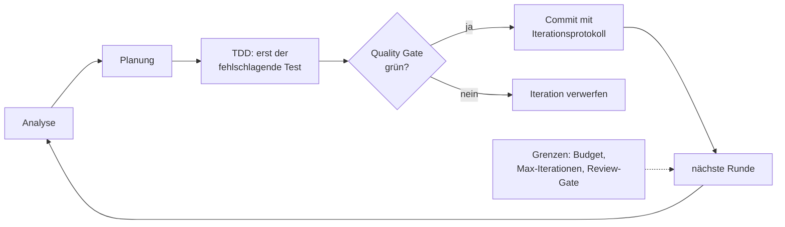

# S3.14 · Self-Improve-Loop: was geht und wo es endet

<!-- meta:start -->
> **Regal:** [Automation & Loops](README.md#automation) · **Stufe:** Kür · **~15 Min** · **Voraussetzungen:** [S3.13 Autonome Loops absichern: Budget und Worktree](s3-13-autonome-loops-absichern.md)
>
> ← [S3.13 Autonome Loops absichern: Budget und Worktree](s3-13-autonome-loops-absichern.md) · [Bibliothek](README.md) · [S3.15 Praxis-Station Session 3: eine Übung wählen](s3-15-praxis-station-3.md) →
<!-- meta:end -->

## Schnellcheck

- Hast du schon einmal einen autonomen Verbesserungs-Loop mit Quality Gate und Iterationsgrenze laufen lassen und danach die Commits selbst geprüft?
- Kannst du ohne Nachschlagen sagen, woran du einen Schein-Fix erkennst, bei dem ein Test nur grün wird, weil die Assertion fehlt?

## Auf einen Blick

Ein Self-Improve-Loop sucht die größte Schwäche eines Projekts, plant einen gezielten Fix, schreibt zuerst einen fehlschlagenden Test, setzt um und committet nur, wenn ein Quality Gate grün ist; dann beginnt die nächste Runde. Gezeigt wird das Muster am 🔧 Custom-Plugin `agentic-os`, nicht an einer Funktion von Claude Code. Es ist ein Experiment, das nur mit Budget-Grenze, Quality Gate und Iterationslimit taugt, denn ein grünes Gate beweist nicht, dass ein Fix echt ist.

## Bild im Kopf

Stell dir ein Intrusion-Detection-System vor, das seine Signaturen selbst aktualisiert. Es erkennt ein neues Angriffsmuster (Analyse), plant eine Gegenregel (Planung), testet sie im Sandbox-Modus ohne Wirkung auf den Betrieb (TDD), prüft, dass keine Fehlalarme entstehen (Quality Gate), und schreibt die Signatur in die Live-Datenbank (Commit). Gefährlich wird es, wenn das System lernt, Fehlalarme zu unterdrücken, statt seine Signaturen zu verbessern: Das ist der Schein-Fix in Reinform.



## Im Detail

### Der Zyklus

> 🔧 **Custom-Komponente:** `agentic-os` ist ein eigenes Plugin, kein Teil von Claude Code. Stand 2026-09-30 gibt es den Befehl `/agentic-os:run-loop` in der installierten Fassung des Plugins (5.1.4) nicht mehr: Er wurde mit v4.0.0 entfernt, der Self-Improve-Skill mit v5.0.0 archiviert. Das Muster bleibt lehrreich; vorführen lässt es sich damit nur noch als Aufzeichnung.

Der Skill `/agentic-os:run-loop` setzte **autonome Verbesserungszyklen** um. Jede Iteration:

1. **Analyse:** liest Qualitätsmetriken, Testfehler, Review-Befunde und die bisherigen Iterationen
2. **Planung:** entwirft einen gezielten Fix für die Schwäche mit der größten Wirkung
3. **TDD-Umsetzung:** schreibt zuerst einen fehlschlagenden Test, dann den Code, der ihn bestehen lässt
4. **Quality Gate:** Tests grün? Qualität über der Schwelle? Keine Regressionen?
5. **Commit (nur wenn das Gate grün ist):** Git-Commit mit ausführlichem Iterationsprotokoll
6. **Wiederholen:** Die nächste Iteration startet mit dem aktualisierten Stand.

### Sicherheitsmechanismen

| Mechanismus | Was er tut |
|---|---|
| Quality Gates | verweigern den Commit, wenn Tests scheitern oder die Qualität sinkt |
| Git-Historie | Jede Iteration ist ein Commit, den du zurücknehmen kannst. |
| Hooks | blocken bestimmte gefährliche Operationen ([S2.8](s2-08-hook-einrichten.md)) |
| Menschliche Review-Gates | halten an und warten auf Freigabe, bevor committet wird |
| Max-Iterationen | begrenzen autonome Läufe pro Sitzung |

Von außen kommt die Budget-Grenze dazu ([S3.13](s3-13-autonome-loops-absichern.md)).

### Was das Gedächtnis mitschreibt

Das Gedächtnissystem von Agentic OS hält alles fest:

- `.agent-memory/iterations/`: vollständiges Protokoll jeder Änderung und Entscheidung
- `.agent-memory/quality/`: Qualitätswerte über die Zeit
- `.agent-memory/learnings/`: Muster, die über mehrere Läufe erkannt wurden

Das ist eine Audit-Spur, keine Sicherheitsgarantie.

### Ehrliche Einschätzung

In internen Tests an kleinen Python-Projekten mit klaren Testsuiten hat der Loop über mehrere Iterationen schrittweise Fixes geliefert, ohne erkennbare Regressionen. Das ist anekdotisch, keine veröffentlichte Messung, und kein garantierter Produktivitätsgewinn. Behandle den Self-Improve-Loop als **Experimentierwerkzeug, das nur etwas taugt, wenn Budget-Grenze und Quality Gate ihn eng begrenzen.**

### Was schiefgehen kann

- **Kostenlauf:** Ohne `--max-budget-usd` kann ein hängender Loop in kurzer Zeit viel Geld verbrennen. Wie du ihn deckelst, steht in [S3.13](s3-13-autonome-loops-absichern.md).
- **Schein-Fixes:** Claude kann einen Test „reparieren", indem es die Assertion entfernt. Das Gate bleibt grün, der Fehler bleibt auch. Dagegen helfen strenge Pre-Commit-Hooks.
- **Memory-Drift:** Das Gedächtnis kann falsche Schlüsse festhalten, die spätere Iterationen in die falsche Richtung lenken; es braucht regelmäßiges Aufräumen ([S4.10](s4-10-diagnose-schritt-fuer-schritt.md)).
- **Zu viel Vertrauen in kleine Stichproben:** Ein paar gelungene Läufe an Spielzeug-Code lassen sich nicht auf Produktion übertragen.

### Wo es endet: regulierte Hardware

> **Branchenrealität:** In regulierten Anlagen der physischen Sicherheit (EN 50131 für Einbruch- und Überfallmeldeanlagen) ist ein autonomes Firmware-Update an Tür-Controllern **nicht** zulässig. Pflicht sind Change-Management mit Audit-Trail, oft die Anwesenheit eines Technikers vor Ort und Replay-Tests. Das Muster gilt für Code-Repositories und CI/CD; an echten Hardware-Endpunkten wäre ein Freigabe-Schritt Pflicht, also der Mechanismus „Menschliche Review-Gates" aus der Tabelle oben. Welche Kontrollen zu welchem Regelwerk passen, steht in [S3.11](s3-11-datenschutz-und-compliance.md).

### Ausprobieren

Den Plugin-Befehl gibt es nicht mehr. Mit Bordmitteln kommst du dem Zyklus am nächsten, wenn du Claude Code ein Ziel mit prüfbarer Bedingung gibst ([S3.12](s3-12-zeitgesteuert-arbeiten.md)). Probier es in einem Wegwerf-Repo mit Tests, auf einem eigenen Branch:

<!-- cockpit:example -->
```
/goal all tests in test/auth pass and the lint step is clean
```

Vergleiche mit dem Zyklus oben: Welche der sechs Schritte siehst du, und welche Sicherheitsmechanismen aus der Tabelle unten musst du selbst mitbringen?

## Check

Du kannst die vier häufigsten Fehlerbilder des Self-Improve-Loops nennen, jedem eine Gegenmaßnahme zuordnen und erklären, warum der Loop an Hardware-Endpunkten nach EN 50131 nicht ohne Freigabe-Gate laufen darf.

1. Welche sechs Schritte hat eine Iteration, und wann wird committet?
2. Warum ist ein grünes Quality Gate kein Beweis für einen echten Fix?
3. Was hält das Gedächtnis fest, und welches Risiko entsteht daraus?

<details><summary>Quizfrage</summary>

**Frage:** Was unterscheidet einen Commit hinter dem Quality Gate von einem normalen Commit, und welches Fehlerbild umgeht diesen Schutz trotzdem?

- **Richtig:** Er entsteht nur bei grünen Tests und ausreichendem Score; ein Schein-Fix umgeht das, wenn Claude die Assertion löscht.
- Falsch: Er unterscheidet sich nur im Format der Commit-Nachricht; einen Schutz über die normale Git-Mechanik hinaus gibt es nicht.
- Falsch: Er entsteht nur bei grünen Tests; ein Kostenlauf umgeht das, weil zu hoher Verbrauch die Prüfung des Gates überspringt.
- Falsch: Er wird im Gedächtnis protokolliert; Memory-Drift umgeht das, weil `.agent-memory/` die Assertions direkt umschreibt.

</details>

## Weiterlesen

- [CLI-Referenz: --max-budget-usd](https://code.claude.com/docs/en/cli-reference)
- [Hooks-Leitfaden](https://code.claude.com/docs/en/hooks-guide)
- [S3.13 · Autonome Loops absichern: Budget und Worktree](s3-13-autonome-loops-absichern.md)
- [S3.12 · Zeitgesteuert arbeiten: /loop, /goal, /schedule, Routinen](s3-12-zeitgesteuert-arbeiten.md)
- [S3.6 · Devil's Advocate: eine adversariale Prüf-Pipeline](s3-06-devils-advocate.md)
- [S3.11 · Datenschutz, Aufbewahrung und regulierte Branchen](s3-11-datenschutz-und-compliance.md)
- [S2.8 · Einen Hook einrichten, der wirklich blockt](s2-08-hook-einrichten.md)
- [S4.10 · Diagnose Schritt für Schritt](s4-10-diagnose-schritt-fuer-schritt.md)
