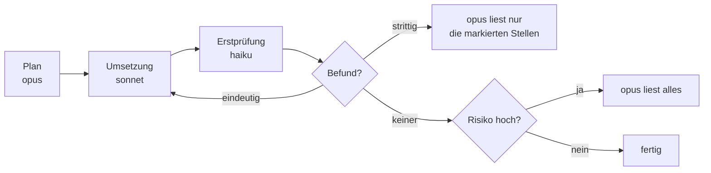

# S4.1 · Das richtige Modell pro Phase

<!-- meta:start -->
> **Regal:** [Modelle & Kosten](README.md#cost) · **Stufe:** Vertiefung · **~15 Min** · **Voraussetzungen:** [S1.7 Modellwahl und Effort](s1-07-modellwahl-und-effort.md) · [S3.4 Orchestrierungsmuster: Fan-out, Pipeline, Hierarchie](s3-04-orchestrierungsmuster.md)
>
> ← [X.3 Der minimale Agent: Pi als Spiegel](x-03-pi-als-spiegel.md) · [Bibliothek](README.md) · [S4.2 Codex-Schwarm und die Datenfluss-Grenze](s4-02-codex-schwarm.md) →
<!-- meta:end -->

## Schnellcheck

- Kannst du ohne Nachschlagen sagen, welches Modell `opusplan` im Plan-Modus und welches es danach nimmt?
- Weißt du, wann ein günstiger Erstdurchgang im Review wirklich Geld spart und wann nicht?

## Auf einen Blick

Die Kernfrage ist nicht „Welches Modell ist besser?“, sondern „Welche Phase dieser Aufgabe braucht tiefes Urteil und welche Durchsatz?“. Die Doku beschreibt `opus` für komplexes Reasoning, `sonnet` für alltägliche Coding-Aufgaben und `haiku` für einfache Aufgaben. Daraus folgt eine Zuordnung: `opus` plant, `sonnet` setzt um, `haiku` macht einen günstigen ersten Prüfdurchgang.

Der Prüfdurchgang spart nur, wenn das stärkere Modell danach weniger liest, als es ohne ihn gelesen hätte. Liest es ohnehin den gesamten Code, hast du den Haiku-Lauf zusätzlich bezahlt. Die Kosten einer Phase siehst du in `/cost`.

## Bild im Kopf

Mehr-Modell-Orchestrierung ist der Dienstplan einer Sicherheitsfirma bei einer neuen Türanlage. Der Senior-Architekt schreibt die Leistungsbeschreibung mit den Sicherheitsanforderungen. Die Techniker montieren Leser und verlegen Kabel. Eine Junior-Streife macht den ersten, günstigen Kontrollgang und meldet Auffälliges. Der Senior-Ingenieur nimmt ab: Bei einer Hausmeister-Tür liest er die gemeldeten Stellen, bei der Tür zum Serverraum jede Kabeltrasse selbst. Niemand lässt den Senior selbst Kabel ziehen, und niemand lässt die Junior-Streife allein abnehmen.



## Im Detail

### Aliase und ihre Rollen

| Alias | Rolle laut Doku | Typische Phase |
|---|---|---|
| `opus` | komplexes Reasoning | Planung, Abnahme, Qualitätsentscheidungen |
| `sonnet` | alltägliche Coding-Aufgaben | Umsetzung |
| `haiku` | einfache Aufgaben, schnell und effizient | erster Prüfdurchgang, Massenarbeit |

Worauf die Aliase aktuell auflösen, steht im [Kanon](../_canonical.md), Preise ebenfalls; die Grundlagen zu Kosten in [S1.19](s1-19-kosten-im-blick.md), die Rechnung für Pipelines in [S4.4](s4-04-ci-zugang-und-kosten.md). Auch Subagenten können ein eigenes Modell tragen, etwa `haiku` für lesende Hilfsarbeiten ([S3.3](s3-03-eigener-subagent.md)). Ein zweiter Anbieter als Umsetzer ist möglich, schickt deinen Code aber an diesen Anbieter ([S4.2](s4-02-codex-schwarm.md)).

### Drei Phasen, drei Entscheidungen

- **Planen mit `opus`.** Ein teurer Aufruf kauft eine saubere Zerlegung in klare Aufgaben mit prüfbaren Kriterien. Ein schlechter Plan kostet dich später in Umsetzung und Prüfung.
- **Umsetzen mit `sonnet`.** Hier fließt die Masse der Tokens, und die Aufgaben sind durch den Plan eng umrissen.
- **Prüfen in zwei Stufen.** `haiku` liest, was du ihm gibst, etwa einen Diff, und meldet Befunde. Eindeutige Befunde gehen zurück an die Umsetzung. Strittige Punkte und Grenzfälle gehen an `opus`, und es liest dann die markierten Stellen mit der Spezifikation, nicht den ganzen Code. Genau darin liegt die Ersparnis.

Zwei Dinge begrenzen das. Erstens beweist „Haiku findet nichts“ nichts: Bei sicherheitskritischem Code oder Architekturentscheidungen liest `opus` selbst, und dann sparst du durch den Haiku-Lauf nichts. Zweitens hängt es von der Aufgabe ab, wie viele Befunde Haiku allein findet; eine feste Quote belegt dieser Kurs nicht. Miss sie an deinen eigenen Reviews, bevor du dich darauf verlässt. Das Muster „Pipeline“ kennst du aus [S3.4](s3-04-orchestrierungsmuster.md).

### Eingebaut: opusplan

Für die ersten beiden Phasen innerhalb einer Sitzung hat Claude Code ein eigenes Kürzel. Der Modellwert `opusplan` nimmt laut Doku im Plan-Modus `opus` und wechselt für die Umsetzung zu `sonnet`. Die Prüfung startest du in einer eigenen Sitzung:

<!-- cockpit:example -->
```text
# Plan und Umsetzung: opus im Plan-Modus, danach sonnet
claude --model opusplan

# Erste Prüfung, neue Sitzung: das günstige Tier
claude --model haiku

# Strittige Punkte, neue Sitzung: das starke Tier entscheidet
claude --model opus
```

`--model` gilt nur für die gestartete Sitzung. Anders `/model`: In der Auswahl speichert Enter deine Wahl als Standard, und auch `/model <name>` direkt verhält sich wie Enter ([S1.7](s1-07-modellwahl-und-effort.md)). Jeder Wechsel zwischen Modellen startet außerdem einen neuen Cache: Jedes Modell hat seinen eigenen, und beim `opusplan` ist jeder Wechsel zwischen Plan-Modus und Umsetzung ein Modellwechsel.

## Selbst machen

### Übung: Plan, Umsetzung und Prüfung auf drei Modelle verteilen (etwa 15 Minuten)

**Ziel:** Du planst mit `opus`, setzt mit `sonnet` um, prüfst mit `haiku` und liest in `/cost` ab, welche Modelle die Sitzung genutzt hat. Danach zerlegst du eine echte Aufgabe selbst in drei Phasen. Die Übung unterscheidet sich von [S1.19](s1-19-kosten-im-blick.md): Dort läuft eine Aufgabe auf drei Modellen nacheinander, hier teilen sich drei Modelle eine Aufgabe.

**Startzustand:** ein neuer, leerer Ordner `~/cc-workshop/phasen` (`mkdir -p ~/cc-workshop/phasen && cd ~/cc-workshop/phasen`, in PowerShell `New-Item -ItemType Directory -Force "$HOME\cc-workshop\phasen" | Out-Null; Set-Location "$HOME\cc-workshop\phasen"`). Du nutzt nur Start-Flags, die für die Sitzung gelten. Gib in diesen Sitzungen weder `/model` noch `/effort` ein, denn beide würden deine Wahl als Standard speichern. Fehlt dir der Zugang zu einem Modell, lass die Phase aus.

1. **Phase 1 und 2.** Starte `claude --model opusplan --permission-mode plan` und gib ein: `Plan a small Python script wordcount.py that prints the number of words in a text file given as its first argument. Do not write code yet.` Claude liest und legt einen Plan vor. Wähl bei der Freigabe die Variante, bei der du jede Änderung einzeln bestätigst (die Doku nennt: automatisch, Änderungen automatisch annehmen oder einzeln freigeben). Bestätige das Anlegen von `wordcount.py`. Erwartet: Die Datei entsteht erst nach der Freigabe.
2. **Ablesen.** Gib `/cost` ein. Erwartet: Im Block „Session“ steht „Usage by model“, nach der Doku mit einer Zeile je Modell. Hier sollten zwei Zeilen stehen, eine mit einem Opus- und eine mit einem Sonnet-Namen; der Plan lief auf dem einen, die Umsetzung auf dem anderen. Notier die Namen und Beträge. Schließ die Ansicht mit `Esc`. Gib dann `/status` ein, notier die Modellzeile und schließ die Ansicht mit `Esc`. Beende die Sitzung mit `/exit`.
3. **Phase 3.** Starte `claude --model haiku --permission-mode default` und gib ein: `Review wordcount.py. List only clear defects with the line they are on. Mark anything you are unsure about as "ask a stronger model". Do not change the file.` Erwartet: eine kurze Liste, getrennt nach eindeutigen Befunden und unsicheren Punkten. Beende die Sitzung.
4. **Entscheide.** Ordne jeden Befund einer Entscheidung zu: zurück an die Umsetzung, an `opus` oder verwerfen. Schreib auf, ob du `opus` hier den ganzen Code oder nur die markierten Stellen lesen ließest und warum. Die Datei ist klein; bei einem sicherheitskritischen Programm wäre die Antwort eine andere.
5. **Deine Aufgabe.** Nimm eine echte Aufgabe der nächsten Woche. Schreib die drei Phasen auf, je Phase den Alias und zwei Sätze Begründung zu Urteilsbedarf und Kosten.
6. **Standard prüfen.** Starte `claude` ohne Flags und lies die Kopfzeile. Sie nennt dein gewohntes Modell, nicht `haiku` oder `opusplan`.

**Aufräumen:** Lösch den Ordner `~/cc-workshop/phasen` selbst. Es gibt nichts zurückzusetzen.

**Geschafft, wenn:**

- [ ] `/cost` nach der Sitzung mit `opusplan` zwei Modelle nannte und du ihre Namen notiert hast
- [ ] du jeden Befund der Haiku-Prüfung einer Entscheidung zugeordnet und begründet hast, was `opus` liest
- [ ] du für deine echte Aufgabe drei Phasen mit je einem Alias und einer Begründung aufgeschrieben hast
- [ ] die Kopfzeile von `claude` ohne Flags dein gewohntes Modell nennt

### Extra: dieselbe Aufgabe nur mit `sonnet` (etwa 5 Minuten)

**Ziel:** Du siehst in `/cost`, dass eine Sitzung ohne Wechsel nur ein Modell nennt.

**Startzustand:** der Ordner `~/cc-workshop/phasen`, ohne `wordcount.py` (lösch die Datei).

1. Wiederhole Schritt 1 mit `claude --model sonnet --permission-mode plan` und lies `/cost`. Erwartet: eine Modellzeile statt zwei.

**Geschafft, wenn:**

- [ ] `/cost` nur ein Modell nannte

## Typische Fallen

- **Haiku als einziger Prüfer.** Haiku macht die erste, günstige Runde, nicht die Abnahme. Grenzfälle, Architektur-Kompromisse und Sicherheitsfragen gehören zu `opus`.
- **Haiku bekommt zu viel auf einmal.** Das Kontextfenster ist je Modell verschieden ([S1.7](s1-07-modellwahl-und-effort.md)). Gib ihm gezielte Diffs oder Dateien, nicht die ganze Codebasis.
- **Der Plan-Modus mit `opusplan` ist ein Modellwechsel.** Jeder Wechsel zwischen Plan-Modus und Umsetzung schaltet zwischen `opus` und `sonnet` um, und jedes Modell hat seinen eigenen Cache. Plane in einem Zug und wechsle nicht bei jeder Kleinigkeit hin und her.
- **`/model <name>` verstellt deinen Standard.** Zum Ausprobieren starte mit `--model`; das gilt nur für die Sitzung.
- **Sensibler Code an einen zweiten Anbieter.** Bevor ein Schritt an einen anderen Anbieter geht, prüf, welche Daten ihn verlassen ([S4.2](s4-02-codex-schwarm.md)).

## Check

Du kannst für eine Aufgabe die drei Phasen den passenden Modellen zuordnen, die Wahl mit Kosten und Urteilsbedarf begründen und in `/cost` ablesen, welche Modelle genutzt wurden.

1. Welcher Alias gehört in welche Phase, und womit begründest du es?
2. Wann spart der Haiku-Erstdurchgang Geld, und wann nicht?
3. Was macht `opusplan`, was zeigt `/cost` danach, und warum startest du Experimente mit `--model` statt mit `/model <name>`?

<details><summary>Auflösung</summary>

1. `opus` plant (komplexes Reasoning, ein guter Plan spart später Arbeit), `sonnet` setzt um (alltägliches Coding, hier fließt die Masse der Tokens), `haiku` macht den ersten Prüfdurchgang (einfach, günstig).
2. Es spart, wenn `opus` danach nur die markierten Stellen und die Spezifikation liest. Es spart nichts, wenn `opus` ohnehin den gesamten Code liest, etwa bei sicherheitskritischem Code: Dann ist der Haiku-Lauf zusätzlich bezahlt.
3. Im Plan-Modus nimmt es `opus`, für die Umsetzung `sonnet`; `/cost` nennt unter „Usage by model“ beide Modelle. `/model <name>` verhält sich wie Enter in der Auswahl und speichert deine Wahl als Standard, `--model` gilt nur für die Sitzung.

</details>

<details><summary>Quizfrage</summary>

**Frage:** `haiku` hat den Diff der Zutrittslogik einer Firmware geprüft und meldet keine Befunde. Was machst du?

- **Richtig:** Ich lasse `opus` die sicherheitsrelevanten Teile selbst lesen, denn „kein Befund“ eines günstigen Durchgangs beweist nicht, dass nichts da ist.
- Falsch: Ich betrachte den Diff als geprüft, denn ein Modell, das nichts meldet, hat nach allem, was es gesehen hat, nichts Auffälliges gefunden.
- Falsch: Ich starte `haiku` so lange neu, bis es einen Befund meldet, denn ein Review ist erst fertig, wenn mindestens ein Punkt auf der Liste steht.
- Falsch: Ich lasse `opus` nur die Commit-Nachricht lesen, denn die fasst die Änderung vollständig zusammen und erspart das Lesen des Codes.

</details>

## Weiterlesen

- [Modellkonfiguration, darin `opusplan`](https://code.claude.com/docs/en/model-config)
- [Prompt-Caching: Modellwechsel](https://code.claude.com/docs/en/prompt-caching)
- [Kosten verwalten, darin `/cost`](https://code.claude.com/docs/en/costs)
- [S4.2 · Codex-Schwarm und die Datenfluss-Grenze](s4-02-codex-schwarm.md)
- [S1.7 · Modellwahl und Effort](s1-07-modellwahl-und-effort.md)
- [S1.19 · Kosten im Blick: /cost, /usage und Budgetgrenzen](s1-19-kosten-im-blick.md)
- [S3.3 · Der eigene Subagent](s3-03-eigener-subagent.md)
- [S3.4 · Orchestrierungsmuster: Fan-out, Pipeline, Hierarchie](s3-04-orchestrierungsmuster.md)
- [S4.4 · CI-Zugangsdaten, Kostengrenzen und Kosten-Feinschliff](s4-04-ci-zugang-und-kosten.md)
