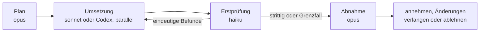

# S4.1 · Das richtige Modell pro Phase

<!-- meta:start -->
> **Regal:** [Modelle & Kosten](README.md#cost) · **Stufe:** Vertiefung · **~15 Min** · **Voraussetzungen:** [S1.7 Modellwahl und Effort](s1-07-modellwahl-und-effort.md) · [S3.4 Orchestrierungsmuster: Fan-out, Pipeline, Hierarchie](s3-04-orchestrierungsmuster.md)
>
> ← [X.3 Der minimale Agent: Pi als Spiegel](x-03-pi-als-spiegel.md) · [Bibliothek](README.md) · [S4.2 Codex-Schwarm und die Datenfluss-Grenze](s4-02-codex-schwarm.md) →
<!-- meta:end -->

## Schnellcheck

- Kannst du ohne Nachschlagen erklären, warum Planung und Abnahme auf das stärkste Modell gehören, die Masse der Umsetzung aber nicht?
- Hast du schon einmal einen Ablauf gebaut, in dem ein günstiges Modell zuerst prüft und nur strittige Punkte an das teure Modell gehen?

## Auf einen Blick

Die Kernfrage ist nicht „Welches Modell ist besser?“, sondern „Welche Phase dieser Aufgabe braucht tiefes Urteil und welche Durchsatz?“. Das Opus-Tier plant und nimmt ab, wo Urteil zählt; die Masse der Umsetzung übernimmt das Sonnet-Tier oder ein zweiter Anbieter wie Codex; den ersten, günstigen Prüfdurchgang macht das Haiku-Tier und gibt Strittiges an Opus weiter.

Code, der an Codex geht, verlässt Anthropic und unterliegt den Regeln von OpenAI. Diese Datenfluss-Grenze behandelt [S4.2](s4-02-codex-schwarm.md).

## Bild im Kopf

Mehr-Modell-Orchestrierung ist der Dienstplan einer Sicherheitsfirma bei einer neuen Türanlage. Der Senior-Architekt schreibt die Leistungsbeschreibung mit den Sicherheitsanforderungen. Die Techniker montieren Leser und verlegen Kabel parallel auf mehreren Etagen. Eine Junior-Streife macht den ersten, günstigen Kontrollgang und meldet Auffälliges. Die Abnahme unterschreibt der Senior-Ingenieur: jede Tür, jeder Leser, jede Kabeltrasse. Niemand lässt den Senior selbst Kabel ziehen, und niemand lässt die Junior-Streife die Anlage abnehmen.



## Im Detail

### Verschiedene Modelle, verschiedene Stärken

| Modell | Stärken | Einsatz |
|---|---|---|
| **Opus-Tier** (`opus`) | Tiefes Reasoning, Architektur, Urteil | Planung, Review, Qualitätsentscheidungen |
| **Sonnet-Tier** (`sonnet`) | Schnell, fähig, gut in den meisten Aufgaben | Allgemeine Umsetzung, Analyse |
| **Haiku-Tier** (`haiku`) | Sehr schnell, günstig, fokussiert | Massenverarbeitung, einfache Lesezugriffe, Brainstorming |
| **Codex** (OpenAI) | Schnelle Codegenerierung, anderes Training | Umsetzung, Zweitmeinung |

Die Grundidee: Codex erzeugt Code schnell und günstig, das Opus-Tier prüft mit hohem Urteilsvermögen. Zusammen schlagen sie jeden der beiden allein.

### Kosten: Größenordnungen statt Preise

Preise stehen im [Kanon](../_canonical.md), die Grundlagen in [S1.19](s1-19-kosten-im-blick.md), die Kostenrechnung der Pipeline in [S4.4](s4-04-ci-zugang-und-kosten.md). Als grobe Orientierung aus den Kanon-Preisen: Pro Token kostet das Opus-Tier etwa das Doppelte des Sonnet-Tiers, das Haiku-Tier etwa die Hälfte des Sonnet-Tiers.

Daraus folgt eine kleine Strategie für eine typische Pipeline Claude → Codex → Claude:

- **Plane mit Opus.** Ein teurer Aufruf kauft eine saubere Spezifikation; ein schlechter Plan kostet dich später in Umsetzung und Review.
- **Setz mit Sonnet um** (oder mit Codex, wenn Tempo wichtiger ist als Determinismus). Hier fließt die Masse der Tokens.
- **Prüf zuerst mit Haiku** und gib Uneinigkeit an Opus weiter. Pro Token kostet ein Review durch das Haiku-Tier etwa ein Viertel desselben Reviews durch das Opus-Tier. Über viele Pull Requests im Monat summiert sich das.

Wie viele Befunde Haiku allein findet, hängt von der Aufgabe ab; eine feste Quote belegt dieser Kurs nicht. Miss sie an deinen eigenen Reviews, bevor du dich darauf verlässt.

### Die Pipeline Claude → Codex → Claude

**Phase 1: Opus plant**

- analysiert die Anforderungen und entwirft die Architektur
- zerlegt die Aufgabe in klare, eindeutige Umsetzungs-Tickets
- schreibt für jedes Ticket eine genaue Spezifikation

**Phase 2: Codex setzt um (schnell, parallel)**

- bekommt die Spezifikationen aus Phase 1
- erzeugt Code, schnell und ohne Zögern
- mehrere Codex-Agenten arbeiten gleichzeitig an verschiedenen Tickets

**Phase 3: Opus prüft**

- liest den gesamten erzeugten Code
- prüft ihn gegen die ursprünglichen Anforderungen
- findet Fehler, Sicherheitsprobleme und Abweichungen von der Spezifikation
- entscheidet: annehmen, Änderungen verlangen oder ablehnen

**Warum das funktioniert:**

- Opus ist teuer, läuft aber nur dort, wo Urteil zählt: bei Plan und Abnahme.
- Codex übernimmt die mechanische Erzeugung: günstig, schnell, parallel.
- Zwei KI-Systeme haben verschiedene blinde Flecken. Was das eine übersieht, fängt das andere.

Die kleine Strategie oben und diese Pipeline passen zusammen: Haiku macht den ersten, günstigen Prüfdurchgang, die Abnahme und alle strittigen Punkte liegen beim Opus-Tier. Wie Claude die Codex-Agenten verteilt, beschreibt [S4.2](s4-02-codex-schwarm.md); das allgemeine Muster „Pipeline“ kennst du aus [S3.4](s3-04-orchestrierungsmuster.md).

### Eingebaut: opusplan

Für die ersten beiden Phasen innerhalb einer Sitzung hat Claude Code ein eigenes Kürzel. Mit dem Modellwert `opusplan` arbeitet Claude im Plan-Modus mit `opus` und wechselt für die Umsetzung automatisch zu `sonnet`. Die Prüfung startest du in einer eigenen Sitzung:

<!-- cockpit:example -->
```text
# Plan und Umsetzung: opus im Plan-Modus, danach automatisch sonnet
claude --model opusplan

# Erste Prüfung, neue Sitzung: das günstige Tier
claude --model haiku

# Strittige Punkte, neue Sitzung: das starke Tier entscheidet
claude --model opus
```

`--model` gilt nur für die gestartete Sitzung und ändert deinen Standard nicht ([S1.7](s1-07-modellwahl-und-effort.md)).

## Typische Fallen

- **Haiku als einziger Prüfer.** Haiku macht die erste, günstige Runde, nicht die Abnahme. Grenzfälle, Architektur-Kompromisse und Sicherheitsfragen gehören zum Opus-Tier.
- **Haiku bekommt zu viel auf einmal.** Haikus Kontextfenster ist kleiner als das der anderen Tiers ([S1.7](s1-07-modellwahl-und-effort.md)). Gib ihm gezielte Diffs oder Dateien, nicht die ganze Codebasis.
- **Plan-Modus mit `opusplan` ist ein Modellwechsel.** Jeder Wechsel zwischen Plan-Modus und Umsetzung schaltet zwischen Opus und Sonnet um, und jedes Modell hat seinen eigenen Cache. Plane in einem Zug und wechsle nicht bei jeder Kleinigkeit hin und her.
- **Sensibler Code an Codex.** Bevor ein Schritt an einen zweiten Anbieter geht, prüf, welche Daten ihn verlassen ([S4.2](s4-02-codex-schwarm.md)).

## Check

Du kannst für eine konkrete Aufgabe, etwa einen Refactor des Wiegand-Frame-Parsers, die drei Phasen den passenden Modellen zuordnen und die Wahl mit Kosten und Urteilsbedarf begründen.

1. Warum gehören Planung und Abnahme auf das Opus-Tier, die Masse der Umsetzung aber nicht?
2. Was macht Haiku im Review, und wann geht ein Befund an Opus?
3. Was macht der Modellwert `opusplan`, und welche Phase deckt er nicht ab?

<details><summary>Quizfrage</summary>

**Frage:** In deiner Pipeline macht `haiku` die erste Review-Runde über den Code der Umsetzungsphase. Wann gibst du einen Befund an `opus` weiter?

- **Richtig:** Wenn er strittig ist oder Urteil braucht, etwa bei einem Architektur-Kompromiss oder einem Sicherheits-Grenzfall.
- Falsch: Immer, weil Haiku im Review nur Tippfehler und Formatierung erkennen kann und sonst gar nichts meldet.
- Falsch: Nie, weil Codex seinen Code vor der Rückgabe selbst prüft und eine zweite Instanz daher überflüssig ist.
- Falsch: Bei allen Sicherheitsbefunden, weil Haiku Sicherheitsprüfungen aus Kostengründen grundsätzlich gar nicht erst durchführt.

</details>

## Weiterlesen

- [Modellkonfiguration, darin `opusplan`](https://code.claude.com/docs/en/model-config)
- [Prompt-Caching: Modellwechsel](https://code.claude.com/docs/en/prompt-caching)
- [S4.2 · Codex-Schwarm und die Datenfluss-Grenze](s4-02-codex-schwarm.md)
- [S1.7 · Modellwahl und Effort](s1-07-modellwahl-und-effort.md)
- [S1.19 · Kosten im Blick: /cost, /usage und Budgetgrenzen](s1-19-kosten-im-blick.md)
- [S3.4 · Orchestrierungsmuster: Fan-out, Pipeline, Hierarchie](s3-04-orchestrierungsmuster.md)
- [S4.4 · CI-Zugangsdaten, Kostengrenzen und Kosten-Feinschliff](s4-04-ci-zugang-und-kosten.md)
