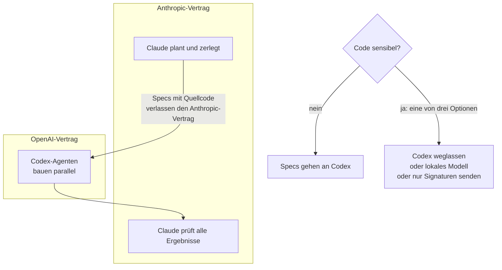

# S4.2 · Codex-Schwarm und die Datenfluss-Grenze

<!-- meta:start -->
> **Regal:** [Agenten & Orchestrierung](README.md#agents) · **Stufe:** Kür · **~25 Min** · **Voraussetzungen:** [S4.1 Das richtige Modell pro Phase](s4-01-modell-pro-phase.md) · [S3.11 Datenschutz, Aufbewahrung und regulierte Branchen](s3-11-datenschutz-und-compliance.md)
>
> ← [S4.1 Das richtige Modell pro Phase](s4-01-modell-pro-phase.md) · [Bibliothek](README.md) · [S4.3 Headless: claude -p als Pipeline-Stufe](s4-03-headless.md) →
<!-- meta:end -->

## Schnellcheck

- Kannst du ohne Nachschlagen sagen, welche Teile deines Codes in einer Claude-Codex-Pipeline an OpenAI gehen und warum die Aufbewahrungsregeln von Anthropic dafür nicht gelten?
- Kannst du aus dem Kopf drei Arten von Dateien in deinem Projekt nennen, die nie an einen zweiten Anbieter gehen sollten?

## Auf einen Blick

Ein Codex-Schwarm schickt deinen Quellcode zusätzlich an OpenAI: Was Claude liest, geht an Anthropic, und was in den Aufträgen für Codex steht, geht an OpenAI. Die Datenregeln von Anthropic decken nur die Claude-Seite der Pipeline ab; für den Codex-Teil gelten die Aufbewahrungs- und Trainingsregeln deines OpenAI-Vertrags. Für sensiblen Code hast du drei Auswege: den Codex-Schritt weglassen, ein lokales Modell einsetzen oder Codex nur Signaturen, also das Gerüst ohne Inhalt, zeigen. Dasselbe gilt für jeden zweiten Anbieter, den du an Claude Code anbindest, nicht nur für Codex.

Technisch zerlegt Claude die Aufgabe in unabhängige Teilaufgaben, mehrere Codex-Agenten bauen sie parallel, und Claude prüft das Ergebnis. Der Schwarm kommt aus einem eigenen Plugin (`multi-model-orchestrator`), nicht aus Claude Code selbst.

## Bild im Kopf

Der Codex-Schwarm ist ein externes Montageteam. Der Generalunternehmer (Claude) plant und nimmt ab, der Subunternehmer (Codex bei OpenAI) montiert parallel auf mehreren Etagen. Das geht schnell, aber der Subunternehmer ist ein anderer Anbieter und sieht alles, was im Montageplan steht. Stehen dort vertrauliche Details des Sicherheitskonzepts, etwa die Alarmzonen, die Berechtigungsmatrix oder die toten Winkel der Kameras, hast du ein Datenschutzproblem. Die Lösung: Der Subunternehmer bekommt nur den Kabelplan, nicht das Sicherheitskonzept.



## Im Detail

### Datenfluss: was geht wohin?

> **Wichtig für sicherheitssensible Teams:** Ein Codex-Schwarm schickt deinen Quellcode zusätzlich an **OpenAI**, nicht nur an Anthropic. Die Datenregeln von Anthropic (Aufbewahrung und Training, siehe [S3.11](s3-11-datenschutz-und-compliance.md)) gelten nur für die Claude-Seite der Pipeline. OpenAI hat eigene Aufbewahrungs- und Trainingsregeln, festgelegt in deinem Vertrag für OpenAI Codex.

Ist deine Codebasis sensibel (personenbezogene Kundendaten, proprietäre Firmware, vertraglich zugesicherte Exklusivität), hast du drei Möglichkeiten:

1. **Codex-Schritt weglassen:** `sonnet` übernimmt die Umsetzung. Die Kosten steigen etwas, die Daten bleiben im Vertrag mit Anthropic.
2. **Ein lokales Modell im Codex-Slot:** ein Modell, das auf deiner eigenen Hardware läuft, etwa über Ollama oder vLLM. Gleiche Rolle, kein Dritter. Wie du es anbindest, hängt vom Werkzeug ab und steht hier nicht.
3. **Nur Signaturen senden:** Der Anbieter sieht das Gerüst, also Namen, Parameter und Rückgabetypen, aber keine Funktionskörper. Auch Namen können Fachlogik verraten; ein Bezeichner wie `override_for_vip_after_hours` sagt mehr als sein Typ. Neutralisier solche Namen vorher. Soll der Anbieter Logik selbst ändern, reicht das Gerüst nicht: Dann bleibt nur Option 1 oder 2.

Die Orchestrierungsmuster dahinter hängen an keinem Modell: Dieselbe Pipeline aus Planen, Umsetzen und Prüfen funktioniert mit jedem Anbieterpaar. Welche Phase welches Modell bekommt, steht in [S4.1](s4-01-modell-pro-phase.md); die Muster selbst in [S3.4](s3-04-orchestrierungsmuster.md).

### Der Codex-Schwarm

> **🔧 Eigene Komponente:** `multi-model-orchestrator` ist ein eigenes Plugin, kein Teil von Claude Code.

<!-- cockpit:example -->
```
/multi-model-orchestrator:codex-swarm --decompose "Build a Python CLI with scan, check, report commands"
```

Mit `--decompose` passiert Folgendes: Claude zerlegt die Aufgabe in N unabhängige Teilaufgaben, N Codex-Agenten starten parallel, und Claude prüft alle Ergebnisse zusammen und sucht Integrationsfehler. Die Gesamtdauer ist die des langsamsten Agenten, nicht die Summe. Das lohnt sich bei großen, gut spezifizierten und mechanischen Umsetzungsaufgaben, die sich parallelisieren lassen, wenn du eine zweite Meinung von einem anderen Modell willst und Tempo mehr zählt als die Kosten pro Token. Die Übung unten kommt ohne Plugin und ohne OpenAI-Konto aus.

## Selbst machen

### Übung: die Dateien eines Projekts für einen zweiten Anbieter sortieren (etwa 15 Minuten)

**Ziel:** Du teilst die Dateien eines kleinen Projekts in „darf raus“, „darf nicht raus“ und „nur Signatur“ ein und entscheidest für eine Datei zwischen den drei Optionen des Kapitels.

**Startzustand:** Papier oder eine Notiz. Du brauchst weder Codex noch ein OpenAI-Konto noch ein Plugin. Das Beispielprojekt `zugangsportal` ist ein kleiner Webdienst für Zutrittskontrolle. Dein Team will einen zweiten Anbieter für zwei Aufgaben einsetzen: (a) Tests für `format_utils.py` schreiben, (b) in `api.py` einen neuen Endpunkt `GET /doors/<id>/status` ergänzen, der die vorhandene Funktion `door_status(door_id)` aus `access_rules.py` aufruft. Nimm die Beschreibungen, wie sie sind, als Tatsachen.

| Nr. | Datei | Beschreibung |
|---|---|---|
| 1 | `README.md` | Projektbeschreibung, liegt öffentlich auf GitHub |
| 2 | `docs/protocol-notes.md` | Notizen zum proprietären Protokoll eines Kartenlesers, vom Hersteller unter Vertraulichkeitsvereinbarung geliefert |
| 3 | `src/format_utils.py` | Hilfsfunktionen für Datum und Uhrzeit, ohne Projektbezug |
| 4 | `src/access_rules.py` | die Zugriffslogik: wer wann welche Tür öffnen darf, samt Ausnahmen für Sonderfälle einzelner Kunden |
| 5 | `src/crypto_keys.py` | lädt Schlüssel aus der Umgebung und enthält fest eingetragene Testschlüssel für die Entwicklung |
| 6 | `tests/test_format_utils.py` | vorhandene Tests zu `format_utils.py` |
| 7 | `tests/fixtures/customers.csv` | Export echter Kundendaten mit Namen und Kartennummern |
| 8 | `src/api.py` | HTTP-Endpunkte: Routen, Parameter, Rückgabeformate; die Funktionskörper rufen nur `access_rules.py` auf |
| 9 | `config/settings.example.toml` | Beispielkonfiguration ohne Geheimnisse |
| 10 | `scripts/deploy.sh` | Deployment-Skript mit internem Hostnamen und Benutzernamen |

1. Schreib für jede Datei eine der drei Zuordnungen und ein Stichwort als Grund: **darf raus** (nichts Vertrauliches), **darf nicht raus** (Geheimnis, personenbezogene Daten, vertrauliche Fremdinformation oder Geschäftslogik) oder **nur Signatur** (der Anbieter braucht die Form, nicht den Inhalt). Berücksichtige beide Aufgaben (a) und (b).
2. **Entscheide.** Das Team will zusätzlich, dass der zweite Anbieter eine Änderung innerhalb von `access_rules.py` selbst umsetzt (ein neuer Sonderfall bei den Zutrittszeiten). Wähl eine der drei Optionen aus „Datenfluss“ und begründe in zwei Sätzen: Was verlässt dein Haus, und was kostet dich die Wahl?

<details><summary>Vergleich</summary>

Für die Zuordnung gilt unter den Annahmen der Beschreibungen:

| Nr. | Zuordnung | Grund |
|---|---|---|
| 1 | darf raus | öffentlich |
| 2 | darf nicht raus | vertrauliche Fremdinformation, und für die Aufgaben nicht nötig |
| 3 | darf raus | ohne Projektbezug, gebraucht für (a) |
| 4 | nur Signatur | Geschäftslogik; für (b) genügt, was `door_status(door_id)` annimmt und zurückgibt |
| 5 | darf nicht raus | fest eingetragene Schlüssel; auch Testschlüssel gehören nicht zu einem Dritten |
| 6 | darf raus | zu (a) gehörig, ohne Vertrauliches |
| 7 | darf nicht raus | personenbezogene Daten |
| 8 | darf raus | wird für (b) geändert und enthält nach der Beschreibung nichts Vertrauliches |
| 9 | darf raus | Beispielwerte ohne Geheimnisse |
| 10 | darf nicht raus | interne Namen, für die Aufgaben nicht nötig |

Zur Entscheidung in Schritt 2: „Nur Signaturen senden“ reicht nicht, wenn der Anbieter die Logik selbst ändern soll, denn er bräuchte den Inhalt. Die naheliegende Wahl ist Option 1, den Codex-Schritt für diese Datei wegzulassen und mit `sonnet` umzusetzen: Es verlässt nichts den Vertrag mit Anthropic, und du zahlst etwas mehr. Option 2 ist möglich, wenn du ein lokales Modell hast. Andere Zuordnungen sind vertretbar, wenn du sie mit den Beschreibungen begründest, etwa eine strengere Einstufung von `api.py`.

</details>

**Geschafft, wenn:**

- [ ] du alle zehn Dateien mit einem Grund zugeordnet hast und die Zuordnung mit dem Vergleich abgleichen konntest
- [ ] du für die Änderung in `access_rules.py` eine Option gewählt und mit „was verlässt das Haus, was kostet es“ begründet hast
- [ ] du nach der Übung deine Antwort auf den Schnellcheck („drei Arten von Dateien“) für dein eigenes Projekt geändert oder bestätigt hast

## Typische Fallen

- **Die Regeln von Anthropic gelten für das ganze Projekt.** Sie gelten nur für die Claude-Seite. Alles, was an einen zweiten Anbieter geht, fällt unter dessen Regeln.
- **Testschlüssel und Beispieldaten gelten als harmlos.** Fest eingetragene Schlüssel und echte Datensätze in Testdaten verlassen mit dem Code dein Haus.
- **Umbenennen gilt als Anonymisieren.** Neutrale Namen entschärfen Bezeichner, aber ein Gerüst mit vielen Details verrät trotzdem die Struktur der Logik.
- **Option 3 für Aufgaben, die Logik ändern.** Wer nur das Gerüst sieht, kann keine Logik ändern. Dann bleibt der Codex-Schritt weg.
- **Ein Schwarm ohne Prüfung der Daten.** Prüf vor dem ersten Einsatz, welche Dateien in den Specs landen, nicht erst danach.

## Check

Du kannst die Datenfluss-Grenze im Codex-Schwarm erklären, Dateien eines Projekts einteilen und für sensiblen Code eine der drei Optionen begründen.

1. Welche Regeln gelten für den Code, den der Codex-Teil der Pipeline sieht, und welche nicht?
2. Nenne die drei Auswege für sensiblen Code und je einen Preis, den du dafür zahlst.
3. Der zweite Anbieter soll eine Änderung innerhalb einer vertraulichen Datei umsetzen. Warum hilft „nur Signaturen“ nicht, und was wählst du stattdessen?

<details><summary>Auflösung</summary>

1. Für den Codex-Teil gelten die Aufbewahrungs- und Trainingsregeln deines OpenAI-Vertrags; die Datenregeln von Anthropic gelten nur für die Claude-Seite der Pipeline.
2. Codex weglassen: `sonnet` setzt um, die Kosten steigen etwas. Lokales Modell: kein Dritter, aber du brauchst eigene Hardware und eine Anbindung. Nur Signaturen: das Gerüst ohne Inhalt, aber der Anbieter kann keine Logik ändern, und Namen können Fachlogik verraten.
3. Der Anbieter bräuchte den Inhalt der Datei, ein Gerüst zeigt ihn nicht. Du lässt den Codex-Schritt für diese Datei weg oder nimmst ein lokales Modell.

</details>

<details><summary>Quizfrage</summary>

**Frage:** Ein zweiter Anbieter soll in `api.py` einen neuen Endpunkt bauen. `api.py` ruft Funktionen aus `access_rules.py` auf, die vertrauliche Zugriffslogik enthält. Was gibst du ihm von `access_rules.py`?

- **Richtig:** Nur die Signaturen der Funktionen, die `api.py` aufruft: Namen, Parameter, Rückgabetypen, ohne Funktionskörper.
  - Warum: Für den Endpunkt zählt die Form der Aufrufe, nicht der Inhalt: Namen, Parameter, Rückgabetypen. Die vertrauliche Logik steckt in den Funktionskörpern, und die bleiben bei dir.
- Falsch: Die ganze Datei, denn der Vertrag mit Anthropic deckt auch den Code ab, den ein zweiter Anbieter im Auftrag von Claude bekommt.
  - Warum: Code für einen zweiten Anbieter verlässt den Anthropic-Vertrag: Dessen Datenregeln gelten nur für die Claude-Seite. Beim Codex-Schwarm greifen die Regeln deines OpenAI-Vertrags.
- Falsch: Nichts außer der Aufgabenbeschreibung, denn der Anbieter errät die Schnittstelle der Funktionen zuverlässig aus ihren Namen.
  - Warum: Namen allein reichen nicht: Der Anbieter braucht die Form, also auch Parameter und Rückgabetypen. Das Gerüst liefert sie, ohne Funktionskörper zu zeigen.
- Falsch: Die ganze Datei mit umbenannten Variablen, denn Umbenennen macht die Zugriffslogik für Außenstehende unkenntlich und damit unbedenklich.
  - Warum: Umbenennen gilt nicht als Anonymisieren: Neutrale Namen entschärfen nur Bezeichner. Schon ein Gerüst mit vielen Details verrät die Struktur der Logik, eine ganze Datei erst recht.

</details>

## Weiterlesen

- [Datennutzung bei Claude Code](https://code.claude.com/docs/en/data-usage)
- [Plugins in Claude Code](https://code.claude.com/docs/en/plugins)
- [S4.1 · Das richtige Modell pro Phase](s4-01-modell-pro-phase.md)
- [S3.4 · Orchestrierungsmuster: Fan-out, Pipeline, Hierarchie](s3-04-orchestrierungsmuster.md)
- [S3.11 · Datenschutz, Aufbewahrung und regulierte Branchen](s3-11-datenschutz-und-compliance.md)
