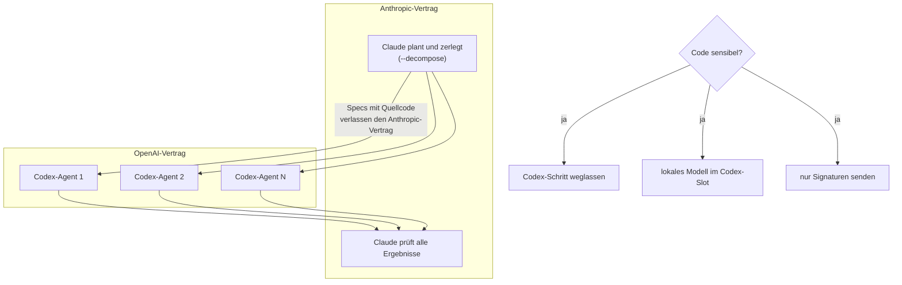

# S4.2 · Codex-Schwarm und die Datenfluss-Grenze

<!-- meta:start -->
> **Regal:** [Agenten & Orchestrierung](README.md#agents) · **Stufe:** Kür · **~15 Min** · **Voraussetzungen:** [S4.1 Das richtige Modell pro Phase](s4-01-modell-pro-phase.md)
>
> ← [S4.1 Das richtige Modell pro Phase](s4-01-modell-pro-phase.md) · [Bibliothek](README.md) · [S4.3 Headless: claude -p als Pipeline-Stufe](s4-03-headless.md) →
<!-- meta:end -->

## Schnellcheck

- Kannst du ohne Nachschlagen sagen, welche Teile deines Codes in einer Claude-Codex-Pipeline an OpenAI gehen und warum die Aufbewahrungsregeln von Anthropic dafür nicht gelten?
- Hast du schon einmal eine Aufgabe mit `--decompose` in parallele Teilaufgaben zerlegen lassen und das Ergebnis im Review auf Integrationsfehler geprüft?

## Auf einen Blick

Ein Codex-Schwarm schickt deinen Quellcode an OpenAI, nicht an Anthropic. Die Datenregeln von Anthropic decken nur die Claude-Seite der Pipeline ab; für den Codex-Teil gelten die Aufbewahrungs- und Trainingsregeln deines OpenAI-Vertrags. Für sensiblen Code hast du drei Auswege: den Codex-Schritt weglassen, ein lokales Modell einsetzen oder Codex nur Signaturen ohne Geschäftslogik zeigen.

Technisch zerlegt Claude die Aufgabe in unabhängige Teilaufgaben, mehrere Codex-Agenten bauen sie parallel, und Claude prüft das Ergebnis. Der Schwarm kommt aus einem eigenen Plugin (`multi-model-orchestrator`), nicht aus Claude Code selbst.

## Bild im Kopf

Der Codex-Schwarm ist ein externes Montageteam. Der Generalunternehmer (Claude) plant und nimmt ab, der Subunternehmer (Codex bei OpenAI) montiert parallel auf mehreren Etagen. Das geht schnell, aber der Subunternehmer ist ein anderer Anbieter und sieht alles, was im Montageplan steht. Stehen dort vertrauliche Details des Sicherheitskonzepts, etwa die Alarmzonen, die Berechtigungsmatrix oder die toten Winkel der Kameras, hast du ein Datenschutzproblem. Die Lösung: Der Subunternehmer bekommt nur den Kabelplan, nicht das Sicherheitskonzept.



## Im Detail

### Datenfluss: was geht wohin?

> **Wichtig für sicherheitssensible Teams:** Ein Codex-Schwarm schickt deinen Quellcode an **OpenAI**, nicht an Anthropic. Die Datenregeln von Anthropic (Aufbewahrung und Training, siehe [S3.11](s3-11-datenschutz-und-compliance.md)) gelten nur für die Claude-Seite der Pipeline. OpenAI hat eigene Aufbewahrungs- und Trainingsregeln, festgelegt in deinem Vertrag für OpenAI Codex.

Ist deine Codebasis sensibel (personenbezogene Kundendaten, proprietäre Firmware, vertraglich zugesicherte Exklusivität), hast du drei Möglichkeiten:

1. **Codex-Schritt weglassen:** Sonnet übernimmt die Umsetzung. Die Kosten steigen etwas, die Daten bleiben im Vertrag mit Anthropic.
2. **Ein lokales Modell im Codex-Slot:** Ollama oder vLLM mit einer Code-Llama-Variante. Gleiche Rolle, kein Dritter.
3. **Sensible Teile vorher entfernen:** Formuliere den Auftrag so um, dass Codex nur Signaturen als Gerüst sieht, keine Bezeichner und keine Geschäftslogik.

Die Orchestrierungsmuster dahinter hängen an keinem Modell: Dieselbe Pipeline aus Planen, Umsetzen und Prüfen funktioniert mit jedem Anbieterpaar. Welche Phase welches Modell bekommt und warum, steht in [S4.1](s4-01-modell-pro-phase.md); die Muster selbst in [S3.4](s3-04-orchestrierungsmuster.md).

### Der Codex-Schwarm

> **🔧 Eigene Komponente:** `multi-model-orchestrator` ist ein eigenes Plugin, kein Teil von Claude Code.

<!-- cockpit:example -->
```
/multi-model-orchestrator:codex-swarm --decompose "Build a Python CLI with scan, check, report commands"
```

Mit `--decompose` passiert Folgendes:

1. Claude analysiert die Aufgabe und zerlegt sie in N unabhängige Teilaufgaben.
2. N Codex-Agenten starten parallel, einer pro Teilaufgabe.
3. Alle arbeiten gleichzeitig. Die Gesamtdauer ist die des langsamsten Agenten, nicht die Summe.
4. Claude prüft alle Ergebnisse zusammen und findet Integrationsfehler.

**Wann sich ein Codex-Schwarm lohnt:**

- große Umsetzungsaufgaben, die sich parallelisieren lassen
- du willst eine zweite Meinung von einem anderen KI-Modell
- Tempo zählt mehr als die Kosten pro Token
- die Aufgaben sind gut spezifiziert und mechanisch

### Praxisbeispiel: ein Security-CLI

Aufgabe: „Bau ein Python-Security-CLI mit drei Befehlen:

- `scan` listet die offenen Ports eines Hosts
- `check` prüft, ob eine URL mit HTTP 200 antwortet
- `report` erzeugt einen Sicherheitsbericht als JSON"

Mit `--decompose` könnte Claude so zerlegen:

1. Agent 1: CLI-Gerüst und `scan` (Port-Abfrage über Sockets)
2. Agent 2: `check` (HTTP-Anfrage, Timeout-Behandlung, Statusprüfung)
3. Agent 3: `report` (JSON-Ausgabe, fasst die Ergebnisse zusammen)
4. Agent 4: Testsuite für alle drei Befehle

Alle vier Codex-Agenten laufen gleichzeitig. Claude prüft das zusammengesetzte Ergebnis.

## Selbst machen

### Übung: einen Codex-Schwarm auswerten (etwa 15 Minuten)

**Ziel:** Die Multi-Modell-Pipeline verstehen und entscheiden, wann du sie einsetzt.

**Format:** Grundlage ist der Ablauf des Codex-Schwarms aus der Moderationsschicht ([Vorführen: S4.2](../moderation/vorfuehren/s4-02-codex-schwarm.md)): live gesehen, als Aufzeichnung oder selbst ausgeführt. Danach besprecht ihr die Fragen in Gruppen zu zweit oder zu dritt; allein beantwortest du sie schriftlich.

1. **Qualität der Zerlegung:** Wie gut hat Claude die Aufgabe in unabhängige Teilaufgaben zerlegt? Waren die Grenzen sauber? Hättest du anders zerlegt?
2. **Codex und Claude im Vergleich:** Passt das, was Codex erzeugt hat, zu dem, was Claude geschrieben hätte? Wo liegen die Unterschiede? Fühlt sich der Code von Codex anders an?
3. **Wirkung des Reviews:** Was hat der Prüfschritt von Claude gefunden? Siehst du im erzeugten Code weitere Probleme?
4. **Dein Einsatzfall:** Wo in deiner Arbeit würdest du einen Codex-Schwarm einsetzen? Welche Aufgabe profitiert vom Modell Architekt, Monteur, Prüfer? Und darf der Code dafür überhaupt an OpenAI gehen (Abschnitt „Datenfluss")?
5. **Kosten und Tempo:** Diese Pipeline nutzt das Opus-Tier für Planung und Prüfung und Codex für die Umsetzung. Wann lohnen sich die Kosten? Wann würdest du einfach direkt Claude nehmen?

**Zurückmelden:** Jede Gruppe teilt ihre interessanteste Antwort, insgesamt 5 Minuten.

## Check

Du kannst die Datenfluss-Grenze im Codex-Schwarm erklären, die drei Optionen für sensiblen Code nennen und begründen, ob euer Firmware-Code an Codex gehen darf.

1. Welche Regeln gelten für den Code, den der Codex-Teil der Pipeline sieht, und welche nicht?
2. Nenne die drei Auswege für sensiblen Code.
3. Warum ist die Gesamtdauer eines Schwarms die des langsamsten Agenten und nicht die Summe?

<details><summary>Quizfrage</summary>

**Frage:** Ein Softwarehaus für Zutrittskontrolle will einen Codex-Schwarm für seinen OSDP-Firmware-Analyzer einsetzen. Was ist vor dem ersten Einsatz die wichtigste Compliance-Frage?

- **Richtig:** Ob der Firmware-Code an OpenAI gehen darf: Dort gelten OpenAIs Aufbewahrungsregeln, nicht die von Anthropic.
- Falsch: Ob `--decompose` die Protokolllogik sauber zerlegt, denn eine schlechte Zerlegung ist das größte Compliance-Risiko.
- Falsch: Ob `--max-budget-usd` gesetzt ist, weil N parallele Agenten die Kosten vervielfachen und das Budget sprengen.
- Falsch: Ob ein Enterprise-Abo von Claude vorliegt, weil Claude Code die OpenAI-Modelle über seine eigene API lizenziert.

</details>

## Weiterlesen

- [Datennutzung bei Claude Code](https://code.claude.com/docs/en/data-usage)
- [Plugins in Claude Code](https://code.claude.com/docs/en/plugins)
- [S4.1 · Das richtige Modell pro Phase](s4-01-modell-pro-phase.md)
- [S3.4 · Orchestrierungsmuster: Fan-out, Pipeline, Hierarchie](s3-04-orchestrierungsmuster.md)
- [S3.11 · Datenschutz, Aufbewahrung und regulierte Branchen](s3-11-datenschutz-und-compliance.md)
