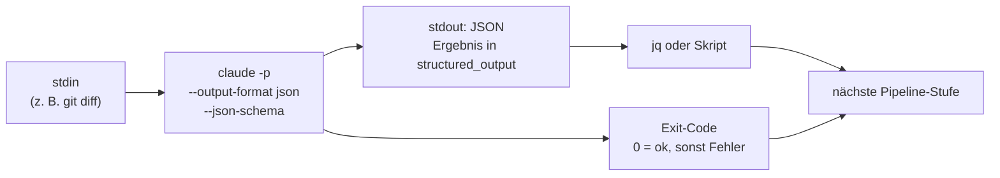

# S4.3 · Headless: claude -p als Pipeline-Stufe

<!-- meta:start -->
> **Regal:** [Headless & CI/CD](README.md#headless-ci) · **Stufe:** Vertiefung · **~15 Min** · **Voraussetzungen:** [S1.13 Vager und präziser Auftrag im Vergleich](s1-13-vager-und-praeziser-auftrag.md)
>
> ← [S4.2 Codex-Schwarm und die Datenfluss-Grenze](s4-02-codex-schwarm.md) · [Bibliothek](README.md) · [S4.4 CI-Zugangsdaten, Kostengrenzen und Kosten-Feinschliff](s4-04-ci-zugang-und-kosten.md) →
<!-- meta:end -->

## Schnellcheck

- Hast du schon einmal `claude -p` mit `--output-format json` und `--json-schema` in ein Skript eingebaut und das Ergebnis mit `jq` weiterverarbeitet?
- Kannst du ohne Nachschlagen erklären, warum jeder Headless-Aufruf frisch ohne Transkript startet und warum das für CI ein Vorteil ist?

## Auf einen Blick

`claude -p "<prompt>"` macht aus Claude einen einmaligen Befehl: Eingabe über stdin oder den Prompt, Ausgabe auf stdout, Exit-Code 0 bei Erfolg und ungleich 0 bei einem Fehler. Jeder Aufruf startet frisch, ohne das Transkript einer interaktiven Sitzung. Mit `--output-format json` und `--json-schema` erzwingst du eine maschinenlesbare Antwort; das schema-konforme Ergebnis steht im Feld `structured_output`, und ein nachgelagertes Skript kann es sicher parsen.

Ohne weitere Flags lädt `claude -p` dieselbe Umgebung wie eine interaktive Sitzung, auch Hooks und MCP-Server des Arbeitsordners. Für CI brauchst du deshalb `--bare` und passende Zugangsdaten: [S4.4](s4-04-ci-zugang-und-kosten.md).

## Bild im Kopf

CI/CD ist die automatische Nachtrunde des Wachdienstes: kein Gespräch, eine feste Checkliste, eine Route mit festem Budget und am Ende ein Bericht über Auffälligkeiten. Die Streife am Tag reagiert auf das, was sie sieht, und trifft Einzelentscheidungen; die Nachtrunde läuft nach Plan. Beide gehören in dieselbe Leitstelle. Claude Code ist genauso beides: ein interaktiver Partner und ein Werkzeug, das ein Skript aufruft.

Die strukturierte Ausgabe ist das Streifenformular auf dem Klemmbrett statt einer frei erzählten Geschichte. Das Formular erzwingt immer dieselben Felder, etwa Vorfallsart, Schwere und Ort, damit die Leitstelle die Berichte aller Streifen zusammenführen kann.



## Im Detail

### Headless: `claude -p`

`claude -p "<prompt>"` startet Claude als **einmaligen Befehl**, nicht als interaktive Schleife. Die Standardausgabe ist Text auf stdout; bei Erfolg ist der Exit-Code 0, bei einem Fehler ungleich 0.

```bash
claude -p "Review this diff and suggest improvements" < diff.patch
```

Typische Einsätze:

- **Pre-Commit-Prüfer:** Der gestagte Diff geht hinein, der Commit scheitert, wenn Claude Probleme findet (gebaut in [S4.5](s4-05-ci-pipelines.md)).
- **PR-Beschreibung:** Claude bekommt den Diff des Branches und schreibt den Text des Pull Requests.
- **Nächtlicher Prüfbericht:** Ein Cron-Job schreibt eine Markdown-Zusammenfassung der Änderungen des Tages.

Der Headless-Modus lädt kein interaktives Transkript: Jeder Aufruf startet frisch. Das ist gewollt, denn CI-Läufe müssen reproduzierbar sein. Eine frühere Unterhaltung setzt `-p` nur fort, wenn du es ausdrücklich mit `--continue` oder `--resume` verlangst.

### Strukturierte Ausgabe: `--output-format json` und `--json-schema`

Eine Pipeline, die frei formulierte Prosa parst, ist zerbrechlich. Das richtige Muster ist, Claudes Ausgabe durch ein Schema zu zwingen:

<!-- cockpit:example -->
```bash
claude -p "Categorize this issue" \
  --output-format json \
  --json-schema '{
    "type":"object",
    "properties":{
      "category":{"type":"string","enum":["bug","feature","docs"]},
      "severity":{"type":"integer","minimum":1,"maximum":5}
    }
  }'
```

Die Ausgabe ist ein JSON-Objekt mit Metadaten zum Lauf (etwa `session_id` und `usage`). Das Ergebnis, das zum Schema passt, steht im Feld `structured_output`; dein nachgelagertes Skript in `jq`, Python oder Node liest es von dort. Ohne Schema steht die Textantwort im Feld `result`. Ist das Schema selbst ungültig, bricht `claude` mit einem Fehler ab, statt still Prosa zu liefern.

`--output-format` kennt außerdem `text` (Standard) und `stream-json` (JSON-Ereignisse, eines pro Zeile, nützlich zum Mitlesen während des Laufs). Wie du ein Pipeline-Skript auf den Exit-Code reagieren lässt, zeigt [S4.5](s4-05-ci-pipelines.md).

### Was `-p` sonst noch lädt

Ohne weitere Flags lädt `claude -p` denselben Kontext wie eine interaktive Sitzung, also auch alles, was im Arbeitsordner oder in `~/.claude` eingerichtet ist. Für CI setzt du deshalb meist `--bare`. Warum das auch eine Sicherheitsfrage ist und warum `--bare` andere Zugangsdaten braucht, steht in [S4.4](s4-04-ci-zugang-und-kosten.md).

## Vorführen

### Demo: Headless Claude in fünf Minuten

**Ziel:** Zeigen, dass derselbe Claude, mit dem du bisher interaktiv gearbeitet hast, auch als einmaliges Kommandozeilen-Werkzeug läuft: mit JSON-Ausgabe, Kostengrenze und `--bare`. Fünf Minuten, vier Flags, ein Umdenken.

Die Demo verteilt sich auf drei Kapitel: Schritt 1 steht in [S3.1](s3-01-was-ist-ein-agent.md), weil er dort als garantierter Live-Einstieg dient; Schritt 2 steht hier; die Schritte 3 und 4 (Kostengrenze, `--bare`) stehen in [S4.4](s4-04-ci-zugang-und-kosten.md).

**Voraussetzung**

- `claude` ist auf dem Rechner der moderierenden Person installiert und angemeldet.
- Eine kleine Datei als Eingabe. `workshop-playground/access_control.py` passt gut.
- Ein Terminal, in dem das Publikum den Befehl und seinen Exit-Code sieht.

**Schritt 1: ein Prompt, eine Antwort**

`claude -p "Summarize what this repo does in one sentence."`, Ablauf und Sprechpunkte in [S3.1](s3-01-was-ist-ein-agent.md).

**Schritt 2: strukturierte Ausgabe mit Schema**

```bash
claude -p "Categorize this file" \
  --output-format json \
  --json-schema '{"type":"object","properties":{"category":{"type":"string"},"language":{"type":"string"}}}' \
  < workshop-playground/access_control.py
```

Wenn die Ausgabe erscheint, leite sie live durch `jq`, um zu zeigen, dass sie wirklich parsebar ist. Das Ergebnis steht im Feld `structured_output`:

```bash
... | jq '.structured_output.category'
```

<details><summary>Für Moderierende</summary>

**Garantierter Anker:** Diese Demo braucht nur das lokal installierte und angemeldete `claude`: kein Plugin, kein Codex, keine Bridge. Eine Netzverbindung zur Claude-API braucht sie wie jeder Aufruf. Schritt 1 dient zugleich als 60-Sekunden-Einstieg in Session 3 (siehe [S3.1](s3-01-was-ist-ein-agent.md)). Wenn alles andere brennt, läuft diese Demo trotzdem.

**Sagen:**

- Schritt 2: „Darauf kann sich eine CI-Pipeline verlassen. Frei formulierte Prosa bricht Parser, ein Schema nicht."
- Zum Abschluss der ganzen Demo, nach Schritt 4 in [S4.4](s4-04-ci-zugang-und-kosten.md): „Wir haben Claude Code gerade in ein Unix-Werkzeug verwandelt. Es nimmt stdin, liefert stdout, gibt einen Exit-Code zurück, beachtet Flags und bleibt im Budget. Das ist die Eintrittskarte in jedes CI-System: GitHub Actions, GitLab, Jenkins, dein eigener Cron. Der interaktive Claude ist die eine Hälfte des Produkts. Das hier ist die andere."

**Wenn `jq` `null` ausgibt:** Du hast das Feld auf oberster Ebene abgefragt (`.category`). Das Schema-Ergebnis liegt eine Ebene tiefer in `structured_output`.

</details>

## Typische Fallen

- **`jq '.category'` liefert `null`.** Mit `--output-format json` ist die Ausgabe ein Umschlag mit Metadaten. Das Schema-Ergebnis steht in `.structured_output`, der reine Text ohne Schema in `.result`.
- **Der Job im fremden Repo tut mehr als erwartet.** Ohne `--bare` laufen auch bei `-p` die Hooks und MCP-Server aus dem ausgecheckten Projekt. Für CI: `--bare` mit API-Key, siehe [S4.4](s4-04-ci-zugang-und-kosten.md).
- **Ein sehr großer Diff über stdin scheitert.** Über stdin gepipte Eingaben sind auf 10 MB begrenzt; darüber endet `claude` mit einer Fehlermeldung und einem Exit-Code ungleich 0. Schreib große Eingaben in eine Datei und nenne den Pfad im Prompt.

## Check

Du kannst erklären, was `claude -p` in einer Pipeline anders macht als interaktives `claude`, und eine Ausgabe per Schema erzwingen, die ein Skript aus `structured_output` liest.

1. Was gibt `claude -p` bei Erfolg und bei einem Fehler als Exit-Code zurück?
2. In welchem Feld der JSON-Antwort steht das schema-konforme Ergebnis, in welchem die reine Textantwort?
3. Warum ist es für CI ein Vorteil, dass jeder Headless-Aufruf frisch startet?

<details><summary>Quizfrage</summary>

**Frage:** Welches Symptom zeigt an, dass `--bare` in einem CI-Job fehlt, obwohl der Job keine Skills braucht?

- **Richtig:** Der Job startet langsamer und verhält sich je nach Rechner anders, weil Hooks, Skills und MCP-Server mitladen.
- Falsch: Ein Auth-Fehler, weil Claude ohne `--bare` den API-Key ignoriert und nur das Abo-Token aus `claude setup-token` liest.
- Falsch: `--output-format json` wird ignoriert und der Job liefert Prosa, weil ein geladener Skill das Format überschreibt.
- Falsch: Der Job hängt und wartet auf Eingaben, weil erst `--bare` den nicht-interaktiven Modus überhaupt einschaltet.

</details>

## Weiterlesen

- [Claude Code programmatisch ausführen (Headless)](https://code.claude.com/docs/en/headless)
- [CLI-Referenz](https://code.claude.com/docs/en/cli-reference)
- [S4.4 · CI-Zugangsdaten, Kostengrenzen und Kosten-Feinschliff](s4-04-ci-zugang-und-kosten.md)
- [S4.5 · CI-Pipelines bauen mit GitHub Actions und GitLab](s4-05-ci-pipelines.md)
- [S3.1 · Was ist ein Agent? Spezialisierung statt Allrounder](s3-01-was-ist-ein-agent.md)
- [S1.13 · Vager und präziser Auftrag im Vergleich](s1-13-vager-und-praeziser-auftrag.md)
