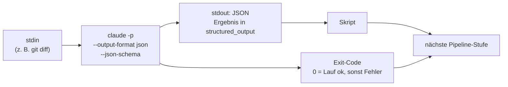

# S4.3 · Headless: claude -p als Pipeline-Stufe

<!-- meta:start -->
> **Regal:** [Headless & CI/CD](README.md#headless-ci) · **Stufe:** Vertiefung · **~25 Min** · **Voraussetzungen:** [S1.13 Vager und präziser Auftrag im Vergleich](s1-13-vager-und-praeziser-auftrag.md)
>
> ← [S4.2 Codex-Schwarm und die Datenfluss-Grenze](s4-02-codex-schwarm.md) · [Bibliothek](README.md) · [S4.4 CI-Zugangsdaten, Kostengrenzen und Kosten-Feinschliff](s4-04-ci-zugang-und-kosten.md) →
<!-- meta:end -->

## Schnellcheck

- Hast du schon einmal `claude -p` mit `--output-format json` und `--json-schema` in ein Skript eingebaut und das Ergebnis weiterverarbeitet?
- Kannst du ohne Nachschlagen sagen, was der Exit-Code eines `claude -p`-Laufs aussagt und was nicht?

## Auf einen Blick

`claude -p "<prompt>"` macht aus Claude einen einmaligen Befehl: Eingabe über stdin oder den Prompt, Ausgabe auf stdout, Exit-Code 0 bei Erfolg und ungleich 0, wenn der Lauf scheitert. Der Exit-Code sagt nur, ob der Lauf durchgekommen ist. Ob Claude etwas gefunden hat, steht in der Ausgabe. Jeder Aufruf startet frisch, ohne das Transkript einer interaktiven Sitzung. Mit `--output-format json` und `--json-schema` erzwingst du eine maschinenlesbare Antwort: Das schema-konforme Ergebnis steht im Feld `structured_output` des JSON-Umschlags.

Ohne weitere Flags lädt `claude -p` dieselbe Umgebung wie eine interaktive Sitzung, auch Hooks und MCP-Server des Arbeitsordners. Für CI brauchst du deshalb `--bare` und passende Zugangsdaten: [S4.4](s4-04-ci-zugang-und-kosten.md).

## Bild im Kopf

CI/CD ist die automatische Nachtrunde des Wachdienstes: kein Gespräch, eine feste Checkliste, eine Route mit festem Budget und am Ende ein Bericht. Die Streife am Tag reagiert auf das, was sie sieht; die Nachtrunde läuft nach Plan. Claude Code ist beides: ein interaktiver Partner und ein Werkzeug, das ein Skript aufruft.

Die strukturierte Ausgabe ist das Streifenformular auf dem Klemmbrett statt einer frei erzählten Geschichte. Das Formular erzwingt immer dieselben Felder, damit die Leitstelle die Berichte aller Streifen zusammenführen kann. Und der Vermerk „Runde beendet“ sagt nur, dass die Streife zurück ist, nicht, dass nichts vorgefallen ist: So verhält sich der Exit-Code.



## Im Detail

### Headless: `claude -p`

`claude -p "<prompt>"` startet Claude als **einmaligen Befehl**, nicht als interaktive Schleife. Die Standardausgabe ist Text auf stdout. Laut Doku endet Claude Code mit Code 0 bei Erfolg und mit einem Code ungleich 0, wenn der Lauf fehlschlägt, damit dein Skript auf den Status reagieren kann. Ein ungültiges Flag meldet Claude Code auf stderr, bevor der Lauf beginnt. Passiert ein Fehler im Lauf, etwa fehlende Anmeldung, steht er als Ergebnis auf stdout.

```bash
claude -p "Review this diff and suggest improvements" < diff.patch
```

Typische Einsätze: ein Pre-Commit-Prüfer, der den gestagten Diff liest ([S4.5](s4-05-ci-pipelines.md)), eine PR-Beschreibung aus dem Diff des Branches, ein nächtlicher Prüfbericht per Cron.

**Exit 0 heißt: Der Lauf ist durchgekommen.** Ob Claude Probleme gefunden hat, entscheidet nicht der Exit-Code, sondern der Text oder das Feld, das dein Skript liest. Wer einen Commit scheitern lassen will, wenn Claude etwas findet, wertet die Ausgabe aus ([S4.5](s4-05-ci-pipelines.md)).

Ein `-p`-Lauf startet frisch. Das ist gewollt, denn CI-Läufe müssen reproduzierbar sein. Eine frühere Unterhaltung setzt `-p` nur fort, wenn du es mit `--continue` oder `--resume <session-id>` verlangst.

### Was ein `-p`-Lauf ohne Rückfrage darf

Niemand beantwortet im Lauf Rückfragen, und ein `-p`-Lauf zeigt laut Doku keinen Vertrauensdialog. Welche Werkzeuge ohne Freigabe laufen, bestimmt der Rechte-Modus ([S1.6](s1-06-rechte-modi.md), [S3.8](s3-08-rechte-fuer-autonomie.md)). Setzt nichts einen Modus, gilt der eingebaute Startmodus, und der kann `auto` sein; deshalb gibst du den gewünschten Modus selbst an. Für gesperrte Läufe nennt die Doku `dontAsk`: Claude Code lehnt jeden Aufruf ab, der sonst nachfragen würde. Was auch in Manual keine Freigabe braucht, läuft weiter, etwa Dateien im Arbeitsordner lesen, und ebenso alles, was `--allowedTools` oder eine Allow-Regel abdeckt. Die Übung unten nutzt `dontAsk` in einem leeren Ordner ohne Allow-Regeln; dort bleibt den Läufen nur das Lesen.

### Strukturierte Ausgabe: `--output-format json` und `--json-schema`

Eine Pipeline, die frei formulierte Prosa parst, ist zerbrechlich. Das Muster ist, Claudes Ausgabe durch ein Schema zu zwingen:

<!-- cockpit:example -->
```bash
claude -p "Categorize this issue" \
  --output-format json \
  --json-schema '{
    "type":"object",
    "properties":{
      "category":{"type":"string","enum":["bug","feature","docs"]},
      "severity":{"type":"integer","minimum":1,"maximum":5}
    },
    "required":["category","severity"]
  }'
```

`--output-format` kennt `text` (Standard), `json` und `stream-json` (JSON-Ereignisse, eines pro Zeile, zum Mitlesen während des Laufs). Mit `json` ist die Ausgabe ein Umschlag mit Metadaten zum Lauf, darunter `session_id` und `total_cost_usd`. Ohne Schema steht die Textantwort im Feld `result`, mit Schema steht das passende Ergebnis in `structured_output`. Ist das Schema selbst ungültig, bricht `claude` mit `Error: --json-schema is not a valid JSON Schema` und der Diagnose des Prüfers ab (so die Doku), statt still Prosa zu liefern.

### Gedeckelt laufen

`--max-turns` begrenzt die Zahl der Arbeitsschritte, `--max-budget-usd` die Ausgaben; beide gelten nur im Print-Modus ([S3.13](s3-13-autonome-loops-absichern.md) hat sie schon gezeigt). Laut Doku endet ein Lauf, der `--max-turns` erreicht, mit einem Fehler. Wie ein Lauf mit erreichter Budgetgrenze endet und welche Grenzen eine Pipeline braucht, steht in [S4.4](s4-04-ci-zugang-und-kosten.md).

### Was `-p` sonst noch lädt

Ohne weitere Flags lädt `claude -p` denselben Kontext wie eine interaktive Sitzung, also auch alles, was im Arbeitsordner oder in `~/.claude` eingerichtet ist. Für CI setzt du deshalb meist `--bare`. Warum das eine Sicherheitsfrage ist und warum `--bare` andere Zugangsdaten braucht, steht in [S4.4](s4-04-ci-zugang-und-kosten.md).

## Selbst machen

### Übung: drei Aufrufe, ein Umschlag, ein Deckel (etwa 15 Minuten)

**Ziel:** Du rufst Claude dreimal headless auf einem winzigen Text auf (Text, JSON, JSON mit Schema), liest jedes Mal den Exit-Code, siehst einen Fehlschlag und einen gedeckelten Lauf.

**Startzustand:** ein neuer Ordner `~/cc-workshop/headless` mit einer Datei `issue.txt`. Nichts läuft danach weiter, und an deiner globalen Konfiguration ändert sich nichts. Alle Befehle tippst du in der Shell; du brauchst keine Claude-Sitzung. Jeder Aufruf kostet etwas Kontingent, deshalb steht überall `--model haiku` und eine Obergrenze für die Züge. `--permission-mode dontAsk` hält die Läufe lesend. Python brauchst du nur für die Datei und die Auswertung in Bash (unter macOS und Linux heißt der Befehl `python3`); `jq` brauchst du nicht.

Bash:

```bash
mkdir -p ~/cc-workshop/headless && cd ~/cc-workshop/headless
python -c "open('issue.txt','w').write('Login button does nothing on Firefox. Console shows: TypeError: handler is undefined.\n')"
```

PowerShell:

```powershell
New-Item -ItemType Directory -Force "$HOME\cc-workshop\headless"; Set-Location "$HOME\cc-workshop\headless"
python -c "open('issue.txt','w').write('Login button does nothing on Firefox. Console shows: TypeError: handler is undefined.\n')"
```

1. **Text über stdin, dann der Exit-Code.** Die Datei geht per Pipe hinein. Bash:

   ```bash
   cat issue.txt | claude -p "Categorize this issue as bug, feature or docs. Answer with one word." --model haiku --max-turns 3 --permission-mode dontAsk
   echo "exit=$?"
   ```

   PowerShell:

   ```powershell
   Get-Content issue.txt | claude -p "Categorize this issue as bug, feature or docs. Answer with one word." --model haiku --max-turns 3 --permission-mode dontAsk
   "exit=$LASTEXITCODE"
   ```

   Erwartet: ein Wort auf stdout (vermutlich `bug`), danach `exit=0`. Es gab keinen Vertrauensdialog, und es kam keine Rückfrage.
2. **Der JSON-Umschlag.** Dieselbe Frage mit `--output-format json`, die Ausgabe in einer Variablen. Bash:

   ```bash
   out=$(cat issue.txt | claude -p "Categorize this issue as bug, feature or docs. Answer with one word." --model haiku --max-turns 3 --permission-mode dontAsk --output-format json)
   echo "exit=$?"
   echo "$out" | python -c "import sys,json; d=json.load(sys.stdin); print(sorted(d)); print(d['result'])"
   ```

   PowerShell:

   ```powershell
   $out = Get-Content issue.txt | claude -p "Categorize this issue as bug, feature or docs. Answer with one word." --model haiku --max-turns 3 --permission-mode dontAsk --output-format json
   "exit=$LASTEXITCODE"
   $json = ($out -join "`n") | ConvertFrom-Json
   $json.PSObject.Properties.Name
   $json.result
   ```

   Erwartet: `exit=0`, eine Liste von Feldnamen, darunter laut Doku `result`, `session_id` und `total_cost_usd`, und darunter die Antwort aus Schritt 1. Merk dir die Namen: Dein Skript muss das richtige Feld wählen.
3. **Mit Schema.** Die Antwort soll aus festen Feldern bestehen. Bash:

   ```bash
   schema='{"type":"object","properties":{"category":{"type":"string","enum":["bug","feature","docs"]},"severity":{"type":"integer","minimum":1,"maximum":5}},"required":["category","severity"]}'
   out=$(cat issue.txt | claude -p "Categorize this issue and rate its severity from 1 to 5." --model haiku --max-turns 5 --permission-mode dontAsk --output-format json --json-schema "$schema")
   echo "exit=$?"
   echo "$out" | python -c "import sys,json; d=json.load(sys.stdin); print(d['structured_output']); print('top level category:', d.get('category'))"
   ```

   PowerShell. Windows PowerShell 5.1 reicht Anführungszeichen in Argumenten nicht unverändert an Programme weiter, PowerShell 7 schon; deshalb die zweite Zeile:

   ```powershell
   $schema = '{"type":"object","properties":{"category":{"type":"string","enum":["bug","feature","docs"]},"severity":{"type":"integer","minimum":1,"maximum":5}},"required":["category","severity"]}'
   if ($PSVersionTable.PSVersion.Major -lt 7) { $schema = $schema.Replace('"','\"') }
   $out = Get-Content issue.txt | claude -p "Categorize this issue and rate its severity from 1 to 5." --model haiku --max-turns 5 --permission-mode dontAsk --output-format json --json-schema $schema
   "exit=$LASTEXITCODE"
   $json = ($out -join "`n") | ConvertFrom-Json
   $json.structured_output
   "top level category: [$($json.category)]"
   ```

   Erwartet: `exit=0`. Unter `structured_output` stehen genau die Felder `category` (eins von `bug`, `feature`, `docs`) und `severity` (eine ganze Zahl von 1 bis 5). Die Abfrage `category` auf oberster Ebene liefert nichts (`None` beziehungsweise `[]`): Das Ergebnis liegt im Umschlag eine Ebene tiefer.
4. **Ein Fehlschlag, der immer fehlschlägt.** Ein Schema, das keins ist:

   ```bash
   claude -p "hello" --json-schema 'not a schema' --model haiku
   echo "exit=$?"
   ```

   In PowerShell: dieselbe erste Zeile, dann `"exit=$LASTEXITCODE"`. Erwartet: eine Fehlermeldung, die mit `Error: --json-schema` beginnt, und ein Exit-Code ungleich 0. Im Probelauf hieß sie `Error: --json-schema is not valid JSON …`, weil der Text nicht einmal JSON ist; für JSON, das kein gültiges Schema ist, nennt die Doku `Error: --json-schema is not a valid JSON Schema` mit der Diagnose des Prüfers. Du hast keine Prosa zurückbekommen: Ein Skript, das auf den Exit-Code achtet, bemerkt den Fehler.
5. **Ein gedeckelter Lauf.** Ein Auftrag, der erst ein Werkzeug braucht (Datei lesen) und dann antworten muss, mit nur einem erlaubten Zug:

   ```bash
   claude -p "Use the Read tool to read issue.txt and quote its first line." --model haiku --max-turns 1 --permission-mode dontAsk
   echo "exit=$?"
   ```

   In PowerShell: dieselbe erste Zeile, dann `"exit=$LASTEXITCODE"`. Erwartet: Der Lauf endet vorzeitig mit einem Fehler, so beschreibt es die Doku für `--max-turns` (im Probelauf `Error: Reached max turns (1)`), und der Exit-Code ist ungleich 0. Der Deckel hat gehalten, bevor die Antwort fertig war. Kommt dein Lauf mit 1 durch, hat Claude den Auftrag in einem Zug geschafft; dann ändere ihn in einen mit mehreren Schritten, etwa „… and then read it again and compare both readings“.

**Aufräumen:** Es läuft nichts weiter. Lösch den Ordner `~/cc-workshop/headless` selbst.

**Geschafft, wenn:**

- [ ] Schritt 1 ein Wort und `exit=0` zeigte
- [ ] du in Schritt 2 die Feldnamen des Umschlags gelesen hast, darunter `result`
- [ ] in Schritt 3 `category` unter `structured_output` einen der drei Werte trug und auf oberster Ebene nichts stand
- [ ] Schritt 4 die Fehlermeldung zum Schema und einen Exit-Code ungleich 0 zeigte
- [ ] Schritt 5 (wenn nötig mit dem längeren Auftrag) mit einem Exit-Code ungleich 0 endete

## Typische Fallen

- **Die Abfrage `.category` liefert `null`.** Mit `--output-format json` ist die Ausgabe ein Umschlag mit Metadaten. Das Schema-Ergebnis steht in `.structured_output`, der reine Text ohne Schema in `.result`.
- **Statt eines Objekts kommt eine Liste.** Mit `--verbose` gibt `--output-format json` alle Nachrichten des Laufs als Array aus, und der Umschlag ist das letzte Element (so im Probelauf; dasselbe geschah mit `"verbose": true` in den eigenen Einstellungen). Lass `--verbose` in Skripten weg, die das Ergebnis lesen, oder lies das letzte Element.
- **Exit 0 gilt als „alles in Ordnung“.** Der Code sagt nur, dass der Lauf durchkam. Das Urteil steht in der Ausgabe, und dein Skript muss es von dort lesen.
- **Der Job im fremden Repo tut mehr als erwartet.** Ohne `--bare` laufen auch bei `-p` die Hooks und MCP-Server aus dem ausgecheckten Projekt, ohne Rückfrage. Für CI: `--bare` mit API-Key, siehe [S4.4](s4-04-ci-zugang-und-kosten.md).
- **Der Lauf darf mehr, als du dachtest.** Setzt du keinen Rechte-Modus, gilt der Startmodus, und der kann `auto` sein. Gib für Läufe ohne Aufsicht den Modus und die erlaubten Werkzeuge selbst an.
- **Ein sehr großer Diff über stdin scheitert.** Über stdin gepipte Eingaben sind auf 10 MB begrenzt; darüber endet `claude` mit einer Fehlermeldung und einem Exit-Code ungleich 0. Schreib große Eingaben in eine Datei und nenne den Pfad im Prompt.
- **PowerShell 5.1 verschluckt die Anführungszeichen im Schema.** Dann kommt kein gültiges JSON an. Ersetze `"` vorher durch `\"`, wie in Schritt 3.

## Check

Du kannst erklären, was `claude -p` in einer Pipeline anders macht als interaktives `claude`, was der Exit-Code aussagt, und eine Ausgabe per Schema erzwingen, die ein Skript aus `structured_output` liest.

1. Was sagt der Exit-Code eines `claude -p`-Laufs aus, und was sagt er nicht?
2. In welchem Feld der JSON-Antwort steht das schema-konforme Ergebnis, in welchem die reine Textantwort?
3. Wie setzt du in einem zweiten Aufruf ein früheres Gespräch fort, und was passiert, wenn du es nicht tust?

<details><summary>Auflösung</summary>

1. Er sagt, ob der Lauf durchgekommen ist: 0 bei Erfolg, ungleich 0 bei einem Fehler, etwa bei einem erreichten `--max-turns` oder einem ungültigen Schema. Er sagt nicht, ob Claude etwas gefunden hat; das steht in der Ausgabe.
2. Das Ergebnis nach Schema steht in `structured_output`, die Textantwort ohne Schema in `result`.
3. Mit `--continue` für das jüngste Gespräch oder `--resume` mit einer Session-ID. Ohne eines von beiden startet jeder Aufruf frisch, ohne Transkript.

</details>

<details><summary>Quizfrage</summary>

**Frage:** Dein Skript ruft `claude -p … --output-format json --json-schema '<gültiges Schema>'` auf und liest mit `jq -r '.category'`. Der Lauf endet mit Exit-Code 0, aber `jq` gibt `null` aus. Woran liegt es?

- **Richtig:** Das Ergebnis steht eine Ebene tiefer im Umschlag: Das Skript muss `.structured_output.category` lesen.
  - Warum: Mit `--output-format json` ist die Ausgabe ein Umschlag mit Metadaten. Das Ergebnis nach Schema liegt darin in `structured_output`, also eine Ebene tiefer, als `.category` sucht.
- Falsch: Das Schema ist ungültig, und Claude hat still Prosa geliefert, in der es kein Feld `category` gibt.
  - Warum: Ein ungültiges Schema liefert keine stille Prosa: `claude` bricht mit `Error: --json-schema …` und einem Exit-Code ungleich 0 ab. Bei dir endete der Lauf mit 0.
- Falsch: Mit Schema steht das Ergebnis im Feld `.result`; `jq -r '.result.category'` wäre die richtige Abfrage.
  - Warum: Hier sind die Felder vertauscht: Die reine Textantwort steht in `result`, das Ergebnis nach Schema in `structured_output`. Erst dort liegen die Felder deines Schemas.
- Falsch: Claude hat die Kategorie nicht erkannt und liefert `null` für unklare Fälle; ein strengerer Prompt behebt es.
  - Warum: Das `null` kommt von der Ebene, nicht vom Inhalt: Auf oberster Ebene des Umschlags gibt es kein `category`. Ein strengerer Prompt ändert daran nichts.

</details>

## Weiterlesen

- [Claude Code programmatisch ausführen (Headless)](https://code.claude.com/docs/en/headless)
- [CLI-Referenz](https://code.claude.com/docs/en/cli-reference)
- [S4.4 · CI-Zugangsdaten, Kostengrenzen und Kosten-Feinschliff](s4-04-ci-zugang-und-kosten.md)
- [S4.5 · CI-Pipelines bauen mit GitHub Actions und GitLab](s4-05-ci-pipelines.md)
- [S3.13 · Autonome Loops absichern: Budget und Worktree](s3-13-autonome-loops-absichern.md)
- [S1.13 · Vager und präziser Auftrag im Vergleich](s1-13-vager-und-praeziser-auftrag.md)
